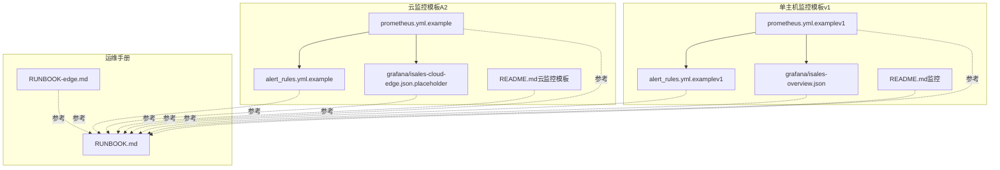
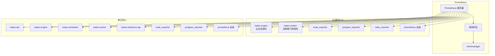
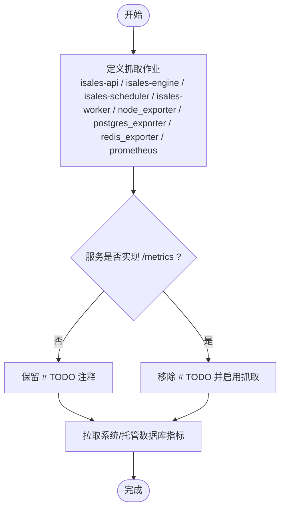
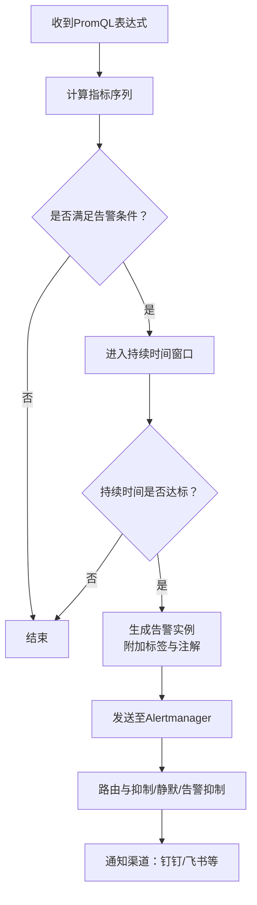
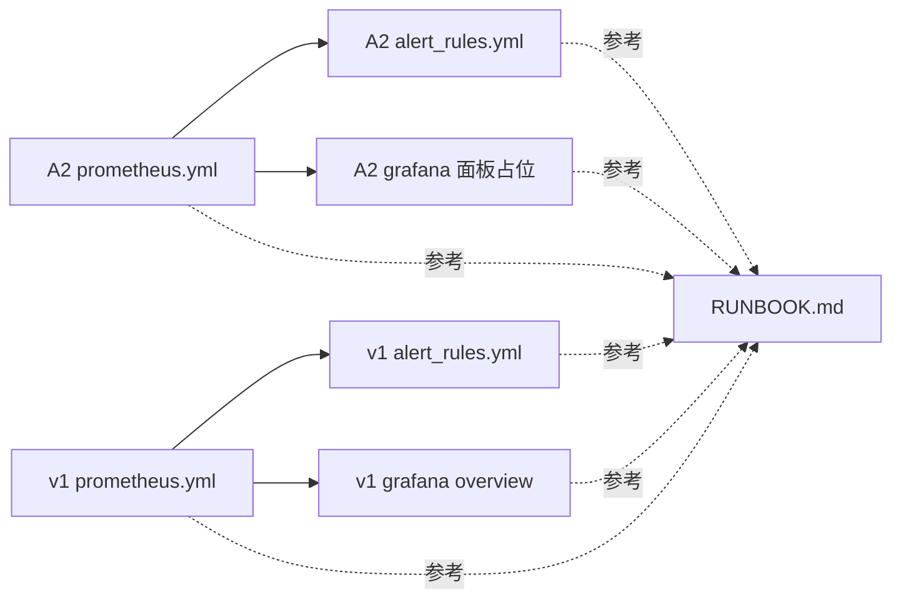

# 监控与告警

<cite>
**本文引用的文件**
- [prometheus.yml.example](file://deploy/cloud/monitoring/prometheus.yml.example)
- [alert_rules.yml.example](file://deploy/cloud/monitoring/alert_rules.yml.example)
- [isales-cloud-edge.json.placeholder](file://deploy/cloud/monitoring/grafana/isales-cloud-edge.json.placeholder)
- [README.md（云监控模板）](file://deploy/cloud/monitoring/README.md)
- [prometheus.yml.example（单主机 v1）](file://deploy/monitoring/prometheus.yml.example)
- [alert_rules.yml.example（单主机 v1）](file://deploy/monitoring/alert_rules.yml.example)
- [isales-overview.json](file://deploy/monitoring/grafana/isales-overview.json)
- [README.md（监控）](file://deploy/monitoring/README.md)
- [RUNBOOK.md](file://deploy/RUNBOOK.md)
- [RUNBOOK-edge.md](file://deploy/RUNBOOK-edge.md)
- [spec.md（部署拓扑）](file://openspec/changes/arch-cloud-edge-split/specs/deployment-topology/spec.md)
- [v1-roadmap.md](file://openspec/v1-roadmap.md)
- [ai-pipeline/spec.md](file://openspec/specs/ai-pipeline/spec.md)
</cite>

## 目录
1. [简介](#简介)
2. [项目结构](#项目结构)
3. [核心组件](#核心组件)
4. [架构总览](#架构总览)
5. [详细组件分析](#详细组件分析)
6. [依赖关系分析](#依赖关系分析)
7. [性能考量](#性能考量)
8. [故障排查指南](#故障排查指南)
9. [结论](#结论)
10. [附录](#附录)

## 简介
本指南面向iSales平台的监控与告警落地，覆盖Prometheus指标采集、Grafana仪表板、告警规则配置与通知渠道对接，以及云边专用监控指标、服务健康状态与资源使用监控。文档同时提供关键业务指标（QPS、响应时间、错误率、通话成功率、AI调用耗时等）的采集与展示建议，并给出告警阈值模板、通知渠道配置思路、长期存储与容量规划支撑方法。

## 项目结构
监控相关配置位于deploy目录下的cloud与common两套模板：
- 云边拓扑（A2）模板：deploy/cloud/monitoring
- 单主机（v1）模板：deploy/monitoring
- 边缘侧运维手册：deploy/RUNBOOK-edge.md
- 平台通用运维手册：deploy/RUNBOOK.md
- OpenSpec中关于监控的规范与指标约定：openspec/changes/arch-cloud-edge-split/specs/deployment-topology/spec.md、openspec/v1-roadmap.md、openspec/specs/ai-pipeline/spec.md

**图表来源**
- [prometheus.yml.example:1-77](file://deploy/cloud/monitoring/prometheus.yml.example#L1-L77)
- [alert_rules.yml.example:1-116](file://deploy/cloud/monitoring/alert_rules.yml.example#L1-L116)
- [isales-cloud-edge.json.placeholder:1-34](file://deploy/cloud/monitoring/grafana/isales-cloud-edge.json.placeholder#L1-L34)
- [README.md（云监控模板）:1-37](file://deploy/cloud/monitoring/README.md#L1-L37)
- [prometheus.yml.example（单主机 v1）:1-63](file://deploy/monitoring/prometheus.yml.example#L1-L63)
- [alert_rules.yml.example（单主机 v1）:1-77](file://deploy/monitoring/alert_rules.yml.example#L1-L77)
- [isales-overview.json:1-87](file://deploy/monitoring/grafana/isales-overview.json#L1-L87)
- [README.md（监控）:1-65](file://deploy/monitoring/README.md#L1-L65)
- [RUNBOOK.md:1-394](file://deploy/RUNBOOK.md#L1-L394)
- [RUNBOOK-edge.md:1-254](file://deploy/RUNBOOK-edge.md#L1-L254)

**章节来源**
- [README.md（云监控模板）:1-37](file://deploy/cloud/monitoring/README.md#L1-L37)
- [README.md（监控）:1-65](file://deploy/monitoring/README.md#L1-L65)

## 核心组件
- Prometheus采集配置
  - 云边拓扑（A2）：定义isales-api、isales-engine、isales-scheduler、isales-worker、node_exporter、postgres_exporter、redis_exporter、prometheus自身等抓取任务，标注尚未实现指标端点的服务。
  - 单主机（v1）：定义isales-api、isales-engine、isales-scheduler、isales-worker、isales-telephony-api、node_exporter、postgres_exporter、prometheus自身等抓取任务。
- 告警规则
  - 云边拓扑（A2）：覆盖边缘设备离线、频繁重连、ARTC推送缓冲满、会话数漂移、引擎管道首TTS延迟预算、回调失败率、PG连接压力等。
  - 单主机（v1）：覆盖engine:dial队列堆积、设备标记比例升高、回调失败率、PG连接压力等。
- Grafana仪表板
  - 云边拓扑（A2）：提供面板清单占位，建议基于模板构建实际仪表板。
  - 单主机（v1）：提供Overview仪表板JSON，包含在途通话、队列深度、接通率、服务错误日志等面板。
- 运维手册
  - RUNBOOK.md：部署、回滚、备份恢复、故障速查、预上线硬性门槛等。
  - RUNBOOK-edge.md：边缘侧首次配置、激活码与Device Token、发版回滚、离线buffer排查、网络与硬件诊断、日志位置与应急速查。

**章节来源**
- [prometheus.yml.example:1-77](file://deploy/cloud/monitoring/prometheus.yml.example#L1-L77)
- [alert_rules.yml.example:1-116](file://deploy/cloud/monitoring/alert_rules.yml.example#L1-L116)
- [isales-cloud-edge.json.placeholder:1-34](file://deploy/cloud/monitoring/grafana/isales-cloud-edge.json.placeholder#L1-L34)
- [prometheus.yml.example（单主机 v1）:1-63](file://deploy/monitoring/prometheus.yml.example#L1-L63)
- [alert_rules.yml.example（单主机 v1）:1-77](file://deploy/monitoring/alert_rules.yml.example#L1-L77)
- [isales-overview.json:1-87](file://deploy/monitoring/grafana/isales-overview.json#L1-L87)
- [RUNBOOK.md:1-394](file://deploy/RUNBOOK.md#L1-L394)
- [RUNBOOK-edge.md:1-254](file://deploy/RUNBOOK-edge.md#L1-L254)

## 架构总览
下图展示了Prometheus采集、Grafana可视化与Alertmanager告警的整体架构，以及云边拓扑（A2）与单主机（v1）两种部署形态的差异。

**图表来源**
- [prometheus.yml.example:17-77](file://deploy/cloud/monitoring/prometheus.yml.example#L17-L77)
- [prometheus.yml.example（单主机 v1）:17-63](file://deploy/monitoring/prometheus.yml.example#L17-L63)

## 详细组件分析

### Prometheus采集配置（云边拓扑A2）
- 采集目标
  - isales-engine：提供云边流计数、心跳时间、断线次数、ARTC会话数、推送音频缓冲满计数、引擎管道首TTS直方图等。
  - isales-worker：提供边缘离线计数、硬件告警计数等。
  - node_exporter、postgres_exporter、redis_exporter：系统与托管数据库指标。
  - prometheus自身：用于自监控。
- 关键说明
  - 未实现指标端点的服务以注释标注“TODO”，待服务落地后再启用。
  - 云边拓扑下，telephony-api与modem-controller不再纳入采集范围，边缘侧指标由边缘机自行上报或不汇总。

**图表来源**
- [prometheus.yml.example:17-77](file://deploy/cloud/monitoring/prometheus.yml.example#L17-L77)

**章节来源**
- [prometheus.yml.example:1-77](file://deploy/cloud/monitoring/prometheus.yml.example#L1-L77)
- [README.md（云监控模板）:9-37](file://deploy/cloud/monitoring/README.md#L9-L37)

### Prometheus采集配置（单主机v1）
- 采集目标
  - isales-api、isales-engine、isales-scheduler、isales-worker、isales-telephony-api、node_exporter、postgres_exporter、prometheus自身。
- 关键说明
  - 未实现指标端点的服务以注释标注“TODO”。
  - 该模板用于v1单主机部署形态，与A2拓扑存在差异。

**章节来源**
- [prometheus.yml.example（单主机 v1）:1-63](file://deploy/monitoring/prometheus.yml.example#L1-L63)
- [README.md（监控）:30-48](file://deploy/monitoring/README.md#L30-L48)

### 告警规则（云边拓扑A2）
- 告警主题
  - 云边流健康：边缘设备离线、频繁重连。
  - ARTC媒体平面：推送音频缓冲满、会话数漂移。
  - 引擎管道延迟预算：首TTS P95越线。
  - 回调失败率与PG连接压力：延续单主机模板中的关键指标。
- 阈值与窗口
  - 边缘离线：心跳超阈值即告警。
  - 频繁重连：5分钟内断线次数阈值。
  - 推送音频缓冲满：30秒窗口内触发次数阈值。
  - 会话数漂移：与活跃通话计数差异阈值。
  - 首TTS P95：按直方图分位数计算，结合设计文档的800ms预算。
  - 回调失败率：15分钟窗口内的失败占比阈值。
  - PG连接压力：连接数占最大连接数的比例阈值。

**图表来源**
- [alert_rules.yml.example:8-116](file://deploy/cloud/monitoring/alert_rules.yml.example#L8-L116)

**章节来源**
- [alert_rules.yml.example:1-116](file://deploy/cloud/monitoring/alert_rules.yml.example#L1-L116)
- [README.md（云监控模板）:24-25](file://deploy/cloud/monitoring/README.md#L24-L25)

### 告警规则（单主机v1）
- 告警主题
  - engine:dial队列堆积：持续超阈值。
  - 设备标记比例升高：1小时内比例突增。
  - 回调失败率：15分钟窗口内的失败占比阈值。
  - PG连接压力：连接数占最大连接数的比例阈值。
- 阈值与窗口
  - 队列堆积：固定阈值与持续时间。
  - 设备标记比例：分子分母比值阈值。
  - 回调失败率：固定阈值。
  - PG连接压力：固定阈值。

**章节来源**
- [alert_rules.yml.example（单主机 v1）:1-77](file://deploy/monitoring/alert_rules.yml.example#L1-L77)
- [README.md（监控）:30-48](file://deploy/monitoring/README.md#L30-L48)

### Grafana仪表板（云边拓扑A2）
- 面板清单（占位）
  - 云边流健康：在线设备数、心跳时间TopN、设备断线率。
  - ARTC媒体平面：活动会话数、推送音频缓冲满速率、加入失败日志。
  - 引擎管道延迟：首TTS P50/P95/P99（按阶段）、ASR部分延迟、LLM首Token延迟。
  - 基础设施：PG连接数/最大连接、Redis操作速率、ECS CPU/内存、网络吞吐。
- 建议
  - 在Grafana中按上述清单构建面板，选择合适的查询函数与聚合方式，确保与Prometheus抓取指标一致。

**章节来源**
- [isales-cloud-edge.json.placeholder:1-34](file://deploy/cloud/monitoring/grafana/isales-cloud-edge.json.placeholder#L1-L34)
- [README.md（云监控模板）:31-31](file://deploy/cloud/monitoring/README.md#L31-L31)

### Grafana仪表板（单主机v1）
- 面板清单
  - 在途通话（统计）
  - engine:dial队列深度（时间序列）
  - 过去1小时接通率（统计）
  - 过去1小时各服务错误日志计数（柱状）
- 建议
  - 使用Prometheus数据源，确保查询语法与指标命名一致。

**章节来源**
- [isales-overview.json:1-87](file://deploy/monitoring/grafana/isales-overview.json#L1-L87)
- [README.md（监控）:12-14](file://deploy/monitoring/README.md#L12-L14)

### 关键业务指标采集与展示建议
- QPS与响应时间
  - 通过服务端暴露的请求计数与持续时间直方图/摘要指标，结合rate/histogram_quantile等PromQL函数计算P50/P95/P99。
  - 建议在Grafana中分别展示请求速率与响应分位数，叠加错误率。
- 错误率
  - 通过失败计数与总请求计数的比率计算，或直接使用错误计数直方图。
- 通话成功率
  - 通过“已接通”与“尝试拨打”的比率计算，建议按小时窗口滚动。
- AI调用耗时
  - 结合AI三层管线（角色/裁判/润色）的首Token/首Byte延迟，参考设计文档的延迟预算，按阶段聚合展示。
- 云边专用监控指标
  - 边缘设备在线数、心跳时间、断线次数、推送音频缓冲满、会话数与活跃通话一致性、引擎首TTS P95等。
- 服务健康状态与资源使用
  - 使用node_exporter指标（CPU/内存/磁盘/网络）与postgres_exporter/redis_exporter指标，结合告警规则形成健康度画像。

**章节来源**
- [v1-roadmap.md:31-57](file://openspec/v1-roadmap.md#L31-L57)
- [ai-pipeline/spec.md:1-166](file://openspec/specs/ai-pipeline/spec.md#L1-L166)
- [prometheus.yml.example:31-36](file://deploy/cloud/monitoring/prometheus.yml.example#L31-L36)

## 依赖关系分析
- 云边拓扑（A2）与单主机（v1）的Prometheus抓取配置存在差异：A2移除了telephony-api与modem-controller，新增了引擎与看门狗指标；v1包含telephony-api与modem-controller。
- 告警规则与仪表板模板与Prometheus抓取配置强绑定，需保持指标名称与抓取端点一致。
- 运维手册对监控配置的安装、验证与硬性门槛有明确要求，需在部署前完成Prometheus配置与告警规则校验。

**图表来源**
- [prometheus.yml.example:1-77](file://deploy/cloud/monitoring/prometheus.yml.example#L1-L77)
- [alert_rules.yml.example:1-116](file://deploy/cloud/monitoring/alert_rules.yml.example#L1-L116)
- [isales-cloud-edge.json.placeholder:1-34](file://deploy/cloud/monitoring/grafana/isales-cloud-edge.json.placeholder#L1-L34)
- [prometheus.yml.example（单主机 v1）:1-63](file://deploy/monitoring/prometheus.yml.example#L1-L63)
- [alert_rules.yml.example（单主机 v1）:1-77](file://deploy/monitoring/alert_rules.yml.example#L1-L77)
- [isales-overview.json:1-87](file://deploy/monitoring/grafana/isales-overview.json#L1-L87)

**章节来源**
- [README.md（云监控模板）:9-37](file://deploy/cloud/monitoring/README.md#L9-L37)
- [README.md（监控）:1-65](file://deploy/monitoring/README.md#L1-L65)
- [RUNBOOK.md:200-217](file://deploy/RUNBOOK.md#L200-L217)

## 性能考量
- 采集与评估周期
  - 建议采集间隔与评估间隔保持一致，避免抖动与误报。
- 指标直方图与分位数
  - 使用histogram_quantile计算P95/P99，注意桶边界与采样窗口的选择。
- 延迟预算
  - 参考设计文档的800ms首TTS P95预算，结合引擎管道各阶段指标进行分层监控。
- 资源使用
  - 通过node_exporter与托管数据库exporter监控CPU/内存/网络/连接数，结合告警规则形成容量预警。

**章节来源**
- [v1-roadmap.md:31-57](file://openspec/v1-roadmap.md#L31-L57)
- [alert_rules.yml.example:71-86](file://deploy/cloud/monitoring/alert_rules.yml.example#L71-L86)

## 故障排查指南
- 预上线硬性门槛
  - 监控联系人建立：Prometheus配置已在监控主机部署；至少2条告警具备有意义的目标（其余可为TODO）。
  - 冒烟测试：导入10线索 campaigns，使用mock providers，确认call_record、transcript、worker callback_log与lead状态流转正常。
  - 值班轮值：明确谁响应告警及通知渠道。
- 常见症状与处置
  - API/telephony服务502：先直连探测服务健康端点，再检查对应服务状态。
  - engine:dial队列堆积：检查engine是否存活，查看队列长度与worker消费情况。
  - Redis OOM：检查内存使用与淘汰策略，必要时调整maxmemory。
  - modem-controller问题：检查USB事件、串口路径与SIM状态。
- 边缘侧排查
  - gRPC连通性：DNS/TCP/TLS握手与gRPC ping。
  - 离线buffer：查看SQLite事件表积压与seq范围。
  - 网络诊断：mtr追踪与WAN抖动监控。
  - 硬件诊断：串口列表与AT指令测试。

**章节来源**
- [RUNBOOK.md:200-217](file://deploy/RUNBOOK.md#L200-L217)
- [RUNBOOK.md:163-197](file://deploy/RUNBOOK.md#L163-L197)
- [RUNBOOK-edge.md:166-251](file://deploy/RUNBOOK-edge.md#L166-L251)

## 结论
通过云边拓扑与单主机两套监控模板，iSales实现了从服务健康、资源使用到云边专用指标与AI管道延迟预算的全链路监控。建议在部署前完成Prometheus配置与告警规则校验，按模板构建Grafana仪表板，并在预上线阶段落实监控联系人与冒烟测试。结合运维手册的硬性门槛与应急速查，可有效提升系统的可观测性与可维护性。

## 附录

### 告警规则模板与阈值建议（示例）
- 边缘设备离线
  - 表达式：心跳超阈值
  - 建议：120秒无心跳即告警，持续1分钟以上
- 频繁重连
  - 表达式：5分钟内断线次数阈值
  - 建议：>5次/5分钟
- 推送音频缓冲满
  - 表达式：30秒窗口内触发次数阈值
  - 建议：>3次/30秒
- 会话数漂移
  - 表达式：会话数与活跃通话差异绝对值
  - 建议：>1
- 首TTS P95
  - 表达式：直方图分位数计算
  - 建议：>800ms（结合设计文档预算）
- 回调失败率
  - 表达式：失败/尝试占比
  - 建议：>20%（15分钟窗口）
- PG连接压力
  - 表达式：当前连接/最大连接
  - 建议：>80%

**章节来源**
- [alert_rules.yml.example:14-116](file://deploy/cloud/monitoring/alert_rules.yml.example#L14-L116)
- [v1-roadmap.md:31-57](file://openspec/v1-roadmap.md#L31-L57)

### 通知渠道配置思路
- 告警通知
  - 在Alertmanager中配置钉钉/飞书Webhook，按严重级别路由到不同接收组。
  - 建议区分warning与critical，设置静默窗口与抑制规则，避免风暴。
- 验证
  - 使用promtool校验告警规则语法正确性。

**章节来源**
- [README.md（云监控模板）:32-32](file://deploy/cloud/monitoring/README.md#L32-L32)
- [README.md（监控）:51-57](file://deploy/monitoring/README.md#L51-L57)

### 长期存储与容量规划
- 长期存储
  - Prometheus可通过remote-write对接长期存储（如VictoriaMetrics、Thanos等），或使用Prometheus自身的远端存储能力。
- 容量规划
  - 基于历史峰值与增长趋势，估算指标数量、抓取间隔与存储空间需求。
  - 结合告警规则的分位数与窗口，设定合理的保留策略与压缩策略。

[本节为通用指导，无需特定文件引用]