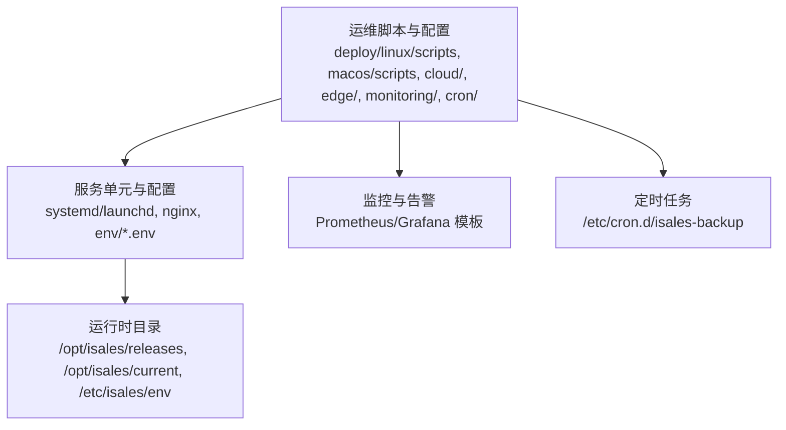
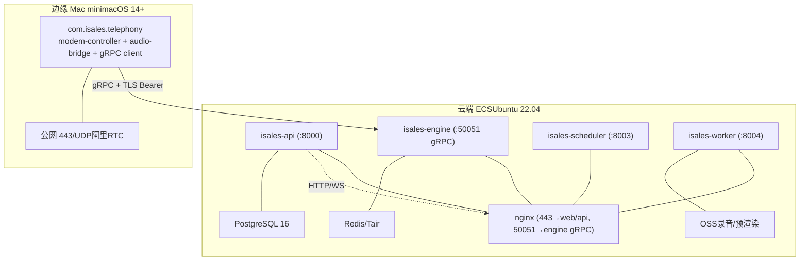
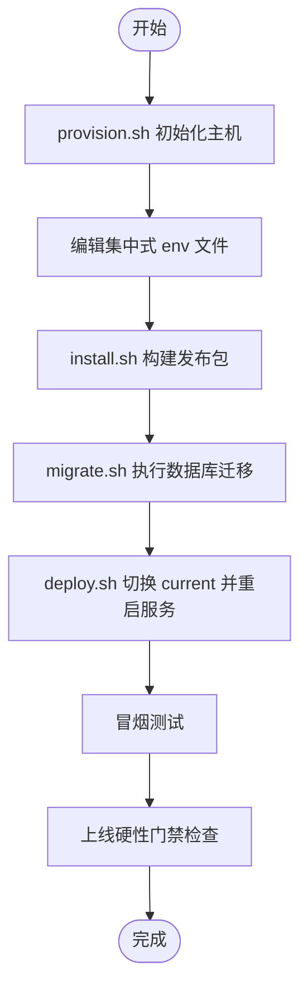
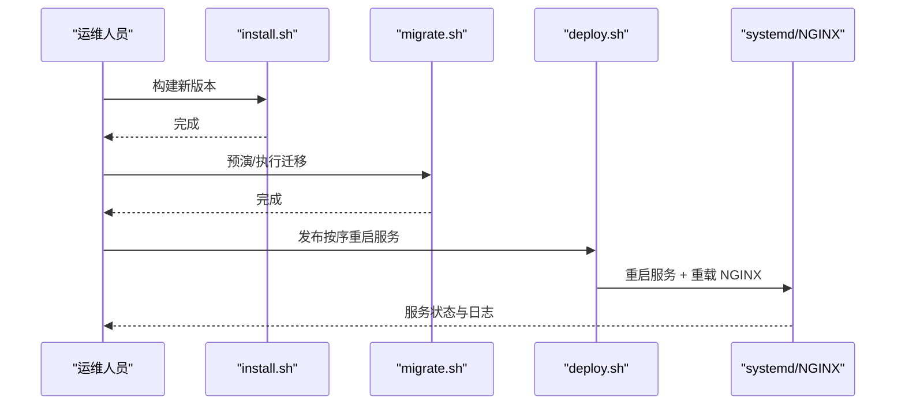
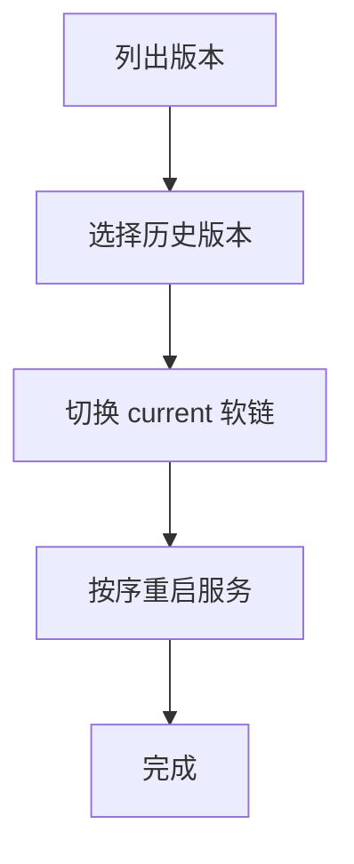
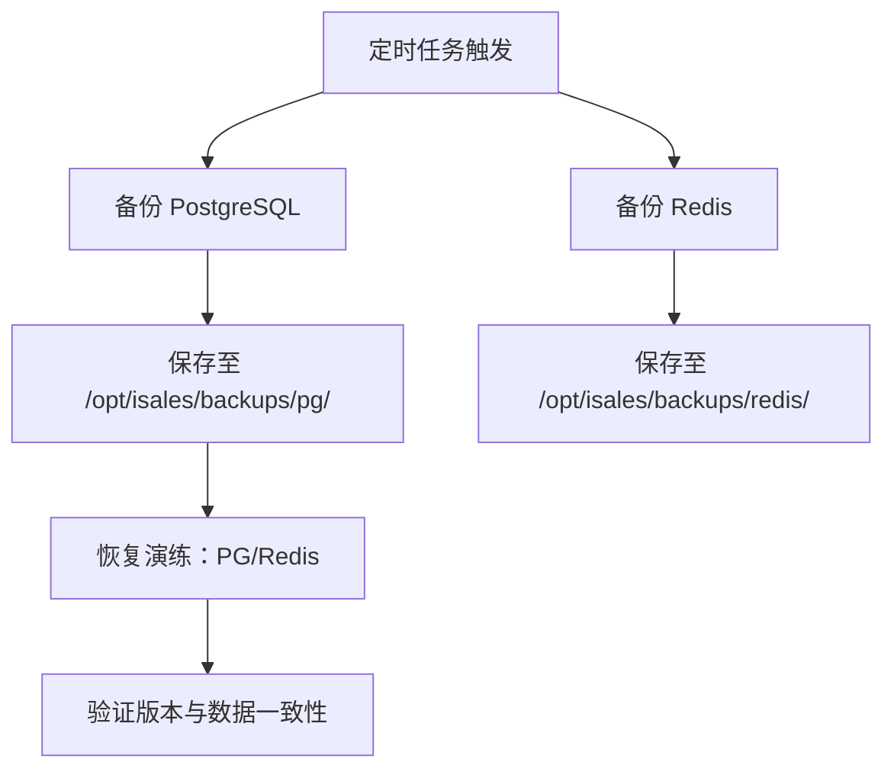
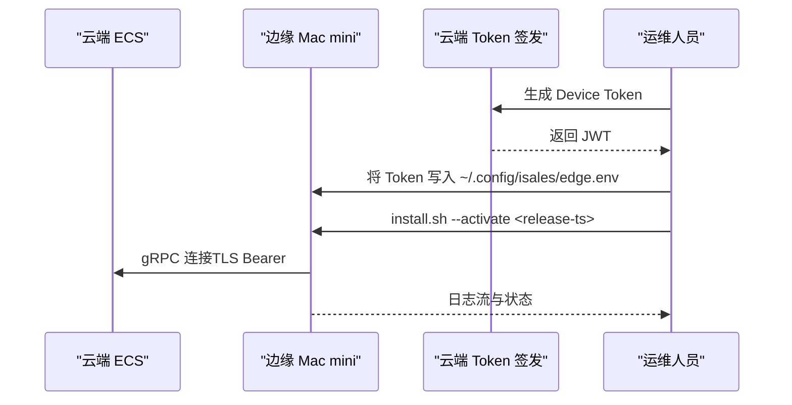
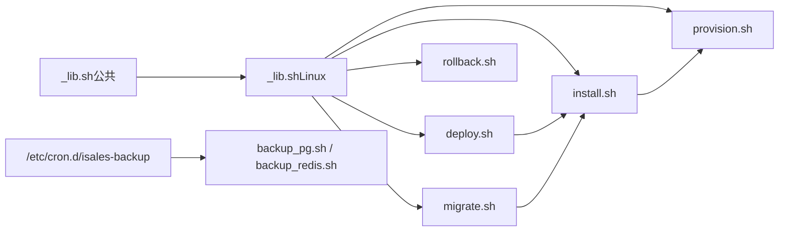
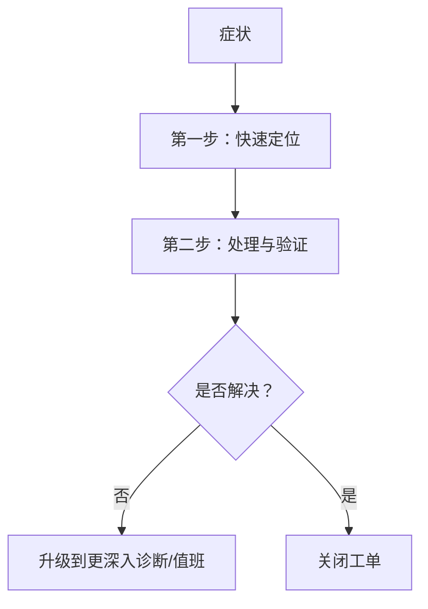

# 运维手册

<cite>
**本文引用的文件**
- [RUNBOOK.md](file://deploy/RUNBOOK.md)
- [RUNBOOK-edge.md](file://deploy/RUNBOOK-edge.md)
- [cloud/README.md](file://deploy/cloud/README.md)
- [edge/README.md](file://deploy/edge/README.md)
- [monitoring/README.md](file://deploy/monitoring/README.md)
- [linux/scripts/deploy.sh](file://deploy/linux/scripts/deploy.sh)
- [linux/scripts/rollback.sh](file://deploy/linux/scripts/rollback.sh)
- [linux/scripts/migrate.sh](file://deploy/linux/scripts/migrate.sh)
- [linux/scripts/install.sh](file://deploy/linux/scripts/install.sh)
- [linux/scripts/provision.sh](file://deploy/linux/scripts/provision.sh)
- [linux/scripts/check_env_consistency.py](file://deploy/linux/scripts/check_env_consistency.py)
- [_lib.sh（Linux）](file://deploy/linux/scripts/_lib.sh)
- [_lib.sh（公共）](file://deploy/common/_lib.sh)
- [cron/isales-backup.cron](file://deploy/cron/isales-backup.cron)
- [cloud/scripts/install.sh](file://deploy/cloud/scripts/install.sh)
</cite>

## 目录
1. [简介](#简介)
2. [项目结构](#项目结构)
3. [核心组件](#核心组件)
4. [架构总览](#架构总览)
5. [详细组件分析](#详细组件分析)
6. [依赖关系分析](#依赖关系分析)
7. [性能考虑](#性能考虑)
8. [故障排查指南](#故障排查指南)
9. [结论](#结论)
10. [附录](#附录)

## 简介
本运维手册面向iSales平台的生产运维与应急处置，覆盖首次上线、常规发布、回滚、备份恢复、故障排查、监控告警、安全加固与合规要求、灾备演练与应急响应等内容。手册同时提供Linux systemd与macOS launchd两种部署形态的操作指引，并对云-边分离拓扑下的云端与边缘侧运维流程进行说明。

## 项目结构
- 运维脚本集中在 deploy/ 下，按平台与场景划分：
  - linux/scripts：单主机Linux部署与运维脚本
  - macos/scripts：单主机macOS部署与运维脚本
  - cloud：云-边分离拓扑的云端侧部署与配置
  - edge：云-边分离拓扑的边缘侧部署与配置
  - monitoring：Prometheus/Grafana模板与说明
  - cron：定时备份计划
  - env：各服务环境变量示例模板
- 设计与规范文档位于 openspec/，用于指导架构与变更落地

**章节来源**
- [cloud/README.md:1-118](file://deploy/cloud/README.md#L1-L118)
- [edge/README.md:1-99](file://deploy/edge/README.md#L1-L99)
- [monitoring/README.md:1-65](file://deploy/monitoring/README.md#L1-L65)

## 核心组件
- provision.sh：一次性主机初始化，包括系统包、用户、目录、Redis AOF、PostgreSQL初始化与随机密钥生成
- install.sh：构建新版本发布包，克隆/更新7个仓库，创建共享虚拟环境，编译前端，同步systemd与nginx配置，写入环境变量drop-in，安装备份计划
- migrate.sh：在当前版本上执行数据库迁移（Alembic）
- deploy.sh：原子切换current软链并按序重启服务，支持低峰窗口与强制模式
- rollback.sh：回滚到历史版本，保持数据库schema不变
- check_env_consistency.py：校验env模板与服务README声明的变量一致性
- 备份与恢复：每日定时备份PG与Redis，支持恢复演练
- 监控与告警：Prometheus抓取与Grafana仪表盘模板，基础告警规则

**章节来源**
- [provision.sh:1-224](file://deploy/linux/scripts/provision.sh#L1-L224)
- [install.sh:1-275](file://deploy/linux/scripts/install.sh#L1-L275)
- [migrate.sh:1-61](file://deploy/linux/scripts/migrate.sh#L1-L61)
- [deploy.sh:1-139](file://deploy/linux/scripts/deploy.sh#L1-L139)
- [rollback.sh:1-114](file://deploy/linux/scripts/rollback.sh#L1-L114)
- [check_env_consistency.py:1-161](file://deploy/linux/scripts/check_env_consistency.py#L1-L161)
- [cron/isales-backup.cron:1-14](file://deploy/cron/isales-backup.cron#L1-L14)
- [monitoring/README.md:1-65](file://deploy/monitoring/README.md#L1-L65)

## 架构总览
iSales提供两种部署形态：
- 单主机形态（Linux systemd / macOS launchd）：api、engine、scheduler、worker、telephony-api、modem-controller在同一主机
- 云-边分离形态（A2）：云端ECS仅运行api/engine/scheduler/worker/web（无硬件耦合），边缘Mac mini运行telephony（包含modem-controller与audio-bridge），通过gRPC与云端交互

**图表来源**
- [cloud/README.md:10-53](file://deploy/cloud/README.md#L10-L53)
- [edge/README.md:10-40](file://deploy/edge/README.md#L10-L40)

**章节来源**
- [cloud/README.md:1-118](file://deploy/cloud/README.md#L1-L118)
- [edge/README.md:1-99](file://deploy/edge/README.md#L1-L99)

## 详细组件分析

### 首次上线（Linux systemd）
- 准备主机：apt包、用户、目录、Redis AOF、PostgreSQL初始化与随机密钥注入
- 编辑集中式env文件（设置管理员账号与密码哈希）
- 安装首版发布：克隆7仓库、创建共享虚拟环境、编译前端、同步systemd/NGINX、写入环境变量drop-in、安装备份计划
- 数据库迁移：执行Alembic升级
- 切换current并重启服务：按序重启telephony-api→scheduler→worker→engine→api，nginx重载
- 冒烟测试：访问健康检查与首页
- 上线硬性门禁：完成备份恢复演练、至少一次完整的install→deploy→rollback→deploy循环、监控接入、冒烟测试通过、值班安排到位

**图表来源**
- [provision.sh:1-224](file://deploy/linux/scripts/provision.sh#L1-L224)
- [install.sh:1-275](file://deploy/linux/scripts/install.sh#L1-L275)
- [migrate.sh:1-61](file://deploy/linux/scripts/migrate.sh#L1-L61)
- [deploy.sh:1-139](file://deploy/linux/scripts/deploy.sh#L1-L139)
- [RUNBOOK.md:17-52](file://deploy/RUNBOOK.md#L17-L52)

**章节来源**
- [RUNBOOK.md:17-52](file://deploy/RUNBOOK.md#L17-L52)
- [provision.sh:1-224](file://deploy/linux/scripts/provision.sh#L1-L224)
- [install.sh:1-275](file://deploy/linux/scripts/install.sh#L1-L275)
- [migrate.sh:1-61](file://deploy/linux/scripts/migrate.sh#L1-L61)
- [deploy.sh:1-139](file://deploy/linux/scripts/deploy.sh#L1-L139)

### 常规发布（Linux systemd）
- 在主机构建新版本发布
- 可选预演迁移（dry-run）
- 执行迁移
- 按序发布：telephony-api→scheduler→worker→engine→api，nginx重载
- 验证：查看最近日志与systemd状态

**图表来源**
- [install.sh:1-275](file://deploy/linux/scripts/install.sh#L1-L275)
- [migrate.sh:1-61](file://deploy/linux/scripts/migrate.sh#L1-L61)
- [deploy.sh:1-139](file://deploy/linux/scripts/deploy.sh#L1-L139)

**章节来源**
- [RUNBOOK.md:56-81](file://deploy/RUNBOOK.md#L56-L81)
- [deploy.sh:1-139](file://deploy/linux/scripts/deploy.sh#L1-L139)

### 回滚（Linux systemd）
- 列出可用版本
- 选择历史版本回滚
- 原子切换current并按序重启服务
- 注意：不触碰数据库schema；如需降级，请参考手册“回滚schema”章节

**图表来源**
- [rollback.sh:1-114](file://deploy/linux/scripts/rollback.sh#L1-L114)
- [deploy.sh:1-139](file://deploy/linux/scripts/deploy.sh#L1-L139)

**章节来源**
- [RUNBOOK.md:84-115](file://deploy/RUNBOOK.md#L84-L115)
- [rollback.sh:1-114](file://deploy/linux/scripts/rollback.sh#L1-L114)

### 备份与恢复演练
- 备份计划：每日02:30执行PG与Redis备份，输出至/opt/isales/backups/，保留14天
- PG恢复演练：新建测试库，恢复快照，验证alembic版本与表计数
- Redis恢复演练：停止服务、替换dump.rdb、启动服务，验证dbsize与键空间

**图表来源**
- [cron/isales-backup.cron:1-14](file://deploy/cron/isales-backup.cron#L1-L14)
- [RUNBOOK.md:118-159](file://deploy/RUNBOOK.md#L118-L159)

**章节来源**
- [cron/isales-backup.cron:1-14](file://deploy/cron/isales-backup.cron#L1-L14)
- [RUNBOOK.md:118-159](file://deploy/RUNBOOK.md#L118-L159)

### 云-边分离（A2）运维
- 云端ECS：仅运行api/engine/scheduler/worker/web，nginx反代443与50051，托管RDS/Redis/OSS
- 边缘Mac mini：运行com.isales.telephony（modem-controller + audio-bridge + gRPC client），通过公网443/UDP与云端通信
- 边缘侧首次配置：Homebrew/Python/目录准备、clone元仓库、安装发布、编辑edge.env（设备ID/Token/Cloud URL）、注册并启动LaunchAgent
- 激活码与Device Token：云端CLI签发静态JWT，边缘写入edge.env并重启服务
- 常规发版/回滚：边缘侧install→install --activate（或rollback），软链切换+launchctl重启
- 离线buffer排查：SQLite事件缓冲区，支持查看积压与异常清理流程
- 网络诊断：DNS/TCP/SSL握手/gRPC ping；WAN抖动监控
- 硬件诊断：串口列表、AT指令、modem切换
- 日志位置：Unified Log、业务日志、SQLite缓冲、录音目录

**图表来源**
- [cloud/README.md:10-53](file://deploy/cloud/README.md#L10-L53)
- [edge/README.md:10-40](file://deploy/edge/README.md#L10-L40)
- [RUNBOOK-edge.md:21-66](file://deploy/RUNBOOK-edge.md#L21-L66)
- [RUNBOOK-edge.md:72-106](file://deploy/RUNBOOK-edge.md#L72-L106)

**章节来源**
- [cloud/README.md:1-118](file://deploy/cloud/README.md#L1-118)
- [edge/README.md:1-99](file://deploy/edge/README.md#L1-99)
- [RUNBOOK-edge.md:1-254](file://deploy/RUNBOOK-edge.md#L1-L254)

### 环境变量一致性校验
- 校验deploy/env/<service>.env.example与各服务README声明的环境变量是否一致
- 允许模板中的额外变量（如调试开关、系统变量），但必须确保必需变量齐全
- 通过make deploy-check集成该检查

**章节来源**
- [check_env_consistency.py:1-161](file://deploy/linux/scripts/check_env_consistency.py#L1-L161)

## 依赖关系分析
- 脚本依赖关系
  - Linux公共库：提供日志、参数解析、权限校验、文件写入、环境变量引导等通用能力
  - Linux专用库：定义apt包列表、env模板目录等
  - install.sh依赖provision.sh生成的基础环境
  - deploy.sh依赖install.sh完成的systemd/NGINX配置
  - migrate.sh读取/etcs/isales/env/*.env中的数据库URL
  - 备份计划cron调用backup_pg.sh与backup_redis.sh（脚本路径来自current）

**图表来源**
- [_lib.sh（公共）:1-181](file://deploy/common/_lib.sh#L1-L181)
- [_lib.sh（Linux）:1-47](file://deploy/linux/scripts/_lib.sh#L1-L47)
- [provision.sh:1-224](file://deploy/linux/scripts/provision.sh#L1-L224)
- [install.sh:1-275](file://deploy/linux/scripts/install.sh#L1-L275)
- [deploy.sh:1-139](file://deploy/linux/scripts/deploy.sh#L1-L139)
- [migrate.sh:1-61](file://deploy/linux/scripts/migrate.sh#L1-L61)
- [rollback.sh:1-114](file://deploy/linux/scripts/rollback.sh#L1-L114)
- [cron/isales-backup.cron:1-14](file://deploy/cron/isales-backup.cron#L1-L14)

**章节来源**
- [_lib.sh（公共）:1-181](file://deploy/common/_lib.sh#L1-L181)
- [_lib.sh（Linux）:1-47](file://deploy/linux/scripts/_lib.sh#L1-L47)
- [provision.sh:1-224](file://deploy/linux/scripts/provision.sh#L1-L224)
- [install.sh:1-275](file://deploy/linux/scripts/install.sh#L1-L275)
- [deploy.sh:1-139](file://deploy/linux/scripts/deploy.sh#L1-L139)
- [migrate.sh:1-61](file://deploy/linux/scripts/migrate.sh#L1-L61)
- [rollback.sh:1-114](file://deploy/linux/scripts/rollback.sh#L1-L114)
- [cron/isales-backup.cron:1-14](file://deploy/cron/isales-backup.cron#L1-L14)

## 性能考虑
- 低峰窗口发布：engine重启会中断活跃通话，默认22:00–08:00，非此时间段需加--force
- 服务重启顺序：严格遵循拓扑依赖，先上游后下游，减少重启抖动
- Redis持久化：启用AOF每秒刷盘，兼顾性能与可靠性
- 数据库连接：合理设置连接池与超时，避免峰值阻塞
- 前端构建：Node.js版本与npm缓存优化，缩短构建时间
- 云-边链路：公网443/UDP，关注RTT与丢包；边缘侧WAN链路监控

**章节来源**
- [deploy.sh:15-16](file://deploy/linux/scripts/deploy.sh#L15-L16)
- [provision.sh:97-127](file://deploy/linux/scripts/provision.sh#L97-L127)
- [cloud/README.md:55-65](file://deploy/cloud/README.md#L55-L65)

## 故障排查指南
- PostgreSQL连接被拒：检查postgresql服务状态、磁盘空间、日志
- Redis内存溢出：查看内存信息，调整maxmemory或淘汰策略
- modem-controller设备断连：检查udev事件、USB重插、服务日志
- modem-controller启动报缺少串口：核对env中的串口路径，Linux需udev规则，macOS使用/dev/cu.usbmodem*
- engine拨号队列堆积：检查engine:dial长度，确认engine服务状态
- worker Celery卡住：查看active任务、engine:worker:call-ended列表
- nginx 502（/api/）：直连127.0.0.1:8000健康检查，确认api服务状态
- nginx 502（/ws/）：WebSocket工作进程设计为1，不应增加
- API登录失败：核对api.env中的管理员密码哈希
- api↔telephony-api JWT不匹配：确保ISALES_JWT_SECRET一致并重新部署
- 备份计划未运行：检查cron状态与日志标签isales-backup

**图表来源**
- [RUNBOOK.md:163-197](file://deploy/RUNBOOK.md#L163-L197)

**章节来源**
- [RUNBOOK.md:163-197](file://deploy/RUNBOOK.md#L163-L197)

## 结论
本手册提供了iSales从首次上线到日常发布的完整运维流程，覆盖Linux与macOS两种平台，以及云-边分离形态下的云端与边缘侧操作。通过标准化的发布顺序、严格的低峰窗口、完善的备份恢复演练与监控告警，可显著降低发布风险与故障影响。建议将手册流程纳入CI/CD与值班SOP，持续完善应急响应与灾备预案。

## 附录

### 生产最佳实践
- 强制使用低峰窗口发布，必要时经审批使用--force
- 发布前完成备份恢复演练与冒烟测试
- 严格管理环境变量，定期执行一致性校验
- 保持监控接入与告警阈值有效
- 对关键变更进行灰度与回滚准备

### 安全加固与合规
- 环境变量权限：/etc/isales/env/* 使用0640权限，仅root与isales组可读
- 管理员凭据：禁止在生产使用mock模式开关，确保密码哈希正确
- 设备串口：Linux需udev规则，macOS注意系统服务占用串口
- TLS与gRPC：云端TLS终止与Bearer校验，边缘侧Token轮换

**章节来源**
- [provision.sh:179-186](file://deploy/linux/scripts/provision.sh#L179-L186)
- [RUNBOOK.md:169-171](file://deploy/RUNBOOK.md#L169-L171)
- [RUNBOOK-edge.md:90-106](file://deploy/RUNBOOK-edge.md#L90-L106)

### 应急响应与灾备
- 应急联系人与值班轮换
- 至少每季度执行备份恢复演练
- 回滚schema流程：在确认数据安全前提下谨慎降级
- 云-边链路中断：利用自动重连与边缘SQLite缓冲，尽快恢复

**章节来源**
- [RUNBOOK.md:200-217](file://deploy/RUNBOOK.md#L200-L217)
- [RUNBOOK.md:97-115](file://deploy/RUNBOOK.md#L97-L115)
- [RUNBOOK-edge.md:136-165](file://deploy/RUNBOOK-edge.md#L136-L165)

### 跨仓测试与部署一致性
- 跨仓克隆：install.sh统一克隆7个仓库，确保版本一致性
- 部署一致性：通过EnvironmentFile drop-in集中化管理env，避免单位文件散落
- 环境变量一致性：check_env_consistency.py自动比对模板与README声明

**章节来源**
- [install.sh:93-102](file://deploy/linux/scripts/install.sh#L93-L102)
- [install.sh:196-236](file://deploy/linux/scripts/install.sh#L196-L236)
- [check_env_consistency.py:118-157](file://deploy/linux/scripts/check_env_consistency.py#L118-L157)

### 运维工具与自动化
- provision.sh：一次性初始化，幂等
- install.sh：构建发布、同步systemd/NGINX、写入env drop-in、安装备份计划
- migrate.sh：Alembic迁移
- deploy.sh：原子切换与按序重启
- rollback.sh：回滚到历史版本
- cron备份：每日定时备份PG/Redis
- 监控模板：Prometheus抓取与Grafana仪表盘

**章节来源**
- [provision.sh:1-224](file://deploy/linux/scripts/provision.sh#L1-L224)
- [install.sh:1-275](file://deploy/linux/scripts/install.sh#L1-L275)
- [migrate.sh:1-61](file://deploy/linux/scripts/migrate.sh#L1-L61)
- [deploy.sh:1-139](file://deploy/linux/scripts/deploy.sh#L1-L139)
- [rollback.sh:1-114](file://deploy/linux/scripts/rollback.sh#L1-L114)
- [cron/isales-backup.cron:1-14](file://deploy/cron/isales-backup.cron#L1-L14)
- [monitoring/README.md:1-65](file://deploy/monitoring/README.md#L1-L65)