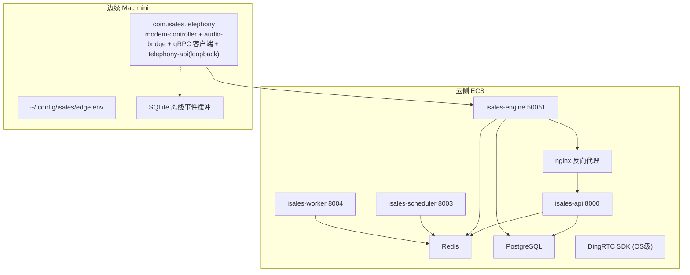
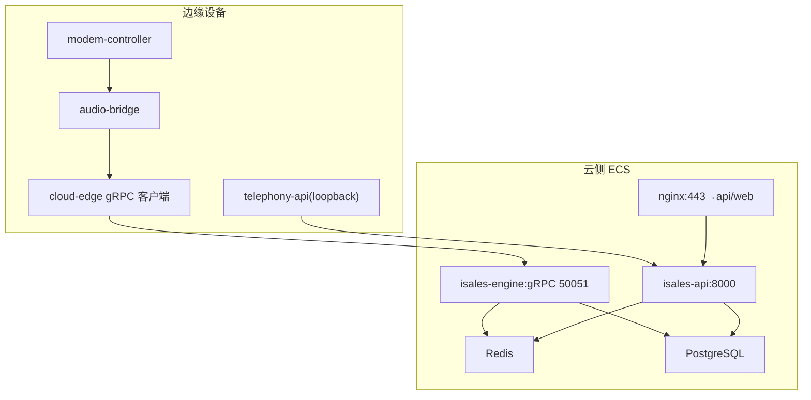
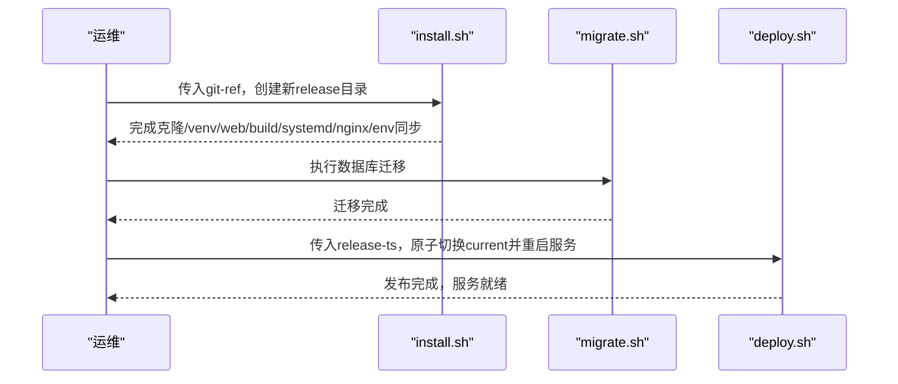
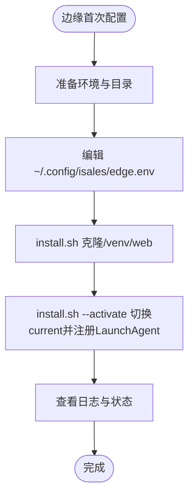
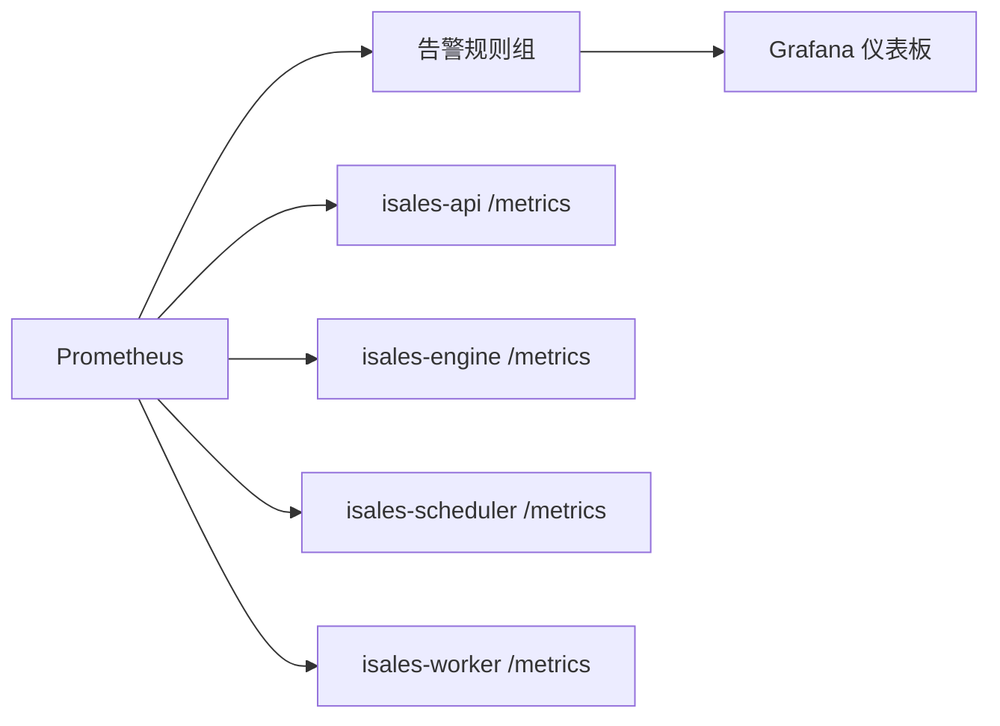
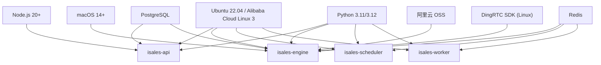
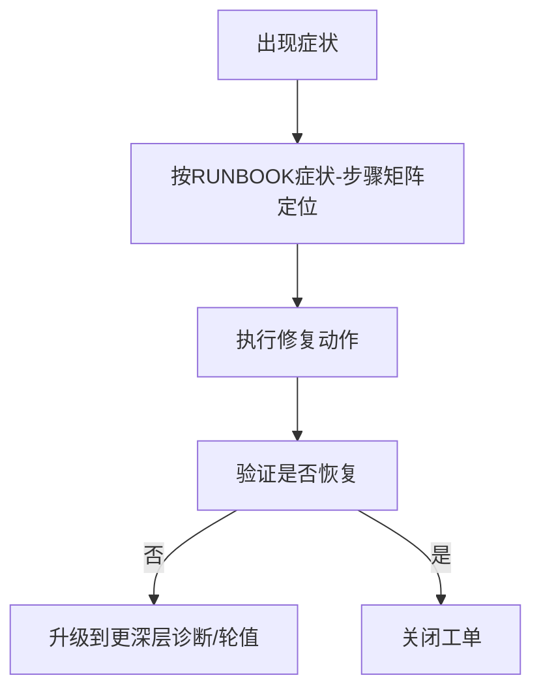

# 部署与运维

<cite>
**本文引用的文件**
- [deploy/cloud/README.md](file://deploy/cloud/README.md)
- [deploy/edge/README.md](file://deploy/edge/README.md)
- [deploy/RUNBOOK.md](file://deploy/RUNBOOK.md)
- [deploy/RUNBOOK-edge.md](file://deploy/RUNBOOK-edge.md)
- [deploy/cloud/STATE.md](file://deploy/cloud/STATE.md)
- [deploy/cloud/env/README.md](file://deploy/cloud/env/README.md)
- [deploy/monitoring/README.md](file://deploy/monitoring/README.md)
- [deploy/cloud/monitoring/prometheus.yml.example](file://deploy/cloud/monitoring/prometheus.yml.example)
- [deploy/cloud/monitoring/alert_rules.yml.example](file://deploy/cloud/monitoring/alert_rules.yml.example)
- [deploy/cloud/monitoring/grafana/isales-cloud-edge.json.placeholder](file://deploy/cloud/monitoring/grafana/isales-cloud-edge.json.placeholder)
- [deploy/cloud/scripts/install.sh](file://deploy/cloud/scripts/install.sh)
- [deploy/cloud/scripts/rollback.sh](file://deploy/cloud/scripts/rollback.sh)
- [deploy/linux/scripts/install.sh](file://deploy/linux/scripts/install.sh)
- [deploy/linux/scripts/deploy.sh](file://deploy/linux/scripts/deploy.sh)
- [deploy/linux/scripts/rollback.sh](file://deploy/linux/scripts/rollback.sh)
</cite>

## 目录
1. [简介](#简介)
2. [项目结构](#项目结构)
3. [核心组件](#核心组件)
4. [架构总览](#架构总览)
5. [详细组件分析](#详细组件分析)
6. [依赖关系分析](#依赖关系分析)
7. [性能考量](#性能考量)
8. [故障排查指南](#故障排查指南)
9. [结论](#结论)
10. [附录](#附录)

## 简介
本指南面向iSales平台的部署与运维团队，覆盖单主机部署（Linux systemd与macOS launchd）与云-边分离部署（A2变更）的完整流程。内容包括环境变量配置、依赖安装、服务启动与监控设置，以及Prometheus指标、Grafana仪表板与告警规则的配置思路。同时提供日常运维操作：首次上线、常规发布、回滚、备份恢复、故障排查等，并总结生产环境最佳实践与安全注意事项，最后给出跨仓测试与部署一致性校验的质量保障流程。

## 项目结构
iSales采用“多仓”与“统一部署脚本”的组织方式，核心部署与运维相关目录如下：
- deploy/cloud：云侧（阿里云ECS）部署脚本、systemd单元、nginx配置、环境变量模板与监控模板
- deploy/edge：边缘侧（Mac mini）部署脚本、launchd作业、环境变量模板与运维手册
- deploy/linux/scripts：单主机（Linux）部署脚本族（install/deploy/rollback/migrate等）
- deploy/monitoring：监控模板（Prometheus/Grafana/告警）
- deploy/cloud/monitoring：云-边拓扑专用监控模板
- deploy/cloud/env：云侧真实环境变量与密钥管理说明
- deploy/cloud/STATE.md：当前云侧部署快照与决策说明
- deploy/RUNBOOK.md / deploy/RUNBOOK-edge.md：运维手册（含硬性门禁、排障、演练）

图示来源
- [deploy/cloud/README.md:10-53](file://deploy/cloud/README.md#L10-L53)
- [deploy/edge/README.md:10-40](file://deploy/edge/README.md#L10-L40)

章节来源
- [deploy/cloud/README.md:1-118](file://deploy/cloud/README.md#L1-L118)
- [deploy/edge/README.md:1-99](file://deploy/edge/README.md#L1-L99)
- [deploy/cloud/STATE.md:19-352](file://deploy/cloud/STATE.md#L19-L352)

## 核心组件
- 云侧服务（4个无硬件耦合服务）：api、engine、scheduler、worker，均由systemd托管，nginx反向代理对外访问
- 边缘服务（单一LaunchAgent）：com.isales.telephony，承载modem-controller、audio-bridge、cloud-edge gRPC客户端与telephony-api loopback
- 中间件：PostgreSQL、Redis、阿里云托管资源（RDS/Redis/OSS），以及DingRTC SDK（云侧OS级vendor）
- 监控：Prometheus抓取云侧各服务与节点/数据库导出器；Grafana导入仪表板；告警规则覆盖云-边流健康、媒体平面、引擎流水线延迟等

章节来源
- [deploy/cloud/README.md:15-52](file://deploy/cloud/README.md#L15-L52)
- [deploy/edge/README.md:15-40](file://deploy/edge/README.md#L15-L40)
- [deploy/monitoring/README.md:8-48](file://deploy/monitoring/README.md#L8-L48)

## 架构总览
云-边分离拓扑下，边缘设备通过公网（443/TCP + UDP）与云侧engine建立双向gRPC通道，engine负责实时通话编排与媒体面（DingRTC SDK）处理，api提供Web管理后台与鉴权，scheduler/worker分别负责外呼调度与后处理回调。

图示来源
- [deploy/edge/README.md:15-40](file://deploy/edge/README.md#L15-L40)
- [deploy/cloud/README.md:15-31](file://deploy/cloud/README.md#L15-L31)

## 详细组件分析

### 云侧部署（Linux systemd）
- 安装流程：clone多仓 → 创建共享虚拟环境 → 构建isales-web → 同步systemd单元与环境文件drop-in → 同步nginx配置 → 安装备份cron
- 发布流程：install.sh生成新release → migrate.sh执行数据库迁移 → deploy.sh原子切换current软链并按序重启服务（engine重启会中断通话）
- 回滚流程：rollback.sh切换current软链并重启服务，不触碰数据库schema
- 环境变量：集中于/etc/isales/env/*.env，各service通过EnvironmentFile drop-in加载
- 监控：提供Prometheus/Grafana/告警模板，待各服务实现/metrics端点

图示来源
- [deploy/cloud/scripts/install.sh:282-297](file://deploy/cloud/scripts/install.sh#L282-L297)
- [deploy/linux/scripts/install.sh:259-272](file://deploy/linux/scripts/install.sh#L259-L272)
- [deploy/linux/scripts/deploy.sh:130-136](file://deploy/linux/scripts/deploy.sh#L130-L136)

章节来源
- [deploy/cloud/scripts/install.sh:1-300](file://deploy/cloud/scripts/install.sh#L1-L300)
- [deploy/cloud/scripts/rollback.sh:1-114](file://deploy/cloud/scripts/rollback.sh#L1-L114)
- [deploy/cloud/env/README.md:12-47](file://deploy/cloud/env/README.md#L12-L47)

### 边缘部署（macOS launchd）
- 安装流程：一次性准备环境 → 编辑用户级edge.env → install.sh克隆/venv/web → install.sh --activate切换并注册LaunchAgent
- 设备令牌：云端CLI签发JWT，边缘写入edge.env并重启LaunchAgent生效
- 离线缓冲：SQLite events表在断网时暂存事件，重连后按序补发
- 网络诊断：DNS/TCP/SSL握手/gRPC ping三段验证；WAN稳定性可用mtr观测
- 硬件诊断：串口列表/手动AT指令/切换串口路径

图示来源
- [deploy/RUNBOOK-edge.md:21-66](file://deploy/RUNBOOK-edge.md#L21-L66)

章节来源
- [deploy/RUNBOOK-edge.md:1-254](file://deploy/RUNBOOK-edge.md#L1-L254)

### 监控与告警（Prometheus/Grafana）
- Prometheus抓取：云侧各服务/metrics端点（待实现）；节点exporter、postgres_exporter、redis_exporter
- Grafana仪表板：提供概览面板清单（云-边流健康、媒体平面、引擎流水线延迟、基础设施）
- 告警规则：边缘离线/频繁重连、push_audio缓冲满、会话数漂移、首TTS延迟预算、回调失败率、PG连接压力等

图示来源
- [deploy/cloud/monitoring/prometheus.yml.example:17-77](file://deploy/cloud/monitoring/prometheus.yml.example#L17-L77)
- [deploy/cloud/monitoring/alert_rules.yml.example:8-116](file://deploy/cloud/monitoring/alert_rules.yml.example#L8-L116)
- [deploy/cloud/monitoring/grafana/isales-cloud-edge.json.placeholder:1-34](file://deploy/cloud/monitoring/grafana/isales-cloud-edge.json.placeholder#L1-L34)

章节来源
- [deploy/monitoring/README.md:8-65](file://deploy/monitoring/README.md#L8-L65)
- [deploy/cloud/monitoring/prometheus.yml.example:1-77](file://deploy/cloud/monitoring/prometheus.yml.example#L1-L77)
- [deploy/cloud/monitoring/alert_rules.yml.example:1-116](file://deploy/cloud/monitoring/alert_rules.yml.example#L1-L116)

## 依赖关系分析
- 云侧依赖：Ubuntu 22.04（或Alibaba Cloud Linux 3）+ Python 3.11/3.12（按脚本适配）+ Node.js 20+（构建web）+ 系统包nginx/git/pkg-config/curl/ca-certificates/unzip
- 边缘依赖：macOS 14+ + Homebrew + Python 3.12 + GSM modem驱动
- 中间件：PostgreSQL 13/16兼容、Redis 6.2、阿里云托管RDS/Redis/OSS
- 云侧服务：api/engine/scheduler/worker四类，engine负责gRPC控制面与媒体面，api提供HTTP/WebSocket，scheduler/worker处理队列与回调
- 边缘服务：单一LaunchAgent承载modem/audio/telephony-api与gRPC客户端

图示来源
- [deploy/cloud/README.md:55-67](file://deploy/cloud/README.md#L55-L67)
- [deploy/edge/README.md:44-53](file://deploy/edge/README.md#L44-L53)

章节来源
- [deploy/cloud/README.md:55-67](file://deploy/cloud/README.md#L55-L67)
- [deploy/edge/README.md:44-53](file://deploy/edge/README.md#L44-L53)

## 性能考量
- 低峰窗口发布：engine重启会中断通话，应在22:00–08:00（默认）执行，否则需强制通过
- 云-边gRPC空闲超时：需确保安全组/负载均衡无上游空闲清理，必要时调整七层HTTP/2空闲超时
- 媒体面缓冲：push_audio缓冲满告警指示TTS拉取速率超过SDK编码/发送能力，需评估云-边链路与引擎提供商性能
- 首TTS延迟预算：端到端首TTS P95超过800ms触发告警，应优先检查供应商延迟并考虑降级策略
- 资源规划：ECS 8C8G满足PoC，后续根据负载测试结果扩容

章节来源
- [deploy/RUNBOOK.md:56-81](file://deploy/RUNBOOK.md#L56-L81)
- [deploy/cloud/STATE.md:507-526](file://deploy/cloud/STATE.md#L507-L526)
- [deploy/cloud/monitoring/alert_rules.yml.example:71-86](file://deploy/cloud/monitoring/alert_rules.yml.example#L71-L86)

## 故障排查指南
- 通用排障：使用RUNBOOK中的症状-步骤矩阵快速定位；常用命令：systemctl/status/journalctl/redis-cli/psql
- 云侧：PostgreSQL/Redis连接问题、engine队列堆积、worker回调卡住、nginx 502、JWT鉴权失败、备份任务未运行
- 边缘：LaunchAgent无法启动、gRPC重连失败、拨号dial_ack失败、音频质量差、离线缓冲堆积、升级后启动崩溃
- 硬性门禁：首次部署完成、PG/Redis恢复演练通过、至少一次完整install→deploy→rollback→deploy循环、监控已部署且至少2条告警有意义、冒烟测试通过、在投轮值建立

图示来源
- [deploy/RUNBOOK.md:163-197](file://deploy/RUNBOOK.md#L163-L197)
- [deploy/RUNBOOK-edge.md:241-254](file://deploy/RUNBOOK-edge.md#L241-L254)

章节来源
- [deploy/RUNBOOK.md:163-217](file://deploy/RUNBOOK.md#L163-L217)
- [deploy/RUNBOOK-edge.md:241-254](file://deploy/RUNBOOK-edge.md#L241-L254)

## 结论
iSales提供了完善的云-边分离部署与运维框架：清晰的发布流程、严格的低峰窗口策略、完善的监控与告警、详尽的排障手册与硬性门禁。遵循本文档的步骤与最佳实践，可在生产环境中稳定交付与持续演进。

## 附录

### 环境变量与密钥管理
- 云侧：集中于/etc/isales/env/*.env，含数据库URL、JWT密钥、RTC AppId/AppKey、DingRTC SDK路径、提供商凭据（已迁移到DB SSOT）
- 密钥轮换：生成新值 → 更新本地与ECS上的env → 重启受影响服务 → 提交推送（当前策略仍提交至私有仓库）
- 离线副本：SECRETS.md（gitignored）与密码管理器/离线介质双重备份

章节来源
- [deploy/cloud/env/README.md:12-47](file://deploy/cloud/env/README.md#L12-L47)
- [deploy/cloud/env/README.md:78-106](file://deploy/cloud/env/README.md#L78-L106)

### 日常运维操作清单
- 首次上线：provision → 编辑env → install → migrate → deploy（--force，--include-modem）
- 常规发布：install → DRY_RUN迁移预演 → migrate → deploy
- 回滚：rollback（--list/指定release）→ 重启服务 → nginx reload
- 备份恢复演练：PG/Redis按计划恢复 → 校验alembic版本与关键表行数
- 监控：部署Prometheus/Grafana → 导入仪表板 → 配置告警规则 → 验证

章节来源
- [deploy/RUNBOOK.md:17-115](file://deploy/RUNBOOK.md#L17-L115)
- [deploy/RUNBOOK.md:118-197](file://deploy/RUNBOOK.md#L118-L197)
- [deploy/cloud/scripts/install.sh:282-297](file://deploy/cloud/scripts/install.sh#L282-L297)
- [deploy/cloud/scripts/rollback.sh:86-114](file://deploy/cloud/scripts/rollback.sh#L86-L114)

### 生产环境最佳实践与安全
- 最小权限：系统用户isales（Linux）或当前用户（macOS）；env文件权限0640；日志与备份目录权限合理
- 证书与TLS：v1.0 IP直连，未来可引入域名+Let’s Encrypt；边缘侧可自签固定证书
- 网络隔离：仅开放443/TCP与50051/TCP；安全组/防火墙限制源地址；避免公网暴露边缘端口
- 密钥与凭据：DB SSOT + Fernet加密；主密钥丢失即不可恢复；轮换时强制重写历史
- 发布策略：低峰窗口；engine重启前评估影响；回滚优先于schema降级
- 可观测性：Prometheus抓取云侧/metrics端点；Grafana仪表板；告警阈值基于业务画像调优

章节来源
- [deploy/cloud/STATE.md:30-49](file://deploy/cloud/STATE.md#L30-L49)
- [deploy/cloud/STATE.md:527-596](file://deploy/cloud/STATE.md#L527-L596)
- [deploy/cloud/STATE.md:729-732](file://deploy/cloud/STATE.md#L729-L732)

### 质量保证流程
- 跨仓测试：install.sh按release克隆多仓 → venv安装 → web构建 → systemd/nginx/env同步 → migrate → deploy
- 部署一致性校验：STATE.md中的“引导新开发会话”四步验证（服务状态、alembic版本、gRPC连通性、端到端冒烟）
- 回归演练：季度备份恢复演练；发布前至少一次完整install→deploy→rollback→deploy循环

章节来源
- [deploy/cloud/scripts/install.sh:259-272](file://deploy/cloud/scripts/install.sh#L259-L272)
- [deploy/cloud/STATE.md:765-800](file://deploy/cloud/STATE.md#L765-L800)