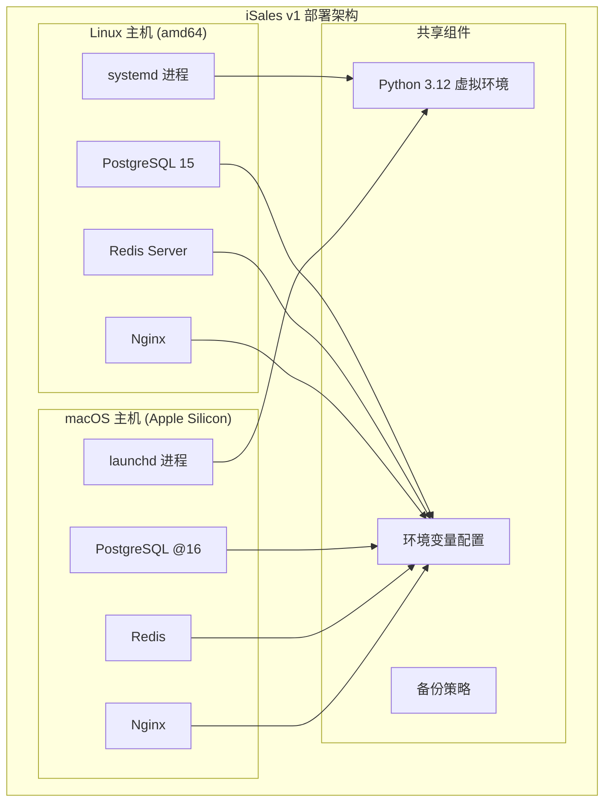
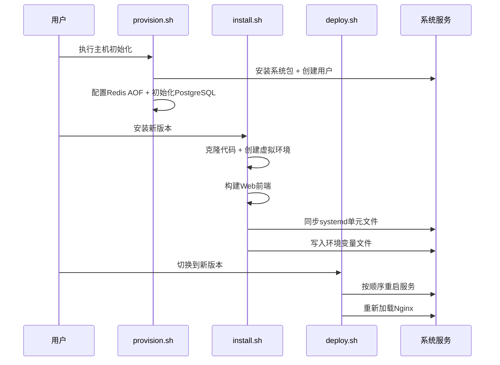
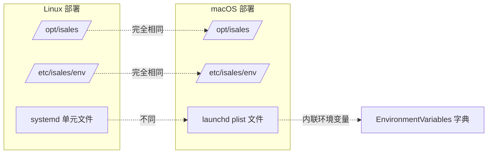
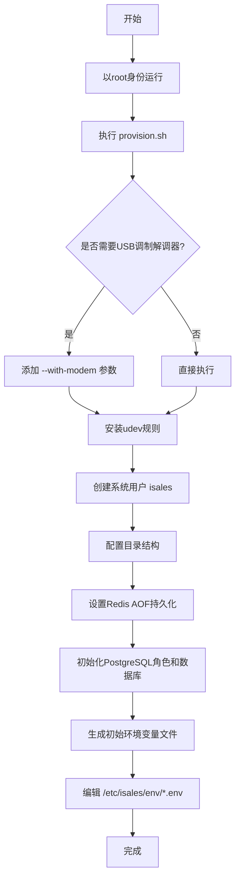
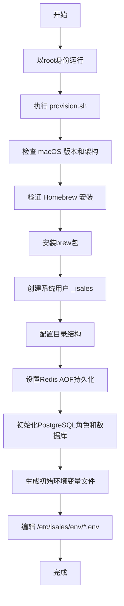
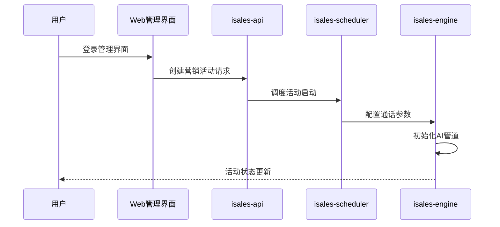
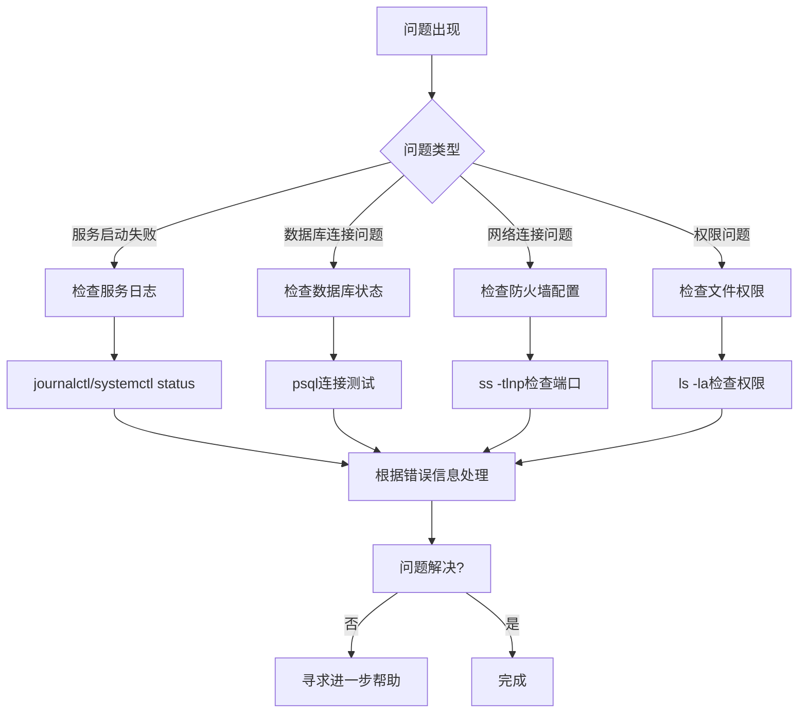

# 快速开始指南

<cite>
**本文档引用的文件**
- [README.md](file://README.md)
- [deploy/README.md](file://deploy/README.md)
- [deploy/macos/README.md](file://deploy/macos/README.md)
- [deploy/cloud/README.md](file://deploy/cloud/README.md)
- [deploy/edge/README.md](file://deploy/edge/README.md)
- [deploy/linux/scripts/provision.sh](file://deploy/linux/scripts/provision.sh)
- [deploy/macos/scripts/provision.sh](file://deploy/macos/scripts/provision.sh)
- [deploy/linux/scripts/install.sh](file://deploy/linux/scripts/install.sh)
- [deploy/macos/scripts/install.sh](file://deploy/macos/scripts/install.sh)
- [deploy/linux/scripts/deploy.sh](file://deploy/linux/scripts/deploy.sh)
- [deploy/macos/scripts/deploy.sh](file://deploy/macos/scripts/deploy.sh)
- [deploy/common/_lib.sh](file://deploy/common/_lib.sh)
- [deploy/macos/scripts/_lib.sh](file://deploy/macos/scripts/_lib.sh)
- [deploy/env/api.env.example](file://deploy/env/api.env.example)
- [deploy/env/engine.env.example](file://deploy/env/engine.env.example)
- [deploy/cloud/env/api.env.example](file://deploy/cloud/env/api.env.example)
</cite>

## 目录
1. [简介](#简介)
2. [项目结构](#项目结构)
3. [前置条件与系统要求](#前置条件与系统要求)
4. [Linux systemd 部署模型](#linux-systemd-部署模型)
5. [macOS Apple Silicon 部署模型](#macos-apple-silicon-部署模型)
6. [环境准备与安装步骤](#环境准备与安装步骤)
7. [基础配置示例](#基础配置示例)
8. [初始设置步骤](#初始设置步骤)
9. [验证安装成功](#验证安装成功)
10. [常见安装问题与解决方案](#常见安装问题与解决方案)
11. [简单使用示例](#简单使用示例)
12. [故障排查指南](#故障排查指南)
13. [结论](#结论)

## 简介

iSales v1 是一个基于单主机部署的营销自动化系统，支持两种主要部署模型：

- **Linux + systemd**（主线部署模型）- 7个服务进程通过systemd管理，PostgreSQL、Redis、Nginx作为系统服务
- **macOS 14+ + launchd**（Apple Silicon门店/现场场景）- 6个独立服务通过launchd管理，适用于Apple Silicon设备

系统采用模块化设计，包含以下核心组件：
- isales-api：FastAPI HTTP + WebSocket后台服务
- isales-engine：实时通话引擎
- isales-scheduler：线索调度器
- isales-worker：Celery异步后处理
- isales-telephony：设备/SIM卡管理
- isales-web：Vue 3管理界面

## 项目结构



**图表来源**
- [deploy/README.md:14-49](file://deploy/README.md#L14-L49)
- [deploy/macos/README.md:9-32](file://deploy/macos/README.md#L9-L32)

## 前置条件与系统要求

### Linux 部署要求

| 类别 | 要求 |
|------|------|
| **操作系统** | Ubuntu 22.04 LTS (amd64) |
| **Python** | python3.12 + python3.12-venv |
| **Node.js** | >= 20（构建isales-web） |
| **系统包** | postgresql-15, redis-server, nginx, git, pkg-config, libudev-dev, libasound2-dev |
| **系统用户** | isales:isales（无shell） |

### macOS 部署要求

| 类别 | 要求 |
|------|------|
| **操作系统** | macOS 14 (Sonoma) 或更新（Apple Silicon专用） |
| **架构** | Apple Silicon (arm64) |
| **Homebrew** | /opt/homebrew/（Apple Silicon默认路径） |
| **Python** | python@3.12（通过brew安装） |
| **Node.js** | node@20（通过brew安装） |
| **系统包** | postgresql@16, redis, nginx, pkg-config, git |
| **系统用户** | _isales:_isales（UID 350，无shell） |

**章节来源**
- [deploy/README.md:51-60](file://deploy/README.md#L51-L60)
- [deploy/macos/README.md:34-46](file://deploy/macos/README.md#L34-L46)

## Linux systemd 部署模型

### 目录布局

```mermaid
graph TD
A[/opt/isales/] --> B[releases/<timestamp>/]
A --> C[current -> releases/<timestamp>]
A --> D[backups/]
A --> E[logs/]
B --> F[isales-common/]
B --> G[isales-api/]
B --> H[isales-engine/]
B --> I[isales-scheduler/]
B --> J[isales-worker/]
B --> K[isales-telephony/]
B --> L[isales-web/dist/]
B --> M[venv/ (共享虚拟环境)]
N[/etc/isales/env/] --> O[api.env]
N --> P[engine.env]
N --> Q[scheduler.env]
N --> R[worker.env]
N --> S[telephony-api.env]
N --> T[modem-controller.env]
```

**图表来源**
- [deploy/README.md:30-48](file://deploy/README.md#L30-L48)

### 服务依赖关系



**图表来源**
- [deploy/linux/scripts/provision.sh:13-224](file://deploy/linux/scripts/provision.sh#L13-L224)
- [deploy/linux/scripts/install.sh:15-275](file://deploy/linux/scripts/install.sh#L15-L275)
- [deploy/linux/scripts/deploy.sh:10-139](file://deploy/linux/scripts/deploy.sh#L10-L139)

**章节来源**
- [deploy/README.md:14-49](file://deploy/README.md#L14-L49)
- [deploy/linux/scripts/provision.sh:13-224](file://deploy/linux/scripts/provision.sh#L13-L224)
- [deploy/linux/scripts/install.sh:15-275](file://deploy/linux/scripts/install.sh#L15-L275)
- [deploy/linux/scripts/deploy.sh:10-139](file://deploy/linux/scripts/deploy.sh#L10-L139)

## macOS Apple Silicon 部署模型

### 目录布局对比



**图表来源**
- [deploy/macos/README.md:26-32](file://deploy/macos/README.md#L26-L32)
- [deploy/macos/scripts/install.sh:188-321](file://deploy/macos/scripts/install.sh#L188-L321)

### macOS 特殊配置

macOS部署具有以下特殊性：

1. **环境变量注入方式**：通过plistlib内联写入到`<key>EnvironmentVariables</key>`字典
2. **包管理器**：使用Homebrew替代apt
3. **服务管理**：使用launchctl替代systemctl
4. **Nginx配置**：监听8080端口而非80端口

**章节来源**
- [deploy/macos/README.md:71-98](file://deploy/macos/README.md#L71-L98)
- [deploy/macos/scripts/install.sh:188-321](file://deploy/macos/scripts/install.sh#L188-L321)

## 环境准备与安装步骤

### Linux 系统初始化



**图表来源**
- [deploy/linux/scripts/provision.sh:13-224](file://deploy/linux/scripts/provision.sh#L13-L224)

### macOS 系统初始化



**图表来源**
- [deploy/macos/scripts/provision.sh:18-280](file://deploy/macos/scripts/provision.sh#L18-L280)

**章节来源**
- [deploy/linux/scripts/provision.sh:13-224](file://deploy/linux/scripts/provision.sh#L13-L224)
- [deploy/macos/scripts/provision.sh:18-280](file://deploy/macos/scripts/provision.sh#L18-L280)

## 基础配置示例

### 核心环境变量配置

#### API服务配置
```bash
# /etc/isales/env/api.env
ISALES_DATABASE_URL=postgresql+asyncpg://isales:<密码>@localhost:5432/isales
ISALES_REDIS_URL=redis://localhost:6379/0
ISALES_JWT_SECRET=<随机密钥>
ISALES_ADMIN_USER=admin
ISALES_ADMIN_PASSWORD_HASH=<密码哈希>
```

#### 引擎服务配置
```bash
# /etc/isales/env/engine.env
ISALES_DATABASE_URL=postgresql+asyncpg://isales:<密码>@localhost:5432/isales
ISALES_REDIS_URL=redis://localhost:6379/0
ISALES_ENGINE_LLM_PROVIDER=mock
ISALES_ENGINE_ASR_PROVIDER=mock
ISALES_ENGINE_TTS_PROVIDER=mock
ISALES_ENGINE_TELEPHONY_MODE=mock
```

#### 云环境配置差异
```bash
# /etc/isales/env/api.env (云环境)
ISALES_DATABASE_URL=postgresql+asyncpg://isales:<密码>@rds-internal.aliyun:5432/isales
ISALES_REDIS_URL=redis://redis-internal.aliyun:6379/0
ISALES_JWT_SECRET=<共享密钥>
ISALES_FERNET_KEY=<Fernet主密钥>
```

**章节来源**
- [deploy/env/api.env.example:1-14](file://deploy/env/api.env.example#L1-L14)
- [deploy/env/engine.env.example:1-21](file://deploy/env/engine.env.example#L1-L21)
- [deploy/cloud/env/api.env.example:1-24](file://deploy/cloud/env/api.env.example#L1-L24)

## 初始设置步骤

### Linux 完整部署流程

```bash
# 1. 主机初始化（一次性）
sudo bash deploy/linux/scripts/provision.sh [--with-modem]

# 2. 编辑环境变量文件
sudoedit /etc/isales/env/api.env
# 编辑其他服务的env文件...

# 3. 安装新版本
sudo -u isales bash deploy/linux/scripts/install.sh v0.1.0

# 4. 数据库迁移
sudo -u isales bash deploy/linux/scripts/migrate.sh

# 5. 切换到新版本并重启服务
sudo bash deploy/linux/scripts/deploy.sh <release-timestamp>
```

### macOS 完整部署流程

```bash
# 1. Homebrew安装（如未安装）
/bin/bash -c "$(curl -fsSL https://raw.githubusercontent.com/Homebrew/install/HEAD/install.sh)"

# 2. 主机初始化（一次性）
sudo bash deploy/macos/scripts/provision.sh

# 3. 编辑环境变量文件
sudoedit /etc/isales/env/api.env
# 编辑其他服务的env文件...

# 4. 安装新版本
sudo bash deploy/macos/scripts/install.sh v0.1.0

# 5. 数据库迁移
sudo bash deploy/macos/scripts/migrate.sh

# 6. 切换到新版本并重启服务
sudo bash deploy/macos/scripts/deploy.sh <release-timestamp>
```

**章节来源**
- [deploy/README.md:61-82](file://deploy/README.md#L61-L82)
- [deploy/macos/README.md:48-69](file://deploy/macos/README.md#L48-L69)

## 验证安装成功

### Linux 验证方法

```bash
# 检查服务状态
systemctl is-active isales-api
systemctl is-active isales-engine
systemctl is-active isales-scheduler
systemctl is-active isales-worker
systemctl is-active isales-telephony-api
systemctl is-active isales-modem-controller

# 查看最近日志
journalctl -u isales-api -n 50
journalctl -u isales-engine -n 50

# 检查端口监听
ss -tlnp | grep -E '(8000|8003|8004|50051)'
```

### macOS 验证方法

```bash
# 检查服务状态
launchctl print system/com.isales.api | grep state
launchctl print system/com.isales.engine | grep state

# 查看最近日志
log show --predicate 'subsystem == "com.isales.api"' --last 5m | tail -50

# 检查端口监听
lsof -i :8000
lsof -i :8003
lsof -i :8004
lsof -i :50051
```

**章节来源**
- [deploy/README.md:76-81](file://deploy/README.md#L76-L81)
- [deploy/macos/README.md:75-78](file://deploy/macos/README.md#L75-L78)

## 常见安装问题与解决方案

### Linux 常见问题

**问题1：权限不足**
```
解决：确保使用sudo执行所有部署脚本
错误：permission denied
```

**问题2：PostgreSQL连接失败**
```
解决：检查数据库服务状态和网络配置
命令：systemctl status postgresql
```

**问题3：Redis持久化问题**
```
解决：确认AOF配置正确且Redis服务运行正常
命令：redis-cli info persistence
```

### macOS 常见问题

**问题1：Homebrew权限问题**
```
解决：确保以普通用户身份安装Homebrew，然后使用sudo执行脚本
错误：brew must be run as root on macOS
```

**问题2：launchd服务无法启动**
```
解决：检查plist文件语法和环境变量内联
命令：plutil -lint /Library/LaunchDaemons/com.isales.api.plist
```

**问题3：Nginx端口占用**
```
解决：macOS使用8080端口而非80端口
命令：sudo /opt/homebrew/bin/nginx -t
```

**章节来源**
- [deploy/linux/scripts/provision.sh:131-186](file://deploy/linux/scripts/provision.sh#L131-L186)
- [deploy/macos/scripts/provision.sh:194-265](file://deploy/macos/scripts/provision.sh#L194-L265)

## 简单使用示例

### 创建第一个营销活动



**图表来源**
- [README.md:6-14](file://README.md#L6-L14)

### 配置通话参数

1. **访问管理界面**
   - Linux: http://localhost/api
   - macOS: http://localhost:8080

2. **导航到通话配置**
   - 管理界面 → 通话设置 → 设备配置

3. **配置关键参数**
   ```bash
   # 示例配置项
   ISALES_ENGINE_TELEPHONY_MODE=mock
   ISALES_ENGINE_LLM_PROVIDER=openai
   ISALES_ENGINE_ASR_PROVIDER=azure
   ISALES_ENGINE_TTS_PROVIDER=google
   ```

4. **保存并应用配置**
   - 点击保存按钮
   - 重启相关服务使配置生效

**章节来源**
- [deploy/env/engine.env.example:11-18](file://deploy/env/engine.env.example#L11-L18)
- [README.md:32-44](file://README.md#L32-L44)

## 故障排查指南

### 通用故障排查流程



### 服务状态检查

**Linux 服务检查**
```bash
# 检查所有服务状态
systemctl list-units --type=service --state=running

# 检查特定服务
systemctl status isales-api
systemctl status isales-engine

# 查看服务依赖
systemctl list-dependencies isales-api
```

**macOS 服务检查**
```bash
# 检查launchd服务
launchctl print system/ | grep com.isales

# 检查特定服务
launchctl print system/com.isales.api

# 查看服务树
launchctl print system/com.isales.api | grep -A 10 -B 10 "pid"
```

**章节来源**
- [deploy/linux/scripts/deploy.sh:118-128](file://deploy/linux/scripts/deploy.sh#L118-L128)
- [deploy/macos/scripts/deploy.sh:175-190](file://deploy/macos/scripts/deploy.sh#L175-L190)

## 结论

iSales v1提供了两种可靠的单主机部署模型，满足不同场景的需求：

1. **Linux systemd模型**适合生产环境和服务器部署
2. **macOS Apple Silicon模型**适合门店和现场部署

关键优势：
- **模块化设计**：7个独立服务便于维护和扩展
- **标准化流程**：统一的部署脚本和配置管理
- **环境隔离**：Python虚拟环境和系统用户隔离
- **监控友好**：systemd和launchd原生支持

建议：
- 新用户优先选择Linux部署模型
- 门店部署推荐使用macOS模型
- 生产环境建议使用Linux + systemd
- 定期进行备份和监控检查

通过遵循本指南的步骤，您可以在2小时内完成从系统初始化到服务启动的完整部署流程。