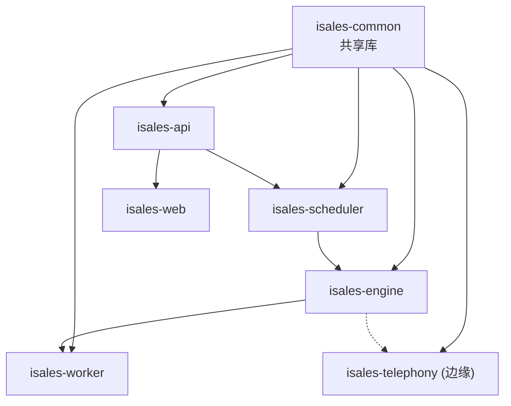
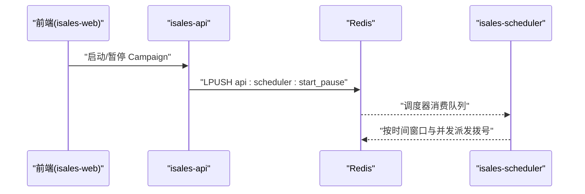
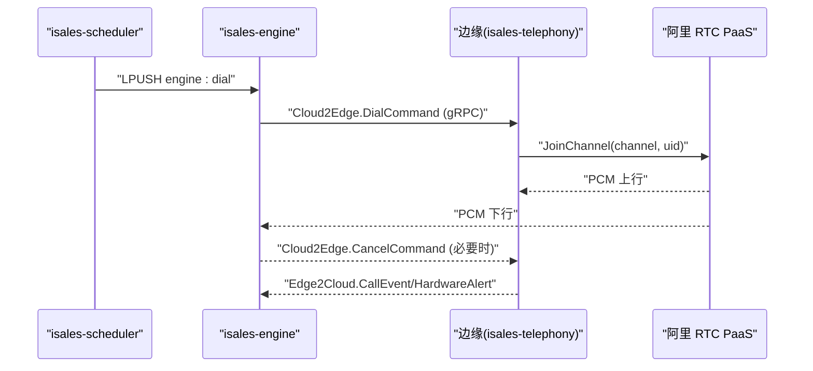
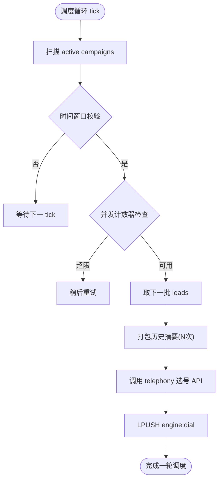
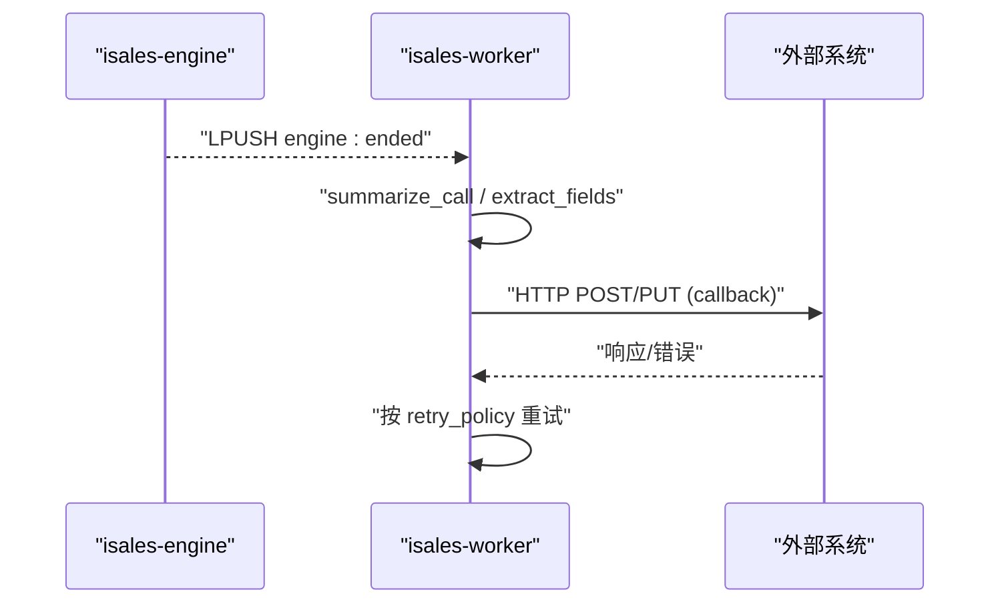
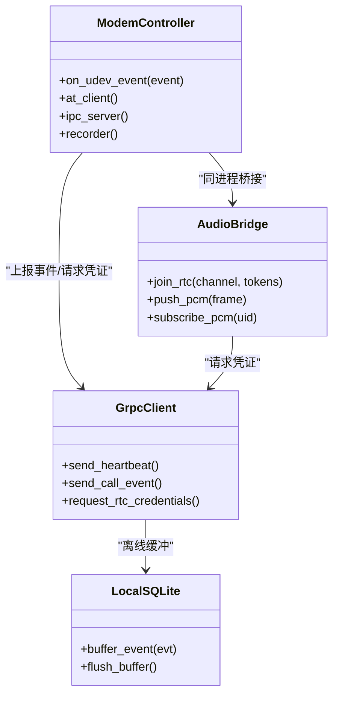
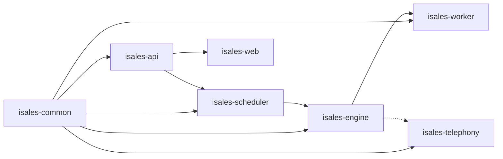

# 微服务架构设计

<cite>
**本文档引用的文件**
- [README.md](file://README.md)
- [DESIGN.md](file://DESIGN.md)
- [IMPLEMENTATION_PLAN.md](file://IMPLEMENTATION_PLAN.md)
- [openspec/specs/architecture/spec.md](file://openspec/specs/architecture/spec.md)
- [openspec/specs/deployment-topology/spec.md](file://openspec/specs/deployment-topology/spec.md)
- [openspec/specs/service-communication/spec.md](file://openspec/specs/service-communication/spec.md)
- [openspec/specs/data-model/spec.md](file://openspec/specs/data-model/spec.md)
- [openspec/changes/arch-cloud-edge-split/specs/architecture/spec.md](file://openspec/changes/arch-cloud-edge-split/specs/architecture/spec.md)
- [openspec/changes/arch-cloud-edge-split/specs/deployment-topology/spec.md](file://openspec/changes/arch-cloud-edge-split/specs/deployment-topology/spec.md)
- [openspec/changes/arch-cloud-edge-split/specs/service-communication/spec.md](file://openspec/changes/arch-cloud-edge-split/specs/service-communication/spec.md)
- [deploy/env/api.env.example](file://deploy/env/api.env.example)
- [deploy/env/engine.env.example](file://deploy/env/engine.env.example)
- [deploy/env/scheduler.env.example](file://deploy/env/scheduler.env.example)
- [deploy/env/worker.env.example](file://deploy/env/worker.env.example)
</cite>

## 目录
1. [简介](#简介)
2. [项目结构](#项目结构)
3. [核心组件](#核心组件)
4. [架构总览](#架构总览)
5. [详细组件分析](#详细组件分析)
6. [依赖关系分析](#依赖关系分析)
7. [性能考量](#性能考量)
8. [故障排查指南](#故障排查指南)
9. [结论](#结论)
10. [附录](#附录)

## 简介
本文件面向 iSales 系统的七仓库微服务架构，系统性阐述 isales-common、isales-api、isales-engine、isales-scheduler、isales-worker、isales-telephony、isales-web 的职责边界、接口定义与内部实现，并深入解释服务间的依赖关系、数据流向与通信机制。文档还总结了微服务拆分原则与边界划分策略，解释为何采用七仓库分离架构及其带来的优势与挑战，并覆盖服务发现、负载均衡、容错处理等微服务治理机制的实现细节。

## 项目结构
iSales 采用“七仓库”架构，isales-common 作为共享库被其余六个服务依赖。各服务职责清晰、边界明确，通过统一的共享库与通信协议协同工作。部署层面，v1 采用单主机部署模型（Linux + systemd 或 macOS + launchd），生产环境提供 RUNBOOK 与自动化脚本保障可运维性。

```mermaid
graph TB
subgraph "前端"
WEB["isales-web (Vue 3 SPA)"]
end
subgraph "云端"
API["isales-api (管理后台 + WS 代理)"]
ENGINE["isales-engine (实时通话引擎)"]
SCHED["isales-scheduler (线索调度)"]
WORKER["isales-worker (异步后处理)"]
end
subgraph "边缘"
TELE_EDGE["isales-telephony (边缘进程)<br/>modem-controller + audio-bridge + gRPC client"]
end
DB["PostgreSQL (RDS)"]
REDIS["Redis (托管)"]
WEB --> API
API <- --> REDIS
SCHED --> REDIS
ENGINE --> REDIS
WORKER --> REDIS
SCHED --> ENGINE
ENGINE --> WORKER
API --> SCHED
ENGINE <- --> TELE_EDGE
API --> DB
ENGINE --> DB
SCHED --> DB
WORKER --> DB
```

图表来源
- [openspec/specs/architecture/spec.md](file://openspec/specs/architecture/spec.md)
- [openspec/specs/deployment-topology/spec.md](file://openspec/specs/deployment-topology/spec.md)
- [openspec/specs/service-communication/spec.md](file://openspec/specs/service-communication/spec.md)

章节来源
- [README.md:1-86](file://README.md#L1-L86)
- [DESIGN.md:1-75](file://DESIGN.md#L1-L75)
- [openspec/specs/architecture/spec.md:1-168](file://openspec/specs/architecture/spec.md#L1-L168)
- [openspec/specs/deployment-topology/spec.md:1-414](file://openspec/specs/deployment-topology/spec.md#L1-L414)

## 核心组件
本节概述七个服务的职责边界、接口与关键实现要点：

- isales-common
  - 职责：Pydantic 模型、SQLAlchemy 模型、Provider ABC（ASR/TTS/LLM）、Alembic 迁移、工具函数与共享常量。
  - 边界：仅包含跨服务共享的稳定接口与模型，不绑定特定业务流程。
  - 依赖：被其余六个服务依赖。
  
- isales-api
  - 职责：管理后台 CRUD（Campaign/Lead/Role/Voice/Analytics/Callback）、WebSocket 代理、JWT 鉴权。
  - 通信：通过 Redis 队列与调度器交互；通过 Redis Pub/Sub 向前端推送事件；直连数据库。
  - 关键接口：/campaigns、/leads、/voice-models、/calls、/analytics/*、/ws/calls/{campaign_id}。
  
- isales-engine
  - 职责：实时通话引擎（状态机、AI 三层管线、打断/沉默/垫词、转人工、WRAPPING_UP 收尾）。
  - 通信：消费调度器队列；通过云-边 gRPC 控制面与边缘交互；通过阿里 RTC PaaS 传输音频；通过 Redis Pub/Sub 向 API 推送事件。
  - 关键实现：会话管理、并发控制、事件发布、与 provider 的集成。
  
- isales-scheduler
  - 职责：线索分发、时间窗口校验、并发控制、历史摘要打包、重试与跟进策略。
  - 通信：通过 Redis 队列向引擎派发拨号；通过 Redis 队列向 API 发送启停指令；直连数据库。
  - 关键实现：调度循环、全局并发计数器、历史摘要聚合。
  
- isales-worker
  - 职责：通话结束后的摘要生成、字段提取、Webhook 回调、数据聚合。
  - 通信：消费引擎结束队列；通过 HTTP 向外部系统发起回调；直连数据库。
  - 关键实现：Celery 任务、重试策略、指标聚合。
  
- isales-telephony（边缘）
  - 职责：边缘进程，包含 modem-controller（AT 命令、PCM 音频、udev）、audio-bridge（阿里 RTC SDK）、cloud-edge gRPC client、本地 SQLite 离线缓冲。
  - 通信：通过云-边 gRPC 控制面接收拨号/取消指令、上报通话事件与硬件告警；通过阿里 RTC PaaS 传输音频。
  - 关键实现：设备状态维护、音频桥接、离线事件缓冲与补发。
  
- isales-web
  - 职责：Vue 3 管理面，提供任务/线索/音色/设备/数据看板/通话监控/通话记录/回调配置等界面。
  - 通信：通过 nginx 反代访问 isales-api；订阅 WebSocket 获取实时通话事件。

章节来源
- [openspec/specs/architecture/spec.md:26-38](file://openspec/specs/architecture/spec.md#L26-L38)
- [openspec/specs/service-communication/spec.md:11-24](file://openspec/specs/service-communication/spec.md#L11-L24)
- [openspec/specs/data-model/spec.md:19-50](file://openspec/specs/data-model/spec.md#L19-L50)
- [openspec/changes/arch-cloud-edge-split/specs/architecture/spec.md:27-49](file://openspec/changes/arch-cloud-edge-split/specs/architecture/spec.md#L27-L49)

## 架构总览
七仓库微服务架构将业务能力按职责拆分，isales-common 作为共享库承载跨服务的稳定接口与模型，其余服务通过统一的通信协议协作。部署层面，v1 采用单主机部署（Linux + systemd 或 macOS + launchd），生产环境提供集中化环境变量、幂等部署脚本与可回滚机制。



图表来源
- [openspec/specs/architecture/spec.md:7,28](file://openspec/specs/architecture/spec.md#L7,L28)
- [openspec/specs/deployment-topology/spec.md:6-9](file://openspec/specs/deployment-topology/spec.md#L6-L9)

章节来源
- [openspec/specs/architecture/spec.md:130-168](file://openspec/specs/architecture/spec.md#L130-L168)
- [openspec/specs/deployment-topology/spec.md:10-33](file://openspec/specs/deployment-topology/spec.md#L10-L33)

## 详细组件分析

### isales-common：共享库与数据契约
- 数据模型与迁移：统一的 SQLAlchemy 模型与 Alembic 迁移由 isales-common 管理，其他服务通过依赖间接访问。
- Provider 抽象：ASR/TTS/LLM 三套 Provider ABC，支持异步会话抽象。
- 工具与常量：号码归一化、音频工具、加密、Redis 客户端工厂等。
- 环境变量与密钥：JWT/HMAC 密钥通过环境变量注入，不绑定特定服务。

章节来源
- [openspec/specs/data-model/spec.md:5-17](file://openspec/specs/data-model/spec.md#L5-L17)
- [openspec/specs/architecture/spec.md:73-85](file://openspec/specs/architecture/spec.md#L73-L85)

### isales-api：管理后台与实时代理
- 职责：管理后台 CRUD、WebSocket 代理、JWT 鉴权。
- 接口：/campaigns、/leads、/voice-models、/calls、/analytics/*、/ws/calls/{campaign_id}。
- 通信：通过 Redis 队列与调度器交互；通过 Redis Pub/Sub 向前端推送事件；直连数据库。
- 鉴权：isales-api 为唯一 JWT 签发方，telephony-api 仅验证；HMAC 密钥通过环境变量分发。



图表来源
- [openspec/specs/service-communication/spec.md:17,13](file://openspec/specs/service-communication/spec.md#L17,L13)
- [openspec/specs/architecture/spec.md:96-118](file://openspec/specs/architecture/spec.md#L96-L118)

章节来源
- [openspec/specs/service-communication/spec.md:106-131](file://openspec/specs/service-communication/spec.md#L106-L131)
- [openspec/specs/architecture/spec.md:96-118](file://openspec/specs/architecture/spec.md#L96-L118)

### isales-engine：实时通话引擎
- 职责：状态机、AI 三层管线、打断/沉默/垫词、转人工、WRAPPING_UP 收尾。
- 通信：消费调度器队列；通过云-边 gRPC 控制面与边缘交互；通过阿里 RTC PaaS 传输音频；通过 Redis Pub/Sub 向 API 推送事件。
- 关键实现：会话管理、并发控制、事件发布、与 provider 的集成。



图表来源
- [openspec/specs/service-communication/spec.md:9-15](file://openspec/specs/service-communication/spec.md#L9-L15)
- [openspec/changes/arch-cloud-edge-split/specs/service-communication/spec.md:14-15](file://openspec/changes/arch-cloud-edge-split/specs/service-communication/spec.md#L14-L15)

章节来源
- [openspec/specs/service-communication/spec.md:31-63](file://openspec/specs/service-communication/spec.md#L31-L63)
- [openspec/changes/arch-cloud-edge-split/specs/service-communication/spec.md:97-166](file://openspec/changes/arch-cloud-edge-split/specs/service-communication/spec.md#L97-L166)

### isales-scheduler：线索调度
- 职责：扫描活动 Campaign、时间窗口校验、全局并发控制、历史摘要打包、重试与跟进策略。
- 通信：通过 Redis 队列向引擎派发拨号；通过 Redis 队列向 API 发送启停指令；直连数据库。
- 关键实现：调度循环、FOR UPDATE SKIP LOCKED 的设备选择、历史摘要聚合。



图表来源
- [openspec/specs/service-communication/spec.md:13,17](file://openspec/specs/service-communication/spec.md#L13,L17)
- [openspec/specs/architecture/spec.md:45-57](file://openspec/specs/architecture/spec.md#L45-L57)

章节来源
- [openspec/specs/service-communication/spec.md:31-63](file://openspec/specs/service-communication/spec.md#L31-L63)
- [openspec/specs/architecture/spec.md:45-57](file://openspec/specs/architecture/spec.md#L45-L57)

### isales-worker：异步后处理
- 职责：摘要生成、字段提取、Webhook 回调、数据聚合。
- 通信：消费引擎结束队列；通过 HTTP 向外部系统发起回调；直连数据库。
- 关键实现：Celery 任务、重试策略、指标聚合。



图表来源
- [openspec/specs/service-communication/spec.md:14,22](file://openspec/specs/service-communication/spec.md#L14,L22)

章节来源
- [openspec/specs/service-communication/spec.md:173-186](file://openspec/specs/service-communication/spec.md#L173-L186)

### isales-telephony（边缘）：modem-controller 与 audio-bridge
- 职责：modem-controller（AT 命令、PCM 音频、udev、设备状态维护）、audio-bridge（阿里 RTC SDK、PCM 重采样与桥接）、cloud-edge gRPC client、本地 SQLite 离线缓冲。
- 通信：通过云-边 gRPC 控制面接收拨号/取消指令、上报通话事件与硬件告警；通过阿里 RTC PaaS 传输音频。
- 关键实现：设备状态机、音频桥接、离线事件缓冲与补发。



图表来源
- [openspec/changes/arch-cloud-edge-split/specs/service-communication/spec.md:14-18](file://openspec/changes/arch-cloud-edge-split/specs/service-communication/spec.md#L14-L18)

章节来源
- [openspec/changes/arch-cloud-edge-split/specs/service-communication/spec.md:167-195](file://openspec/changes/arch-cloud-edge-split/specs/service-communication/spec.md#L167-L195)

### isales-web：前端管理面
- 职责：Vue 3 管理面，提供任务/线索/音色/设备/数据看板/通话监控/通话记录/回调配置等界面。
- 通信：通过 nginx 反代访问 isales-api；订阅 WebSocket 获取实时通话事件。
- 鉴权：前端登录后由 isales-api 签发 JWT，用于访问受保护接口与 WebSocket。

章节来源
- [openspec/specs/architecture/spec.md:130-168](file://openspec/specs/architecture/spec.md#L130-L168)
- [openspec/specs/service-communication/spec.md:106-131](file://openspec/specs/service-communication/spec.md#L106-L131)

## 依赖关系分析
- 服务间依赖
  - isales-common 为共享库，被其余六个服务依赖。
  - isales-api 依赖 isales-common；isales-engine 依赖 isales-common；isales-scheduler 依赖 isales-common；isales-worker 依赖 isales-common；isales-telephony 依赖 isales-common。
  - isales-api 与 isales-engine 通过 Redis 队列/ Pub/Sub 通信；isales-scheduler 与 isales-engine 通过 Redis 队列通信；isales-engine 与 isales-worker 通过 Redis 队列通信。
  - isales-engine 与 isales-telephony 通过云-边 gRPC 与阿里 RTC PaaS 通信。
- 数据依赖
  - 所有服务通过 isales-common 的 SQLAlchemy 模型访问 PostgreSQL；Redis 用于队列、Pub/Sub、全局并发计数器与缓存。
- 环境变量与密钥
  - 数据库与 Redis 连接字符串在各服务 env 文件中保持一致；JWT/HMAC 密钥通过环境变量注入，不绑定特定服务。



图表来源
- [openspec/specs/architecture/spec.md:7,28](file://openspec/specs/architecture/spec.md#L7,L28)
- [openspec/specs/deployment-topology/spec.md:40-60](file://openspec/specs/deployment-topology/spec.md#L40-L60)

章节来源
- [openspec/specs/architecture/spec.md:59-71](file://openspec/specs/architecture/spec.md#L59-L71)
- [openspec/specs/deployment-topology/spec.md:40-60](file://openspec/specs/deployment-topology/spec.md#L40-L60)

## 性能考量
- 并发控制：全局并发通过 Redis 原子计数器实现，避免计数器泄漏。
- 队列与 Pub/Sub：队列用于必须送达的任务派发，Pub/Sub 用于实时事件广播。
- 音频传输：阿里 RTC PaaS 提供低延迟音频传输，边缘与云端通过 gRPC 控制面协调。
- 数据库：统一 PostgreSQL 实例，迁移由 isales-common 管理，避免跨服务 DDL。
- 监控与告警：Prometheus 指标暴露契约，Grafana 仪表盘与告警规则覆盖关键指标。

## 故障排查指南
- Redis 短暂不可用：各服务重连重试，engine 中断重连期间不接受新拨号但可完成当前通话。
- PostgreSQL 短暂不可用：各服务重连重试；正在通话中的 engine 将通话状态缓存至 Redis（v2 优化）。
- modem-controller 不可用：受影响的 call_session 优雅清理；scheduler 暂停派发直至恢复。
- 云-边 gRPC 中断：边缘自动重连，离线事件写入本地 SQLite 缓冲，重连后顺序补发。
- 阿里 RTC 媒体面中断：SDK 内部重连，超时则触发挂断流程，避免僵尸参会者。

章节来源
- [openspec/specs/service-communication/spec.md:87-105](file://openspec/specs/service-communication/spec.md#L87-L105)
- [openspec/changes/arch-cloud-edge-split/specs/service-communication/spec.md:85-94](file://openspec/changes/arch-cloud-edge-split/specs/service-communication/spec.md#L85-L94)

## 结论
iSales 的七仓库微服务架构通过清晰的职责边界、统一的共享库与通信协议，实现了高内聚、低耦合的服务组织。v1 单主机部署模型与集中化环境变量、幂等部署脚本、可回滚机制，确保了生产的可运维性。云-边分离进一步提升了系统的可扩展性与可靠性，为未来的多实例扩展奠定了基础。

## 附录
- 环境变量示例
  - isales-api：数据库、Redis、JWT 密钥、管理员凭据。
  - isales-engine：数据库、Redis、Provider 类型、Mock 连接延迟、Graceful Shutdown 超时。
  - isales-scheduler：数据库、Redis、调度 tick、批次大小、历史摘要数量、最大并发。
  - isales-worker：数据库、Redis、Fernet 密钥、默认回调超时、重试 tick、指标聚合 tick。

章节来源
- [deploy/env/api.env.example:1-14](file://deploy/env/api.env.example#L1-L14)
- [deploy/env/engine.env.example:1-21](file://deploy/env/engine.env.example#L1-L21)
- [deploy/env/scheduler.env.example:1-21](file://deploy/env/scheduler.env.example#L1-L21)
- [deploy/env/worker.env.example:1-20](file://deploy/env/worker.env.example#L1-L20)