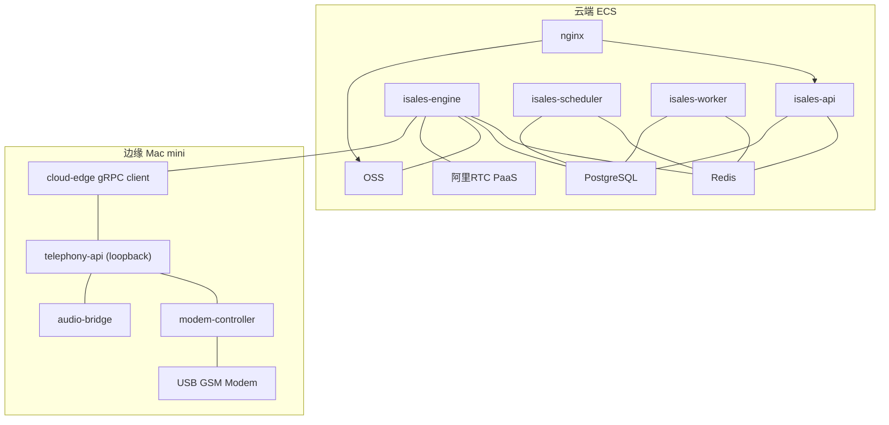
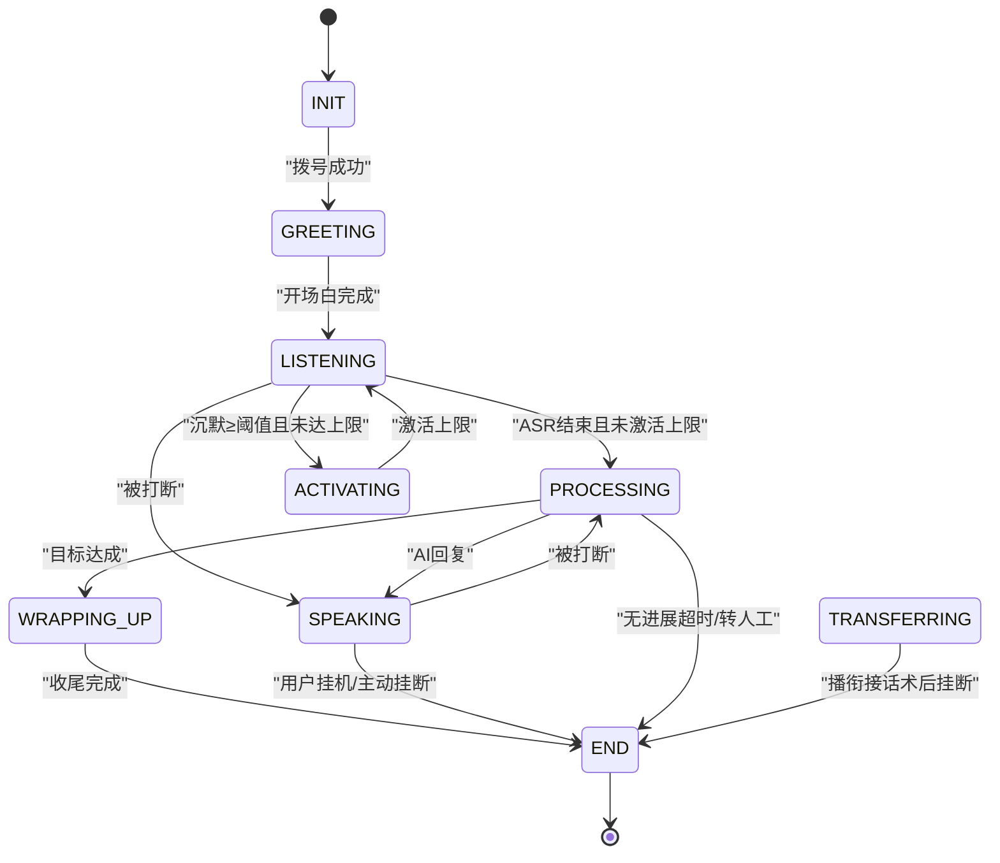
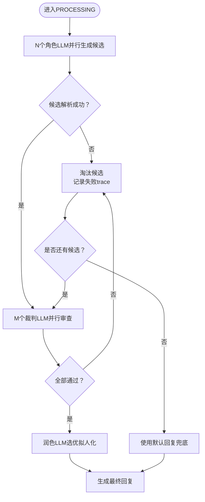
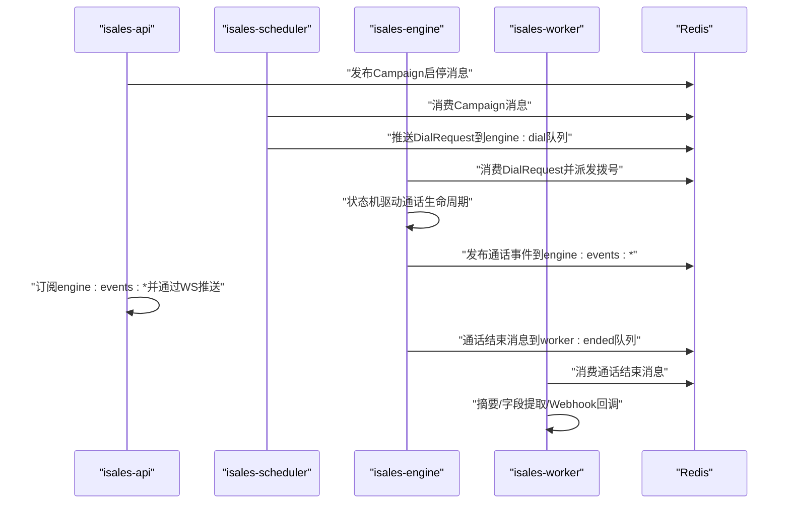
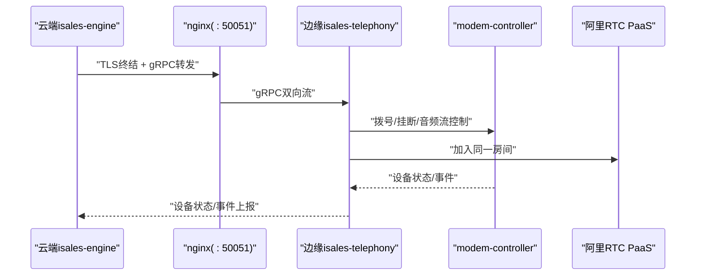
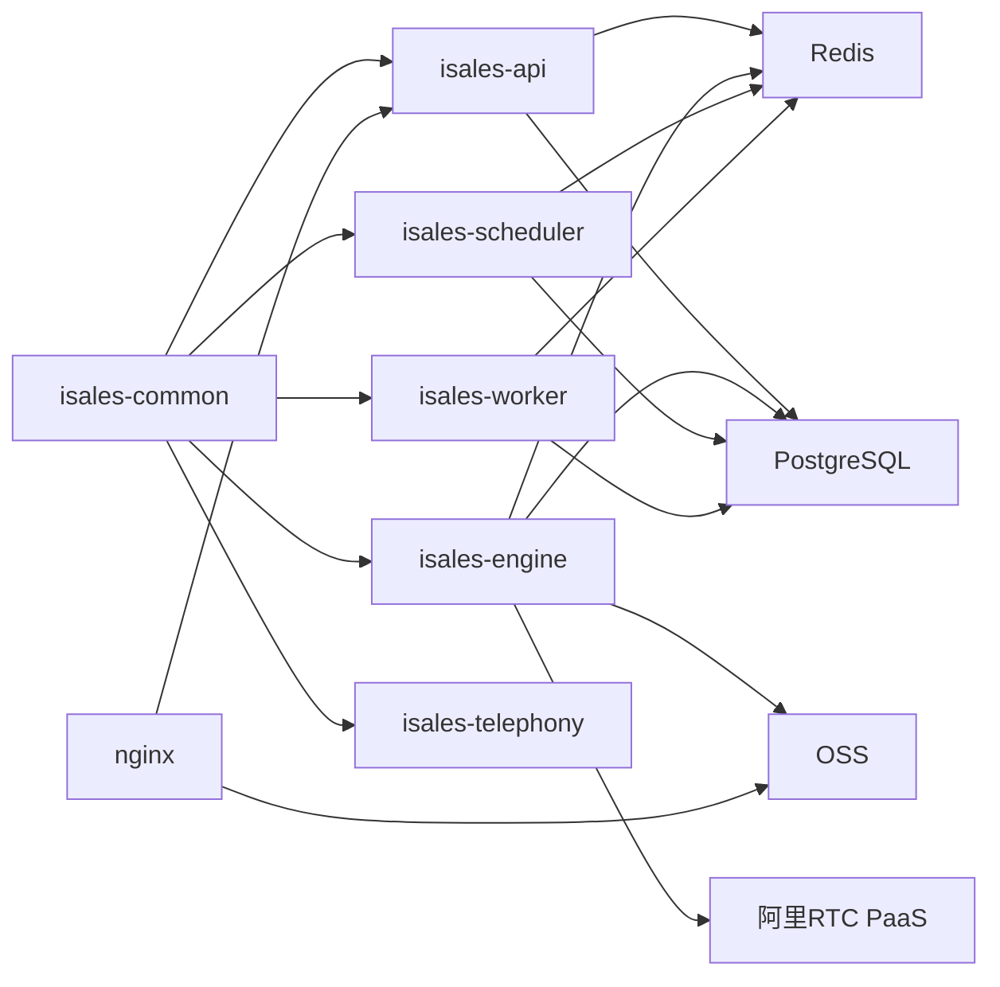

# 技术架构概览

<cite>
**本文档引用的文件**
- [README.md](file://README.md)
- [DESIGN.md](file://DESIGN.md)
- [架构规范.md](file://openspec/specs/architecture/spec.md)
- [部署拓扑规范.md](file://openspec/specs/deployment-topology/spec.md)
- [服务通信规范.md](file://openspec/specs/service-communication/spec.md)
- [通话状态机规范.md](file://openspec/specs/call-state-machine/spec.md)
- [AI三层管线规范.md](file://openspec/specs/ai-pipeline/spec.md)
- [云-边分离部署说明.md](file://deploy/cloud/README.md)
- [边缘部署说明.md](file://deploy/edge/README.md)
- [API环境示例](file://deploy/cloud/env/api.env.example)
- [引擎环境示例](file://deploy/cloud/env/engine.env.example)
- [调度器环境示例](file://deploy/cloud/env/scheduler.env.example)
- [Worker环境示例](file://deploy/cloud/env/worker.env.example)
- [边缘环境示例](file://deploy/edge/env/edge.env.example)
</cite>

## 目录
1. [简介](#简介)
2. [项目结构](#项目结构)
3. [核心组件](#核心组件)
4. [架构总览](#架构总览)
5. [详细组件分析](#详细组件分析)
6. [依赖关系分析](#依赖关系分析)
7. [性能考量](#性能考量)
8. [故障排查指南](#故障排查指南)
9. [结论](#结论)
10. [附录](#附录)

## 简介
本文件面向iSales系统的技术架构概览，系统采用七仓库微服务架构，围绕实时电话引擎为核心，结合调度、后处理、通信、前端等模块，形成完整的AI外呼销售系统。系统支持两种部署形态：v1单主机部署（服务同机）与A2云-边分离部署（云端ECS + 边缘Mac mini）。本文档重点阐述：
- 七仓库微服务架构的设计理念与职责边界
- 云-边分离部署模式的技术优势与协作机制
- 关键技术栈选择（Python 3.11/3.12、FastAPI、Vue 3、PostgreSQL、Redis等）
- 事件驱动架构、状态机模式、管道模式等设计模式的应用
- 系统架构图与组件交互图，帮助读者快速理解整体技术布局

## 项目结构
iSales主仓作为OpenSpec规范与跨仓工具的集合，代码主体分布在七个子仓库中，彼此通过isales-common共享库进行松耦合协作。核心组件包括：
- isales-common：Pydantic/SQLAlchemy模型、Provider ABC、Alembic迁移、通用工具
- isales-api：管理后台与WebSocket代理（FastAPI）
- isales-engine：实时通话引擎（状态机 + AI三层管线）
- isales-scheduler：线索调度（拨号队列、时间窗口、重试跟进）
- isales-worker：后处理（摘要、字段提取、Webhook回调）
- isales-telephony：telephony-api + modem-controller（守护进程）
- isales-web：Vue 3管理界面

```mermaid
graph TB
subgraph "前端"
WEB["isales-web (Vue 3 SPA)"]
end
subgraph "云端"
API["isales-api (FastAPI HTTP/WS)"]
ENGINE["isales-engine (实时引擎)"]
SCHED["isales-scheduler (调度)"]
WORKER["isales-worker (后处理)"]
NGINX["nginx (SPA静态/反代)"]
end
subgraph "边缘"
TELEPHONY["isales-telephony (telephony-api + modem-controller)"]
EDGE["边缘设备 (Mac mini)"]
end
COMMON["isales-common (共享库)"]
WEB --> API
WEB --> NGINX
NGINX --> API
API --> SCHED
API --> ENGINE
SCHED --> ENGINE
ENGINE --> WORKER
ENGINE <- --> TELEPHONY
TELEPHONY --> EDGE
API --> COMMON
ENGINE --> COMMON
SCHED --> COMMON
WORKER --> COMMON
```

**图表来源**
- [架构规范.md:130-168](file://openspec/specs/architecture/spec.md#L130-L168)
- [云-边分离部署说明.md:1-53](file://deploy/cloud/README.md#L1-L53)
- [边缘部署说明.md:10-40](file://deploy/edge/README.md#L10-L40)

**章节来源**
- [README.md:1-86](file://README.md#L1-L86)
- [架构规范.md:1-168](file://openspec/specs/architecture/spec.md#L1-L168)

## 核心组件
本节从职责边界、数据流、通信协议三个维度，系统梳理各组件的定位与协作。

- isales-common
  - 职责：提供跨服务共享的Pydantic模型、SQLAlchemy实体、Provider抽象、Alembic迁移与工具函数，确保数据模型与业务逻辑的稳定边界
  - 关键点：不包含特定服务的业务逻辑；内容需满足“至少被两个服务使用”“接口稳定”等约束
- isales-api
  - 职责：管理后台CRUD、WebSocket代理、JWT签发与验证、回调配置与凭证加密
  - 关键点：唯一JWT签发方；通过Redis Pub/Sub向前端推送通话事件；与telephony-api共享JWT密钥
- isales-engine
  - 职责：实时通话引擎，包含通话状态机、AI三层管线、打断/沉默/垫词、ASR/TTS/LLM Provider实现、modem控制器协调
  - 关键点：状态机严格约束合法转移；三层管线并行编排；云-边gRPC控制面
- isales-scheduler
  - 职责：线索分发、时间窗口、重试与跟进、拨号前历史摘要打包
  - 关键点：基于Redis队列派发拨号；全局并发控制使用Redis原子计数器
- isales-worker
  - 职责：通话结束后摘要与字段提取、Webhook回调、设备告警聚合
  - 关键点：回调使用HMAC签名；设备看门狗心跳检测
- isales-telephony
  - 职责：telephony-api（HTTP）+ modem-controller（守护进程，负责AT命令、PCM音频、udev）
  - 关键点：边缘形态下与云端通过gRPC双向流协作；设备状态实时回写
- isales-web
  - 职责：Vue 3管理界面，直接调用telephony-api（避免无收益的BFF层）

**章节来源**
- [架构规范.md:26-129](file://openspec/specs/architecture/spec.md#L26-L129)
- [服务通信规范.md:7-90](file://openspec/specs/service-communication/spec.md#L7-L90)
- [AI三层管线规范.md:1-166](file://openspec/specs/ai-pipeline/spec.md#L1-L166)
- [通话状态机规范.md:1-190](file://openspec/specs/call-state-machine/spec.md#L1-L190)

## 架构总览
iSales采用“云-边分离”的双套部署形态：
- 云端：ECS承载isales-api、isales-engine、isales-scheduler、isales-worker与nginx，使用阿里云托管中间件（RDS/Redis/OSS/RTC）
- 边缘：Mac mini承载isales-telephony（modem-controller + audio-bridge + cloud-edge gRPC client + telephony-api loopback），仅通过gRPC与云端交互，不暴露公网端口

云-边协作机制：
- 控制面：engine通过gRPC向edge下发拨号/挂断/音频流控制；edge上报设备状态与事件
- 数据面：通话媒体通过阿里RTC PaaS承载，engine与edge加入同一房间
- 事件流：engine通过Redis Pub/Sub向api推送实时事件；api再通过WebSocket推送给前端



**图表来源**
- [云-边分离部署说明.md:10-53](file://deploy/cloud/README.md#L10-L53)
- [边缘部署说明.md:10-40](file://deploy/edge/README.md#L10-L40)
- [服务通信规范.md:11-24](file://openspec/specs/service-communication/spec.md#L11-L24)

**章节来源**
- [云-边分离部署说明.md:1-118](file://deploy/cloud/README.md#L1-L118)
- [边缘部署说明.md:1-99](file://deploy/edge/README.md#L1-L99)
- [部署拓扑规范.md:317-414](file://openspec/specs/deployment-topology/spec.md#L317-L414)

## 详细组件分析

### 通话状态机（状态驱动）
通话状态机是engine的核心，定义了从拨号到结束的完整生命周期与合法状态转移。关键特性：
- 状态集合：INIT/GREETING/LISTENING/SPEAKING/INTERRUPTED/FILLER/PROCESSING/WRAPPING_UP/ACTIVATING/TRANSFERRING/END
- 合法转移：通过统一事件触发，非法转移抛出异常并记录state_error事件
- 特殊状态：WRAPPING_UP走简化管线；TRANSFERRING期间禁用AI管线；ACTIVATING为沉默激活保护
- 真硬件驱动：状态转换仅由IPC事件（由ATD链路翻译）触发，避免中间ACK/URC单独触发



**图表来源**
- [通话状态机规范.md:5-109](file://openspec/specs/call-state-machine/spec.md#L5-L109)

**章节来源**
- [通话状态机规范.md:1-190](file://openspec/specs/call-state-machine/spec.md#L1-L190)

### AI三层管线（管道模式）
AI三层并行管线负责每轮对话的候选生成、裁判审查与润色拟人化，确保回复质量与稳定性：
- Layer 1：N个角色LLM并行生成候选（强制JSON模式）
- Layer 2：M个裁判LLM并行审查，任一否决即淘汰
- Layer 3：1个润色LLM选优并拟人化
- 兜底与降级：全部失败走默认回复；润色失败取第一个通过裁判的候选；异常路径仍写pipeline_trace
- 简化管线：WRAPPING_UP仅单角色+润色，不启用PK与裁判



**图表来源**
- [AI三层管线规范.md:7-158](file://openspec/specs/ai-pipeline/spec.md#L7-L158)

**章节来源**
- [AI三层管线规范.md:1-166](file://openspec/specs/ai-pipeline/spec.md#L1-L166)

### 服务通信与事件驱动（Redis队列/Pub/Sub）
服务间通信遵循严格的通道矩阵与边界：
- 队列（Queue）：必须送达的异步工作派发（scheduler→engine、engine→worker、api→scheduler）
- Pub/Sub：实时可丢失的事件广播（api↔engine控制与事件推送）
- HTTP：仅限必要场景（scheduler→telephony-api设备选择）
- 数据库与缓存：所有服务直连PostgreSQL（通过isales-common模型）与Redis（队列/缓存/计数器）



**图表来源**
- [服务通信规范.md:11-44](file://openspec/specs/service-communication/spec.md#L11-L44)
- [部署拓扑规范.md:62-75](file://openspec/specs/deployment-topology/spec.md#L62-L75)

**章节来源**
- [服务通信规范.md:1-150](file://openspec/specs/service-communication/spec.md#L1-L150)
- [部署拓扑规范.md:40-132](file://openspec/specs/deployment-topology/spec.md#L40-L132)

### 云-边协作与gRPC控制面
云-边协作通过gRPC双向流实现：
- 控制面：engine通过gRPC向edge下发拨号/挂断/音频流控制；edge上报设备状态与事件
- 数据面：通话媒体通过阿里RTC PaaS承载，engine与edge加入同一房间
- 边缘形态：边缘Mac mini仅暴露gRPC出站与阿里RTCUDP出站，不暴露公网端口



**图表来源**
- [云-边分离部署说明.md:20-30](file://deploy/cloud/README.md#L20-L30)
- [边缘部署说明.md:15-25](file://deploy/edge/README.md#L15-L25)

**章节来源**
- [云-边分离部署说明.md:1-118](file://deploy/cloud/README.md#L1-L118)
- [边缘部署说明.md:1-99](file://deploy/edge/README.md#L1-L99)

## 依赖关系分析
- 组件耦合与内聚
  - isales-common作为共享库，内聚跨服务稳定接口；各服务通过依赖注入与环境变量解耦
  - 服务间通过Redis与HTTP进行松耦合通信，避免直接数据库网关层
- 外部依赖与集成点
  - PostgreSQL/Redis：统一数据与缓存；Alembic迁移由isales-common管理
  - 阿里云托管中间件：RDS/Redis/OSS/RTC，支撑生产可用性与弹性
  - nginx：SPA静态服务与API/WS反向代理
- 通信协议与序列化
  - Redis：JSON序列化（v1建议）；Queue/Pub/Sub边界清晰
  - gRPC：TLS终结 + bearer校验；边缘设备通过JWT令牌认证



**图表来源**
- [架构规范.md:59-72](file://openspec/specs/architecture/spec.md#L59-L72)
- [服务通信规范.md:23-24](file://openspec/specs/service-communication/spec.md#L23-L24)

**章节来源**
- [架构规范.md:59-129](file://openspec/specs/architecture/spec.md#L59-L129)
- [服务通信规范.md:78-100](file://openspec/specs/service-communication/spec.md#L78-L100)

## 性能考量
- 并发控制：全局并发通过Redis原子计数器实现，避免跨实例竞态
- 队列深度与背压：engine:dial队列深度持续超阈值触发告警，保障系统稳定性
- 事件推送：Redis Pub/Sub用于实时事件广播，前端通过WebSocket订阅，降低延迟
- 管线优化：三层并行管线覆盖整体延迟；连续打断保护策略（short_reply/listen_only）减少无效计算
- 数据持久化：PostgreSQL与Redis均启用持久化与备份基线，保障数据安全

**章节来源**
- [服务通信规范.md:45-63](file://openspec/specs/service-communication/spec.md#L45-L63)
- [部署拓扑规范.md:95-113](file://openspec/specs/deployment-topology/spec.md#L95-L113)
- [AI三层管线规范.md:13-18](file://openspec/specs/ai-pipeline/spec.md#L13-L18)

## 故障排查指南
- 服务启停顺序：按依赖顺序重启，避免下游风暴；engine重启会中断当前通话
- 回滚策略：rollback.sh仅切换软链与重启服务，DB回滚需手工执行RUNBOOK中的schema回滚步骤
- 监控与告警：Prometheus抓取各服务/metrics端点；Grafana仪表盘展示关键指标
- 环境一致性：deploy-check确保env.example与服务README环境变量一致
- 通信故障容错：Redis短暂不可用时重连重试；DB不可用时按异常通话处理；modem-controller不可用时优雅清理受影响的call_session

**章节来源**
- [部署拓扑规范.md:62-132](file://openspec/specs/deployment-topology/spec.md#L62-L132)
- [云-边分离部署说明.md:69-92](file://deploy/cloud/README.md#L69-L92)
- [边缘部署说明.md:55-75](file://deploy/edge/README.md#L55-L75)

## 结论
iSales通过七仓库微服务架构实现了清晰的职责边界与高内聚低耦合；云-边分离部署模式在保证边缘设备隐私与安全的同时，最大化利用云端算力与PaaS能力；事件驱动、状态机与管道模式的组合，使得系统在实时性、可靠性与可扩展性之间取得平衡。建议在后续版本中逐步引入多实例扩展、服务网格与更细粒度的监控指标，持续提升系统的弹性与可观测性。

## 附录
- 技术栈选择理由
  - Python 3.11/3.12：DingRTC绑定要求；生态成熟、易维护
  - FastAPI：高性能异步、自动生成OpenAPI文档、WebSocket支持
  - Vue 3：现代化前端框架、组合式API、与后端REST/WS对接便捷
  - PostgreSQL：ACID事务、JSONB丰富表达、迁移管理统一
  - Redis：队列/Pub/Sub/缓存一体化，满足高并发与低延迟需求
- 环境配置要点
  - 云端：API/JWT/凭证主密钥/Fernet密钥需在四个服务保持一致
  - 边缘：设备令牌与云端设备ID需严格匹配；SQLite缓冲用于离线事件持久化

**章节来源**
- [API环境示例:1-24](file://deploy/cloud/env/api.env.example#L1-L24)
- [引擎环境示例:1-76](file://deploy/cloud/env/engine.env.example#L1-L76)
- [调度器环境示例:1-25](file://deploy/cloud/env/scheduler.env.example#L1-L25)
- [Worker环境示例:1-28](file://deploy/cloud/env/worker.env.example#L1-L28)
- [边缘环境示例:1-34](file://deploy/edge/env/edge.env.example#L1-L34)