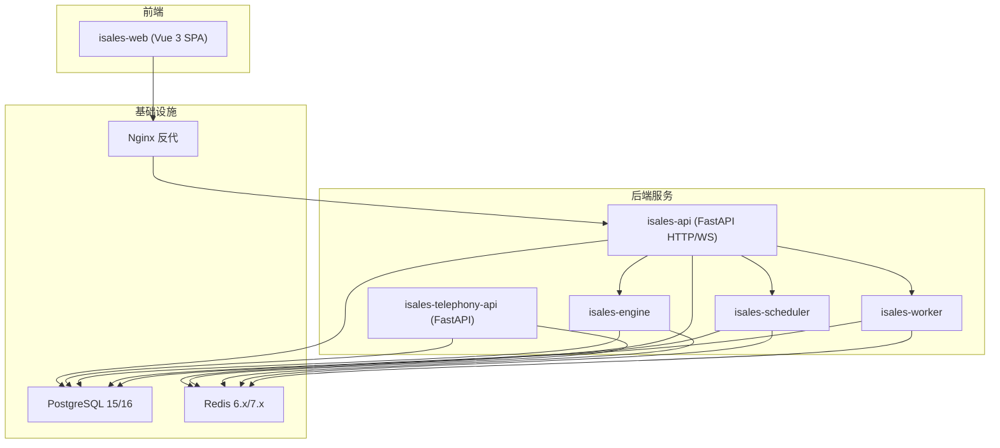
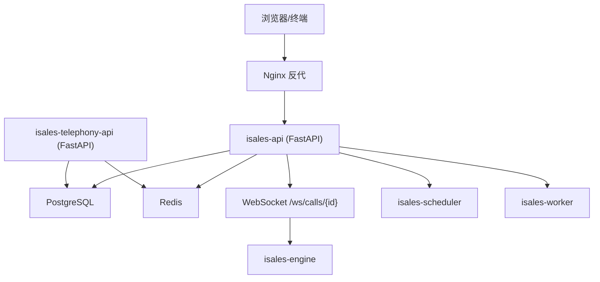
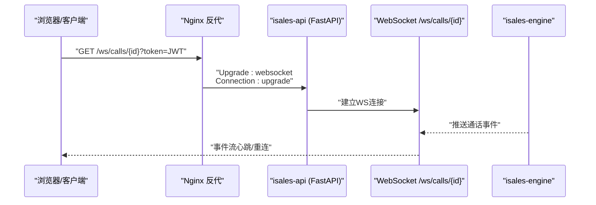
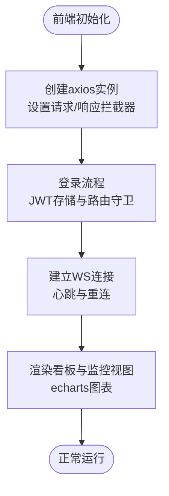
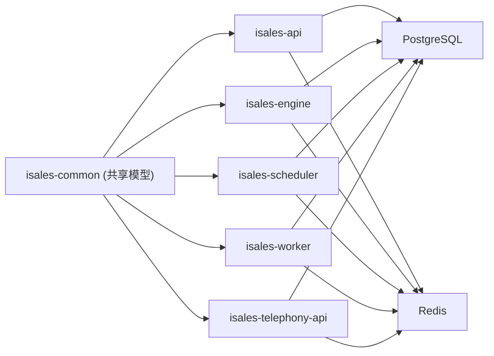

# 技术栈选型

<cite>
**本文引用的文件**
- [README.md](file://README.md)
- [DESIGN.md](file://DESIGN.md)
- [deploy/README.md](file://deploy/README.md)
- [deploy/cloud/README.md](file://deploy/cloud/README.md)
- [deploy/cloud/STATE.md](file://deploy/cloud/STATE.md)
- [deploy/RUNBOOK.md](file://deploy/RUNBOOK.md)
- [openspec/specs/architecture/spec.md](file://openspec/specs/architecture/spec.md)
- [openspec/specs/deployment-topology/spec.md](file://openspec/specs/deployment-topology/spec.md)
- [openspec/changes/archive/2026-05-06-impl-api/tasks.md](file://openspec/changes/archive/2026-05-06-impl-api/tasks.md)
- [openspec/changes/archive/2026-05-06-impl-api/design.md](file://openspec/changes/archive/2026-05-06-impl-api/design.md)
- [openspec/changes/archive/2026-05-06-impl-telephony/tasks.md](file://openspec/changes/archive/2026-05-06-impl-telephony/tasks.md)
- [openspec/changes/archive/2026-05-08-impl-web/tasks.md](file://openspec/changes/archive/2026-05-08-impl-web/tasks.md)
- [openspec/changes/archive/2026-05-08-impl-web/design.md](file://openspec/changes/archive/2026-05-08-impl-web/design.md)
- [openspec/changes/archive/2026-05-07-impl-engine/tasks.md](file://openspec/changes/archive/2026-05-07-impl-engine/tasks.md)
- [openspec/changes/archive/2026-05-06-impl-scheduler/tasks.md](file://openspec/changes/archive/2026-05-06-impl-scheduler/tasks.md)
- [openspec/changes/archive/2026-05-06-impl-scheduler/design.md](file://openspec/changes/archive/2026-05-06-impl-scheduler/design.md)
- [openspec/changes/archive/2026-05-24-impl-provider-credential-db-ssot/design.md](file://openspec/changes/archive/2026-05-24-impl-provider-credential-db-ssot/design.md)
- [deploy/linux/scripts/migrate.sh](file://deploy/linux/scripts/migrate.sh)
- [deploy/macos/scripts/provision.sh](file://deploy/macos/scripts/provision.sh)
- [deploy/cloud/env/README.md](file://deploy/cloud/env/README.md)
</cite>

## 目录
1. [简介](#简介)
2. [项目结构](#项目结构)
3. [核心组件](#核心组件)
4. [架构总览](#架构总览)
5. [详细组件分析](#详细组件分析)
6. [依赖关系分析](#依赖关系分析)
7. [性能考量](#性能考量)
8. [故障排查指南](#故障排查指南)
9. [结论](#结论)
10. [附录](#附录)

## 简介
本文件面向iSales系统的技术栈选型，围绕Python 3.11/3.12、FastAPI、Vue 3、PostgreSQL、Redis等关键技术展开，系统阐述其在系统中的应用场景、版本要求、配置要点、权衡考虑、兼容性与升级路径，并提供替代方案对比与运维实践参考。

## 项目结构
iSales采用多仓库拆分的微服务架构，核心服务包括：
- isales-api：FastAPI管理后台（HTTP + WebSocket）
- isales-telephony：设备与SIM管理（FastAPI + USB/GSM调制解调器守护）
- isales-scheduler：调度器（Campaign启停/拨号队列）
- isales-worker：后台任务（回调/录音上传/看门狗）
- isales-engine：实时通话引擎（状态机 + 三层AI管线）
- isales-web：Vue 3管理界面
- isales-common：Pydantic/SQLAlchemy模型与跨仓共享schema

部署层面支持Linux（systemd）与macOS（launchd）两种单主机模型，统一通过Nginx反代与静态资源托管，数据库与缓存分别采用PostgreSQL与Redis。

图表来源
- [deploy/README.md:14-49](file://deploy/README.md#L14-L49)
- [openspec/specs/architecture/spec.md:130-167](file://openspec/specs/architecture/spec.md#L130-L167)

章节来源
- [README.md:3-14](file://README.md#L3-L14)
- [deploy/README.md:3-8](file://deploy/README.md#L3-L8)

## 核心组件
本节聚焦iSales技术栈的关键组成及其在系统中的职责定位与选型理由。

- Python 3.11/3.12
  - 版本与依赖：Linux主线要求python3.12与python3.12-venv；macOS部署脚本使用Python 3.11（AL3仓库限制）。
  - 作用：作为7个服务的通用运行时，配合虚拟环境与pip依赖管理，支撑FastAPI、异步数据库访问、Redis客户端、Celery等。
  - 选型理由：现代版本具备更好的性能与类型系统支持，利于异步编程与安全特性（如cryptography）。
  - 配置要点：各服务通过独立venv隔离，环境变量集中于/etc/isales/env/下的*.env文件。

- FastAPI
  - 版本与依赖：isales-api与isales-telephony均使用FastAPI；WebSocket通过Uvicorn默认worker数限制为1以避免WS长连接占用过多进程。
  - 作用：提供REST API与WebSocket，内置OpenAPI/Swagger文档，结合Pydantic进行请求/响应校验。
  - 选型理由：高性能异步栈、自动生成API文档、与Python类型系统深度契合，适合管理后台与实时事件代理。
  - 配置要点：WS启用auto模式，生产环境通过Nginx反代至8000端口；禁用CORS中间件以减少攻击面。

- Vue 3 + Vite
  - 版本与依赖：Vue 3.5、Vite 5.4、Element Plus 2.8、Pinia 3、Vue Router 4、axios、echarts等。
  - 作用：管理界面（任务/线索/角色/音色/设备/数据看板/通话监控），SPA通过Nginx托管与反代。
  - 选型理由：生态成熟、TypeScript友好、组件化与状态管理完善，适合中大型后台管理应用。
  - 配置要点：开发代理/api+/ws，构建产物部署至/var/www/isales-web/，HTML5 History路由回退至index.html。

- PostgreSQL
  - 版本与依赖：本地Ubuntu使用postgresql-15；阿里云ECS实例如使用PostgreSQL 16；架构要求统一数据库与Redis实例。
  - 作用：统一的数据存储，所有服务通过isales-common的SQLAlchemy模型访问；Alembic迁移由isales-common管理。
  - 选型理由：ACID事务、成熟生态、与Python生态无缝对接；v1.0 schema在PG 13–16间兼容。
  - 配置要点：通过ISALES_DATABASE_URL连接；备份策略为每日pg_dump；支持RDS内网连接与备份保留。

- Redis
  - 版本与依赖：本地Ubuntu使用redis-server；macOS使用系统自带redis；架构要求统一Redis实例。
  - 作用：队列（调度→引擎、引擎→工人、API→调度）、Pub/Sub（引擎事件推送）、全局并发计数器（INCR/DECR）、缓存。
  - 选型理由：高性能键值存储，天然支持发布订阅与原子操作，满足实时与并发控制需求。
  - 配置要点：AOF持久化；每日RDB快照备份；通过ISALES_REDIS_URL连接；并发计数器key命名规范。

章节来源
- [deploy/README.md:51-60](file://deploy/README.md#L51-L60)
- [deploy/cloud/README.md:14-26](file://deploy/cloud/README.md#L14-L26)
- [openspec/specs/architecture/spec.md:59-71](file://openspec/specs/architecture/spec.md#L59-L71)
- [openspec/changes/archive/2026-05-06-impl-api/design.md:98-98](file://openspec/changes/archive/2026-05-06-impl-api/design.md#L98-L98)
- [openspec/changes/archive/2026-05-08-impl-web/tasks.md:7-12](file://openspec/changes/archive/2026-05-08-impl-web/tasks.md#L7-L12)
- [openspec/changes/archive/2026-05-08-impl-web/design.md:48-56](file://openspec/changes/archive/2026-05-08-impl-web/design.md#L48-L56)

## 架构总览
下图展示iSales在v1单主机部署形态下的整体交互：前端通过Nginx反代访问后端API，API再与数据库和缓存交互；引擎、调度器、工人通过Redis进行事件与任务编排；Telephony API负责设备与SIM管理。

图表来源
- [openspec/specs/architecture/spec.md:130-167](file://openspec/specs/architecture/spec.md#L130-L167)
- [openspec/specs/deployment-topology/spec.md:35-59](file://openspec/specs/deployment-topology/spec.md#L35-L59)
- [deploy/README.md:14-49](file://deploy/README.md#L14-L49)

## 详细组件分析

### Python 3.11/3.12 选型与配置
- 版本与平台差异
  - Linux主线：python3.12与python3.12-venv，满足cryptography等依赖。
  - macOS（AL3）：使用python3.11（仓库限制），部署脚本生成Fernet密钥时显式指定Python 3.12解释器以生成密钥。
- 配置与隔离
  - 7个服务共享同一venv（位于/opt/isales/releases/<ts>/venv/），通过独立的*.env文件注入环境变量。
  - 环境变量集中于/etc/isales/env/，包含api.env、engine.env、scheduler.env、worker.env、telephony-api.env、modem-controller.env。
- 替代方案对比
  - 使用更老版本Python（如3.9/3.10）将失去部分异步与类型特性，不利于工程演进。
  - 使用容器化（Docker/K8s）虽可标准化运行时，但v1不采用容器化，避免增加运维复杂度。

章节来源
- [deploy/README.md:51-60](file://deploy/README.md#L51-L60)
- [deploy/macos/scripts/provision.sh:252-256](file://deploy/macos/scripts/provision.sh#L252-L256)
- [deploy/cloud/STATE.md:371-378](file://deploy/cloud/STATE.md#L371-L378)

### FastAPI 选型与部署
- 服务分布
  - isales-api：HTTP + WebSocket，/health健康检查，lifespan生命周期管理，JWT鉴权。
  - isales-telephony-api：设备/SIM CRUD，内部路由无需JWT依赖。
- WebSocket与并发
  - 生产环境WS启用auto模式，Uvicorn默认worker数限制为1，避免WS长连接占用过多进程。
  - Nginx反代至8000端口，WebSocket升级头透传，超时配置≥300秒。
- 中间件与安全
  - v1单源部署形态下，isales-api不引入CORS中间件，避免不必要的跨域配置与攻击面。
- 替代方案对比
  - Django REST Framework：功能完备但异步支持较弱，不适合高并发WS场景。
  - Quart：异步兼容性更好，但生态与文档不如FastAPI成熟。

图表来源
- [openspec/specs/deployment-topology/spec.md:35-59](file://openspec/specs/deployment-topology/spec.md#L35-L59)
- [openspec/changes/archive/2026-05-06-impl-api/design.md:98-98](file://openspec/changes/archive/2026-05-06-impl-api/design.md#L98-L98)

章节来源
- [openspec/changes/archive/2026-05-06-impl-api/tasks.md:7-13](file://openspec/changes/archive/2026-05-06-impl-api/tasks.md#L7-L13)
- [openspec/changes/archive/2026-05-06-impl-telephony/tasks.md:15-25](file://openspec/changes/archive/2026-05-06-impl-telephony/tasks.md#L15-L25)
- [openspec/specs/deployment-topology/spec.md:35-59](file://openspec/specs/deployment-topology/spec.md#L35-L59)

### Vue 3 选型与前端架构
- 技术栈与依赖
  - Vue 3 + Vite + TypeScript + Element Plus + Pinia + Vue Router + axios + echarts + vitest。
- 状态管理与HTTP
  - Pinia按领域拆分store（认证/活动/线索/通话/设备/监控），持久化插件保存token。
  - axios实例统一拦截器处理Authorization与401跳转登录。
- WebSocket与可视化
  - 每个监控页建立独立WS连接，30秒心跳与指数退避重连；echarts用于趋势/漏斗/直方图看板。
- 替代方案对比
  - React + Next.js：生态强大但学习曲线更高；iSales选择Vue 3以契合团队与文档生态。
  - Svelte/SvelteKit：构建体积小但TypeScript与生态成熟度不及Vue 3。

图表来源
- [openspec/changes/archive/2026-05-08-impl-web/design.md:65-96](file://openspec/changes/archive/2026-05-08-impl-web/design.md#L65-L96)
- [openspec/changes/archive/2026-05-08-impl-web/tasks.md:7-12](file://openspec/changes/archive/2026-05-08-impl-web/tasks.md#L7-L12)

章节来源
- [openspec/changes/archive/2026-05-08-impl-web/tasks.md:1-24](file://openspec/changes/archive/2026-05-08-impl-web/tasks.md#L1-L24)
- [openspec/changes/archive/2026-05-08-impl-web/design.md:65-96](file://openspec/changes/archive/2026-05-08-impl-web/design.md#L65-L96)

### PostgreSQL 选型与运维
- 版本与兼容性
  - 本地Ubuntu使用postgresql-15；阿里云ECS实例如使用PostgreSQL 16；v1.0 schema在PG 13–16间兼容。
  - 选择PG 13的原因：AL3仓库仅提供PG 13.23，避免引入PGDG仓库带来的额外维护成本。
- 连接与迁移
  - 通过ISALES_DATABASE_URL连接，Alembic迁移由isales-common管理；生产环境支持RDS内网连接。
- 备份与恢复
  - 每日pg_dump备份；恢复演练包含创建临时库、还原与表清单核验。
- 替代方案对比
  - MySQL：事务与JSONB支持不及PG；iSales选择PG以获得更强的数据模型表达能力。
  - CockroachDB/ Yugabyte：分布式特性超出v1需求，增加运维复杂度。

章节来源
- [deploy/cloud/STATE.md:353-361](file://deploy/cloud/STATE.md#L353-L361)
- [openspec/specs/architecture/spec.md:59-66](file://openspec/specs/architecture/spec.md#L59-L66)
- [deploy/RUNBOOK.md:107-135](file://deploy/RUNBOOK.md#L107-L135)

### Redis 选型与运维
- 用途与配置
  - 队列：调度→引擎、引擎→工人、API→调度；Pub/Sub：引擎事件推送；全局并发计数器（INCR/DECR）；缓存。
  - 本地使用redis-server（AOF持久化）；macOS使用系统自带redis；通过ISALES_REDIS_URL连接。
- 备份与恢复
  - 每日RDB快照备份；恢复流程包括停止redis-server、替换dump.rdb、权限修正与启动验证。
- 替代方案对比
  - Memcached：无队列与发布订阅能力，不适合作为统一缓存/消息中间件。
  - RabbitMQ/NSQ：功能强大但引入额外运维面，v1阶段Redis足以满足需求。

章节来源
- [openspec/specs/architecture/spec.md:68-71](file://openspec/specs/architecture/spec.md#L68-L71)
- [openspec/changes/archive/2026-05-06-impl-scheduler/design.md:45-52](file://openspec/changes/archive/2026-05-06-impl-scheduler/design.md#L45-L52)
- [deploy/RUNBOOK.md:144-162](file://deploy/RUNBOOK.md#L144-L162)

## 依赖关系分析
- 服务间通信
  - API通过Redis队列与Pub/Sub与引擎、调度器、工人交互；Telephony API负责设备/SIM管理并与数据库/缓存交互。
- 数据一致性
  - 所有服务共享同一PostgreSQL与Redis实例，迁移由isales-common管理，禁止绕过ORM直接写SQL。
- 依赖耦合与内聚
  - isales-common仅包含跨服务共享的稳定接口与模型，避免过早抽取导致跨仓库耦合。

图表来源
- [openspec/specs/architecture/spec.md:73-86](file://openspec/specs/architecture/spec.md#L73-L86)

章节来源
- [openspec/specs/architecture/spec.md:59-86](file://openspec/specs/architecture/spec.md#L59-L86)

## 性能考量
- 异步与并发
  - FastAPI异步栈与Uvicorn默认worker数限制为1，避免WS长连接占用过多进程；WebSocket客户端数量控制在几十路以内。
- 缓存与队列
  - Redis队列与发布订阅满足异步与实时事件推送；全局并发计数器通过INCR/DECR实现跨进程一致性。
- 数据库与网络
  - PostgreSQL与Redis在同一主机或内网RDS部署，减少网络延迟；Nginx反代提升静态资源与WS稳定性。
- 前端性能
  - SPA + Nginx静态托管，路由回退至index.html；高频监控消息采用ref直接覆盖避免大对象reactive重建。

章节来源
- [openspec/changes/archive/2026-05-06-impl-api/design.md:98-98](file://openspec/changes/archive/2026-05-06-impl-api/design.md#L98-L98)
- [openspec/changes/archive/2026-05-08-impl-web/design.md:177-177](file://openspec/changes/archive/2026-05-08-impl-web/design.md#L177-L177)

## 故障排查指南
- 数据库问题
  - 常见症状：连接拒绝；排查步骤：systemctl状态、磁盘空间、journalctl日志。
  - 恢复演练：创建临时库、pg_restore还原、核对表清单与数据量。
- Redis问题
  - 常见症状：RDB加载失败；排查步骤：停止redis-server、替换dump.rdb、权限修正、启动验证。
- 环境变量与密钥轮换
  - 密钥轮换流程：在ECS生成新密钥→更新*.env→重启受影响服务→提交并推送（历史需强制推送）。
- 迁移与回滚
  - Alembic迁移：通过deploy/linux/scripts/migrate.sh执行upgrade head；回滚：切换历史release（不降级schema）。

章节来源
- [deploy/RUNBOOK.md:144-162](file://deploy/RUNBOOK.md#L144-L162)
- [deploy/RUNBOOK.md:107-135](file://deploy/RUNBOOK.md#L107-L135)
- [deploy/cloud/env/README.md:78-106](file://deploy/cloud/env/README.md#L78-L106)
- [deploy/linux/scripts/migrate.sh:44-60](file://deploy/linux/scripts/migrate.sh#L44-L60)

## 结论
iSales的技术栈选型以“性能、可维护性、团队技能匹配”为核心权衡：
- Python 3.11/3.12提供现代异步与类型支持；
- FastAPI在API与WS方面表现优异，结合Nginx反代与Swagger文档；
- Vue 3生态成熟，适合中大型后台管理；
- PostgreSQL与Redis满足v1阶段的数据与实时编排需求；
- 多仓库架构与isales-common共享库提升内聚与可演进性。

在不引入容器化与多主机灰度的前提下，该技术栈在v1阶段具备清晰的升级路径与运维实践，为后续扩展奠定基础。

## 附录
- 兼容性与升级路径
  - PostgreSQL：v1.0 schema在PG 13–16兼容；升级路径：pg_dumpall → 安装PG 16 → psql导入 → 切换。
  - Redis：AOF持久化与RDB快照；升级路径：保持现有键空间与命令兼容。
  - Python：Linux主线使用python3.12，macOS受限于AL3仓库使用python3.11，密钥生成通过显式Python 3.12解释器完成。
- 替代方案对比
  - API框架：Django REST Framework功能完备但异步支持弱；Quart生态不及FastAPI。
  - 前端：React/Next.js生态强大但学习曲线高；Svelte体积小但生态成熟度不足。
  - 数据库：MySQL事务与JSONB不及PG；CockroachDB/Yugabyte分布式特性超出v1需求。
  - 缓存：Memcached无队列与发布订阅；RabbitMQ/NSQ引入额外运维面。

章节来源
- [deploy/cloud/STATE.md:353-361](file://deploy/cloud/STATE.md#L353-L361)
- [openspec/changes/archive/2026-05-06-impl-api/design.md:98-98](file://openspec/changes/archive/2026-05-06-impl-api/design.md#L98-L98)
- [openspec/changes/archive/2026-05-08-impl-web/design.md:65-96](file://openspec/changes/archive/2026-05-08-impl-web/design.md#L65-L96)
- [openspec/specs/architecture/spec.md:59-71](file://openspec/specs/architecture/spec.md#L59-L71)