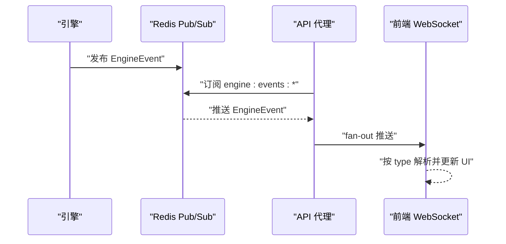
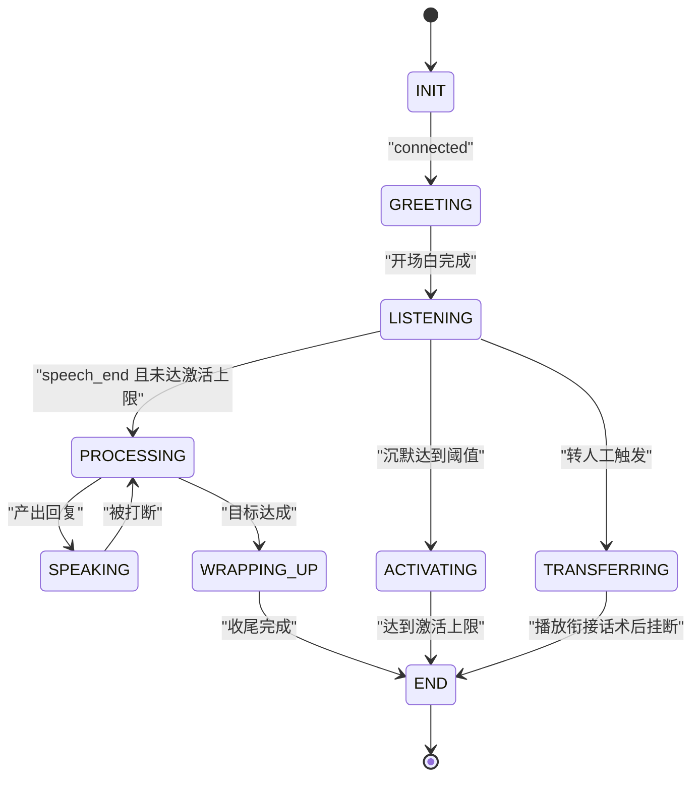
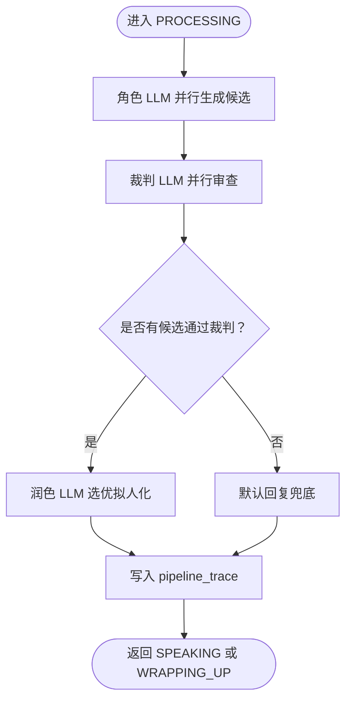
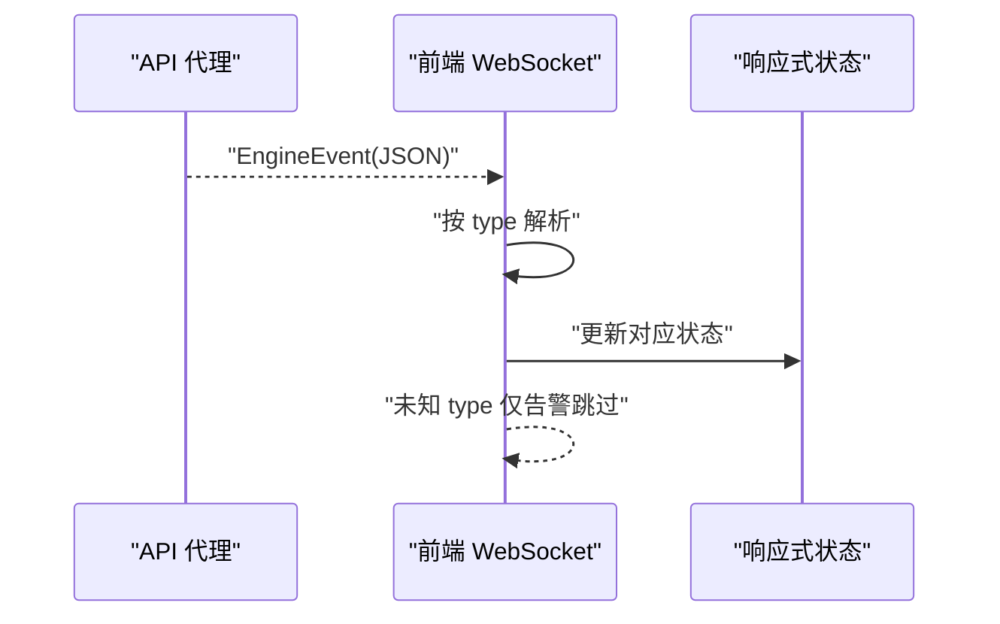

# 设计模式应用

<cite>
**本文引用的文件**
- [README.md](file://README.md)
- [DESIGN.md](file://DESIGN.md)
- [架构规范](file://openspec/specs/architecture/spec.md)
- [通话状态机规范](file://openspec/specs/call-state-machine/spec.md)
- [AI三层管线规范](file://openspec/specs/ai-pipeline/spec.md)
- [服务通信规范](file://openspec/specs/service-communication/spec.md)
- [引擎实现设计（归档）](file://openspec/changes/archive/2026-05-07-impl-engine/design.md)
- [Web实现设计（归档）](file://openspec/changes/archive/2026-05-08-impl-web/design.md)
</cite>

## 目录
1. [简介](#简介)
2. [项目结构](#项目结构)
3. [核心组件](#核心组件)
4. [架构总览](#架构总览)
5. [详细组件分析](#详细组件分析)
6. [依赖分析](#依赖分析)
7. [性能考量](#性能考量)
8. [故障排查指南](#故障排查指南)
9. [结论](#结论)
10. [附录](#附录)

## 简介
本文件聚焦 iSales 系统在设计模式层面的应用，围绕事件驱动架构、状态机模式、管道模式、观察者模式等进行系统化梳理。通过对 OpenSpec 规范与实现设计的解读，阐明这些模式如何在真实业务场景中落地，解决并发控制、实时事件分发、状态治理、AI推理编排等关键架构问题，并提升系统的可扩展性、可维护性与性能。

## 项目结构
iSales 采用“7 仓库微服务”架构，isales-common 作为共享库被其余 6 个服务依赖。各服务职责边界清晰，通过统一的通信通道矩阵协作，形成端到端的实时外呼销售系统。

```mermaid
graph TB
subgraph "前端"
WEB["isales-web (Vue 3)"]
end
subgraph "后端服务"
API["isales-api (管理 API + WS 代理)"]
SCHED["isales-scheduler (调度器)"]
ENGINE["isales-engine (实时通话引擎)"]
WORKER["isales-worker (后台 worker)"]
TELEPHONY["isales-telephony (telephony-api + modem-controller)"]
end
subgraph "基础设施"
REDIS["Redis (队列/Pub/Sub/计数器)"]
PG["PostgreSQL (数据持久化)"]
MODEM["USB GSM Modem ×≤8"]
end
WEB --> API
API --> SCHED
API <- --> ENGINE
SCHED --> ENGINE
ENGINE --> WORKER
ENGINE < --> TELEPHONY
SCHED --- REDIS
ENGINE --- REDIS
WORKER --- REDIS
API --- REDIS
TELEPHONY --- REDIS
ENGINE --- PG
WORKER --- PG
TELEPHONY --- PG
TELEPHONY --> MODEM
```

**图表来源**
- [架构规范:130-168](file://openspec/specs/architecture/spec.md#L130-L168)

**章节来源**
- [README.md:1-86](file://README.md#L1-L86)
- [架构规范:1-168](file://openspec/specs/architecture/spec.md#L1-L168)

## 核心组件
- 事件驱动架构：通过 Redis Pub/Sub 实现实时事件广播与控制下发，API 侧将引擎事件推送到前端 WebSocket，形成“事件驱动”的解耦交互。
- 状态机模式：通话生命周期的状态集合与转换规则由规范严格约束，统一的 transition API 保障状态治理的一致性与可观测性。
- 管道模式：AI 三层并行管线（角色 PK → 裁判审查 → 润色拟人化）在每轮 PROCESSING 中顺序执行，失败/降级路径仍写入 pipeline_trace，确保可追溯。
- 观察者模式：前端通过订阅 WebSocket 获取引擎事件，按事件类型分发到响应式状态，实现“观察者”式更新。

**章节来源**
- [服务通信规范:1-150](file://openspec/specs/service-communication/spec.md#L1-L150)
- [通话状态机规范:1-190](file://openspec/specs/call-state-machine/spec.md#L1-L190)
- [AI三层管线规范:1-166](file://openspec/specs/ai-pipeline/spec.md#L1-L166)
- [Web实现设计（归档）:170-185](file://openspec/changes/archive/2026-05-08-impl-web/design.md#L170-L185)

## 架构总览
下图展示了服务间的通信边界与数据流：调度器派发拨号任务，引擎负责实时通话编排与事件发布，工作线程处理后置回调，telephony-api 与 modem-controller 负责设备与音频链路，API 通过 Pub/Sub 将事件推送到前端。

```mermaid
graph TB
SCHED["调度器<br/>Redis Queue"] --> ENGINE["引擎<br/>状态机/管线/事件发布"]
API["API<br/>WebSocket 代理"] <- --> ENGINE
ENGINE --> WORKER["Worker<br/>回调/摘要"]
ENGINE --> REDIS["Redis<br/>Pub/Sub/Queue"]
API --> REDIS
WORKER --> REDIS
ENGINE --> TELEPHONY["Telephony<br/>telephony-api + modem-controller"]
TELEPHONY --> MODEM["USB GSM Modem"]
ENGINE --> PG["PostgreSQL"]
WORKER --> PG
TELEPHONY --> PG
```

**图表来源**
- [服务通信规范:7-25](file://openspec/specs/service-communication/spec.md#L7-L25)
- [架构规范:130-168](file://openspec/specs/architecture/spec.md#L130-L168)

**章节来源**
- [服务通信规范:1-150](file://openspec/specs/service-communication/spec.md#L1-L150)
- [架构规范:1-168](file://openspec/specs/architecture/spec.md#L1-L168)

## 详细组件分析

### 事件驱动架构（Pub/Sub + WebSocket）
- 事件来源与传播
  - 引擎在状态转换、ASR 文本、TTS 状态等关键节点产生 EngineEvent，并通过 Redis Pub/Sub 发布。
  - API 作为 WebSocket 代理，订阅引擎事件通道，将消息反序列化后 fan-out 推送给前端。
- 事件消费与路由
  - 引擎侧通过单个订阅任务接收控制消息，按 call_id 路由到对应会话管理器，确保跨 campaign 控制的低开销。
- 容错与性能
  - 事件发布采用 fire-and-forget 策略，避免网络抖动阻塞通话主路径；前端按 discriminated union 解析，未知类型仅告警跳过。



**图表来源**
- [服务通信规范:106-146](file://openspec/specs/service-communication/spec.md#L106-L146)
- [引擎实现设计（归档）:168-178](file://openspec/changes/archive/2026-05-07-impl-engine/design.md#L168-L178)

**章节来源**
- [服务通信规范:106-146](file://openspec/specs/service-communication/spec.md#L106-L146)
- [引擎实现设计（归档）:168-178](file://openspec/changes/archive/2026-05-07-impl-engine/design.md#L168-L178)
- [Web实现设计（归档）:170-185](file://openspec/changes/archive/2026-05-08-impl-web/design.md#L170-L185)

### 状态机模式（通话生命周期）
- 状态集合与转换
  - 规范定义了 INIT/GREETING/LISTENING/SPEAKING/FILLER/PROCESSING/WRAPPING_UP/ACTIVATING/TRANSFERRING/END 等状态及合法转移集合。
  - 所有状态转换通过统一的 transition_to API 触发，并在 transcript 中记录事件，非法转移抛出异常并写入 state_error。
- 特殊状态与边界
  - WRAPPING_UP 期间走简化管线；TRANSFERRING 期间不调用 AI 管线；沉默激活与转人工均有明确阈值与话术边界。
- 并发与健壮性
  - 引擎在异常路径强制进入 END 并携带原因，避免状态悬挂；前端通过 transcript 与事件可定位问题。



**图表来源**
- [通话状态机规范:7-19](file://openspec/specs/call-state-machine/spec.md#L7-L19)
- [通话状态机规范:50-109](file://openspec/specs/call-state-machine/spec.md#L50-L109)

**章节来源**
- [通话状态机规范:1-190](file://openspec/specs/call-state-machine/spec.md#L1-L190)

### 管道模式（AI 三层并行管线）
- 管线编排
  - 每轮 PROCESSING 顺序经过三层：角色 LLM 并行候选 → 裁判 LLM 并行审查 → 润色 LLM 选优拟人化。
  - Layer 1 与垫词播放并行，覆盖整体管线延迟；连续打断保护支持 short_reply 与 listen_only 两种策略。
- 可观测性与容错
  - 每轮 PROCESSING 必须写入 pipeline_trace，包含候选、裁判、润色字段；失败/降级/异常路径同样记录，确保调试可追溯。
  - 润色失败时取“通过裁判的第一个候选”兜底，避免重试造成额外延迟。
- 简化管线
  - WRAPPING_UP 期间走单角色 + 润色，不启用 PK 与裁判，减少计算开销。



**图表来源**
- [AI三层管线规范:7-84](file://openspec/specs/ai-pipeline/spec.md#L7-L84)
- [AI三层管线规范:108-130](file://openspec/specs/ai-pipeline/spec.md#L108-L130)

**章节来源**
- [AI三层管线规范:1-166](file://openspec/specs/ai-pipeline/spec.md#L1-L166)
- [引擎实现设计（归档）:83-102](file://openspec/changes/archive/2026-05-07-impl-engine/design.md#L83-L102)

### 观察者模式（前端事件订阅）
- 前端通过订阅 WebSocket 获取引擎事件，按 EngineEvent 的 discriminated union 解析消息类型，分别更新 UI 状态。
- 未知类型仅告警跳过，避免前端因后端新增事件类型而崩溃；消息形状由 message-contract 约束，前后端协同演进。



**图表来源**
- [服务通信规范:132-146](file://openspec/specs/service-communication/spec.md#L132-L146)
- [Web实现设计（归档）:170-185](file://openspec/changes/archive/2026-05-08-impl-web/design.md#L170-L185)

**章节来源**
- [服务通信规范:132-146](file://openspec/specs/service-communication/spec.md#L132-L146)
- [Web实现设计（归档）:170-185](file://openspec/changes/archive/2026-05-08-impl-web/design.md#L170-L185)

## 依赖分析
- 服务间依赖
  - 调度器与引擎通过 Redis Queue 通信，保证“必须送达”的工作派发。
  - 引擎与 API 通过 Redis Pub/Sub 通信，实现“实时、可丢失”的事件广播。
  - API 与前端通过 WebSocket 代理，Fan-out 引擎事件，避免每个客户端独立订阅 Redis。
- 基础设施依赖
  - Redis 用于队列、Pub/Sub、全局并发计数器与缓存；PostgreSQL 作为统一数据存储。
  - modem-controller 与 USB GSM Modem 通过本地 IPC 与物理链路协作，支撑拨号与音频。

```mermaid
graph LR
SCHED["调度器"] --> |Queue| ENGINE["引擎"]
API["API"] < --> |Pub/Sub| ENGINE
API --> |WS| WEB["前端"]
ENGINE --> |Queue| WORKER["Worker"]
ENGINE --> REDIS["Redis"]
API --> REDIS
WORKER --> REDIS
ENGINE --> PG["PostgreSQL"]
WORKER --> PG
TELEPHONY["Telephony"] --> MODEM["USB GSM Modem"]
```

**图表来源**
- [服务通信规范:7-25](file://openspec/specs/service-communication/spec.md#L7-L25)
- [架构规范:130-168](file://openspec/specs/architecture/spec.md#L130-L168)

**章节来源**
- [服务通信规范:1-150](file://openspec/specs/service-communication/spec.md#L1-L150)
- [架构规范:1-168](file://openspec/specs/architecture/spec.md#L1-L168)

## 性能考量
- 事件发布与消费
  - Pub/Sub 用于高频实时事件，采用 fire-and-forget，避免网络抖动阻塞通话主路径。
  - 前端按需加载 pipeline_trace，避免大 JSON 导致详情页渲染缓慢。
- 并发与资源
  - 全局并发通过 Redis 原子计数器控制，避免跨实例计数器泄漏。
  - 三层管线并行化与垫词并行，覆盖整体延迟；简化管线在收尾阶段降低计算压力。
- 数据持久化
  - pipeline_trace 写入独立 try/except 包裹，失败仅日志，不影响通话主路径；事务批量写入失败采用指数退避重试。

**章节来源**
- [服务通信规范:31-105](file://openspec/specs/service-communication/spec.md#L31-L105)
- [AI三层管线规范:40-69](file://openspec/specs/ai-pipeline/spec.md#L40-L69)
- [Web实现设计（归档）:170-185](file://openspec/changes/archive/2026-05-08-impl-web/design.md#L170-L185)

## 故障排查指南
- 状态机异常
  - 非法状态转移会抛出异常并在 transcript 中记录 state_error，前端可通过 transcript 与事件定位问题。
- 事件丢失与延迟
  - Pub/Sub 为“实时、可丢失”，若出现事件缺失，检查 Redis 连接与订阅任务；WebSocket 代理需验证 JWT 与 fan-out 逻辑。
- 管线异常
  - 每轮 PROCESSING 必须写 pipeline_trace，即使失败/降级也要记录；通过 pipeline_trace 与 transcript 定位失败环节。
- 并发与资源
  - 若出现并发超限或计数器泄漏，检查 Redis 计数器与定期对账机制；关注引擎异常崩溃后的清理策略。

**章节来源**
- [通话状态机规范:33-44](file://openspec/specs/call-state-machine/spec.md#L33-L44)
- [服务通信规范:87-105](file://openspec/specs/service-communication/spec.md#L87-L105)
- [AI三层管线规范:40-69](file://openspec/specs/ai-pipeline/spec.md#L40-L69)

## 结论
iSales 在设计模式层面形成了清晰的架构分层与协作机制：事件驱动架构确保服务间解耦与实时性；状态机模式提供强一致的状态治理与可观测性；管道模式将复杂的 AI 推理过程标准化、可观测；观察者模式让前端以最小代价获得实时反馈。这些模式共同提升了系统的可扩展性、可维护性与性能，为后续 v2 扩展（如多实例、跨实例广播）奠定了坚实基础。

## 附录
- 设计模式选择原则
  - 以需求为先：事件驱动用于实时广播与控制；状态机用于强约束生命周期；管道用于可并行的推理编排；观察者用于前端解耦。
  - 以规范为准：所有模式实现均遵循 OpenSpec 规范，确保跨仓库一致性与可追溯性。
  - 以性能为纲：Pub/Sub fire-and-forget、并行管线、简化管线、按需加载等策略兼顾实时性与吞吐。
- 最佳实践
  - 事件发布不阻塞主路径；前端对未知事件类型仅告警跳过；每轮 PROCESSING 必须写 pipeline_trace；并发控制使用 Redis 原子计数器；数据库直连统一通过 isales-common 模型。