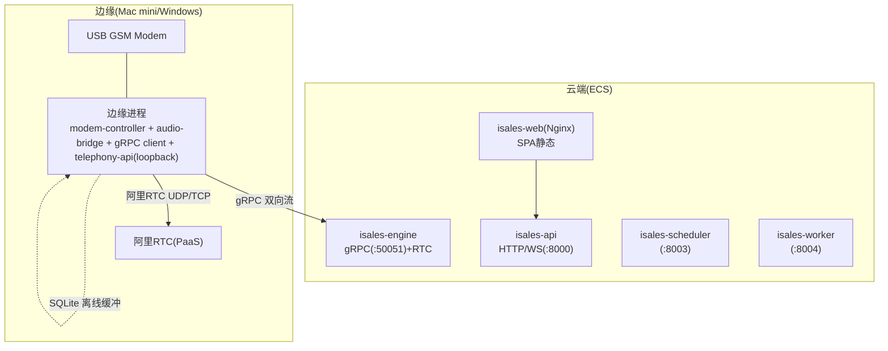
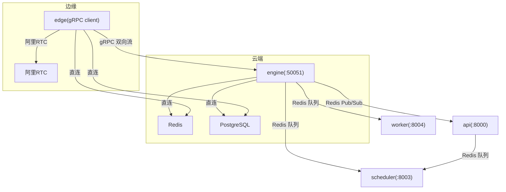
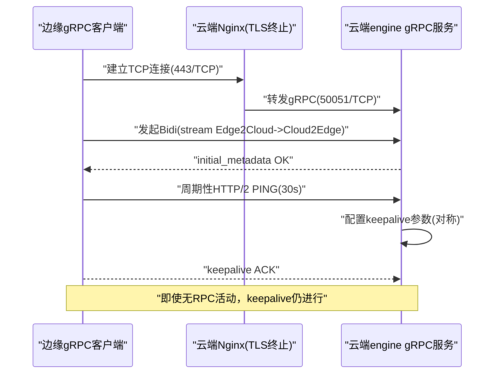
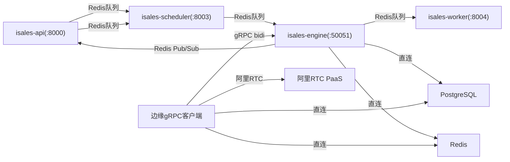

# 云-边分离架构

<cite>
**本文档引用的文件**
- [README.md](file://README.md)
- [DESIGN.md](file://DESIGN.md)
- [deploy/cloud/README.md](file://deploy/cloud/README.md)
- [deploy/edge/README.md](file://deploy/edge/README.md)
- [openspec/specs/architecture/spec.md](file://openspec/specs/architecture/spec.md)
- [openspec/specs/deployment-topology/spec.md](file://openspec/specs/deployment-topology/spec.md)
- [openspec/specs/service-communication/spec.md](file://openspec/specs/service-communication/spec.md)
- [openspec/specs/device-hardware/spec.md](file://openspec/specs/device-hardware/spec.md)
- [openspec/changes/cloud-edge-grpc-keepalive/spec.md](file://openspec/changes/cloud-edge-grpc-keepalive/specs/service-communication/spec.md)
- [openspec/changes/cloud-edge-grpc-keepalive/proposal.md](file://openspec/changes/cloud-edge-grpc-keepalive/proposal.md)
- [openspec/changes/cloud-edge-grpc-keepalive/design.md](file://openspec/changes/cloud-edge-grpc-keepalive/design.md)
- [deploy/cloud/monitoring/README.md](file://deploy/cloud/monitoring/README.md)
- [deploy/cloud/monitoring/alert_rules.yml.example](file://deploy/cloud/monitoring/alert_rules.yml.example)
- [deploy/cloud/monitoring/prometheus.yml.example](file://deploy/cloud/monitoring/prometheus.yml.example)
- [deploy/RUNBOOK-edge.md](file://deploy/RUNBOOK-edge.md)
- [deploy/RUNBOOK.md](file://deploy/RUNBOOK.md)
</cite>

## 目录
1. [简介](#简介)
2. [项目结构](#项目结构)
3. [核心组件](#核心组件)
4. [架构总览](#架构总览)
5. [详细组件分析](#详细组件分析)
6. [依赖关系分析](#依赖关系分析)
7. [性能考虑](#性能考虑)
8. [故障排查指南](#故障排查指南)
9. [结论](#结论)
10. [附录](#附录)

## 简介
本文件面向iSales v1.0的云-边分离架构，系统性阐述云端ECS服务器集群与边缘设备的部署策略、云边通信协议与gRPC连接管理、数据同步机制，以及边缘设备在Windows与macOS上的部署形态与特性。文档还涵盖边缘设备的网络要求、防火墙配置、离线缓冲机制与激活码注册流程，并给出云边通信的监控指标、故障转移策略与性能优化建议。

## 项目结构
- 顶层README与DESIGN提供整体概览与索引，指向OpenSpec多文件规范。
- deploy/cloud与deploy/edge分别描述云端ECS与边缘设备的部署形态与运维手册。
- openspec/specs系列规范定义了架构、拓扑、服务通信、设备硬件等核心要求。
- 云边gRPC keepalive变更通过OpenSpec change文档明确传输层抗性与配置契约。
- 监控与告警模板提供云侧专用指标与告警规则，边缘侧指标暂不集中聚合。

图表来源
- [deploy/cloud/README.md:12-53](file://deploy/cloud/README.md#L12-L53)
- [deploy/edge/README.md:12-40](file://deploy/edge/README.md#L12-L40)

章节来源
- [README.md:1-86](file://README.md#L1-L86)
- [DESIGN.md:1-75](file://DESIGN.md#L1-L75)

## 核心组件
- 云端服务
  - isales-api：管理后台与WebSocket代理，监听8000端口，由Nginx反向代理Web静态资源。
  - isales-engine：实时通话引擎，承载gRPC服务端与阿里RTC集成，监听50051端口。
  - isales-scheduler：线索调度器，监听8003端口。
  - isales-worker：异步后处理，监听8004端口。
  - isales-web：Vue 3管理端，由Nginx提供静态服务。
- 边缘进程
  - 单一进程内含modem-controller、audio-bridge、cloud-edge gRPC client、本地telephony-api loopback。
  - 通过gRPC与云端engine建立长连接，音频数据经阿里RTC传输。
  - 离线事件暂存于本地SQLite，重连后按序补发。

章节来源
- [deploy/cloud/README.md:10-53](file://deploy/cloud/README.md#L10-L53)
- [deploy/edge/README.md:10-40](file://deploy/edge/README.md#L10-L40)

## 架构总览
云-边分离采用“控制面gRPC + 数据面RTC”的双通道设计：
- 控制面：engine与edge之间通过gRPC双向流传输拨号指令、心跳、事件与硬件告警。
- 数据面：通话音频通过阿里RTC PaaS承载，edge与engine均加入同一房间，实现端到端音频通路。
- 服务间通信：engine与scheduler通过Redis队列派发拨号任务；engine与worker通过Redis队列传递通话结束事件；engine向api推送实时事件；api与scheduler通过Redis队列控制Campaign启停。

图表来源
- [openspec/specs/service-communication/spec.md:7-25](file://openspec/specs/service-communication/spec.md#L7-L25)
- [openspec/specs/architecture/spec.md:130-168](file://openspec/specs/architecture/spec.md#L130-L168)

章节来源
- [openspec/specs/service-communication/spec.md:1-150](file://openspec/specs/service-communication/spec.md#L1-L150)
- [openspec/specs/architecture/spec.md:1-168](file://openspec/specs/architecture/spec.md#L1-L168)

## 详细组件分析

### 云端ECS服务器集群
- 部署形态
  - 单实例ECS（4-8核/16-32G），运行5个无硬件耦合服务：api、engine、scheduler、worker、web(Nginx)。
  - Nginx负责443反向代理Web静态与API/WS，50051反向代理engine gRPC（TLS终止+Bearer校验）。
- 系统依赖
  - Ubuntu 22.04 LTS，Python 3.11（DingRTC绑定要求），Node.js>=20，系统包nginx/git/pkg-config等。
  - 用户isales:isales（无shell），目录骨架/opt/isales/releases/current/vendor/backups/logs。
- 环境变量
  - 通过/etc/isales/env/*.env集中化注入，权限0640 root:isales，禁止提交到仓库。
- 监控与告警
  - Prometheus抓取engine/web/scheduler/worker/api/node_exporter/postgres_exporter/redis_exporter。
  - 告警覆盖edge offline、重连风暴、ARTC推送反压、引擎首TTS延迟预算、回调失败率、PG连接数等。

章节来源
- [deploy/cloud/README.md:1-118](file://deploy/cloud/README.md#L1-L118)
- [deploy/cloud/monitoring/README.md:1-37](file://deploy/cloud/monitoring/README.md#L1-L37)
- [deploy/cloud/monitoring/alert_rules.yml.example:1-116](file://deploy/cloud/monitoring/alert_rules.yml.example#L1-L116)
- [deploy/cloud/monitoring/prometheus.yml.example:1-77](file://deploy/cloud/monitoring/prometheus.yml.example#L1-L77)

### 边缘设备（macOS与Windows）
- macOS形态
  - 单一LaunchAgent进程com.isales.telephony，包含modem-controller、audio-bridge、cloud-edge gRPC client、telephony-api loopback。
  - 状态目录~/Library/Application Support/isales/，包含SQLite edge_buffer.db、阿里RTC SDK vendor、录音暂存。
  - 环境文件~/.config/isales/edge.env，包含设备ID、令牌、云端gRPC地址等。
- Windows形态
  - 单PyInstaller冻结exe + asyncio + Qt主循环，通过Windows启动注册表Run项实现“登录即启”。
  - 配置与数据落于%APPDATA%\isales\（env/sqlite/logs），用户级权限，避免管理员权限。
  - Tray图标二态：绿色（gRPC已连接且至少一个modem idle）、红色（断线≥30s或所有modem offline）。
  - 激活码注册：弹出PySide6对话框，输入云端签发的静态EDGE_DEVICE_TOKEN与可选云端endpoint，写入env后重启gRPC client任务。
  - 离线缓冲：CallEvent/HardwareAlert暂存SQLite，重连后按seq顺序补发，weak-ACK后删除。

章节来源
- [deploy/edge/README.md:1-99](file://deploy/edge/README.md#L1-L99)
- [openspec/specs/deployment-topology/spec.md:133-261](file://openspec/specs/deployment-topology/spec.md#L133-L261)
- [openspec/specs/device-hardware/spec.md:344-403](file://openspec/specs/device-hardware/spec.md#L344-L403)
- [deploy/RUNBOOK-edge.md:130-181](file://deploy/RUNBOOK-edge.md#L130-L181)

### 云边通信协议与gRPC连接管理
- 协议定义
  - 服务定义包含CloudEdge.Bidi双向流，消息类型涵盖心跳、拨号确认、通话事件、硬件告警、拨号/取消指令、配置更新、RTC凭证等。
  - 任何对消息schema的演进需通过isales-common版本升级与调用方/响应方同步。
- 连接管理
  - edge端CloudEdgeGrpcClient创建gRPC aio通道，默认无keepalive；云端CloudEdgeGrpcServer默认配置亦无keepalive。
  - 为解决外部网络中间层（阿里云安全组/SLB七层/客户机NAT/公司防火墙）对idle双向流的stateful清理问题，引入HTTP/2 keepalive契约：
    - edge端：keepalive_time_ms=30000、keepalive_timeout_ms=10000、permit_without_calls=1、min_time_between_pings_ms=10000、http2.max_pings_without_data=0。
    - 云端：server端对称配置，max_ping_strikes=0，不踢client ping。
  - 上线日志：edge侧_connected.set()前与cloud侧_register_stream前分别记录INFO日志，便于定位稳定连接时刻。

图表来源
- [openspec/changes/cloud-edge-grpc-keepalive/spec.md:1-57](file://openspec/changes/cloud-edge-grpc-keepalive/specs/service-communication/spec.md#L1-L57)
- [openspec/changes/cloud-edge-grpc-keepalive/design.md:1-34](file://openspec/changes/cloud-edge-grpc-keepalive/design.md#L1-L34)

章节来源
- [openspec/changes/arch-cloud-edge-split/specs/service-communication/spec.md:101-145](file://openspec/changes/arch-cloud-edge-split/specs/service-communication/spec.md#L101-L145)
- [openspec/changes/cloud-edge-grpc-keepalive/spec.md:1-57](file://openspec/changes/cloud-edge-grpc-keepalive/specs/service-communication/spec.md#L1-L57)
- [openspec/changes/cloud-edge-grpc-keepalive/proposal.md:1-126](file://openspec/changes/cloud-edge-grpc-keepalive/proposal.md#L1-L126)

### 数据同步机制
- 控制面同步
  - engine通过Redis队列向scheduler派发拨号任务；engine通过Redis队列向worker发送通话结束事件；engine向api推送实时事件（状态变更、ASR文本）。
  - api通过Redis队列控制scheduler启停Campaign；scheduler通过HTTP调用telephony-api选择设备。
- 数据面同步
  - modem-controller与engine通过本地Unix socket(JSON帧)进行拨号、挂断、音频流等IPC通信。
  - 边缘设备状态与SIM信息通过直连PostgreSQL同步，心跳与失联探测保障设备在线性。
- 离线缓冲与补发
  - 边缘断网时，CallEvent/HardwareAlert暂存SQLite，重连后按seq顺序补发，weak-ACK后删除，回滚不丢离线事件。

章节来源
- [openspec/specs/service-communication/spec.md:1-150](file://openspec/specs/service-communication/spec.md#L1-L150)
- [openspec/specs/device-hardware/spec.md:106-170](file://openspec/specs/device-hardware/spec.md#L106-L170)
- [deploy/RUNBOOK-edge.md:136-181](file://deploy/RUNBOOK-edge.md#L136-L181)

### 边缘设备Windows部署形态
- 进程与UI
  - 单进程异步架构，包含modem-controller、audio-bridge、cloud-edge gRPC client、本地SQLite buffer、本地telephony-api HTTP loopback。
  - Qt主循环融合qasync，托盘图标二态：绿色/红色；右键菜单含“打开诊断窗口/重新激活/查看日志/退出”。
- 启动与注册表
  - 通过HKCU\Software\Microsoft\Windows\CurrentVersion\Run写入“ISales”，值为isales-telephony.exe完整路径，用户登录后自动启动。
- 激活码注册流程
  - 首次启动检测%APPDATA%\isales\env\telephony.env是否存在或缺少ISALES_EDGE_DEVICE_TOKEN，弹出PySide6对话框，校验格式后写入env，重启gRPC client任务；成功则托盘图标转绿，失败则提示错误并允许重输。
- 网络要求
  - 出向访问云端cloud-edge gRPC TLS端点、阿里RTC PaaS动态UDP端口段、OSS endpoint；不监听公网端口；本地telephony-api可监听127.0.0.1任一端口。

章节来源
- [openspec/specs/deployment-topology/spec.md:133-261](file://openspec/specs/deployment-topology/spec.md#L133-L261)
- [openspec/changes/archive/2026-05-17-windows-client-core/design.md:229-259](file://openspec/changes/archive/2026-05-17-windows-client-core/design.md#L229-L259)

### 边缘设备macOS部署形态
- 进程与职责
  - 单一LaunchAgent进程com.isales.telephony，包含modem-controller、audio-bridge、cloud-edge gRPC client、telephony-api loopback。
  - 状态目录~/Library/Application Support/isales/，包含SQLite edge_buffer.db、阿里RTC SDK vendor、录音暂存。
- 环境与配置
  - 用户级env文件~/.config/isales/edge.env，包含设备ID、令牌、云端gRPC地址等。
- 离线缓冲
  - SQLite buffer在断网时暂存事件，重连后按seq补发，回滚不丢离线事件。

章节来源
- [deploy/edge/README.md:1-99](file://deploy/edge/README.md#L1-L99)
- [deploy/RUNBOOK-edge.md:130-181](file://deploy/RUNBOOK-edge.md#L130-L181)

### 网络要求、防火墙与NAT穿越
- 云端
  - 入网：443/TCP（isales-web + isales-api）、50051/TCP（cloud-edge gRPC bidi）。
  - 出网：443/TCP（豆包ASR/LLM/TTS）、UDP（阿里RTC，SDK自管端口）、阿里云RDS/Redis/OSS内网。
  - Nginx：443反代web/api，50051反代engine gRPC（TLS终止+Bearer校验）。
- 边缘
  - Windows：出向访问云端gRPC TLS端点与阿里RTC UDP端口；不监听公网端口；本地telephony-api可监听127.0.0.1。
  - macOS：与Windows一致的出向要求。
- NAT/防火墙
  - 通过HTTP/2 keepalive解决中间层stateful idle清理导致的stream被cut问题；edge与cloud端keepalive参数对称，server端max_ping_strikes=0不踢client ping。

章节来源
- [deploy/cloud/README.md:55-67](file://deploy/cloud/README.md#L55-L67)
- [openspec/specs/deployment-topology/spec.md:253-261](file://openspec/specs/deployment-topology/spec.md#L253-L261)
- [openspec/changes/cloud-edge-grpc-keepalive/spec.md:1-57](file://openspec/changes/cloud-edge-grpc-keepalive/specs/service-communication/spec.md#L1-L57)

## 依赖关系分析

图表来源
- [openspec/specs/service-communication/spec.md:7-25](file://openspec/specs/service-communication/spec.md#L7-L25)
- [openspec/specs/architecture/spec.md:130-168](file://openspec/specs/architecture/spec.md#L130-L168)

章节来源
- [openspec/specs/service-communication/spec.md:1-150](file://openspec/specs/service-communication/spec.md#L1-L150)
- [openspec/specs/architecture/spec.md:1-168](file://openspec/specs/architecture/spec.md#L1-L168)

## 性能考虑
- 延迟预算
  - 引擎管道首TTS P95预算为800ms，超限时通过降级策略（如从多角色PK降至N=1）缓解。
- ARTC推送反压
  - push_audio缓冲满频发告警，指示TTS拉取速度超过SDK编码与传输能力，需检查云端gRPC路径拥塞或TTS提供方突发。
- 并发控制
  - 跨engine实例的全局并发通过Redis原子计数器控制，避免计数器泄漏需定期对账。
- 端到端音频延迟
  - Windows端到端延迟（modem mic→engine→speaker）P95≤50ms，不达标需调整pyserial读超时或帧数，持续不达标需上报硬件告警并挂断。

章节来源
- [deploy/cloud/monitoring/alert_rules.yml.example:69-86](file://deploy/cloud/monitoring/alert_rules.yml.example#L69-L86)
- [openspec/specs/service-communication/spec.md:45-63](file://openspec/specs/service-communication/spec.md#L45-L63)
- [openspec/specs/device-hardware/spec.md:394-398](file://openspec/specs/device-hardware/spec.md#L394-L398)

## 故障排查指南
- 云侧
  - 监控与告警：按模板部署Prometheus/Grafana/Alertmanager，关注edge offline、重连风暴、ARTC反压、引擎延迟预算、回调失败率、PG连接数。
  - 运维手册：首次部署、常规发版、回滚、备份恢复演练、故障速查、上线前硬性门禁。
- 边缘侧
  - 离线缓冲排查：查看SQLite buffer积压与轮换，必要时停止进程、备份、清空events表后重启。
  - 网络诊断：DNS/TCP连通性、TLS握手、gRPC ping（grpcurl）验证。
  - 常见症状：edge无心跳→device offline；重连风暴→WAN不稳定或令牌轮换不一致；ARTC反压→SDK编码/传输拥塞；引擎延迟超预算→降级策略生效。

章节来源
- [deploy/cloud/monitoring/README.md:1-37](file://deploy/cloud/monitoring/README.md#L1-L37)
- [deploy/RUNBOOK.md:1-394](file://deploy/RUNBOOK.md#L1-L394)
- [deploy/RUNBOOK-edge.md:130-181](file://deploy/RUNBOOK-edge.md#L130-L181)

## 结论
iSales云-边分离架构通过gRPC控制面与阿里RTC数据面实现稳定可靠的远程外呼系统。云端ECS提供高可用服务与集中监控，边缘设备以轻量进程形态在不可控网络环境中维持长连接与离线缓冲能力。通过严格的传输层keepalive契约、完善的监控告警与运维手册，系统具备良好的韧性与可观测性，满足v1.0商用部署要求。

## 附录
- 术语
  - gRPC bidi：双向流，edge与engine之间长连接。
  - ARTC：阿里RTC PaaS，承载音频数据面。
  - edge offline：设备心跳长时间未达，由worker watchdog标记。
- 参考
  - OpenSpec规范与变更：architecture、deployment-topology、service-communication、device-hardware、cloud-edge-grpc-keepalive等。