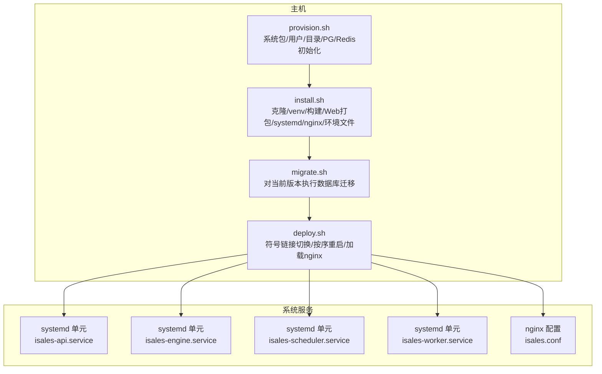
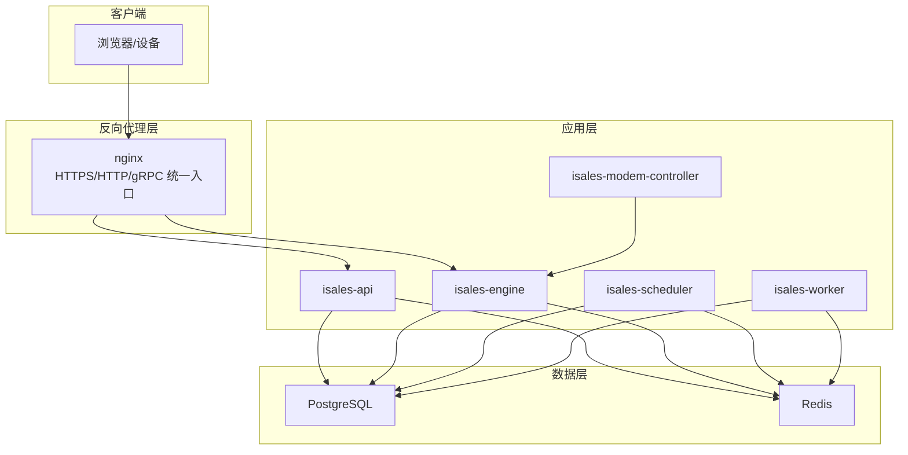
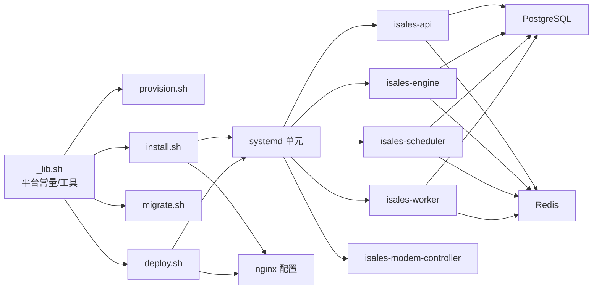

# 单主机部署模式

<cite>
**本文引用的文件**
- [provision.sh](file://deploy/linux/scripts/provision.sh)
- [install.sh](file://deploy/linux/scripts/install.sh)
- [migrate.sh](file://deploy/linux/scripts/migrate.sh)
- [deploy.sh](file://deploy/linux/scripts/deploy.sh)
- [_lib.sh](file://deploy/linux/scripts/_lib.sh)
- [isales-api.service](file://deploy/cloud/systemd/isales-api.service)
- [isales-engine.service](file://deploy/cloud/systemd/isales-engine.service)
- [isales-scheduler.service](file://deploy/cloud/systemd/isales-scheduler.service)
- [isales-worker.service](file://deploy/cloud/systemd/isales-worker.service)
- [isales.conf](file://deploy/cloud/nginx/isales.conf)
- [api.env.example](file://deploy/env/api.env.example)
- [engine.env.example](file://deploy/env/engine.env.example)
- [scheduler.env.example](file://deploy/env/scheduler.env.example)
- [worker.env.example](file://deploy/env/worker.env.example)
- [modem-controller.env.example](file://deploy/env/modem-controller.env.example)
</cite>

## 目录
1. [简介](#简介)
2. [项目结构](#项目结构)
3. [核心组件](#核心组件)
4. [架构总览](#架构总览)
5. [详细组件分析](#详细组件分析)
6. [依赖关系分析](#依赖关系分析)
7. [性能考虑](#性能考虑)
8. [故障排查指南](#故障排查指南)
9. [结论](#结论)
10. [附录](#附录)

## 简介
本文件面向iSales v1单主机部署模式，系统性阐述在Ubuntu 22.04 LTS环境下，如何以原子化发布、集中化环境变量、systemd统一管理与nginx反向代理为核心的设计与实现。该模式将7个服务进程（API、引擎、调度器、工作器、电话API、调制解调器控制器）与数据库(PostgreSQL)、缓存(Redis)统一部署在同一主机，通过共享虚拟环境与符号链接实现“当前版本”的原子切换，确保升级/回滚可逆且低风险。

## 项目结构
围绕单主机部署的关键脚本与配置如下：
- 主机初始化与基础设施：provision.sh
- 应用构建与系统集成：install.sh
- 数据库迁移：migrate.sh
- 发布与原子切换：deploy.sh
- Linux平台常量与工具：_lib.sh
- systemd服务单元：isales-api.service、isales-engine.service、isales-scheduler.service、isales-worker.service
- nginx反向代理：isales.conf
- 环境变量模板：api.env、engine.env、scheduler.env、worker.env、modem-controller.env

图表来源
- [provision.sh:1-224](file://deploy/linux/scripts/provision.sh#L1-L224)
- [install.sh:1-275](file://deploy/linux/scripts/install.sh#L1-L275)
- [migrate.sh:1-61](file://deploy/linux/scripts/migrate.sh#L1-L61)
- [deploy.sh:1-139](file://deploy/linux/scripts/deploy.sh#L1-L139)
- [isales-api.service:1-35](file://deploy/cloud/systemd/isales-api.service#L1-L35)
- [isales-engine.service:1-42](file://deploy/cloud/systemd/isales-engine.service#L1-L42)
- [isales-scheduler.service:1-31](file://deploy/cloud/systemd/isales-scheduler.service#L1-L31)
- [isales-worker.service:1-31](file://deploy/cloud/systemd/isales-worker.service#L1-L31)
- [isales.conf:1-103](file://deploy/cloud/nginx/isales.conf#L1-L103)

章节来源
- [provision.sh:1-224](file://deploy/linux/scripts/provision.sh#L1-L224)
- [install.sh:1-275](file://deploy/linux/scripts/install.sh#L1-L275)
- [migrate.sh:1-61](file://deploy/linux/scripts/migrate.sh#L1-L61)
- [deploy.sh:1-139](file://deploy/linux/scripts/deploy.sh#L1-L139)
- [_lib.sh:1-47](file://deploy/linux/scripts/_lib.sh#L1-L47)

## 核心组件
- 主机基础设施与用户权限
  - 使用系统用户isales运行所有服务；目录结构与权限由provision.sh集中创建与校验，确保幂等性。
- 虚拟环境与应用构建
  - install.sh在发布目录下创建共享虚拟环境，并安装公共包与各服务；随后构建前端产物并写入Web根目录。
- systemd统一管理
  - install.sh重写各服务单元，使其指向/opt/isales/current路径；通过EnvironmentFile drop-in集中管理环境变量。
- nginx反向代理
  - install.sh同步站点配置至/etc/nginx/sites-available并建立启用链接；deploy.sh仅reload nginx，避免中断。
- 数据库迁移
  - migrate.sh在当前版本上执行数据库迁移，支持dry-run预检。
- 发布与原子切换
  - deploy.sh原子切换current符号链接，并按依赖顺序重启服务；提供低峰窗口保护与强制标志。

章节来源
- [provision.sh:54-95](file://deploy/linux/scripts/provision.sh#L54-L95)
- [install.sh:104-126](file://deploy/linux/scripts/install.sh#L104-L126)
- [install.sh:128-173](file://deploy/linux/scripts/install.sh#L128-L173)
- [install.sh:175-194](file://deploy/linux/scripts/install.sh#L175-L194)
- [install.sh:196-236](file://deploy/linux/scripts/install.sh#L196-L236)
- [migrate.sh:38-60](file://deploy/linux/scripts/migrate.sh#L38-L60)
- [deploy.sh:70-114](file://deploy/linux/scripts/deploy.sh#L70-L114)

## 架构总览
单主机v1部署采用“共享虚拟环境 + 符号链接发布 + systemd集中环境变量 + nginx统一入口”的设计，确保：
- 升级/回滚原子化：通过current符号链接切换，不破坏旧版本。
- 启动顺序可控：按依赖顺序重启，避免服务间依赖未就绪导致失败。
- 环境变量集中：各服务通过EnvironmentFile drop-in从/etc/isales/env读取，便于一致性校验与运维。
- 反向代理统一：nginx负责静态资源、API转发与gRPC边缘流，简化TLS与连接管理。

图表来源
- [isales.conf:1-103](file://deploy/cloud/nginx/isales.conf#L1-L103)
- [isales-api.service:1-35](file://deploy/cloud/systemd/isales-api.service#L1-L35)
- [isales-engine.service:1-42](file://deploy/cloud/systemd/isales-engine.service#L1-L42)
- [isales-scheduler.service:1-31](file://deploy/cloud/systemd/isales-scheduler.service#L1-L31)
- [isales-worker.service:1-31](file://deploy/cloud/systemd/isales-worker.service#L1-L31)

## 详细组件分析

### 主机初始化(provision.sh)
- 功能要点
  - 安装系统依赖包（PostgreSQL、Redis、Nginx、Node.js、Python3.12等）
  - 创建系统用户isales（无登录shell）
  - 初始化/opt/isales与/etc/isales目录树，设置权限与属主
  - 配置Redis持久化（AOF），并确保服务可用
  - 初始化PostgreSQL角色与数据库；生成各服务的初始环境文件骨架
  - 可选安装调制解调器udev规则
- 幂等性保障
  - 对已存在的用户、目录、PostgreSQL对象进行跳过处理；对Redis配置追加include指令时先检查是否存在
- 关键步骤与文件
  - 目录与用户：见步骤2/3
  - Redis：见步骤4/6
  - PostgreSQL：见步骤5/6
  - udev规则：见步骤6/6

章节来源
- [provision.sh:48-52](file://deploy/linux/scripts/provision.sh#L48-L52)
- [provision.sh:55-67](file://deploy/linux/scripts/provision.sh#L55-L67)
- [provision.sh:84-95](file://deploy/linux/scripts/provision.sh#L84-L95)
- [provision.sh:99-127](file://deploy/linux/scripts/provision.sh#L99-L127)
- [provision.sh:143-186](file://deploy/linux/scripts/provision.sh#L143-L186)
- [provision.sh:189-208](file://deploy/linux/scripts/provision.sh#L189-L208)

### 应用安装(install.sh)
- 功能要点
  - 创建发布目录（/opt/isales/releases/<ts>），属主为isales
  - 克隆或更新7个仓库到发布目录
  - 在发布目录内创建共享虚拟环境并安装依赖
  - 构建isales-web前端产物
  - 同步systemd单元至/etc/systemd/system/并重写ExecStart/WorkingDirectory以指向current
  - 同步nginx站点配置至sites-available并建立启用链接
  - 写入各服务的EnvironmentFile drop-in，统一指向/etc/isales/env/<service>.env
  - 安装备份计划任务
- 关键步骤与文件
  - 发布目录与权限：见步骤1/8
  - 共享虚拟环境：见步骤3/8
  - 前端构建：见步骤4/8
  - systemd重写与安装：见步骤5/8
  - nginx配置与链接：见步骤6/8
  - 环境文件drop-in：见步骤7/8
  - 备份计划任务：见步骤8/8

章节来源
- [install.sh:85-89](file://deploy/linux/scripts/install.sh#L85-L89)
- [install.sh:93-102](file://deploy/linux/scripts/install.sh#L93-L102)
- [install.sh:106-116](file://deploy/linux/scripts/install.sh#L106-L116)
- [install.sh:120-126](file://deploy/linux/scripts/install.sh#L120-L126)
- [install.sh:154-173](file://deploy/linux/scripts/install.sh#L154-L173)
- [install.sh:177-194](file://deploy/linux/scripts/install.sh#L177-L194)
- [install.sh:208-236](file://deploy/linux/scripts/install.sh#L208-L236)
- [install.sh:240-255](file://deploy/linux/scripts/install.sh#L240-L255)

### 数据库迁移(migrate.sh)
- 功能要点
  - 在当前版本上执行alembic迁移（upgrade head）
  - 通过读取/etc/isales/env/api.env中的数据库URL执行迁移
  - 支持dry-run输出历史记录用于预检
- 关键步骤与文件
  - 读取环境变量并执行迁移：见步骤44-59

章节来源
- [migrate.sh:44-59](file://deploy/linux/scripts/migrate.sh#L44-L59)

### 发布与原子切换(deploy.sh)
- 功能要点
  - 原子切换current符号链接指向新发布目录
  - 按依赖顺序重启服务（电话API → 调度器 → 工作器 → 引擎 → API）
  - nginx仅reload，避免中断
  - 低峰窗口保护：默认22:00-次日08:00，非低峰需使用--force
  - 可选重启调制解调器控制器（--include-modem）
- 关键步骤与文件
  - 符号链接切换：见步骤72-78
  - 服务重启与校验：见步骤90-114
  - 低峰窗口判断：见步骤53-68

章节来源
- [deploy.sh:72-78](file://deploy/linux/scripts/deploy.sh#L72-L78)
- [deploy.sh:90-114](file://deploy/linux/scripts/deploy.sh#L90-L114)
- [deploy.sh:53-68](file://deploy/linux/scripts/deploy.sh#L53-L68)

### systemd服务单元
- 设计要点
  - 所有单元均指向/opt/isales/current下的venv与工作目录，确保与install.sh重写一致
  - 通过EnvironmentFile=/etc/isales/env/<service>.env集中注入环境变量
  - 启用重启策略与超时控制，增强稳定性
- 关键文件
  - isales-api.service：见[isales-api.service:1-35](file://deploy/cloud/systemd/isales-api.service#L1-L35)
  - isales-engine.service：见[isales-engine.service:1-42](file://deploy/cloud/systemd/isales-engine.service#L1-L42)
  - isales-scheduler.service：见[isales-scheduler.service:1-31](file://deploy/cloud/systemd/isales-scheduler.service#L1-L31)
  - isales-worker.service：见[isales-worker.service:1-31](file://deploy/cloud/systemd/isales-worker.service#L1-L31)

章节来源
- [isales-api.service:10-17](file://deploy/cloud/systemd/isales-api.service#L10-L17)
- [isales-engine.service:12-25](file://deploy/cloud/systemd/isales-engine.service#L12-L25)
- [isales-scheduler.service:10-15](file://deploy/cloud/systemd/isales-scheduler.service#L10-L15)
- [isales-worker.service:10-15](file://deploy/cloud/systemd/isales-worker.service#L10-L15)

### nginx反向代理
- 设计要点
  - 监听80/443/50051三端口：HTTP重定向HTTPS、HTTPS提供SPA与API、gRPC边缘流
  - API路径代理至isales-api的本地端口；WebSocket路径单独处理
  - gRPC长连接设置合理超时，边缘不可用时返回标准错误码
  - Web根目录指向/opt/isales/current/isales-web/dist，随current切换自动生效
- 关键文件
  - isales.conf：见[isales.conf:1-103](file://deploy/cloud/nginx/isales.conf#L1-L103)

章节来源
- [isales.conf:13-24](file://deploy/cloud/nginx/isales.conf#L13-L24)
- [isales.conf:27-69](file://deploy/cloud/nginx/isales.conf#L27-L69)
- [isales.conf:71-102](file://deploy/cloud/nginx/isales.conf#L71-L102)

### 环境变量集中化管理
- 设计要点
  - 各服务通过EnvironmentFile drop-in统一从/etc/isales/env读取
  - 提供跨服务一致性约束（如数据库URL、Redis URL、JWT/加密密钥等）
  - 模板文件位于deploy/env，安装阶段写入对应服务的env文件
- 关键文件
  - api.env.example：见[api.env.example:1-14](file://deploy/env/api.env.example#L1-L14)
  - engine.env.example：见[engine.env.example:1-21](file://deploy/env/engine.env.example#L1-L21)
  - scheduler.env.example：见[scheduler.env.example:1-21](file://deploy/env/scheduler.env.example#L1-L21)
  - worker.env.example：见[worker.env.example:1-20](file://deploy/env/worker.env.example#L1-L20)
  - modem-controller.env.example：见[modem-controller.env.example:1-15](file://deploy/env/modem-controller.env.example#L1-L15)

章节来源
- [install.sh:208-236](file://deploy/linux/scripts/install.sh#L208-L236)
- [api.env.example:9-13](file://deploy/env/api.env.example#L9-L13)
- [engine.env.example:8-10](file://deploy/env/engine.env.example#L8-L10)
- [scheduler.env.example:12-13](file://deploy/env/scheduler.env.example#L12-L13)
- [worker.env.example:9-11](file://deploy/env/worker.env.example#L9-L11)
- [modem-controller.env.example:7-10](file://deploy/env/modem-controller.env.example#L7-L10)

## 依赖关系分析
- 脚本依赖
  - deploy/linux/scripts/_lib.sh导出Linux平台常量（apt包列表、环境模板目录）与通用工具函数
  - install.sh依赖systemd与nginx配置源文件
  - deploy.sh依赖systemd与nginx命令行工具
- 服务依赖
  - API依赖数据库与Redis
  - 引擎依赖数据库、Redis与调制解调器控制器（可选）
  - 调度器与工作器依赖数据库与Redis
- 环境变量依赖
  - API、引擎、调度器、工作器、电话API需保持数据库URL与Redis URL一致
  - JWT/加密密钥需在相关服务间保持一致

图表来源
- [_lib.sh:17-38](file://deploy/linux/scripts/_lib.sh#L17-L38)
- [provision.sh:48-52](file://deploy/linux/scripts/provision.sh#L48-L52)
- [install.sh:154-173](file://deploy/linux/scripts/install.sh#L154-L173)
- [migrate.sh:38-47](file://deploy/linux/scripts/migrate.sh#L38-L47)
- [deploy.sh:90-114](file://deploy/linux/scripts/deploy.sh#L90-L114)
- [isales-api.service:10-17](file://deploy/cloud/systemd/isales-api.service#L10-L17)
- [isales-engine.service:12-25](file://deploy/cloud/systemd/isales-engine.service#L12-L25)
- [isales-scheduler.service:10-15](file://deploy/cloud/systemd/isales-scheduler.service#L10-L15)
- [isales-worker.service:10-15](file://deploy/cloud/systemd/isales-worker.service#L10-L15)

## 性能考虑
- 低峰窗口部署：deploy.sh默认在22:00-08:00之间允许引擎重启，避免影响活跃通话；非低峰需显式--force
- nginx超时与连接复用：API与gRPC分别设置合理的读/发送超时，提升长连接稳定性
- systemd超时与重启策略：引擎设置较长停止超时，避免在通话结束前被强制终止
- Redis AOF每秒同步：平衡持久性与性能，降低崩溃风险

## 故障排查指南
- 无法启动某服务
  - 查看最近journal：参考deploy.sh中对失败服务的诊断流程
  - 检查systemd状态与主进程PID
- nginx报错
  - 先执行配置测试再reload
  - 确认站点配置已启用且指向正确的dist目录
- 数据库迁移失败
  - 使用migrate.sh的dry-run查看历史记录，确认迁移状态
  - 检查数据库URL与凭据是否正确
- 环境变量不生效
  - 确认EnvironmentFile drop-in已写入且指向正确的文件
  - 检查/etc/isales/env文件权限与属主
- 低峰窗口拒绝部署
  - 在非低峰时段使用--force继续，但需注意引擎重启会中断活跃通话

章节来源
- [deploy.sh:98-103](file://deploy/linux/scripts/deploy.sh#L98-L103)
- [deploy.sh:105-106](file://deploy/linux/scripts/deploy.sh#L105-L106)
- [migrate.sh:49-59](file://deploy/linux/scripts/migrate.sh#L49-L59)
- [install.sh:226-235](file://deploy/linux/scripts/install.sh#L226-L235)

## 结论
iSales v1单主机部署模式通过“共享虚拟环境 + 符号链接发布 + systemd集中环境变量 + nginx统一入口”的组合，实现了在Ubuntu 22.04 LTS上的高可靠、可审计、可回滚的生产级部署。其关键优势在于：
- 升级/回滚原子化，风险可控
- 启动顺序与低峰窗口保护，降低业务中断概率
- 集中式环境变量与一致性模板，减少配置漂移
- 反向代理统一对接，简化TLS与长连接管理

## 附录

### Ubuntu 22.04 LTS基础依赖与用户权限
- 系统包：PostgreSQL、Redis、Nginx、Git、pkg-config、libudev-dev、libasound2-dev、Python3.12、Node.js、npm、curl、ca-certificates
- 系统用户：isales（无登录shell），用于运行所有服务
- 目录与权限：/opt/isales与/etc/isales由provision.sh集中创建与校验

章节来源
- [_lib.sh:19-33](file://deploy/linux/scripts/_lib.sh#L19-L33)
- [provision.sh:55-67](file://deploy/linux/scripts/provision.sh#L55-L67)
- [provision.sh:84-95](file://deploy/linux/scripts/provision.sh#L84-L95)

### 目录结构与文件权限
- /opt/isales：发布根目录，含releases与current符号链接
- /opt/isales/backups：备份目录（PG/Redis）
- /opt/isales/logs：日志目录
- /etc/isales/env：集中环境变量目录（0750 root:isales）
- /var/run/isales：运行时套接字目录
- nginx站点：/etc/nginx/sites-available/isales与sites-enabled链接

章节来源
- [provision.sh:84-95](file://deploy/linux/scripts/provision.sh#L84-L95)
- [install.sh:177-194](file://deploy/linux/scripts/install.sh#L177-L194)

### 服务启停顺序与低峰窗口
- 启停顺序：电话API → 调度器 → 工作器 → 引擎 → API
- nginx：reload而非restart
- 低峰窗口：默认22:00-次日08:00；可通过环境变量调整起止时间
- 强制标志：--force绕过低峰窗口限制，但会中断活跃通话

章节来源
- [deploy.sh:10-16](file://deploy/linux/scripts/deploy.sh#L10-L16)
- [deploy.sh:82-88](file://deploy/linux/scripts/deploy.sh#L82-L88)
- [deploy.sh:105-114](file://deploy/linux/scripts/deploy.sh#L105-L114)
- [deploy.sh:27-28](file://deploy/linux/scripts/deploy.sh#L27-L28)

### 环境变量集中化实现
- systemd drop-in：每个服务单元通过EnvironmentFile=/etc/isales/env/<service>.env读取
- 模板文件：位于deploy/env，安装阶段写入
- 一致性约束：数据库URL、Redis URL、JWT/加密密钥需在相关服务间保持一致

章节来源
- [install.sh:208-236](file://deploy/linux/scripts/install.sh#L208-L236)
- [api.env.example:9-13](file://deploy/env/api.env.example#L9-L13)
- [engine.env.example:8-10](file://deploy/env/engine.env.example#L8-L10)
- [scheduler.env.example:12-13](file://deploy/env/scheduler.env.example#L12-L13)
- [worker.env.example:9-11](file://deploy/env/worker.env.example#L9-L11)
- [modem-controller.env.example:7-10](file://deploy/env/modem-controller.env.example#L7-L10)

### 部署脚本幂等性保证机制
- provision.sh：对已存在对象跳过；对Redis配置追加include前先检查
- install.sh：对缺失的release目录创建并清理失败目录；对已存在的systemd/环境文件drop-in不重复写入
- migrate.sh：支持dry-run预检；仅对current版本执行迁移
- deploy.sh：仅在成功完成每一步后才进入下一步，失败时输出诊断信息

章节来源
- [provision.sh:58-66](file://deploy/linux/scripts/provision.sh#L58-L66)
- [provision.sh:104-112](file://deploy/linux/scripts/provision.sh#L104-L112)
- [install.sh:63-70](file://deploy/linux/scripts/install.sh#L63-L70)
- [install.sh:163-171](file://deploy/linux/scripts/install.sh#L163-L171)
- [install.sh:217-235](file://deploy/linux/scripts/install.sh#L217-L235)
- [migrate.sh:49-59](file://deploy/linux/scripts/migrate.sh#L49-L59)
- [deploy.sh:98-103](file://deploy/linux/scripts/deploy.sh#L98-L103)

### 完整安装流程
- 主机初始化：sudo bash deploy/linux/scripts/provision.sh [--with-modem] [--dry-run]
- 编辑环境变量：根据模板修改/etc/isales/env/*.env
- 应用安装：sudo bash deploy/linux/scripts/install.sh <git-ref>
- 数据库迁移：sudo bash deploy/linux/scripts/migrate.sh [--dry-run]
- 发布切换：sudo bash deploy/linux/scripts/deploy.sh <release-ts> [--include-modem] [--force] [--dry-run]

章节来源
- [provision.sh:212-221](file://deploy/linux/scripts/provision.sh#L212-L221)
- [install.sh:259-272](file://deploy/linux/scripts/install.sh#L259-L272)
- [migrate.sh:13-14](file://deploy/linux/scripts/migrate.sh#L13-L14)
- [deploy.sh:15-16](file://deploy/linux/scripts/deploy.sh#L15-L16)