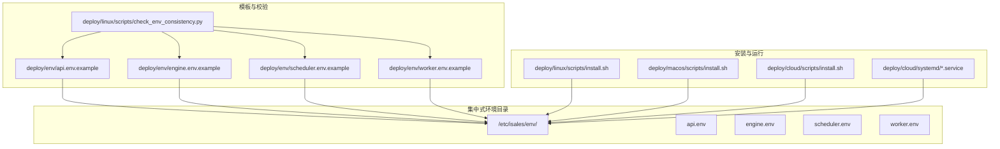
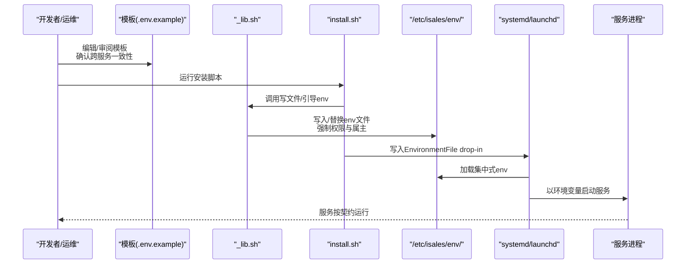
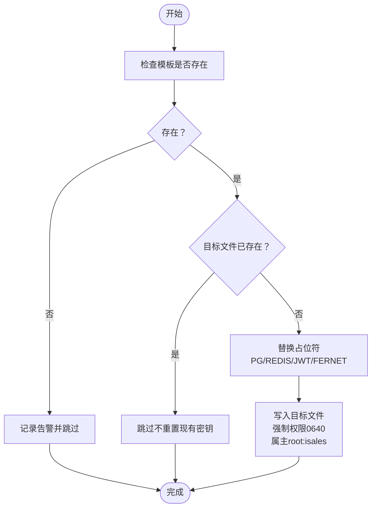
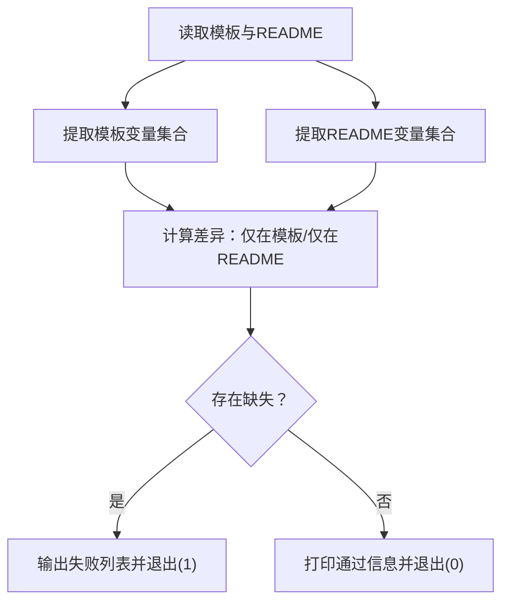
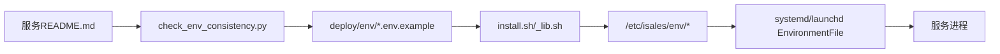

# 环境变量管理

<cite>
**本文引用的文件**
- [deploy/cloud/env/README.md](file://deploy/cloud/env/README.md)
- [deploy/cloud/env/SECRETS.md.example](file://deploy/cloud/env/SECRETS.md.example)
- [deploy/cloud/env/api.env](file://deploy/cloud/env/api.env)
- [deploy/cloud/env/engine.env](file://deploy/cloud/env/engine.env)
- [deploy/cloud/env/scheduler.env](file://deploy/cloud/env/scheduler.env)
- [deploy/cloud/env/worker.env](file://deploy/cloud/env/worker.env)
- [deploy/env/api.env.example](file://deploy/env/api.env.example)
- [deploy/env/engine.env.example](file://deploy/env/engine.env.example)
- [deploy/env/scheduler.env.example](file://deploy/env/scheduler.env.example)
- [deploy/env/worker.env.example](file://deploy/env/worker.env.example)
- [deploy/linux/scripts/check_env_consistency.py](file://deploy/linux/scripts/check_env_consistency.py)
- [deploy/common/_lib.sh](file://deploy/common/_lib.sh)
- [deploy/linux/scripts/install.sh](file://deploy/linux/scripts/install.sh)
- [deploy/macos/scripts/install.sh](file://deploy/macos/scripts/install.sh)
- [deploy/cloud/scripts/install.sh](file://deploy/cloud/scripts/install.sh)
- [deploy/cloud/systemd/isales-api.service](file://deploy/cloud/systemd/isales-api.service)
</cite>

## 目录
1. [简介](#简介)
2. [项目结构](#项目结构)
3. [核心组件](#核心组件)
4. [架构总览](#架构总览)
5. [详细组件分析](#详细组件分析)
6. [依赖关系分析](#依赖关系分析)
7. [性能考虑](#性能考虑)
8. [故障排查指南](#故障排查指南)
9. [结论](#结论)
10. [附录](#附录)

## 简介
本文件面向iSales系统的环境变量管理，系统性阐述集中化环境变量契约的设计理念与实现方案，解释跨服务一致性约束的保证机制，并给出/etc/isales/env/目录结构、文件权限管理、secret安全管理的最佳实践。同时覆盖各服务的环境变量配置、示例文件维护流程、deploy-check机制的验证规则，以及版本控制、变更管理与安全审计的要求。

## 项目结构
围绕环境变量管理的关键目录与文件如下：
- 集中式真实值：deploy/cloud/env/（云侧服务的真实值，含4个服务env与SECRETS.md）
- 示例模板：deploy/env/*.env.example（各服务的环境变量模板，标注跨服务一致性约束）
- 校验工具：deploy/linux/scripts/check_env_consistency.py（校验模板与服务README一致性）
- 平台通用库：deploy/common/_lib.sh（写文件、随机密钥、引导env等）
- 安装脚本：deploy/linux/macos/cloud/scripts/install.sh（安装/激活/环境文件落地）
- systemd单元：deploy/cloud/systemd/*.service（通过EnvironmentFile加载集中式env）

图表来源
- [deploy/env/api.env.example](file://deploy/env/api.env.example)
- [deploy/env/engine.env.example](file://deploy/env/engine.env.example)
- [deploy/env/scheduler.env.example](file://deploy/env/scheduler.env.example)
- [deploy/env/worker.env.example](file://deploy/env/worker.env.example)
- [deploy/cloud/env/api.env](file://deploy/cloud/env/api.env)
- [deploy/cloud/env/engine.env](file://deploy/cloud/env/engine.env)
- [deploy/cloud/env/scheduler.env](file://deploy/cloud/env/scheduler.env)
- [deploy/cloud/env/worker.env](file://deploy/cloud/env/worker.env)
- [deploy/linux/scripts/install.sh](file://deploy/linux/scripts/install.sh)
- [deploy/macos/scripts/install.sh](file://deploy/macos/scripts/install.sh)
- [deploy/cloud/scripts/install.sh](file://deploy/cloud/scripts/install.sh)
- [deploy/cloud/systemd/isales-api.service](file://deploy/cloud/systemd/isales-api.service)

章节来源
- [deploy/cloud/env/README.md](file://deploy/cloud/env/README.md)
- [deploy/env/api.env.example](file://deploy/env/api.env.example)
- [deploy/env/engine.env.example](file://deploy/env/engine.env.example)
- [deploy/env/scheduler.env.example](file://deploy/env/scheduler.env.example)
- [deploy/env/worker.env.example](file://deploy/env/worker.env.example)
- [deploy/linux/scripts/check_env_consistency.py](file://deploy/linux/scripts/check_env_consistency.py)
- [deploy/common/_lib.sh](file://deploy/common/_lib.sh)
- [deploy/linux/scripts/install.sh](file://deploy/linux/scripts/install.sh)
- [deploy/macos/scripts/install.sh](file://deploy/macos/scripts/install.sh)
- [deploy/cloud/scripts/install.sh](file://deploy/cloud/scripts/install.sh)
- [deploy/cloud/systemd/isales-api.service](file://deploy/cloud/systemd/isales-api.service)

## 核心组件
- 集中式环境目录：/etc/isales/env/，统一存放各服务的*.env，由安装脚本写入并受systemd/launchd加载。
- 模板与契约：deploy/env/*.env.example，明确列出服务所需变量及跨服务一致性约束。
- 校验器：check_env_consistency.py，确保模板变量与服务README声明一致。
- 平台通用库：_lib.sh提供写文件、随机密钥、引导env等能力，保障幂等与权限正确。
- 安装脚本：linux/macos/cloud三套install.sh负责将模板渲染为真实env并写入目标路径。
- 运行时加载：systemd/launchd通过EnvironmentFile加载集中式env，确保一致性与最小暴露面。

章节来源
- [deploy/cloud/env/README.md](file://deploy/cloud/env/README.md)
- [deploy/env/api.env.example](file://deploy/env/api.env.example)
- [deploy/env/engine.env.example](file://deploy/env/engine.env.example)
- [deploy/env/scheduler.env.example](file://deploy/env/scheduler.env.example)
- [deploy/env/worker.env.example](file://deploy/env/worker.env.example)
- [deploy/linux/scripts/check_env_consistency.py](file://deploy/linux/scripts/check_env_consistency.py)
- [deploy/common/_lib.sh](file://deploy/common/_lib.sh)
- [deploy/linux/scripts/install.sh](file://deploy/linux/scripts/install.sh)
- [deploy/macos/scripts/install.sh](file://deploy/macos/scripts/install.sh)
- [deploy/cloud/scripts/install.sh](file://deploy/cloud/scripts/install.sh)
- [deploy/cloud/systemd/isales-api.service](file://deploy/cloud/systemd/isales-api.service)

## 架构总览
集中化环境变量的运行时加载与一致性保证流程如下：

图表来源
- [deploy/env/api.env.example](file://deploy/env/api.env.example)
- [deploy/env/engine.env.example](file://deploy/env/engine.env.example)
- [deploy/env/scheduler.env.example](file://deploy/env/scheduler.env.example)
- [deploy/env/worker.env.example](file://deploy/env/worker.env.example)
- [deploy/common/_lib.sh](file://deploy/common/_lib.sh)
- [deploy/linux/scripts/install.sh](file://deploy/linux/scripts/install.sh)
- [deploy/macos/scripts/install.sh](file://deploy/macos/scripts/install.sh)
- [deploy/cloud/scripts/install.sh](file://deploy/cloud/scripts/install.sh)
- [deploy/cloud/systemd/isales-api.service](file://deploy/cloud/systemd/isales-api.service)

## 详细组件分析

### 集中式环境目录与文件权限
- 目录位置：/etc/isales/env/
- 权限策略：0640，属主root:isales，最小权限原则，仅isales组内成员可读取。
- 作用：所有服务统一从此处加载环境变量，避免分散配置带来的漂移与不一致。
- 一致性约束：模板中明确标注跨服务共享变量（如数据库/Redis连接串、JWT密钥、Fernet主密钥）需保持一致。

章节来源
- [deploy/cloud/env/README.md](file://deploy/cloud/env/README.md)
- [deploy/env/api.env.example](file://deploy/env/api.env.example)
- [deploy/env/engine.env.example](file://deploy/env/engine.env.example)
- [deploy/env/scheduler.env.example](file://deploy/env/scheduler.env.example)
- [deploy/env/worker.env.example](file://deploy/env/worker.env.example)

### 示例模板与跨服务一致性约束
- 模板来源：deploy/env/*.env.example
- 约束说明：模板中明确列出“跨服务一致性”要求，例如：
  - 数据库URL与Redis URL需在api/engine/scheduler/worker/telephony-api之间保持一致
  - JWT密钥需在api与telephony-api之间保持一致
  - Fernet主密钥需在api/engine/worker/scheduler之间保持一致
- 设计目的：通过显式约束降低因变量不一致导致的运行时错误。

章节来源
- [deploy/env/api.env.example](file://deploy/env/api.env.example)
- [deploy/env/engine.env.example](file://deploy/env/engine.env.example)
- [deploy/env/scheduler.env.example](file://deploy/env/scheduler.env.example)
- [deploy/env/worker.env.example](file://deploy/env/worker.env.example)

### Secret安全管理最佳实践
- 主密钥策略：Fernet主密钥（ISALES_FERNET_KEY）在4个env文件中保持一致，且仅在本地安全介质与离线副本中存储。
- 离线副本：SECRETS.md（gitignored）用于灾难恢复与二次备份，必须同步到密码管理器/Yubikey等离线安全介质。
- 生成与轮换：使用安全随机源生成密钥；轮换时需同步更新所有env与服务配置，并重启受影响服务。
- 历史清理：一旦密钥泄露，需强制推送历史重写，私有仓库保护不足以弥补公开泄露风险。

章节来源
- [deploy/cloud/env/README.md](file://deploy/cloud/env/README.md)
- [deploy/cloud/env/SECRETS.md.example](file://deploy/cloud/env/SECRETS.md.example)

### 安装与引导：从模板到真实env
- 幂等写入：_lib.sh的write_file确保仅当内容不同或文件缺失时才写入，并强制权限与属主。
- 引导env：bootstrap_env_file从模板复制并替换占位符（如数据库密码、JWT密钥、Fernet主密钥），避免重复重置已有密钥。
- 安装脚本职责：
  - linux/macos：写入/覆盖/etc/isales/env/*.env，生成systemd/launchd的EnvironmentFile drop-in。
  - cloud：安装云侧4个服务的systemd单元与nginx配置，同样写入集中式env。

图表来源
- [deploy/common/_lib.sh](file://deploy/common/_lib.sh)
- [deploy/env/api.env.example](file://deploy/env/api.env.example)
- [deploy/env/engine.env.example](file://deploy/env/engine.env.example)
- [deploy/env/scheduler.env.example](file://deploy/env/scheduler.env.example)
- [deploy/env/worker.env.example](file://deploy/env/worker.env.example)

章节来源
- [deploy/common/_lib.sh](file://deploy/common/_lib.sh)
- [deploy/linux/scripts/install.sh](file://deploy/linux/scripts/install.sh)
- [deploy/macos/scripts/install.sh](file://deploy/macos/scripts/install.sh)
- [deploy/cloud/scripts/install.sh](file://deploy/cloud/scripts/install.sh)

### 运行时加载与隔离
- systemd：通过EnvironmentFile drop-in指向集中式env，配合安全加固选项（如ProtectSystem、PrivateTmp等）提升安全性。
- launchd（macOS）：在安装阶段将env内联到plist的EnvironmentVariables字典，确保服务启动时可见。

章节来源
- [deploy/cloud/systemd/isales-api.service](file://deploy/cloud/systemd/isales-api.service)
- [deploy/macos/scripts/install.sh](file://deploy/macos/scripts/install.sh)

### deploy-check机制与验证规则
- 目标：确保deploy/env/<service>.env.example中的变量集合与对应服务README声明的服务环境变量保持一致。
- 约定：
  - 模板变量提取：解析.env.example中的所有大写全字母数字下划线变量名（包括注释中的占位变量）。
  - README变量提取：从各服务README中抽取“Environment”或“env”小节的ISALES_*变量，或telephony README中的表格列标记为“yes/opt”的变量。
- 匹配策略：允许模板额外携带平台约定变量（如TZ），允许特定服务模板携带调试/模拟开关；但禁止遗漏README声明的必需变量。
- 失败处理：任何缺失均导致退出码非零，便于CI/CD阻断。

图表来源
- [deploy/linux/scripts/check_env_consistency.py](file://deploy/linux/scripts/check_env_consistency.py)

章节来源
- [deploy/linux/scripts/check_env_consistency.py](file://deploy/linux/scripts/check_env_consistency.py)

### 云侧真实值与镜像流程
- 真实值存放：deploy/cloud/env/下的api/engine/scheduler/worker.env为真实值，供镜像至ECS。
- 镜像命令：通过scp将env文件推送到ECS的/etc/isales/env/，随后设置权限与属主。
- 一致性要求：真实值中的共享密钥（如JWT、Fernet）需与模板一致，且与telephony-api保持一致。

章节来源
- [deploy/cloud/env/README.md](file://deploy/cloud/env/README.md)
- [deploy/cloud/env/api.env](file://deploy/cloud/env/api.env)
- [deploy/cloud/env/engine.env](file://deploy/cloud/env/engine.env)
- [deploy/cloud/env/scheduler.env](file://deploy/cloud/env/scheduler.env)
- [deploy/cloud/env/worker.env](file://deploy/cloud/env/worker.env)

## 依赖关系分析
- 模板到真实值：install.sh调用_lib.sh写入真实env；cloud/macos/linux三套install.sh共同依赖统一的写入与权限策略。
- README到模板：check_env_consistency.py依赖各服务README的“Environment”小节或telephony README表格列标记。
- 运行时到配置：systemd/launchd通过EnvironmentFile加载集中式env，形成“配置—进程”的单向依赖链。

图表来源
- [deploy/linux/scripts/check_env_consistency.py](file://deploy/linux/scripts/check_env_consistency.py)
- [deploy/env/api.env.example](file://deploy/env/api.env.example)
- [deploy/env/engine.env.example](file://deploy/env/engine.env.example)
- [deploy/env/scheduler.env.example](file://deploy/env/scheduler.env.example)
- [deploy/env/worker.env.example](file://deploy/env/worker.env.example)
- [deploy/common/_lib.sh](file://deploy/common/_lib.sh)
- [deploy/linux/scripts/install.sh](file://deploy/linux/scripts/install.sh)
- [deploy/macos/scripts/install.sh](file://deploy/macos/scripts/install.sh)
- [deploy/cloud/scripts/install.sh](file://deploy/cloud/scripts/install.sh)
- [deploy/cloud/systemd/isales-api.service](file://deploy/cloud/systemd/isales-api.service)

章节来源
- [deploy/linux/scripts/check_env_consistency.py](file://deploy/linux/scripts/check_env_consistency.py)
- [deploy/common/_lib.sh](file://deploy/common/_lib.sh)
- [deploy/linux/scripts/install.sh](file://deploy/linux/scripts/install.sh)
- [deploy/macos/scripts/install.sh](file://deploy/macos/scripts/install.sh)
- [deploy/cloud/scripts/install.sh](file://deploy/cloud/scripts/install.sh)
- [deploy/cloud/systemd/isales-api.service](file://deploy/cloud/systemd/isales-api.service)

## 性能考虑
- 环境变量加载为进程启动时一次性操作，对运行时性能影响可忽略。
- 集中式env减少配置查找与合并成本，有利于启动稳定性。
- 使用最小权限文件模式（0640）与安全加固systemd选项，降低潜在攻击面，间接提升整体系统可靠性。

## 故障排查指南
- 模板与README不一致
  - 症状：make deploy-check失败，提示某些变量仅存在于模板或仅存在于README。
  - 排查：核对模板与对应服务README的小节名称与变量清单；必要时更新模板或README。
  - 参考：check_env_consistency.py的匹配逻辑与失败输出。
- 真实值未写入或权限错误
  - 症状：服务无法启动或访问数据库/Redis失败。
  - 排查：确认install.sh是否成功写入/etc/isales/env/*，权限是否为0640，属主是否为root:isales。
  - 参考：_lib.sh的write_file与bootstrap_env_file行为。
- 云侧镜像后服务异常
  - 症状：ECS上服务启动失败或鉴权失败。
  - 排查：确认镜像命令执行成功，且共享密钥（JWT/Fernet）与telephony-api一致。
  - 参考：cloud/env/README中的镜像与轮换流程。
- Secret泄漏或丢失
  - 症状：凭据不可用或历史泄露。
  - 排查：立即生成新Fernet主密钥，迁移provider_credential表；必要时强制推送历史重写。
  - 参考：SECRETS.md.example中的灾难恢复SOP。

章节来源
- [deploy/linux/scripts/check_env_consistency.py](file://deploy/linux/scripts/check_env_consistency.py)
- [deploy/common/_lib.sh](file://deploy/common/_lib.sh)
- [deploy/cloud/env/README.md](file://deploy/cloud/env/README.md)
- [deploy/cloud/env/SECRETS.md.example](file://deploy/cloud/env/SECRETS.md.example)

## 结论
iSales通过集中式环境变量管理实现了跨服务的一致性与可审计性：以模板为契约、以校验为门禁、以安装脚本为执行器、以systemd/launchd为加载器。配合严格的secret管理与权限策略，有效降低了配置漂移与安全风险。建议持续完善CI中的deploy-check，并将真实值逐步迁出git，进一步强化安全基线。

## 附录

### 版本控制与变更管理流程
- 模板变更：修改deploy/env/*.env.example后，运行deploy-check确保与README一致；提交PR并通过CI。
- 真实值变更：修改deploy/cloud/env/*.env后，同步更新SECRETS.md离线副本与密码管理器；必要时进行密钥轮换与历史重写。
- 发布与激活：通过install.sh生成/更新集中式env与drop-in；在Linux/macOS上daemon-reload后启动服务；云侧通过--activate切换当前版本并重启服务。

章节来源
- [deploy/env/api.env.example](file://deploy/env/api.env.example)
- [deploy/env/engine.env.example](file://deploy/env/engine.env.example)
- [deploy/env/scheduler.env.example](file://deploy/env/scheduler.env.example)
- [deploy/env/worker.env.example](file://deploy/env/worker.env.example)
- [deploy/cloud/env/README.md](file://deploy/cloud/env/README.md)
- [deploy/linux/scripts/install.sh](file://deploy/linux/scripts/install.sh)
- [deploy/macos/scripts/install.sh](file://deploy/macos/scripts/install.sh)
- [deploy/cloud/scripts/install.sh](file://deploy/cloud/scripts/install.sh)