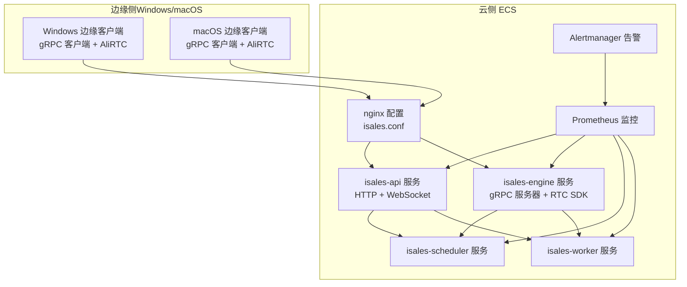
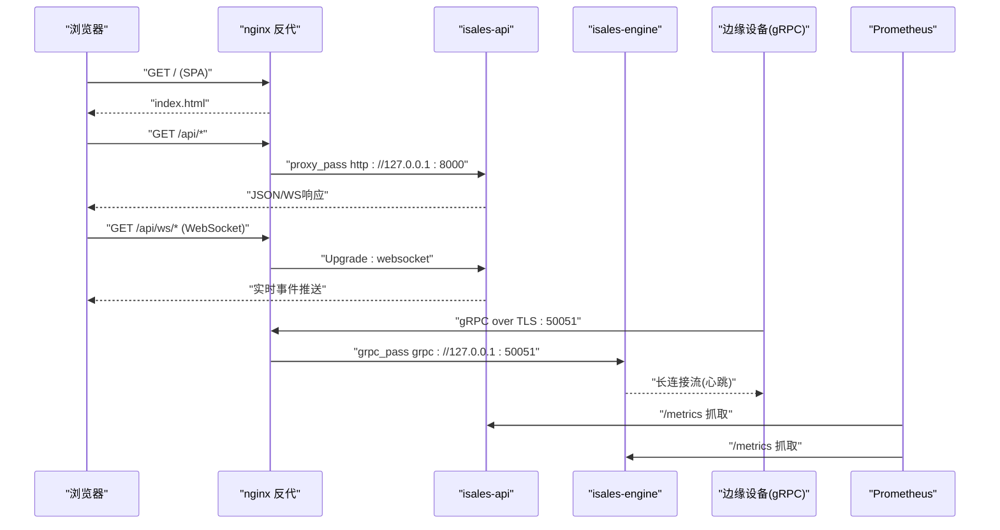
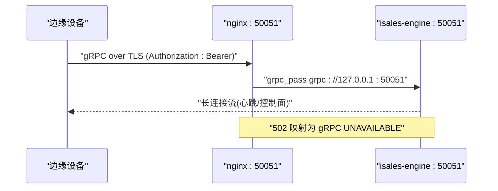
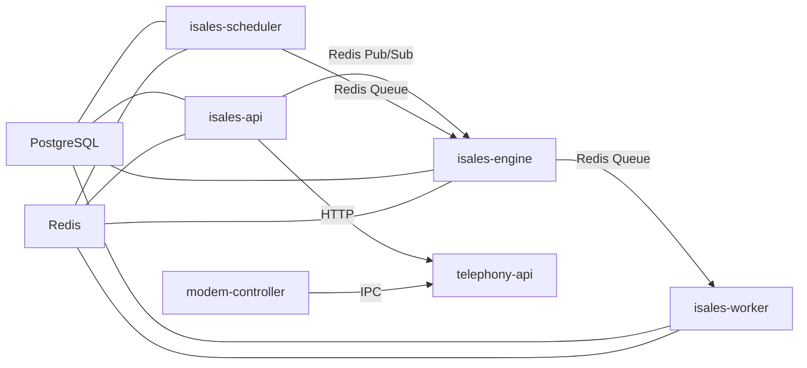

# 网络架构设计

<cite>
**本文引用的文件**
- [isales.conf](file://deploy/cloud/nginx/isales.conf)
- [prometheus.yml.example](file://deploy/cloud/monitoring/prometheus.yml.example)
- [alert_rules.yml.example](file://deploy/cloud/monitoring/alert_rules.yml.example)
- [api.env](file://deploy/cloud/env/api.env)
- [engine.env](file://deploy/cloud/env/engine.env)
- [scheduler.env](file://deploy/cloud/env/scheduler.env)
- [worker.env](file://deploy/cloud/env/worker.env)
- [isales-api.service](file://deploy/cloud/systemd/isales-api.service)
- [isales-engine.service](file://deploy/cloud/systemd/isales-engine.service)
- [isales-scheduler.service](file://deploy/cloud/systemd/isales-scheduler.service)
- [isales-worker.service](file://deploy/cloud/systemd/isales-worker.service)
- [deployment-topology/spec.md](file://openspec/specs/deployment-topology/spec.md)
- [service-communication/spec.md](file://openspec/specs/service-communication/spec.md)
- [architecture/spec.md](file://openspec/specs/architecture/spec.md)
- [cloud-edge-grpc-keepalive/proposal.md](file://openspec/changes/cloud-edge-grpc-keepalive/proposal.md)
</cite>

## 目录
1. [简介](#简介)
2. [项目结构](#项目结构)
3. [核心组件](#核心组件)
4. [架构总览](#架构总览)
5. [详细组件分析](#详细组件分析)
6. [依赖分析](#依赖分析)
7. [性能考虑](#性能考虑)
8. [故障排查指南](#故障排查指南)
9. [结论](#结论)
10. [附录](#附录)

## 简介
本技术文档面向iSales系统的网络架构设计，聚焦于云边一体的部署拓扑、反向代理与静态资源服务、HTTP/WebSocket代理规则、HTML5 History路由支持、gRPC TLS端点访问、阿里RTC媒体面UDP端口要求、防火墙与安全组配置、网络监控指标与性能调优、以及网络安全最佳实践。文档基于仓库中的实际配置与规范文件进行梳理，并提供可视化图示帮助读者理解。

## 项目结构
围绕网络相关的核心文件主要分布在以下位置：
- 反向代理与静态资源：nginx配置
- 服务单元与运行时：systemd服务单元
- 环境变量与密钥：集中化env文件
- 监控与告警：Prometheus与Alertmanager配置
- 架构与部署规范：OpenSpec规范文档

图表来源
- [isales.conf:1-103](file://deploy/cloud/nginx/isales.conf#L1-L103)
- [isales-api.service:1-35](file://deploy/cloud/systemd/isales-api.service#L1-L35)
- [isales-engine.service:1-42](file://deploy/cloud/systemd/isales-engine.service#L1-L42)
- [isales-scheduler.service:1-31](file://deploy/cloud/systemd/isales-scheduler.service#L1-L31)
- [isales-worker.service:1-31](file://deploy/cloud/systemd/isales-worker.service#L1-L31)
- [prometheus.yml.example:1-77](file://deploy/cloud/monitoring/prometheus.yml.example#L1-L77)

章节来源
- [deployment-topology/spec.md:317-414](file://openspec/specs/deployment-topology/spec.md#L317-L414)

## 核心组件
- nginx反向代理与静态资源服务：提供SPA静态文件服务、/api与/ws的HTTP/WebSocket代理、以及HTML5 History路由回退。
- gRPC TLS端点：nginx终止TLS，转发至本地engine的gRPC服务，支持长连接与心跳。
- 服务进程与监听：各服务通过systemd管理，监听端口与地址遵循v1.0公开监听策略。
- 监控与告警：Prometheus抓取各服务/metrics端点，结合Alertmanager规则进行健康告警。
- 环境变量与密钥：集中化管理数据库、Redis、JWT密钥、Fernet主密钥等敏感信息。

章节来源
- [isales.conf:1-103](file://deploy/cloud/nginx/isales.conf#L1-L103)
- [isales-api.service:1-35](file://deploy/cloud/systemd/isales-api.service#L1-L35)
- [isales-engine.service:1-42](file://deploy/cloud/systemd/isales-engine.service#L1-L42)
- [prometheus.yml.example:1-77](file://deploy/cloud/monitoring/prometheus.yml.example#L1-L77)
- [api.env:1-18](file://deploy/cloud/env/api.env#L1-L18)
- [engine.env:1-62](file://deploy/cloud/env/engine.env#L1-L62)

## 架构总览
下图展示了iSales云边网络的整体交互：浏览器通过nginx访问admin SPA与API；gRPC流用于边缘设备与engine之间的云边控制面；WebSocket用于实时事件推送；Prometheus负责采集与告警。

图表来源
- [isales.conf:26-102](file://deploy/cloud/nginx/isales.conf#L26-L102)
- [service-communication/spec.md:106-131](file://openspec/specs/service-communication/spec.md#L106-L131)
- [architecture/spec.md:130-168](file://openspec/specs/architecture/spec.md#L130-L168)

## 详细组件分析

### nginx反向代理与SPA静态资源
- 监听与证书
  - 80端口：HTTP重定向至HTTPS
  - 443端口：HTTPS + HTTP/2，启用TLSv1.2/1.3，配置会话缓存与超时
  - 50051端口：独立gRPC监听，TLS终止于nginx
- 静态资源服务
  - 根目录指向/var/www/isales-web，index为index.html
  - HTML5 History路由回退：location / 使用try_files $uri $uri/ /index.html
- API与WebSocket代理
  - /api/代理至127.0.0.1:8000，透传Host/X-Real-IP/X-Forwarded-*头
  - /api/ws/升级为WebSocket，设置Upgrade/Connection头，延长读写超时
- gRPC代理
  - grpc_pass至127.0.0.1:50051，设置长连接读写超时
  - 502错误映射为gRPC UNAVAILABLE响应，便于边缘侧识别服务不可达

章节来源
- [isales.conf:12-102](file://deploy/cloud/nginx/isales.conf#L12-L102)
- [deployment-topology/spec.md:317-414](file://openspec/specs/deployment-topology/spec.md#L317-L414)

### HTTP/WebSocket代理规则与HTML5 History路由
- HTTP代理
  - 透传关键头部，确保后端可感知真实客户端IP与协议
  - 连接超时与读取超时设置，保证快速失败与长连接稳定性
- WebSocket
  - 升级头透传，读写超时≥300秒，适配监控/直播类长连接
- HTML5 History路由
  - 所有未命中静态文件的请求回退到/index.html，交由前端路由接管

章节来源
- [isales.conf:44-68](file://deploy/cloud/nginx/isales.conf#L44-L68)
- [deployment-topology/spec.md:350-374](file://openspec/specs/deployment-topology/spec.md#L350-L374)

### gRPC TLS端点与云边通信
- 端点监听
  - nginx监听50051，TLS终止，证书来自Let's Encrypt
  - engine监听50051，长连接与心跳周期要求较长超时
- 边缘设备接入
  - 边缘设备通过gRPC TLS连接engine，携带Bearer Token（edge身份）
  - nginx不解析Token，仅转发metadata，engine负责校验
- keepalive与idle超时
  - 部署侧需避免安全组/SLB对50051配置stateful idle-cleanup
  - 若接入七层/HTTP/2模式，idle-timeout需≥60分钟

图表来源
- [isales.conf:71-102](file://deploy/cloud/nginx/isales.conf#L71-L102)
- [engine.env:46-54](file://deploy/cloud/env/engine.env#L46-L54)
- [cloud-edge-grpc-keepalive/proposal.md:59-91](file://openspec/changes/cloud-edge-grpc-keepalive/proposal.md#L59-L91)

章节来源
- [isales.conf:71-102](file://deploy/cloud/nginx/isales.conf#L71-L102)
- [engine.env:46-54](file://deploy/cloud/env/engine.env#L46-L54)
- [cloud-edge-grpc-keepalive/proposal.md:59-91](file://openspec/changes/cloud-edge-grpc-keepalive/proposal.md#L59-L91)

### 阿里RTC媒体面UDP端口要求
- 边缘设备需可出向访问云端gRPC TLS端点与阿里RTC媒体面
- 媒体会议使用动态UDP端口段（备用TCP），具体范围以阿里RTC官方文档为准
- Windows边缘客户端仅出向访问，不监听公网端口

章节来源
- [deployment-topology/spec.md:253-261](file://openspec/specs/deployment-topology/spec.md#L253-L261)

### 防火墙与安全组配置
- 云侧ECS安全组
  - 80/TCP入站：允许0.0.0.0/0（v1.0阶段，后续C2阶段收紧）
  - 50051/TCP入站：允许边缘设备出向访问（若采用公网直连策略）
- 传输层与中间层
  - 避免对50051配置stateful idle-cleanup
  - 若接入SLB/WAF，需确认七层模式支持HTTP/2长连接，idle-timeout≥60分钟

章节来源
- [deployment-topology/spec.md:328-338](file://openspec/specs/deployment-topology/spec.md#L328-L338)
- [cloud-edge-grpc-keepalive/proposal.md:59-67](file://openspec/changes/cloud-edge-grpc-keepalive/proposal.md#L59-L67)

### 服务进程与监听策略
- isales-api
  - 监听0.0.0.0:8000（v1.0阶段保持公网可达，作为Swagger与故障排查通道）
  - 提供WebSocket /ws/calls/{campaign_id}用于实时事件推送
- isales-engine
  - 监听0.0.0.0:50051（gRPC双向流，公网可达）
  - 长连接与心跳要求，超时参数需与nginx一致
- 其他服务
  - scheduler与worker监听本地端口，通过Redis队列/发布订阅与engine/api交互

章节来源
- [deployment-topology/spec.md:375-383](file://openspec/specs/deployment-topology/spec.md#L375-L383)
- [isales-api.service:1-35](file://deploy/cloud/systemd/isales-api.service#L1-L35)
- [isales-engine.service:1-42](file://deploy/cloud/systemd/isales-engine.service#L1-L42)

### 网络监控指标与告警
- Prometheus抓取
  - isales-api:8000、isales-engine:8002、isales-scheduler:8003、isales-worker:8004
  - node_exporter、postgres_exporter、redis_exporter等
- 关键告警
  - 边缘设备离线（心跳超阈值）
  - gRPC断线风暴（短时间内频繁断线）
  - ARTC推送音频缓冲区满（短期高频）
  - 引擎管道首字节延迟P95超预算
  - 回调失败率、PG连接数占比

章节来源
- [prometheus.yml.example:1-77](file://deploy/cloud/monitoring/prometheus.yml.example#L1-L77)
- [alert_rules.yml.example:1-116](file://deploy/cloud/monitoring/alert_rules.yml.example#L1-L116)

## 依赖分析
- 服务间通信
  - 调度：scheduler→engine（Redis队列）
  - 处理：engine→worker（Redis队列）
  - 实时控制：api↔engine（Redis发布订阅）
  - 外部回调：worker→外部（HTTP）
- 数据存储
  - PostgreSQL与Redis由各服务直连，通过isales-common模型访问
- 前端与后端
  - isales-web通过nginx反代访问isales-api，同源避免CORS
  - WebSocket鉴权使用JWT，后端验证失败立即关闭连接

图表来源
- [service-communication/spec.md:11-24](file://openspec/specs/service-communication/spec.md#L11-L24)
- [architecture/spec.md:130-168](file://openspec/specs/architecture/spec.md#L130-L168)

章节来源
- [service-communication/spec.md:11-24](file://openspec/specs/service-communication/spec.md#L11-L24)
- [architecture/spec.md:130-168](file://openspec/specs/architecture/spec.md#L130-L168)

## 性能考虑
- nginx超时参数
  - API代理读超时≥75s，WebSocket读写超时≥3600s，gRPC读写超时≥3600s
  - 代理连接超时≤5s，确保API重启/故障时快速失败
- gRPC长连接
  - 502映射为gRPC UNAVAILABLE，便于边缘侧区分“服务不可达”
  - 部署侧避免stateful idle-cleanup与短idle-timeout
- WebSocket
  - 读写超时≥300s，适配监控/直播类长连接
- 监控抓取间隔
  - 全局抓取间隔30s，规则评估间隔30s，平衡准确性与开销

章节来源
- [isales.conf:44-102](file://deploy/cloud/nginx/isales.conf#L44-L102)
- [prometheus.yml.example:10-12](file://deploy/cloud/monitoring/prometheus.yml.example#L10-L12)

## 故障排查指南
- nginx 502错误
  - 检查engine是否正常监听50051，确认gRPC服务可用
  - 查看nginx error.log与engine日志，定位连接/认证问题
- gRPC断线与心跳异常
  - 检查安全组/SLB是否配置stateful idle-cleanup或短idle-timeout
  - 使用云边连通性测试脚本进行长时间保活验证
- WebSocket连接失败
  - 确认JWT有效且未过期
  - 检查nginx升级头透传与超时设置
- 监控告警
  - 边缘离线：检查engine日志与edge设备token有效性
  - ARTC缓冲区满：检查网络拥塞与引擎TTS提供方性能
  - 回调失败率：检查外部系统可用性与重试策略

章节来源
- [isales.conf:95-101](file://deploy/cloud/nginx/isales.conf#L95-L101)
- [alert_rules.yml.example:14-102](file://deploy/cloud/monitoring/alert_rules.yml.example#L14-L102)
- [cloud-edge-grpc-keepalive/proposal.md:59-91](file://openspec/changes/cloud-edge-grpc-keepalive/proposal.md#L59-L91)

## 结论
iSales的网络架构在v1.0采用“nginx + 服务进程”的单主机部署模型，通过nginx统一提供SPA静态服务、API与WebSocket代理、以及gRPC TLS端点。云边控制面采用gRPC长连接与心跳机制，配合部署侧的安全组/SLB配置避免stateful idle-cleanup导致的连接中断。监控体系通过Prometheus与Alertmanager覆盖关键健康指标，保障系统可观测性与可维护性。后续C2阶段可在域名与HTTPS就绪后收紧公网暴露策略，进一步降低攻击面。

## 附录
- 环境变量与密钥
  - 数据库URL、Redis URL、JWT密钥、Fernet主密钥等集中管理，权限严格控制
- 回滚路径
  - nginx与SPA部署回滚步骤明确，不影响后端服务

章节来源
- [api.env:1-18](file://deploy/cloud/env/api.env#L1-L18)
- [engine.env:1-62](file://deploy/cloud/env/engine.env#L1-L62)
- [scheduler.env:1-17](file://deploy/cloud/env/scheduler.env#L1-L17)
- [worker.env:1-17](file://deploy/cloud/env/worker.env#L1-L17)
- [deployment-topology/spec.md:40-61](file://openspec/specs/deployment-topology/spec.md#L40-L61)
- [deployment-topology/spec.md:405-414](file://openspec/specs/deployment-topology/spec.md#L405-L414)