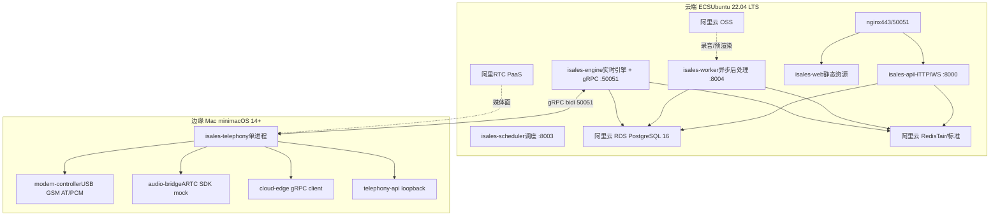
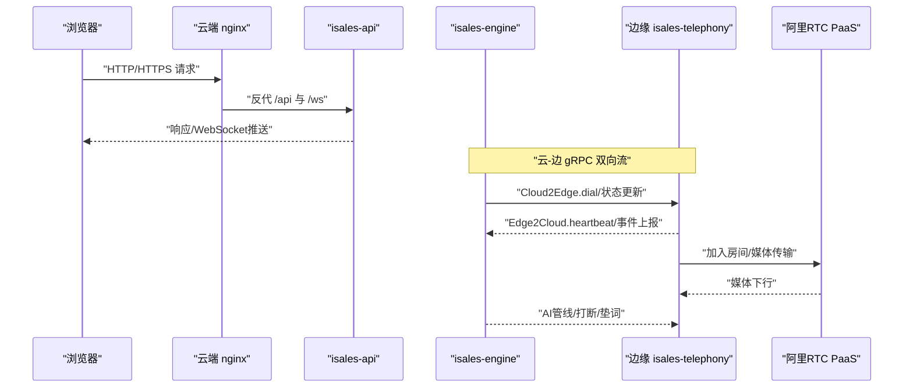
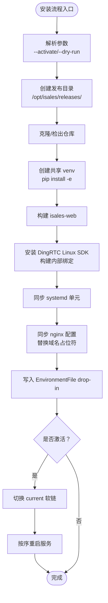
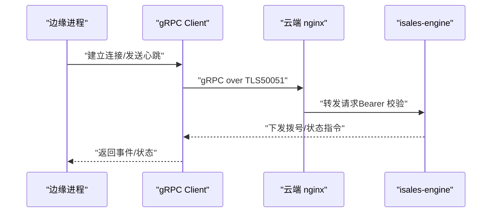
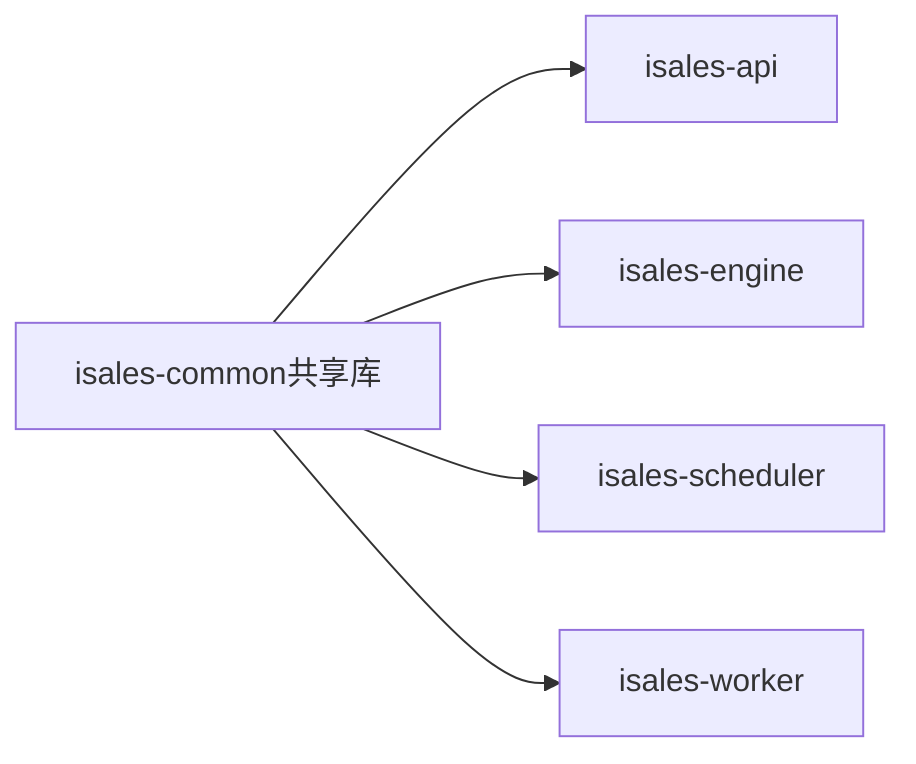

# 部署拓扑架构

<cite>
**本文引用的文件**
- [deploy/cloud/README.md](file://deploy/cloud/README.md)
- [deploy/edge/README.md](file://deploy/edge/README.md)
- [openspec/specs/deployment-topology/spec.md](file://openspec/specs/deployment-topology/spec.md)
- [openspec/specs/architecture/spec.md](file://openspec/specs/architecture/spec.md)
- [deploy/cloud/nginx/isales.conf](file://deploy/cloud/nginx/isales.conf)
- [deploy/cloud/systemd/isales-api.service](file://deploy/cloud/systemd/isales-api.service)
- [deploy/cloud/systemd/isales-engine.service](file://deploy/cloud/systemd/isales-engine.service)
- [deploy/cloud/systemd/isales-scheduler.service](file://deploy/cloud/systemd/isales-scheduler.service)
- [deploy/cloud/systemd/isales-worker.service](file://deploy/cloud/systemd/isales-worker.service)
- [deploy/cloud/scripts/install.sh](file://deploy/cloud/scripts/install.sh)
- [deploy/edge/launchd/com.isales.telephony.plist](file://deploy/edge/launchd/com.isales.telephony.plist)
- [deploy/edge/scripts/install.sh](file://deploy/edge/scripts/install.sh)
- [deploy/cloud/env/README.md](file://deploy/cloud/env/README.md)
- [deploy/RUNBOOK.md](file://deploy/RUNBOOK.md)
</cite>

## 目录
1. [简介](#简介)
2. [项目结构](#项目结构)
3. [核心组件](#核心组件)
4. [架构总览](#架构总览)
5. [详细组件分析](#详细组件分析)
6. [依赖关系分析](#依赖关系分析)
7. [性能考量](#性能考量)
8. [故障排查指南](#故障排查指南)
9. [结论](#结论)
10. [附录](#附录)

## 简介
本文件面向iSales系统的部署拓扑，系统性阐述“云-边分离”部署模式的设计思想与技术实现，覆盖云端ECS服务器集群与边缘设备的部署策略、单主机与分布式两种模式的适用场景与配置差异、网络架构与负载均衡策略、高可用性设计与故障转移机制，并给出部署环境准备、服务编排、容器化部署与基础设施配置的完整流程说明。

## 项目结构
iSales采用“云-边分离”的双套部署拓扑：
- 云端（ECS）：运行API、引擎、调度器、工作器与Web静态资源，通过nginx统一反向代理与gRPC入口，托管中间件包括RDS、Redis、OSS与阿里RTC。
- 边缘（Mac mini）：运行telephony进程（modem-controller + audio-bridge + cloud-edge gRPC client + telephony-api loopback），通过gRPC与云端交互，媒体面使用阿里RTC，不暴露公网端口。

图表来源
- [deploy/cloud/README.md:12-52](file://deploy/cloud/README.md#L12-L52)
- [deploy/edge/README.md:12-39](file://deploy/edge/README.md#L12-L39)

章节来源
- [deploy/cloud/README.md:1-118](file://deploy/cloud/README.md#L1-L118)
- [deploy/edge/README.md:1-99](file://deploy/edge/README.md#L1-L99)
- [openspec/specs/architecture/spec.md:130-168](file://openspec/specs/architecture/spec.md#L130-L168)

## 核心组件
- 云端服务单元（systemd）
  - isales-api：HTTP + WebSocket，监听8000端口，由nginx反代。
  - isales-engine：实时引擎，内置gRPC服务监听50051，负责云-边双向流控制。
  - isales-scheduler：线索调度，监听8003。
  - isales-worker：异步后处理，监听8004。
- 云端Web与反向代理
  - nginx配置同时服务SPA静态资源与API/WS反代，并单独监听50051用于gRPC双向流。
- 边缘进程（launchd）
  - com.isales.telephony：单一LaunchAgent，包含modem-controller、audio-bridge、cloud-edge gRPC client与telephony-api loopback。
- 环境与凭证
  - 集中式EnvironmentFile（/etc/isales/env/*.env），敏感信息集中管理，支持凭据SSOT（数据库存储）与主密钥轮换。

章节来源
- [deploy/cloud/systemd/isales-api.service:1-35](file://deploy/cloud/systemd/isales-api.service#L1-L35)
- [deploy/cloud/systemd/isales-engine.service:1-42](file://deploy/cloud/systemd/isales-engine.service#L1-L42)
- [deploy/cloud/systemd/isales-scheduler.service:1-31](file://deploy/cloud/systemd/isales-scheduler.service#L1-L31)
- [deploy/cloud/systemd/isales-worker.service:1-31](file://deploy/cloud/systemd/isales-worker.service#L1-L31)
- [deploy/cloud/nginx/isales.conf:1-103](file://deploy/cloud/nginx/isales.conf#L1-L103)
- [deploy/edge/launchd/com.isales.telephony.plist:1-75](file://deploy/edge/launchd/com.isales.telephony.plist#L1-L75)
- [deploy/cloud/env/README.md:1-106](file://deploy/cloud/env/README.md#L1-L106)

## 架构总览
云-边分离的核心在于：
- 控制面：云端isales-engine通过gRPC向边缘提供“拨号/状态”等控制指令，边缘以心跳与事件上报维持双向流。
- 数据面：媒体面通过阿里RTC PaaS承载，边缘与云端均不暴露公网端口（除gRPC入口外）。
- 网络边界：nginx在云端统一入口，API/WS与gRPC分离监听，便于TLS终止与鉴权。

图表来源
- [deploy/cloud/nginx/isales.conf:26-69](file://deploy/cloud/nginx/isales.conf#L26-L69)
- [deploy/cloud/nginx/isales.conf:71-102](file://deploy/cloud/nginx/isales.conf#L71-L102)
- [deploy/edge/README.md:12-39](file://deploy/edge/README.md#L12-L39)

章节来源
- [deploy/cloud/README.md:10-52](file://deploy/cloud/README.md#L10-L52)
- [deploy/edge/README.md:10-39](file://deploy/edge/README.md#L10-L39)

## 详细组件分析

### 云端ECS部署（单实例形态）
- 目录骨架与版本化发布
  - /opt/isales/releases/<ts>/：按时间戳发布，current为原子软链。
  - 4个云端服务与isales-web共同部署，venv共享。
- systemd服务与安全加固
  - API/Engine/Scheduler/Worker均通过EnvironmentFile注入集中化env。
  - Engine服务对ARTC SDK路径进行注入，确保运行时加载。
- nginx反向代理与gRPC入口
  - 443：SPA静态资源 + /api与/ws反代至isales-api。
  - 50051：gRPC双向流，TLS终止于nginx，bearer令牌由engine校验。
- 中间件与资源
  - RDS/Redis/OSS/阿里RTC按需使用，OSS在v1.0尚未启用。

图表来源
- [deploy/cloud/scripts/install.sh:20-300](file://deploy/cloud/scripts/install.sh#L20-L300)

章节来源
- [deploy/cloud/README.md:31-52](file://deploy/cloud/README.md#L31-L52)
- [deploy/cloud/systemd/isales-api.service:16-31](file://deploy/cloud/systemd/isales-api.service#L16-L31)
- [deploy/cloud/systemd/isales-engine.service:20-39](file://deploy/cloud/systemd/isales-engine.service#L20-L39)
- [deploy/cloud/nginx/isales.conf:26-102](file://deploy/cloud/nginx/isales.conf#L26-L102)
- [deploy/cloud/scripts/install.sh:68-94](file://deploy/cloud/scripts/install.sh#L68-L94)

### 边缘Mac mini部署（单进程形态）
- 进程模型
  - 单一LaunchAgent（com.isales.telephony）内含modem-controller、audio-bridge、cloud-edge gRPC client与telephony-api loopback。
- 环境与状态
  - 用户级env：~/.config/isales/edge.env；状态目录：~/Library/Application Support/isales/。
- 网络与安全
  - 不暴露公网端口；gRPC通过云端50051入口，TLS由nginx终止，边缘以Bearer令牌认证。

图表来源
- [deploy/edge/launchd/com.isales.telephony.plist:26-72](file://deploy/edge/launchd/com.isales.telephony.plist#L26-L72)
- [deploy/cloud/nginx/isales.conf:71-102](file://deploy/cloud/nginx/isales.conf#L71-L102)

章节来源
- [deploy/edge/README.md:12-39](file://deploy/edge/README.md#L12-L39)
- [deploy/edge/launchd/com.isales.telephony.plist:1-75](file://deploy/edge/launchd/com.isales.telephony.plist#L1-L75)
- [deploy/edge/scripts/install.sh:100-222](file://deploy/edge/scripts/install.sh#L100-L222)

### 单主机部署与分布式部署的差异
- 单主机（v1.0）
  - 7个服务在同一主机（Linux/macOS），systemd/launchd管理，无容器编排。
  - 云端仍监听公网端口（API/WS与gRPC），v1.x阶段统一IP公开策略。
- 分布式（v2+）
  - 多主机扩展，服务解耦与横向扩展；需引入服务网格、mTLS与服务发现。
  - 本change限定v1.0单实例形态，分布式不在本阶段范围。

章节来源
- [openspec/specs/deployment-topology/spec.md:6-38](file://openspec/specs/deployment-topology/spec.md#L6-L38)
- [openspec/specs/deployment-topology/spec.md:317-383](file://openspec/specs/deployment-topology/spec.md#L317-L383)
- [deploy/cloud/README.md:116-118](file://deploy/cloud/README.md#L116-L118)

### 网络架构与负载均衡策略
- 入口与监听
  - 云端nginx监听80/443/50051，API/WS与gRPC分离，便于TLS与鉴权策略。
- 负载均衡
  - v1.0为单实例形态，重启约30-60秒中断；不在本change范围内引入多实例/HA。
- 端口与防火墙
  - 入网：443（web/api）、50051（gRPC bidi）。
  - 出网：443（第三方服务/证书OCSP）、UDP（阿里RTC，SDK自管端口）。

章节来源
- [deploy/cloud/README.md:55-66](file://deploy/cloud/README.md#L55-L66)
- [deploy/cloud/nginx/isales.conf:3-7](file://deploy/cloud/nginx/isales.conf#L3-L7)
- [deploy/edge/README.md:44-53](file://deploy/edge/README.md#L44-L53)

### 高可用性设计与故障转移
- 服务重启与顺序
  - install完成后按顺序重启，避免下游风暴；engine重启会中断活跃通话，需在低峰期执行。
- 回滚与数据库
  - rollback不触碰schema，仅切换软链并重启服务；数据库回滚需手动执行RUNBOOK中的步骤。
- 备份与恢复
  - 日级别PG与Redis备份，保留14天；提供恢复演练步骤与校验标准。

章节来源
- [openspec/specs/deployment-topology/spec.md:62-74](file://openspec/specs/deployment-topology/spec.md#L62-L74)
- [openspec/specs/deployment-topology/spec.md:114-132](file://openspec/specs/deployment-topology/spec.md#L114-L132)
- [openspec/specs/deployment-topology/spec.md:76-94](file://openspec/specs/deployment-topology/spec.md#L76-L94)
- [deploy/RUNBOOK.md:84-115](file://deploy/RUNBOOK.md#L84-L115)

### 凭证与密钥管理
- 集中式env与SSOT
  - 4个cloud env文件集中存放，敏感信息权限0640；凭据迁移到数据库SSOT，env仅保留主密钥。
- 主密钥与轮换
  - Fernet主密钥生成与轮换流程，首次部署通过CLI导入至DB；轮换后需重启受影响服务。

章节来源
- [deploy/cloud/env/README.md:28-47](file://deploy/cloud/env/README.md#L28-L47)
- [deploy/cloud/env/README.md:78-94](file://deploy/cloud/env/README.md#L78-L94)

## 依赖关系分析
- 服务依赖
  - API/Engine/Scheduler/Worker共享isales-common；Engine依赖ARTC SDK与gRPC。
- 环境变量契约
  - 所有服务通过EnvironmentFile注入；跨服务一致性约束（数据库URL、Redis URL、JWT密钥）。
- 运行时依赖
  - 云端：Python 3.11（DingRTC绑定ABI锁定）、Node.js >= 20（构建web）、系统包nginx/git/pkg-config等。
  - 边缘：Python 3.12（Homebrew）、GSM modem驱动、阿里RTC SDK（mock路径）。

图表来源
- [openspec/specs/architecture/spec.md:7-25](file://openspec/specs/architecture/spec.md#L7-L25)

章节来源
- [openspec/specs/architecture/spec.md:26-44](file://openspec/specs/architecture/spec.md#L26-L44)
- [openspec/specs/deployment-topology/spec.md:40-61](file://openspec/specs/deployment-topology/spec.md#L40-L61)

## 性能考量
- gRPC长连接与超时
  - nginx对gRPC设置较长读写超时，适配心跳与长连接。
- WebSocket与API
  - nginx对/ws设置较长超时，保障监控/直播类长连接稳定性。
- 媒体面优化
  - 阿里RTC PaaS承载媒体面，边缘与云端均不暴露公网端口，降低网络复杂度与延迟。

章节来源
- [deploy/cloud/nginx/isales.conf:84-101](file://deploy/cloud/nginx/isales.conf#L84-L101)
- [deploy/cloud/nginx/isales.conf:54-63](file://deploy/cloud/nginx/isales.conf#L54-L63)

## 故障排查指南
- 常见症状与处置
  - 数据库连接失败、Redis OOM、modem-controller设备断连、engine队列积压、worker卡住、nginx 502、API登录失败、JWT不一致、备份任务异常。
- 一键命令
  - 查看服务状态、最近错误日志、活跃通话数、队列深度等。

章节来源
- [deploy/RUNBOOK.md:163-197](file://deploy/RUNBOOK.md#L163-L197)

## 结论
iSales v1.0采用云-边分离的双套部署拓扑：云端ECS集中运行API/引擎/调度/工作器与Web，边缘Mac mini以单进程形态承载telephony能力并通过gRPC与云端交互。v1.0为单实例形态，强调集中化环境管理、严格的凭据SSOT与可回滚发布流程。分布式与多实例/HA不在本change范围内，为v2演进预留空间。

## 附录
- 部署流程要点
  - 云端：provision → 安装DingRTC SDK → 编辑env → install → migrate → activate。
  - 边缘：provision → 编辑edge.env → install → 注册launchd → 启动。
- 监控与告警
  - Prometheus抓取API/Engine/Scheduler/Worker/Telephony-API；Grafana仪表盘与最小告警集按模板提供。

章节来源
- [deploy/cloud/README.md:69-92](file://deploy/cloud/README.md#L69-L92)
- [deploy/edge/README.md:55-75](file://deploy/edge/README.md#L55-L75)
- [openspec/specs/deployment-topology/spec.md:95-113](file://openspec/specs/deployment-topology/spec.md#L95-L113)