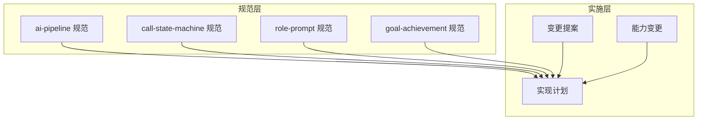
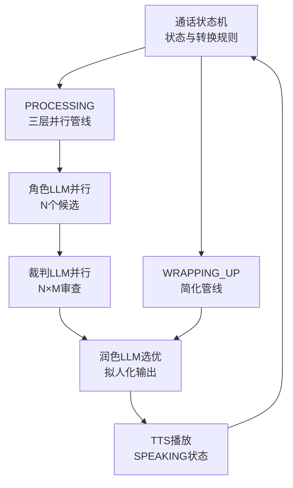
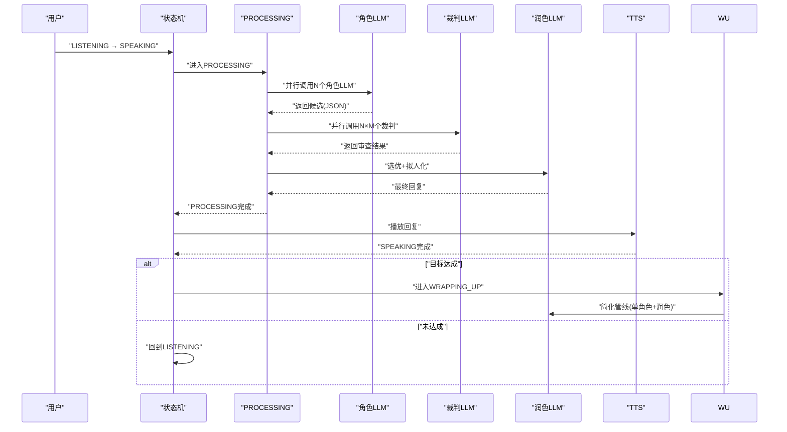
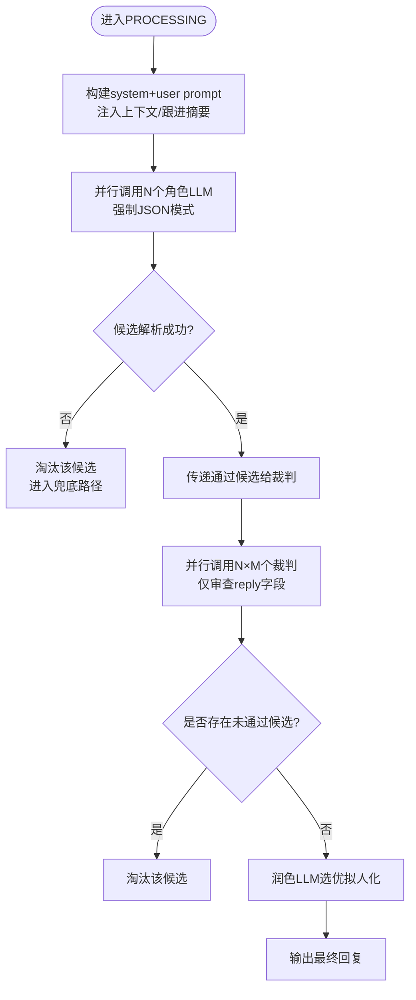
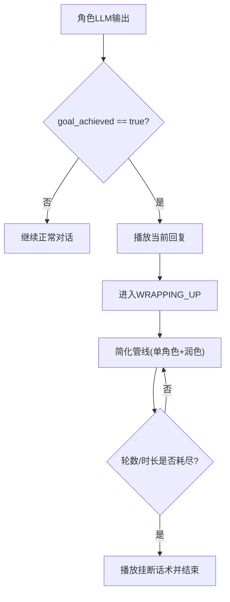
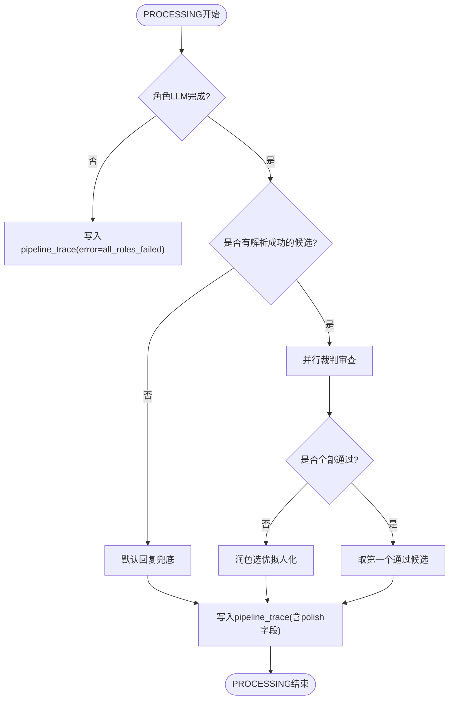
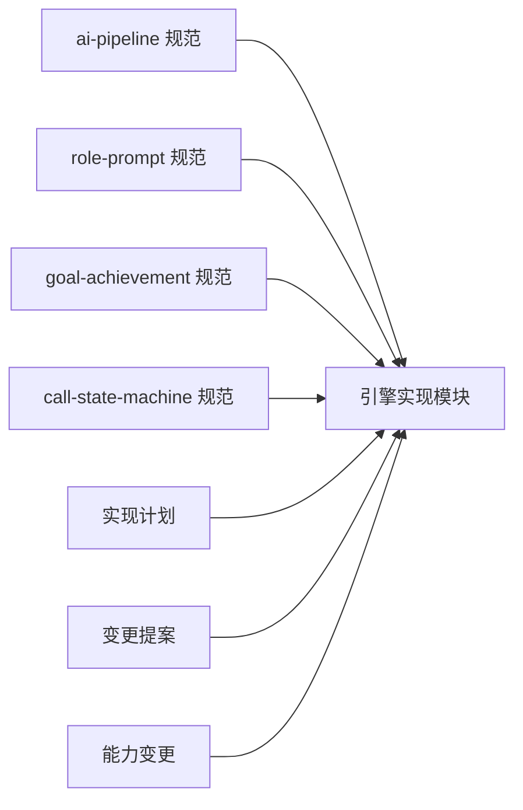

# AI智能对话系统

<cite>
**本文引用的文件**
- [ai-pipeline 规范](file://openspec/specs/ai-pipeline/spec.md)
- [call-state-machine 规范](file://openspec/specs/call-state-machine/spec.md)
- [role-prompt 规范](file://openspec/specs/role-prompt/spec.md)
- [goal-achievement 规范](file://openspec/specs/goal-achievement/spec.md)
- [实现计划](file://IMPLEMENTATION_PLAN.md)
- [变更提案](file://openspec/changes/archive/2026-05-07-impl-engine/proposal.md)
- [能力变更](file://openspec/changes/archive/2026-05-08-impl-engine-providers/proposal.md)
</cite>

## 目录
1. [简介](#简介)
2. [项目结构](#项目结构)
3. [核心组件](#核心组件)
4. [架构总览](#架构总览)
5. [详细组件分析](#详细组件分析)
6. [依赖关系分析](#依赖关系分析)
7. [性能考虑](#性能考虑)
8. [故障排查指南](#故障排查指南)
9. [结论](#结论)
10. [附录](#附录)

## 简介
本文件面向iSales AI智能对话系统，围绕“三层并行AI管线”展开，系统性阐述角色LLM并行处理、裁判LLM审查机制、润色LLM选优流程的协作原理；解释多角色LLM并行对话的实现方式（角色配置、提示词模板管理、对话上下文维护等）；阐明目标达成检测算法的工作原理（目标定义、达成条件判断、收尾对话处理）；并提供性能优化策略、错误处理机制与通话状态机的集成方式。文档同时结合业务场景，给出效果评估方法与最佳实践。

## 项目结构
- 顶层规范目录：openspec/specs 下包含架构、状态机、AI管线、角色提示词、目标达成等规范文件，形成系统设计契约。
- 实施计划：IMPLEMENTATION_PLAN.md 明确了引擎模块划分与职责边界。
- 变更与影响：openspec/changes 下的归档文档展示了能力变更与落地影响，体现从设计到实施的演进。

**图示来源**
- [ai-pipeline 规范](file://openspec/specs/ai-pipeline/spec.md)
- [call-state-machine 规范](file://openspec/specs/call-state-machine/spec.md)
- [role-prompt 规范](file://openspec/specs/role-prompt/spec.md)
- [goal-achievement 规范](file://openspec/specs/goal-achievement/spec.md)
- [实现计划](file://IMPLEMENTATION_PLAN.md)
- [变更提案](file://openspec/changes/archive/2026-05-07-impl-engine/proposal.md)
- [能力变更](file://openspec/changes/archive/2026-05-08-impl-engine-providers/proposal.md)

**章节来源**
- [实现计划](file://IMPLEMENTATION_PLAN.md)
- [变更提案](file://openspec/changes/archive/2026-05-07-impl-engine/proposal.md)

## 核心组件
- 通话状态机：定义状态集合、转换规则与关键边界（WRAPPING_UP、TRANSFERRING、ACTIVATING），是引擎实时行为模块的统一入口。
- AI三层并行管线：角色LLM并行候选生成 → 裁判LLM并行审查 → 润色LLM选优拟人化。
- 角色/裁判/润色提示词与上下文：通过role-prompt规范管理prompt版本、上下文注入与JSON模式约束。
- 目标达成检测：基于角色LLM输出的结构化标记，实时判定并进入收尾流程。
- 管线追踪与兜底：每轮PROCESSING完成后写入pipeline_trace，覆盖成功、兜底、降级、异常等路径。

**章节来源**
- [call-state-machine 规范](file://openspec/specs/call-state-machine/spec.md)
- [ai-pipeline 规范](file://openspec/specs/ai-pipeline/spec.md)
- [role-prompt 规范](file://openspec/specs/role-prompt/spec.md)
- [goal-achievement 规范](file://openspec/specs/goal-achievement/spec.md)

## 架构总览
系统采用“状态机驱动 + 三层并行AI管线”的架构。状态机负责通话生命周期的状态流转与边界控制，AI管线在PROCESSING状态下并行执行，输出最终回复并驱动状态迁移。

**图示来源**
- [call-state-machine 规范](file://openspec/specs/call-state-machine/spec.md)
- [ai-pipeline 规范](file://openspec/specs/ai-pipeline/spec.md)

## 详细组件分析

### 1) 通话状态机与AI管线的协同
- 状态机定义了INIT/GREETING/LISTENING/SPEAKING/INTERRUPTED/FILLER/PROCESSING/WRAPPING_UP/ACTIVATING/TRANSFERRING/END等状态及合法转移。
- PROCESSING期间并行启动垫词（FILLER），用户说话或打断触发后，状态在INTERRUPTED→PROCESSING之间快速切换，确保交互低延迟。
- 目标达成后，先播放当前轮回复，再进入WRAPPING_UP，随后简化管线继续处理用户新问题，直至轮数或时长耗尽后主动挂断。

**图示来源**
- [call-state-machine 规范](file://openspec/specs/call-state-machine/spec.md)
- [ai-pipeline 规范](file://openspec/specs/ai-pipeline/spec.md)

**章节来源**
- [call-state-machine 规范](file://openspec/specs/call-state-machine/spec.md)
- [ai-pipeline 规范](file://openspec/specs/ai-pipeline/spec.md)

### 2) 多角色LLM并行对话实现
- 角色配置：每个角色拥有独立prompt与模型配置，系统不共享基础prompt，确保多样性。
- 提示词模板管理：角色/裁判/润色prompt完全由Campaign自定义，系统提供推荐模板与版本管理，支持编辑自动建新版本与快照记录。
- 对话上下文维护：每次调用角色LLM时，system message包含角色身份、目标、JSON输出schema；user message包含线索信息、对话历史与上次通话摘要（跟进时）。
- JSON模式强制：优先使用Provider原生JSON Mode；不支持时在system prompt末尾贴schema并通过后处理保障解析。

**图示来源**
- [role-prompt 规范](file://openspec/specs/role-prompt/spec.md)
- [ai-pipeline 规范](file://openspec/specs/ai-pipeline/spec.md)

**章节来源**
- [role-prompt 规范](file://openspec/specs/role-prompt/spec.md)
- [ai-pipeline 规范](file://openspec/specs/ai-pipeline/spec.md)

### 3) 目标达成检测算法
- 实时判定：角色LLM在每轮输出中自带结构化标记（goal_achieved、goal_type、extracted），状态机实时读取并驱动状态迁移。
- 收尾流程：达成后先播放当前轮回复，再进入WRAPPING_UP，简化管线持续处理用户新问题，直至轮数或时长耗尽后主动挂断。
- 回调匹配：worker通过callback_config.trigger匹配目标类型与提取字段触发外部webhook。

**图示来源**
- [goal-achievement 规范](file://openspec/specs/goal-achievement/spec.md)
- [ai-pipeline 规范](file://openspec/specs/ai-pipeline/spec.md)

**章节来源**
- [goal-achievement 规范](file://openspec/specs/goal-achievement/spec.md)
- [ai-pipeline 规范](file://openspec/specs/ai-pipeline/spec.md)

### 4) 管线追踪与错误处理
- 每轮PROCESSING完成后写入pipeline_trace，覆盖成功、兜底、降级、异常等路径；即使中间异常也要落库，确保可观测性。
- 润色失败降级：取“所有裁判都通过的第一个候选”的reply作为兜底，不重试润色。
- 全部角色解析失败：走默认回复兜底，不重试LLM。
- 连续打断保护：超过阈值时启用short_reply或listen_only策略，不影响通话主路径。

**图示来源**
- [ai-pipeline 规范](file://openspec/specs/ai-pipeline/spec.md)

**章节来源**
- [ai-pipeline 规范](file://openspec/specs/ai-pipeline/spec.md)

### 5) 与通话状态机的集成
- 状态机负责所有事件驱动的状态转换，AI管线仅在PROCESSING期间运行，且与FILLER并行。
- WRAPPING_UP期间维持简化管线，不退回主管线，避免无效循环。
- TRANSFERRING期间不调用AI管线，仅播放衔接话术后结束。

**章节来源**
- [call-state-machine 规范](file://openspec/specs/call-state-machine/spec.md)

## 依赖关系分析
- 规范驱动：ai-pipeline、role-prompt、goal-achievement共同定义AI行为契约；call-state-machine定义状态边界。
- 实施映射：实现计划明确了引擎模块划分（状态机、会话管理、管线编排、实时模块、转人工、收尾管理、JSON解析、队列消费者、事件发布）。
- 能力落地：变更提案与能力变更展示了从设计到实施的关键能力与异常分类契约，确保降级与错误处理的一致性。

**图示来源**
- [ai-pipeline 规范](file://openspec/specs/ai-pipeline/spec.md)
- [role-prompt 规范](file://openspec/specs/role-prompt/spec.md)
- [goal-achievement 规范](file://openspec/specs/goal-achievement/spec.md)
- [call-state-machine 规范](file://openspec/specs/call-state-machine/spec.md)
- [实现计划](file://IMPLEMENTATION_PLAN.md)
- [变更提案](file://openspec/changes/archive/2026-05-07-impl-engine/proposal.md)
- [能力变更](file://openspec/changes/archive/2026-05-08-impl-engine-providers/proposal.md)

**章节来源**
- [实现计划](file://IMPLEMENTATION_PLAN.md)
- [变更提案](file://openspec/changes/archive/2026-05-07-impl-engine/proposal.md)
- [能力变更](file://openspec/changes/archive/2026-05-08-impl-engine-providers/proposal.md)

## 性能考虑
- 并行化与延迟优化：角色LLM与垫词播放并行启动，覆盖整个管线延迟；裁决采用N×M并行，缩短整体响应时间。
- 上下文长度：v1不截断对话历史，依赖LLM长上下文能力，需监控token用量并设置告警阈值。
- 超时与降级：为角色/裁判/润色分别设定超时上限，润色失败直接降级取首个通过候选，避免重试带来的额外延迟。
- 并发控制：通过全局会话注册表与Redis并发计数器限制最大并发，防止资源争用。

**章节来源**
- [ai-pipeline 规范](file://openspec/specs/ai-pipeline/spec.md)
- [role-prompt 规范](file://openspec/specs/role-prompt/spec.md)

## 故障排查指南
- 管线追踪：每轮PROCESSING完成后必须写入pipeline_trace，即使异常也要记录error字段，便于定位问题。
- Provider异常分类：根据HTTP状态与响应特征抛出不同异常（限流、服务器错误、超时、无效请求、JSON解析失败），据此执行降级策略。
- 连续打断保护：超过阈值时启用short_reply或listen_only，避免无效循环；完整轮次后清零计数器。
- 默认回复兜底：全部裁判否决或全部候选解析失败时，从默认回复池随机抽取；记录transcript事件以便审计。

**章节来源**
- [ai-pipeline 规范](file://openspec/specs/ai-pipeline/spec.md)
- [变更提案](file://openspec/changes/archive/2026-05-07-impl-engine/proposal.md)
- [能力变更](file://openspec/changes/archive/2026-05-08-impl-engine-providers/proposal.md)

## 结论
iSales AI智能对话系统通过“状态机驱动 + 三层并行AI管线”的架构，实现了高并发、低延迟、可观测的智能对话能力。角色LLM并行生成候选、裁判LLM并行审查、润色LLM选优拟人化，配合严格的提示词模板管理与上下文注入策略，确保输出质量与合规性。目标达成检测算法实时驱动收尾流程，结合完善的兜底与降级机制，保障系统鲁棒性。通过规范化的pipeline_trace与异常分类，系统具备良好的可观测性与可维护性。

## 附录
- 业务评估方法建议：
  - 通话成功率与平均时长：衡量系统稳定性与效率。
  - 目标达成率与类型分布：评估角色LLM目标定义的有效性。
  - 收尾完成率与用户反馈：评估WRAPPING_UP流程的自然度与满意度。
  - Token用量与成本：监控长上下文带来的成本压力。
  - 管线命中率与失败原因分布：指导Provider与提示词优化。