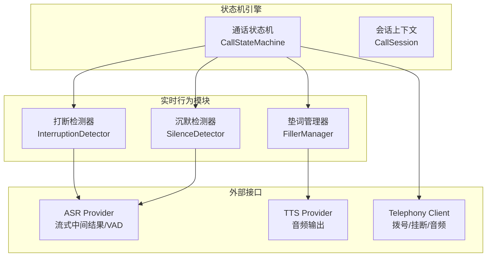
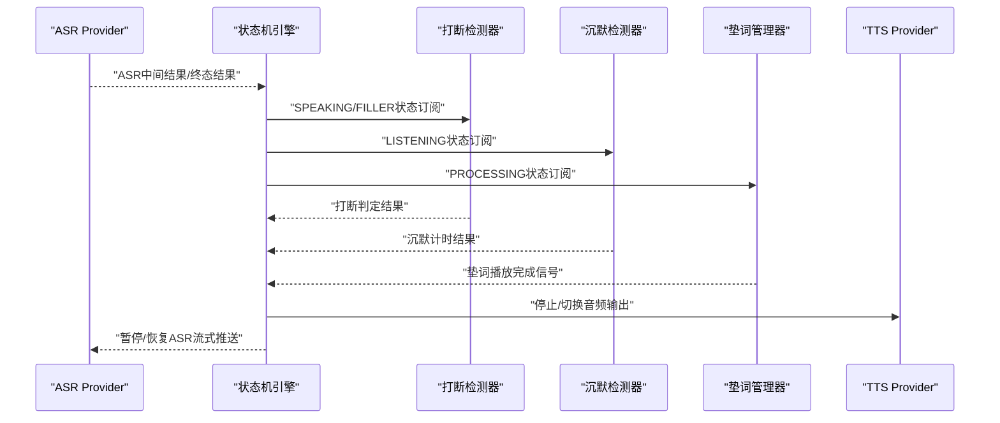
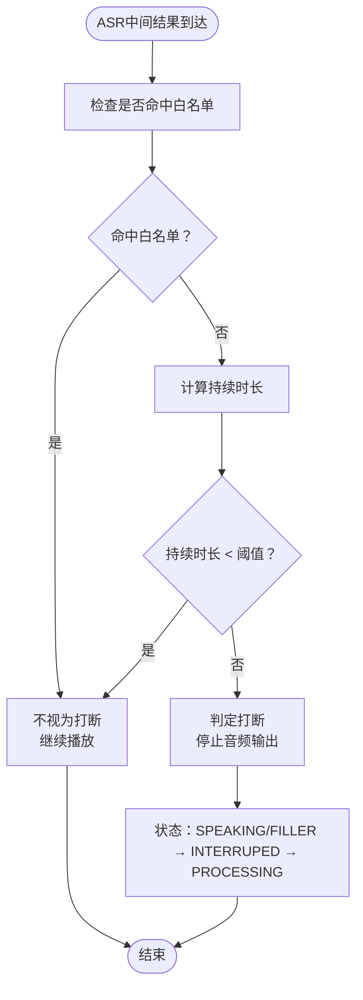
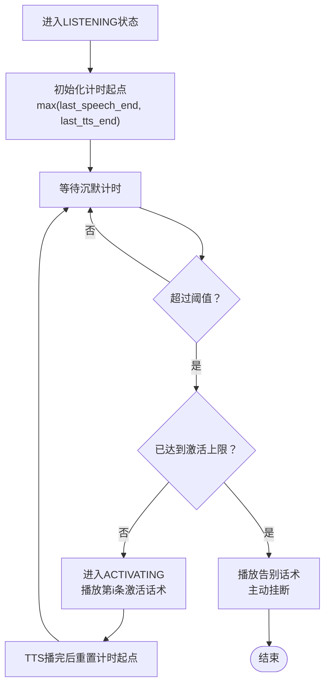
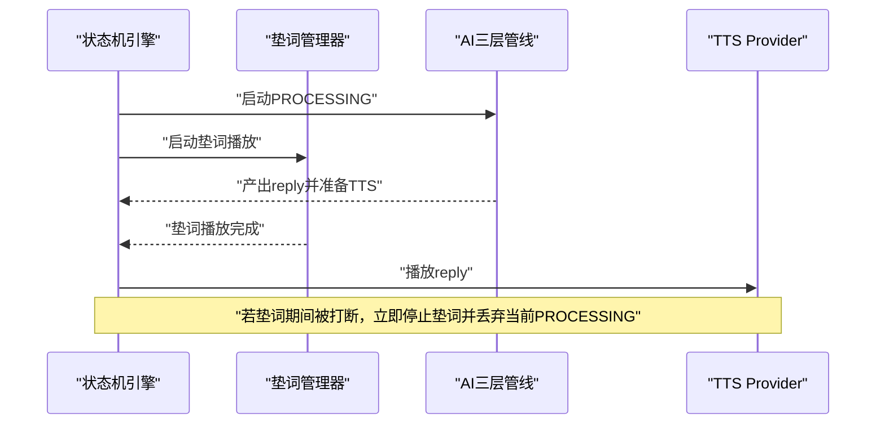
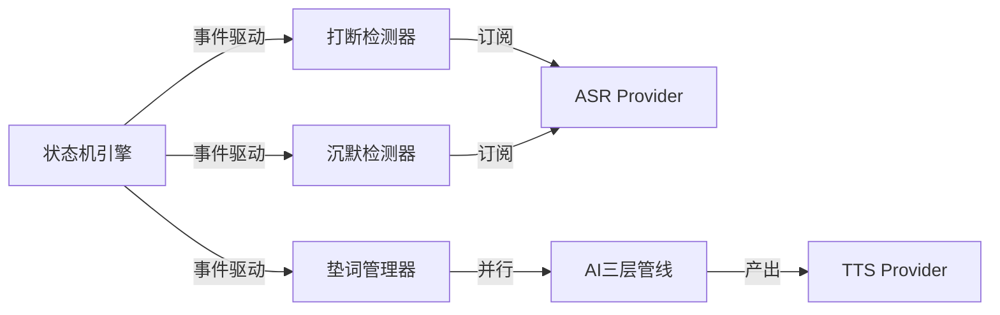

# 实时行为模块

<cite>
**本文引用的文件**
- [中断检测规范](file://openspec/specs/interruption-detection/spec.md)
- [沉默激活规范](file://openspec/specs/silence-activation/spec.md)
- [垫词规范](file://openspec/specs/filler/spec.md)
- [通话状态机规范](file://openspec/specs/call-state-machine/spec.md)
- [引擎实现提案](file://openspec/changes/archive/2026-05-07-impl-engine/proposal.md)
- [引擎设计说明](file://openspec/changes/archive/2026-05-07-impl-engine/design.md)
- [引擎任务清单](file://openspec/changes/archive/2026-05-07-impl-engine/tasks.md)
- [引擎提供商设计说明](file://openspec/changes/archive/2026-05-08-impl-engine-providers/design.md)
</cite>

## 目录
1. [简介](#简介)
2. [项目结构](#项目结构)
3. [核心组件](#核心组件)
4. [架构总览](#架构总览)
5. [详细组件分析](#详细组件分析)
6. [依赖关系分析](#依赖关系分析)
7. [性能考虑](#性能考虑)
8. [故障排查指南](#故障排查指南)
9. [结论](#结论)

## 简介
本文件面向iSales实时行为模块，系统性阐述打断检测、沉默激活与垫词管理三大核心能力的实现原理与工程实践。文档基于官方规范与实现提案，结合状态机引擎的协调机制，给出可操作的参数调优建议与性能优化方案，帮助读者在真实通话场景中获得更自然、流畅、高质量的交互体验。

## 项目结构
实时行为模块位于引擎子系统中，围绕状态机引擎构建，主要涉及以下文件与职责：
- 中断检测：基于ASR中间结果与VAD事件，实现双条件打断判定与连续打断保护
- 沉默激活：在LISTENING状态下进行沉默计时，超阈值触发激活话术，支持激活上限与挂断策略
- 垫词管理：在PROCESSING期间与AI管线并行播放垫词，避免TTS与LLM延迟造成的卡顿

**图表来源**
- [通话状态机规范:1-190](file://openspec/specs/call-state-machine/spec.md#L1-L190)
- [引擎实现提案:40-61](file://openspec/changes/archive/2026-05-07-impl-engine/proposal.md#L40-L61)

**章节来源**
- [通话状态机规范:1-190](file://openspec/specs/call-state-machine/spec.md#L1-L190)
- [引擎实现提案:40-61](file://openspec/changes/archive/2026-05-07-impl-engine/proposal.md#L40-L61)

## 核心组件
- 打断检测器：在SPEAKING/FILLER状态订阅ASR中间结果，采用双条件判定（白名单命中或时长小于阈值）避免误判；一旦判定打断即不可撤销，立即停止音频输出并进入处理态
- 沉默检测器：在LISTENING入口启动沉默计时器，计时起点为max(用户最后一次speech_end, AI上一轮TTS播完时刻)，超阈值触发ACTIVATING状态播放激活话术，支持激活上限与挂断策略
- 垫词管理器：在PROCESSING期间与AI管线并行启动，管线先返回时等待垫词播完再接续回复，支持多集合轮询与集内随机不重复，失败场景允许无声延迟

**章节来源**
- [中断检测规范:1-94](file://openspec/specs/interruption-detection/spec.md#L1-L94)
- [沉默激活规范:1-99](file://openspec/specs/silence-activation/spec.md#L1-L99)
- [垫词规范:1-132](file://openspec/specs/filler/spec.md#L1-L132)
- [引擎实现提案:40-61](file://openspec/changes/archive/2026-05-07-impl-engine/proposal.md#L40-L61)

## 架构总览
实时行为模块通过状态机引擎统一调度，三大模块在不同状态之间协同工作，确保打断、激活与垫词的时序正确与一致性。

**图表来源**
- [引擎实现提案:40-61](file://openspec/changes/archive/2026-05-07-impl-engine/proposal.md#L40-L61)
- [通话状态机规范:46-145](file://openspec/specs/call-state-machine/spec.md#L46-L145)

## 详细组件分析

### 打断检测机制
打断检测在SPEAKING与FILLER状态生效，基于ASR中间结果与VAD事件，采用双条件判定：
- 白名单条件：ASR中间结果与配置的白名单短语完全匹配，则不视为打断
- 时长条件：从speech_start到当前时刻的间隔小于最小持续时长阈值，则不视为打断
- 触发条件：两个条件均不满足时，立即停止音频输出，状态进入INTERRUPTED→PROCESSING，并使用ASR终态结果作为本轮输入
- 不可撤销：一旦进入INTERRUPTED，即使后续出现白名单匹配也不回退
- 连续打断保护：当连续INTERRUPTED→PROCESSING→SPEAKING→INTERRUPTED超过最大次数时，触发保护策略（short_reply或listen_only），完整轮次后计数器清零

**图表来源**
- [中断检测规范:7-52](file://openspec/specs/interruption-detection/spec.md#L7-L52)
- [引擎实现提案:47-52](file://openspec/changes/archive/2026-05-07-impl-engine/proposal.md#L47-L52)

**章节来源**
- [中断检测规范:7-52](file://openspec/specs/interruption-detection/spec.md#L7-L52)
- [引擎实现提案:47-52](file://openspec/changes/archive/2026-05-07-impl-engine/proposal.md#L47-L52)
- [引擎提供商设计说明:91-102](file://openspec/changes/archive/2026-05-08-impl-engine-providers/design.md#L91-L102)

### 沉默激活功能
沉默激活在LISTENING状态下进行，计时起点为max(用户最后一次speech_end, AI上一轮TTS播完时刻)：
- 触发条件：沉默时长超过阈值且未达激活上限时，进入ACTIVATING状态，按顺序选择激活话术播放
- 话术策略：按索引顺序使用，不足时复用最后一条，超出时截取前N条
- 激活上限：达到上限后播放告别话术并主动挂断，原因码为silence_max_reached
- 重新计时：每次激活TTS播完后以TTS播完时刻作为新的计时起点，不累加原始沉默时长
- 上下文隔离：激活话术写入full_transcript但不进入角色LLM的dialog_history，避免模型误判承接关系
- 优先级：转人工触发优先于沉默激活

**图表来源**
- [沉默激活规范:7-34](file://openspec/specs/silence-activation/spec.md#L7-L34)
- [沉默激活规范:35-67](file://openspec/specs/silence-activation/spec.md#L35-L67)
- [沉默激活规范:68-81](file://openspec/specs/silence-activation/spec.md#L68-L81)

**章节来源**
- [沉默激活规范:7-34](file://openspec/specs/silence-activation/spec.md#L7-L34)
- [沉默激活规范:35-67](file://openspec/specs/silence-activation/spec.md#L35-L67)
- [沉默激活规范:68-81](file://openspec/specs/silence-activation/spec.md#L68-L81)

### 垫词管理系统
垫词管理在PROCESSING期间与AI管线并行启动，确保对话节拍稳定：
- 触发场景：仅在常规对话PROCESSING触发；开场白后首轮、WRAPPING_UP、TRANSFERRING、ACTIVATING及收尾告别时不播
- 启动时机：与AI管线同时启动，管线先返回时等待垫词播完再接续回复
- 集合策略：多filler_set按sort_order升序轮询，集内随机不重复，同一通电话内避免重复使用
- 音频来源：垫词音频需预先生成并存储，运行时不得实时TTS生成
- 失败兜底：预生成未完成、下载失败或全部不可用时跳过垫词，允许无声延迟

**图表来源**
- [垫词规范:7-30](file://openspec/specs/filler/spec.md#L7-L30)
- [垫词规范:31-49](file://openspec/specs/filler/spec.md#L31-L49)
- [垫词规范:50-77](file://openspec/specs/filler/spec.md#L50-L77)
- [垫词规范:78-110](file://openspec/specs/filler/spec.md#L78-L110)

**章节来源**
- [垫词规范:7-30](file://openspec/specs/filler/spec.md#L7-L30)
- [垫词规范:31-49](file://openspec/specs/filler/spec.md#L31-L49)
- [垫词规范:50-77](file://openspec/specs/filler/spec.md#L50-L77)
- [垫词规范:78-110](file://openspec/specs/filler/spec.md#L78-L110)

## 依赖关系分析
实时行为模块与状态机引擎紧密耦合，遵循统一的事件驱动与状态转换契约：
- 状态机维护合法转移集合，任何非法转移将抛出异常并记录错误事件
- 打断检测、沉默激活与垫词管理均通过状态机触发相应动作，确保时序一致性
- 与ASR Provider的对接必须满足流式中间结果与VAD事件要求，不依赖独立VAD模型

**图表来源**
- [通话状态机规范:21-45](file://openspec/specs/call-state-machine/spec.md#L21-L45)
- [引擎实现提案:40-61](file://openspec/changes/archive/2026-05-07-impl-engine/proposal.md#L40-L61)

**章节来源**
- [通话状态机规范:21-45](file://openspec/specs/call-state-machine/spec.md#L21-L45)
- [引擎实现提案:40-61](file://openspec/changes/archive/2026-05-07-impl-engine/proposal.md#L40-L61)

## 性能考虑
- 异步取消驱动：打断采用取消驱动而非轮询，降低延迟并减少CPU占用
- 并行处理：垫词与AI管线并行启动，缩短感知延迟，提升对话稳定性
- 预生成策略：垫词音频预生成，避免运行时TTS开销，提高可用性与一致性
- 计时起点优化：沉默计时起点采用max(speech_end, tts_end)，避免不必要的激活与挂断
- 参数调优建议：
  - 打断阈值：在误打断与漏打断之间平衡，建议结合业务场景逐步调优
  - 沉默阈值：根据用户习惯与网络环境设定，避免频繁激活或过早挂断
  - 连续打断保护：合理设置最大次数与保护策略，保障用户体验
  - 垫词时长：确保垫词时长覆盖典型LLM响应延迟，避免“快响应”破坏节拍

[本节为通用性能指导，无需特定文件引用]

## 故障排查指南
- 打断误判
  - 现象：用户正常表达被截断
  - 排查：确认白名单配置是否覆盖常用语气词；检查最小持续时长阈值是否过高
  - 参考：双条件判定与不可撤销策略
- 打断漏判
  - 现象：用户表达被覆盖
  - 排查：检查ASR中间结果推送与VAD事件是否正常；确认speech_start时间戳准确性
  - 参考：ASR Provider抽象与VAD来源要求
- 沉默激活异常
  - 现象：激活过早/过晚或未触发
  - 排查：核对计时起点逻辑；检查last_speech_end与last_tts_end更新是否正确
  - 参考：计时起点与重新计时规则
- 垫词播放问题
  - 现象：垫词缺失或重复
  - 排查：确认filler_set轮询与集内去重逻辑；检查generation_status与audio_url状态
  - 参考：多集合轮询与失败兜底策略

**章节来源**
- [中断检测规范:54-71](file://openspec/specs/interruption-detection/spec.md#L54-L71)
- [沉默激活规范:82-99](file://openspec/specs/silence-activation/spec.md#L82-L99)
- [垫词规范:78-110](file://openspec/specs/filler/spec.md#L78-L110)

## 结论
实时行为模块通过打断检测、沉默激活与垫词管理三大机制，在状态机引擎的统一调度下，实现了低延迟、高可靠、可调优的通话体验。合理的参数配置与工程实践能够显著提升通话质量，减少误判与漏判，增强用户感知稳定性。建议在生产环境中持续监控关键指标，结合业务反馈迭代优化。