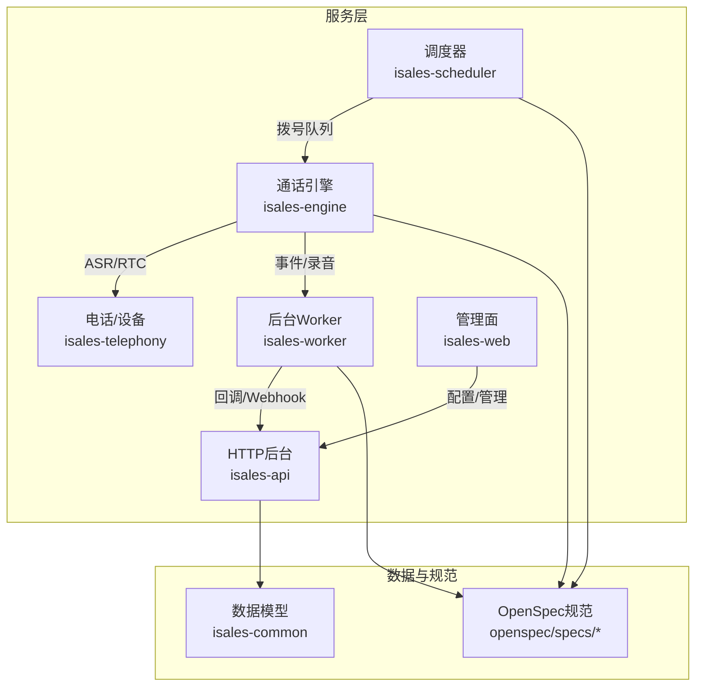
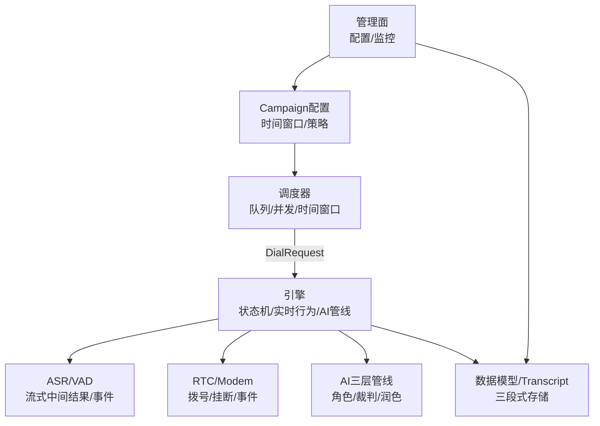
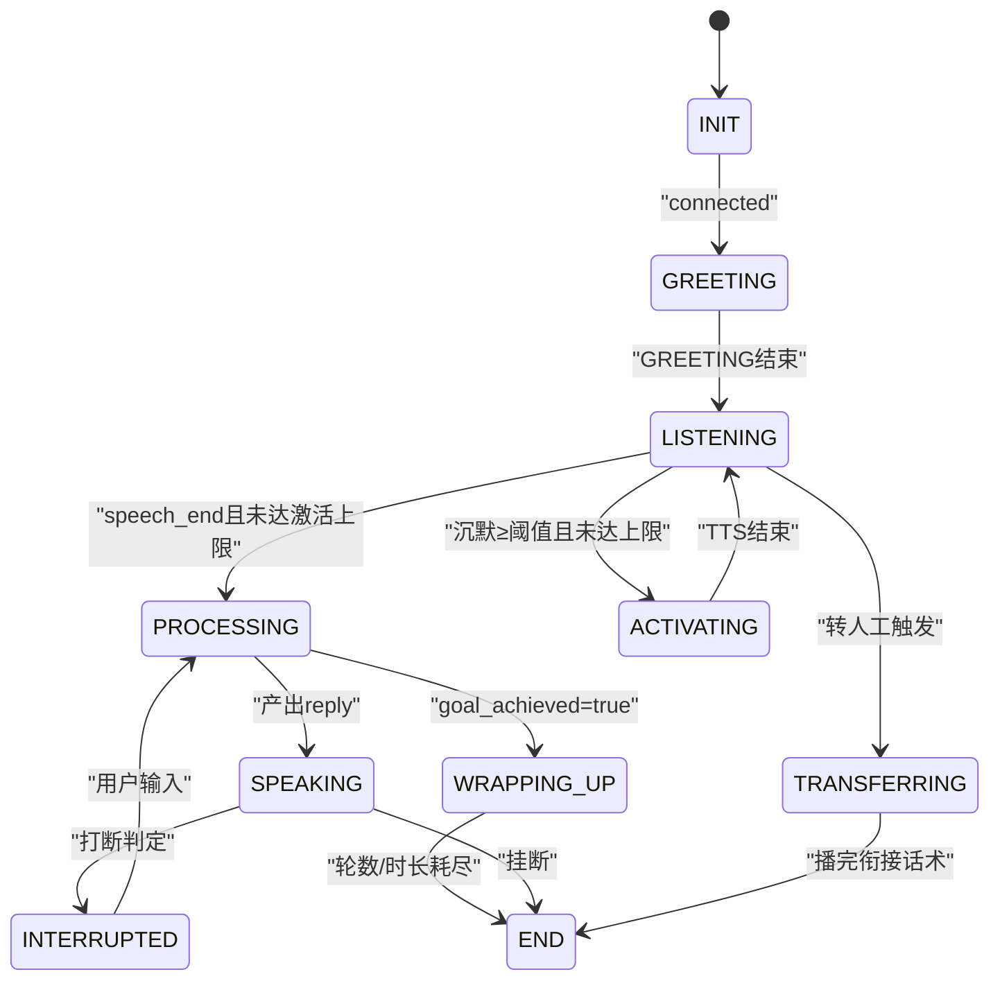
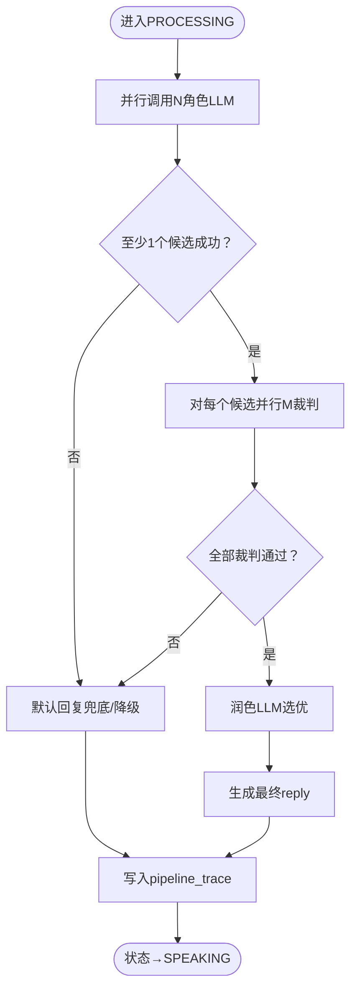
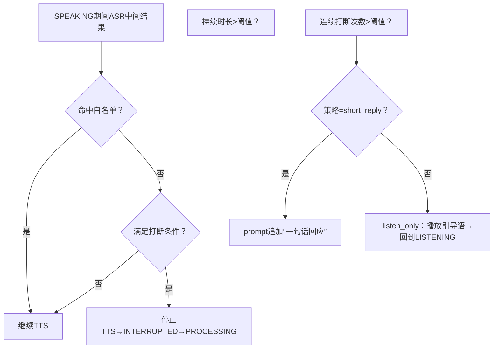
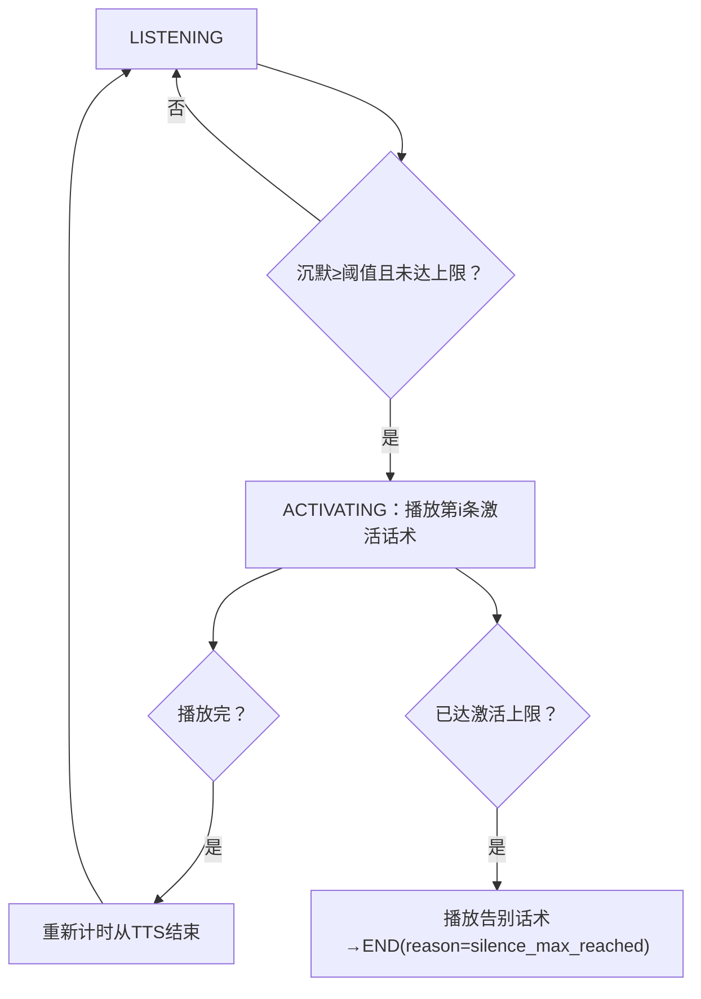
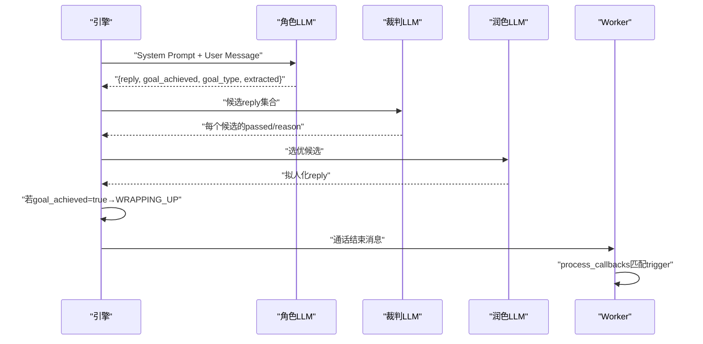
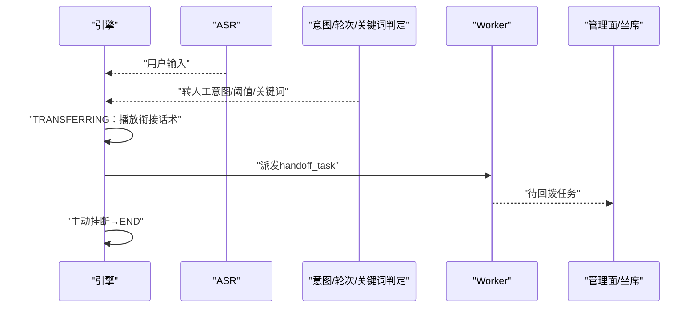
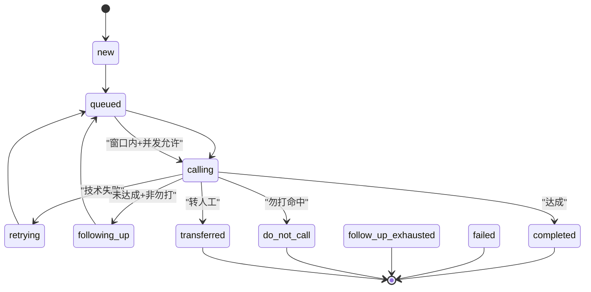
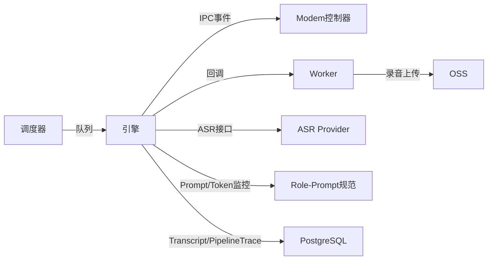

# 核心功能特性

<cite>
**本文引用的文件**
- [README.md](file://README.md)
- [DESIGN.md](file://DESIGN.md)
- [ai-pipeline/spec.md](file://openspec/specs/ai-pipeline/spec.md)
- [call-state-machine/spec.md](file://openspec/specs/call-state-machine/spec.md)
- [interruption-detection/spec.md](file://openspec/specs/interruption-detection/spec.md)
- [silence-activation/spec.md](file://openspec/specs/silence-activation/spec.md)
- [human-handoff/spec.md](file://openspec/specs/human-handoff/spec.md)
- [role-prompt/spec.md](file://openspec/specs/role-prompt/spec.md)
- [filler/spec.md](file://openspec/specs/filler/spec.md)
- [goal-achievement/spec.md](file://openspec/specs/goal-achievement/spec.md)
- [retry-followup/spec.md](file://openspec/specs/retry-followup/spec.md)
- [time-window/spec.md](file://openspec/specs/time-window/spec.md)
- [transcript/spec.md](file://openspec/specs/transcript/spec.md)
</cite>

## 目录
1. [简介](#简介)
2. [项目结构](#项目结构)
3. [核心组件](#核心组件)
4. [架构总览](#架构总览)
5. [详细组件分析](#详细组件分析)
6. [依赖分析](#依赖分析)
7. [性能考量](#性能考量)
8. [故障排查指南](#故障排查指南)
9. [结论](#结论)
10. [附录](#附录)

## 简介
本文件面向iSales系统的核心功能特性，围绕“通话管理系统、AI智能对话系统、调度与生命周期管理、实时行为模块、转人工机制”五大主题，系统阐述各模块的设计思路、实现原理与协同工作机制。重点包括：
- AI三层并行管线：N角色PK、N×M裁判审查、1润色选优，覆盖延迟优化与降级路径；
- 状态机引擎：统一的通话生命周期管理，涵盖打断检测、沉默激活、目标达成、转人工、收尾挂断；
- 实时行为模块：打断判定、垫词播放、沉默激活、目标达成、转人工触发与派发；
- 调度与生命周期：时间窗口、重试与跟进、勿打识别、lead状态机；
- 数据与事件流：三段式存储模型、pipeline_trace、transcript与录音分离。

## 项目结构
iSales采用多仓协作与OpenSpec规范驱动的架构，核心服务与能力分布如下：
- isales-engine：实时通话引擎（状态机 + 三层AI管线）
- isales-scheduler：调度器（Campaign启停、拨号队列）
- isales-worker：后台worker（回调、录音上传、看门狗）
- isales-telephony：设备与modem控制
- isales-api：HTTP后台（Campaigns/Leads/Calls等）
- isales-web：Vue3管理面
- isales-common：Pydantic/SQLAlchemy模型与跨仓共享schema

**图表来源**
- [README.md:1-86](file://README.md#L1-L86)
- [DESIGN.md:1-75](file://DESIGN.md#L1-L75)

**章节来源**
- [README.md:1-86](file://README.md#L1-L86)
- [DESIGN.md:1-75](file://DESIGN.md#L1-L75)

## 核心组件
- 通话状态机：统一的状态集合与转换规则，承载所有实时行为模块的接入点。
- AI三层管线：并行候选生成、并行裁判审查、润色选优，覆盖延迟优化与降级路径。
- 实时行为模块：打断检测、垫词播放、沉默激活、目标达成、转人工触发。
- 调度与生命周期：时间窗口、重试与跟进、勿打识别、lead状态机。
- 数据与事件流：三段式存储、pipeline_trace、transcript与录音分离。

**章节来源**
- [call-state-machine/spec.md:1-190](file://openspec/specs/call-state-machine/spec.md#L1-L190)
- [ai-pipeline/spec.md:1-18](file://openspec/specs/ai-pipeline/spec.md#L1-L18)
- [interruption-detection/spec.md:1-94](file://openspec/specs/interruption-detection/spec.md#L1-L94)
- [silence-activation/spec.md:1-99](file://openspec/specs/silence-activation/spec.md#L1-L99)
- [goal-achievement/spec.md:1-126](file://openspec/specs/goal-achievement/spec.md#L1-L126)
- [human-handoff/spec.md:1-128](file://openspec/specs/human-handoff/spec.md#L1-L128)
- [retry-followup/spec.md:1-176](file://openspec/specs/retry-followup/spec.md#L1-L176)
- [time-window/spec.md:1-86](file://openspec/specs/time-window/spec.md#L1-L86)
- [transcript/spec.md:1-127](file://openspec/specs/transcript/spec.md#L1-L127)

## 架构总览
iSales通过“调度-引擎-设备-数据/规范”的分层协作实现销售外呼自动化。调度器负责Campaign级时间窗口与并发控制，引擎负责状态机与实时行为，设备层负责拨号与ASR/VAD，数据与规范提供契约与调试支撑。

**图表来源**
- [retry-followup/spec.md:119-176](file://openspec/specs/retry-followup/spec.md#L119-L176)
- [time-window/spec.md:1-86](file://openspec/specs/time-window/spec.md#L1-L86)
- [ai-pipeline/spec.md:1-18](file://openspec/specs/ai-pipeline/spec.md#L1-L18)
- [transcript/spec.md:1-127](file://openspec/specs/transcript/spec.md#L1-L127)

## 详细组件分析

### 通话状态机与生命周期管理
- 状态集合：INIT/GREETING/LISTENING/SPEAKING/INTERRUPTED/FILLER/PROCESSING/WRAPPING_UP/ACTIVATING/TRANSFERRING/END。
- 转换规则：统一事件驱动，非法转移抛异常并写state_error；ATD链路通过IPC事件抽象，避免底层AT命令ACK/中间URC直接驱动状态。
- 特殊状态：
  - WRAPPING_UP：目标达成后的收尾，走简化管线（单角色+润色），双计数器（轮数/时长）控制挂断。
  - TRANSFERRING：v1“标记+通知”，播衔接话术→主动挂断→派发handoff_task。
  - ACTIVATING：沉默激活，与角色LLM上下文隔离，写入transcript但不进入dialog_history。
- 连续打断保护：超过阈值触发short_reply或listen_only策略，完整轮次后清零计数。

**图表来源**
- [call-state-machine/spec.md:46-149](file://openspec/specs/call-state-machine/spec.md#L46-L149)

**章节来源**
- [call-state-machine/spec.md:1-190](file://openspec/specs/call-state-machine/spec.md#L1-L190)

### AI三层并行对话能力
- 三层编排：Layer 1（N角色并行PK）→ Layer 2（每个候选×M裁判并行审查）→ Layer 3（润色LLM选优拟人化）。
- 启动策略：Layer 1与垫词同时启动，覆盖管线延迟；PROCESSING完成后落pipeline_trace，异常也落记录。
- 连续打断保护：超过阈值触发short_reply（追加“一句话回应”提示）或listen_only（纯听模式）。
- Prompt契约：角色/裁判/润色均由Campaign自定义，System Prompt包含目标、可提取字段、输出格式；WRAPPING_UP在末尾追加收尾指令；JSON Mode优先，不支持时文本约束兜底。

**图表来源**
- [ai-pipeline/spec.md:1-18](file://openspec/specs/ai-pipeline/spec.md#L1-L18)
- [role-prompt/spec.md:21-185](file://openspec/specs/role-prompt/spec.md#L21-L185)

**章节来源**
- [ai-pipeline/spec.md:1-18](file://openspec/specs/ai-pipeline/spec.md#L1-L18)
- [role-prompt/spec.md:1-185](file://openspec/specs/role-prompt/spec.md#L1-L185)

### 打断检测与连续打断保护
- 双条件判定：白名单短语命中或时长<阈值时不视为打断；满足条件时立即停止TTS并进入INTERRUPTED→PROCESSING。
- 不可撤销策略：一旦判定打断，不回退到SPEAKING；维持状态机简洁与低延迟。
- 连续打断保护：超过阈值触发策略（short_reply/listen_only），完整轮次后计数器清零。

**图表来源**
- [interruption-detection/spec.md:7-53](file://openspec/specs/interruption-detection/spec.md#L7-L53)

**章节来源**
- [interruption-detection/spec.md:1-94](file://openspec/specs/interruption-detection/spec.md#L1-L94)

### 沉默激活与状态隔离
- 沉默检测：LISTENING状态下超过阈值触发ACTIVATING；计时起点为“最后一次speech_end与上一轮TTS结束的最大值”。
- 话术策略：按顺序使用silence_phrases，不足时复用最后一条；达到上限播放silence_hangup_phrase后主动挂断。
- 上下文隔离：ACTIVATING话术写入transcript但不进入dialog_history，避免模型误以为需要承接。

**图表来源**
- [silence-activation/spec.md:7-99](file://openspec/specs/silence-activation/spec.md#L7-L99)

**章节来源**
- [silence-activation/spec.md:1-99](file://openspec/specs/silence-activation/spec.md#L1-L99)

### 目标达成与收尾流程
- 实时判定：角色LLM在每轮JSON输出中标注goal_achieved/goal_type/extracted，engine实时读取；worker仅做摘要与回调匹配。
- 收尾策略：WRAPPING_UP先播放当前reply，再走简化管线（单角色+润色），双计数器控制挂断；转人工触发优先让位。
- 回调匹配：通过callback_config.trigger（JsonLogic）匹配goal_achieved/goal_type/extracted触发外部Webhook。

**图表来源**
- [goal-achievement/spec.md:44-126](file://openspec/specs/goal-achievement/spec.md#L44-L126)
- [ai-pipeline/spec.md:1-18](file://openspec/specs/ai-pipeline/spec.md#L1-L18)

**章节来源**
- [goal-achievement/spec.md:1-126](file://openspec/specs/goal-achievement/spec.md#L1-L126)

### 转人工机制（v1：标记+通知）
- v1衰减为“标记+通知”：AI识别需要人工→礼貌告知→主动挂断→派发handoff_task→坐席手动回拨。
- 四种独立触发机制：关键词/意图分类/轮次阈值/独立LLM判定，任一命中即触发（OR关系）。
- TRANSFERRING期间不调用AI管线，衔接话术播完直接END，无实时桥接分支。

**图表来源**
- [human-handoff/spec.md:21-128](file://openspec/specs/human-handoff/spec.md#L21-L128)

**章节来源**
- [human-handoff/spec.md:1-128](file://openspec/specs/human-handoff/spec.md#L1-L128)

### 调度与生命周期管理
- 时间窗口：Campaign级多窗口配置，统一服务器时区，节假日可选；窗外lead推迟至最近窗口开始时刻。
- 重试与跟进：重试（指数退避+最大次数）与跟进（固定间隔+最大次数）独立计数；勿打识别（关键词/独立LLM）命中后礼貌告别并标记do_not_call。
- lead状态机：new/queued/calling/retrying/following_up/completed/failed/follow_up_exhausted/do_not_call/transferred，终态不再被调度器扫描。

**图表来源**
- [retry-followup/spec.md:90-176](file://openspec/specs/retry-followup/spec.md#L90-L176)
- [time-window/spec.md:1-86](file://openspec/specs/time-window/spec.md#L1-L86)

**章节来源**
- [retry-followup/spec.md:1-176](file://openspec/specs/retry-followup/spec.md#L1-L176)
- [time-window/spec.md:1-86](file://openspec/specs/time-window/spec.md#L1-L86)

### 数据与事件流
- 三段式存储：transcript（事件流）、pipeline_trace（AI管线详情）、录音OSS（wav）分离，避免互相污染。
- transcript事件类型：greeting/user_speech/ai_reply/interruption/filler/default_reply_used/silence_activation/transfer_initiated/transfer_marked/goal_achieved/wrap_up_started/wrap_up_completed/hangup。
- dialog_history与full_transcript：前者仅包含对话事件，后者包含全部事件（含系统话术）。

**章节来源**
- [transcript/spec.md:1-127](file://openspec/specs/transcript/spec.md#L1-L127)

## 依赖分析
- 组件耦合与内聚：
  - 引擎内部高内聚：状态机、实时行为模块、AI管线在同一进程中协调，降低跨进程延迟。
  - 跨服务依赖：调度器与引擎通过队列解耦；引擎与设备通过IPC事件解耦；Worker与API通过回调解耦。
- 外部依赖与集成：
  - ASR Provider抽象：统一接口，支持火山引擎等默认实现。
  - 设备层：USB GSM Modem控制，AT事件翻译为IPC事件驱动状态机。
  - 存储：PostgreSQL（call_record/transcript/pipeline_trace）、OSS（录音）。

**图表来源**
- [retry-followup/spec.md:119-176](file://openspec/specs/retry-followup/spec.md#L119-L176)
- [interruption-detection/spec.md:54-66](file://openspec/specs/interruption-detection/spec.md#L54-L66)
- [transcript/spec.md:77-127](file://openspec/specs/transcript/spec.md#L77-L127)

**章节来源**
- [retry-followup/spec.md:119-176](file://openspec/specs/retry-followup/spec.md#L119-L176)
- [interruption-detection/spec.md:54-66](file://openspec/specs/interruption-detection/spec.md#L54-L66)
- [transcript/spec.md:77-127](file://openspec/specs/transcript/spec.md#L77-L127)

## 性能考量
- 延迟优化：
  - Layer 1与垫词并行启动，覆盖管线延迟；垫词播放节奏稳定，避免快响应破坏对话节拍。
  - 连续打断保护：short_reply减少长TTS被打断的浪费；listen_only避免无限循环。
- 资源与成本：
  - 长上下文不截断，依赖Provider长上下文能力并监控token用量；pipeline_trace记录token消耗，超阈值告警。
  - 垫词音频预生成，避免运行时实时TTS；失败场景允许“无声延迟”，不引入万能兜底。
- 可观测性：
  - pipeline_trace独立表记录每轮候选/裁判/润色详情；transcript事件类型丰富，支持前端播放器基于ts定位。

[本节为通用性能讨论，不直接分析具体文件]

## 故障排查指南
- 非法状态转移：
  - 现象：非法事件触发或底层AT事件驱动导致状态异常。
  - 处理：状态机抛IllegalTransition并在transcript追加state_error事件；必要时强制进入END并记录原因。
- 打断误判/漏判：
  - 误判：白名单短语或时长阈值配置不当；建议调整interruption_whitelist与interruption_min_duration_ms。
  - 漏判：用户说话被判定为非打断；检查ASR Provider是否提供VAD与中间结果。
- 沉默激活异常：
  - 现象：沉默计时起点不正确或激活上限未生效。
  - 处理：核对silence_threshold_ms、max_silence_activations与silence_phrases配置。
- 转人工派发失败：
  - 现象：衔接话术播完未派发handoff_task。
  - 处理：检查worker回调配置与trigger表达式，确认transcript中transfer_marked事件是否出现。
- 重试/跟进异常：
  - 现象：lead状态未按预期流转或next_call_at未更新。
  - 处理：核对hangup_cause与goal_achieved，检查retry_intervals/follow_up_interval_days配置。

**章节来源**
- [call-state-machine/spec.md:33-44](file://openspec/specs/call-state-machine/spec.md#L33-L44)
- [interruption-detection/spec.md:26-53](file://openspec/specs/interruption-detection/spec.md#L26-L53)
- [silence-activation/spec.md:68-99](file://openspec/specs/silence-activation/spec.md#L68-L99)
- [human-handoff/spec.md:59-128](file://openspec/specs/human-handoff/spec.md#L59-L128)
- [retry-followup/spec.md:140-176](file://openspec/specs/retry-followup/spec.md#L140-L176)

## 结论
iSales通过“状态机引擎+三层AI管线+实时行为模块+调度与生命周期”的协同，实现了销售外呼的自动化与智能化。其创新点包括：
- AI三层并行管线与垫词并行策略，显著降低感知延迟；
- 状态机统一接入点，确保打断、沉默激活、目标达成、转人工等行为的一致性；
- 严格的事件流与pipeline_trace分离，提供强大的可观测性与可审计性；
- v1“标记+通知”的转人工机制，为后续v2实时桥接预留空间。

[本节为总结性内容，不直接分析具体文件]

## 附录

### 功能特性对比表（v1能力边界）
- 通话管理系统
  - 状态机：支持INIT/GREETING/LISTENING/SPEAKING/INTERRUPTED/FILLER/PROCESSING/WRAPPING_UP/ACTIVATING/TRANSFERRING/END
  - 生命周期：AT事件驱动、非法转移保护、END reason枚举统一
- AI智能对话系统
  - 三层并行：N角色PK、N×M裁判、1润色；Layer 1与垫词并行
  - Prompt契约：角色/裁判/润色自定义；JSON Mode优先；WRAPPING_UP追加收尾指令
- 实时行为模块
  - 打断检测：双条件+不可撤销；连续打断保护（short_reply/listen_only）
  - 沉默激活：阈值触发、上限挂断、话术轮询、上下文隔离
  - 目标达成：实时判定、收尾双计数器、回调匹配
  - 转人工：关键词/意图/轮次/独立LLM触发；v1标记+通知
- 调度与生命周期
  - 时间窗口：多窗口+节假日+窗外推迟
  - 重试/跟进：指数退避/固定间隔+勿打识别
  - Lead状态机：终态不再调度
- 数据与事件流
  - 三段式存储：transcript/pipeline_trace/录音分离
  - 事件类型：覆盖对话、系统话术、状态变化、回调标记

**章节来源**
- [call-state-machine/spec.md:1-190](file://openspec/specs/call-state-machine/spec.md#L1-L190)
- [ai-pipeline/spec.md:1-18](file://openspec/specs/ai-pipeline/spec.md#L1-L18)
- [role-prompt/spec.md:1-185](file://openspec/specs/role-prompt/spec.md#L1-L185)
- [interruption-detection/spec.md:1-94](file://openspec/specs/interruption-detection/spec.md#L1-L94)
- [silence-activation/spec.md:1-99](file://openspec/specs/silence-activation/spec.md#L1-L99)
- [goal-achievement/spec.md:1-126](file://openspec/specs/goal-achievement/spec.md#L1-L126)
- [human-handoff/spec.md:1-128](file://openspec/specs/human-handoff/spec.md#L1-L128)
- [retry-followup/spec.md:1-176](file://openspec/specs/retry-followup/spec.md#L1-L176)
- [time-window/spec.md:1-86](file://openspec/specs/time-window/spec.md#L1-L86)
- [transcript/spec.md:1-127](file://openspec/specs/transcript/spec.md#L1-L127)