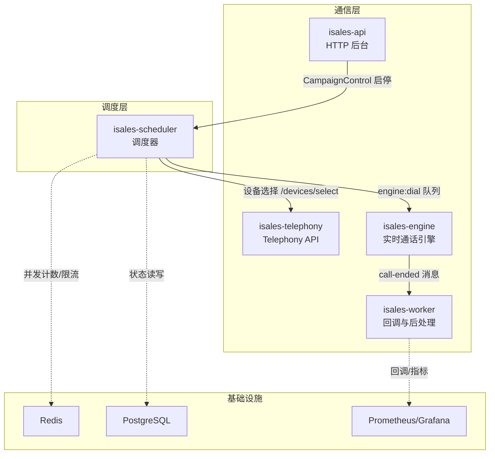
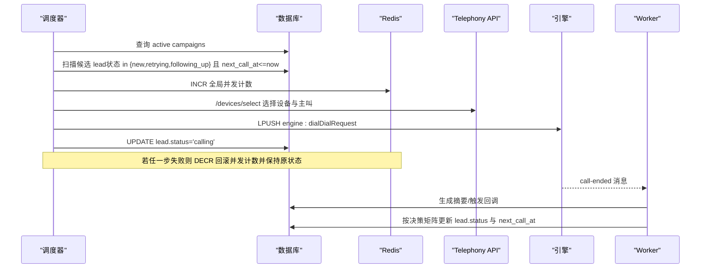
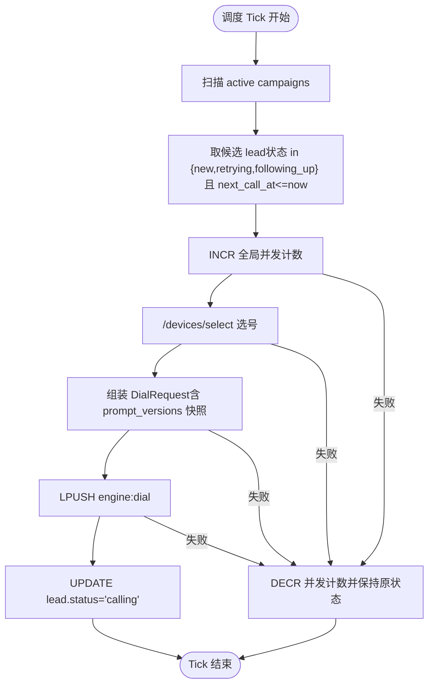
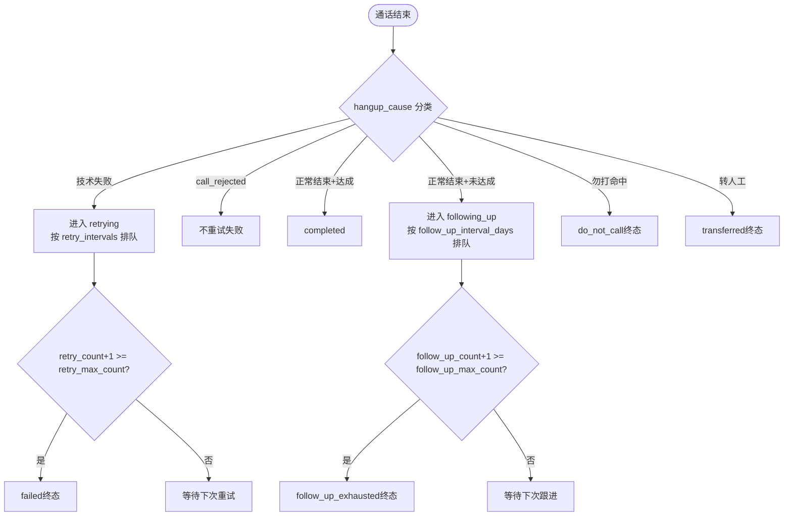
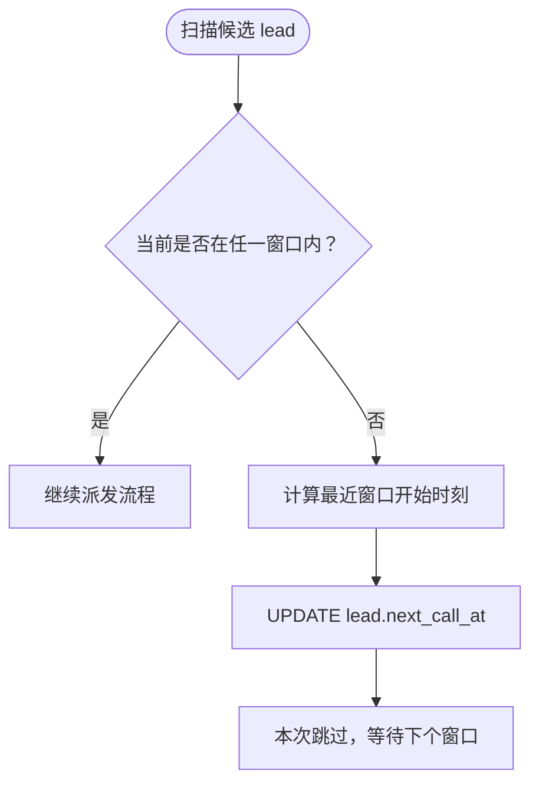
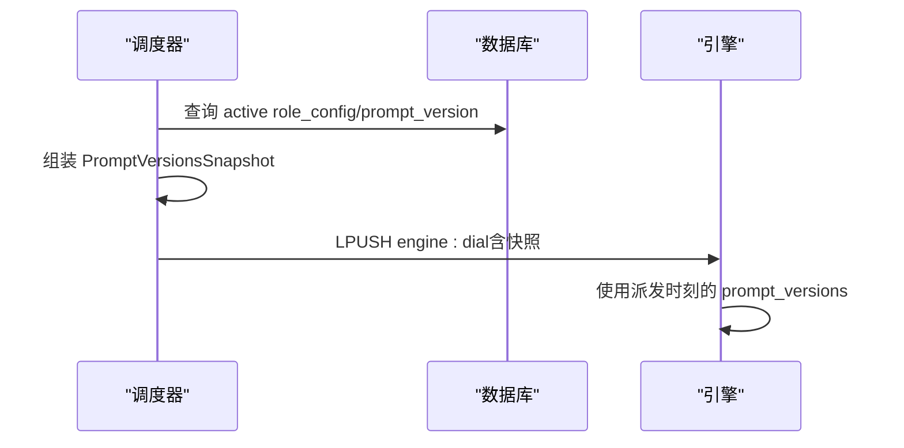
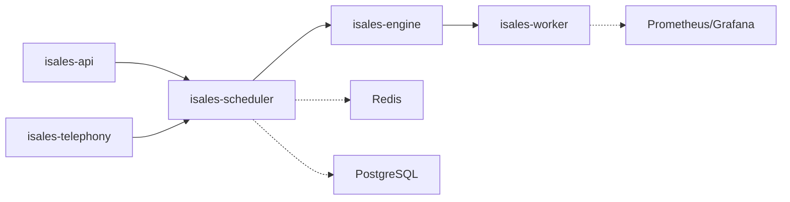

# 调度和生命周期管理

<cite>
**本文引用的文件**
- [README.md](file://README.md)
- [scheduler.env.example](file://deploy/env/scheduler.env.example)
- [prometheus.yml.example](file://deploy/monitoring/prometheus.yml.example)
- [alert_rules.yml.example](file://deploy/monitoring/alert_rules.yml.example)
- [retry-followup/spec.md](file://openspec/specs/retry-followup/spec.md)
- [time-window/spec.md](file://openspec/specs/time-window/spec.md)
- [2026-05-06-impl-scheduler/proposal.md](file://openspec/changes/archive/2026-05-06-impl-scheduler/proposal.md)
- [2026-05-06-impl-scheduler/design.md](file://openspec/changes/archive/2026-05-06-impl-scheduler/design.md)
- [2026-05-06-impl-worker/proposal.md](file://openspec/changes/archive/2026-05-06-impl-worker/proposal.md)
- [2026-05-07-impl-engine/design.md](file://openspec/changes/archive/2026-05-07-impl-engine/design.md)
- [2026-05-23-web-admin-campaign-workflow/specs/web-admin-ui/spec.md](file://openspec/changes/archive/2026-05-23-web-admin-campaign-workflow/specs/web-admin-ui/spec.md)
</cite>

## 目录
1. [简介](#简介)
2. [项目结构](#项目结构)
3. [核心组件](#核心组件)
4. [架构总览](#架构总览)
5. [详细组件分析](#详细组件分析)
6. [依赖关系分析](#依赖关系分析)
7. [性能考量](#性能考量)
8. [故障排查指南](#故障排查指南)
9. [结论](#结论)
10. [附录](#附录)

## 简介
本文件面向 iSales 调度与生命周期管理系统，围绕线索调度算法、重试与跟进策略、时间窗口管理、并发与负载均衡、性能监控与故障恢复、以及与 AI 通话引擎的协同机制进行系统化说明。文档基于仓库中的 OpenSpec 规范与设计说明，结合部署与监控样例，帮助读者快速理解调度系统如何在真实业务场景中提升销售转化率与客户满意度。

## 项目结构
iSales 采用多仓协作的分层架构，调度系统位于独立的服务仓库中，通过消息队列与 AI 引擎、Telephony API、Worker 等服务解耦协作。部署层面提供 systemd/launchd 服务与监控配置示例，便于在 Linux/macOS 单机环境中快速上线。

**图表来源**
- [README.md:1-14](file://README.md#L1-L14)
- [2026-05-06-impl-scheduler/design.md:35-52](file://openspec/changes/archive/2026-05-06-impl-scheduler/design.md#L35-L52)
- [2026-05-06-impl-worker/proposal.md:12-17](file://openspec/changes/archive/2026-05-06-impl-worker/proposal.md#L12-L17)

**章节来源**
- [README.md:1-14](file://README.md#L1-L14)
- [README.md:16-30](file://README.md#L16-L30)

## 核心组件
- 调度器（isales-scheduler）：负责按时间窗口与并发约束扫描待呼线索，选择设备并派发 DialRequest 至引擎，仅在“窗外重排”场景写回 next_call_at。
- Telephony API：提供设备选择接口，供调度器在派发前完成设备与主叫号码的绑定。
- 引擎（isales-engine）：消费 DialRequest，执行实时通话与 AI 管线，通话结束后向 Worker 发送 call-ended 消息。
- Worker（isales-worker）：消费 call-ended，生成摘要、触发回调、按 retry-followup 决策矩阵更新线索状态与下次外呼时间。
- 数据与缓存：PostgreSQL 存储 Campaign/Lead 状态与配置；Redis 用于全局并发计数与活动 Campaign 集合。
- 监控：Prometheus 抓取各服务指标，Grafana 可视化；告警规则覆盖队列堆积、设备异常、回调失败、数据库连接等。

**章节来源**
- [2026-05-06-impl-scheduler/design.md:35-52](file://openspec/changes/archive/2026-05-06-impl-scheduler/design.md#L35-L52)
- [2026-05-06-impl-scheduler/design.md:122-137](file://openspec/changes/archive/2026-05-06-impl-scheduler/design.md#L122-L137)
- [2026-05-06-impl-worker/proposal.md:12-17](file://openspec/changes/archive/2026-05-06-impl-worker/proposal.md#L12-L17)
- [2026-05-07-impl-engine/design.md:265-269](file://openspec/changes/archive/2026-05-07-impl-engine/design.md#L265-L269)

## 架构总览
调度系统遵循“调度器只写状态、不写 next_call_at”的契约，将重试/跟进的时间推进交给 Worker，从而实现清晰的职责边界与可并行演进的架构。

**图表来源**
- [retry-followup/spec.md:119-158](file://openspec/specs/retry-followup/spec.md#L119-L158)
- [2026-05-06-impl-scheduler/design.md:122-137](file://openspec/changes/archive/2026-05-06-impl-scheduler/design.md#L122-L137)
- [2026-05-06-impl-worker/proposal.md:40-51](file://openspec/changes/archive/2026-05-06-impl-worker/proposal.md#L40-L51)

## 详细组件分析

### 调度算法与并发控制
- 调度循环：单 asyncio 任务，每 tick 执行一次调度步骤，tick 间隔可配置；分钟级延迟满足外呼场景需求。
- 活动 Campaign 集合：Redis SET 作为真相源，进程内缓存减少每 tick 的 Redis 访问；CampaignControl 消息驱动实时同步。
- 并发控制：全局 Redis 计数器 INCR/DECR，引擎进程内不再重复计数，避免与调度器不一致。
- 状态写入边界：仅在派发成功后写 lead.status='calling'，不写终态或重试/跟进的 next_call_at；仅在“窗外重排”场景写回 next_call_at。

**图表来源**
- [2026-05-06-impl-scheduler/design.md:35-52](file://openspec/changes/archive/2026-05-06-impl-scheduler/design.md#L35-L52)
- [2026-05-06-impl-scheduler/design.md:45-52](file://openspec/changes/archive/2026-05-06-impl-scheduler/design.md#L45-L52)
- [2026-05-06-impl-scheduler/design.md:122-137](file://openspec/changes/archive/2026-05-06-impl-scheduler/design.md#L122-L137)
- [retry-followup/spec.md:119-158](file://openspec/specs/retry-followup/spec.md#L119-L158)

**章节来源**
- [2026-05-06-impl-scheduler/design.md:35-52](file://openspec/changes/archive/2026-05-06-impl-scheduler/design.md#L35-L52)
- [2026-05-06-impl-scheduler/design.md:45-52](file://openspec/changes/archive/2026-05-06-impl-scheduler/design.md#L45-L52)
- [2026-05-06-impl-scheduler/design.md:122-137](file://openspec/changes/archive/2026-05-06-impl-scheduler/design.md#L122-L137)
- [retry-followup/spec.md:119-158](file://openspec/specs/retry-followup/spec.md#L119-L158)

### 重试与跟进策略
- 重试：技术原因失败（无应答、忙线、网络故障、临时失败）触发重试；间隔策略为指数退避数组，超出数组长度沿用最后一项；达到最大次数进入失败终态。
- 跟进：通话正常结束但目标未达成，按固定间隔（天）与最大次数进行跟进；达到上限进入 follow_up_exhausted。
- 决策矩阵：严格区分重试/跟进/勿打/转人工/完成等路径，写回 lead.status 与 next_call_at，确保下一 tick 能再次选中或终止。

**图表来源**
- [retry-followup/spec.md:9-50](file://openspec/specs/retry-followup/spec.md#L9-L50)
- [retry-followup/spec.md:119-158](file://openspec/specs/retry-followup/spec.md#L119-L158)
- [2026-05-06-impl-worker/design.md:114-129](file://openspec/changes/archive/2026-05-06-impl-worker/design.md#L114-L129)

**章节来源**
- [retry-followup/spec.md:9-50](file://openspec/specs/retry-followup/spec.md#L9-L50)
- [retry-followup/spec.md:119-158](file://openspec/specs/retry-followup/spec.md#L119-L158)
- [2026-05-06-impl-worker/design.md:114-129](file://openspec/changes/archive/2026-05-06-impl-worker/design.md#L114-L129)

### 时间窗口管理
- 多窗口配置：Campaign 级 time_windows 支持工作日/周末不同时间段；服务器时区统一（如 Asia/Shanghai）。
- 节假日策略：Campaign 可选择是否尊重全局节假日表；遇节假日则当日视为窗外。
- 窗口外推迟：扫描到窗外 lead 时不拨打，计算最近窗口开始时刻并更新 next_call_at。
- 跨边界保护：通话进行中跨过窗口结束时刻不强制中断，调度器仅不再分配新任务。

**图表来源**
- [time-window/spec.md:7-78](file://openspec/specs/time-window/spec.md#L7-L78)

**章节来源**
- [time-window/spec.md:7-78](file://openspec/specs/time-window/spec.md#L7-L78)

### 与 AI 通话引擎的协调
- Prompt 快照：派发时冻结当前 role_config/prompt_version，避免通话过程中版本变更导致上下文漂移。
- 调度依赖：DialRequest 携带 prompt_versions_snapshot，引擎直接复用，不得在派发后重新查询。
- 并发边界：引擎进程内不再做本地并发计数，完全依赖调度器的 Redis 全局计数，避免重复或不一致。

**图表来源**
- [2026-05-06-impl-scheduler/design.md:122-129](file://openspec/changes/archive/2026-05-06-impl-scheduler/design.md#L122-L129)
- [2026-05-07-impl-engine/design.md:244-248](file://openspec/changes/archive/2026-05-07-impl-engine/design.md#L244-L248)

**章节来源**
- [2026-05-06-impl-scheduler/design.md:122-129](file://openspec/changes/archive/2026-05-06-impl-scheduler/design.md#L122-L129)
- [2026-05-07-impl-engine/design.md:244-248](file://openspec/changes/archive/2026-05-07-impl-engine/design.md#L244-L248)

### 配置与部署要点
- 调度器环境变量：tick 间隔、批大小、历史窗口、最大并发等关键参数集中于 scheduler.env.example。
- Web 管理端：Campaign 级外呼策略配置（对话策略、提示词、填充语、可拨时段、音色）持久化至后端，避免仅存于浏览器本地存储。

**章节来源**
- [scheduler.env.example:15-18](file://deploy/env/scheduler.env.example#L15-L18)
- [2026-05-23-web-admin-campaign-workflow/specs/web-admin-ui/spec.md:59-93](file://openspec/changes/archive/2026-05-23-web-admin-campaign-workflow/specs/web-admin-ui/spec.md#L59-L93)

## 依赖关系分析
- 服务间依赖：调度器依赖 Telephony API 的设备选择能力；引擎消费调度器的 DialRequest；Worker 消费引擎的 call-ended 消息。
- 数据依赖：Campaign/Lead 状态与配置存储于 PostgreSQL；活动 Campaign 集合与并发计数通过 Redis 维护。
- 配置依赖：Web 管理端将 per-campaign 的外呼策略持久化，调度器按 Campaign 配置执行。

**图表来源**
- [README.md:7-13](file://README.md#L7-L13)
- [2026-05-06-impl-scheduler/design.md:45-52](file://openspec/changes/archive/2026-05-06-impl-scheduler/design.md#L45-L52)

**章节来源**
- [README.md:7-13](file://README.md#L7-L13)
- [2026-05-06-impl-scheduler/design.md:45-52](file://openspec/changes/archive/2026-05-06-impl-scheduler/design.md#L45-L52)

## 性能考量
- 并发与负载均衡：通过 Redis 全局计数器实现跨实例一致的并发上限；调度器每 tick 扫描候选集，批大小可调以平衡吞吐与延迟。
- 队列背压：Prometheus 告警规则针对 engine:dial 队列堆积进行预警，便于及时扩容或降载。
- 数据库压力：活动 Campaign 集合采用进程内缓存，减少每 tick 的 Redis 访问；建议合理设置 tick 间隔与批大小，避免热点扫描。
- 指标采集：建议尽快补齐各服务 /metrics 端点，以便 Grafana 实时监控调度速率、并发、回调成功率等关键指标。

**章节来源**
- [2026-05-06-impl-scheduler/design.md:35-52](file://openspec/changes/archive/2026-05-06-impl-scheduler/design.md#L35-L52)
- [prometheus.yml.example:30-34](file://deploy/monitoring/prometheus.yml.example#L30-L34)
- [alert_rules.yml.example:12-23](file://deploy/monitoring/alert_rules.yml.example#L12-L23)

## 故障排查指南
- 队列堆积：当 engine:dial 队列长度超过阈值且持续一段时间，检查引擎健康状态、Telephony API 响应、设备可用性。
- 设备异常：设备 flagged 比例骤升可能指示 SIM 耗尽、信号下降或硬件故障，建议核查设备监控指标与日志。
- 回调失败：回调失败率过高可能由外部服务不可用、签名密钥不匹配或渲染模板错误引起，建议检查 worker 的 callback_log 表与日志。
- 数据库连接：PG 连接数接近上限时，排查是否存在连接泄漏或池大小不足，必要时调整连接池与调度 tick 速率。
- 调度停滞：若调度器长时间未产出 DialRequest，检查 CampaignControl 消息是否正常、Redis 并发计数是否回滚、设备选择接口是否可用。

**章节来源**
- [alert_rules.yml.example:12-76](file://deploy/monitoring/alert_rules.yml.example#L12-L76)

## 结论
调度与生命周期管理通过“调度器只写状态、Worker 写回 next_call_at”的契约，实现了重试/跟进策略与时间窗口的清晰分离；配合 Redis 全局并发控制与严格的 Prompt 快照机制，保障了系统在高并发下的稳定性与一致性。结合完善的监控告警与 per-campaign 策略配置，调度系统能够在真实业务场景中有效提升销售转化率与客户满意度。

## 附录
- 部署与运维：参考 README 中的 Linux/macOS 部署流程与 RUNBOOK，确保环境变量与服务单元配置一致。
- OpenSpec 规范：重试/跟进、时间窗口、调度数据流等核心要求均在相应 spec 中明确，建议在实施与变更时对照验证。

**章节来源**
- [README.md:16-30](file://README.md#L16-L30)
- [README.md:23-30](file://README.md#L23-L30)