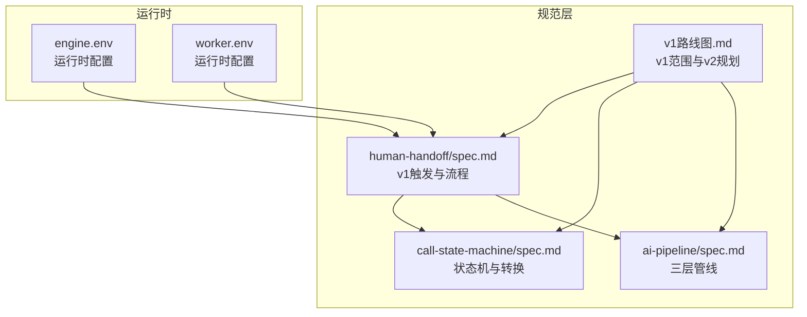
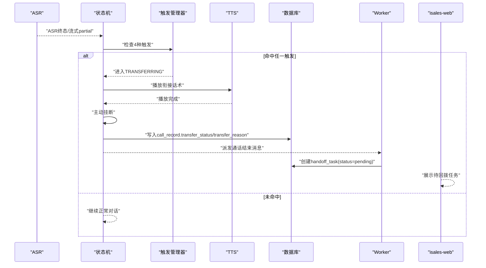
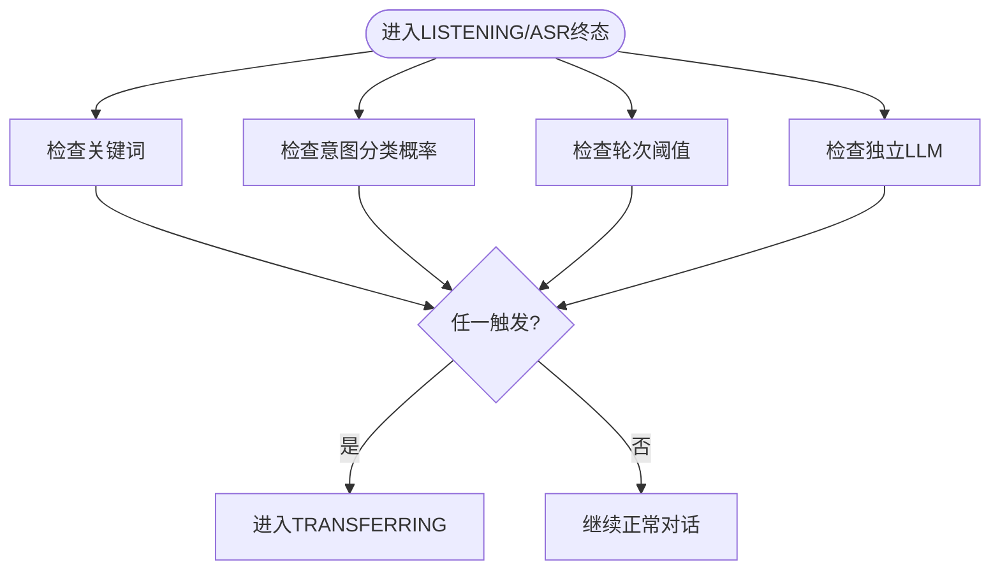
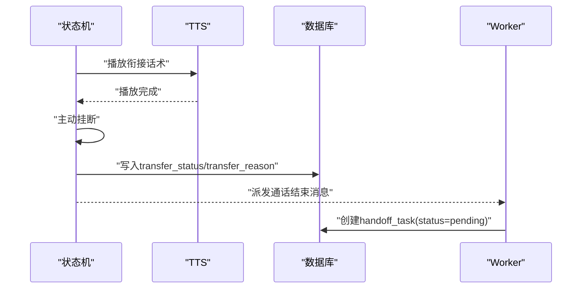
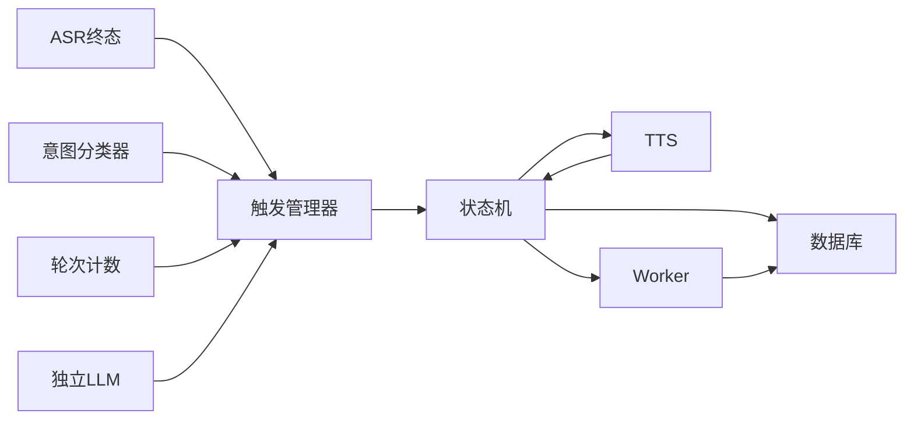

# 转人工机制

<cite>
**本文引用的文件**
- [human-handoff/spec.md](file://openspec/specs/human-handoff/spec.md)
- [call-state-machine/spec.md](file://openspec/specs/call-state-machine/spec.md)
- [ai-pipeline/spec.md](file://openspec/specs/ai-pipeline/spec.md)
- [v1路线图.md](file://openspec/v1-roadmap.md)
- [engine环境变量](file://deploy/cloud/env/engine.env)
- [worker环境变量](file://deploy/cloud/env/worker.env)
</cite>

## 目录
1. [简介](#简介)
2. [项目结构](#项目结构)
3. [核心组件](#核心组件)
4. [架构概览](#架构概览)
5. [详细组件分析](#详细组件分析)
6. [依赖分析](#依赖分析)
7. [性能考虑](#性能考虑)
8. [故障排查指南](#故障排查指南)
9. [结论](#结论)
10. [附录](#附录)

## 简介
本文件面向iSales转人工机制，聚焦v1版本“标记+通知”衰减实现与v2规划。v1不引入SIP/PBX设施，不进行实时话路桥接，转人工触发后由AI礼貌告知用户稍后专员回拨，随后主动结束通话，并派发待回拨任务给坐席。v2计划引入实时桥接（SIP/PBX/GSM软话机），并扩展智能路由、多渠道转接与效果评估。

## 项目结构
围绕转人工机制的关键文件与职责如下：
- human-handoff/spec.md：定义v1“标记+通知”的触发条件、流程与数据模型
- call-state-machine/spec.md：定义状态机状态集与转换规则，明确TRANSFERRING边界
- ai-pipeline/spec.md：定义AI三层管线，为转人工前后的行为提供上下文
- v1路线图.md：阐述v1范围与限制，以及v2规划方向
- engine/worker环境变量：承载转人工相关的运行时配置与密钥

**图表来源**
- [human-handoff/spec.md:1-128](file://openspec/specs/human-handoff/spec.md#L1-L128)
- [call-state-machine/spec.md:1-190](file://openspec/specs/call-state-machine/spec.md#L1-L190)
- [ai-pipeline/spec.md:1-166](file://openspec/specs/ai-pipeline/spec.md#L1-L166)
- [v1路线图.md:526-540](file://openspec/v1-roadmap.md#L526-L540)
- [engine环境变量:1-62](file://deploy/cloud/env/engine.env#L1-L62)
- [worker环境变量:1-17](file://deploy/cloud/env/worker.env#L1-L17)

**章节来源**
- [human-handoff/spec.md:1-128](file://openspec/specs/human-handoff/spec.md#L1-L128)
- [call-state-machine/spec.md:1-190](file://openspec/specs/call-state-machine/spec.md#L1-L190)
- [ai-pipeline/spec.md:1-166](file://openspec/specs/ai-pipeline/spec.md#L1-L166)
- [v1路线图.md:526-540](file://openspec/v1-roadmap.md#L526-L540)
- [engine环境变量:1-62](file://deploy/cloud/env/engine.env#L1-L62)
- [worker环境变量:1-17](file://deploy/cloud/env/worker.env#L1-L17)

## 核心组件
- 触发条件管理器：负责4种独立触发机制（关键词、意图分类、轮次阈值、独立LLM）的判定与OR聚合
- 状态机：在LISTENING进入PROCESSING前/ASR终态时检查触发，命中后进入TRANSFERRING
- TRANSFERRING流程：播放衔接话术→等待TTS完成→主动挂断→写入call_record字段→进入END
- 任务派发：worker在收到通话结束消息且transfer_status="marked_for_handoff"时创建handoff_task
- 坐席工作流：isales-web展示待回拨任务，支持领取/回拨/完成状态流转

**章节来源**
- [human-handoff/spec.md:21-109](file://openspec/specs/human-handoff/spec.md#L21-L109)
- [call-state-machine/spec.md:95-109](file://openspec/specs/call-state-machine/spec.md#L95-L109)
- [v1路线图.md:526-540](file://openspec/v1-roadmap.md#L526-L540)

## 架构概览
v1转人工在状态机层面严格限定：TRANSFERRING期间不调用AI管线，仅播放衔接话术并主动挂断，不进行实时桥接。通话结束后由worker创建handoff_task，坐席通过isales-web回拨。

**图表来源**
- [call-state-machine/spec.md:95-109](file://openspec/specs/call-state-machine/spec.md#L95-L109)
- [human-handoff/spec.md:45-109](file://openspec/specs/human-handoff/spec.md#L45-L109)

## 详细组件分析

### 触发条件设计原理
- 关键词触发：当ASR终态包含campaign.transfer_keywords任一关键词且transfer_keyword_enabled=true
- 意图分类触发：独立轻量意图分类器输出“转人工意图”概率超过threshold且transfer_intent_enabled=true
- 轮次阈值触发：对话轮次超过threshold且未达成目标且transfer_round_enabled=true
- 独立LLM触发：独立判定LLM按prompt版本输出{"transfer": true}且transfer_llm_enabled=true
- 多触发OR关系：任一触发即进入TRANSFERRING

**图表来源**
- [human-handoff/spec.md:21-44](file://openspec/specs/human-handoff/spec.md#L21-L44)

**章节来源**
- [human-handoff/spec.md:21-44](file://openspec/specs/human-handoff/spec.md#L21-L44)

### 标记与通知流程
- 播衔接话术：从campaign.transfer_phrases随机抽取一条TTS播放
- 主动挂断与状态写入：TTS完成后主动挂断，写入call_record.transfer_status="marked_for_handoff"与transfer_reason
- handoff_task派发：worker收到通话结束消息且transfer_status="marked_for_handoff"时创建任务（status=pending，agent_id=null）

**图表来源**
- [human-handoff/spec.md:45-109](file://openspec/specs/human-handoff/spec.md#L45-L109)

**章节来源**
- [human-handoff/spec.md:45-109](file://openspec/specs/human-handoff/spec.md#L45-L109)

### 与状态机的交互边界
- TRANSFERRING期间不调用AI管线，仅可维持ASR流式工作以补录最后一条transcript
- 衔接话术播完后直接进入END（reason=marked_for_handoff），不存在转接成功/失败二级分支
- 转人工触发优先级高于沉默激活与收尾

**章节来源**
- [call-state-machine/spec.md:137-144](file://openspec/specs/call-state-machine/spec.md#L137-L144)
- [human-handoff/spec.md:88-100](file://openspec/specs/human-handoff/spec.md#L88-L100)

### v1版本限制与约束
- 不引入SIP/PBX设施，不做实时话路桥接
- 无“立刻找空闲坐席”或“无空闲坐席兜底话术”分支（v2实时桥接模式）
- 转接成功率统计、人工客服负载均衡、转接后通话处理等不在v1范围内
- v1.0 scope：human-handoff代码保留但配置默认关闭，UI不暴露

**章节来源**
- [human-handoff/spec.md:1-20](file://openspec/specs/human-handoff/spec.md#L1-L20)
- [v1路线图.md:526-540](file://openspec/v1-roadmap.md#L526-L540)

### v2版本改进计划
- 实时桥接方案：SIP/PBX设施、GSM呼叫转接（AT+CHLD）、自研SIP软话机
- 智能路由优化：结合坐席负载、技能匹配、偏好策略
- 多渠道转接支持：网页、APP、微信、小程序等多入口统一转人工
- 转接效果评估：成功率、平均等待时长、满意度、转人工后转化率等指标

**章节来源**
- [human-handoff/spec.md](file://openspec/specs/human-handoff/spec.md#L3)
- [v1路线图.md:526-540](file://openspec/v1-roadmap.md#L526-L540)

## 依赖分析
- 触发条件依赖ASR终态与独立意图分类器/LLM
- 状态机依赖统一事件驱动API，非法转移抛异常并写state_error
- TRANSFERRING依赖TTS播放完成事件，完成后主动挂断
- worker依赖通话结束消息与call_record字段，创建handoff_task

**图表来源**
- [human-handoff/spec.md:21-109](file://openspec/specs/human-handoff/spec.md#L21-L109)
- [call-state-machine/spec.md:33-44](file://openspec/specs/call-state-machine/spec.md#L33-L44)

**章节来源**
- [human-handoff/spec.md:21-109](file://openspec/specs/human-handoff/spec.md#L21-L109)
- [call-state-machine/spec.md:33-44](file://openspec/specs/call-state-machine/spec.md#L33-L44)

## 性能考虑
- v1不引入实时桥接，避免了SIP/PBX设施带来的额外延迟与复杂性
- TRANSFERRING期间不调用AI管线，减少计算开销
- 通话结束消息派发与handoff_task创建采用异步/幂等方式，降低阻塞风险
- v1.0 scope中明确保留但dormant的handoff配置，避免UI与后台压力

**章节来源**
- [v1路线图.md:526-540](file://openspec/v1-roadmap.md#L526-L540)
- [human-handoff/spec.md:88-100](file://openspec/specs/human-handoff/spec.md#L88-L100)

## 故障排查指南
- 非法状态转移：状态机对非法转移抛出异常并写state_error事件，可通过transcript定位
- TRANSFERRING异常：若触发后未进入END或未创建handoff_task，检查TTS播放完成事件与通话结束消息派发
- 任务未创建：确认worker收到通话结束消息且call_record.transfer_status="marked_for_handoff"
- 配置核对：检查engine/worker环境变量中与凭据、密钥相关的配置项

**章节来源**
- [call-state-machine/spec.md:33-44](file://openspec/specs/call-state-machine/spec.md#L33-L44)
- [human-handoff/spec.md:59-67](file://openspec/specs/human-handoff/spec.md#L59-L67)
- [engine环境变量:1-62](file://deploy/cloud/env/engine.env#L1-L62)
- [worker环境变量:1-17](file://deploy/cloud/env/worker.env#L1-L17)

## 结论
v1转人工机制以“标记+通知”为核心，通过4种独立触发条件与状态机边界约束，确保在不引入实时桥接的前提下实现可控的转人工流程。v2将在此基础上扩展实时桥接与智能路由，进一步提升转接效率与用户体验。当前v1.0 scope中handoff配置默认关闭，UI不暴露，为后续v2功能铺垫。

## 附录

### 配置参数与数据模型
- 触发配置（campaign级别）
  - transfer_keyword_enabled：启用关键词触发
  - transfer_keywords：关键词列表（JSONB）
  - transfer_intent_enabled：启用意图分类触发
  - transfer_intent_threshold：意图概率阈值
  - transfer_round_enabled：启用轮次触发
  - transfer_round_threshold：轮次阈值
  - transfer_llm_enabled：启用独立LLM触发
  - transfer_llm_prompt_version_id：独立LLM的prompt版本引用
  - transfer_phrases：衔接话术池（JSONB数组）
- 通话记录字段
  - transfer_status：标记转人工状态（如marked_for_handoff）
  - transfer_reason：触发类型
- 任务表
  - handoff_task：call_record_id、agent_id（nullable）、trigger_type、trigger_detail、status、created_at、picked_up_at、completed_at

**章节来源**
- [human-handoff/spec.md:111-128](file://openspec/specs/human-handoff/spec.md#L111-L128)