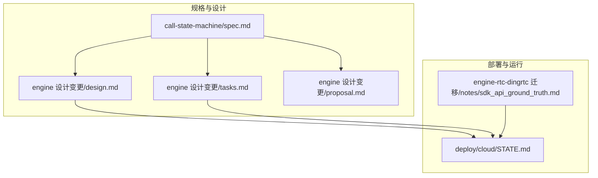
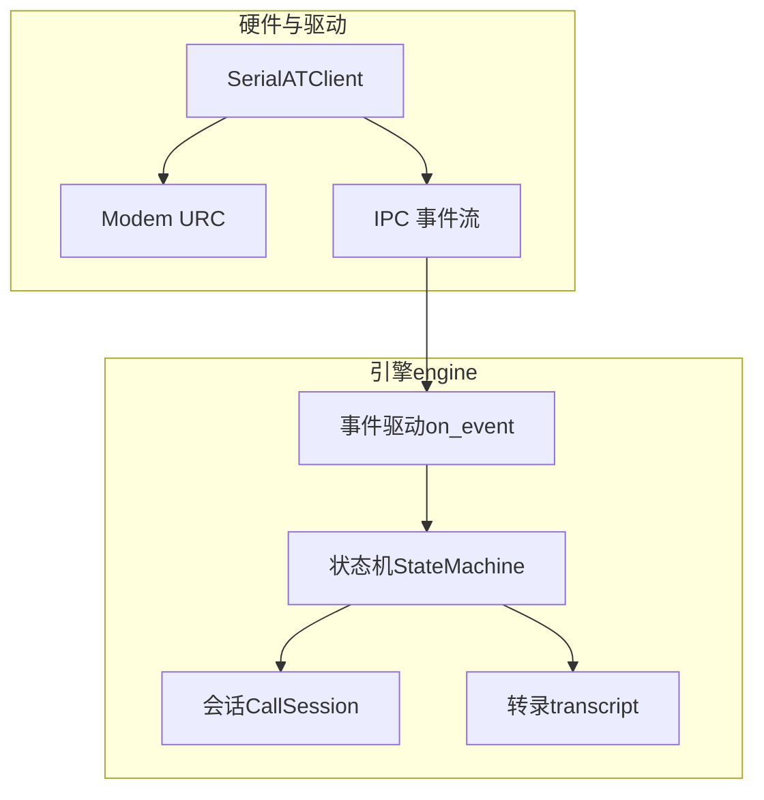
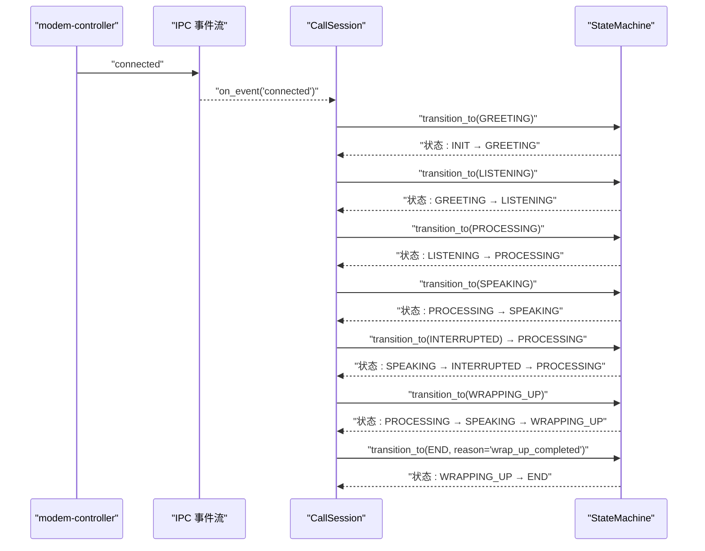
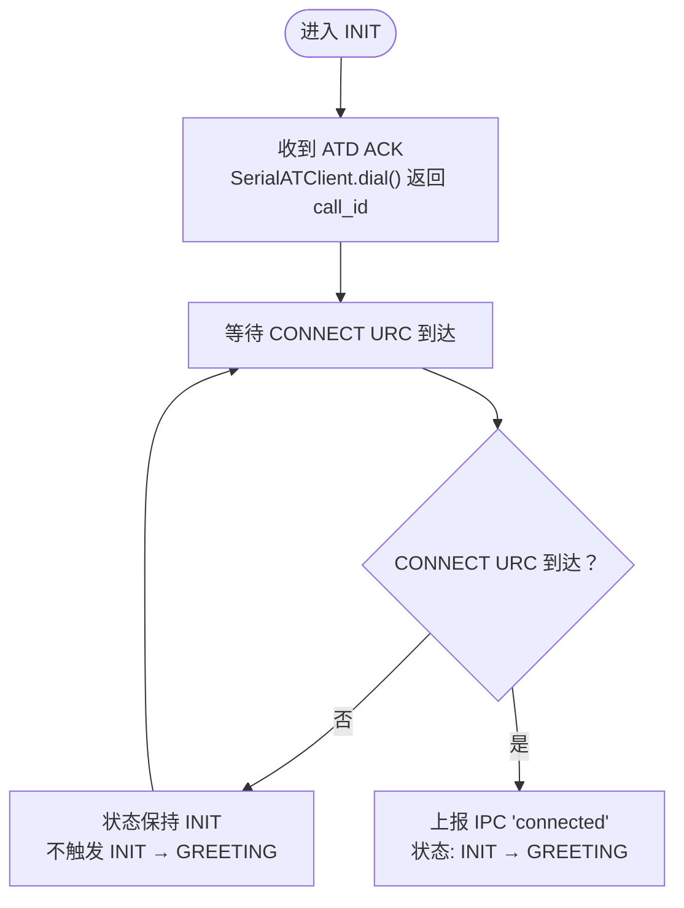
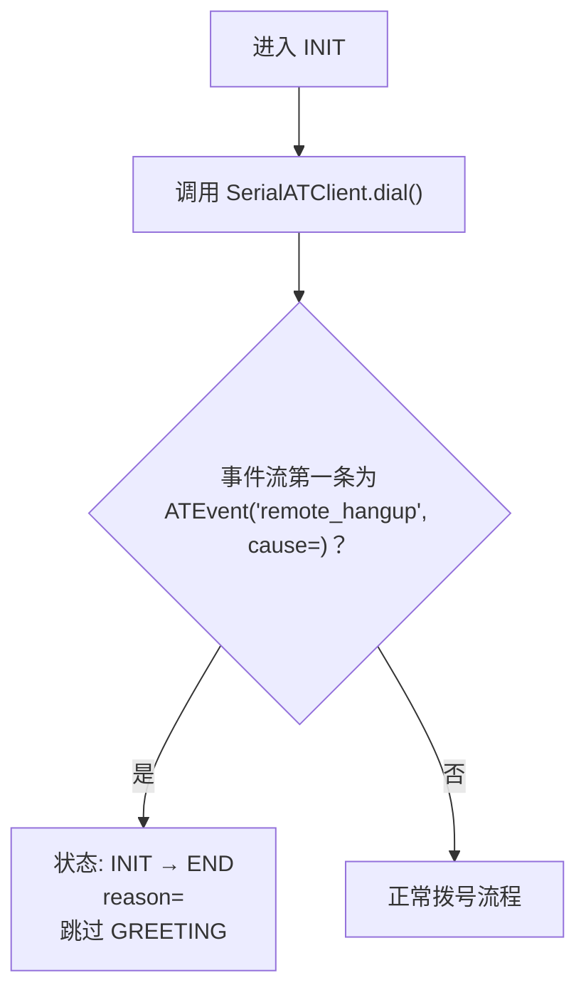
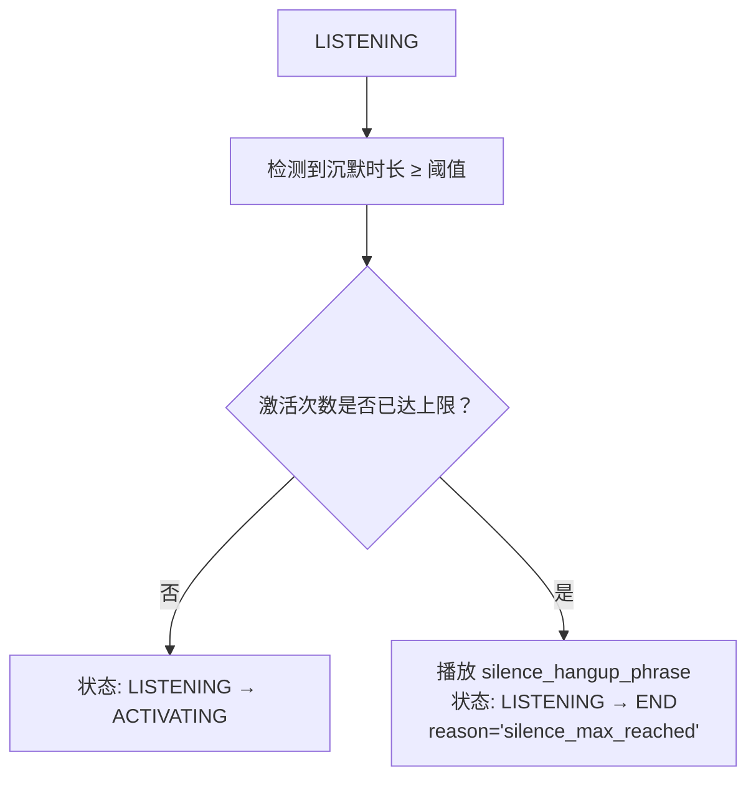
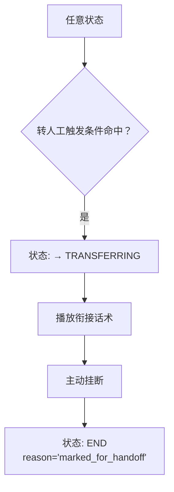
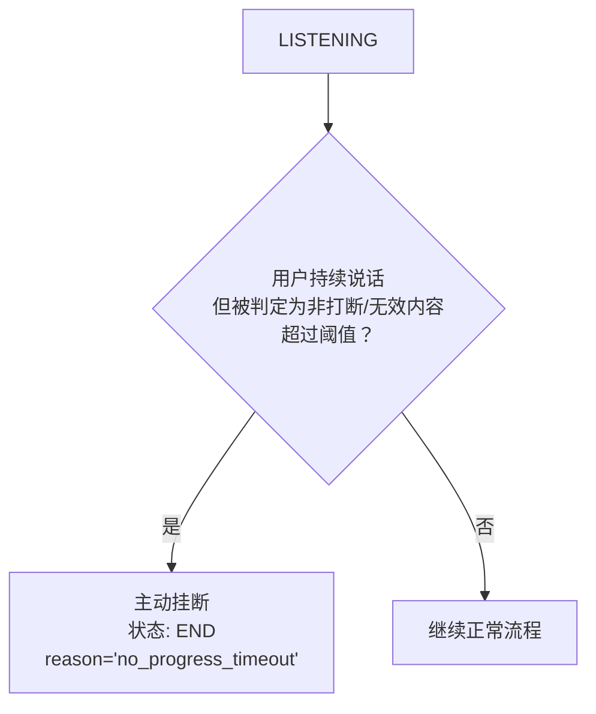
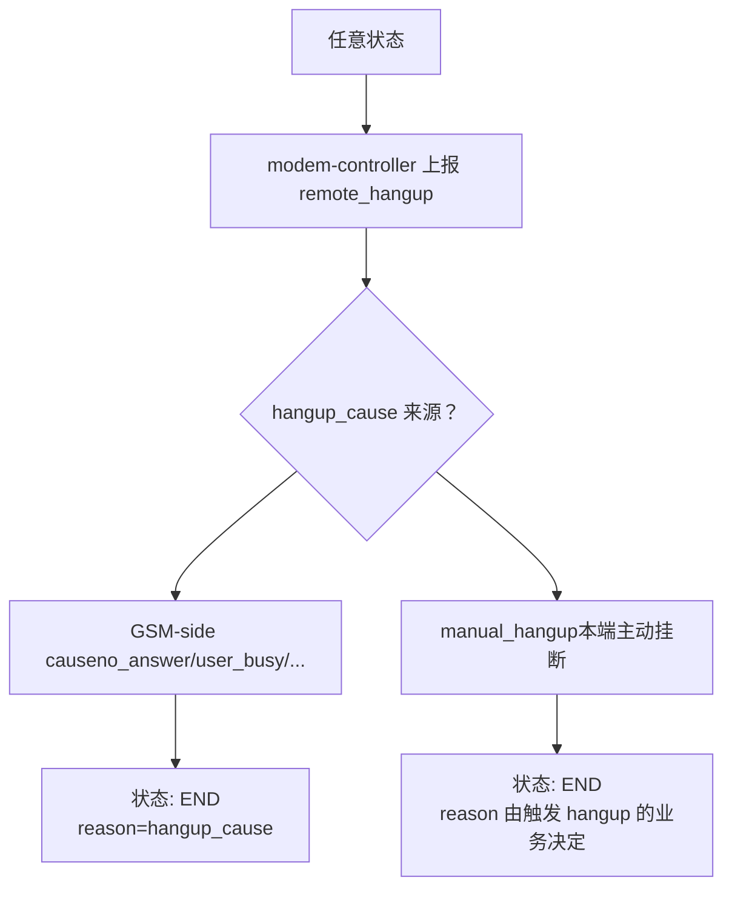
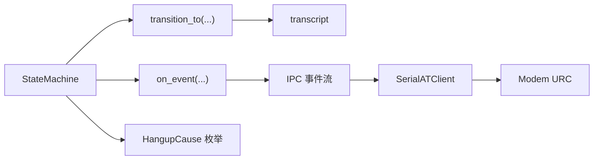

# 通话管理系统

<cite>
**本文引用的文件**
- [call-state-machine/spec.md](file://openspec/specs/call-state-machine/spec.md)
- [engine 设计变更（归档）/design.md](file://openspec/changes/archive/2026-05-07-impl-engine/design.md)
- [engine 设计变更（归档）/proposal.md](file://openspec/changes/archive/2026-05-07-impl-engine/proposal.md)
- [engine 设计变更（归档）/tasks.md](file://openspec/changes/archive/2026-05-07-impl-engine/tasks.md)
- [engine-rtc-dingrtc 迁移/notes/sdk_api_ground_truth.md](file://openspec/changes/engine-rtc-dingrtc-migration/notes/sdk_api_ground_truth.md)
- [STATE.md](file://deploy/cloud/STATE.md)
</cite>

## 目录
1. [引言](#引言)
2. [项目结构](#项目结构)
3. [核心组件](#核心组件)
4. [架构总览](#架构总览)
5. [详细组件分析](#详细组件分析)
6. [依赖分析](#依赖分析)
7. [性能考虑](#性能考虑)
8. [故障排查指南](#故障排查指南)
9. [结论](#结论)
10. [附录](#附录)

## 引言
本文件面向 iSales 通话管理系统，聚焦“状态机引擎”的设计理念与实现原理，系统化解析 11 种通话状态（INIT、GREETING、LISTENING、SPEAKING、INTERRUPTED、FILLER、PROCESSING、WRAPPING_UP、ACTIVATING、TRANSFERRING、END）的定义、转换规则与触发条件；阐明合法性检查机制、非法状态转移的处理策略、状态转换事件的记录与调试方法；并结合真实硬件 URC 驱动的状态转换逻辑，解释拨号 ACK、连接建立、远端挂断等关键事件的处理方式。文末提供状态转换图与典型业务场景示例，帮助开发者全面掌握通话生命周期的完整管理过程。

## 项目结构
- 本项目采用“规格先行”的演进方式：核心状态机规范位于 openspec/specs/call-state-machine/spec.md；相关设计变更与任务清单在 openspec/changes/* 中沉淀，形成从需求到实现的闭环。
- 通话状态机属于 isales-engine 的核心模块，其状态转换严格通过统一事件驱动 API 触发，并在每次转换时写入 transcript 事件，确保可观测与可调试。

**图表来源**
- [call-state-machine/spec.md:1-190](file://openspec/specs/call-state-machine/spec.md#L1-L190)
- [engine 设计变更（归档）/design.md:74-81](file://openspec/changes/archive/2026-05-07-impl-engine/design.md#L74-L81)
- [engine 设计变更（归档）/tasks.md:17-18](file://openspec/changes/archive/2026-05-07-impl-engine/tasks.md#L17-L18)
- [engine-rtc-dingrtc 迁移/notes/sdk_api_ground_truth.md:43-89](file://openspec/changes/engine-rtc-dingrtc-migration/notes/sdk_api_ground_truth.md#L43-L89)
- [STATE.md:641-641](file://deploy/cloud/STATE.md#L641-L641)

**章节来源**
- [call-state-machine/spec.md:1-190](file://openspec/specs/call-state-machine/spec.md#L1-L190)
- [engine 设计变更（归档）/design.md:74-81](file://openspec/changes/archive/2026-05-07-impl-engine/design.md#L74-L81)
- [engine 设计变更（归档）/tasks.md:17-18](file://openspec/changes/archive/2026-05-07-impl-engine/tasks.md#L17-L18)
- [engine-rtc-dingrtc 迁移/notes/sdk_api_ground_truth.md:43-89](file://openspec/changes/engine-rtc-dingrtc-migration/notes/sdk_api_ground_truth.md#L43-L89)
- [STATE.md:641-641](file://deploy/cloud/STATE.md#L641-L641)

## 核心组件
- 状态机（StateMachine）：维护 11 种通话状态与合法转移集合 LEGAL_TRANSITIONS；提供统一的 transition_to(new_state, reason, meta, force?) API；非法转移抛 IllegalTransition 并写 transcript.state_error。
- 会话（CallSession）：每个 call_session 持有独立状态实例，维护 state、previous_state、state_history，用于调试与审计。
- 事件驱动（Event-driven）：所有状态转换由事件触发（如 connected、remote_hangup、speech_end 等），并在转换时写入 transcript。
- 硬件 URC 驱动：状态转换仅由 SerialATClient 翻译出的 ATEvent（再经 IPC 上抛）触发，避免因 ATD 命令 ACK/中间 URC 单独触发状态转换。

**章节来源**
- [call-state-machine/spec.md:21-21](file://openspec/specs/call-state-machine/spec.md#L21-L21)
- [engine 设计变更（归档）/design.md:74-81](file://openspec/changes/archive/2026-05-07-impl-engine/design.md#L74-L81)
- [engine 设计变更（归档）/tasks.md:17-18](file://openspec/changes/archive/2026-05-07-impl-engine/tasks.md#L17-L18)

## 架构总览
状态机引擎位于 isales-engine 内，作为单进程有限状态机，每个通话会话拥有独立状态实例。状态转换通过统一事件驱动 API 触发，同时写入 transcript 事件，保证可观测性与可追溯性。真实硬件 URC 通过 SerialATClient 翻译为 ATEvent，再经 IPC 上报，驱动状态转换。

**图表来源**
- [call-state-machine/spec.md:146-148](file://openspec/specs/call-state-machine/spec.md#L146-L148)
- [engine 设计变更（归档）/design.md:74-81](file://openspec/changes/archive/2026-05-07-impl-engine/design.md#L74-L81)

## 详细组件分析

### 状态集合与合法转移
- 状态集合：INIT、GREETING、LISTENING、SPEAKING、INTERRUPTED、FILLER、PROCESSING、WRAPPING_UP、ACTIVATING、TRANSFERRING、END。
- 合法转移：状态机维护 LEGAL_TRANSITIONS，任何不在当前状态合法转移集合内的事件必须抛 IllegalTransition，并在 transcript 中追加 state_error 事件。
- 终止条件：进入 END 后不得再发生任何状态转换；engine 将 call_record 落库并向 worker 派发“通话结束”消息。

**章节来源**
- [call-state-machine/spec.md:7-19](file://openspec/specs/call-state-machine/spec.md#L7-L19)
- [call-state-machine/spec.md:21-31](file://openspec/specs/call-state-machine/spec.md#L21-L31)

### 状态转换规则与触发条件
- 拨号成功进入开场白：modem-controller 上报 connected 事件，状态 INIT → GREETING。
- 开场白完成进入监听：GREETING 的 TTS 播放完毕，状态 GREETING → LISTENING。
- SPEAKING 期间被打断：SPEAKING → INTERRUPTED → PROCESSING，立刻停止 TTS。
- LISTENING 正常结束：ASR 上报 speech_end 且未达激活上限，状态 LISTENING → PROCESSING，并启动 FILLER。
- PROCESSING 完成：产出 reply（goal_achieved=false），状态 PROCESSING → SPEAKING。
- 目标达成：PROCESSING 输出 goal_achieved=true，状态 PROCESSING → SPEAKING（播放当前轮 reply）→ WRAPPING_UP。
- WRAPPING_UP 结束：轮数或时长计数器耗尽，播放挂断话术后 → END（reason=wrap_up_completed）。
- 沉默激活：LISTENING 状态沉默时长≥阈值且未达激活上限，状态 LISTENING → ACTIVATING。
- 激活上限挂断：沉默触发但激活次数已达上限，播放 silence_hangup_phrase → END（reason=silence_max_reached）。
- 转人工：任一转人工触发条件命中，状态 → TRANSFERRING；播放衔接话术→主动挂断→END（reason=marked_for_handoff）。
- 长时间无进展挂断：用户一直说话但被判定为非打断/无效内容超过阈值，主动挂断→END（reason=no_progress_timeout）。
- 用户挂机：modem-controller 上报 remote_hangup 事件，状态 → END（reason=user_hangup）。

**章节来源**
- [call-state-machine/spec.md:50-108](file://openspec/specs/call-state-machine/spec.md#L50-L108)

### 特殊状态与边界规则
- 连续打断保护：维护连续打断计数器；当连续 INTERRUPTED → PROCESSING → SPEAKING → INTERRUPTED 循环超过阈值触发保护策略。
- 完整轮次清零：用户完成一轮无打断的 SPEAKING（SPEAKING TTS 完整播完未被打断）后，计数器清零。
- FILLER 并行性：FILLER 与 PROCESSING 并行；垫词期间被打断需立即停止垫词、丢弃当前 PROCESSING，使用新 ASR 终态结果进行新一轮 PROCESSING。
- WRAPPING_UP 简化管线：WRAPPING_UP 期间 PROCESSING 走简化管线（单角色 LLM+润色），不得启用 PK/裁判/垫词；若用户提出新问题，状态在 WRAPPING_UP 内闭环。
- TRANSFERRING 边界：TRANSFERRING 期间不得调用 AI 管线；可保持 ASR 流式工作以补录最后一条 transcript；衔接话术播完后直接进入 END。

**章节来源**
- [call-state-machine/spec.md:110-144](file://openspec/specs/call-state-machine/spec.md#L110-L144)

### 合法性检查与非法转移处理
- 合法性检查：状态机内部维护 LEGAL_TRANSITIONS；任何模块触发的转移目标不在当前状态的合法转移集合内，必须抛 IllegalTransition，并在 transcript 中追加 state_error 事件。
- 可恢复 vs 不可恢复：模块捕获 IllegalTransition 时，若判断事件可忽略（如 ASR partial 在 PROCESSING 期间），模块继续且状态不改变；若事件不可忽略（如 PROCESSING 期间心跳丢失），模块强制进 END(reason=engine_internal_error)，并通过 transition_to(END, reason=engine_internal_error, force=True) 跳过合法性校验。

**章节来源**
- [call-state-machine/spec.md:33-44](file://openspec/specs/call-state-machine/spec.md#L33-L44)

### 真实硬件 URC 驱动与事件映射
- 状态转换来源：状态转换仅由 SerialATClient 翻译出的 ATEvent（再经 IPC 上抛）触发，不得因 ATD 命令 ACK/中间 URC 单独触发转换。
- ATD ACK 后停留 INIT：call_session 处于 INIT，SerialATClient.dial() 已返回 call_id（ATD ACK 到达）但 CONNECT URC 尚未到达时，状态必须保持在 INIT；必须等待 IPC connected 事件（由 CONNECT URC 翻译而来）才触发 INIT → GREETING。
- ATD 被拒绝立即结束：SerialATClient.dial() 返回的事件流第一条就是 ATEvent("remote_hangup", ..., cause=<X>)（ATD 被 modem 拒绝，未到 CONNECT 阶段），modem-controller 通过 IPC 上报 remote_hangup 事件给 engine；engine 状态从 INIT 直接 → END（reason=<X>），跳过 GREETING；transcript 中记录 state_error 事件以便分析。
- 远端 hangup_cause 透传：modem-controller 上报 remote_hangup 事件，cause 为 HangupCause 枚举中的 GSM-side 值之一时，状态 → END，END.reason 等于该 cause 值；不得将所有远端挂断笼统映射为 user_hangup。
- 本端主动挂断 cause 值：engine 主动调用 SerialATClient.hangup(call_id)（如 WRAPPING_UP 后 TTS 播完或 no_progress_timeout 超时），事件流 yield ATEvent("remote_hangup", call_id, cause="manual_hangup")；engine 收到该事件时状态已在 END 或 WRAPPING_UP → END 路径中；manual_hangup cause 不应被状态机用作 END.reason（END reason 由触发 hangup 的业务理由决定）。

**章节来源**
- [call-state-machine/spec.md:146-186](file://openspec/specs/call-state-machine/spec.md#L146-L186)
- [engine-rtc-dingrtc 迁移/notes/sdk_api_ground_truth.md:43-89](file://openspec/changes/engine-rtc-dingrtc-migration/notes/sdk_api_ground_truth.md#L43-L89)
- [STATE.md:641-641](file://deploy/cloud/STATE.md#L641-L641)

### 状态转换序列图（事件驱动）

**图表来源**
- [call-state-machine/spec.md:50-108](file://openspec/specs/call-state-machine/spec.md#L50-L108)

### 状态转换流程图（拨号 ACK 与连接建立）

**图表来源**
- [call-state-machine/spec.md:150-158](file://openspec/specs/call-state-machine/spec.md#L150-L158)

### 状态转换流程图（ATD 被拒绝）

**图表来源**
- [call-state-machine/spec.md:155-158](file://openspec/specs/call-state-machine/spec.md#L155-L158)

### 状态转换流程图（沉默激活与上限挂断）

**图表来源**
- [call-state-machine/spec.md:85-93](file://openspec/specs/call-state-machine/spec.md#L85-L93)

### 状态转换流程图（转人工）

**图表来源**
- [call-state-machine/spec.md:95-98](file://openspec/specs/call-state-machine/spec.md#L95-L98)

### 状态转换流程图（长时间无进展挂断）

**图表来源**
- [call-state-machine/spec.md:100-103](file://openspec/specs/call-state-machine/spec.md#L100-L103)

### 状态转换流程图（用户挂断）

**图表来源**
- [call-state-machine/spec.md:160-168](file://openspec/specs/call-state-machine/spec.md#L160-L168)

### 业务场景示例
- 场景一：正常通话
  - INIT → GREETING → LISTENING → PROCESSING → SPEAKING → WRAPPING_UP → END（wrap_up_completed）
- 场景二：打断处理
  - LISTENING → PROCESSING → SPEAKING → INTERRUPED → PROCESSING
- 场景三：沉默激活
  - LISTENING → ACTIVATING → LISTENING（或达到上限后 END）
- 场景四：转人工
  - 任意状态 → TRANSFERRING → END（marked_for_handoff）
- 场景五：拨号被拒
  - INIT → END（直接，不经过 GREETING）

**章节来源**
- [call-state-machine/spec.md:50-108](file://openspec/specs/call-state-machine/spec.md#L50-L108)
- [call-state-machine/spec.md:150-158](file://openspec/specs/call-state-machine/spec.md#L150-L158)

## 依赖分析
- 状态机依赖于统一事件驱动 API（session.transition_to(...)）与 transcript 记录，确保可观测性与可测试性。
- 硬件 URC 依赖于 SerialATClient 的翻译与 IPC 事件流，避免直接依赖底层 AT 命令细节。
- hangup_cause 依赖于统一的 HangupCause 枚举，确保跨模块一致性。

**图表来源**
- [call-state-machine/spec.md:170-186](file://openspec/specs/call-state-machine/spec.md#L170-L186)
- [engine 设计变更（归档）/design.md:74-81](file://openspec/changes/archive/2026-05-07-impl-engine/design.md#L74-L81)

**章节来源**
- [call-state-machine/spec.md:170-186](file://openspec/specs/call-state-machine/spec.md#L170-L186)
- [engine 设计变更（归档）/design.md:74-81](file://openspec/changes/archive/2026-05-07-impl-engine/design.md#L74-L81)

## 性能考虑
- 状态转换写 transcript 采用统一事件驱动 API，便于单元测试与性能观测。
- 三层管线每轮 PROCESSING 写 pipeline_trace，失败也写，确保调试与降级路径可追踪。
- 引擎进程内并发上限通过全局 Redis 计数器控制，避免本地计数器与调度器不一致。

**章节来源**
- [engine 设计变更（归档）/design.md:83-89](file://openspec/changes/archive/2026-05-07-impl-engine/design.md#L83-L89)
- [engine 设计变更（归档）/design.md:265-269](file://openspec/changes/archive/2026-05-07-impl-engine/design.md#L265-L269)

## 故障排查指南
- 非法状态转移
  - 现象：模块触发的转移目标不在 LEGAL_TRANSITIONS 内，抛 IllegalTransition 并写 transcript.state_error。
  - 处理：模块捕获后根据事件可忽略性决定忽略或强制进 END（engine_internal_error），必要时使用 force=True 跳过校验。
- 拨号被拒
  - 现象：INIT 直接进入 END，transcript 记录 state_error。
  - 处理：检查 modem-controller 的事件流首条是否为 remote_hangup，确认 cause 值。
- 用户挂断原因
  - 现象：END.reason 与 user_hangup 不等同，需区分 GSM-side cause 与 manual_hangup。
  - 处理：依据 hangup_cause 枚举映射，避免将所有远端挂断映射为 user_hangup。
- 沉默激活上限
  - 现象：达到激活上限后自动挂断。
  - 处理：检查沉默阈值与激活上限配置，评估业务策略。

**章节来源**
- [call-state-machine/spec.md:33-44](file://openspec/specs/call-state-machine/spec.md#L33-L44)
- [call-state-machine/spec.md:155-158](file://openspec/specs/call-state-machine/spec.md#L155-L158)
- [call-state-machine/spec.md:160-168](file://openspec/specs/call-state-machine/spec.md#L160-L168)

## 结论
iSales 通话状态机通过“统一事件驱动 + 合法性检查 + 详尽 transcript 记录”的设计，实现了高可靠、可调试、可扩展的通话生命周期管理。真实硬件 URC 通过 ATEvent 抽象，避免了底层 AT 命令细节对状态机的影响，提升了稳定性与一致性。建议在开发与运维中充分利用 transcript 与 hangup_cause 枚举，结合本文提供的状态转换图与场景示例，快速定位问题并优化业务策略。

## 附录
- 状态机实现要点
  - 使用统一 transition_to API 触发状态转换。
  - 维护 LEGAL_TRANSITIONS 并在非法转移时抛异常与写事件。
  - 在引擎关闭时对所有活动会话强制进入 END。
- 事件来源与一致性
  - 所有状态转换来自 IPC 上报的 ATEvent，避免直接依赖 ATD ACK/中间 URC。
  - hangup_cause 统一来源于 HangupCause 枚举，确保跨模块一致。

**章节来源**
- [engine 设计变更（归档）/design.md:74-81](file://openspec/changes/archive/2026-05-07-impl-engine/design.md#L74-L81)
- [engine 设计变更（归档）/design.md:187-187](file://openspec/changes/archive/2026-05-07-impl-engine/design.md#L187-L187)
- [call-state-machine/spec.md:170-186](file://openspec/specs/call-state-machine/spec.md#L170-L186)