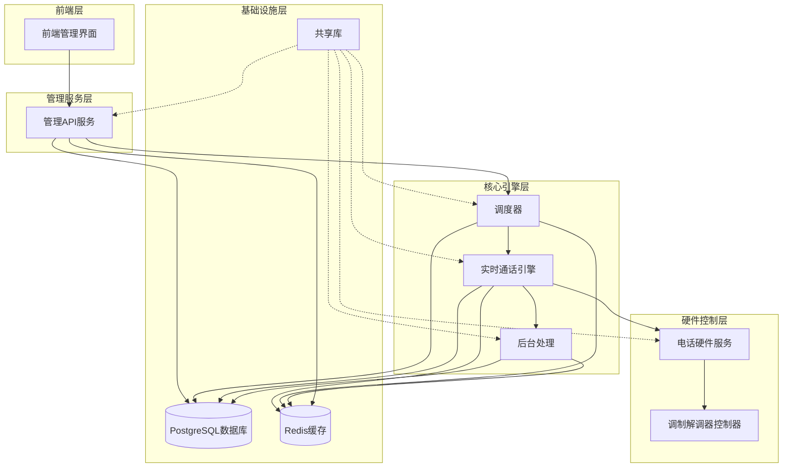
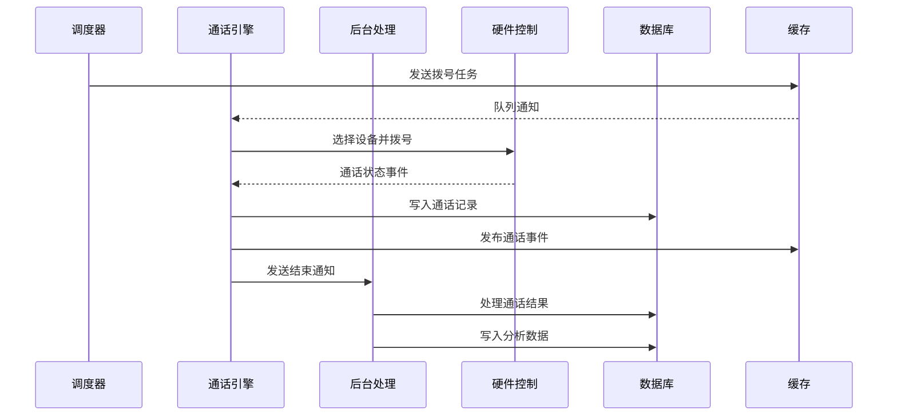
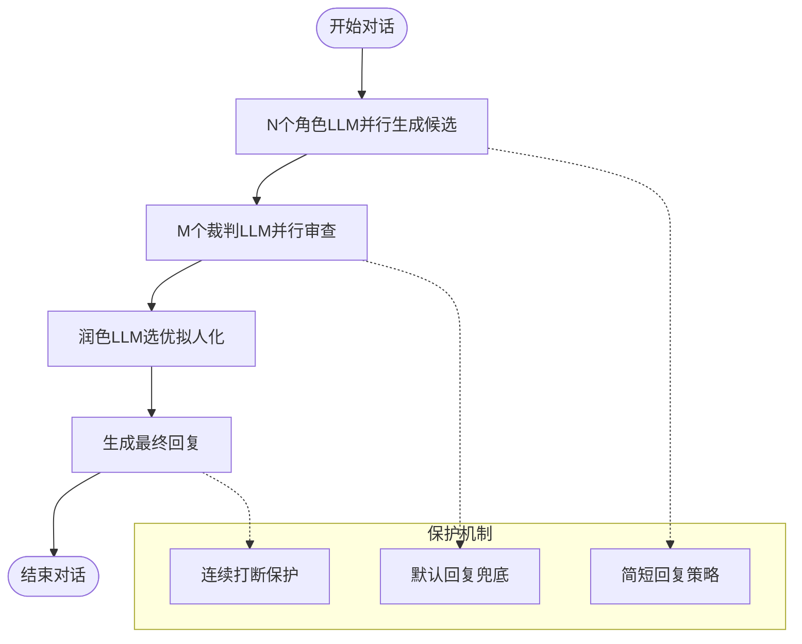
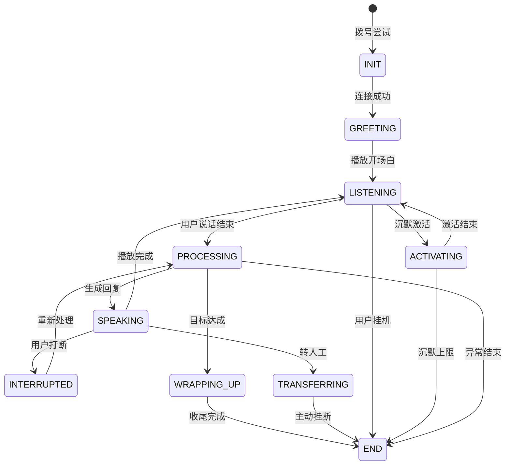
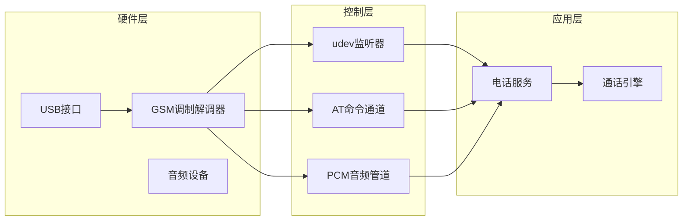
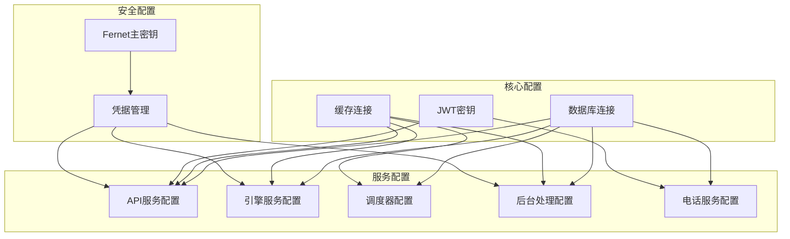
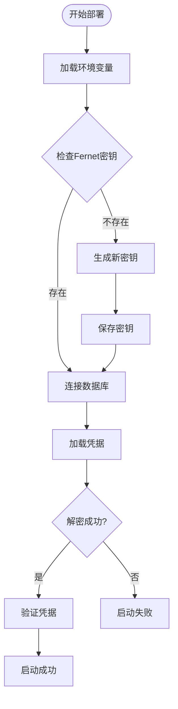

# 系统简介与核心价值

<cite>
**本文档引用的文件**
- [README.md](file://README.md)
- [DESIGN.md](file://DESIGN.md)
- [IMPLEMENTATION_PLAN.md](file://IMPLEMENTATION_PLAN.md)
- [openspec/specs/architecture/spec.md](file://openspec/specs/architecture/spec.md)
- [openspec/specs/ai-pipeline/spec.md](file://openspec/specs/ai-pipeline/spec.md)
- [openspec/specs/call-state-machine/spec.md](file://openspec/specs/call-state-machine/spec.md)
- [openspec/specs/data-model/spec.md](file://openspec/specs/data-model/spec.md)
- [openspec/specs/device-hardware/spec.md](file://openspec/specs/device-hardware/spec.md)
- [openspec/specs/service-communication/spec.md](file://openspec/specs/service-communication/spec.md)
- [openspec/specs/provider-credential/spec.md](file://openspec/specs/provider-credential/spec.md)
- [deploy/env/api.env.example](file://deploy/env/api.env.example)
- [deploy/env/engine.env.example](file://deploy/env/engine.env.example)
</cite>

## 目录
1. [系统概述](#系统概述)
2. [核心价值主张](#核心价值主张)
3. [业务场景与价值体现](#业务场景与价值体现)
4. [目标用户群体](#目标用户群体)
5. [系统架构概览](#系统架构概览)
6. [核心技术概念详解](#核心技术概念详解)
7. [部署与运行模式](#部署与运行模式)
8. [总结](#总结)

## 系统概述

iSales是一个面向企业销售团队的智能外呼销售系统，采用7仓微服务架构，通过AI三层管线、实时通话控制和状态机管理，实现自动化、智能化的电话外呼与客户互动。系统支持Linux和macOS双平台部署，单主机≤8路并发，为企业提供从线索挖掘、自动外呼、客户关系管理到销售转化的完整解决方案。

系统通过OpenSpec规范体系进行设计与演进，确保各组件职责清晰、接口稳定、可扩展性强。核心服务包括：isales-common（共享库）、isales-api（管理后台）、isales-engine（实时通话引擎）、isales-scheduler（调度器）、isales-worker（后台处理）、isales-telephony（电话硬件控制）和isales-web（管理界面）。

**章节来源**
- [README.md:1-14](file://README.md#L1-L14)
- [openspec/specs/architecture/spec.md:1-168](file://openspec/specs/architecture/spec.md#L1-L168)

## 核心价值主张

### 1. 提升销售效率
- **自动化外呼**：系统自动拨打电话，无需人工值守，大幅提升外呼效率
- **智能对话**：基于AI的三层管线，提供更自然、有效的客户沟通体验
- **批量处理**：支持多路并发通话，显著提升销售团队的工作吞吐量

### 2. 提高客户转化率
- **精准营销**：通过历史数据分析和机器学习，优化营销策略
- **个性化沟通**：根据客户特征定制对话内容，提高沟通效果
- **实时跟进**：自动化的跟进机制确保不遗漏潜在客户

### 3. 降低运营成本
- **减少人工成本**：自动化替代部分人工外呼工作
- **提高资源利用率**：智能调度确保设备和人力资源的最优配置
- **标准化流程**：统一的业务流程和质量标准

**章节来源**
- [DESIGN.md:9-21](file://DESIGN.md#L9-L21)
- [IMPLEMENTATION_PLAN.md:381-389](file://IMPLEMENTATION_PLAN.md#L381-L389)

## 业务场景与价值体现

### 企业销售团队的自动外呼
系统为销售团队提供完整的自动外呼解决方案，包括：
- **线索管理**：导入、筛选、分类和跟踪销售线索
- **智能拨号**：根据时间窗口和规则自动拨打电话
- **对话管理**：AI驱动的智能对话，提高沟通效果
- **结果追踪**：自动记录通话结果和客户反馈

### 客户关系管理
系统提供全面的CRM功能：
- **客户档案**：完整的客户信息管理和历史记录
- **交互历史**：保存所有通话记录和沟通内容
- **跟进提醒**：自动化的跟进计划和提醒机制
- **分析报告**：销售业绩和客户行为的深度分析

### 销售线索挖掘
通过AI技术和数据分析：
- **智能筛选**：基于历史数据和行为模式识别优质线索
- **预测分析**：预测客户转化概率和购买意向
- **动态优化**：根据效果反馈不断优化营销策略

### 实时通话控制
系统提供强大的实时通话管理能力：
- **状态监控**：实时监控通话状态和质量
- **异常处理**：自动处理通话中断和其他异常情况
- **人工干预**：必要时支持人工介入和转接

**章节来源**
- [openspec/specs/architecture/spec.md:30-38](file://openspec/specs/architecture/spec.md#L30-L38)
- [openspec/specs/data-model/spec.md:28-51](file://openspec/specs/data-model/spec.md#L28-L51)

## 目标用户群体

### 销售经理
- **团队管理**：监控销售团队的工作进度和绩效
- **策略制定**：基于数据分析制定销售策略和优化方案
- **资源配置**：合理分配销售资源和时间

### 客服代表
- **日常外呼**：执行自动外呼任务，与客户进行高质量对话
- **客户维护**：维护现有客户关系，提供持续服务
- **数据录入**：记录客户反馈和沟通结果

### IT运维人员
- **系统维护**：确保系统的稳定运行和性能优化
- **硬件管理**：维护和管理电话设备和网络基础设施
- **安全保障**：实施安全策略和数据保护措施

### 企业管理者
- **业务洞察**：获取销售数据和市场趋势分析
- **决策支持**：基于数据驱动的业务决策
- **成本控制**：优化运营成本和提高投资回报率

**章节来源**
- [openspec/specs/architecture/spec.md:134-135](file://openspec/specs/architecture/spec.md#L134-L135)
- [openspec/specs/service-communication/spec.md:106-110](file://openspec/specs/service-communication/spec.md#L106-L110)

## 系统架构概览

### 7仓微服务架构
系统采用7个独立仓库的服务架构，每个仓库承担明确的职责：

**图表来源**
- [openspec/specs/architecture/spec.md:130-168](file://openspec/specs/architecture/spec.md#L130-L168)

### 数据流架构
系统采用消息队列和发布订阅模式实现松耦合的数据流：

**图表来源**
- [openspec/specs/service-communication/spec.md:11-24](file://openspec/specs/service-communication/spec.md#L11-L24)

**章节来源**
- [openspec/specs/architecture/spec.md:26-47](file://openspec/specs/architecture/spec.md#L26-L47)
- [openspec/specs/service-communication/spec.md:7-30](file://openspec/specs/service-communication/spec.md#L7-L30)

## 核心技术概念详解

### AI三层管线
系统采用创新的AI三层并行管线架构，确保对话质量和效率：

**图表来源**
- [openspec/specs/ai-pipeline/spec.md:7-17](file://openspec/specs/ai-pipeline/spec.md#L7-L17)

#### 三层架构优势
- **并行处理**：N个角色同时生成候选，M个裁判同时审查，大幅缩短响应时间
- **质量保证**：多层审查确保回复的准确性和合规性
- **智能降级**：在异常情况下提供默认回复，保证用户体验

### 实时通话控制
系统通过状态机管理复杂的通话生命周期：

**图表来源**
- [openspec/specs/call-state-machine/spec.md:5-21](file://openspec/specs/call-state-machine/spec.md#L5-L21)

#### 状态机特性
- **严格约束**：非法状态转换会被捕获并记录
- **实时响应**：基于事件驱动的状态转换
- **异常处理**：完善的错误恢复和清理机制

### 硬件控制与音频处理
系统采用自研的硬件控制方案，支持多种平台：

**图表来源**
- [openspec/specs/device-hardware/spec.md:26-44](file://openspec/specs/device-hardware/spec.md#L26-L44)

**章节来源**
- [openspec/specs/ai-pipeline/spec.md:1-166](file://openspec/specs/ai-pipeline/spec.md#L1-L166)
- [openspec/specs/call-state-machine/spec.md:1-190](file://openspec/specs/call-state-machine/spec.md#L1-L190)
- [openspec/specs/device-hardware/spec.md:1-525](file://openspec/specs/device-hardware/spec.md#L1-L525)

## 部署与运行模式

### 单主机部署模型
系统支持两种主要的单主机部署模式：

#### Linux + systemd部署
- **适用场景**：服务器环境，生产环境首选
- **特点**：稳定性高，资源占用少，易于维护
- **配置**：通过systemd管理服务生命周期

#### macOS 14+ Apple Silicon部署
- **适用场景**：现场部署，演示环境
- **特点**：支持Apple Silicon芯片，便于边缘部署
- **配置**：通过launchd管理服务

### 环境配置
系统采用环境变量进行配置管理：

**图表来源**
- [deploy/env/api.env.example:1-14](file://deploy/env/api.env.example#L1-L14)
- [deploy/env/engine.env.example:1-21](file://deploy/env/engine.env.example#L1-L21)

### 凭据安全管理
系统采用集中式的凭据管理系统，确保安全性：

**图表来源**
- [openspec/specs/provider-credential/spec.md:6-16](file://openspec/specs/provider-credential/spec.md#L6-L16)

**章节来源**
- [README.md:16-31](file://README.md#L16-L31)
- [deploy/env/api.env.example:1-14](file://deploy/env/api.env.example#L1-L14)
- [deploy/env/engine.env.example:1-21](file://deploy/env/engine.env.example#L1-L21)
- [openspec/specs/provider-credential/spec.md:170-211](file://openspec/specs/provider-credential/spec.md#L170-L211)

## 总结

iSales智能外呼销售系统通过技术创新和架构设计，为企业销售团队提供了高效、智能、可靠的电话外呼解决方案。系统的核心价值体现在：

### 技术优势
- **AI三层管线**：提供高质量、合规的智能对话
- **实时状态管理**：确保通话过程的稳定性和可控性
- **微服务架构**：具备良好的扩展性和维护性
- **硬件抽象**：支持多种平台和设备

### 商业价值
- **提升效率**：自动化外呼大幅提升销售团队的工作效率
- **降低成本**：减少人工成本，优化资源配置
- **改善体验**：提供更好的客户沟通体验
- **数据驱动**：基于数据分析的业务决策支持

### 应用前景
系统适用于各种规模的企业，特别是需要大量电话外呼的销售团队。通过持续的技术创新和功能扩展，iSales将成为企业数字化转型的重要工具，帮助企业实现销售效率和客户满意度的双重提升。