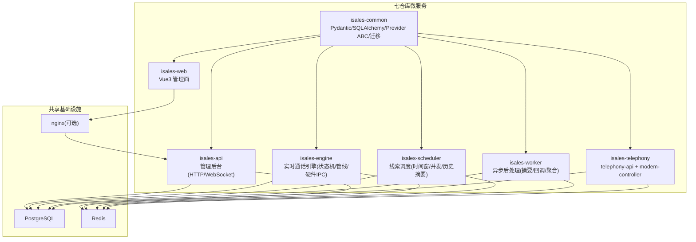
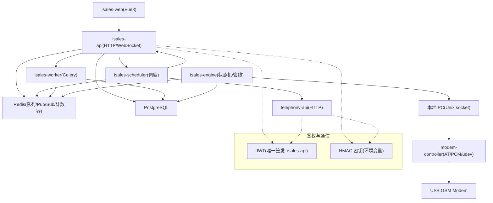
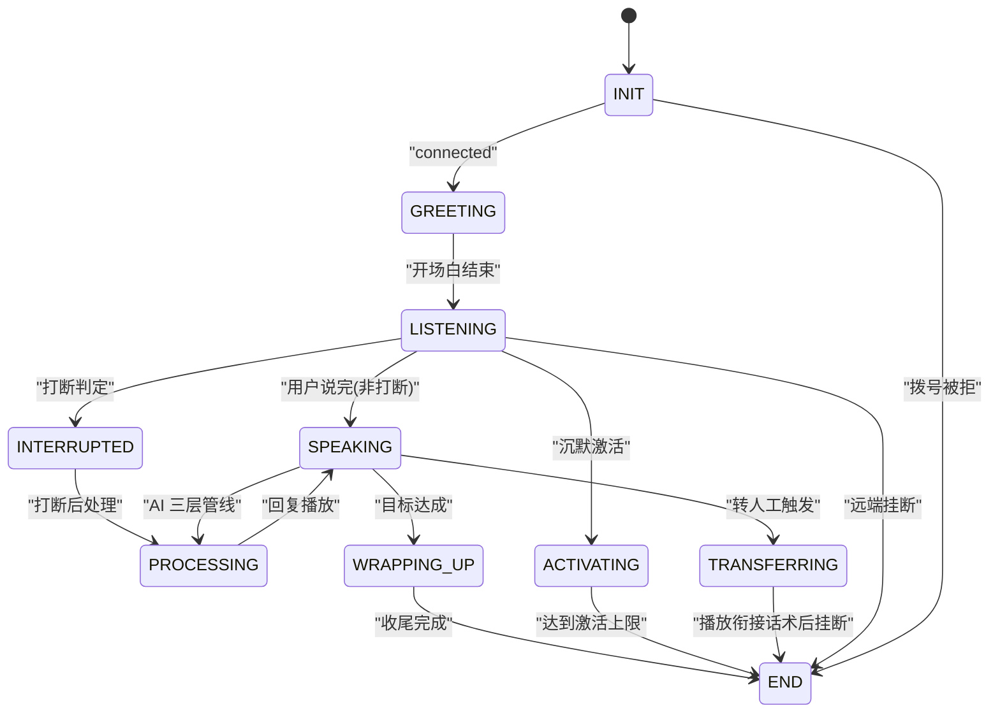
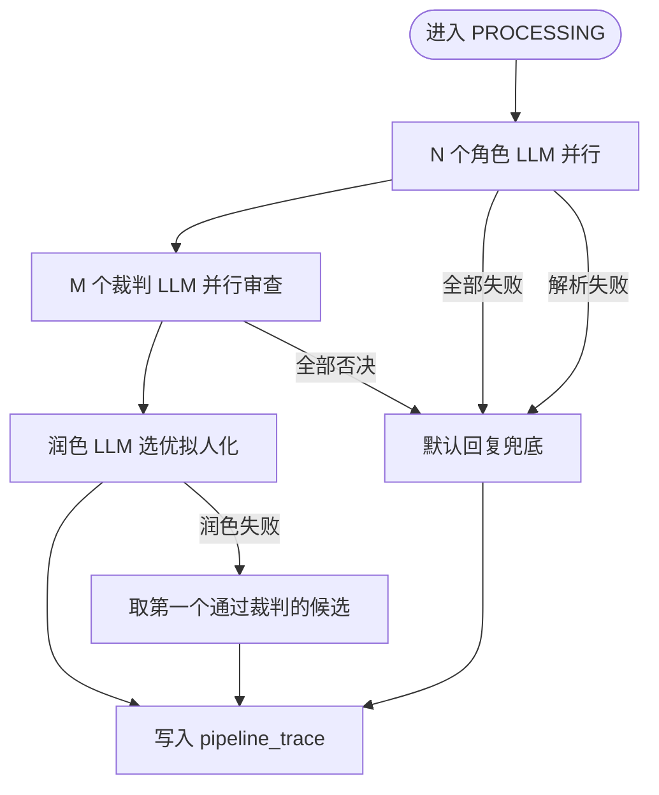
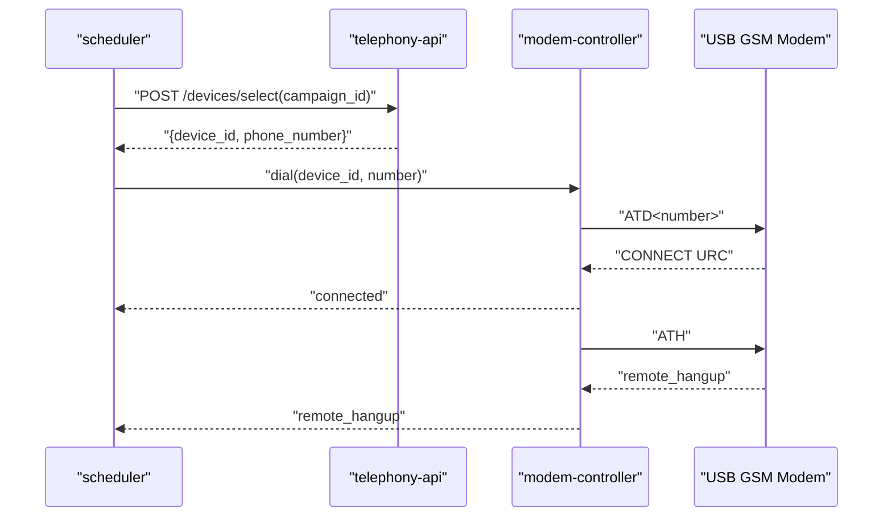
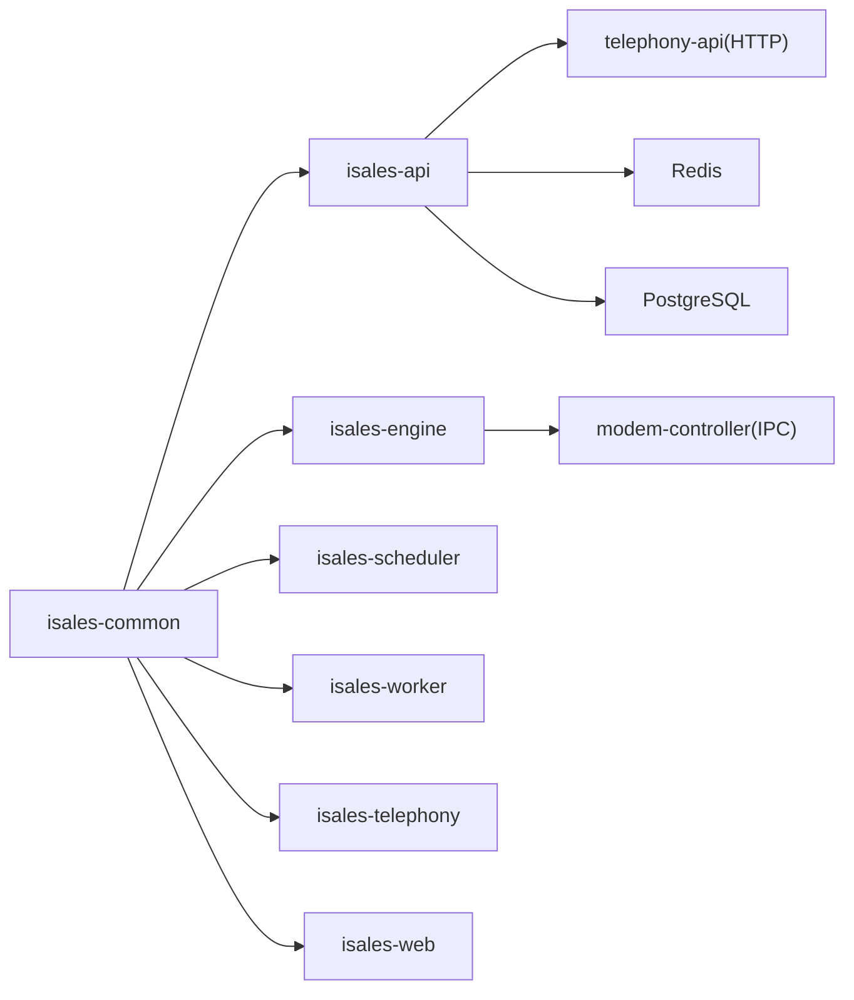

# 项目概述

<cite>
**本文引用的文件**
- [README.md](file://README.md)
- [DESIGN.md](file://DESIGN.md)
- [IMPLEMENTATION_PLAN.md](file://IMPLEMENTATION_PLAN.md)
- [openspec/specs/architecture/spec.md](file://openspec/specs/architecture/spec.md)
- [openspec/specs/call-state-machine/spec.md](file://openspec/specs/call-state-machine/spec.md)
- [openspec/specs/ai-pipeline/spec.md](file://openspec/specs/ai-pipeline/spec.md)
- [openspec/specs/device-hardware/spec.md](file://openspec/specs/device-hardware/spec.md)
- [openspec/specs/data-model/spec.md](file://openspec/specs/data-model/spec.md)
- [deploy/README.md](file://deploy/README.md)
- [deploy/RUNBOOK.md](file://deploy/RUNBOOK.md)
- [deploy/cloud/STATE.md](file://deploy/cloud/STATE.md)
</cite>

## 目录
1. [简介](#简介)
2. [项目结构](#项目结构)
3. [核心组件](#核心组件)
4. [架构总览](#架构总览)
5. [详细组件分析](#详细组件分析)
6. [依赖分析](#依赖分析)
7. [性能考虑](#性能考虑)
8. [故障排查指南](#故障排查指南)
9. [结论](#结论)
10. [附录](#附录)

## 简介
iSales 是一套面向销售外呼场景的智能外呼系统，采用七仓库微服务架构，围绕“实时通话引擎 + AI 三层管线 + 状态机 + 调度与后处理”的核心闭环，实现从线索到转化的自动化外呼流程。系统支持 Linux 与 macOS 单主机部署，提供管理后台与实时通话监控，具备可扩展的 Provider 抽象与统一数据模型，满足企业级销售外呼的规模化与稳定性需求。

系统核心价值主张：
- 以“状态机 + AI 三层管线”驱动的实时通话控制，确保对话流畅、可控、可审计
- 以“调度 + 异步后处理”解耦外呼与业务流程，提升吞吐与可靠性
- 以“统一共享库 + 服务通信契约”保障跨仓库协作的一致性与可演进性
- 以“设备状态机 + 硬件控制层”实现真实 GSM 拨号与音频流，支撑端到端联调与生产部署

## 项目结构
iSales 由七个相互独立的仓库组成，通过 isales-common 共享库进行模型与契约的统一管理。各仓库职责边界清晰，部署在同一主机上，通过 systemd/launchd 管理，共享 PostgreSQL 与 Redis。

图表来源
- [openspec/specs/architecture/spec.md:130-168](file://openspec/specs/architecture/spec.md#L130-L168)
- [openspec/specs/data-model/spec.md:52-60](file://openspec/specs/data-model/spec.md#L52-L60)

章节来源
- [README.md:3-14](file://README.md#L3-L14)
- [openspec/specs/architecture/spec.md:1-11](file://openspec/specs/architecture/spec.md#L1-L11)

## 核心组件
- isales-common：统一数据模型、Pydantic Schema、Provider 抽象、Alembic 迁移与工具函数，作为所有服务的共享基础。
- isales-api：管理后台与 WebSocket 代理，提供 Campaign/Lead/Role/Voice/Analytics/Callback 等资源的 CRUD 与实时事件推送。
- isales-engine：实时通话引擎，包含状态机、AI 三层管线、打断/沉默/垫词、转人工、WRAPPING_UP 收尾、事件发布与硬件 IPC。
- isales-scheduler：线索调度器，按时间窗口与并发限制分发外呼任务，打包历史摘要并调用选号 API。
- isales-worker：异步后处理，负责通话摘要生成、字段提取、Webhook 回调与指标聚合。
- isales-telephony：包含 telephony-api（设备/SIM 管理）与 modem-controller（udev/AT 命令/PCM 音频/心跳）两个进程。
- isales-web：Vue3 管理面，提供任务/线索/音色/设备/数据看板/通话监控/通话记录/回调配置等界面。

章节来源
- [IMPLEMENTATION_PLAN.md:15-38](file://IMPLEMENTATION_PLAN.md#L15-L38)
- [openspec/specs/architecture/spec.md:30-44](file://openspec/specs/architecture/spec.md#L30-L44)

## 架构总览
系统采用“单主机部署 + 七仓库微服务 + 共享基础设施”的总体架构。服务间通过 Redis 队列与 Pub/Sub 通信，engine 通过本地 IPC 与 modem-controller 交互，telephony-api 与 isales-api 共享 JWT 鉴权体系，数据统一由 isales-common 管理。

图表来源
- [openspec/specs/architecture/spec.md:130-168](file://openspec/specs/architecture/spec.md#L130-L168)
- [openspec/specs/architecture/spec.md:96-129](file://openspec/specs/architecture/spec.md#L96-L129)

章节来源
- [openspec/specs/architecture/spec.md:45-72](file://openspec/specs/architecture/spec.md#L45-L72)
- [openspec/specs/architecture/spec.md:96-129](file://openspec/specs/architecture/spec.md#L96-L129)

## 详细组件分析

### 实时通话控制与状态机
- 状态集合：INIT/GREETING/LISTENING/SPEAKING/INTERRUPTED/FILLER/PROCESSING/WRAPPING_UP/ACTIVATING/TRANSFERRING/END
- 转换规则：统一事件驱动，非法转移抛出异常并记录 transcript；支持连续打断保护、WRAPPING_UP 简化管线、TRANSFERRING 期间不调用 AI 管线
- hangup_cause 单一来源：统一 HangupCause 枚举，确保跨模块一致

图表来源
- [openspec/specs/call-state-machine/spec.md:46-118](file://openspec/specs/call-state-machine/spec.md#L46-L118)
- [openspec/specs/call-state-machine/spec.md:137-149](file://openspec/specs/call-state-machine/spec.md#L137-L149)

章节来源
- [openspec/specs/call-state-machine/spec.md:5-44](file://openspec/specs/call-state-machine/spec.md#L5-L44)

### AI 三层管线
- 三层并行：N 个角色 LLM 并行 → N×M 个裁判 LLM 并行审查 → 1 个润色 LLM 选优拟人化
- 失败兜底：全部裁判否决、全部候选解析失败、润色失败、Layer 1 全部失败均有明确兜底与降级路径
- 简化管线：WRAPPING_UP 期间走单角色 + 润色，不启用 PK 与裁判
- pipeline_trace：每轮 PROCESSING 写入 DB，包含候选/裁判/润色字段，异常路径仍写入

图表来源
- [openspec/specs/ai-pipeline/spec.md:7-18](file://openspec/specs/ai-pipeline/spec.md#L7-L18)
- [openspec/specs/ai-pipeline/spec.md:40-68](file://openspec/specs/ai-pipeline/spec.md#L40-L68)

章节来源
- [openspec/specs/ai-pipeline/spec.md:1-166](file://openspec/specs/ai-pipeline/spec.md#L1-L166)

### 设备与硬件控制
- modem-controller 三大职责：udev 监听器、AT 命令通道、PCM 音频管道
- device 状态机：unknown/detected/registered/idle/dialing/in_call/offline/flagged/error
- 选号 API：POST /devices/select，按空闲设备与绑定历史选择 caller_id
- IPC 协议：Unix socket JSON 消息，音频流与控制消息共用通道
- 心跳与失联探测：modem-controller 每 30s 心跳，worker watchdog 超过 120s 置 offline

图表来源
- [openspec/specs/device-hardware/spec.md:106-146](file://openspec/specs/device-hardware/spec.md#L106-L146)
- [openspec/specs/device-hardware/spec.md:171-193](file://openspec/specs/device-hardware/spec.md#L171-L193)

章节来源
- [openspec/specs/device-hardware/spec.md:26-68](file://openspec/specs/device-hardware/spec.md#L26-L68)

### 数据模型与服务通信
- 数据模型由 isales-common 统一管理，其他服务通过依赖访问
- 表归属明确，跨服务读写权由“数据库直连”与“跨服务读 vs 写”约束
- JSONB 字段需附 schema 描述，不替代关系建模

章节来源
- [openspec/specs/data-model/spec.md:19-74](file://openspec/specs/data-model/spec.md#L19-L74)

## 依赖分析
- 组件耦合：isales-common 为共享库，其余六个服务均依赖；engine 与 modem-controller 通过本地 IPC 交互；telephony-api 与 isales-api 共享 JWT/HMAC 密钥
- 直接依赖：engine 依赖 isales-common 的模型/Provider 抽象；scheduler/worker/telephony-api 依赖 isales-common 的模型与迁移
- 外部依赖：PostgreSQL/Redis 作为共享基础设施；telephony-api 依赖 pyudev/pyserial；engine 依赖 AT 命令与 PCM 音频

图表来源
- [openspec/specs/architecture/spec.md:73-86](file://openspec/specs/architecture/spec.md#L73-L86)
- [openspec/specs/architecture/spec.md:59-72](file://openspec/specs/architecture/spec.md#L59-L72)

章节来源
- [openspec/specs/architecture/spec.md:26-44](file://openspec/specs/architecture/spec.md#L26-L44)

## 性能考虑
- 并发控制：全局 Redis 计数器限制并发，engine 启动时清理孤儿计数，避免泄漏
- 管线延迟：三层并行管线与垫词播放并行覆盖，连续打断保护策略（short_reply/listen_only）降低抖动
- 音频时延：Windows/macOS/边缘平台音频路径差异，需基准压测与参数调优，确保端到端延迟达标
- 队列积压：监控 engine:dial 队列深度，及时重启 engine 服务

## 故障排查指南
常见症状与处置步骤：
- 数据库连接失败：检查 PostgreSQL 服务状态与磁盘空间
- Redis OOM：查看内存使用并调整 maxmemory 或策略
- modem-controller “设备断开”：检查 udev 事件与串口占用
- modem-controller 生产环境出现 MockATClient：检查 ISALES_ALLOW_MOCK_AT 是否误设
- engine:dial 队列积压：检查 engine 服务状态并重启
- worker Celery 停滞：检查 active 任务与 engine:worker:call-ended 队列
- nginx 502：直接访问 127.0.0.1:8000/healthz 排查 API 服务
- API 登录失败：检查 ISALES_ADMIN_PASSWORD_HASH 是否为 bcrypt 哈希
- JWT/HMAC 不一致：确保 ISALES_JWT_SECRET 在两个服务一致
- 备份任务未运行：检查 cron 与日志标签 isales-backup

章节来源
- [deploy/RUNBOOK.md:163-196](file://deploy/RUNBOOK.md#L163-L196)

## 结论
iSales 通过七仓库微服务架构与统一共享库，构建了高内聚、低耦合的销售外呼系统。以状态机与 AI 三层管线为核心，结合调度与异步后处理，实现了从线索到转化的自动化闭环。硬件控制层与设备状态机确保真实拨号与音频流的稳定性。依托统一数据模型与服务通信契约，系统具备良好的可演进性与可运维性，适合在单主机环境下进行规模化部署与运营。

## 附录

### 快速开始（Linux + systemd）
- 主机准备：Ubuntu 22.04 LTS，安装 PostgreSQL/Redis/nginx/Node.js/Python3.12 等依赖
- 编辑集中化环境变量：/etc/isales/env/*.env
- 安装新版本：sudo -u isales bash deploy/linux/scripts/install.sh v0.1.0
- 数据库迁移：sudo -u isales bash deploy/linux/scripts/migrate.sh
- 切换 current 并重启：sudo bash deploy/linux/scripts/deploy.sh <release-ts>

章节来源
- [deploy/README.md:51-81](file://deploy/README.md#L51-L81)
- [deploy/RUNBOOK.md:17-52](file://deploy/RUNBOOK.md#L17-L52)

### 快速开始（macOS + launchd）
- 主机准备：macOS 14+ Apple Silicon，Homebrew 已安装
- provision.sh → 编辑 /etc/isales/env/*.env → install.sh → migrate.sh → deploy.sh
- 验证：curl -sf http://localhost/api/healthz | jq .

章节来源
- [deploy/RUNBOOK.md:220-293](file://deploy/RUNBOOK.md#L220-L293)

### 云端部署现状（ECS）
- 服务：isales-api/isales-engine/isales-scheduler/isales-worker/nginx/isales-web
- 数据库：PostgreSQL 13.23 + Redis 6.2.20（单主机）
- 令牌与凭据：provider_credential 表 + Fernet 加密，engine 启动装载
- 端到端验证：cloud-edge gRPC 与 mac --dev-no-modem 烟雾测试

章节来源
- [deploy/cloud/STATE.md:129-242](file://deploy/cloud/STATE.md#L129-L242)
- [deploy/cloud/STATE.md:380-432](file://deploy/cloud/STATE.md#L380-L432)