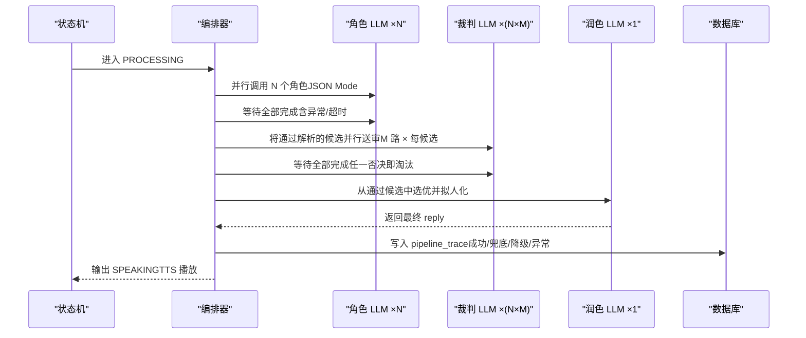
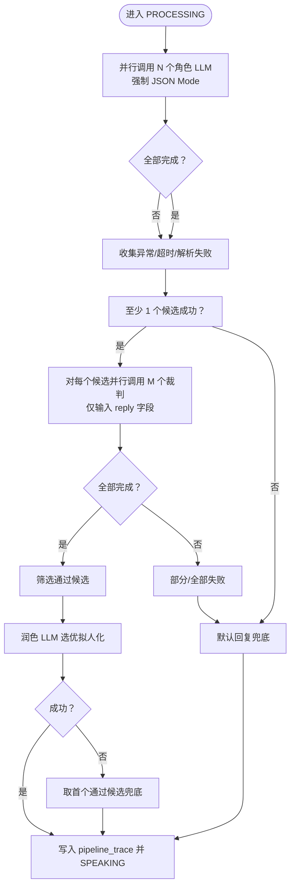
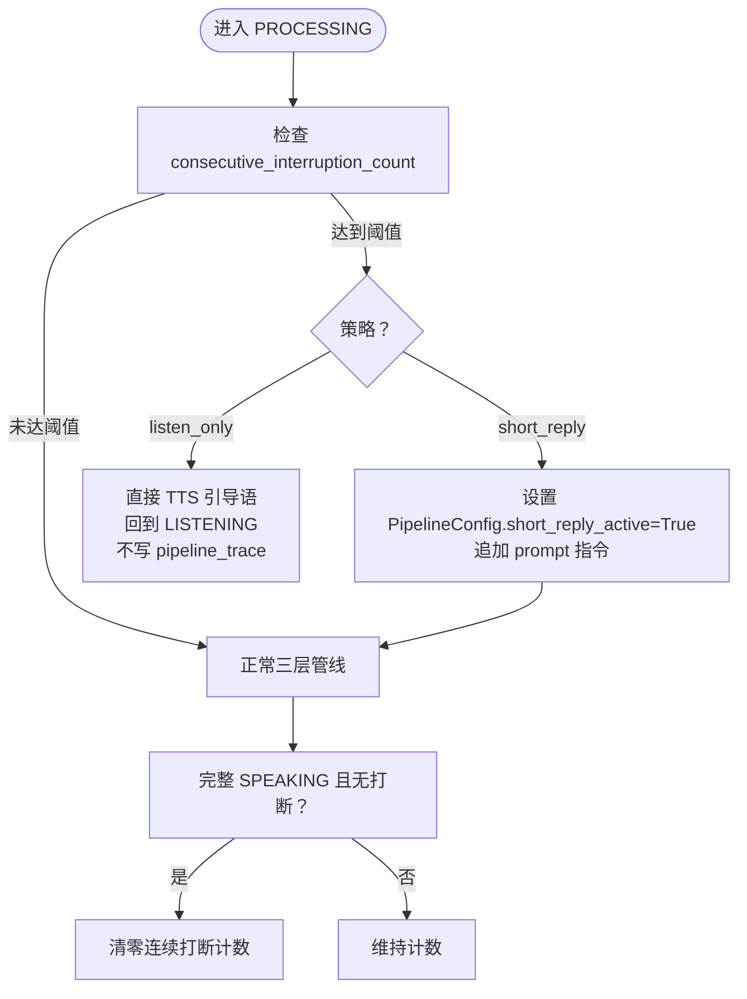
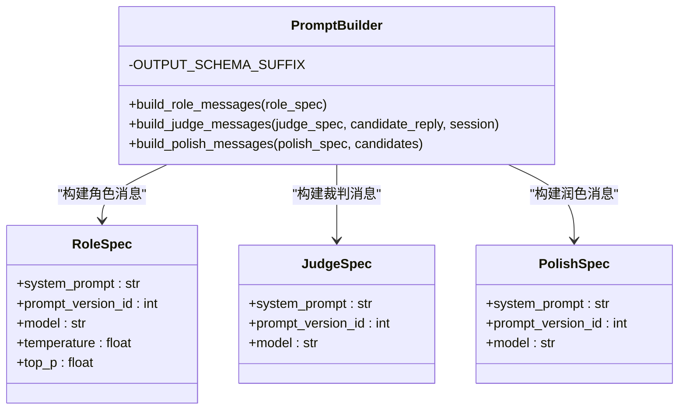
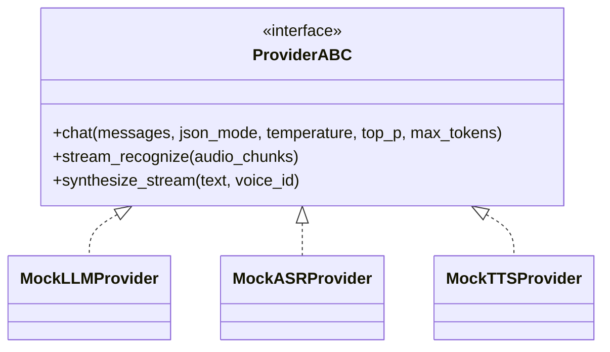
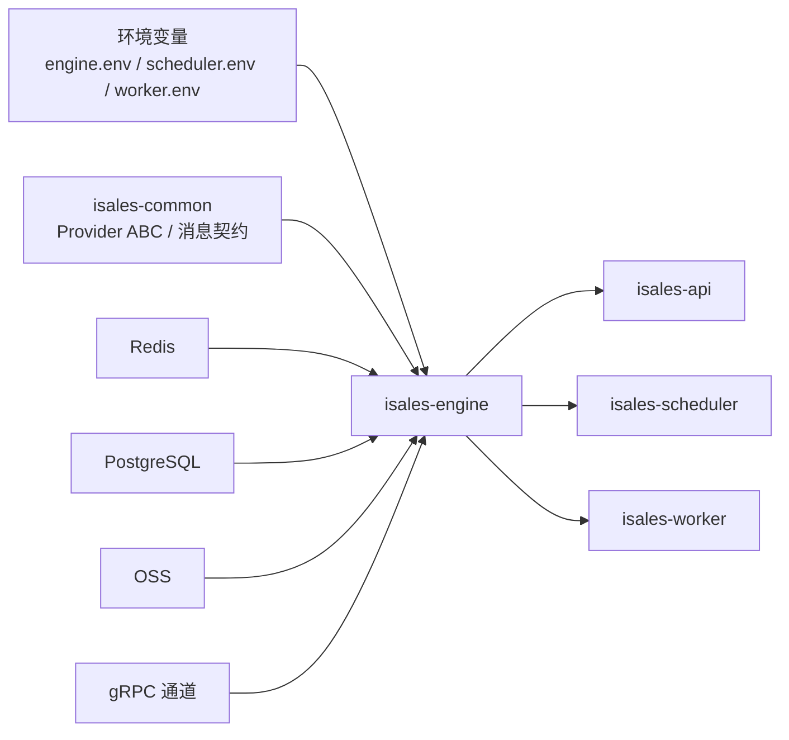

# AI 三层管线架构

<cite>
**本文引用的文件**
- [ai-pipeline 规范](file://openspec/specs/ai-pipeline/spec.md)
- [call-state-machine 规范](file://openspec/specs/call-state-machine/spec.md)
- [role-prompt 规范](file://openspec/specs/role-prompt/spec.md)
- [provider-abc 规范](file://openspec/specs/provider-abc/spec.md)
- [engine-judge-dialog-context 提案](file://openspec/changes/archive/2026-05-29-engine-judge-dialog-context/proposal.md)
- [prompt-builder 源码片段](file://openspec/changes/archive/2026-05-29-engine-judge-dialog-context/tasks.md)
- [engine-providers 提案](file://openspec/changes/archive/2026-05-08-impl-engine-providers/proposal.md)
- [engine 设计文档](file://openspec/changes/archive/2026-05-07-impl-engine/design.md)
- [engine 提案](file://openspec/changes/archive/2026-05-07-impl-engine/proposal.md)
- [部署拓扑](file://deploy/cloud/README.md)
- [engine 环境变量示例](file://deploy/env/engine.env.example)
- [cloud 环境变量示例](file://deploy/cloud/env/engine.env.example)
- [部署拓扑（云-边）](file://openspec/changes/arch-cloud-edge-split/specs/deployment-topology/spec.md)
</cite>

## 目录
1. [简介](#简介)
2. [项目结构](#项目结构)
3. [核心组件](#核心组件)
4. [架构总览](#架构总览)
5. [详细组件分析](#详细组件分析)
6. [依赖分析](#依赖分析)
7. [性能考量](#性能考量)
8. [故障排查指南](#故障排查指南)
9. [结论](#结论)
10. [附录](#附录)

## 简介
本技术文档围绕“AI 三层管线架构”展开，系统阐述 N 个角色 LLM 并行 PK、N×M 个裁判 LLM 并行审查、1 个润色 LLM 选优拟人的三层并行设计与实现。文档覆盖每层职责、数据流转、并发控制、性能优化、连续打断保护策略（short_reply 与 listen_only）、错误处理与降级路径，并给出最佳实践与故障排查建议。

## 项目结构
- 三层管线位于 isales-engine 服务中，通过状态机驱动，结合 Provider ABC 抽象与 Prompt 管理，形成可插拔、可观测、可降级的实时 AI 对话管线。
- 云-边部署拓扑通过 systemd 与 nginx 提供服务暴露，engine 通过 gRPC 与 API/Worker/Scheduler 交互。

```mermaid
graph TB
subgraph "引擎服务isales-engine"
SM["状态机<br/>call-state-machine"]
ORCH["编排器<br/>run_pipeline"]
PROMPT["提示构建器<br/>prompt_builder"]
PIPE["三层管线<br/>Layer1/2/3"]
DB["数据库<br/>pipeline_trace 等"]
end
subgraph "外部服务"
API["API 服务"]
SCHED["调度器"]
WORKER["工作器"]
LLM["LLM 供应商"]
ASR["ASR 供应商"]
TTS["TTS 供应商"]
end
SM --> ORCH
ORCH --> PIPE
PIPE --> PROMPT
PIPE --> LLM
SM --> ASR
SM --> TTS
ORCH --> DB
API <- --> SCHED
API <- --> WORKER
```

图表来源
- [部署拓扑:10-53](file://deploy/cloud/README.md#L10-L53)
- [engine-judge-dialog-context 提案:1-87](file://openspec/changes/archive/2026-05-29-engine-judge-dialog-context/proposal.md#L1-L87)

章节来源
- [部署拓扑:10-53](file://deploy/cloud/README.md#L10-L53)
- [engine 设计文档:1-11](file://openspec/changes/archive/2026-05-07-impl-engine/design.md#L1-L11)

## 核心组件
- 状态机：定义通话生命周期状态与转换，驱动三层管线的启停与简化管线（WRAPPING_UP）。
- 编排器：负责三层管线的调度、并发控制、错误收集与 pipeline_trace 写入。
- 提示构建器：负责 role/judge/polish 的 system prompt 组装、JSON Mode 强制与对话上下文注入。
- Provider ABC：统一 ASR/TTS/LLM 接口，屏蔽供应商差异，提供统一错误模型与流式能力。
- 数据与可观测：每轮 PROCESSING 结束后写入 pipeline_trace，包含候选、裁判、润色等字段，异常路径亦落库。

章节来源
- [call-state-machine 规范:1-190](file://openspec/specs/call-state-machine/spec.md#L1-L190)
- [ai-pipeline 规范:1-166](file://openspec/specs/ai-pipeline/spec.md#L1-L166)
- [provider-abc 规范:1-131](file://openspec/specs/provider-abc/spec.md#L1-L131)
- [role-prompt 规范:135-157](file://openspec/specs/role-prompt/spec.md#L135-L157)

## 架构总览
三层管线在 PROCESSING 状态启动，与垫词并行，覆盖整体管线延迟。Layer 1 并行 N 个角色 LLM；Layer 2 并行 M 个裁判审查每个候选；Layer 3 单次润色选优。连续打断保护在达到阈值时触发 short_reply 或 listen_only 策略，简化管线或直接播放引导语。



图表来源
- [ai-pipeline 规范:7-11](file://openspec/specs/ai-pipeline/spec.md#L7-L11)
- [ai-pipeline 规范:20-44](file://openspec/specs/ai-pipeline/spec.md#L20-L44)
- [call-state-machine 规范:46-78](file://openspec/specs/call-state-machine/spec.md#L46-L78)

## 详细组件分析

### 1) 三层并行管线编排
- Layer 1（角色 PK）：N 个角色 LLM 并行，强制 JSON Mode；至少 1 个候选成功即进入 Layer 2（v1 实现为等待全部完成，避免竞态导致字段顺序不稳定）。
- Layer 2（裁判审查）：对每个候选并行调用 M 个裁判，仅输入候选 reply 字段；任一裁判否决即淘汰。
- Layer 3（润色选优）：单次调用，从通过候选中选优并改写为更拟人化的最终回复；失败时取第一个通过候选作为兜底。



图表来源
- [ai-pipeline 规范:20-44](file://openspec/specs/ai-pipeline/spec.md#L20-L44)
- [ai-pipeline 规范:85-116](file://openspec/specs/ai-pipeline/spec.md#L85-L116)

章节来源
- [ai-pipeline 规范:7-11](file://openspec/specs/ai-pipeline/spec.md#L7-L11)
- [ai-pipeline 规范:20-44](file://openspec/specs/ai-pipeline/spec.md#L20-L44)
- [engine 设计文档:91-102](file://openspec/changes/archive/2026-05-07-impl-engine/design.md#L91-L102)

### 2) 连续打断保护（short_reply 与 listen_only）
- 当连续打断计数达到阈值时，触发保护策略：
  - short_reply：在调用三层管线前设置 PipelineConfig.short_reply_active=True，在 system prompt 末尾追加“请用一句话回应”的指令；管线照常运行，仍写 pipeline_trace。
  - listen_only：跳过 PROCESSING（不调 LLM），直接 TTS 播放引导语后回到 LISTENING；本轮不写 pipeline_trace。
- 完整 SPEAKING 且未被打断后，清零连续打断计数。



图表来源
- [ai-pipeline 规范:13-18](file://openspec/specs/ai-pipeline/spec.md#L13-L18)
- [ai-pipeline 规范:70-78](file://openspec/specs/ai-pipeline/spec.md#L70-L78)
- [call-state-machine 规范:110-117](file://openspec/specs/call-state-machine/spec.md#L110-L117)

章节来源
- [ai-pipeline 规范:13-18](file://openspec/specs/ai-pipeline/spec.md#L13-L18)
- [ai-pipeline 规范:70-78](file://openspec/specs/ai-pipeline/spec.md#L70-L78)
- [call-state-machine 规范:110-117](file://openspec/specs/call-state-machine/spec.md#L110-L117)

### 3) 提示构建与对话上下文注入
- Prompt 三段式组装：system prompt + JSON Schema 强约束后缀（OUTPUT_SCHEMA_SUFFIX）。
- Judge 拿到对话上下文：在 judge user message 段拼接“对话历史”与“候选回复”，空历史显式占位，避免 LLM 将空历史误读为信号缺失。
- JSON Mode 强制：优先原生 JSON Mode；不支持时在 system prompt 末尾贴 schema 描述，后处理 json.loads → 正则提取 {...} → 再失败降级为整段文本作为 reply。



图表来源
- [role-prompt 规范:135-157](file://openspec/specs/role-prompt/spec.md#L135-L157)
- [engine-judge-dialog-context 提案:24-47](file://openspec/changes/archive/2026-05-29-engine-judge-dialog-context/proposal.md#L24-L47)

章节来源
- [role-prompt 规范:135-157](file://openspec/specs/role-prompt/spec.md#L135-L157)
- [engine-judge-dialog-context 提案:24-47](file://openspec/changes/archive/2026-05-29-engine-judge-dialog-context/proposal.md#L24-L47)

### 4) Provider ABC 与统一错误模型
- LLM Provider chat 接口强制 JSON Mode；不支持时通过 system prompt + 后处理保证输出 JSON。
- 统一错误模型：ProviderTimeout/ProviderRateLimited/ProviderInvalidRequest/ProviderServerError，业务层据此做降级与重试。
- ASR/TTS 提供异步流式接口，中间结果驱动打断检测，首包尽快返回以降低端到端延迟。



图表来源
- [provider-abc 规范:48-107](file://openspec/specs/provider-abc/spec.md#L48-L107)

章节来源
- [provider-abc 规范:48-107](file://openspec/specs/provider-abc/spec.md#L48-L107)

### 5) 简化管线（WRAPPING_UP）
- WRAPPING_UP 期间 PROCESSING 走简化管线：单角色 LLM 直出 + 润色 LLM；不启用 PK 与裁判。
- 该状态下任何用户说话触发 PROCESSING 仍走简化管线，不退回主管线。

章节来源
- [ai-pipeline 规范:150-158](file://openspec/specs/ai-pipeline/spec.md#L150-L158)
- [call-state-machine 规范:128-135](file://openspec/specs/call-state-machine/spec.md#L128-L135)

### 6) 开场白与默认回复
- 开场白不走裁判与润色：固定模板直接 TTS；LLM 生成开场白时仅调用单角色 LLM，直接 TTS。
- 默认回复：当全部裁判否决或全部候选解析失败时，从 campaign.default_replies 随机抽取一条作为兜底。

章节来源
- [ai-pipeline 规范:131-148](file://openspec/specs/ai-pipeline/spec.md#L131-L148)
- [ai-pipeline 规范:94-106](file://openspec/specs/ai-pipeline/spec.md#L94-L106)

## 依赖分析
- 服务依赖：engine 依赖 isales-common 的 Provider ABC 与消息契约；通过 gRPC 与 API/Worker/Scheduler 通信；依赖 RDS/Redis/OSS 等中间件。
- 环境变量：engine.env/scheduler.env/worker.env 示例文件定义了数据库、Redis、LLM/ASR/TTS 供应商、超时与并发控制等关键参数。
- 云-边一致性：云端与边缘的 gRPC 端点、设备令牌、RTC 应用等变量需跨环境协调一致。



图表来源
- [engine 环境变量示例](file://deploy/env/engine.env.example)
- [cloud 环境变量示例](file://deploy/cloud/env/engine.env.example)
- [部署拓扑（云-边）:70-86](file://openspec/changes/arch-cloud-edge-split/specs/deployment-topology/spec.md#L70-L86)

章节来源
- [engine 环境变量示例](file://deploy/env/engine.env.example)
- [cloud 环境变量示例](file://deploy/cloud/env/engine.env.example)
- [部署拓扑（云-边）:70-86](file://openspec/changes/arch-cloud-edge-split/specs/deployment-topology/spec.md#L70-L86)

## 性能考量
- 并发控制：Layer 1（N 路 gather）、Layer 2（每个候选 M 路 gather）、Layer 3（单次调用）；v1 采用“全部完成再送下一层”，避免竞态与字段顺序不稳定。
- 超时与降级：统一 LLM 超时（ProviderTimeout）触发润色降级与默认回复；限流（ProviderRateLimited）触发切换 Provider 或重试策略。
- 延迟优化：Layer 1 与垫词并行，覆盖整个管线延迟；TTS 首包尽快返回；ASR 中间结果驱动打断检测。
- 观测与落库：每轮 PROCESSING 结束后写 pipeline_trace，异常路径亦落库，失败仅记录日志不阻塞主路径。

章节来源
- [engine 设计文档:91-102](file://openspec/changes/archive/2026-05-07-impl-engine/design.md#L91-L102)
- [provider-abc 规范:67-107](file://openspec/specs/provider-abc/spec.md#L67-L107)
- [ai-pipeline 规范:11-11](file://openspec/specs/ai-pipeline/spec.md#L11-L11)

## 故障排查指南
- 常见异常与处理
  - 全部角色 LLM 失败：写入 pipeline_trace，error=all_roles_failed，走默认回复兜底。
  - 全部候选被裁判否决：写入 pipeline_trace，error=all_candidates_rejected，走默认回复。
  - 润色超时/异常/JSON 错：写入 pipeline_trace，error=polish_failed_fallback_to_first_passed，取首个通过候选兜底。
  - 写 pipeline_trace 失败：重试 3 次（指数退避）后仍失败则记录 ERROR 日志，不阻塞通话主路径。
- 连续打断保护
  - short_reply：确认 PipelineConfig.short_reply_active 设置与 prompt_builder 追加指令生效；验证本轮仍写 pipeline_trace。
  - listen_only：确认 PROCESSING 被跳过，直接 TTS 引导语后回到 LISTENING，且本轮不写 pipeline_trace。
- 环境与配置
  - 检查 engine.env/scheduler.env/worker.env 中数据库、Redis、LLM/ASR/TTS 供应商、超时与并发参数是否正确。
  - 云-边一致性：核对 ISALES_CLOUD_GRPC_ENDPOINT、ISALES_EDGE_DEVICE_TOKEN、ISALES_RTC_APP_ID 等跨环境变量。

章节来源
- [ai-pipeline 规范:45-63](file://openspec/specs/ai-pipeline/spec.md#L45-L63)
- [ai-pipeline 规范:70-78](file://openspec/specs/ai-pipeline/spec.md#L70-L78)
- [engine-providers 提案:67-71](file://openspec/changes/archive/2026-05-08-impl-engine-providers/proposal.md#L67-L71)
- [engine 环境变量示例](file://deploy/env/engine.env.example)
- [cloud 环境变量示例](file://deploy/cloud/env/engine.env.example)

## 结论
三层并行管线通过“角色 PK → 裁判审查 → 润色选优”的分层设计，结合统一的 Provider ABC、Prompt 管理与连续打断保护策略，实现了高并发、可观测、可降级的实时 AI 对话能力。v1 采用“全部完成再送下一层”的简化实现，有效避免竞态与字段顺序不稳定；配合完善的 pipeline_trace 写入与错误兜底，保障了通话主路径的稳定性与可追溯性。

## 附录
- 最佳实践
  - 使用统一错误模型进行降级与重试，避免供应商异常泄漏到业务层。
  - 在 WRAPPING_UP 与 GREETING 状态严格遵守简化管线与不走裁判/润色的约束。
  - 通过 pipeline_trace 全量记录每轮候选、裁判与润色结果，便于回放与分析。
- 相关文件索引
  - [ai-pipeline 规范](file://openspec/specs/ai-pipeline/spec.md)
  - [call-state-machine 规范](file://openspec/specs/call-state-machine/spec.md)
  - [role-prompt 规范](file://openspec/specs/role-prompt/spec.md)
  - [provider-abc 规范](file://openspec/specs/provider-abc/spec.md)
  - [engine-judge-dialog-context 提案](file://openspec/changes/archive/2026-05-29-engine-judge-dialog-context/proposal.md)
  - [engine 设计文档](file://openspec/changes/archive/2026-05-07-impl-engine/design.md)
  - [engine 提案](file://openspec/changes/archive/2026-05-07-impl-engine/proposal.md)
  - [engine 环境变量示例](file://deploy/env/engine.env.example)
  - [cloud 环境变量示例](file://deploy/cloud/env/engine.env.example)
  - [部署拓扑（云-边）](file://openspec/changes/arch-cloud-edge-split/specs/deployment-topology/spec.md)