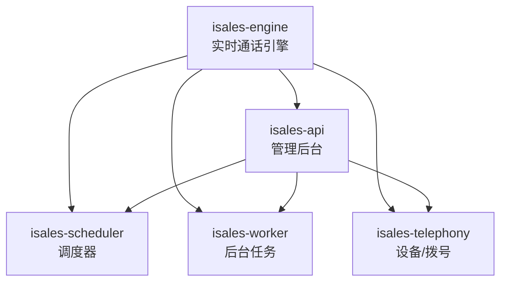
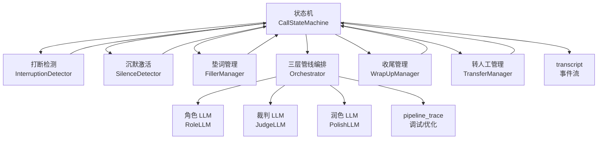
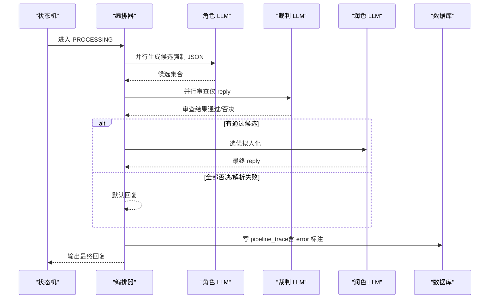
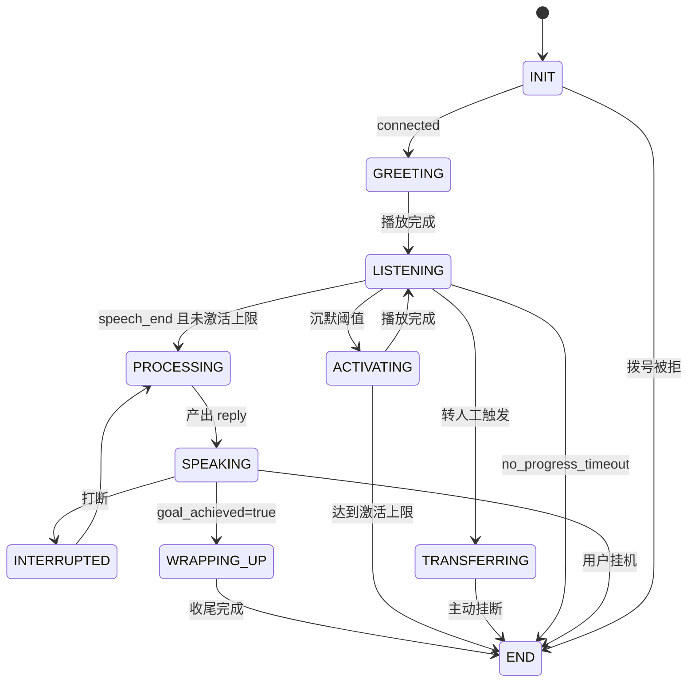
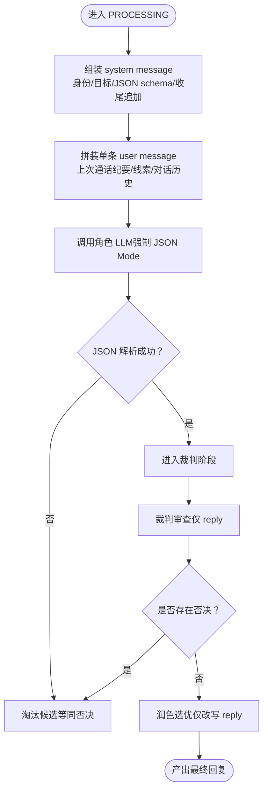
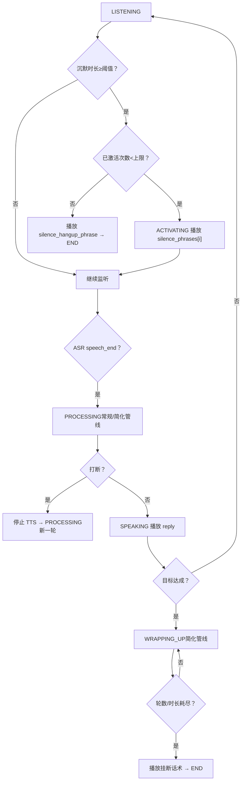
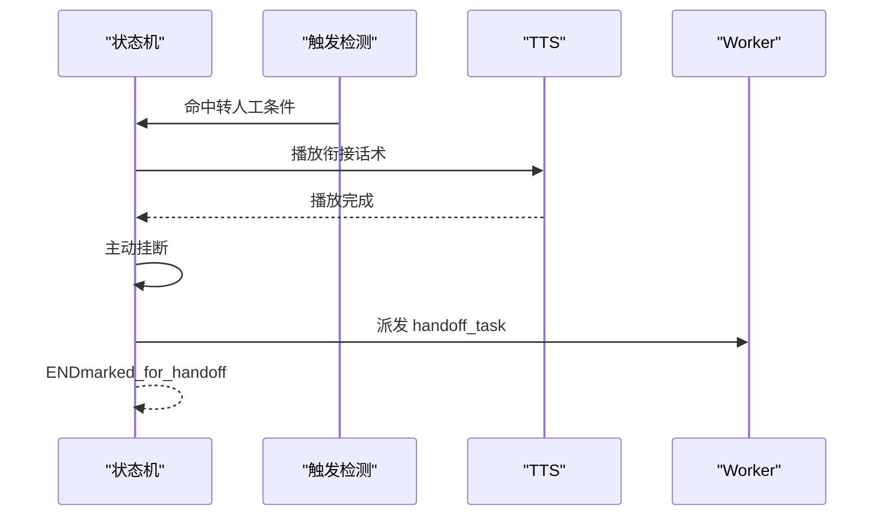
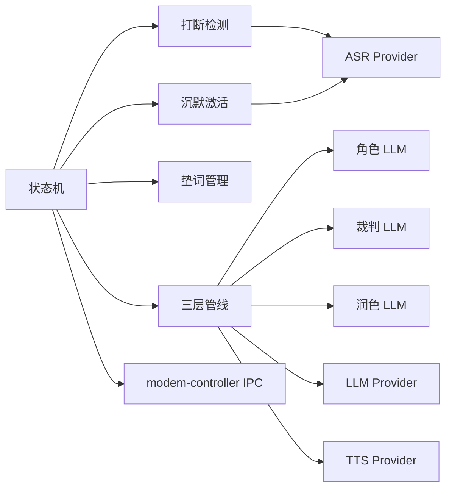

# AI 智能系统

<cite>
**本文引用的文件**
- [README.md](file://README.md)
- [DESIGN.md](file://DESIGN.md)
- [IMPLEMENTATION_PLAN.md](file://IMPLEMENTATION_PLAN.md)
- [ai-pipeline 规范](file://openspec/specs/ai-pipeline/spec.md)
- [call-state-machine 规范](file://openspec/specs/call-state-machine/spec.md)
- [role-prompt 规范](file://openspec/specs/role-prompt/spec.md)
- [interruption-detection 规范](file://openspec/specs/interruption-detection/spec.md)
- [silence-activation 规范](file://openspec/specs/silence-activation/spec.md)
- [filler 规范](file://openspec/specs/filler/spec.md)
- [goal-achievement 规范](file://openspec/specs/goal-achievement/spec.md)
- [human-handoff 规范](file://openspec/specs/human-handoff/spec.md)
- [transcript 规范](file://openspec/specs/transcript/spec.md)
</cite>

## 目录
1. [简介](#简介)
2. [项目结构](#项目结构)
3. [核心组件](#核心组件)
4. [架构总览](#架构总览)
5. [详细组件分析](#详细组件分析)
6. [依赖分析](#依赖分析)
7. [性能考虑](#性能考虑)
8. [故障排查指南](#故障排查指南)
9. [结论](#结论)
10. [附录](#附录)

## 简介
本文件面向 iSales AI 智能系统，围绕“AI 三层管线架构”“通话状态机”“角色提示词系统”“实时处理模块（打断检测/沉默激活/垫词管理/目标达成检测）”等主题，提供从设计理念、实现原理到使用模式的系统化技术文档。读者可据此完成系统集成、配置与扩展。

## 项目结构
- 仓库采用多仓协作与 OpenSpec 规范化管理，核心实现集中在 isales-engine（实时通话引擎），配合 isales-api、isales-scheduler、isales-worker、isales-telephony 等服务协同工作。
- 顶层 README 概述了各子仓职责与部署方式；DESIGN.md 提供能力索引与 OpenSpec 规范入口；IMPLEMENTATION_PLAN.md 给出阶段性实施顺序与验收要点。

章节来源
- [README.md:1-86](file://README.md#L1-L86)
- [DESIGN.md:1-75](file://DESIGN.md#L1-L75)
- [IMPLEMENTATION_PLAN.md:1-389](file://IMPLEMENTATION_PLAN.md#L1-L389)

## 核心组件
- AI 三层管线：N 角色 LLM 并行 PK → N×M 裁判 LLM 并行审查 → 1 润色 LLM 选优拟人化。管线贯穿每轮对话，除开场白与 WRAPPING_UP 简化管线外，均严格落地。
- 通话状态机：统一事件驱动的状态转换，覆盖 INIT/GREETING/LISTENING/SPEAKING/INTERRUPTED/FILLER/PROCESSING/WRAPPING_UP/ACTIVATING/TRANSFERRING/END 等状态及其合法转移。
- 角色提示词系统：Campaign 完全自定义 prompt，三段式组装（system + 单条 user），强制 JSON Mode，支持 WRAPPING_UP 收尾追加段落与跟进上下文增强。
- 实时处理模块：打断检测（白名单+时长双条件）、沉默激活（阈值+上限挂断）、垫词管理（多 set 轮询、集内随机不重复、预生成音频）、目标达成检测（实时 JSON 标记，WRAPPING_UP 收尾）。

章节来源
- [ai-pipeline 规范:1-166](file://openspec/specs/ai-pipeline/spec.md#L1-L166)
- [call-state-machine 规范:1-190](file://openspec/specs/call-state-machine/spec.md#L1-L190)
- [role-prompt 规范:1-238](file://openspec/specs/role-prompt/spec.md#L1-L238)
- [interruption-detection 规范:1-94](file://openspec/specs/interruption-detection/spec.md#L1-L94)
- [silence-activation 规范:1-99](file://openspec/specs/silence-activation/spec.md#L1-L99)
- [filler 规范:1-132](file://openspec/specs/filler/spec.md#L1-L132)
- [goal-achievement 规范:1-126](file://openspec/specs/goal-achievement/spec.md#L1-L126)

## 架构总览
下图展示引擎内部模块与关键数据流：状态机驱动实时行为（打断/沉默/垫词/目标达成/转人工），AI 三层管线在 PROCESSING 阶段运行，WRAPPING_UP 时简化为单角色+润色，transcript 与 pipeline_trace 分离存储。

图表来源
- [call-state-machine 规范:46-190](file://openspec/specs/call-state-machine/spec.md#L46-L190)
- [ai-pipeline 规范:7-166](file://openspec/specs/ai-pipeline/spec.md#L7-L166)
- [role-prompt 规范:21-238](file://openspec/specs/role-prompt/spec.md#L21-L238)
- [transcript 规范:7-127](file://openspec/specs/transcript/spec.md#L7-L127)

## 详细组件分析

### AI 三层管线编排与降级路径
- 设计理念：并行候选生成、并行审查、选优拟人化，覆盖全流程延迟；WRAPPING_UP 简化为单角色+润色。
- 关键流程：
  - 角色 LLM 并行生成候选（强制 JSON Mode）。
  - 裁判 LLM 对每个候选仅审查 reply 字段，任一否决即淘汰。
  - 润色 LLM 从通过裁判的候选中选优，仅改写 reply，标记字段继承。
  - 兜底/降级：全部裁判否决→默认回复；全部角色解析失败→默认回复；润色失败→取首个通过裁判的候选；异常路径仍写 pipeline_trace。
- 数据落库：每轮 PROCESSING 完成后写入 pipeline_trace，异常/兜底/降级均保留 trace 且标注 error。

图表来源
- [ai-pipeline 规范:20-166](file://openspec/specs/ai-pipeline/spec.md#L20-L166)

章节来源
- [ai-pipeline 规范:1-166](file://openspec/specs/ai-pipeline/spec.md#L1-L166)

### 通话状态机与状态转换规则
- 状态集合：INIT/GREETING/LISTENING/SPEAKING/INTERRUPTED/FILLER/PROCESSING/WRAPPING_UP/ACTIVATING/TRANSFERRING/END。
- 转换规则：
  - 拨号成功→GREETING；开场白→LISTENING。
  - LISTENING→PROCESSING（speech_end 且未达激活上限）；PROCESSING→SPEAKING（播放 reply）。
  - SPEAKING 期间被打断→INTERRUPTED→PROCESSING；WRAPPING_UP→END。
  - 沉默激活：LISTENING→ACTIVATING（多次后→END）。
  - 转人工：任一触发→TRANSFERRING→END（v1 不实时桥接）。
  - 长时间无进展→END（no_progress_timeout）。
- 非法转移：抛出异常并写 state_error 事件，必要时强制进入 END。

图表来源
- [call-state-machine 规范:46-190](file://openspec/specs/call-state-machine/spec.md#L46-L190)

章节来源
- [call-state-machine 规范:1-190](file://openspec/specs/call-state-machine/spec.md#L1-L190)

### 角色提示词系统（Prompt Engine）
- Prompt 三段式：system message（角色身份+目标+JSON 输出 schema；WRAPPING_UP 追加收尾指令）+ 单条 user message（上次通话纪要/线索信息/对话历史）。
- 跟进通话：scheduler 注入 last_call_summary，engine 拼入 user message 的「上次通话纪要」段。
- JSON Mode 强制：优先原生 JSON Mode；不支持时在 system prompt 末尾贴 schema 并后处理。
- 版本管理：prompt_version 记录历史，通话开始时 snapshot 写入 call_record.prompt_versions，便于回放复现。

图表来源
- [role-prompt 规范:21-238](file://openspec/specs/role-prompt/spec.md#L21-L238)
- [ai-pipeline 规范:85-166](file://openspec/specs/ai-pipeline/spec.md#L85-L166)

章节来源
- [role-prompt 规范:1-238](file://openspec/specs/role-prompt/spec.md#L1-L238)

### 实时处理模块：打断检测、沉默激活、垫词管理、目标达成检测
- 打断检测（SPEAKING 期间）：
  - 双条件：白名单短语命中或时长≥阈值。
  - 不可撤销：一旦打断，立即停止 TTS 并进入 PROCESSING。
  - 连续打断保护：超过上限触发 short_reply 或 listen_only。
- 沉默激活（LISTENING）：
  - 超过阈值且未达上限：ACTIVATING 播放 silence_phrases[i]。
  - 达上限：播放 silence_hangup_phrase 后 END（silence_max_reached）。
  - 与转人工优先级：转人工优先。
- 垫词管理（PROCESSING 期间）：
  - 与管线并行启动，TTS 准备好后等垫词播完再接 reply。
  - 垫词期间被打断：停止垫词、丢弃当前 PROCESSING、新一轮处理。
  - 多 filler_set 轮询、集内随机不重复、预生成音频。
- 目标达成检测（实时 JSON 标记）：
  - 角色 LLM 输出包含 goal_achieved/goal_type/extracted。
  - 润色不合并标记字段，直接继承候选标记。
  - 达成后进入 WRAPPING_UP，双计数器（轮数/时长）耗尽后主动挂断。

图表来源
- [interruption-detection 规范:7-94](file://openspec/specs/interruption-detection/spec.md#L7-L94)
- [silence-activation 规范:7-99](file://openspec/specs/silence-activation/spec.md#L7-L99)
- [filler 规范:7-132](file://openspec/specs/filler/spec.md#L7-L132)
- [goal-achievement 规范:7-126](file://openspec/specs/goal-achievement/spec.md#L7-L126)

章节来源
- [interruption-detection 规范:1-94](file://openspec/specs/interruption-detection/spec.md#L1-L94)
- [silence-activation 规范:1-99](file://openspec/specs/silence-activation/spec.md#L1-L99)
- [filler 规范:1-132](file://openspec/specs/filler/spec.md#L1-L132)
- [goal-achievement 规范:1-126](file://openspec/specs/goal-achievement/spec.md#L1-L126)

### 转人工（v1：标记+通知）
- 4 种触发机制（可独立启用）：关键词、意图分类、轮次阈值、独立 LLM 判定。
- v1 不做实时桥接：播放衔接话术→主动挂断→派发 handoff_task→坐席回拨。
- TRANSFERRING 期间不调用 AI 管线，结束后直接 END。

图表来源
- [human-handoff 规范:21-128](file://openspec/specs/human-handoff/spec.md#L21-L128)

章节来源
- [human-handoff 规范:1-128](file://openspec/specs/human-handoff/spec.md#L1-L128)

## 依赖分析
- 模块耦合：
  - 状态机是核心协调者，实时模块（打断/沉默/垫词/转人工/收尾）通过事件驱动与状态机交互。
  - 三层管线与状态机强耦合：PROCESSING/WRAPPING_UP/SPEAKING 等状态严格约束管线行为。
  - Prompt Engine 与 Provider ABC 解耦：通过统一接口与 JSON Mode 约束，便于替换不同供应商。
- 外部依赖：
  - ASR Provider：需提供流式中间结果与 VAD 事件。
  - TTS Provider：首包即可开始下行 PCM 推送。
  - 硬件层：modem-controller 通过 IPC 暴露 dial/hangup/audio，engine 仅消费事件与音频流。

图表来源
- [call-state-machine 规范:146-190](file://openspec/specs/call-state-machine/spec.md#L146-L190)
- [ai-pipeline 规范:131-166](file://openspec/specs/ai-pipeline/spec.md#L131-L166)
- [interruption-detection 规范:54-67](file://openspec/specs/interruption-detection/spec.md#L54-L67)

章节来源
- [IMPLEMENTATION_PLAN.md:226-261](file://IMPLEMENTATION_PLAN.md#L226-L261)

## 性能考虑
- 延迟控制：
  - 垫词与 PROCESSING 并行启动，覆盖管线与 TTS 延迟，避免“快响应”破坏对话节拍。
  - 管线并行（N 路角色+N×M 路裁判）提升吞吐，需注意并发与令牌限制。
- 资源与稳定性：
  - 全局并发计数器与 TTL 策略，engine 启动时清理孤儿计数。
  - pipeline_trace 写入失败指数退避重试，不影响主路径。
- 优化建议：
  - ASR/TTS/LLM 供应商选择与地域就近部署，减少网络抖动。
  - 对长上下文通话，监控 token 用量并设置告警阈值。
  - 垫词音频预生成，避免运行时实时合成带来的抖动。

章节来源
- [IMPLEMENTATION_PLAN.md:365-389](file://IMPLEMENTATION_PLAN.md#L365-L389)
- [role-prompt 规范:43-56](file://openspec/specs/role-prompt/spec.md#L43-L56)
- [ai-pipeline 规范:60-64](file://openspec/specs/ai-pipeline/spec.md#L60-L64)

## 故障排查指南
- 状态机非法转移：
  - 现象：抛出 IllegalTransition 并写 state_error。
  - 处理：检查事件来源与合法性集合，必要时强制进入 END。
- 打断误判/漏判：
  - 调整白名单与打断时长阈值；确认 ASR Provider 支持中间结果与 VAD。
- 沉默激活频繁：
  - 降低沉默阈值或减少激活上限；检查用户习惯与话术设计。
- 垫词播放异常：
  - 检查预生成状态与音频下载；允许无声延迟兜底。
- 目标达成误判：
  - 强化角色 prompt 的判定标准；WRAPPING_UP 期间避免退回主管线。
- 转人工触发：
  - 核对关键词/意图阈值/轮次阈值/独立 LLM 配置；确认衔接话术播放完成后再挂断。

章节来源
- [call-state-machine 规范:33-45](file://openspec/specs/call-state-machine/spec.md#L33-L45)
- [interruption-detection 规范:26-34](file://openspec/specs/interruption-detection/spec.md#L26-L34)
- [silence-activation 规范:68-81](file://openspec/specs/silence-activation/spec.md#L68-L81)
- [filler 规范:92-110](file://openspec/specs/filler/spec.md#L92-L110)
- [goal-achievement 规范:77-95](file://openspec/specs/goal-achievement/spec.md#L77-L95)
- [human-handoff 规范:45-68](file://openspec/specs/human-handoff/spec.md#L45-L68)

## 结论
iSales AI 智能系统以“状态机+三层管线”为核心，结合实时打断/沉默/垫词/目标达成/转人工等模块，形成高鲁棒、低延迟、可扩展的外呼自动化方案。通过 OpenSpec 规范化与版本化管理，系统具备良好的演进能力与可维护性。建议在生产环境中重点关注并发控制、令牌监控、垫词预生成与 prompt 版本治理。

## 附录

### 配置参数速查（按模块）
- 打断检测（Campaign 级）
  - interruption_whitelist: 白名单短语数组
  - interruption_min_duration_ms: 时长阈值（ms）
  - max_continuous_interruptions: 连续打断上限
  - continuous_interruption_strategy: short_reply/listen_only
- 沉默激活（Campaign 级）
  - silence_threshold_ms: 沉默阈值（ms）
  - max_silence_activations: 激活上限
  - silence_phrases: 激活话术数组
  - silence_hangup_phrase: 上限告别话术
- 垫词（Campaign 级）
  - 多 filler_set 轮询；集内随机不重复；预生成音频
- 目标达成（Campaign 级）
  - wrap_up_max_rounds: 收尾轮数上限
  - wrap_up_max_seconds: 收尾时长上限
  - wrap_up_closing_phrases: 收尾挂断话术池
- 转人工（Campaign 级）
  - transfer_keyword_enabled/keywords
  - transfer_intent_enabled/threshold
  - transfer_round_enabled/threshold
  - transfer_llm_enabled/prompt_version_id
  - transfer_phrases

章节来源
- [interruption-detection 规范:82-94](file://openspec/specs/interruption-detection/spec.md#L82-L94)
- [silence-activation 规范:82-99](file://openspec/specs/silence-activation/spec.md#L82-L99)
- [filler 规范:111-132](file://openspec/specs/filler/spec.md#L111-L132)
- [goal-achievement 规范:110-122](file://openspec/specs/goal-achievement/spec.md#L110-L122)
- [human-handoff 规范:111-128](file://openspec/specs/human-handoff/spec.md#L111-L128)

### 数据模型与存储
- transcript：事件流（JSONB 数组），包含 g/r/u 等事件类型。
- pipeline_trace：每轮三层管线候选/裁判/润色详情，按 call_record_id+turn_id 主键。
- 录音：OSS 路径，call_record.recording_url 引用。

章节来源
- [transcript 规范:7-127](file://openspec/specs/transcript/spec.md#L7-L127)