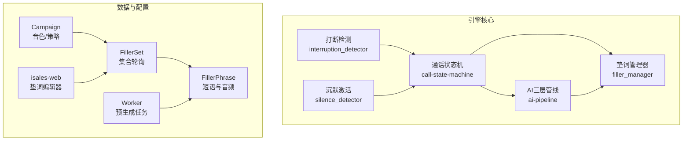
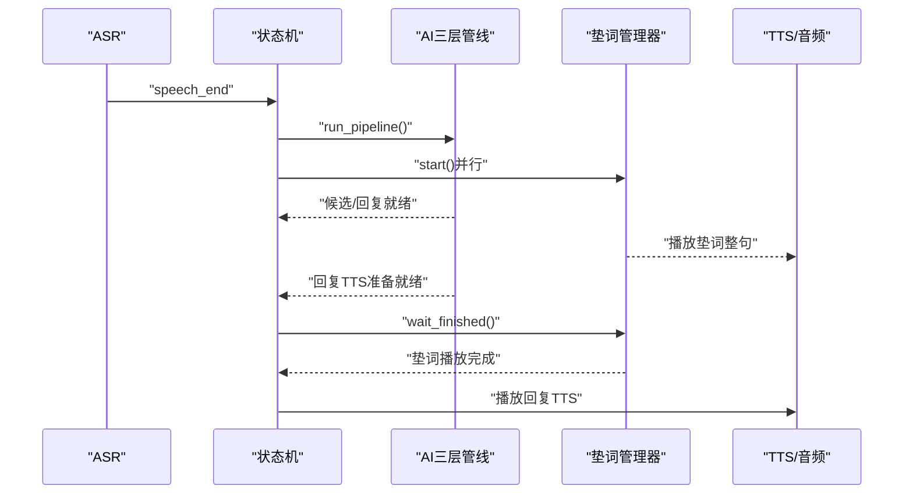
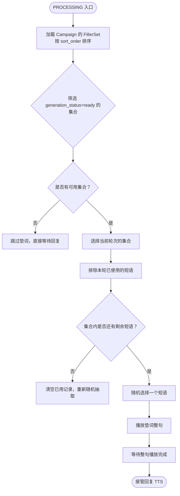
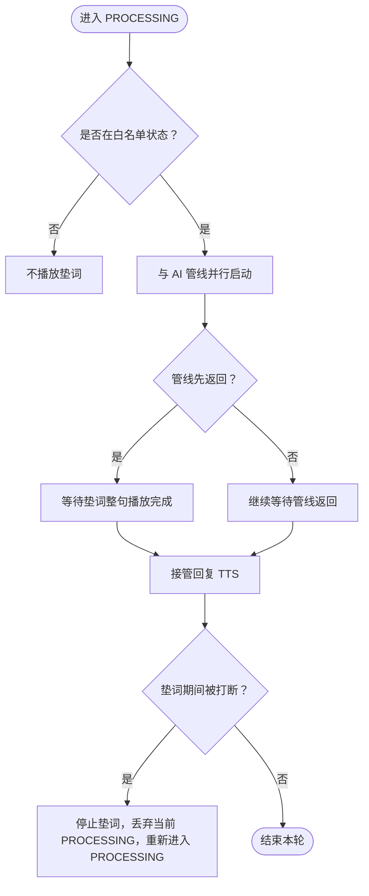
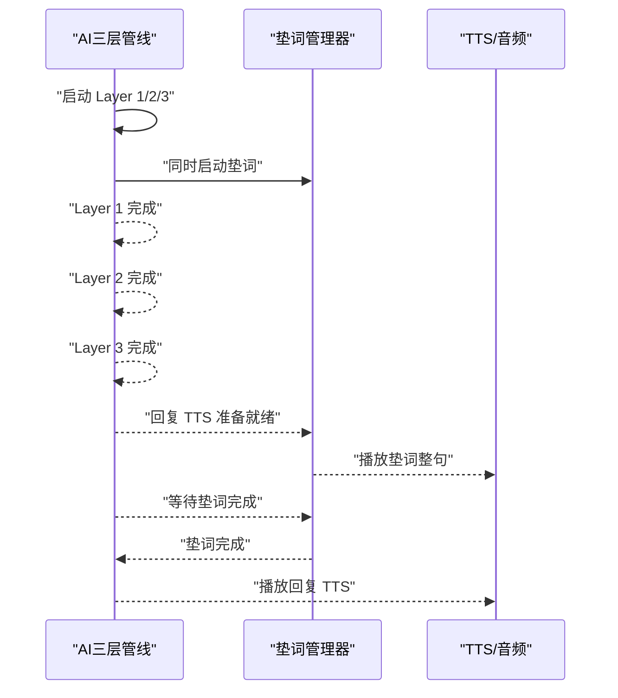
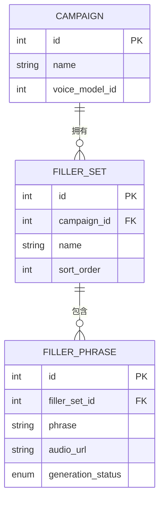
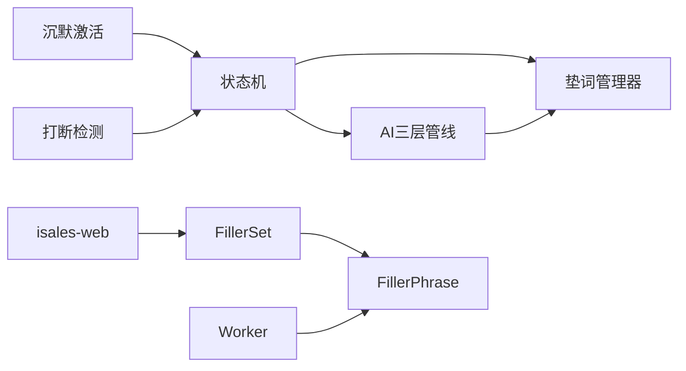

# 垫词管理系统

<cite>
**本文引用的文件**
- [垫词规范](file://openspec/specs/filler/spec.md)
- [AI三层管线规范](file://openspec/specs/ai-pipeline/spec.md)
- [通话状态机规范](file://openspec/specs/call-state-machine/spec.md)
- [通话事件流规范](file://openspec/specs/transcript/spec.md)
- [引擎实现提案](file://openspec/changes/archive/2026-05-07-impl-engine/proposal.md)
- [引擎设计说明](file://openspec/changes/archive/2026-05-07-impl-engine/design.md)
- [引擎任务清单](file://openspec/changes/archive/2026-05-07-impl-engine/tasks.md)
- [垫词编辑器变更](file://openspec/changes/archive/2026-05-23-web-admin-campaign-workflow/acceptance.md)
- [开场白固定模板变更](file://openspec/changes/campaign-fixed-greeting/design.md)
- [引擎环境变量示例](file://deploy/env/engine.env.example)
- [通话响应延迟分析](file://通话响应延迟分析.md)
- [通话响应延迟分析报告](file://通话响应延迟分析报告.md)
</cite>

## 目录
1. [简介](#简介)
2. [项目结构](#项目结构)
3. [核心组件](#核心组件)
4. [架构总览](#架构总览)
5. [详细组件分析](#详细组件分析)
6. [依赖关系分析](#依赖关系分析)
7. [性能考量](#性能考量)
8. [故障排查指南](#故障排查指南)
9. [结论](#结论)
10. [附录](#附录)

## 简介
本文件为垫词管理系统的技术文档，围绕垫词的选择策略、播放时机控制机制、与AI三层管线的协同工作方式展开，涵盖垫词库管理、智能选择算法、用户体验优化设计、失败兜底策略、质量评估与效果监控方法，并提供配置选项说明、内容模板与实际应用案例，帮助开发者进行定制化开发与性能调优。

## 项目结构
垫词系统位于 isales-engine 的实时行为模块中，与状态机、AI三层管线、打断检测、沉默激活等模块协同工作。关键文件与职责如下：
- 垫词规范：定义触发场景、启动时机、选择策略、音频来源、失败兜底与数据模型
- 通话状态机：定义状态转换与垫词状态（FILLER）的并行性
- AI三层管线：定义三层并行编排与垫词同时启动的要求
- 通话事件流：定义垫词事件写入 transcript 的规范
- 引擎实现提案/设计说明/任务清单：给出模块实现要点与测试覆盖
- 垫词编辑器变更：定义前端垫词配置界面与后端接口
- 环境变量：定义引擎运行参数
- 延迟分析：指出当前实现中的潜在性能问题与优化方向

**图表来源**
- [通话状态机规范:1-190](file://openspec/specs/call-state-machine/spec.md#L1-L190)
- [AI三层管线规范:1-166](file://openspec/specs/ai-pipeline/spec.md#L1-L166)
- [垫词规范:1-132](file://openspec/specs/filler/spec.md#L1-L132)
- [引擎实现提案:40-82](file://openspec/changes/archive/2026-05-07-impl-engine/proposal.md#L40-L82)
- [垫词编辑器变更:78-134](file://openspec/changes/archive/2026-05-23-web-admin-campaign-workflow/acceptance.md#L78-L134)

**章节来源**
- [通话状态机规范:1-190](file://openspec/specs/call-state-machine/spec.md#L1-L190)
- [AI三层管线规范:1-166](file://openspec/specs/ai-pipeline/spec.md#L1-L166)
- [垫词规范:1-132](file://openspec/specs/filler/spec.md#L1-L132)
- [引擎实现提案:40-82](file://openspec/changes/archive/2026-05-07-impl-engine/proposal.md#L40-L82)
- [垫词编辑器变更:78-134](file://openspec/changes/archive/2026-05-23-web-admin-campaign-workflow/acceptance.md#L78-L134)

## 核心组件
- 垫词管理器（FillerManager）：负责在 PROCESSING 入口与 AI 管线并行启动，按集合轮询与集内去重策略选择短语，播放完成后等待整句播完再接管回复 TTS
- 状态机（CallStateMachine）：定义状态转换，明确 FILLER 与 PROCESSING 并行，以及垫词期间被打断的处理
- AI三层管线（Orchestrator）：定义三层并行编排，要求与垫词同时启动，覆盖整个管线延迟
- 打断检测（InterruptionDetector）：在垫词期间触发打断时立即停止垫词并丢弃当前 PROCESSING
- 沉默激活（SilenceDetector）：与垫词互斥，沉默激活期间不播放垫词
- 数据模型：Campaign → FillerSet → FillerPhrase，支持预生成音频与状态跟踪

**章节来源**
- [引擎实现提案:40-82](file://openspec/changes/archive/2026-05-07-impl-engine/proposal.md#L40-L82)
- [引擎设计说明:119-142](file://openspec/changes/archive/2026-05-07-impl-engine/design.md#L119-L142)
- [引擎任务清单:69-87](file://openspec/changes/archive/2026-05-07-impl-engine/tasks.md#L69-L87)
- [通话状态机规范:119-131](file://openspec/specs/call-state-machine/spec.md#L119-L131)
- [AI三层管线规范:7-18](file://openspec/specs/ai-pipeline/spec.md#L7-L18)

## 架构总览
垫词系统与AI三层管线的协同遵循“同时启动、整句播放、等待接管”的原则。状态机在 PROCESSING 入口触发垫词管理器，AI三层管线并行启动；当管线先返回时，等待垫词整句播放后再接管回复 TTS。垫词期间被打断则立即停止垫词并重新进入 PROCESSING。

**图表来源**
- [通话状态机规范:65-73](file://openspec/specs/call-state-machine/spec.md#L65-L73)
- [AI三层管线规范:9-11](file://openspec/specs/ai-pipeline/spec.md#L9-L11)
- [引擎设计说明:138-142](file://openspec/changes/archive/2026-05-07-impl-engine/design.md#L138-L142)

## 详细组件分析

### 垫词库管理与选择策略
- 多集合轮询：Campaign 关联多个 FillerSet，按 sort_order 升序循环；每通电话从最小 sort_order 的集合起步
- 集内随机不重复：在同一通电话的 call_session 内存态维护已用短语集合，同一轮不重复使用；集内全部用过后清空记录
- 预生成音频：垫词音频在拨打前由 worker 使用 Campaign 配置的音色 TTS 预生成并存储到 OSS，运行时不得实时调用 TTS
- 失败兜底：预生成未完成、下载失败、全部集合不可用时跳过垫词，允许“无声延迟”

**图表来源**
- [垫词规范:50-77](file://openspec/specs/filler/spec.md#L50-L77)
- [垫词规范:78-91](file://openspec/specs/filler/spec.md#L78-L91)

**章节来源**
- [垫词规范:50-91](file://openspec/specs/filler/spec.md#L50-L91)

### 播放时机控制机制
- 触发场景白名单：仅在常规对话 PROCESSING 状态播放；GREETING 后首轮、WRAPPING_UP、TRANSFERRING、ACTIVATING、收尾告别期间不播
- 启动时机与衔接：与 AI 管线同时启动；管线先返回时等待垫词播完再接回复 TTS
- 快响应场景：即使管线 < 500ms 返回，仍需播完整段垫词以保持节奏一致
- 打断处理：垫词播放中被打断时立即停止垫词、丢弃当前 PROCESSING，把用户输入作为新一轮处理

**图表来源**
- [通话状态机规范:65-73](file://openspec/specs/call-state-machine/spec.md#L65-L73)
- [通话状态机规范:119-131](file://openspec/specs/call-state-machine/spec.md#L119-L131)
- [垫词规范:31-49](file://openspec/specs/filler/spec.md#L31-L49)

**章节来源**
- [通话状态机规范:65-131](file://openspec/specs/call-state-machine/spec.md#L65-L131)
- [垫词规范:31-49](file://openspec/specs/filler/spec.md#L31-L49)

### 与AI三层管线的协同工作机制
- 同时启动：Layer 1 与垫词必须同时启动，覆盖整个管线延迟
- 管线优先：当管线先返回时，等待垫词整句播放完成后再接管回复 TTS
- 简化管线：WRAPPING_UP 期间走简化管线（单角色 + 润色），不启用 PK/裁判/垫词

**图表来源**
- [AI三层管线规范:9-11](file://openspec/specs/ai-pipeline/spec.md#L9-L11)
- [引擎设计说明:138-142](file://openspec/changes/archive/2026-05-07-impl-engine/design.md#L138-L142)

**章节来源**
- [AI三层管线规范:9-11](file://openspec/specs/ai-pipeline/spec.md#L9-L11)
- [引擎设计说明:138-142](file://openspec/changes/archive/2026-05-07-impl-engine/design.md#L138-L142)

### 用户体验优化设计
- 节奏一致性：即使管线快速返回，仍播放完整垫词，避免因偶发快响应破坏对话节拍
- 无缝衔接：垫词整句播放完成后立即接管回复 TTS，减少感知延迟
- 交互鲁棒性：打断检测在垫词期间同样生效，确保用户输入得到及时响应

**章节来源**
- [垫词规范:40-44](file://openspec/specs/filler/spec.md#L40-L44)
- [通话状态机规范:119-131](file://openspec/specs/call-state-machine/spec.md#L119-L131)

### 失败兜底与数据模型
- 失败兜底：预生成未完成、下载失败、全部集合不可用时跳过垫词，允许“无声延迟”
- 数据模型：Campaign → FillerSet → FillerPhrase，支持 generation_status 与 audio_url 状态跟踪

**图表来源**
- [垫词规范:111-131](file://openspec/specs/filler/spec.md#L111-L131)

**章节来源**
- [垫词规范:92-110](file://openspec/specs/filler/spec.md#L92-L110)
- [垫词规范:111-131](file://openspec/specs/filler/spec.md#L111-L131)

### 预生成与内容模板
- 预生成：用户在 isales-web 新增或编辑 FillerPhrase 时，后台任务 regenerate_filler_audio 入队，完成后写入 audio_url 并置 generation_status=ready
- 音色级联：Campaign 切换 voice_model 时，所属全部 FillerPhrase 重新触发预生成
- 模板与变量：开场白支持固定模板（Campaign.greeting），不走三层管线；垫词内容模板为纯文本短语，不引入场景标签

**章节来源**
- [垫词规范:82-91](file://openspec/specs/filler/spec.md#L82-L91)
- [开场白固定模板变更:1-29](file://openspec/changes/campaign-fixed-greeting/design.md#L1-L29)

## 依赖关系分析
垫词系统与以下模块存在直接依赖：
- 状态机：触发与并行控制
- AI三层管线：同时启动与等待接管
- 打断检测：打断时的停止与重置
- 沉默激活：互斥关系与优先级
- 数据层：垫词库、集合、短语与音频状态
- 前端：垫词编辑器与 Campaign 配置
- Worker：预生成任务

**图表来源**
- [通话状态机规范:1-190](file://openspec/specs/call-state-machine/spec.md#L1-L190)
- [AI三层管线规范:1-166](file://openspec/specs/ai-pipeline/spec.md#L1-L166)
- [垫词规范:1-132](file://openspec/specs/filler/spec.md#L1-L132)
- [引擎实现提案:40-82](file://openspec/changes/archive/2026-05-07-impl-engine/proposal.md#L40-L82)

**章节来源**
- [通话状态机规范:1-190](file://openspec/specs/call-state-machine/spec.md#L1-L190)
- [AI三层管线规范:1-166](file://openspec/specs/ai-pipeline/spec.md#L1-L166)
- [垫词规范:1-132](file://openspec/specs/filler/spec.md#L1-L132)
- [引擎实现提案:40-82](file://openspec/changes/archive/2026-05-07-impl-engine/proposal.md#L40-L82)

## 性能考量
- 当前问题：垫词被转人工评估的串行 LLM 调用前置阻塞，导致垫词启动被延迟
- 强制阻塞：wait_finished 强制等待垫词整句播放完成，可能将回复卡住
- 播放特性：垫词播放为整段一次性推送，无抢占机制
- 建议优化：
  - 将 filler.start() 提前至 evaluate_transfer 之前，实现垫词与转人工判断并行
  - 将转人工的意图识别与独立 LLM 判断迁移到管线内部或与管线并行
  - 采用更细粒度的播放控制或抢占机制，避免 wait_finished 强制阻塞
  - 优化垫词时长估算，使其更贴合真实 TTS 节奏

**章节来源**
- [通话响应延迟分析:30-58](file://通话响应延迟分析.md#L30-L58)
- [通话响应延迟分析报告:84-104](file://通话响应延迟分析报告.md#L84-L104)

## 故障排查指南
- 垫词未播放
  - 检查是否处于 PROCESSING 白名单状态
  - 检查 FillerSet generation_status 是否为 ready
  - 检查 audio_url 是否可用
- 打断后异常
  - 确认打断检测逻辑是否正确触发
  - 检查垫词停止与 PROCESSING 重置流程
- 音频质量问题
  - 检查预生成任务是否完成
  - 检查 OSS 下载是否成功
  - 检查音色配置是否正确

**章节来源**
- [垫词规范:92-110](file://openspec/specs/filler/spec.md#L92-L110)
- [通话状态机规范:119-131](file://openspec/specs/call-state-machine/spec.md#L119-L131)

## 结论
垫词管理系统通过严格的触发白名单、多集合轮询与集内去重策略、预生成音频与失败兜底机制，实现了在 AI 管线延迟期间的稳定覆盖。与状态机和 AI 三层管线的协同确保了播放时机的一致性与用户体验的流畅性。针对当前实现中的串行阻塞与强制等待问题，建议优先将垫词启动前置并与转人工判断并行，同时优化播放控制与时长估算，以进一步降低用户感知延迟。

## 附录

### 配置选项说明
- 引擎环境变量（示例）
  - ISALES_ENGINE_LLM_PROVIDER：LLM 提供商（默认 mock）
  - ISALES_ENGINE_ASR_PROVIDER：ASR 提供商（默认 mock）
  - ISALES_ENGINE_TTS_PROVIDER：TTS 提供商（默认 mock）
  - ISALES_ENGINE_TELEPHONY_MODE：电话模式（默认 mock）
  - ISALES_ENGINE_PIPELINE_DEFAULT_TIMEOUT_MS：管线默认超时（毫秒）
  - ISALES_ENGINE_MAX_NO_PROGRESS_SECONDS：最长无进展秒数
  - ISALES_ENGINE_MOCK_CONNECT_DELAY_MS：模拟拨号连接延迟（毫秒）
  - ISALES_ENGINE_GRACEFUL_SHUTDOWN_TIMEOUT_S：优雅停机超时（秒）

**章节来源**
- [引擎环境变量示例:1-21](file://deploy/env/engine.env.example#L1-L21)

### 垫词内容模板与最佳实践
- 模板类型：纯文本短语，不引入场景标签
- 音色一致性：垫词音频使用 Campaign 配置的音色 TTS 预生成
- 时长控制：建议控制在 1.5~2 秒以内，避免被 wait_finished 强制阻塞
- 多集合策略：按业务场景拆分集合，提升多样性与避免重复

**章节来源**
- [垫词规范:78-91](file://openspec/specs/filler/spec.md#L78-L91)
- [通话响应延迟分析报告:88-104](file://通话响应延迟分析报告.md#L88-L104)

### 实际应用案例
- 场景一：开场白后首轮 PROCESSING 不播垫词，避免重复覆盖
- 场景二：WRAPPING_UP 期间简化管线，不启用垫词
- 场景三：转人工/沉默激活/收尾告别期间不播垫词
- 场景四：垫词期间被打断，立即停止并重新进入 PROCESSING

**章节来源**
- [垫词规范:16-29](file://openspec/specs/filler/spec.md#L16-L29)
- [通话状态机规范:128-131](file://openspec/specs/call-state-machine/spec.md#L128-L131)

### 质量评估与效果监控
- 事件记录：垫词播放写入 transcript 的 filler 事件，包含 text、filler_phrase_id、duration_ms
- 监控指标：First-TTS、ASR partial latency、LLM first-token latency 等
- 建议指标：垫词命中率、平均垫词时长、打断后重试率、用户感知延迟分布

**章节来源**
- [通话事件流规范:43-51](file://openspec/specs/transcript/spec.md#L43-L51)
- [通话响应延迟分析报告:84-104](file://通话响应延迟分析报告.md#L84-L104)