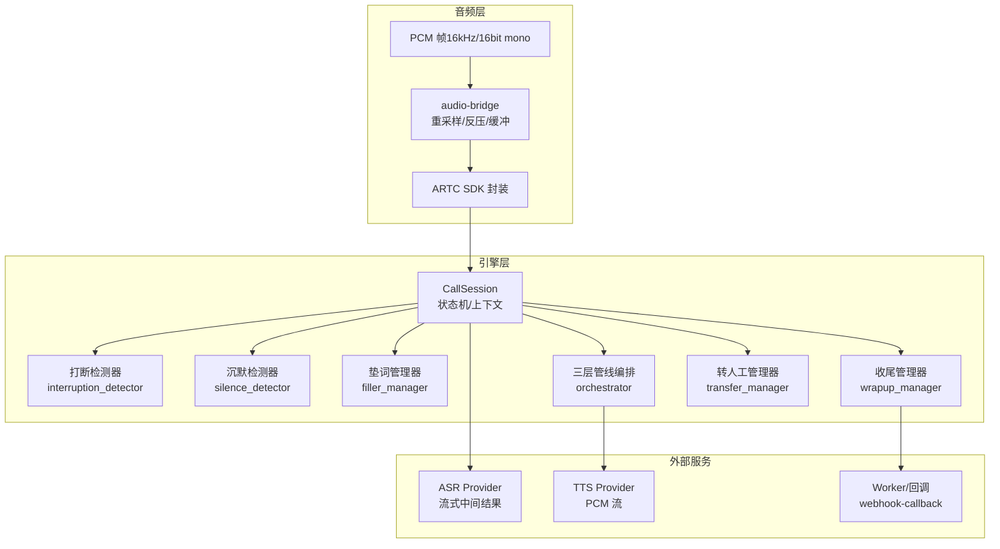
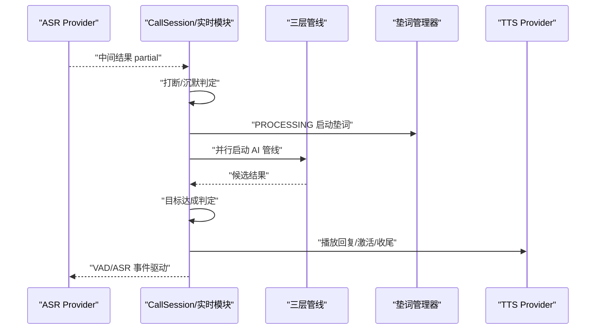
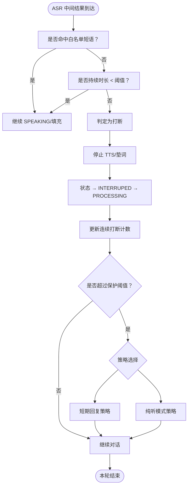
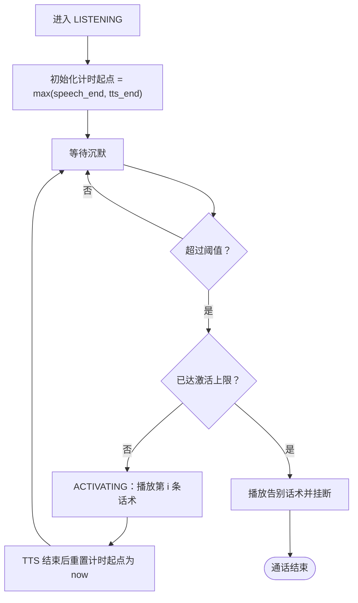
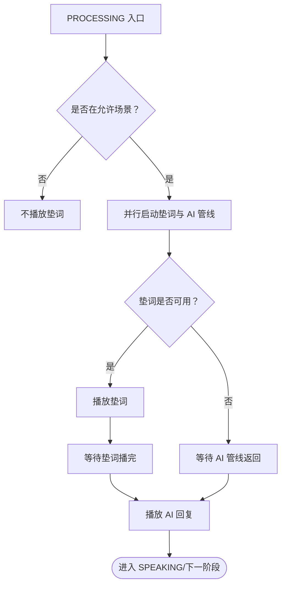
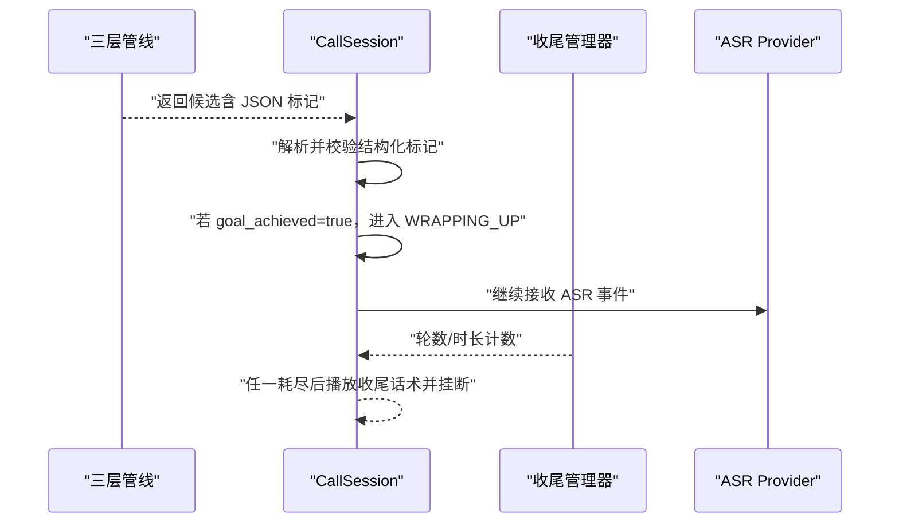
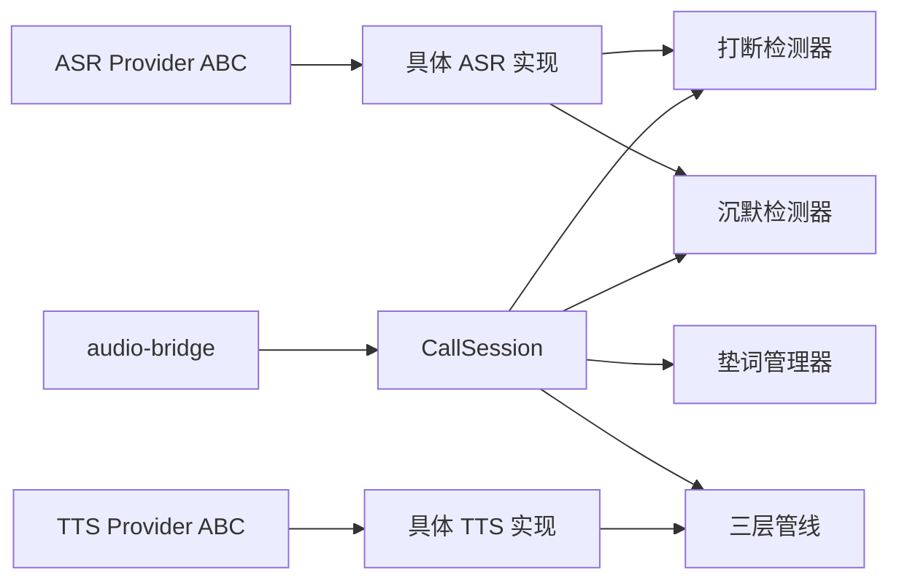

# 实时处理模块

<cite>
**本文引用的文件**
- [打断检测规范](file://openspec/specs/interruption-detection/spec.md)
- [沉默激活规范](file://openspec/specs/silence-activation/spec.md)
- [垫词管理规范](file://openspec/specs/filler/spec.md)
- [目标达成检测规范](file://openspec/specs/goal-achievement/spec.md)
- [引擎设计变更（v1 实施）](file://openspec/changes/archive/2026-05-07-impl-engine/design.md)
- [引擎提案（v1 实施）](file://openspec/changes/archive/2026-05-07-impl-engine/proposal.md)
- [设备硬件与音频桥接](file://openspec/changes/arch-cloud-edge-split/specs/device-hardware/spec.md)
- [ASR Provider 抽象](file://openspec/changes/archive/2026-05-01-init-isales-common/specs/provider-abc/spec.md)
- [转人工与收尾管理](file://openspec/specs/human-handoff/spec.md)
- [通话状态机](file://openspec/specs/call-state-machine/spec.md)
- [Web 管理后台变更（垫词配置）](file://openspec/changes/archive/2026-05-23-web-admin-campaign-workflow/acceptance.md)
</cite>

## 目录
1. [简介](#简介)
2. [项目结构](#项目结构)
3. [核心组件](#核心组件)
4. [架构总览](#架构总览)
5. [详细组件分析](#详细组件分析)
6. [依赖分析](#依赖分析)
7. [性能考虑](#性能考虑)
8. [故障排查指南](#故障排查指南)
9. [结论](#结论)
10. [附录](#附录)

## 简介
本技术文档聚焦实时处理模块，围绕打断检测、沉默激活、垫词管理与目标达成检测四大能力域，系统阐述其设计原理、实现细节、配置参数、性能指标与调试技巧，并提供面向开发者的集成与调优建议。文档基于仓库内的规范与设计变更文件，结合状态机与实时音频链路，给出可落地的工程实践指导。

## 项目结构
实时处理模块位于 isales-engine 仓库中，围绕 CallSession 会话与状态机驱动，配合实时音频桥接与 ASR Provider 抽象，形成“音频采集 → ASR 流式中间结果 → 打断/沉默检测 → 垫词播放 → AI 管线 → TTS 合成 → 音频输出”的闭环。

图示来源
- [设备硬件与音频桥接:167-205](file://openspec/changes/arch-cloud-edge-split/specs/device-hardware/spec.md#L167-L205)
- [引擎设计变更（v1 实施）:144-154](file://openspec/changes/archive/2026-05-07-impl-engine/design.md#L144-L154)
- [引擎提案（v1 实施）:40-82](file://openspec/changes/archive/2026-05-07-impl-engine/proposal.md#L40-L82)

章节来源
- [设备硬件与音频桥接:167-205](file://openspec/changes/arch-cloud-edge-split/specs/device-hardware/spec.md#L167-L205)
- [引擎设计变更（v1 实施）:144-154](file://openspec/changes/archive/2026-05-07-impl-engine/design.md#L144-L154)
- [引擎提案（v1 实施）:40-82](file://openspec/changes/archive/2026-05-07-impl-engine/proposal.md#L40-L82)

## 核心组件
- 打断检测器：基于 ASR 中间结果与 VAD 时间戳，采用“白名单短语命中 OR 时长 < 阈值”双条件，满足即不打断；任一条件不满足即不可撤销地立即停止 TTS/垫词并进入处理态。
- 沉默检测器：LISTENING 状态下以“max(用户最后一次 speech_end, AI 上一轮 TTS 播完时刻)”为起点计时，超过阈值触发 ACTIVATING，按激活次数顺序播放话术；达到上限后主动挂断。
- 垫词管理器：在常规 PROCESSING 场景与 AI 管线并行启动，确保稳定节拍；多集合轮询、集内随机不重复；失败场景跳过垫词，允许短暂无声延迟。
- 目标达成检测：角色 LLM 在每轮 JSON 输出中携带结构化标记，引擎实时读取并在达成后进入 WRAPPING_UP 状态，随后按轮数与时长双计数器主动挂断。

章节来源
- [打断检测规范:7-52](file://openspec/specs/interruption-detection/spec.md#L7-L52)
- [沉默激活规范:7-81](file://openspec/specs/silence-activation/spec.md#L7-L81)
- [垫词管理规范:7-110](file://openspec/specs/filler/spec.md#L7-L110)
- [目标达成检测规范:7-62](file://openspec/specs/goal-achievement/spec.md#L7-L62)

## 架构总览
实时处理模块与状态机紧密耦合，状态转换由 CallSession 驱动，实时行为模块在关键节点插入检测与播放逻辑，确保低延迟与一致性。

图示来源
- [引擎设计变更（v1 实施）:144-154](file://openspec/changes/archive/2026-05-07-impl-engine/design.md#L144-L154)
- [引擎提案（v1 实施）:40-82](file://openspec/changes/archive/2026-05-07-impl-engine/proposal.md#L40-L82)

## 详细组件分析

### 打断检测机制
- 判定算法
  - 双条件：白名单短语完全匹配 OR 持续时长 < 阈值 → 不打断
  - 任一条件不满足即立即停止 TTS/垫词，状态进入 INTERRUPED → PROCESSING，使用 ASR 终态文本作为本轮输入
- 不可撤销策略：一旦进入 INTERRUPED，即使后续中间结果命中白名单也不回退
- 连续打断保护：连续 INTERRUPED → SPEAKING 循环超过阈值时触发保护策略（short_reply 或 listen_only），完整轮次后计数器清零
- 与状态交互：FILLER/WRAIPPING_UP 下判定逻辑一致；FILLER 期间被打断需停止垫词并丢弃当前 PROCESSING

图示来源
- [打断检测规范:7-52](file://openspec/specs/interruption-detection/spec.md#L7-L52)
- [引擎设计变更（v1 实施）:144-148](file://openspec/changes/archive/2026-05-07-impl-engine/design.md#L144-L148)

章节来源
- [打断检测规范:7-52](file://openspec/specs/interruption-detection/spec.md#L7-L52)
- [引擎设计变更（v1 实施）:144-148](file://openspec/changes/archive/2026-05-07-impl-engine/design.md#L144-L148)

### 沉默激活功能
- 沉默检测与计时起点：max(用户最后一次 speech_end, AI 上一轮 TTS 播完时刻)
- 激活触发：超过阈值且未达激活上限 → 进入 ACTIVATING，按激活次数顺序播放话术；否则播放告别话术并挂断
- 重新计时：每次激活 TTS 播完后以 TTS 结束时刻为新起点，不累加原始沉默时长
- 话术策略：按数组下标顺序使用；不足时复用最后一条；超量截取前 N 条
- 上下文隔离：激活话术写入 full_transcript，但不进入角色 LLM 的 dialog_history
- 优先级：转人工触发优先于沉默激活；与“无进展超时”机制边界清晰

图示来源
- [沉默激活规范:7-81](file://openspec/specs/silence-activation/spec.md#L7-L81)
- [引擎设计变更（v1 实施）:150-154](file://openspec/changes/archive/2026-05-07-impl-engine/design.md#L150-L154)

章节来源
- [沉默激活规范:7-81](file://openspec/specs/silence-activation/spec.md#L7-L81)
- [引擎设计变更（v1 实施）:150-154](file://openspec/changes/archive/2026-05-07-impl-engine/design.md#L150-L154)

### 垫词管理系统
- 触发场景白名单：仅常规 PROCESSING；GREETING 后首轮、WRAPPING_UP、ACTIVATING、TRANSFERRING、收尾告别期间不播
- 启动时机与衔接：与 AI 管线并行启动；管线先返回时等垫词播完再接 reply；快响应场景仍播完整段垫词
- 多集合轮询：按 sort_order 升序循环；集内随机不重复，用尽后清空记录
- 预生成与失败兜底：垫词音频预先生成并存储；预生成未完成、下载失败或全部不可用时跳过垫词，允许短暂无声延迟
- 事件记录：写入 transcript 的 filler 事件（含 phrase_id/duration_ms）

图示来源
- [垫词管理规范:7-110](file://openspec/specs/filler/spec.md#L7-L110)
- [引擎提案（v1 实施）:40-46](file://openspec/changes/archive/2026-05-07-impl-engine/proposal.md#L40-L46)

章节来源
- [垫词管理规范:7-110](file://openspec/specs/filler/spec.md#L7-L110)
- [引擎提案（v1 实施）:40-46](file://openspec/changes/archive/2026-05-07-impl-engine/proposal.md#L40-L46)

### 目标达成检测
- 实时判定：角色 LLM 每轮输出 JSON，包含结构化标记；引擎实时读取，通话结束后不再重复判定
- 三层管线处理：裁判仅审查 reply 字段；润色仅改写 reply，标记字段直接继承候选
- 进入收尾：润色返回 goal_achieved=true 后，先播放当前轮回复，再进入 WRAPPING_UP
- 收尾双计数器：轮数或时长任一耗尽即主动挂断；期间用户提出新问题/反悔/主动挂断/转人工按规范处理

图示来源
- [目标达成检测规范:7-62](file://openspec/specs/goal-achievement/spec.md#L7-L62)
- [引擎提案（v1 实施）:72-76](file://openspec/changes/archive/2026-05-07-impl-engine/proposal.md#L72-L76)

章节来源
- [目标达成检测规范:7-62](file://openspec/specs/goal-achievement/spec.md#L7-L62)
- [引擎提案（v1 实施）:72-76](file://openspec/changes/archive/2026-05-07-impl-engine/proposal.md#L72-L76)

## 依赖分析
- ASR Provider 抽象：实时模块依赖 isales-common 的 Provider ABC，要求提供流式中间结果与 VAD 事件
- 状态机与事件：CallSession 统一驱动状态转换，实时模块在关键事件点插入逻辑
- 音频桥接：audio-bridge 负责重采样、反压与缓冲，保障媒体面稳定性
- 转人工与收尾：与实时模块并行存在，遵循明确优先级与边界

图示来源
- [ASR Provider 抽象:17-30](file://openspec/changes/archive/2026-05-01-init-isales-common/specs/provider-abc/spec.md#L17-L30)
- [设备硬件与音频桥接:167-205](file://openspec/changes/arch-cloud-edge-split/specs/device-hardware/spec.md#L167-L205)
- [引擎设计变更（v1 实施）:144-154](file://openspec/changes/archive/2026-05-07-impl-engine/design.md#L144-L154)

章节来源
- [ASR Provider 抽象:17-30](file://openspec/changes/archive/2026-05-01-init-isales-common/specs/provider-abc/spec.md#L17-L30)
- [设备硬件与音频桥接:167-205](file://openspec/changes/arch-cloud-edge-split/specs/device-hardware/spec.md#L167-L205)
- [引擎设计变更（v1 实施）:144-154](file://openspec/changes/archive/2026-05-07-impl-engine/design.md#L144-L154)

## 性能考虑
- 延迟控制
  - ASR 中间结果驱动打断判定，避免轮询带来的额外延迟
  - 垫词与管线并行启动，快响应场景仍播完整垫词，维持稳定节拍
- 媒体面稳定性
  - audio-bridge 采用固定大小环形缓冲，避免自适应算法引入的延迟波动
  - 反压超过阈值上报告警并触发挂断，防止断续音频影响体验
- 资源与并发
  - 状态机与实时模块均采用异步任务与取消传播，降低阻塞风险
  - 并发计数器在会话生命周期内严格维护，避免泄漏

章节来源
- [设备硬件与音频桥接:183-192](file://openspec/changes/arch-cloud-edge-split/specs/device-hardware/spec.md#L183-L192)
- [引擎设计变更（v1 实施）:144-154](file://openspec/changes/archive/2026-05-07-impl-engine/design.md#L144-L154)

## 故障排查指南
- 打断误判/漏判
  - 检查白名单短语是否完全匹配；确认最小持续时长阈值设置合理
  - 若出现连续打断循环，检查保护阈值与策略配置
- 沉默激活不触发或过早触发
  - 确认计时起点是否为 max(speech_end, tts_end)
  - 校验激活上限与话术数组长度关系
- 垫词播放异常
  - 检查预生成状态与音频 URL 是否可用
  - 观察垫词期间是否被打断导致提前终止
- 目标达成判定不生效
  - 确认角色 LLM 输出严格遵循 JSON 结构化标记
  - 核对收尾双计数器配置与 WRAPPING_UP 管线启用情况
- 转人工与沉默激活优先级
  - 确保转人工触发条件优先级高于沉默激活

章节来源
- [打断检测规范:7-52](file://openspec/specs/interruption-detection/spec.md#L7-L52)
- [沉默激活规范:68-81](file://openspec/specs/silence-activation/spec.md#L68-L81)
- [垫词管理规范:92-110](file://openspec/specs/filler/spec.md#L92-L110)
- [目标达成检测规范:77-100](file://openspec/specs/goal-achievement/spec.md#L77-L100)

## 结论
实时处理模块通过打断检测、沉默激活、垫词管理与目标达成检测四大机制，在保证低延迟与稳定性的前提下，提升了通话的自然性与效率。依托状态机与 Provider 抽象，模块具备良好的扩展性与可维护性。建议在实际部署中结合业务场景对阈值与策略进行精细化调优，并持续监控媒体面与并发指标以保障稳定性。

## 附录

### 配置参数一览（按模块）
- 打断检测
  - interruption_whitelist：白名单短语数组，默认包含常见语气词
  - interruption_min_duration_ms：时长阈值（毫秒），默认 800
  - max_continuous_interruptions：连续打断保护阈值，默认 3
  - continuous_interruption_strategy：保护策略，short_reply 或 listen_only
- 沉默激活
  - silence_threshold_ms：沉默触发阈值（毫秒），默认 5000
  - max_silence_activations：单通电话激活上限，默认 2
  - silence_phrases：激活话术库，按顺序使用
  - silence_hangup_phrase：达到上限后的告别话术
- 垫词管理
  - filler_set.sort_order：集合轮询顺序
  - filler_phrase.generation_status：预生成状态（pending/ready/failed）
  - filler_phrase.audio_url：OSS 音频地址
- 目标达成
  - wrap_up_max_rounds：收尾轮数上限，默认 2
  - wrap_up_max_seconds：收尾时长上限（秒），默认 15
  - wrap_up_closing_phrases：收尾挂断话术池

章节来源
- [打断检测规范:82-94](file://openspec/specs/interruption-detection/spec.md#L82-L94)
- [沉默激活规范:82-92](file://openspec/specs/silence-activation/spec.md#L82-L92)
- [垫词管理规范:111-132](file://openspec/specs/filler/spec.md#L111-L132)
- [目标达成检测规范:110-122](file://openspec/specs/goal-achievement/spec.md#L110-L122)

### 集成与调优建议
- 集成步骤
  - 配置 ASR Provider：确保提供流式中间结果与 VAD 事件
  - 配置 Campaign 参数：按业务场景设置打断、沉默与垫词相关阈值
  - 部署垫词音频：通过后台任务触发预生成，确保 generation_status=ready
  - 监控媒体面：关注 audio_buffer_stalled 告警与反压时长
- 调优要点
  - 打断检测：先提升白名单覆盖率，再微调时长阈值
  - 沉默激活：根据用户习惯调整阈值与话术数量，避免频繁激活
  - 垫词管理：保持垫词时长与管线响应时间匹配，减少无声延迟
  - 目标达成：在角色 prompt 中明确判定标准，减少误报

章节来源
- [设备硬件与音频桥接:178-192](file://openspec/changes/arch-cloud-edge-split/specs/device-hardware/spec.md#L178-L192)
- [引擎提案（v1 实施）:77-82](file://openspec/changes/archive/2026-05-07-impl-engine/proposal.md#L77-L82)
- [Web 管理后台变更（垫词配置）:101-152](file://openspec/changes/archive/2026-05-23-web-admin-campaign-workflow/acceptance.md#L101-L152)