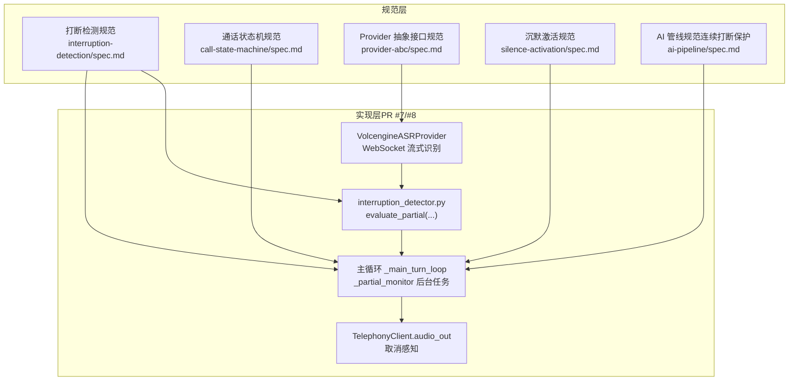
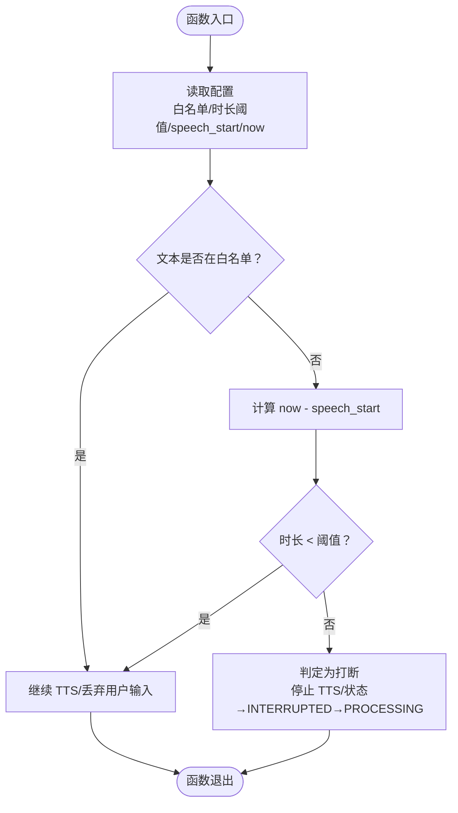
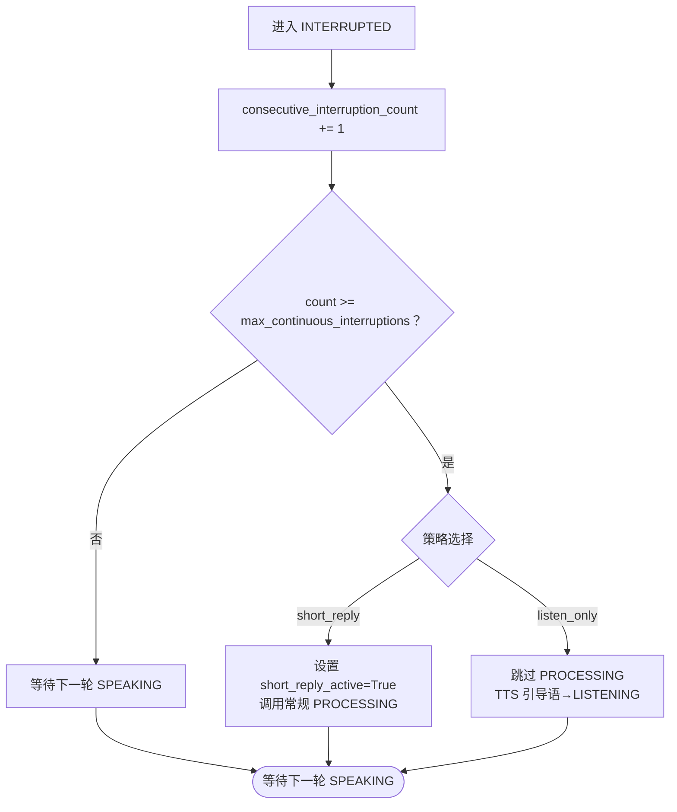
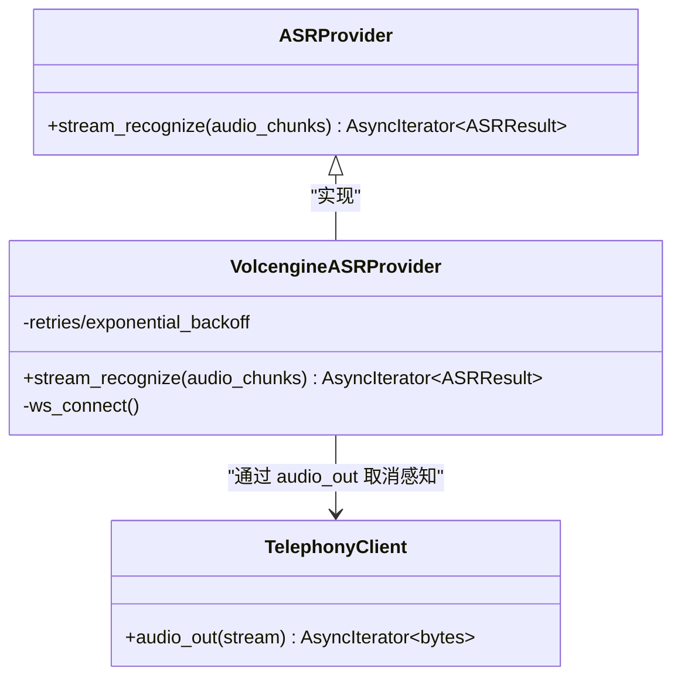
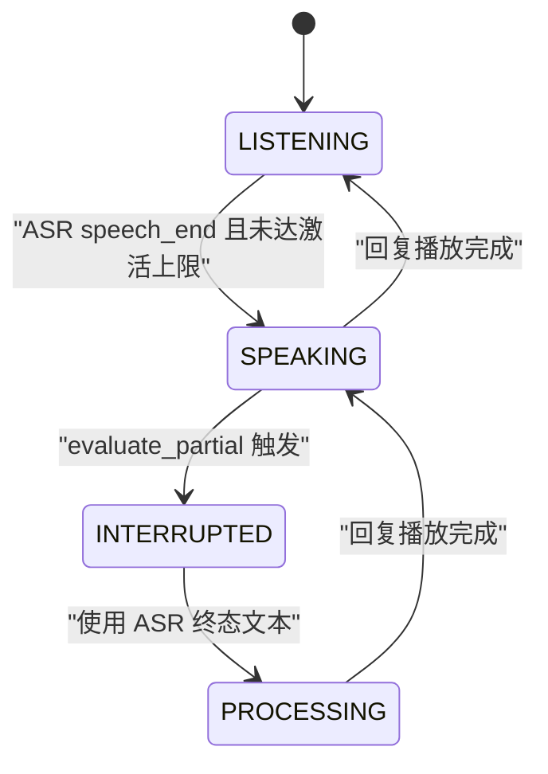
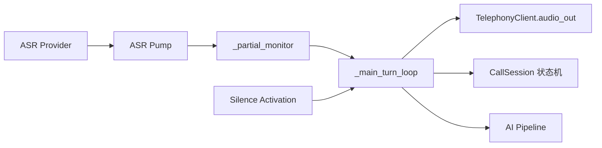

# 打断检测机制

<cite>
**本文引用的文件**
- [打断检测规范](file://openspec/specs/interruption-detection/spec.md)
- [通话状态机规范](file://openspec/specs/call-state-machine/spec.md)
- [Provider 抽象接口规范](file://openspec/specs/provider-abc/spec.md)
- [沉默激活规范](file://openspec/specs/silence-activation/spec.md)
- [引擎实现设计（PR #7）](file://openspec/changes/archive/2026-05-07-impl-engine/design.md)
- [引擎实现设计（PR #8）](file://openspec/changes/archive/2026-05-08-impl-engine-providers/design.md)
- [AI 管线规范（连续打断保护）](file://openspec/changes/archive/2026-05-08-impl-engine-providers/specs/ai-pipeline/spec.md)
- [云部署状态说明（默认 ASR Provider）](file://deploy/cloud/STATE.md)
</cite>

## 目录
1. [引言](#引言)
2. [项目结构](#项目结构)
3. [核心组件](#核心组件)
4. [架构总览](#架构总览)
5. [详细组件分析](#详细组件分析)
6. [依赖分析](#依赖分析)
7. [性能考虑](#性能考虑)
8. [故障排查指南](#故障排查指南)
9. [结论](#结论)
10. [附录](#附录)

## 引言
本技术文档围绕“打断检测机制”展开，系统阐述在 SPEAKING 状态下如何基于双条件判定用户说话是否构成“打断”，并给出不可撤销策略、连续打断保护、ASR Provider 抽象接口与 VAD 事件处理要求。文档还包含配置参数说明、状态转换流程图、实际应用场景示例，以及面向开发者的集成指南、性能优化建议与常见问题解决方案。

## 项目结构
打断检测机制属于 isales-engine 的实时行为模块之一，与状态机、ASR Provider、TTS Provider 等共同组成引擎核心。相关规范与实现要点分布如下：
- 打断检测算法与策略：位于 openspec/specs/interruption-detection/spec.md
- 通话状态机与状态转换：位于 openspec/specs/call-state-machine/spec.md
- Provider 抽象接口（ASR/TTS/LLM）：位于 openspec/specs/provider-abc/spec.md
- 沉默激活与 VAD 计时起点：位于 openspec/specs/silence-activation/spec.md
- 引擎实现设计（PR #7/#8）：位于 openspec/changes/archive/2026-05-07-impl-engine/design.md 与 openspec/changes/archive/2026-05-08-impl-engine-providers/design.md
- 连续打断保护与策略落地：位于 openspec/changes/archive/2026-05-08-impl-engine-providers/specs/ai-pipeline/spec.md
- 默认 ASR Provider（火山引擎）：位于 deploy/cloud/STATE.md



**图表来源**
- [打断检测规范](file://openspec/specs/interruption-detection/spec.md)
- [通话状态机规范](file://openspec/specs/call-state-machine/spec.md)
- [Provider 抽象接口规范](file://openspec/specs/provider-abc/spec.md)
- [沉默激活规范](file://openspec/specs/silence-activation/spec.md)
- [引擎实现设计（PR #7）](file://openspec/changes/archive/2026-05-07-impl-engine/design.md)
- [引擎实现设计（PR #8）](file://openspec/changes/archive/2026-05-08-impl-engine-providers/design.md)
- [AI 管线规范（连续打断保护）](file://openspec/changes/archive/2026-05-08-impl-engine-providers/specs/ai-pipeline/spec.md)

**章节来源**
- [打断检测规范](file://openspec/specs/interruption-detection/spec.md)
- [通话状态机规范](file://openspec/specs/call-state-machine/spec.md)
- [Provider 抽象接口规范](file://openspec/specs/provider-abc/spec.md)
- [沉默激活规范](file://openspec/specs/silence-activation/spec.md)
- [引擎实现设计（PR #7）](file://openspec/changes/archive/2026-05-07-impl-engine/design.md)
- [引擎实现设计（PR #8）](file://openspec/changes/archive/2026-05-08-impl-engine-providers/design.md)
- [AI 管线规范（连续打断保护）](file://openspec/changes/archive/2026-05-08-impl-engine-providers/specs/ai-pipeline/spec.md)
- [云部署状态说明（默认 ASR Provider）](file://deploy/cloud/STATE.md)

## 核心组件
- 打断检测器（interruption_detector）
  - 功能：在 SPEAKING/FILLER 状态订阅 ASR 中间结果（partial），对每次 partial 调用 evaluate_partial(text, speech_started_ts_ms, now_ts_ms, config)，执行双条件判定与不可撤销策略。
  - 输入：ASR partial 文本、speech_start 时间戳、当前时间戳、配置（白名单短语、时长阈值）。
  - 输出：verdict（触发/不触发）、状态转换（SPEAKING → INTERRUPTED → PROCESSING）。
- 主循环与后台监控
  - 功能：在主循环中启动 _partial_monitor 后台任务，消费 ASR pump 的 partial 队列；在 SPEAKING 启动时记录 speech_started_ts_ms；监听到触发后取消当前 TTS 任务，状态切换至 INTERRUPTED → PROCESSING。
- ASR Provider 抽象接口
  - 功能：定义 ASRProvider.stream_recognize(audio_chunks) → AsyncIterator[ASRResult]，要求持续推送中间结果（is_final=false），并提供带时间戳的 VAD 事件（speech_start/speech_end）。
  - 默认实现：火山引擎（豆包）实时语音识别，WebSocket per-call 连接。
- TelephonyClient.audio_out 取消感知
  - 功能：在 CancelledError 时立即停止推送音频块，确保打断触发后 TTS 能被干净取消。
- 连续打断保护
  - 功能：在 _main_turn_loop 维护 consecutive_interruption_count；超过阈值时根据策略（short_reply/listen_only）调整后续 PROCESSING 行为。

**章节来源**
- [引擎实现设计（PR #7）](file://openspec/changes/archive/2026-05-07-impl-engine/design.md)
- [引擎实现设计（PR #8）](file://openspec/changes/archive/2026-05-08-impl-engine-providers/design.md)
- [Provider 抽象接口规范](file://openspec/specs/provider-abc/spec.md)
- [AI 管线规范（连续打断保护）](file://openspec/changes/archive/2026-05-08-impl-engine-providers/specs/ai-pipeline/spec.md)

## 架构总览
打断检测贯穿状态机与实时行为模块，形成“中间结果驱动 + 取消中断”的闭环：

```mermaid
sequenceDiagram
participant ASR as "ASR Provider"
participant Pump as "ASR Pump"
participant Monitor as "_partial_monitor"
participant Loop as "_main_turn_loop"
participant TTS as "TelephonyClient.audio_out"
participant FSM as "CallSession 状态机"
ASR->>Pump : "yield ASRResult(partial)"
Pump-->>Monitor : "partial 文本/时间戳"
Monitor->>Monitor : "evaluate_partial(text, speech_start, now, config)"
alt "任一条件满足：白名单命中 或 时长<阈值"
Monitor-->>Loop : "不触发打断"
else "两次条件均不满足"
Monitor-->>Loop : "verdict=triggered"
Loop->>TTS : "取消当前 TTS 任务"
TTS-->>Loop : "CancelledError 传播"
Loop->>FSM : "SPEAKING → INTERRUPTED → PROCESSING"
end
```

**图表来源**
- [引擎实现设计（PR #8）](file://openspec/changes/archive/2026-05-08-impl-engine-providers/design.md)
- [Provider 抽象接口规范](file://openspec/specs/provider-abc/spec.md)
- [通话状态机规范](file://openspec/specs/call-state-machine/spec.md)

## 详细组件分析

### 双条件打断判定算法
- 条件一：白名单短语命中
  - 当 ASR 中间结果文本完全等于 campaign.interruption_whitelist 中任一短语时，视为非打断，TTS 继续，用户输入丢弃。
- 条件二：时长阈值判断
  - 当从 speech_start 到当前时刻的间隔小于 campaign.interruption_min_duration_ms（默认 800ms）时，视为非打断，TTS 继续。
- 触发条件
  - 仅当“白名单未命中 且 持续时长≥阈值”时，才判定为打断，立即停止 TTS、状态转为 INTERRUPTED → PROCESSING，并使用 ASR 终态结果作为本轮用户输入。
- 不可撤销策略
  - 一旦进入 INTERRUPTED，即使后续 partial 命中白名单，也不回退到 SPEAKING；维持 INTERRUPTED 状态，确保状态机简洁、延迟低。



**图表来源**
- [打断检测规范](file://openspec/specs/interruption-detection/spec.md)

**章节来源**
- [打断检测规范](file://openspec/specs/interruption-detection/spec.md)

### 连续打断保护机制
- 计数器维护位置：在 _main_turn_loop 中维护 session.consecutive_interruption_count。
- 触发条件：连续循环（INTERRUPTED → PROCESSING → SPEAKING → INTERRUPTED）超过 campaign.max_continuous_interruptions（默认 3）。
- 策略类型：
  - short_reply：在调用常规三层管线前设置 PipelineConfig.short_reply_active=True，prompt_builder 在 system prompt 末尾追加“请用一句话回应”，使回复更短，降低再次被打断概率。
  - listen_only：跳过 PROCESSING，直接 TTS 播放引导语“您请说”后回到 LISTENING，本轮不写 pipeline_trace。
- 完整轮次清零：当 SPEAKING 完整播完且未被打断，计数器清零。



**图表来源**
- [引擎实现设计（PR #8）](file://openspec/changes/archive/2026-05-08-impl-engine-providers/design.md)
- [AI 管线规范（连续打断保护）](file://openspec/changes/archive/2026-05-08-impl-engine-providers/specs/ai-pipeline/spec.md)

**章节来源**
- [引擎实现设计（PR #8）](file://openspec/changes/archive/2026-05-08-impl-engine-providers/design.md)
- [AI 管线规范（连续打断保护）](file://openspec/changes/archive/2026-05-08-impl-engine-providers/specs/ai-pipeline/spec.md)

### ASR Provider 抽象接口与 VAD 事件处理
- ASR Provider 必须实现 isales-common.providers.asr 接口，提供：
  - 流式中间结果（partial）持续推送（is_final=false），以便打断检测即时判定；
  - speech_start / speech_end VAD 事件（带时间戳）。
- 默认 ASR Provider：火山引擎（豆包）实时语音识别，采用 per-call WebSocket 连接，实现内部将 WebSocket 接收循环转为 AsyncIterator yield。
- TelephonyClient.audio_out 必须在 CancelledError 时立即停止推送音频块，确保打断触发后 TTS 能被干净取消。



**图表来源**
- [Provider 抽象接口规范](file://openspec/specs/provider-abc/spec.md)
- [引擎实现设计（PR #8）](file://openspec/changes/archive/2026-05-08-impl-engine-providers/design.md)
- [云部署状态说明（默认 ASR Provider）](file://deploy/cloud/STATE.md)

**章节来源**
- [Provider 抽象接口规范](file://openspec/specs/provider-abc/spec.md)
- [引擎实现设计（PR #8）](file://openspec/changes/archive/2026-05-08-impl-engine-providers/design.md)
- [云部署状态说明（默认 ASR Provider）](file://deploy/cloud/STATE.md)

### 状态转换流程图（SPEAKING → INTERRUPTED → PROCESSING）


**图表来源**
- [通话状态机规范](file://openspec/specs/call-state-machine/spec.md)
- [引擎实现设计（PR #8）](file://openspec/changes/archive/2026-05-08-impl-engine-providers/design.md)

**章节来源**
- [通话状态机规范](file://openspec/specs/call-state-machine/spec.md)
- [引擎实现设计（PR #8）](file://openspec/changes/archive/2026-05-08-impl-engine-providers/design.md)

### 实际应用场景示例
- 场景一：用户在 SPEAKING 期间发出“嗯”“好的”等白名单短语
  - 结果：不打断，TTS 继续，用户输入丢弃。
- 场景二：用户说话时长不足阈值（如刚开口说“我”就停顿）
  - 结果：不打断，TTS 继续。
- 场景三：用户持续说话超过阈值且未命中白名单
  - 结果：立即停止 TTS，状态转为 INTERRUPTED → PROCESSING，使用 ASR 终态结果作为本轮输入。
- 场景四：连续多次被打断（超过阈值）
  - 结果：触发保护策略：
    - short_reply：提示用户用一句话回应，缩短回复；
    - listen_only：直接引导用户说话，进入纯听模式。

**章节来源**
- [打断检测规范](file://openspec/specs/interruption-detection/spec.md)
- [AI 管线规范（连续打断保护）](file://openspec/changes/archive/2026-05-08-impl-engine-providers/specs/ai-pipeline/spec.md)

## 依赖分析
- 组件耦合关系
  - interruption_detector 依赖 ASR pump 的 partial 通道与 session 的 speech_start 时间戳。
  - _main_turn_loop 依赖 interruption_detector 的 evaluate_partial 输出，负责取消 TTS 任务与状态转换。
  - TelephonyClient.audio_out 的取消感知是打断生效的关键。
  - Provider 抽象接口（ASR/TTS/LLM）统一了外部依赖，便于替换与测试。
- 外部依赖与集成点
  - 默认 ASR Provider 为火山引擎（豆包），通过 WebSocket 流式识别。
  - 与状态机、沉默激活、AI 管线等模块协同工作。



**图表来源**
- [引擎实现设计（PR #8）](file://openspec/changes/archive/2026-05-08-impl-engine-providers/design.md)
- [Provider 抽象接口规范](file://openspec/specs/provider-abc/spec.md)
- [沉默激活规范](file://openspec/specs/silence-activation/spec.md)

**章节来源**
- [引擎实现设计（PR #8）](file://openspec/changes/archive/2026-05-08-impl-engine-providers/design.md)
- [Provider 抽象接口规范](file://openspec/specs/provider-abc/spec.md)
- [沉默激活规范](file://openspec/specs/silence-activation/spec.md)

## 性能考虑
- 实时性
  - 采用后台 _partial_monitor 消费 ASR partial，避免状态机轮询带来的额外延迟。
  - 取消驱动（cancel）优于轮询，符合 asyncio 习惯，降低延迟。
- 取消传播
  - TelephonyClient.audio_out 在 CancelledError 时立即停止推送，确保打断生效迅速。
- 配置粒度
  - 所有阈值与策略均在 campaign 级配置，便于按业务场景快速调优。
- 默认 Provider
  - 火山引擎 WebSocket per-call 连接，延迟低、协议契合流式接口。

**章节来源**
- [引擎实现设计（PR #8）](file://openspec/changes/archive/2026-05-08-impl-engine-providers/design.md)
- [Provider 抽象接口规范](file://openspec/specs/provider-abc/spec.md)
- [云部署状态说明（默认 ASR Provider）](file://deploy/cloud/STATE.md)

## 故障排查指南
- 症状：打断判定过于敏感，频繁截断用户自然停顿
  - 排查：提高 interruption_min_duration_ms（默认 800ms）；检查白名单是否误命中。
- 症状：打断判定过于保守，用户“嗯嗯”等被吞没
  - 排查：确认白名单短语是否覆盖常用语气词；检查 ASR 是否正确推送中间结果（is_final=false）。
- 症状：打断后状态回退或重复打断
  - 排查：确认不可撤销策略是否生效；检查 _partial_monitor 是否在进入 INTERRUPTED 后继续触发。
- 症状：TTS 无法及时停止
  - 排查：确认 TelephonyClient.audio_out 实现是否在 CancelledError 时停止推送；检查取消传播链路。
- 症状：连续打断超过阈值后策略未生效
  - 排查：确认 consecutive_interruption_count 是否在 SPEAKING 完整完成后清零；检查策略配置（short_reply/listen_only）。

**章节来源**
- [打断检测规范](file://openspec/specs/interruption-detection/spec.md)
- [引擎实现设计（PR #8）](file://openspec/changes/archive/2026-05-08-impl-engine-providers/design.md)

## 结论
打断检测机制通过“白名单短语命中检测 + 时长阈值判断”的双条件与不可撤销策略，在 SPEAKING/FILLER 状态下实现了低延迟、稳定的打断判定。配合连续打断保护策略与 Provider 抽象接口，系统在保证用户体验的同时，具备良好的可扩展性与可维护性。默认火山引擎 ASR Provider 的集成进一步降低了部署与运维复杂度。

## 附录

### 配置参数说明（Campaign 级）
- interruption_whitelist：JSONB 数组，默认包含常用语气词，整段完全匹配。
- interruption_min_duration_ms：整数，默认 800ms，低于此值视为非打断。
- max_continuous_interruptions：整数，默认 3，超过此阈值触发保护策略。
- continuous_interruption_strategy：枚举，默认 short_reply，可选 listen_only。

**章节来源**
- [打断检测规范](file://openspec/specs/interruption-detection/spec.md)

### 集成指南（开发者）
- 实现 ASR Provider
  - 实现 ASRProvider.stream_recognize(audio_chunks) → AsyncIterator[ASRResult]，确保持续推送中间结果（is_final=false），并提供带时间戳的 VAD 事件（speech_start/speech_end）。
- 在主循环中启用打断检测
  - 启动 _partial_monitor 后台任务，从 ASR pump 的 partial 通道消费每个 partial，调用 evaluate_partial。
  - 在 SPEAKING 启动时记录 speech_started_ts_ms；监听到 verdict="triggered" 时取消当前 TTS 任务，状态切换至 INTERRUPTED → PROCESSING。
- 配置连续打断保护
  - 在 _main_turn_loop 维护 consecutive_interruption_count；超过阈值时根据策略调整 PROCESSING 行为。
- 默认 Provider 集成
  - 若未配置自定义 ASR Provider，默认使用火山引擎（豆包）实时语音识别，WebSocket per-call 连接。

**章节来源**
- [Provider 抽象接口规范](file://openspec/specs/provider-abc/spec.md)
- [引擎实现设计（PR #8）](file://openspec/changes/archive/2026-05-08-impl-engine-providers/design.md)
- [云部署状态说明（默认 ASR Provider）](file://deploy/cloud/STATE.md)