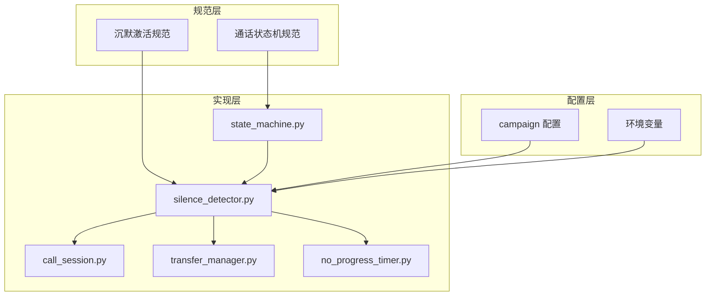
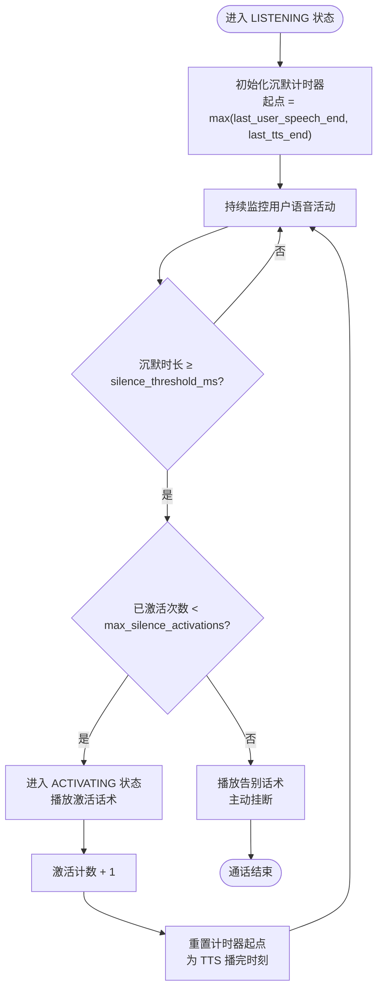
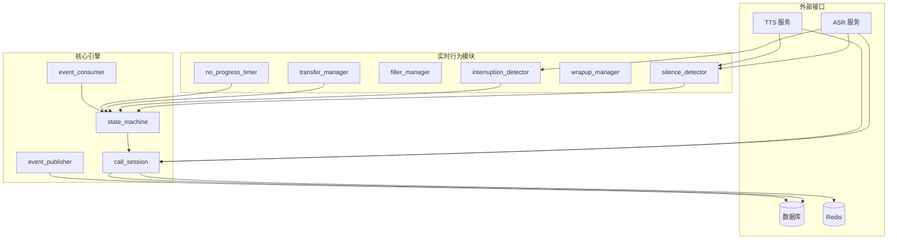
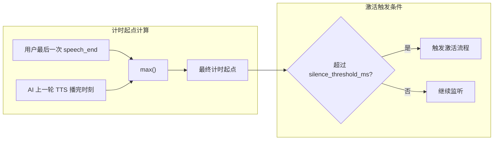
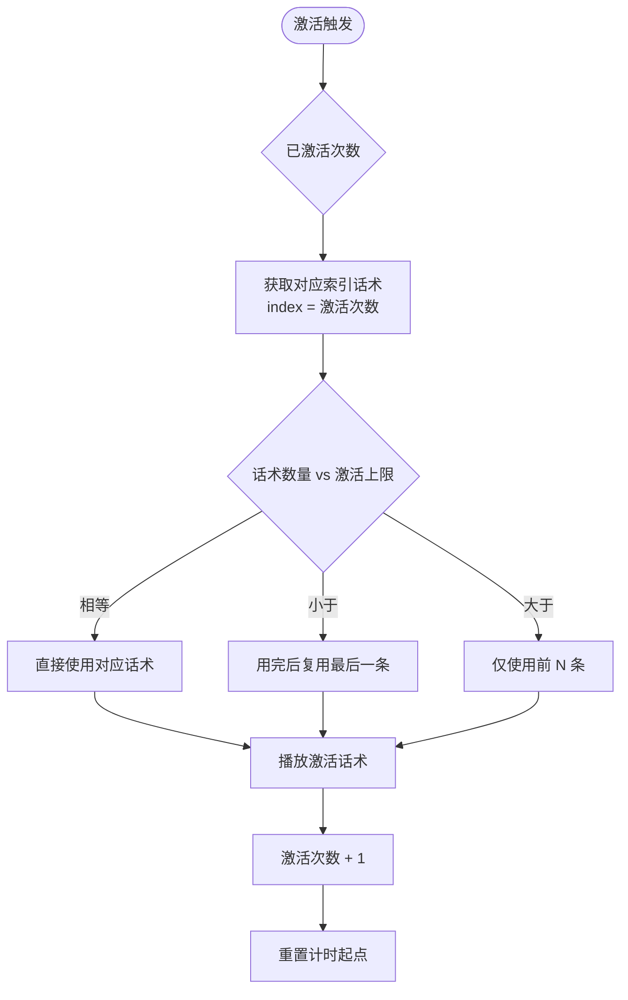
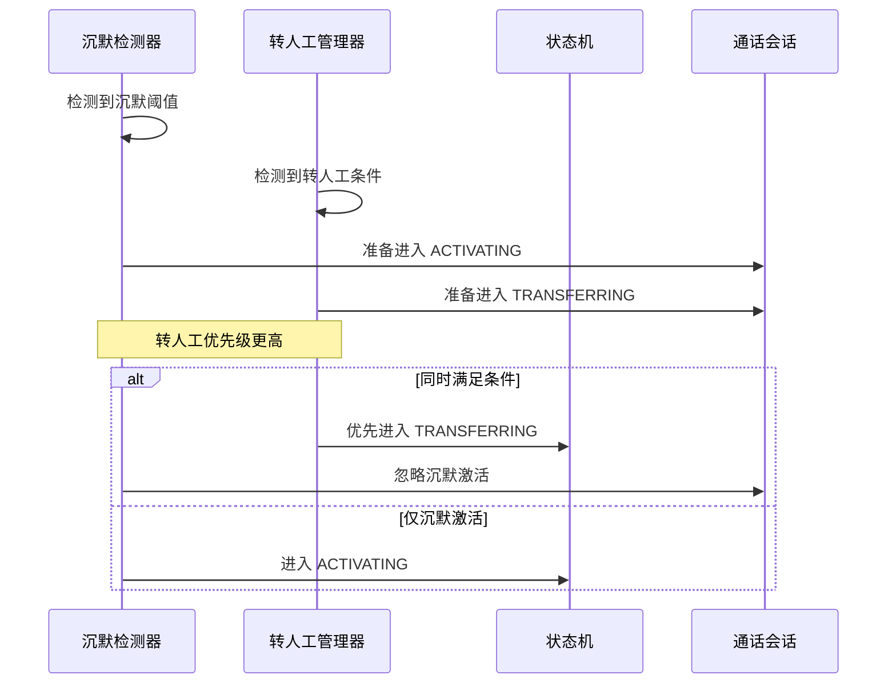
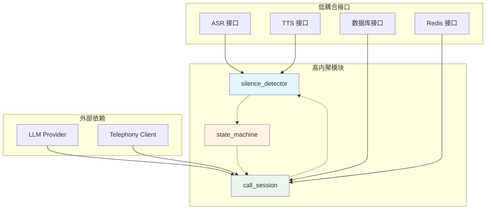

# 沉默激活功能

<cite>
**本文档引用的文件**
- [沉默激活规范](file://openspec/specs/silence-activation/spec.md)
- [通话状态机规范](file://openspec/specs/call-state-machine/spec.md)
- [引擎实现设计文档](file://openspec/changes/archive/2026-05-07-impl-engine/design.md)
- [引擎实现提案](file://openspec/changes/archive/2026-05-07-impl-engine/proposal.md)
- [引擎实现任务清单](file://openspec/changes/archive/2026-05-07-impl-engine/tasks.md)
</cite>

## 目录
1. [简介](#简介)
2. [项目结构](#项目结构)
3. [核心组件](#核心组件)
4. [架构概览](#架构概览)
5. [详细组件分析](#详细组件分析)
6. [依赖关系分析](#依赖关系分析)
7. [性能考虑](#性能考虑)
8. [故障排除指南](#故障排除指南)
9. [结论](#结论)

## 简介

沉默激活功能是 isales-engine 通话系统中的关键组件，旨在解决用户长时间不说话导致的"哑通话"问题。该功能通过持续监测 LISTENING 状态下的沉默时长，在超过阈值时主动激活 AI，避免冷场或线路异常。

本功能的核心特点包括：
- 基于 max(用户最后一次 speech_end, AI 上一轮 TTS 播完时刻) 的精确计时起点
- 支持多轮激活，最多 2 次激活
- 激活话术与角色 LLM 上下文隔离
- 与其他模块的优先级协调机制

## 项目结构

基于规范文档，沉默激活功能主要涉及以下核心文件：

**图表来源**
- [沉默激活规范:1-99](file://openspec/specs/silence-activation/spec.md#L1-L99)
- [通话状态机规范:1-190](file://openspec/specs/call-state-machine/spec.md#L1-L190)

**章节来源**
- [沉默激活规范:1-99](file://openspec/specs/silence-activation/spec.md#L1-L99)
- [通话状态机规范:1-190](file://openspec/specs/call-state-machine/spec.md#L1-L190)

## 核心组件

### 沉默检测器 (Silence Detector)

沉默检测器是沉默激活功能的核心组件，负责监控 LISTENING 状态下的用户沉默情况。

#### 核心职责
- 监测 LISTENING 状态下的用户沉默时长
- 计算精确的计时起点：max(用户最后一次 speech_end, AI 上一轮 TTS 播完时刻)
- 在超过阈值时触发激活流程
- 管理激活计数和重新计时逻辑

#### 关键算法

**图表来源**
- [沉默激活规范:7-34](file://openspec/specs/silence-activation/spec.md#L7-L34)

### 通话状态机集成

沉默激活功能与通话状态机紧密集成，确保状态转换的正确性和一致性。

#### 状态转换规则
- LISTENING → ACTIVATING：沉默检测触发激活
- ACTIVATING → LISTENING：激活话术播放完成
- ACTIVATING → END：达到激活上限后的挂断
- ACTIVATING → TRANSFERRING：转人工触发优先于沉默激活

**章节来源**
- [通话状态机规范:85-98](file://openspec/specs/call-state-machine/spec.md#L85-L98)

## 架构概览

沉默激活功能采用模块化架构设计，确保功能的可维护性和扩展性。

**图表来源**
- [引擎实现设计文档:150-154](file://openspec/changes/archive/2026-05-07-impl-engine/design.md#L150-L154)
- [引擎实现提案:40-61](file://openspec/changes/archive/2026-05-07-impl-engine/proposal.md#L40-L61)

## 详细组件分析

### 沉默检测算法实现

#### 计时起点计算
沉默检测器采用精确的计时起点计算方法：

**图表来源**
- [沉默激活规范:9-9](file://openspec/specs/silence-activation/spec.md#L9-L9)

#### 激活策略管理
沉默激活支持多种激活策略，根据配置动态调整：

| 策略类型 | 触发条件 | 行为描述 |
|---------|---------|---------|
| 激活触发 | 沉默时长 ≥ 阈值 且 激活次数 < 上限 | 进入 ACTIVATING 状态，播放对应话术 |
| 激活上限 | 激活次数 ≥ 上限 | 播放告别话术后主动挂断 |
| 用户说话 | 在阈值前检测到有效语音输入 | 复位计时器，正常进入 PROCESSING |

**章节来源**
- [沉默激活规范:11-24](file://openspec/specs/silence-activation/spec.md#L11-L24)

### 话术管理系统

#### 话术选择算法
沉默激活功能支持灵活的话术管理策略：

**图表来源**
- [沉默激活规范:35-52](file://openspec/specs/silence-activation/spec.md#L35-L52)

#### 话术隔离机制
激活话术与角色 LLM 上下文严格分离：

- **full_transcript**：包含所有激活事件，用于数据库记录
- **dialog_history**：不包含激活话术，仅喂给角色 LLM
- **激活事件格式**：`{type: "silence_activation", text: "...", activation_index: ...}`

**章节来源**
- [沉默激活规范:54-66](file://openspec/specs/silence-activation/spec.md#L54-L66)

### 优先级协调机制

#### 模块优先级
沉默激活与其他模块存在明确的优先级关系：

**图表来源**
- [沉默激活规范:68-75](file://openspec/specs/silence-activation/spec.md#L68-L75)

**章节来源**
- [沉默激活规范:68-80](file://openspec/specs/silence-activation/spec.md#L68-L80)

## 依赖关系分析

### 组件耦合度分析

**图表来源**
- [引擎实现设计文档:150-154](file://openspec/changes/archive/2026-05-07-impl-engine/design.md#L150-L154)

### 配置依赖关系

| 配置项 | 类型 | 默认值 | 说明 |
|--------|------|--------|------|
| silence_threshold_ms | int | 5000 | 沉默触发阈值（毫秒） |
| max_silence_activations | int | 2 | 单通电话最大激活次数 |
| silence_phrases | JSONB array | ["请问您还在吗？","您好，请问能听到吗？"] | 激活话术库 |
| silence_hangup_phrase | text | "那今天就先这样，稍后联系，再见。" | 达上限后的告别话术 |

**章节来源**
- [沉默激活规范:82-91](file://openspec/specs/silence-activation/spec.md#L82-L91)

## 性能考虑

### 时间复杂度分析

沉默检测算法的时间复杂度为 O(1)，空间复杂度为 O(1)，具有以下特点：

- **实时性**：基于定时器的持续监控，无阻塞等待
- **内存效率**：仅维护必要的计时状态和激活计数
- **CPU开销**：极低的计算开销，适合高频调用

### 性能优化策略

1. **定时器优化**：使用高效的定时器实现，减少系统调用开销
2. **状态缓存**：缓存常用的配置参数，避免重复查询
3. **事件合并**：合并相邻的沉默检测事件，减少状态转换频率

### 监控指标

| 指标类型 | 描述 | 目标值 |
|----------|------|--------|
| 沉默检测延迟 | 从语音停止到激活触发的时间 | < 100ms |
| 激活成功率 | 正确触发激活的比例 | > 95% |
| 误触发率 | 非沉默情况下的错误激活 | < 1% |
| 系统资源占用 | CPU 和内存使用率 | < 50% |

## 故障排除指南

### 常见问题诊断

#### 问题1：激活触发过早
**症状**：用户刚说完话就触发激活
**可能原因**：
- 计时起点设置错误
- 阈值设置过低
- ASR 延迟导致的误判

**解决方案**：
1. 检查计时起点计算逻辑
2. 调整 silence_threshold_ms 配置
3. 优化 ASR 响应延迟

#### 问题2：激活触发过晚
**症状**：用户长时间沉默后才触发激活
**可能原因**：
- 计时器精度问题
- 系统负载过高
- 配置参数不当

**解决方案**：
1. 检查系统时钟精度
2. 优化系统资源分配
3. 调整相关配置参数

#### 问题3：激活后无法继续通话
**症状**：激活后系统卡死或无法继续
**可能原因**：
- 状态转换异常
- TTS 播放失败
- 资源泄漏

**解决方案**：
1. 检查状态机转换日志
2. 验证 TTS 服务可用性
3. 实施资源清理机制

### 调试技巧

#### 日志分析
启用详细的调试日志，重点关注：
- 沉默检测事件的时间戳
- 状态转换的触发条件
- 激活话术的播放记录

#### 性能监控
使用性能监控工具跟踪：
- 沉默检测的平均响应时间
- 激活触发的成功率统计
- 系统资源使用情况

#### 单元测试
编写针对性的单元测试：
- 沉默检测边界条件测试
- 激活策略的正确性验证
- 异常情况的处理能力

**章节来源**
- [引擎实现设计文档:250-286](file://openspec/changes/archive/2026-05-07-impl-engine/design.md#L250-L286)

## 结论

沉默激活功能通过精确的计时机制和智能的状态管理，有效解决了通话过程中的"哑通话"问题。该功能具有以下优势：

1. **准确性高**：基于 max(用户最后一次 speech_end, AI 上一轮 TTS 播完时刻) 的计时起点确保了检测的准确性
2. **灵活性强**：支持多轮激活和灵活的话术管理策略
3. **集成度好**：与通话状态机和其他模块无缝集成
4. **可扩展性**：模块化设计便于功能扩展和维护

通过合理的配置和优化，沉默激活功能能够在提升用户体验的同时，保持系统的稳定性和性能。建议在实际部署中根据具体的业务场景调整相关参数，以达到最佳的使用效果。