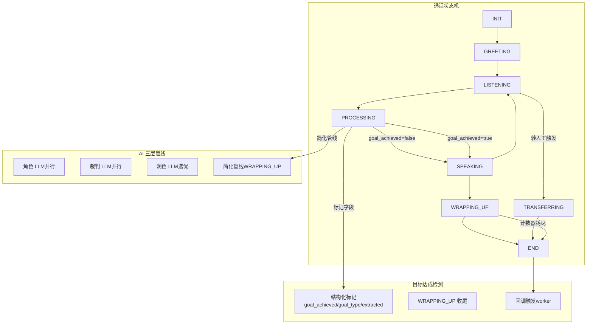
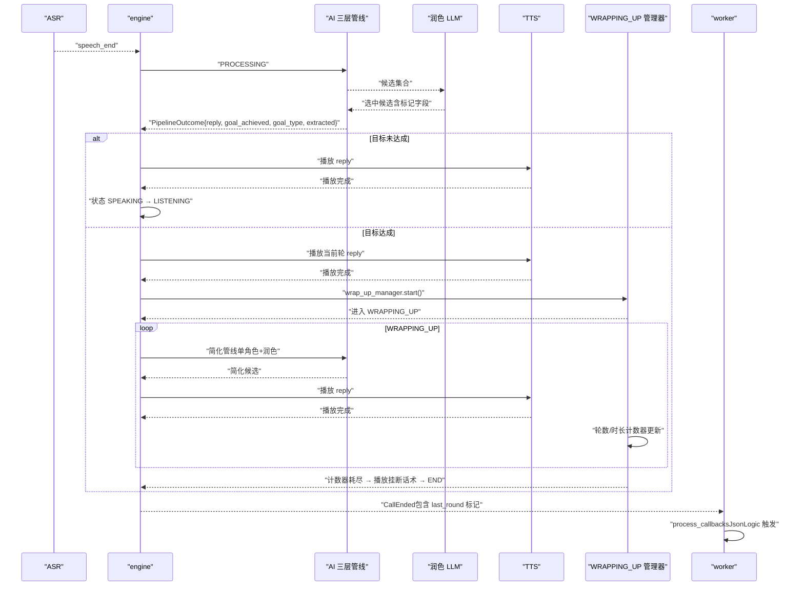
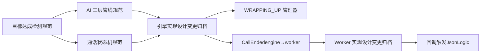

# 目标达成检测

<cite>
**本文引用的文件**
- [目标达成检测规范](file://openspec/specs/goal-achievement/spec.md)
- [AI 三层管线规范](file://openspec/specs/ai-pipeline/spec.md)
- [通话状态机规范](file://openspec/specs/call-state-machine/spec.md)
- [引擎实现设计（变更归档）](file://openspec/changes/archive/2026-05-07-impl-engine/design.md)
- [引擎实现提案（变更归档）](file://openspec/changes/archive/2026-05-07-impl-engine/proposal.md)
- [Worker 实现设计（变更归档）](file://openspec/changes/archive/2026-05-06-impl-worker/design.md)
- [Worker 实现提案（变更归档）](file://openspec/changes/archive/2026-05-06-impl-worker/proposal.md)
</cite>

## 目录
1. [简介](#简介)
2. [项目结构](#项目结构)
3. [核心组件](#核心组件)
4. [架构总览](#架构总览)
5. [详细组件分析](#详细组件分析)
6. [依赖分析](#依赖分析)
7. [性能考虑](#性能考虑)
8. [故障排查指南](#故障排查指南)
9. [结论](#结论)
10. [附录](#附录)

## 简介
本文件面向“目标达成检测”模块，系统化阐述目标达成的评估标准、检测算法、预设目标定义、进度跟踪机制与完成条件判断。重点说明目标达成检测在通话流程中的触发时机、与 AI 三层管线的集成方式，以及不同类型目标（销售目标、信息收集目标、互动目标）的差异化处理策略。文档还提供配置参数说明、评估指标定义、实际应用场景示例，并给出扩展指南与自定义目标类型的开发建议。

## 项目结构
目标达成检测属于 isales-engine 的核心能力之一，贯穿通话状态机与 AI 三层管线。关键文件与职责如下：
- 目标达成检测规范：定义判定时机、标记字段、WRAPPING_UP 收尾流程与回调触发。
- AI 三层管线规范：定义角色 LLM 并行 PK、裁判 LLM 并行审查、润色 LLM 选优拟人化，以及简化管线（WRAPPING_UP）。
- 通话状态机规范：定义状态集合、转换规则与特殊状态（WRAPPING_UP、TRANSFERRING、ACTIVATING）。
- 引擎实现设计/提案：落地目标达成检测在状态机与管线中的执行细节。
- Worker 实现设计/提案：落地通话结束后的汇总与回调触发。

图表来源
- [通话状态机规范](file://openspec/specs/call-state-machine/spec.md)
- [AI 三层管线规范](file://openspec/specs/ai-pipeline/spec.md)
- [目标达成检测规范](file://openspec/specs/goal-achievement/spec.md)
- [引擎实现设计（变更归档）](file://openspec/changes/archive/2026-05-07-impl-engine/design.md)

章节来源
- [通话状态机规范](file://openspec/specs/call-state-machine/spec.md)
- [AI 三层管线规范](file://openspec/specs/ai-pipeline/spec.md)
- [目标达成检测规范](file://openspec/specs/goal-achievement/spec.md)

## 核心组件
- 结构化标记字段
  - goal_achieved：布尔型，指示本轮是否达成目标
  - goal_type：字符串，目标类型标识（如 appointment、wechat_added、intent_confirmed 等）
  - extracted：对象，从回复中抽取的结构化字段
- WRAPPING_UP 收尾管理器
  - 维护轮数计数器与累计时长计数器
  - 到达任一阈值后播放随机挂断话术并主动挂断
- 简化管线（WRAPPING_UP）
  - 单角色 LLM 直出 + 润色拟人化，不启用 PK 与裁判
- 回调触发（worker）
  - 基于 JsonLogic 表达式匹配 last_round 的标记字段触发外部 webhook

章节来源
- [目标达成检测规范](file://openspec/specs/goal-achievement/spec.md)
- [引擎实现设计（变更归档）](file://openspec/changes/archive/2026-05-07-impl-engine/design.md)
- [Worker 实现设计（变更归档）](file://openspec/changes/archive/2026-05-06-impl-worker/design.md)

## 架构总览
目标达成检测在通话生命周期中的位置与触发时机：
- 角色 LLM 每轮输出必须包含结构化标记字段（JSON Mode 强制）
- 润色 LLM 仅改写 reply，标记字段从被选中候选直接继承，不进行投票合并
- 当润色返回 goal_achieved=true 时，先进入 SPEAKING 正常播放当前轮 reply，随后进入 WRAPPING_UP
- WRAPPING_UP 期间走简化管线，维护轮数与时间双计数器，任一耗尽即挂断
- 通话结束后，worker 通过 callback_config.trigger 匹配 last_round 的标记字段触发回调

图表来源
- [AI 三层管线规范](file://openspec/specs/ai-pipeline/spec.md)
- [目标达成检测规范](file://openspec/specs/goal-achievement/spec.md)
- [通话状态机规范](file://openspec/specs/call-state-machine/spec.md)
- [引擎实现设计（变更归档）](file://openspec/changes/archive/2026-05-07-impl-engine/design.md)
- [Worker 实现设计（变更归档）](file://openspec/changes/archive/2026-05-06-impl-worker/design.md)

## 详细组件分析

### 结构化标记与判定契约
- 角色 LLM 输出必须严格遵循 JSON 格式，包含 reply、goal_achieved、goal_type、extracted 字段
- 未达成时 goal_type 为空字符串，达成时为具体目标类型
- worker 在通话结束后仅记录最后一轮标记，不再触发独立判定 LLM 调用

章节来源
- [目标达成检测规范](file://openspec/specs/goal-achievement/spec.md)

### 与 AI 三层管线的集成
- 角色 LLM 并行产生候选，裁判 LLM 并行审查，润色 LLM 选优并改写 reply
- 润色对标记字段的处理：仅改写 reply，标记字段从被选中候选直接继承，不做投票合并
- WRAPPING_UP 状态下走简化管线（单角色 + 润色），不启用 PK 与裁判

章节来源
- [AI 三层管线规范](file://openspec/specs/ai-pipeline/spec.md)
- [目标达成检测规范](file://openspec/specs/goal-achievement/spec.md)
- [引擎实现设计（变更归档）](file://openspec/changes/archive/2026-05-07-impl-engine/design.md)

### WRAPPING_UP 收尾流程
- 进入时机：润色返回 goal_achieved=true，当前轮 reply 正常播放后进入
- 简化管线：单角色 LLM + 润色，不启用 PK 与裁判
- 双计数器：wrap_up_max_rounds（默认 2）、wrap_up_max_seconds（默认 15）
- 特殊情况处理：用户提出新问题、明确反悔、主动挂断、转人工触发等均有明确规则，避免反复无效循环

章节来源
- [目标达成检测规范](file://openspec/specs/goal-achievement/spec.md)
- [通话状态机规范](file://openspec/specs/call-state-machine/spec.md)
- [引擎实现设计（变更归档）](file://openspec/changes/archive/2026-05-07-impl-engine/design.md)

### 回调触发与外部集成
- worker 通过 callback_config.trigger（JsonLogic 表达式）匹配 last_round 的 goal_achieved、goal_type、extracted.* 字段
- 触发后发送 webhook，支持签名、重试、幂等等安全机制

章节来源
- [目标达成检测规范](file://openspec/specs/goal-achievement/spec.md)
- [Worker 实现设计（变更归档）](file://openspec/changes/archive/2026-05-06-impl-worker/design.md)
- [Worker 实现提案（变更归档）](file://openspec/changes/archive/2026-05-06-impl-worker/proposal.md)

### 不同类型目标的检测策略
- 销售目标（如 appointment）
  - 在角色 prompt 中明确判定标准与抽取字段
  - 通过结构化标记字段表达达成与否与类型
- 信息收集目标（如 wechat_added、intent_confirmed）
  - 目标定义与抽取字段同样写入角色 prompt
  - 通过 goal_type 区分不同信息收集目标
- 互动目标（如确认意向、建立信任）
  - 通过润色后的 reply 与抽取字段共同体现互动效果
  - 仍遵循标记字段不投票的契约

章节来源
- [目标达成检测规范](file://openspec/specs/goal-achievement/spec.md)
- [AI 三层管线规范](file://openspec/specs/ai-pipeline/spec.md)

### 配置参数与数据模型
- 通话记录字段
  - wrap_up_started_at：进入 WRAPPING_UP 的时刻
  - call_summary.goal_achieved / goal_type / extracted_fields：最后一轮标记与抽取字段
- Campaign 配置
  - wrap_up_max_rounds：收尾轮数上限（默认 2）
  - wrap_up_max_seconds：收尾时长上限（默认 15s）
  - wrap_up_closing_phrases：收尾挂断话术池（JSONB）
  - extraction_fields：字段抽取的配置参考（具体抽取由角色 LLM 完成）

章节来源
- [目标达成检测规范](file://openspec/specs/goal-achievement/spec.md)

### 评估指标与应用场景
- 评估指标
  - 目标达成率：达成目标的通话数 / 总通话数
  - 平均收尾轮数：WRAPPING_UP 期间平均对话轮数
  - 平均收尾时长：WRAPPING_UP 期间平均时长
  - 回调触发成功率：满足 trigger 的通话数 / 总通话数
- 应用场景
  - 销售目标：在角色 prompt 中定义“达成预约”的判定条件与抽取字段，通过回调联动 CRM 系统
  - 信息收集：在角色 prompt 中定义“添加微信”“确认意向”等目标，抽取相应字段用于后续跟进
  - 互动优化：通过润色后的 reply 与抽取字段评估互动质量，持续优化 prompt

章节来源
- [目标达成检测规范](file://openspec/specs/goal-achievement/spec.md)
- [Worker 实现设计（变更归档）](file://openspec/changes/archive/2026-05-06-impl-worker/design.md)

### 扩展指南与自定义目标类型开发建议
- 自定义目标类型
  - 通过修改角色 prompt 实现新的 goal_type，无需数据库 schema 变更
  - 在角色 prompt 中明确判定标准与抽取字段，确保结构化标记字段可被正确解析
- 标记字段处理
  - 严禁在润色层输出标记字段，必须从被选中候选直接继承
  - 若出现误报，依靠 prompt 设计与收尾对话兜底，避免在润色层进行投票合并
- 回调触发
  - 使用 JsonLogic 表达式匹配 last_round 的标记字段，确保触发条件清晰、可审计
  - 对回调 payload 进行签名与重试策略，保障外部系统可靠接收

章节来源
- [目标达成检测规范](file://openspec/specs/goal-achievement/spec.md)
- [AI 三层管线规范](file://openspec/specs/ai-pipeline/spec.md)
- [引擎实现设计（变更归档）](file://openspec/changes/archive/2026-05-07-impl-engine/design.md)
- [Worker 实现设计（变更归档）](file://openspec/changes/archive/2026-05-06-impl-worker/design.md)

## 依赖分析
目标达成检测与状态机、管线、回调的耦合关系如下：

图表来源
- [目标达成检测规范](file://openspec/specs/goal-achievement/spec.md)
- [AI 三层管线规范](file://openspec/specs/ai-pipeline/spec.md)
- [通话状态机规范](file://openspec/specs/call-state-machine/spec.md)
- [引擎实现设计（变更归档）](file://openspec/changes/archive/2026-05-07-impl-engine/design.md)
- [Worker 实现设计（变更归档）](file://openspec/changes/archive/2026-05-06-impl-worker/design.md)

章节来源
- [目标达成检测规范](file://openspec/specs/goal-achievement/spec.md)
- [AI 三层管线规范](file://openspec/specs/ai-pipeline/spec.md)
- [通话状态机规范](file://openspec/specs/call-state-machine/spec.md)
- [引擎实现设计（变更归档）](file://openspec/changes/archive/2026-05-07-impl-engine/design.md)
- [Worker 实现设计（变更归档）](file://openspec/changes/archive/2026-05-06-impl-worker/design.md)

## 性能考虑
- 实时判定：目标判定在通话期间实时完成，避免离线二次判定带来的延迟与一致性风险
- 简化管线：WRAPPING_UP 期间走简化管线，降低计算开销，缩短挂断等待时间
- 标记字段不投票：减少润色层复杂度，避免额外的候选聚合与投票成本
- pipeline_trace 写入：每轮 PROCESSING（含简化管线）均写入 pipeline_trace，便于可观测性与回溯，且写入失败不影响通话主路径

章节来源
- [目标达成检测规范](file://openspec/specs/goal-achievement/spec.md)
- [AI 三层管线规范](file://openspec/specs/ai-pipeline/spec.md)
- [引擎实现设计（变更归档）](file://openspec/changes/archive/2026-05-07-impl-engine/design.md)

## 故障排查指南
- 角色 LLM 输出不符合 JSON 模式
  - 现象：候选被裁判淘汰或走默认回复兜底
  - 处理：检查角色 prompt 是否强制 JSON Mode，确保输出严格符合结构化标记字段
- 润色层误改标记字段
  - 现象：最终输出的标记字段与候选不一致
  - 处理：确认润色仅改写 reply，标记字段必须从被选中候选直接继承
- WRAPPING_UP 未进入
  - 现象：目标达成但未进入收尾状态
  - 处理：检查润色返回的 goal_achieved 是否为 true，确认 SPEAKING 正常播放后再进入 WRAPPING_UP
- 回调未触发
  - 现象：通话结束但外部系统未收到回调
  - 处理：核对 callback_config.trigger 的 JsonLogic 表达式是否匹配 last_round 的标记字段，检查签名与重试策略

章节来源
- [目标达成检测规范](file://openspec/specs/goal-achievement/spec.md)
- [AI 三层管线规范](file://openspec/specs/ai-pipeline/spec.md)
- [Worker 实现设计（变更归档）](file://openspec/changes/archive/2026-05-06-impl-worker/design.md)

## 结论
目标达成检测通过严格的结构化标记契约与实时判定机制，确保在通话期间准确识别目标达成并进入 WRAPPING_UP 收尾流程。结合 AI 三层管线的简化管线与回调触发机制，形成从“目标识别—拟人化回复—收尾挂断—外部联动”的完整闭环。通过在角色 prompt 中定义目标与抽取字段，系统实现了对多类型目标的灵活支持，且无需数据库 schema 变更。开发者可在不破坏现有契约的前提下扩展自定义目标类型，并通过回调与可观测性数据持续优化目标达成效果。

## 附录
- 相关规范与实现文件索引
  - 目标达成检测规范：定义判定时机、标记字段、WRAPPING_UP 收尾与回调触发
  - AI 三层管线规范：定义三层并行管线与简化管线
  - 通话状态机规范：定义状态集合与转换规则
  - 引擎实现设计/提案：落地状态机、管线与 WRAPPING_UP 管理器
  - Worker 实现设计/提案：落地回调触发与重试调度