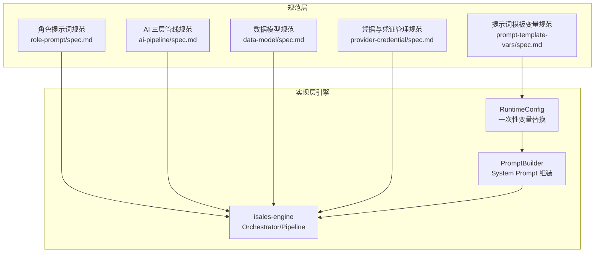
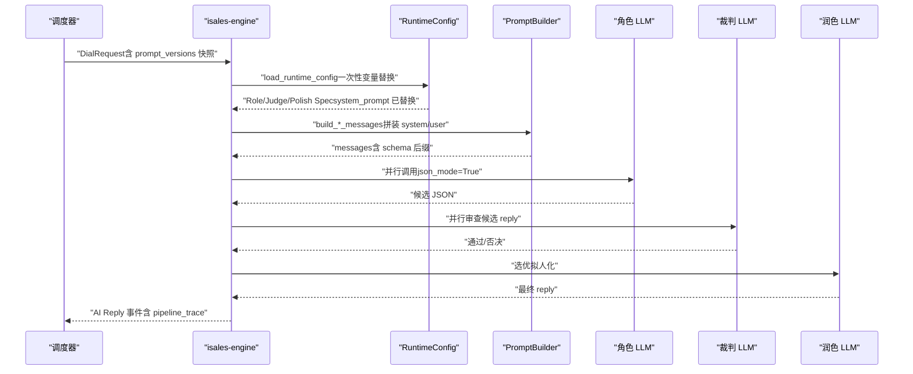
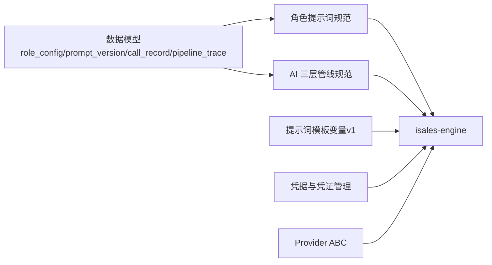

# 角色提示词系统

<cite>
**本文引用的文件**
- [role-prompt 规范（v1）](file://openspec/specs/role-prompt/spec.md)
- [AI 三层管线规范](file://openspec/specs/ai-pipeline/spec.md)
- [数据模型规范](file://openspec/specs/data-model/spec.md)
- [提示词模板变量提案（已归档）](file://openspec/changes/archive/2026-05-29-prompt-template-vars-SUPERSEDED/proposal.md)
- [提示词模板变量设计（已归档）](file://openspec/changes/archive/2026-05-29-prompt-template-vars-SUPERSEDED/design.md)
- [提示词模板变量规范（已归档）](file://openspec/changes/archive/2026-05-29-prompt-template-vars-SUPERSEDED/specs/role-prompt/spec.md)
- [提示词模板变量任务清单（已归档）](file://openspec/changes/archive/2026-05-29-prompt-template-vars-SUPERSEDED/tasks.md)
- [引擎实现提案（已归档）](file://openspec/changes/archive/2026-05-07-impl-engine/proposal.md)
- [引擎实现设计（已归档）](file://openspec/changes/archive/2026-05-07-impl-engine/design.md)
- [Provider ABC 规范（LLM 接口）](file://openspec/changes/archive/2026-05-01-init-isales-common/specs/provider-abc/spec.md)
- [凭据与凭证管理规范](file://openspec/specs/provider-credential/spec.md)
- [通话响应延迟分析](file://通话响应延迟分析.md)
- [Cloud 环境状态说明（含提示词迁移注记）](file://deploy/cloud/STATE.md)
</cite>

## 目录
1. [简介](#简介)
2. [项目结构](#项目结构)
3. [核心组件](#核心组件)
4. [架构总览](#架构总览)
5. [详细组件分析](#详细组件分析)
6. [依赖分析](#依赖分析)
7. [性能考量](#性能考量)
8. [故障排查指南](#故障排查指南)
9. [结论](#结论)
10. [附录](#附录)

## 简介
本技术文档围绕“角色提示词系统”展开，系统性阐述提示词设计原则、构建方法、版本控制与回放、上下文注入与管理、与 AI 三层管线的集成方式、数据传递格式、配置参数（温度、采样比例、最大 token）策略，以及多角色配置的最佳实践与冲突化解法。文档同时给出提示词工程的开发指南与调试技巧，帮助开发者高效迭代提示词并稳定交付。

## 项目结构
提示词系统位于 isales 项目的 openspec 规范仓库中，核心规范分布在如下位置：
- 角色提示词规范：openspec/specs/role-prompt/spec.md
- AI 三层管线规范：openspec/specs/ai-pipeline/spec.md
- 数据模型规范：openspec/specs/data-model/spec.md
- 提示词模板变量（v1）：openspec/changes/archive/.../prompt-template-vars-*/spec.md、proposal.md、design.md、tasks.md
- 引擎实现（含管线与提示词集成）：openspec/changes/archive/.../impl-engine/*
- Provider ABC（LLM 接口契约）：openspec/changes/archive/.../init-isales-common/specs/provider-abc/spec.md
- 凭据与凭证管理：openspec/specs/provider-credential/spec.md
- 性能分析与优化参考：通话响应延迟分析.md
- 环境状态与迁移注记：deploy/cloud/STATE.md

**图表来源**
- [角色提示词规范（v1）](file://openspec/specs/role-prompt/spec.md)
- [AI 三层管线规范](file://openspec/specs/ai-pipeline/spec.md)
- [数据模型规范](file://openspec/specs/data-model/spec.md)
- [提示词模板变量规范（已归档）](file://openspec/changes/archive/2026-05-29-prompt-template-vars-SUPERSEDED/specs/role-prompt/spec.md)
- [凭据与凭证管理规范](file://openspec/specs/provider-credential/spec.md)

**章节来源**
- [角色提示词规范（v1）](file://openspec/specs/role-prompt/spec.md)
- [AI 三层管线规范](file://openspec/specs/ai-pipeline/spec.md)
- [数据模型规范](file://openspec/specs/data-model/spec.md)

## 核心组件
- 角色提示词规范（role-prompt）
  - 规定 system prompt 的三段式组装：角色身份+目标+JSON输出schema；用户消息拼接顺序；长上下文不截断；JSON Mode 强制策略；收尾与跟进上下文注入；版本快照与调试回放。
- AI 三层管线（ai-pipeline）
  - 规定 N 角色并行 PK → N×M 裁判并行审查 → 1 润色选优；失败兜底、降级路径；pipeline_trace 写入；连续打断保护策略；简化管线（WRAPPING_UP）。
- 数据模型（data-model）
  - 角色配置表 role_config、提示词版本表 prompt_version、通话记录 call_record、流水记录 pipeline_trace 等核心表及字段。
- 提示词模板变量（prompt-template-vars，v1）
  - 在 runtime_config.load 阶段一次性替换，支持 ${role_prompt}、${campaign_name}、${lead_name}、${lead_phone}、${lead_custom_data}；未知变量保留字面并警告；与 OUTPUT_SCHEMA_SUFFIX 的先后顺序明确；prompt_versions 快照仍指向 PG 原文。
- 引擎实现（isales-engine）
  - Orchestrator 负责三层管线编排；Role/Judge/Polish LLM 调用；JSON 解析与降级；prompt_builder 组装 system/user messages；runtime_config 一次性变量替换；prompt_versions 快照写入 call_record。
- Provider ABC（LLM 接口）
  - chat 接口统一，支持 json_mode；不支持时以 system prompt + 后处理等效约束；温度、采样、最大 token 参数透传。
- 凭据与凭证管理
  - provider_credential 表统一存储密钥与配置，Fernet 对称加密；运行时从 DB 一次性装载，环境变量不持有 provider 密钥。

**章节来源**
- [角色提示词规范（v1）](file://openspec/specs/role-prompt/spec.md)
- [AI 三层管线规范](file://openspec/specs/ai-pipeline/spec.md)
- [数据模型规范](file://openspec/specs/data-model/spec.md)
- [提示词模板变量提案（已归档）](file://openspec/changes/archive/2026-05-29-prompt-template-vars-SUPERSEDED/proposal.md)
- [提示词模板变量设计（已归档）](file://openspec/changes/archive/2026-05-29-prompt-template-vars-SUPERSEDED/design.md)
- [提示词模板变量规范（已归档）](file://openspec/changes/archive/2026-05-29-prompt-template-vars-SUPERSEDED/specs/role-prompt/spec.md)
- [引擎实现提案（已归档）](file://openspec/changes/archive/2026-05-07-impl-engine/proposal.md)
- [引擎实现设计（已归档）](file://openspec/changes/archive/2026-05-07-impl-engine/design.md)
- [Provider ABC 规范（LLM 接口）](file://openspec/changes/archive/2026-05-01-init-isales-common/specs/provider-abc/spec.md)
- [凭据与凭证管理规范](file://openspec/specs/provider-credential/spec.md)

## 架构总览
提示词系统与 AI 三层管线的集成路径如下：

**图表来源**
- [引擎实现提案（已归档）](file://openspec/changes/archive/2026-05-07-impl-engine/proposal.md)
- [引擎实现设计（已归档）](file://openspec/changes/archive/2026-05-07-impl-engine/design.md)
- [AI 三层管线规范](file://openspec/specs/ai-pipeline/spec.md)
- [角色提示词规范（v1）](file://openspec/specs/role-prompt/spec.md)

## 详细组件分析

### 组件一：提示词设计原则与构建方法
- 设计原则
  - 角色 system prompt 三段式：角色身份+目标+JSON 输出 schema；可按 WRAPPING_UP 追加收尾指令；可按 retry-followup 追加跟进上下文。
  - 用户消息拼接顺序：上次通话纪要（跟进时存在）→ 线索信息（name/phone/custom_data）→ 对话历史（AI/用户交替，最后一行为 AI）。
  - 长上下文不截断，依赖 LLM 长上下文能力；token 用量监控与告警。
  - JSON Mode 强制：优先原生 JSON Mode；不支持时在 system prompt 末尾贴 schema，并做后处理（json.loads → 正则提取 → 降级）。
- 构建方法
  - 使用 isales-web 模板作为建议结构，用户可完全覆写。
  - judge user message 限定为“对话历史”与“候选回复”两个 markdown 段落，与 role prompt 的 OUTPUT_SCHEMA_SUFFIX 正交。
  - 通过 runtime_config.load 阶段一次性变量替换，保证 hot path 零增量。

**章节来源**
- [角色提示词规范（v1）](file://openspec/specs/role-prompt/spec.md)
- [提示词模板变量提案（已归档）](file://openspec/changes/archive/2026-05-29-prompt-template-vars-SUPERSEDED/proposal.md)
- [提示词模板变量设计（已归档）](file://openspec/changes/archive/2026-05-29-prompt-template-vars-SUPERSEDED/design.md)

### 组件二：提示词版本控制系统
- 版本管理
  - prompt_version 表保存历史；role_config.current_prompt_version_id 指向当前生效版本；通话开始时一次性写入 call_record.prompt_versions 快照。
- A/B 测试与效果评估
  - 通过为同一 role_config 创建新 prompt_version 并切换 current_prompt_version_id 实现 A/B；结合 pipeline_trace 与 call_summary 进行效果评估（目标达成率、通话时长、转人工率等）。
- 调试回放
  - 通过 prompt_version_id + lead/campaign 元数据离线重做替换，精准复现历史 prompt。

**章节来源**
- [角色提示词规范（v1）](file://openspec/specs/role-prompt/spec.md)
- [数据模型规范](file://openspec/specs/data-model/spec.md)

### 组件三：上下文管理机制
- 运行时上下文
  - runtime_config.load 阶段一次性构造 PromptVars：包含 ${role_prompt}、${campaign_name}、${lead_name}、${lead_phone}、${lead_custom_data}；未知变量保留字面并警告。
- judge/role 的差异化变量集
  - role 内自指 ${role_prompt} 替换为空串并警告；judge/polish 使用 roles[0].system_prompt 注入销售场景上下文。
- 对话历史与跟进上下文
  - judge user message 严格按“对话历史”“候选回复”两段拼装；WRAPPING_UP 时在 system prompt 末尾追加收尾指令；跟进通话在 system prompt 末尾追加“上次通话纪要”段落。

**章节来源**
- [提示词模板变量提案（已归档）](file://openspec/changes/archive/2026-05-29-prompt-template-vars-SUPERSEDED/proposal.md)
- [提示词模板变量设计（已归档）](file://openspec/changes/archive/2026-05-29-prompt-template-vars-SUPERSEDED/design.md)
- [提示词模板变量任务清单（已归档）](file://openspec/changes/archive/2026-05-29-prompt-template-vars-SUPERSEDED/tasks.md)
- [角色提示词规范（v1）](file://openspec/specs/role-prompt/spec.md)

### 组件四：多角色配置策略与最佳实践
- 角色独立性
  - N 个角色 prompt 完全独立，不得共享 base prompt；多样性是 PK 的本意。
- 分工与协作
  - Layer 1 并行 PK → Layer 2 并行审查 → Layer 3 选优拟人化；连续打断保护（short_reply/listen_only）；简化管线（WRAPPING_UP）。
- 冲突解决
  - 任一裁判否决即淘汰候选；全部候选解析失败或全部裁判否决走默认回复兜底；润色失败取第一个通过候选作为降级；异常路径写 pipeline_trace 标注 error。

**章节来源**
- [角色提示词规范（v1）](file://openspec/specs/role-prompt/spec.md)
- [AI 三层管线规范](file://openspec/specs/ai-pipeline/spec.md)

### 组件五：与 AI 三层管线的集成与数据传递
- 角色 LLM
  - 并行调用，json_mode=True；system prompt 三段式 + schema 后缀；user message 单条拼接整通对话。
- 裁判 LLM
  - 输入仅候选 reply 字段；任一否决即淘汰。
- 润色 LLM
  - 从通过裁判的候选中选优并改写 reply；标记字段（goal_achieved/goal_type/extracted）继承被选中候选。
- 数据传递
  - pipeline_trace 记录每轮候选、裁判结果、润色输入输出；异常/兜底/降级路径均有明确标注。

**章节来源**
- [AI 三层管线规范](file://openspec/specs/ai-pipeline/spec.md)
- [角色提示词规范（v1）](file://openspec/specs/role-prompt/spec.md)

### 组件六：提示词模板与配置示例（路径指引）
- 角色 system prompt 建议结构（路径）
  - [角色提示词规范（v1）](file://openspec/specs/role-prompt/spec.md)
- judge user message 段落规范（路径）
  - [角色提示词规范（v1）](file://openspec/specs/role-prompt/spec.md)
- JSON Mode 强制与后处理（路径）
  - [角色提示词规范（v1）](file://openspec/specs/role-prompt/spec.md)
- 角色配置参数（温度、采样比例、最大 token）（路径）
  - [Provider ABC 规范（LLM 接口）](file://openspec/changes/archive/2026-05-01-init-isales-common/specs/provider-abc/spec.md)
  - [数据模型规范](file://openspec/specs/data-model/spec.md)

**章节来源**
- [角色提示词规范（v1）](file://openspec/specs/role-prompt/spec.md)
- [Provider ABC 规范（LLM 接口）](file://openspec/changes/archive/2026-05-01-init-isales-common/specs/provider-abc/spec.md)
- [数据模型规范](file://openspec/specs/data-model/spec.md)

### 组件七：提示词工程开发指南与调试技巧
- 开发指南
  - 使用 isales-web 模板作为起点，逐步迭代；通过创建新 prompt_version 并切换 current_prompt_version_id 进行 A/B；关注 pipeline_trace 中 candidates/judge_results/polish_output。
  - 对 judge/role 的上下文注入，优先使用 ${role_prompt}；对 campaign/lead 个性化使用 ${campaign_name}、${lead_name}、${lead_phone}、${lead_custom_data}。
- 调试技巧
  - 通过 call_record.prompt_versions 快照定位 prompt_version_id，结合 lead/campaign 元数据离线重做替换；检查未知变量保留字面的警告日志；核对 OUTPUT_SCHEMA_SUFFIX 顺序与 judge user message 段落。
  - 使用 mock provider 驱动确定性测试，验证 short_reply、wrap_up、default_replies 等路径。

**章节来源**
- [提示词模板变量提案（已归档）](file://openspec/changes/archive/2026-05-29-prompt-template-vars-SUPERSEDED/proposal.md)
- [提示词模板变量设计（已归档）](file://openspec/changes/archive/2026-05-29-prompt-template-vars-SUPERSEDED/design.md)
- [引擎实现设计（已归档）](file://openspec/changes/archive/2026-05-07-impl-engine/design.md)

## 依赖分析
提示词系统与引擎、Provider、数据模型之间的依赖关系如下：

**图表来源**
- [数据模型规范](file://openspec/specs/data-model/spec.md)
- [角色提示词规范（v1）](file://openspec/specs/role-prompt/spec.md)
- [AI 三层管线规范](file://openspec/specs/ai-pipeline/spec.md)
- [提示词模板变量提案（已归档）](file://openspec/changes/archive/2026-05-29-prompt-template-vars-SUPERSEDED/proposal.md)
- [凭据与凭证管理规范](file://openspec/specs/provider-credential/spec.md)
- [Provider ABC 规范（LLM 接口）](file://openspec/changes/archive/2026-05-01-init-isales-common/specs/provider-abc/spec.md)

**章节来源**
- [数据模型规范](file://openspec/specs/data-model/spec.md)
- [角色提示词规范（v1）](file://openspec/specs/role-prompt/spec.md)
- [AI 三层管线规范](file://openspec/specs/ai-pipeline/spec.md)
- [提示词模板变量提案（已归档）](file://openspec/changes/archive/2026-05-29-prompt-template-vars-SUPERSEDED/proposal.md)
- [凭据与凭证管理规范](file://openspec/specs/provider-credential/spec.md)
- [Provider ABC 规范（LLM 接口）](file://openspec/changes/archive/2026-05-01-init-isales-common/specs/provider-abc/spec.md)

## 性能考量
- 管线串行与首包延迟
  - 三层串行往返导致 TTFT 放大；建议润色层（最后一层）采用流式输出，TTS 边收边合成；角色/裁判层缩短 max_tokens 并精简 JSON schema。
- 连接复用与握手开销
  - Provider 持有长生命周期 httpx.AsyncClient，复用 TCP 与 TLS 会话，减少握手成本。
- 超时与快速失败
  - 按层差异化超时（裁判 2–3s）；首 token 监控，长时间无响应提前切默认回复。
- token 成本
  - judge 注入对话历史段带来 token 成本上升；v1 接受该代价，N/M 常态为 1。

**章节来源**
- [通话响应延迟分析](file://通话响应延迟分析.md)

## 故障排查指南
- judge 概念错位导致全部否决
  - 现象：judge 将销售候选判为“无关内容”，全部 reject → default_replies fallback。
  - 处理：通过 ${role_prompt} 注入销售角色 system prompt 原文，确保 judge 拥有销售场景上下文。
- 未知变量保留字面并警告
  - 现象：prompt 中存在未定义变量（如历史遗留 ${roleUser}），会被保留字面并记录警告日志。
  - 处理：修正变量名或迁移历史数据；确认 runtime_config.load 阶段替换已完成。
- JSON 解析失败
  - 现象：单角色 JSON 解析失败 → 候选淘汰；全部失败 → default_replies。
  - 处理：检查 system prompt 末尾 schema 后缀；启用原生 JSON Mode；必要时放宽 schema 并加强后处理。
- prompt_versions 快照与回放
  - 现象：调试历史通话时无法复现 prompt。
  - 处理：通过 prompt_version_id + lead/campaign 元数据离线重做替换；确认 WRAPPING_UP 标记与 follow-up 上下文追加。

**章节来源**
- [提示词模板变量提案（已归档）](file://openspec/changes/archive/2026-05-29-prompt-template-vars-SUPERSEDED/proposal.md)
- [提示词模板变量设计（已归档）](file://openspec/changes/archive/2026-05-29-prompt-template-vars-SUPERSEDED/design.md)
- [角色提示词规范（v1）](file://openspec/specs/role-prompt/spec.md)
- [Cloud 环境状态说明（含提示词迁移注记）](file://deploy/cloud/STATE.md)

## 结论
角色提示词系统以“一次性变量替换 + 严格的三段式组装 + 三层管线编排”为核心，既保证了提示词的灵活性与可回放性，又确保了运行时的高性能与可观测性。通过版本管理与 A/B 测试，团队可以持续迭代提示词质量；通过上下文注入与 schema 强约束，系统在复杂销售场景中实现了稳定的输出与可控的合规性。

## 附录
- 提示词模板变量支持的变量集（v1）
  - ${role_prompt}、${campaign_name}、${lead_name}、${lead_phone}、${lead_custom_data}
- 运行时替换时机与顺序
  - runtime_config.load 阶段一次性替换；随后追加 OUTPUT_SCHEMA_SUFFIX；最终写入 pipeline_trace 与 prompt_versions 快照。
- Provider 参数透传
  - chat 接口统一支持 temperature/top_p/max_tokens；json_mode=True 强制启用原生 JSON Mode。

**章节来源**
- [提示词模板变量提案（已归档）](file://openspec/changes/archive/2026-05-29-prompt-template-vars-SUPERSEDED/proposal.md)
- [提示词模板变量设计（已归档）](file://openspec/changes/archive/2026-05-29-prompt-template-vars-SUPERSEDED/design.md)
- [Provider ABC 规范（LLM 接口）](file://openspec/changes/archive/2026-05-01-init-isales-common/specs/provider-abc/spec.md)
- [数据模型规范](file://openspec/specs/data-model/spec.md)