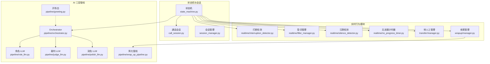
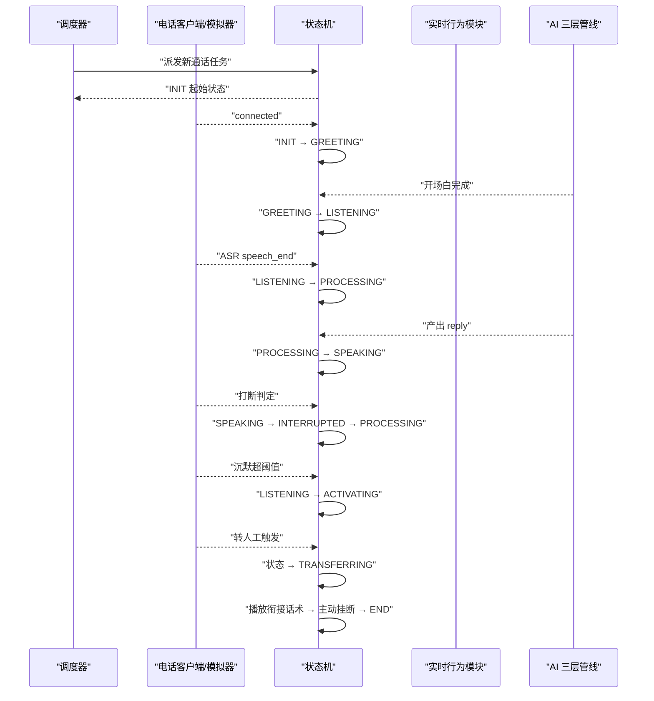
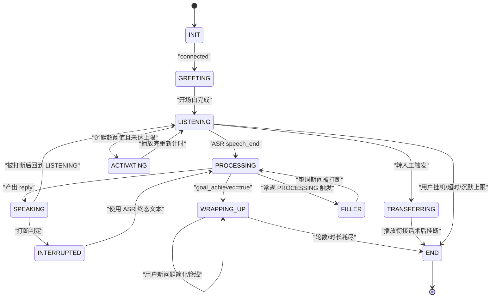
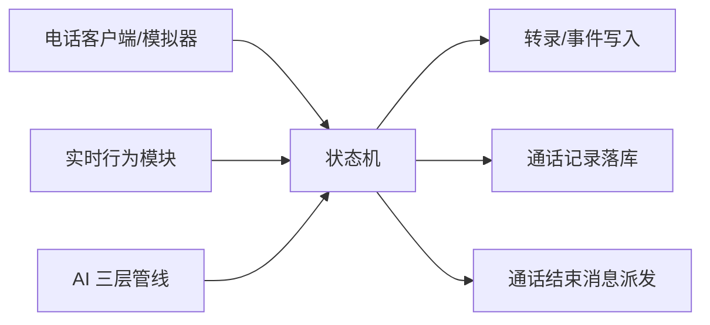

# 通话状态机

<cite>
**本文引用的文件**
- [通话状态机规范](file://openspec/specs/call-state-machine/spec.md)
- [AI 三层并行管线规范](file://openspec/specs/ai-pipeline/spec.md)
- [打断检测规范](file://openspec/specs/interruption-detection/spec.md)
- [垫词规范](file://openspec/specs/filler/spec.md)
- [沉默激活规范](file://openspec/specs/silence-activation/spec.md)
- [引擎实施提案（含状态机与管线架构）](file://openspec/changes/archive/2026-05-07-impl-engine/proposal.md)
</cite>

## 目录
1. [简介](#简介)
2. [项目结构](#项目结构)
3. [核心组件](#核心组件)
4. [架构总览](#架构总览)
5. [详细组件分析](#详细组件分析)
6. [依赖关系分析](#依赖关系分析)
7. [性能考量](#性能考量)
8. [故障排查指南](#故障排查指南)
9. [结论](#结论)
10. [附录](#附录)

## 简介
本文件面向 isales-engine 的单通通话状态机，系统化阐述状态集合、状态转换规则、事件驱动机制、与 AI 三层管线的协同关系，以及在不同通话场景下的状态流转策略。重点覆盖 GREETING、PROCESSING、SPEAKING、LISTENING、WRAPPING_UP 等核心状态的行为特征与转换条件，并给出状态转换图、事件处理流程与时序图，帮助开发者快速理解与扩展状态机。

## 项目结构
状态机相关设计与实现位于 openspec 规格文档与引擎实施提案中，核心文件如下：
- 通话状态机规范：定义状态集合、合法转移、异常处理与边界条件
- AI 三层并行管线规范：定义 PROCESSING 的三层编排与简化管线
- 打断检测规范：定义 SPEAKING 下的打断判定与连续打断保护
- 垫词规范：定义 FILLER 的触发与并行播放策略
- 沉默激活规范：定义 LISTENING 下的沉默检测与激活策略
- 引擎实施提案：给出状态机、会话、管线与实时行为模块的总体架构与职责边界

图表来源
- [引擎实施提案（含状态机与管线架构）:18-39](file://openspec/changes/archive/2026-05-07-impl-engine/proposal.md#L18-L39)

章节来源
- [通话状态机规范:1-190](file://openspec/specs/call-state-machine/spec.md#L1-L190)
- [引擎实施提案（含状态机与管线架构）:18-39](file://openspec/changes/archive/2026-05-07-impl-engine/proposal.md#L18-L39)

## 核心组件
- 状态机（state_machine.py）：定义 11 个状态与统一事件驱动 API，维护合法转移集合，非法转移抛出异常并写入 transcript
- 通话会话（call_session.py）：承载对话上下文（对话历史、完整转录、计数器、计时器、提示词版本快照等）
- 会话管理（session_manager.py）：进程内全局会话表，负责生命周期注册/注销与优雅停机
- AI 三层管线（pipeline/orchestrator.py 等）：并行角色 LLM + 裁判 + 润色，PROCESSING 完成后产出 reply
- 实时行为模块：打断检测、垫词管理、沉默检测、无进展计时器、转人工管理、收尾管理

章节来源
- [通话状态机规范:5-21](file://openspec/specs/call-state-machine/spec.md#L5-L21)
- [引擎实施提案（含状态机与管线架构）:18-39](file://openspec/changes/archive/2026-05-07-impl-engine/proposal.md#L18-L39)

## 架构总览
状态机作为 engine 的核心，统一接收来自调度器、硬件/模拟器、实时行为模块与管线的事件，驱动状态转换并写入 transcript。所有实时行为（打断、垫词、目标达成、转人工、沉默）均通过状态转换接入，形成“事件驱动 + 状态机”的统一控制面。

图表来源
- [通话状态机规范:50-108](file://openspec/specs/call-state-machine/spec.md#L50-L108)
- [引擎实施提案（含状态机与管线架构）:18-39](file://openspec/changes/archive/2026-05-07-impl-engine/proposal.md#L18-L39)

## 详细组件分析

### 状态集合与合法转移
- 状态集合：INIT、GREETING、LISTENING、SPEAKING、INTERRUPTED、FILLER、PROCESSING、WRAPPING_UP、ACTIVATING、TRANSFERRING、END
- 合法转移：状态机维护 LEGAL_TRANSITIONS，任何非法事件将抛出异常并在 transcript 中记录 state_error
- 起始与终止：INIT 为起始状态；进入 END 后不再发生状态转换，落库并派发通话结束消息

章节来源
- [通话状态机规范:5-21](file://openspec/specs/call-state-machine/spec.md#L5-L21)
- [通话状态机规范:23-31](file://openspec/specs/call-state-machine/spec.md#L23-L31)

### 核心状态行为与转换条件

#### GREETING（开场白）
- 触发：收到 connected 事件
- 行为：启动开场白 TTS 播放；结束后进入 LISTENING
- 特殊：开场白不走三层管线，直接写入对话历史

章节来源
- [通话状态机规范:50-58](file://openspec/specs/call-state-machine/spec.md#L50-L58)
- [AI 三层并行管线规范:131-148](file://openspec/specs/ai-pipeline/spec.md#L131-L148)

#### LISTENING（等待用户说话）
- 触发：ASR 上报 speech_end 且未达激活上限 → 进入 PROCESSING，同时启动垫词
- 沉默激活：沉默时长 ≥ 阈值且未达上限 → 进入 ACTIVATING
- 优先级：转人工触发优先于沉默激活

章节来源
- [通话状态机规范:65-68](file://openspec/specs/call-state-machine/spec.md#L65-L68)
- [沉默激活规范:7-25](file://openspec/specs/silence-activation/spec.md#L7-L25)
- [沉默激活规范:68-76](file://openspec/specs/silence-activation/spec.md#L68-L76)

#### SPEAKING（TTS 播放 AI 回复）
- 触发：PROCESSING 完成后进入 SPEAKING，播放 reply
- 打断：SPEAKING 下用户说话被判定为打断 → 立即停 TTS，进入 INTERRUPTED → PROCESSING
- 连续打断保护：达到上限后触发 short_reply 或 listen_only 策略

章节来源
- [通话状态机规范:60-63](file://openspec/specs/call-state-machine/spec.md#L60-L63)
- [打断检测规范:7-29](file://openspec/specs/interruption-detection/spec.md#L7-L29)
- [AI 三层并行管线规范:13-18](file://openspec/specs/ai-pipeline/spec.md#L13-L18)

#### PROCESSING（AI 三层管线运行中）
- 触发：LISTENING speech_end 后进入
- 行为：并行启动 N 个角色 LLM + 垫词；N×M 裁判审查；润色选优
- 结果：产出 reply（goal_achieved=false）→ SPEAKING；或 goal_achieved=true → SPEAKING（当前轮）→ WRAPPING_UP
- 简化管线：WRAPPING_UP 期间走单角色 + 润色，不启用 PK 与裁判

章节来源
- [通话状态机规范:70-78](file://openspec/specs/call-state-machine/spec.md#L70-L78)
- [AI 三层并行管线规范:7-18](file://openspec/specs/ai-pipeline/spec.md#L7-L18)
- [AI 三层并行管线规范:150-158](file://openspec/specs/ai-pipeline/spec.md#L150-L158)

#### WRAPPING_UP（目标达成后的收尾）
- 触发：PROCESSING 输出 goal_achieved=true 后进入
- 行为：双计数器（轮数/时长）控制；任一耗尽后播放挂断话术 → END
- 特殊：期间用户提出新问题走简化管线，不退回主管线

章节来源
- [通话状态机规范:75-83](file://openspec/specs/call-state-machine/spec.md#L75-L83)
- [AI 三层并行管线规范:150-158](file://openspec/specs/ai-pipeline/spec.md#L150-L158)

#### ACTIVATING（沉默激活话术播放）
- 触发：LISTENING 沉默超阈值且未达上限
- 行为：按顺序播放 silence_phrases；播放完重新计时
- 优先级：高于普通 LISTENING，但低于转人工

章节来源
- [通话状态机规范:85-88](file://openspec/specs/call-state-machine/spec.md#L85-L88)
- [沉默激活规范:7-29](file://openspec/specs/silence-activation/spec.md#L7-L29)

#### TRANSFERRING（转人工流程）
- 触发：任一转人工条件命中
- 行为：播放衔接话术 → 主动挂断 → END（reason=marked_for_handoff）
- 特殊：期间不调用 AI 管线，仅继续 ASR 补录最后一条 transcript

章节来源
- [通话状态机规范:95-98](file://openspec/specs/call-state-machine/spec.md#L95-L98)
- [引擎实施提案（含状态机与管线架构）:62-71](file://openspec/changes/archive/2026-05-07-impl-engine/proposal.md#L62-L71)

#### END（通话结束）
- 触发：挂断事件（用户/本端/超时/转人工）或 WRAPPING_UP 结束
- 行为：落库 call_record，派发通话结束消息；不再发生状态转换

章节来源
- [通话状态机规范:28-31](file://openspec/specs/call-state-machine/spec.md#L28-L31)
- [通话状态机规范:105-108](file://openspec/specs/call-state-machine/spec.md#L105-L108)

### 事件处理流程与时序图

#### 事件驱动 API 与非法转移兜底
- 统一事件驱动 API：session.transition_to(NEW_STATE, reason=...)
- 非法转移：抛出 IllegalTransition，写 transcript state_error 事件
- 可恢复 vs 不可恢复：部分事件可忽略（如 ASR partial），不可忽略时强制进入 END(reason=engine_internal_error)

章节来源
- [通话状态机规范](file://openspec/specs/call-state-machine/spec.md#L21)
- [通话状态机规范:33-44](file://openspec/specs/call-state-machine/spec.md#L33-L44)

#### 真硬件 URC 驱动状态转换
- 仅由 SerialATClient 翻译出的 ATEvent（经 IPC 上抛）触发状态转换
- ATD ACK 后状态停留在 INIT，等待 CONNECT URC 翻译的 connected 事件
- 远端 hangup_cause 透传到 END.reason；本端主动挂断 cause=manual_hangup 不进入 retry

章节来源
- [通话状态机规范:146-169](file://openspec/specs/call-state-machine/spec.md#L146-L169)

### 状态转换图

图表来源
- [通话状态机规范:50-108](file://openspec/specs/call-state-machine/spec.md#L50-L108)
- [打断检测规范:21-24](file://openspec/specs/interruption-detection/spec.md#L21-L24)
- [垫词规范:45-48](file://openspec/specs/filler/spec.md#L45-L48)
- [沉默激活规范:11-19](file://openspec/specs/silence-activation/spec.md#L11-L19)

### 与 AI 三层管线的交互关系
- PROCESSING：并行角色 LLM + 垫词同时启动；N×M 裁判审查；润色选优
- WRAPPING_UP：简化管线（单角色 + 润色），不启用 PK 与裁判
- GREETING：不走三层管线，直接 TTS 播放开场白并写入对话历史
- 管线失败/降级：仍写 pipeline_trace，标注 error 字段，不影响通话主路径

章节来源
- [AI 三层并行管线规范:7-18](file://openspec/specs/ai-pipeline/spec.md#L7-L18)
- [AI 三层并行管线规范:65-68](file://openspec/specs/ai-pipeline/spec.md#L65-L68)
- [AI 三层并行管线规范:131-148](file://openspec/specs/ai-pipeline/spec.md#L131-L148)

### 不同通话场景下的状态流转策略
- 正常对话：LISTENING → PROCESSING → SPEAKING 循环，期间可能穿插 FILLER
- 连续打断：达到上限后触发 short_reply 或 listen_only，完整轮次后计数器清零
- 沉默激活：多次激活后达到上限则挂断，激活话术不进入角色 LLM 上下文
- 转人工：优先级最高，直接进入 TRANSFERRING 并挂断
- 无进展挂断：用户一直说但被判定为非打断/无效内容超过阈值则挂断

章节来源
- [打断检测规范:35-52](file://openspec/specs/interruption-detection/spec.md#L35-L52)
- [沉默激活规范:68-81](file://openspec/specs/silence-activation/spec.md#L68-L81)
- [通话状态机规范:100-103](file://openspec/specs/call-state-machine/spec.md#L100-L103)

## 依赖关系分析
- 状态机依赖：实时行为模块（打断、垫词、沉默、转人工、无进展计时器）与 AI 管线产出
- 事件来源：调度器派发、电话客户端/模拟器上报、实时行为模块检测、管线完成事件
- 数据一致性：transcript、pipeline_trace、hangup_cause、call_record 等跨模块写入需遵循单一来源枚举与事件契约

图表来源
- [引擎实施提案（含状态机与管线架构）:92-106](file://openspec/changes/archive/2026-05-07-impl-engine/proposal.md#L92-L106)

章节来源
- [引擎实施提案（含状态机与管线架构）:92-106](file://openspec/changes/archive/2026-05-07-impl-engine/proposal.md#L92-L106)

## 性能考量
- 并行策略：PROCESSING 期间角色 LLM 与垫词并行启动，覆盖管线延迟，提升感知响应
- 失败兜底：pipeline_trace 写入失败不影响通话主路径，采用重试与降级策略
- 计时与阈值：沉默检测计时起点为 max(用户最后一次 speech_end, AI 上一轮 TTS 播完)，避免累计误差
- 简化管线：WRAPPING_UP 期间不启用 PK/裁判，降低延迟与资源占用

章节来源
- [AI 三层并行管线规范:9-11](file://openspec/specs/ai-pipeline/spec.md#L9-L11)
- [沉默激活规范:26-28](file://openspec/specs/silence-activation/spec.md#L26-L28)

## 故障排查指南
- 非法状态转移：检查 LEGAL_TRANSITIONS 与事件来源，确认是否为可忽略事件；必要时强制进入 END 并记录 state_error
- 管线异常：关注 pipeline_trace 的 error 字段与最终兜底策略，确保写入失败不影响通话
- 沉默激活异常：核对 silence_threshold_ms、max_silence_activations 与话术数组长度，确认是否达到上限
- 打断误判：检查打断白名单与最小时长阈值，评估连续打断保护策略（short_reply/listen_only）
- 转人工冲突：确认转人工优先级高于沉默激活，衔接话术播放期间不调用 AI 管线

章节来源
- [通话状态机规范:33-44](file://openspec/specs/call-state-machine/spec.md#L33-L44)
- [AI 三层并行管线规范:60-63](file://openspec/specs/ai-pipeline/spec.md#L60-L63)
- [沉默激活规范:68-76](file://openspec/specs/silence-activation/spec.md#L68-L76)
- [打断检测规范:35-52](file://openspec/specs/interruption-detection/spec.md#L35-L52)

## 结论
通话状态机以“事件驱动 + 统一 API”为核心，将实时行为与 AI 管线有机整合，形成稳定、可观测、可扩展的通话控制面。通过明确的合法转移、异常兜底与简化管线策略，状态机在复杂场景下仍能保持一致的用户体验与可运维性。

## 附录

### 开发者扩展与自定义指南
- 新增状态：在状态机中定义新状态，完善 LEGAL_TRANSITIONS，并在 transition_to 中写入对应事件
- 新增事件：统一通过 on_event 或模块内部事件上报，确保 transcript 与 pipeline_trace 一致性
- 自定义实时行为：遵循打断/垫词/沉默/转人工等模块接口契约，避免破坏状态机时序
- 配置管理：通过 campaign 级配置（如沉默阈值、激活上限、打断白名单）进行行为调节，避免硬编码

章节来源
- [通话状态机规范](file://openspec/specs/call-state-machine/spec.md#L21)
- [引擎实施提案（含状态机与管线架构）:18-39](file://openspec/changes/archive/2026-05-07-impl-engine/proposal.md#L18-L39)