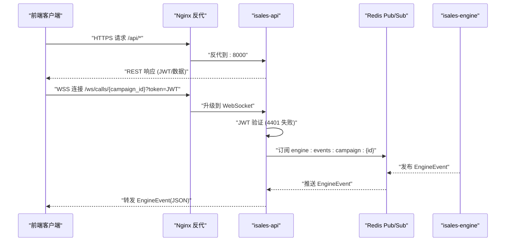
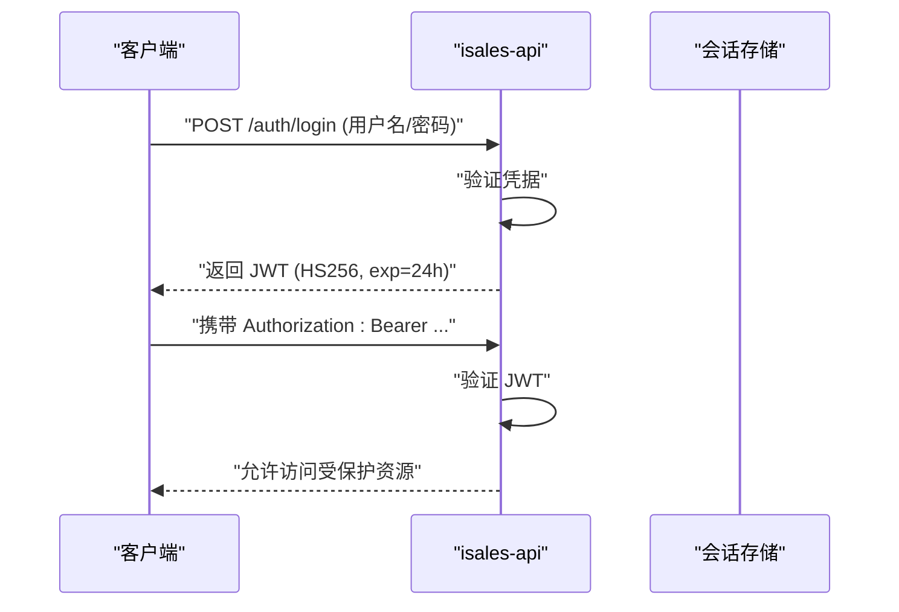
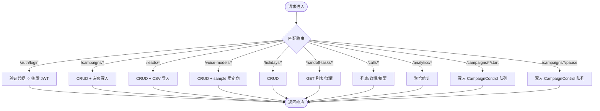
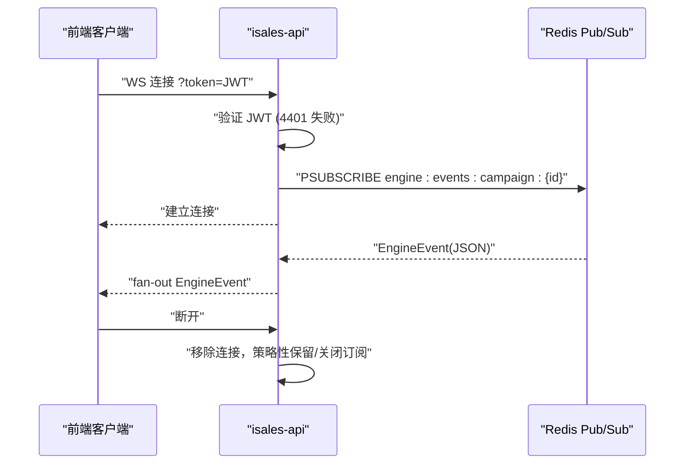
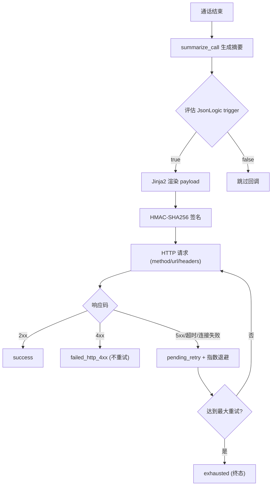
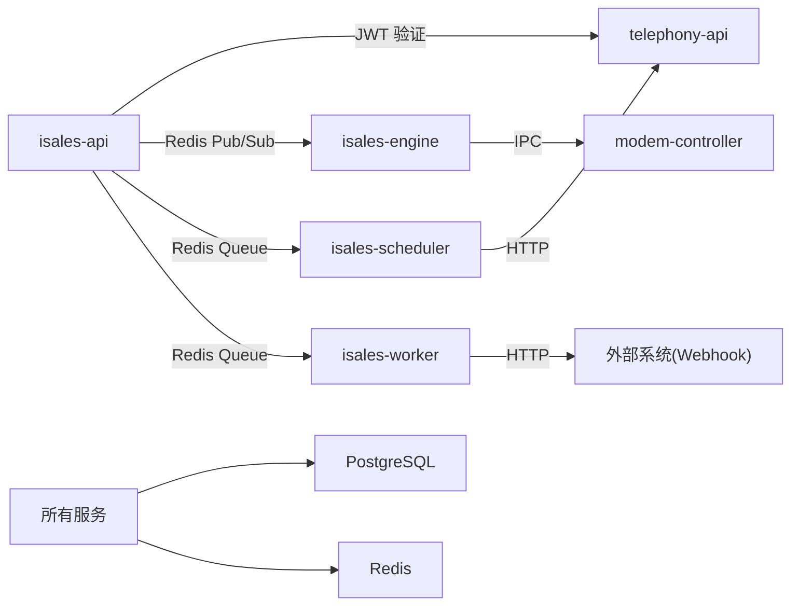

# API 参考文档

<cite>
**本文档引用的文件**
- [README.md](file://README.md)
- [DESIGN.md](file://DESIGN.md)
- [架构规范](file://openspec/specs/architecture/spec.md)
- [服务通信规范](file://openspec/specs/service-communication/spec.md)
- [消息契约规范](file://openspec/specs/message-contract/spec.md)
- [Webhook 回调规范](file://openspec/specs/webhook-callback/spec.md)
- [API 环境变量示例](file://deploy/env/api.env.example)
- [Nginx 反向代理配置](file://deploy/cloud/nginx/isales.conf)
- [2026-05-06 实施 API 设计](file://openspec/changes/archive/2026-05-06-impl-api/design.md)
- [2026-05-06 实施 API 任务](file://openspec/changes/archive/2026-05-06-impl-api/tasks.md)
- [2026-05-06 实施 API 提案](file://openspec/changes/archive/2026-05-06-impl-api/proposal.md)
- [2026-05-08 实施引擎设计](file://openspec/changes/archive/2026-05-08-impl-engine/design.md)
- [2026-05-08 实施引擎任务](file://openspec/changes/archive/2026-05-08-impl-engine/tasks.md)
- [2026-05-19 部署实施设计](file://openspec/changes/archive/2026-05-19-web-admin-deploy/specs/deployment-topology/spec.md)
- [2026-05-24 提供商凭据单点登录设计](file://openspec/changes/archive/2026-05-24-impl-provider-credential-db-ssot/specs/provider-credential/spec.md)
</cite>

## 目录
1. [简介](#简介)
2. [项目结构](#项目结构)
3. [核心组件](#核心组件)
4. [架构总览](#架构总览)
5. [详细组件分析](#详细组件分析)
6. [依赖关系分析](#依赖关系分析)
7. [性能考虑](#性能考虑)
8. [故障排查指南](#故障排查指南)
9. [结论](#结论)
10. [附录](#附录)

## 简介
本文件为 iSales API 的全面参考文档，涵盖 RESTful API 的 HTTP 方法与 URL 模式、请求/响应结构、认证方法；WebSocket 接口的连接处理、消息格式与事件类型；以及 Webhook 回调的触发条件、数据格式与处理流程。文档基于 OpenSpec 规范与实施变更记录，结合部署拓扑与环境配置，提供协议特定的示例、错误处理策略、安全考虑、速率限制与版本信息，并给出常见用例、客户端实现指南与性能优化技巧。

## 项目结构
iSales 采用 7 仓库微服务架构，isales-api 作为管理后台与 WebSocket 代理，负责：
- RESTful 管理 API（Campaign/Lead/Role/Voice/Analytics/Callback 等）
- WebSocket 通话事件代理（/ws/calls/{campaign_id}）
- 与 engine/scheduler/worker/telephony 的服务通信

```mermaid
graph TB
subgraph "前端"
WEB["Vue 3 前端 (isales-web)"]
end
subgraph "后端服务"
API["isales-api (FastAPI)"]
ENGINE["isales-engine (实时通话引擎)"]
SCHED["isales-scheduler (调度器)"]
WORKER["isales-worker (后台 worker)"]
TELEPHONY["isales-telephony (telephony-api + modem-controller)"]
end
subgraph "基础设施"
REDIS["Redis"]
PG["PostgreSQL"]
NGINX["Nginx 反向代理"]
end
WEB --> NGINX
NGINX --> API
API <- --> REDIS
API <- --> PG
API <- --> ENGINE
API <- --> SCHED
API <- --> WORKER
API <- --> TELEPHONY
ENGINE <- --> REDIS
SCHED <- --> REDIS
WORKER <- --> REDIS
TELEPHONY <- --> REDIS
```

**图表来源**
- [架构规范:130-168](file://openspec/specs/architecture/spec.md#L130-L168)
- [服务通信规范:11-24](file://openspec/specs/service-communication/spec.md#L11-L24)

**章节来源**
- [README.md:1-86](file://README.md#L1-L86)
- [DESIGN.md:1-75](file://DESIGN.md#L1-L75)

## 核心组件
- RESTful API：提供管理后台所需的资源 CRUD、认证、统计分析与控制指令。
- WebSocket 代理：将 engine 的实时事件通过 Redis Pub/Sub 转发至前端。
- Webhook 回调：在通话结束后异步触发外部系统，支持 JsonLogic 触发器、Jinja2 模板与 HMAC 签名。
- 服务通信：统一的 Redis 队列/订阅通道与消息契约，确保跨服务一致性。

**章节来源**
- [2026-05-06 实施 API 提案:9-46](file://openspec/changes/archive/2026-05-06-impl-api/proposal.md#L9-L46)
- [服务通信规范:11-24](file://openspec/specs/service-communication/spec.md#L11-L24)
- [消息契约规范:6-51](file://openspec/specs/message-contract/spec.md#L6-L51)

## 架构总览
iSales v1 采用单主机部署，7 个服务在同一主机运行，通过 Redis/PostgreSQL 共享状态与数据。API 作为唯一 JWT 签发方，前端通过 Nginx 反代访问 API 与 WebSocket。



**图表来源**
- [Nginx 反向代理配置](file://deploy/cloud/nginx/isales.conf)
- [服务通信规范:106-136](file://openspec/specs/service-communication/spec.md#L106-L136)
- [2026-05-06 实施 API 设计:41-45](file://openspec/changes/archive/2026-05-06-impl-api/design.md#L41-L45)

**章节来源**
- [架构规范:45-58](file://openspec/specs/architecture/spec.md#L45-L58)
- [Nginx 反向代理配置](file://deploy/cloud/nginx/isales.conf)

## 详细组件分析

### RESTful API

#### 认证与授权
- JWT 签发：POST /auth/login（HS256，24 小时过期，无刷新）
- 鉴权中间件：除 /auth/login、/health、/docs 外均需 JWT
- 共享密钥：ISALES_JWT_SECRET（isales-api 为唯一签发方）



**图表来源**
- [2026-05-06 实施 API 设计:32-39](file://openspec/changes/archive/2026-05-06-impl-api/design.md#L32-L39)
- [API 环境变量示例:11-13](file://deploy/env/api.env.example#L11-L13)

**章节来源**
- [2026-05-06 实施 API 提案:12-16](file://openspec/changes/archive/2026-05-06-impl-api/proposal.md#L12-L16)
- [2026-05-06 实施 API 设计:32-39](file://openspec/changes/archive/2026-05-06-impl-api/design.md#L32-L39)
- [API 环境变量示例:11-13](file://deploy/env/api.env.example#L11-L13)

#### 资源与端点概览
- Campaigns：CRUD + 嵌套写入（role_config/filler_set/callback_config）
- Leads：CRUD + CSV 批量导入
- Voice Models：CRUD + sample_url 重定向
- Holidays：CRUD
- Handoff Tasks：GET 列表/详情（v1 阶段 2 仅查询）
- Calls：列表/详情/摘要
- Analytics：接通率/目标达成率/时长分布
- Campaign 控制：POST /campaigns/{id}/start | /pause



**图表来源**
- [2026-05-06 实施 API 提案:18-31](file://openspec/changes/archive/2026-05-06-impl-api/proposal.md#L18-L31)
- [2026-05-06 实施 API 任务:23-53](file://openspec/changes/archive/2026-05-06-impl-api/tasks.md#L23-L53)

**章节来源**
- [2026-05-06 实施 API 任务:23-53](file://openspec/changes/archive/2026-05-06-impl-api/tasks.md#L23-L53)
- [2026-05-06 实施 API 提案:18-31](file://openspec/changes/archive/2026-05-06-impl-api/proposal.md#L18-L31)

#### 请求/响应模式与错误处理
- 统一返回：遵循 OpenAPI 文档自动生成
- 错误码：400/401/404/422/500 等标准语义
- 速率限制：未在 API 层内置，建议在 Nginx/网关层实现
- CORS：单源部署下无需 CORS 中间件

**章节来源**
- [服务通信规范:56-77](file://openspec/specs/service-communication/spec.md#L56-L77)
- [Nginx 反向代理配置](file://deploy/cloud/nginx/isales.conf)

### WebSocket 接口

#### 连接与鉴权
- URL：/ws/calls/{campaign_id}
- 方式：wss://.../ws/calls/{campaign_id}?token=<JWT>
- 鉴权：accept 前验证 JWT，失败返回 close code 4401
- 多客户端：共享 Redis 订阅，避免连接膨胀



**图表来源**
- [服务通信规范:106-136](file://openspec/specs/service-communication/spec.md#L106-L136)
- [2026-05-06 实施 API 设计:41-53](file://openspec/changes/archive/2026-05-06-impl-api/design.md#L41-L53)

**章节来源**
- [服务通信规范:106-136](file://openspec/specs/service-communication/spec.md#L106-L136)
- [2026-05-06 实施 API 设计:41-53](file://openspec/changes/archive/2026-05-06-impl-api/design.md#L41-L53)

#### 消息格式与事件类型
- 消息来源：engine → api Pub/Sub → WebSocket
- 消息类型：EngineEvent（discriminated union，按 type 字段分发）
- 消息形状：直接传递 EngineEvent JSON，前端按消息契约解析

**章节来源**
- [服务通信规范:132-146](file://openspec/specs/service-communication/spec.md#L132-L146)
- [消息契约规范:6-51](file://openspec/specs/message-contract/spec.md#L6-L51)

### Webhook 回调

#### 触发条件与流程
- 触发时机：通话结束后，先 summarize_call 生成摘要并二次校验，再 process_callbacks
- 触发器：JsonLogic 表达式（仅做 dry-run 校验，不写 DB/队列）
- 负载模板：Jinja2 sandbox 渲染（禁用危险能力）
- 签名：HMAC-SHA256，请求头包含 X-Isales-Signature 与 X-Isales-Timestamp
- 重试：指数退避 + 最大次数，失败状态机明确（pending_retry/exhausted/failed_render/failed_http_4xx/failed_http_5xx）



**图表来源**
- [Webhook 回调规范:5-133](file://openspec/specs/webhook-callback/spec.md#L5-L133)

**章节来源**
- [Webhook 回调规范:5-179](file://openspec/specs/webhook-callback/spec.md#L5-L179)

#### 数据模型与字段
- callback_config：trigger、url、method、headers、payload_template、retry_policy、signing_secret、timeout_seconds、enabled
- callback_log：status、request_body、response_code、response_body、retry_count、attempt_at、next_retry_at、error_message

**章节来源**
- [Webhook 回调规范:210-231](file://openspec/specs/webhook-callback/spec.md#L210-L231)

### Socket 通信与状态管理

#### 连接协议与数据帧
- WebSocket：标准协议，鉴权通过 query param 传递 JWT
- Redis Pub/Sub：engine 作为生产者 fire-and-forget 发布，api 作为消费者 fan-out 转发
- 消息序列化：JSON（便于调试），消息契约约束字段与版本

**章节来源**
- [服务通信规范:167-178](file://openspec/specs/service-communication/spec.md#L167-L178)
- [消息契约规范:76-85](file://openspec/specs/message-contract/spec.md#L76-L85)

#### 状态管理
- 连接集合：按 campaign_id 维护 Set[WebSocket]
- 订阅策略：共享订阅，客户端断开后按策略保留/关闭订阅
- 异常处理：发布失败不阻塞主流程，按 spec 处理 dead letter

**章节来源**
- [2026-05-08 实施引擎任务:99-107](file://openspec/changes/archive/2026-05-08-impl-engine/tasks.md#L99-L107)
- [2026-05-08 实施引擎设计:168-178](file://openspec/changes/archive/2026-05-08-impl-engine/design.md#L168-L178)

## 依赖关系分析



**图表来源**
- [服务通信规范:11-24](file://openspec/specs/service-communication/spec.md#L11-L24)
- [架构规范:130-168](file://openspec/specs/architecture/spec.md#L130-L168)

**章节来源**
- [服务通信规范:11-24](file://openspec/specs/service-communication/spec.md#L11-L24)
- [架构规范:59-72](file://openspec/specs/architecture/spec.md#L59-L72)

## 性能考虑
- WebSocket 连接管理：进程内 dict + asyncio.Queue，避免每个连接独立订阅 Redis，降低 Redis 连接数。
- Redis Pub/Sub：实时可丢失事件，发布失败不影响通话主路径。
- 并发控制：全局并发用 Redis 原子计数器，避免泄漏。
- 队列与订阅边界：必须送达用队列，实时事件用订阅。
- 前端路由：Nginx SPA fallback，避免不必要的后端压力。

**章节来源**
- [2026-05-06 实施 API 设计:47-53](file://openspec/changes/archive/2026-05-06-impl-api/design.md#L47-L53)
- [服务通信规范:31-44](file://openspec/specs/service-communication/spec.md#L31-L44)
- [服务通信规范:45-63](file://openspec/specs/service-communication/spec.md#L45-L63)

## 故障排查指南
- WebSocket 鉴权失败：检查 token 参数与 JWT 有效性，失败返回 4401。
- Redis 不可用：服务应重连重试；engine 中断重连期间拒绝新拨号但可完成当前通话。
- DB 不可用：重连重试；通话中状态缓存至 Redis（v2 优化）。
- Webhook 失败：根据状态机决定是否重试；4xx 不重试，5xx/超时重试，达到上限置 exhausted。
- Nginx 反代：确认 proxy_pass、Upgrade/Connection 头与超时配置。

**章节来源**
- [服务通信规范:87-105](file://openspec/specs/service-communication/spec.md#L87-L105)
- [Webhook 回调规范:100-133](file://openspec/specs/webhook-callback/spec.md#L100-L133)
- [Nginx 反向代理配置](file://deploy/cloud/nginx/isales.conf)

## 结论
iSales API 通过统一的 JWT 鉴权、标准化的服务通信与消息契约，实现了管理后台与实时事件的稳定接入。WebSocket 代理与 Webhook 回调分别满足前端实时监控与外部系统集成需求。部署层面采用 Nginx 反代与单主机架构，结合 Redis/PostgreSQL 共享，确保系统的一致性与可维护性。

## 附录

### 常见用例与最佳实践
- 客户端实现：前端使用 Axios 拦截器统一添加 Authorization，处理 401 跳转登录。
- WebSocket：前端按 EngineEvent discriminated union 解析，未知 type 仅警告跳过。
- Webhook：在创建/轮换 signing_secret 时一次性返回明文，后续仅返回掩码；触发器与模板通过辅助 API dry-run 校验。

**章节来源**
- [2026-05-06 实施 API 设计:41-45](file://openspec/changes/archive/2026-05-06-impl-api/design.md#L41-L45)
- [Webhook 回调规范:171-204](file://openspec/specs/webhook-callback/spec.md#L171-L204)

### 安全考虑
- JWT 密钥通过环境变量分发，不硬编码；HS256，24 小时过期。
- Webhook 签名使用 HMAC-SHA256，请求头包含时间戳，接收方可做重放防护。
- Jinja2 模板在沙盒环境渲染，禁用危险能力。
- CORS 在单源部署下无需配置，减少攻击面。

**章节来源**
- [架构规范:96-119](file://openspec/specs/architecture/spec.md#L96-L119)
- [Webhook 回调规范:68-99](file://openspec/specs/webhook-callback/spec.md#L68-L99)

### 版本与兼容性
- 消息契约：统一基类 BaseMessage，包含 schema_version、message_id、created_at。
- 消息演进：非破坏性变更可直接合入，破坏性变更需升版本并通过 OpenSpec 流程。
- WebSocket 事件：前端按 EngineEvent discriminated union 解析，未知 type 仅警告跳过。

**章节来源**
- [消息契约规范:25-66](file://openspec/specs/message-contract/spec.md#L25-L66)
- [服务通信规范:132-146](file://openspec/specs/service-communication/spec.md#L132-L146)