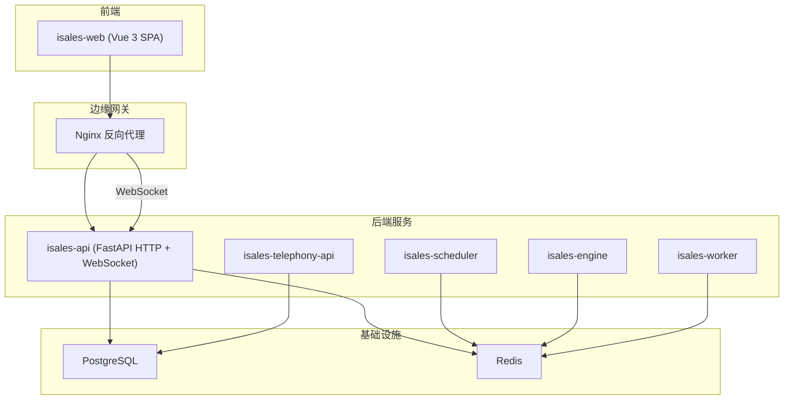
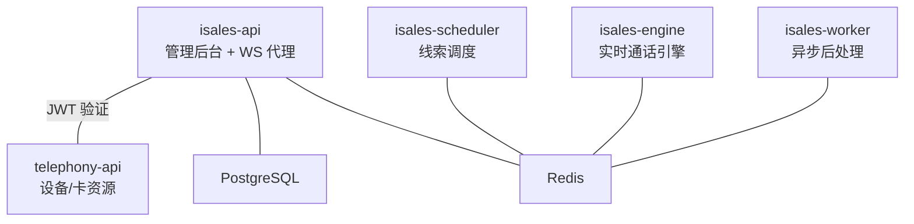
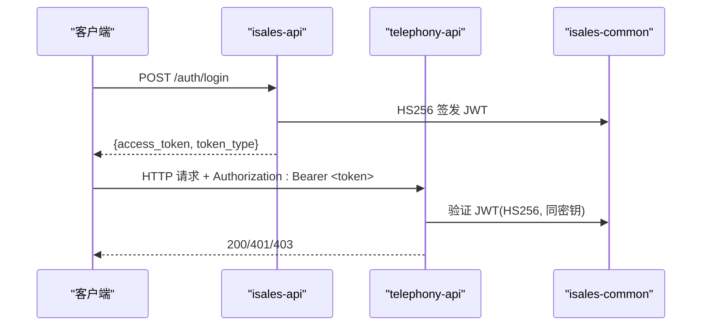
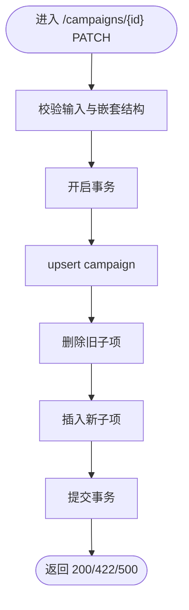
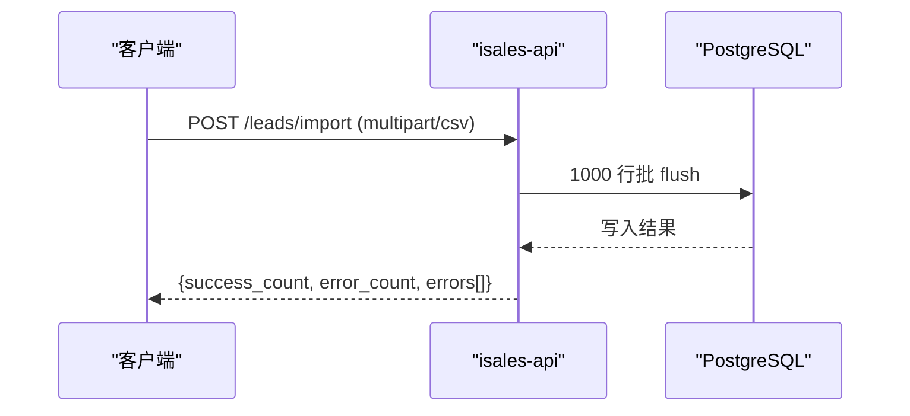
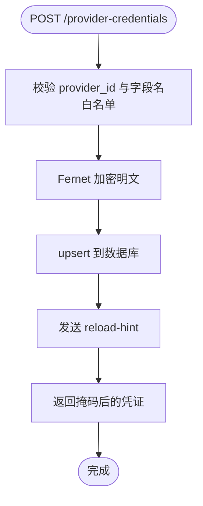
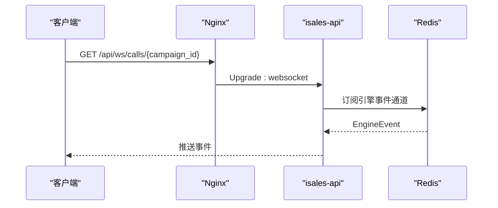
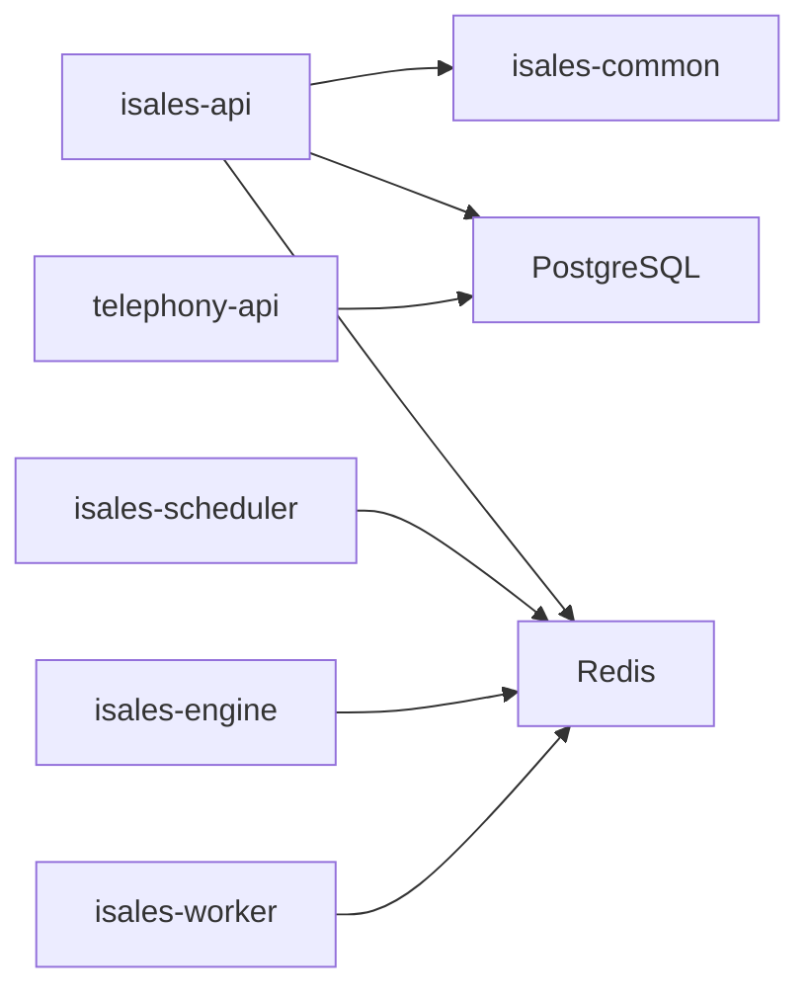

# RESTful API

<cite>
**本文引用的文件**
- [README.md](file://README.md)
- [deploy/README.md](file://deploy/README.md)
- [deploy/cloud/nginx/isales.conf](file://deploy/cloud/nginx/isales.conf)
- [deploy/cloud/env/api.env](file://deploy/cloud/env/api.env)
- [deploy/env/api.env.example](file://deploy/env/api.env.example)
- [openspec/specs/architecture/spec.md](file://openspec/specs/architecture/spec.md)
- [openspec/changes/archive/2026-05-06-impl-api/tasks.md](file://openspec/changes/archive/2026-05-06-impl-api/tasks.md)
- [openspec/changes/archive/2026-05-06-impl-api/design.md](file://openspec/changes/archive/2026-05-06-impl-api/design.md)
- [openspec/changes/archive/2026-05-22-web-admin-ui-redesign/tasks.md](file://openspec/changes/archive/2026-05-22-web-admin-ui-redesign/tasks.md)
- [openspec/changes/archive/2026-05-22-web-admin-ui-redesign/design.md](file://openspec/changes/archive/2026-05-22-web-admin-ui-redesign/design.md)
- [openspec/changes/archive/2026-05-23-web-admin-campaign-workflow/tasks.md](file://openspec/changes/archive/2026-05-23-web-admin-campaign-workflow/tasks.md)
- [openspec/changes/archive/2026-05-24-impl-provider-credential-db-ssot/tasks.md](file://openspec/changes/archive/2026-05-24-impl-provider-credential-db-ssot/tasks.md)
- [openspec/changes/archive/2026-05-24-impl-provider-credential-db-ssot/acceptance.md](file://openspec/changes/archive/2026-05-24-impl-provider-credential-db-ssot/acceptance.md)
- [openspec/changes/archive/2026-05-08-impl-engine-providers/design.md](file://openspec/changes/archive/2026-05-08-impl-engine-providers/design.md)
- [openspec/changes/archive/2026-05-08-impl-web-polish/proposal.md](file://openspec/changes/archive/2026-05-08-impl-web-polish/proposal.md)
- [openspec/changes/archive/2026-05-08-impl-web-polish/design.md](file://openspec/changes/archive/2026-05-08-impl-web-polish/design.md)
- [openspec/changes/archive/2026-05-09-prep-stage8-cleanup/proposal.md](file://openspec/changes/archive/2026-05-09-prep-stage8-cleanup/proposal.md)
</cite>

## 目录
1. [简介](#简介)
2. [项目结构](#项目结构)
3. [核心组件](#核心组件)
4. [架构总览](#架构总览)
5. [详细组件分析](#详细组件分析)
6. [依赖分析](#依赖分析)
7. [性能考虑](#性能考虑)
8. [故障排查指南](#故障排查指南)
9. [结论](#结论)
10. [附录](#附录)

## 简介
本文件为 iSales 管理后台 RESTful API 的权威参考文档。API 基于 FastAPI 实现，提供管理后台所需的核心资源操作能力，并通过 Nginx 反向代理对外提供统一入口。本文档覆盖：
- HTTP 方法、路径模式与路由规则
- 请求参数、查询字符串、请求体与响应结构
- 认证与授权机制（API Key、Bearer Token）
- 状态码、错误响应与异常处理
- 分页、过滤、排序与搜索
- 速率限制、缓存策略与版本控制
- curl 示例与常见客户端实现要点

## 项目结构
- API 服务位于 isales-api 仓库，采用 FastAPI + 异步架构，提供管理后台所需资源的 CRUD 与部分业务端点。
- Nginx 将 /api 与 /api/ws 路由分别代理至 isales-api 的 HTTP 与 WebSocket 端口。
- 环境变量集中于 /etc/isales/env/，其中 api.env 提供数据库、Redis、JWT 密钥等关键配置。

**图示来源**
- [deploy/README.md:14-49](file://deploy/README.md#L14-L49)
- [deploy/cloud/nginx/isales.conf:44-63](file://deploy/cloud/nginx/isales.conf#L44-L63)

**章节来源**
- [README.md:1-86](file://README.md#L1-L86)
- [deploy/README.md:1-112](file://deploy/README.md#L1-L112)
- [deploy/cloud/nginx/isales.conf:1-103](file://deploy/cloud/nginx/isales.conf#L1-L103)

## 核心组件
- 认证与授权
  - JWT 签发与验证：isales-api 为唯一签发方，telephony-api 仅验证；密钥通过环境变量分发。
  - 管理员账户：通过环境变量配置管理员用户名与密码哈希。
- 资源路由
  - campaigns：支持嵌套写入、分页、设备关联等。
  - leads：支持导入 CSV、分页与过滤。
  - voice_models：CRUD 与试听重定向。
  - holidays：节假日 CRUD。
  - handoff_tasks：列表与详情，状态动作待实现。
  - role_configs、prompt_versions、filler_sets：新增路由，支持分页与过滤。
  - provider_credentials：凭据 DB SSOT，支持白名单字段校验与掩码返回。
  - appointments：预约 CRUD 与状态机联动。
- WebSocket
  - /api/ws/calls/{campaign_id}：订阅引擎事件，用于实时 UI 更新。

**章节来源**
- [openspec/specs/architecture/spec.md:96-129](file://openspec/specs/architecture/spec.md#L96-L129)
- [openspec/changes/archive/2026-05-06-impl-api/tasks.md:15-39](file://openspec/changes/archive/2026-05-06-impl-api/tasks.md#L15-L39)
- [openspec/changes/archive/2026-05-22-web-admin-ui-redesign/tasks.md:7-23](file://openspec/changes/archive/2026-05-22-web-admin-ui-redesign/tasks.md#L7-L23)
- [openspec/changes/archive/2026-05-24-impl-provider-credential-db-ssot/tasks.md:22-27](file://openspec/changes/archive/2026-05-24-impl-provider-credential-db-ssot/tasks.md#L22-L27)

## 架构总览
- 服务边界与职责：isales-api 负责管理后台 CRUD 与 WS 代理；telephony-api 提供设备/卡相关资源；engine/scheduler/worker 负责通话与异步处理。
- 数据与缓存：统一 PostgreSQL 与 Redis；Redis 用于队列、Pub/Sub 与全局并发计数器。
- 内部鉴权：isales-api 为唯一 JWT 签发方，telephony-api 仅验证；服务间内部调用 v1 可免 JWT（需网络限制）。

**图示来源**
- [openspec/specs/architecture/spec.md:26-72](file://openspec/specs/architecture/spec.md#L26-L72)
- [openspec/specs/architecture/spec.md:96-129](file://openspec/specs/architecture/spec.md#L96-L129)

**章节来源**
- [openspec/specs/architecture/spec.md:1-168](file://openspec/specs/architecture/spec.md#L1-L168)

## 详细组件分析

### 认证与授权
- JWT 签发与验证
  - isales-api 为唯一签发方，telephony-api 仅验证。
  - 密钥通过环境变量 ISALES_JWT_SECRET 注入，禁止硬编码。
- 管理员账户
  - 通过环境变量配置管理员用户名与密码哈希。
- 授权策略
  - v1 为单角色管理员，所有路由对已认证用户可见。
  - 服务间内部调用 v1 可免 JWT（需网络限制）。

**图示来源**
- [openspec/specs/architecture/spec.md:96-129](file://openspec/specs/architecture/spec.md#L96-L129)
- [openspec/changes/archive/2026-05-06-impl-api/tasks.md:15-21](file://openspec/changes/archive/2026-05-06-impl-api/tasks.md#L15-L21)

**章节来源**
- [openspec/specs/architecture/spec.md:96-129](file://openspec/specs/architecture/spec.md#L96-L129)
- [openspec/changes/archive/2026-05-06-impl-api/tasks.md:15-21](file://openspec/changes/archive/2026-05-06-impl-api/tasks.md#L15-L21)
- [deploy/cloud/env/api.env:6-15](file://deploy/cloud/env/api.env#L6-L15)
- [deploy/env/api.env.example:9-14](file://deploy/env/api.env.example#L9-L14)

### campaigns 资源
- 路由与方法
  - GET /campaigns：分页列表
  - GET /campaigns/{id}：详情
  - POST /campaigns：创建
  - PATCH /campaigns/{id}：更新（支持嵌套写入）
  - DELETE /campaigns/{id}：删除（级联删除子表）
  - POST /campaigns/{id}/devices：批量写入设备关联
  - GET /campaigns/{id}/progress：按线索状态统计分布
- 嵌套写入
  - 单事务 upsert campaign + 删除旧子项 + 插入新子项。
  - 子表删除依赖 ON DELETE CASCADE。
- 过滤与分页
  - 列表支持分页；进度端点按线索状态聚合。

**图示来源**
- [openspec/changes/archive/2026-05-06-impl-api/tasks.md:23-31](file://openspec/changes/archive/2026-05-06-impl-api/tasks.md#L23-L31)

**章节来源**
- [openspec/changes/archive/2026-05-06-impl-api/tasks.md:23-31](file://openspec/changes/archive/2026-05-06-impl-api/tasks.md#L23-L31)

### leads 资源
- 路由与方法
  - GET /leads：分页列表（支持按 status、campaign_id 过滤）
  - GET /leads/{id}：详情
  - POST /leads：创建
  - PATCH /leads/{id}：更新
  - DELETE /leads/{id}：删除
  - POST /leads/import：CSV 导入（multipart/form-data），批量 1000 行 flush，返回部分成功。
- 错误处理
  - 缺少列返回 400；部分行错误返回 200 并包含错误明细。

**图示来源**
- [openspec/changes/archive/2026-05-06-impl-api/tasks.md:32-39](file://openspec/changes/archive/2026-05-06-impl-api/tasks.md#L32-L39)

**章节来源**
- [openspec/changes/archive/2026-05-06-impl-api/tasks.md:32-39](file://openspec/changes/archive/2026-05-06-impl-api/tasks.md#L32-L39)

### voice_models 资源
- 路由与方法
  - GET /voice-models：CRUD
  - GET /voice-models/{id}/sample：307 重定向到 sample_url。
- 试听
  - 前端通过 /voice-models/{id}/sample 获取音频地址进行播放。

**章节来源**
- [openspec/changes/archive/2026-05-06-impl-api/tasks.md:32-39](file://openspec/changes/archive/2026-05-06-impl-api/tasks.md#L32-L39)

### holidays 资源
- 路由与方法
  - GET /holidays：CRUD（本地节假日 DTO）。
- 用途
  - 与 time_windows 配合，决定拨号时间窗。

**章节来源**
- [openspec/changes/archive/2026-05-06-impl-api/tasks.md:32-39](file://openspec/changes/archive/2026-05-06-impl-api/tasks.md#L32-L39)

### handoff_tasks 资源
- 路由与方法
  - GET /handoff-tasks：列表（支持按 status 过滤）
  - GET /handoff-tasks/{id}：详情
  - pick-up / complete：返回 501（阶段 3 才实现）。
- 生命周期
  - 与 worker 阶段 3 协作。

**章节来源**
- [openspec/changes/archive/2026-05-06-impl-api/tasks.md:32-39](file://openspec/changes/archive/2026-05-06-impl-api/tasks.md#L32-L39)

### role_configs、prompt_versions、filler_sets 资源
- 路由与方法
  - role_configs：GET 列表（按 campaign_id + kind 过滤）/ CRUD
  - prompt_versions：CRUD（按 scope_type/scope_id 过滤），支持设 is_active（同作用域其余置 false）
  - filler_sets：CRUD（按 campaign_id 过滤），filler_phrase 嵌套于 filler_set
- 分页与过滤
  - 对齐 leads 的分页与过滤模式。

**章节来源**
- [openspec/changes/archive/2026-05-22-web-admin-ui-redesign/tasks.md:7-23](file://openspec/changes/archive/2026-05-22-web-admin-ui-redesign/tasks.md#L7-L23)

### provider_credentials 资源
- 路由与方法
  - GET /provider-credentials：列表（掩码返回）
  - GET /provider-credentials/{provider_id}：按提供商 ID 查询
  - POST /provider-credentials：upsert（DB 写入 + Fernet 加密）
  - DELETE /provider-credentials/{id}：删除
  - POST /provider-credentials/reload-hint：提示服务端重新装载凭据
- 字段白名单
  - 允许字段：api_key、app_key、app_token、endpoint、asr_endpoint、tts_endpoint、default_model、enabled。
  - 未知字段返回 422。
- 掩码返回
  - 敏感字段以掩码形式返回，前端不存储明文。
- 服务端装载
  - 启动阶段加载 CredentialStore，支持凭据轮换。

**图示来源**
- [openspec/changes/archive/2026-05-24-impl-provider-credential-db-ssot/tasks.md:22-27](file://openspec/changes/archive/2026-05-24-impl-provider-credential-db-ssot/tasks.md#L22-L27)
- [openspec/changes/archive/2026-05-24-impl-provider-credential-db-ssot/acceptance.md:58-71](file://openspec/changes/archive/2026-05-24-impl-provider-credential-db-ssot/acceptance.md#L58-L71)

**章节来源**
- [openspec/changes/archive/2026-05-24-impl-provider-credential-db-ssot/tasks.md:22-27](file://openspec/changes/archive/2026-05-24-impl-provider-credential-db-ssot/tasks.md#L22-L27)
- [openspec/changes/archive/2026-05-24-impl-provider-credential-db-ssot/acceptance.md:30-71](file://openspec/changes/archive/2026-05-24-impl-provider-credential-db-ssot/acceptance.md#L30-L71)

### appointments 资源
- 路由与方法
  - GET /appointments：列表（按 status/lead_id/time range 过滤）
  - POST /appointments：创建（含 lead 状态推进事务）
  - GET /appointments/{id}：详情
  - PATCH /appointments/{id}：字段编辑
  - PATCH /appointments/{id}/status：状态动作（action 枚举 + 状态机校验）
  - DELETE /appointments/{id}：删除
- 状态机与联动
  - 创建 appointment 将 lead 推进到 appointed；完成 appointment 推进到 visited；取消不回退 lead 状态。
  - 非法状态转移返回 409。

**章节来源**
- [openspec/changes/archive/2026-05-22-web-admin-ui-redesign/tasks.md:42-48](file://openspec/changes/archive/2026-05-22-web-admin-ui-redesign/tasks.md#L42-L48)
- [openspec/changes/archive/2026-05-22-web-admin-ui-redesign/design.md:130-144](file://openspec/changes/archive/2026-05-22-web-admin-ui-redesign/design.md#L130-L144)

### WebSocket 实时推送
- 路由
  - /api/ws/calls/{campaign_id}
- 用途
  - 订阅 Redis Pub/Sub，转发 EngineEvent，用于实时 UI 更新。
- 配置
  - Nginx 通过 /api/ws/ 代理至 isales-api 的 WebSocket 端口。

**图示来源**
- [openspec/changes/archive/2026-05-06-impl-api/design.md:13-20](file://openspec/changes/archive/2026-05-06-impl-api/design.md#L13-L20)
- [deploy/cloud/nginx/isales.conf:54-63](file://deploy/cloud/nginx/isales.conf#L54-L63)

**章节来源**
- [openspec/changes/archive/2026-05-06-impl-api/design.md:13-20](file://openspec/changes/archive/2026-05-06-impl-api/design.md#L13-L20)
- [deploy/cloud/nginx/isales.conf:54-63](file://deploy/cloud/nginx/isales.conf#L54-L63)

## 依赖分析
- 服务依赖
  - isales-api 依赖 isales-common 提供模型与工具；数据库与 Redis 由统一实例提供。
- 服务间通信
  - Redis 用于队列与 Pub/Sub；scheduler→engine、engine→worker、api→scheduler 的消息传递。
- 内部鉴权
  - isales-api 为唯一 JWT 签发方；telephony-api 仅验证；服务间内部调用 v1 可免 JWT（需网络限制）。

**图示来源**
- [openspec/specs/architecture/spec.md:26-72](file://openspec/specs/architecture/spec.md#L26-L72)
- [openspec/specs/architecture/spec.md:96-129](file://openspec/specs/architecture/spec.md#L96-L129)

**章节来源**
- [openspec/specs/architecture/spec.md:26-72](file://openspec/specs/architecture/spec.md#L26-L72)
- [openspec/specs/architecture/spec.md:96-129](file://openspec/specs/architecture/spec.md#L96-L129)

## 性能考虑
- 分页与过滤
  - leads 列表支持分页与过滤；前端建议使用 limit/offset + total 计数。
- 并发控制
  - Redis 全局并发计数器，原子 INCR/DECR，超过上限拒绝。
- 缓存与队列
  - Redis 用于队列与 Pub/Sub；可结合缓存策略减少重复计算。
- WebSocket
  - Nginx 为 WebSocket 设置长超时，保证实时事件推送。

**章节来源**
- [openspec/changes/archive/2026-05-08-impl-web-polish/proposal.md:64-67](file://openspec/changes/archive/2026-05-08-impl-web-polish/proposal.md#L64-L67)
- [openspec/changes/archive/2026-05-08-impl-web-polish/design.md:82-106](file://openspec/changes/archive/2026-05-08-impl-web-polish/design.md#L82-L106)
- [openspec/changes/archive/2026-05-06-impl-scheduler/tasks.md:33-38](file://openspec/changes/archive/2026-05-06-impl-scheduler/tasks.md#L33-L38)
- [deploy/cloud/nginx/isales.conf:54-63](file://deploy/cloud/nginx/isales.conf#L54-L63)

## 故障排查指南
- 认证失败
  - 401 未提供或无效令牌；确认 Authorization: Bearer <token> 与密钥一致。
- JWT 验证失败
  - HS256 校验失败或过期；检查 ISALES_JWT_SECRET 是否一致。
- 409 冲突
  - 状态机非法转移；检查状态枚举与转换规则。
- Provider 异常
  - 429 限流、5xx 服务端错误、超时、400/422 请求无效等；按 ProviderError 分类处理。
- 导入失败
  - CSV 缺列返回 400；部分行错误返回 200 并包含错误明细。

**章节来源**
- [openspec/changes/archive/2026-05-08-impl-engine-providers/design.md:78-89](file://openspec/changes/archive/2026-05-08-impl-engine-providers/design.md#L78-L89)
- [openspec/changes/archive/2026-05-22-web-admin-ui-redesign/design.md:130-144](file://openspec/changes/archive/2026-05-22-web-admin-ui-redesign/design.md#L130-L144)
- [openspec/changes/archive/2026-05-06-impl-api/tasks.md:32-39](file://openspec/changes/archive/2026-05-06-impl-api/tasks.md#L32-L39)

## 结论
本文档基于 OpenSpec 规范与实现任务清单，梳理了 iSales 管理后台 RESTful API 的核心能力、路由与鉴权策略、错误处理与性能建议。实际生产部署中，请严格遵循环境变量一致性与安全最佳实践，确保 JWT 密钥与敏感配置的安全管理。

## 附录

### 认证与授权
- JWT 签发与验证
  - 签发方：isales-api
  - 验证方：telephony-api
  - 密钥来源：环境变量 ISALES_JWT_SECRET
- 管理员账户
  - 环境变量：ISALES_ADMIN_USER、ISALES_ADMIN_PASSWORD_HASH

**章节来源**
- [openspec/specs/architecture/spec.md:96-129](file://openspec/specs/architecture/spec.md#L96-L129)
- [deploy/cloud/env/api.env:9-11](file://deploy/cloud/env/api.env#L9-L11)
- [deploy/env/api.env.example:12-14](file://deploy/env/api.env.example#L12-L14)

### 状态码与错误响应
- 通用错误
  - 400：请求参数缺失或格式错误
  - 401：未认证或令牌无效
  - 403：权限不足
  - 404：资源不存在
  - 409：状态冲突（如非法状态转移）
  - 422：字段校验失败
  - 429：请求过于频繁（Provider 限流）
  - 5xx：服务端错误
- Provider 异常分类
  - 429 → ProviderRateLimited
  - 5xx / 连接错误 / DNS / SSL 错误 → ProviderServerError
  - 超时 → ProviderTimeout
  - 401/403/400/422/其他 4xx → ProviderInvalidRequest
  - 响应非 JSON / 缺字段 → ProviderInvalidRequest

**章节来源**
- [openspec/changes/archive/2026-05-08-impl-engine-providers/design.md:78-89](file://openspec/changes/archive/2026-05-08-impl-engine-providers/design.md#L78-L89)

### 分页、过滤、排序与搜索
- 分页
  - leads 列表支持 limit/offset + total 计数；前端建议使用 el-pagination。
- 过滤
  - leads：status、campaign_id
  - role_configs：campaign_id、kind
  - prompt_versions：scope_type、scope_id
  - filler_sets：campaign_id
  - handoff_tasks：status
  - appointments：status、lead_id、时间范围
- 排序与搜索
  - 未在上述任务清单中明确列出；如需请参考具体路由实现。

**章节来源**
- [openspec/changes/archive/2026-05-06-impl-api/tasks.md:32-39](file://openspec/changes/archive/2026-05-06-impl-api/tasks.md#L32-L39)
- [openspec/changes/archive/2026-05-22-web-admin-ui-redesign/tasks.md:7-23](file://openspec/changes/archive/2026-05-22-web-admin-ui-redesign/tasks.md#L7-L23)
- [openspec/changes/archive/2026-05-08-impl-web-polish/proposal.md:64-67](file://openspec/changes/archive/2026-05-08-impl-web-polish/proposal.md#L64-L67)

### 速率限制、缓存策略与版本控制
- 速率限制
  - Provider 侧 429 限流；Redis 全局并发计数器用于服务端限流。
- 缓存策略
  - Redis 用于队列与 Pub/Sub；可结合缓存减少重复计算。
- 版本控制
  - 未在本文档涉及；如需请参考部署与发布流程。

**章节来源**
- [openspec/changes/archive/2026-05-06-impl-scheduler/tasks.md:33-38](file://openspec/changes/archive/2026-05-06-impl-scheduler/tasks.md#L33-L38)

### curl 示例与常见客户端实现要点
- 登录获取 JWT
  - curl -X POST https://<domain>/api/auth/login -H "Content-Type: application/x-www-form-urlencoded" -d "username=<admin>&password=<pwd>"
- 获取当前用户
  - curl -H "Authorization: Bearer <token>" https://<domain>/api/auth/me
- 列出 campaigns
  - curl -H "Authorization: Bearer <token>" https://<domain>/api/campaigns?page=1&page_size=50
- 导入 leads
  - curl -X POST https://<domain>/api/leads/import -H "Authorization: Bearer <token>" -F "file=@leads.csv"
- 获取 voice-model sample
  - curl -L https://<domain>/api/voice-models/{id}/sample
- WebSocket
  - 使用 wscat 或浏览器 WebSocket API 连接 wss://<domain>/api/ws/calls/{campaign_id}

**章节来源**
- [openspec/changes/archive/2026-05-06-impl-api/tasks.md:15-21](file://openspec/changes/archive/2026-05-06-impl-api/tasks.md#L15-L21)
- [openspec/changes/archive/2026-05-06-impl-api/tasks.md:32-39](file://openspec/changes/archive/2026-05-06-impl-api/tasks.md#L32-L39)
- [deploy/cloud/nginx/isales.conf:44-63](file://deploy/cloud/nginx/isales.conf#L44-L63)