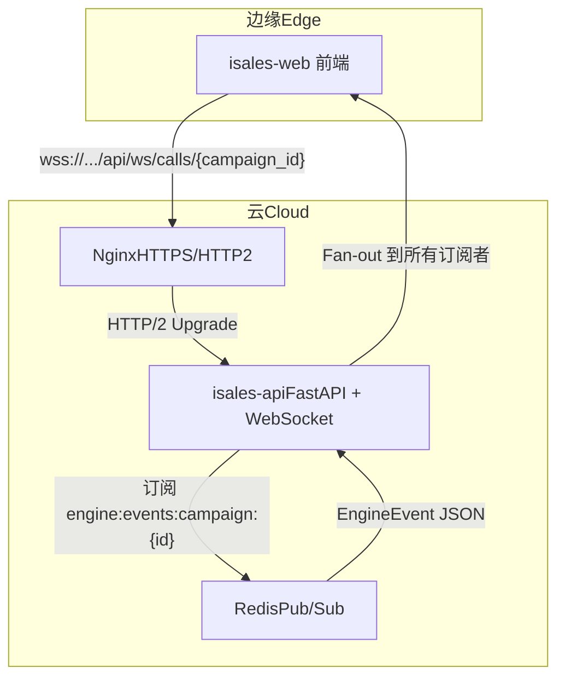
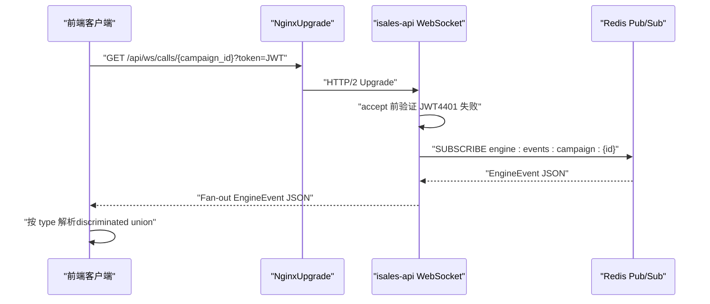
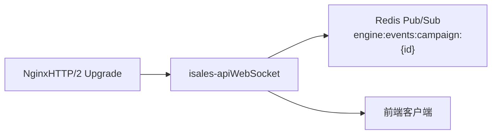

# WebSocket API

<cite>
**本文引用的文件**
- [service-communication 规格（v1）](file://openspec/specs/service-communication/spec.md)
- [service-communication 规格（云-边拆分）](file://openspec/changes/arch-cloud-edge-split/specs/service-communication/spec.md)
- [message-contract 规格](file://openspec/specs/message-contract/spec.md)
- [call-state-machine 规格](file://openspec/specs/call-state-machine/spec.md)
- [transcript 规格](file://openspec/specs/transcript/spec.md)
- [isales.conf（Nginx）](file://deploy/cloud/nginx/isales.conf)
- [isales-api systemd 服务](file://deploy/cloud/systemd/isales-api.service)
- [实施计划（含 WebSocket 路由）](file://IMPLEMENTATION_PLAN.md)
- [设计决策（JWT、WS 鉴权、连接管理）](file://openspec/changes/archive/2026-05-06-impl-api/design.md)
</cite>

## 目录
1. [简介](#简介)
2. [项目结构](#项目结构)
3. [核心组件](#核心组件)
4. [架构总览](#架构总览)
5. [详细组件分析](#详细组件分析)
6. [依赖分析](#依赖分析)
7. [性能考虑](#性能考虑)
8. [故障排查指南](#故障排查指南)
9. [结论](#结论)
10. [附录](#附录)

## 简介
本文件为 iSales WebSocket API 的权威参考文档，面向前后端与平台集成开发者，系统阐述：
- WebSocket 连接建立、握手协议与连接参数
- 消息格式规范（EngineEvent 类型、字段定义、序列化/反序列化）
- 实时事件类型（通话状态、ASR 文本流、转录增量等）
- 连接管理策略（鉴权、心跳、重连、断开处理）
- 订阅机制（按 campaign_id 订阅）
- 版本兼容与演进规则
- 客户端连接示例、消息收发与错误处理最佳实践
- 并发连接限制与性能优化建议

## 项目结构
iSales WebSocket API 位于 isales-api 服务，通过 FastAPI 提供 /ws/calls/{campaign_id} WebSocket 端点，并由 Nginx 以 HTTP/2 升级的方式代理到后端。

图表来源
- [isales.conf（Nginx）:54-63](file://deploy/cloud/nginx/isales.conf#L54-L63)
- [service-communication 规格（v1）:106-110](file://openspec/specs/service-communication/spec.md#L106-L110)
- [实施计划（含 WebSocket 路由）](file://IMPLEMENTATION_PLAN.md#L138)

章节来源
- [isales.conf（Nginx）:1-103](file://deploy/cloud/nginx/isales.conf#L1-L103)
- [service-communication 规格（v1）:106-110](file://openspec/specs/service-communication/spec.md#L106-L110)
- [实施计划（含 WebSocket 路由）](file://IMPLEMENTATION_PLAN.md#L138)

## 核心组件
- WebSocket 服务端（isales-api）
  - 路由：/ws/calls/{campaign_id}
  - 订阅：Redis Pub/Sub channel engine:events:campaign:{id}
  - Fan-out：将 EngineEvent JSON 直传给所有订阅该 campaign 的连接
- Nginx 代理
  - 通过 HTTP/2 Upgrade 协议升级 WebSocket
  - 设置长超时以适配心跳与长连接
- 客户端（isales-web）
  - 通过 JWT 鉴权参数 ?token=<JWT> 连接
  - 使用 TypeScript discriminated union 解析 EngineEvent.type

章节来源
- [service-communication 规格（v1）:106-110](file://openspec/specs/service-communication/spec.md#L106-L110)
- [isales.conf（Nginx）:54-63](file://deploy/cloud/nginx/isales.conf#L54-L63)
- [设计决策（JWT、WS 鉴权、连接管理）:41-46](file://openspec/changes/archive/2026-05-06-impl-api/design.md#L41-L46)

## 架构总览
WebSocket 通道在云内使用 Redis Pub/Sub 作为事件总线，EngineEvent JSON 由引擎侧发布，API 服务订阅并 fan-out 给前端。v1 单实例部署，多客户端订阅同一 campaign 时共享一个 Redis 订阅，避免连接膨胀。

图表来源
- [service-communication 规格（v1）:112-125](file://openspec/specs/service-communication/spec.md#L112-L125)
- [isales.conf（Nginx）:54-63](file://deploy/cloud/nginx/isales.conf#L54-L63)
- [设计决策（JWT、WS 鉴权、连接管理）:41-46](file://openspec/changes/archive/2026-05-06-impl-api/design.md#L41-L46)

章节来源
- [service-communication 规格（v1）:106-130](file://openspec/specs/service-communication/spec.md#L106-L130)
- [isales.conf（Nginx）:54-63](file://deploy/cloud/nginx/isales.conf#L54-L63)

## 详细组件分析

### 连接建立与握手
- 地址与路径
  - wss://<domain>/api/ws/calls/{campaign_id}
- 鉴权参数
  - ?token=<JWT>（查询参数）
  - 服务端在 accept 前验证 JWT，失败立即关闭并返回 4401
- 升级协议
  - Nginx 以 HTTP/2 Upgrade 协议转发到 isales-api
  - 代理设置长超时（读/写 3600s）以支持心跳与长连接
- 单实例限制
  - v1 部署 isales-api 单实例运行，多实例扩展需 OpenSpec 变更提案

章节来源
- [service-communication 规格（v1）:112-130](file://openspec/specs/service-communication/spec.md#L112-L130)
- [isales.conf（Nginx）:54-63](file://deploy/cloud/nginx/isales.conf#L54-L63)
- [设计决策（JWT、WS 鉴权、连接管理）:41-46](file://openspec/changes/archive/2026-05-06-impl-api/design.md#L41-L46)

### 消息格式与序列化
- 消息来源与形状
  - 服务端直接转发 EngineEvent JSON（不重新包装）
  - 前端使用 TypeScript discriminated union（按 type 字段）解析
- 序列化/反序列化
  - 生产者：Pydantic 模型使用 .model_dump_json() 序列化
  - 消费者：Pydantic 模型使用 model_validate_json() 反序列化
  - 基类包含 schema_version、message_id、created_at
- 版本兼容
  - 非破坏性变更可直接合入，schema_version 不变
  - 破坏性变更需升 schema_version，并在迁移期内同时支持新旧两版
- EngineEvent 类型
  - EngineEvent 为鉴别联合（discriminated union），前端按 type 分发
  - 新事件类型需经 OpenSpec change 同步到 isales-common 的 union，前端再处理

章节来源
- [service-communication 规格（v1）:132-145](file://openspec/specs/service-communication/spec.md#L132-L145)
- [message-contract 规格:10-18](file://openspec/specs/message-contract/spec.md#L10-L18)
- [message-contract 规格:25-37](file://openspec/specs/message-contract/spec.md#L25-L37)
- [message-contract 规格:53-65](file://openspec/specs/message-contract/spec.md#L53-L65)

### 实时事件类型与数据模型
- 事件类型（摘自 transcript 规格）
  - greeting、user_speech、ai_reply、interruption、filler、default_reply_used、silence_activation、transfer_initiated、transfer_marked、goal_achieved、wrap_up_started、wrap_up_completed、hangup
- 字段约束
  - 通用字段：type（string）、ts（相对通话开始的毫秒数）
  - 事件特有字段：参见 transcript 规格的事件类型枚举与字段定义
- 通话状态与 ASR 文本流
  - 状态：INIT、GREETING、LISTENING、SPEAKING、INTERRUPTED、FILLER、PROCESSING、WRAPPING_UP、ACTIVATING、TRANSFERRING、END
  - ASR 文本：LISTENING → PROCESSING（ASR 终态）；打断检测 → SPEAKING（TTS）或 FILLER（垫词）
- 转录增量
  - full_transcript 包含所有事件（含状态变化与系统话术）
  - dialog_history 仅包含对话相关事件（greeting、user_speech、ai_reply）

章节来源
- [transcript 规格:24-56](file://openspec/specs/transcript/spec.md#L24-L56)
- [transcript 规格:58-75](file://openspec/specs/transcript/spec.md#L58-L75)
- [call-state-machine 规格:4-21](file://openspec/specs/call-state-machine/spec.md#L4-L21)

### 订阅机制
- 订阅频道
  - Redis Pub/Sub channel：engine:events:campaign:{id}
- 多客户端共享订阅
  - 多个前端客户端订阅同一 campaign_id 时，服务端共享一个 Redis 订阅，fan-out 给所有连接
  - 避免为每个 WS 连接独立订阅 Redis，防止 Redis 连接膨胀
- 客户端断开
  - 服务端从该 campaign 的连接集合移除
  - 当某 campaign 无连接时可保留或关闭订阅（实现策略由实现决定）

章节来源
- [service-communication 规格（v1）:117-125](file://openspec/specs/service-communication/spec.md#L117-L125)

### 连接管理策略
- 鉴权
  - ?token=<JWT>，服务端 accept 前验证，失败返回 4401
- 心跳
  - 云-边 gRPC 心跳（30s）与 WS 心跳（实现中）：WS 心跳由实现负责，建议采用应用层 ping/pong 或利用底层 HTTP/2 心跳
- 重连逻辑
  - 建议指数退避重连，最大等待时间不超过 30s
  - 重连后根据 last_seen_ts 或游标（如需）恢复订阅
- 错误处理
  - 未知 type：仅 console.warn 并跳过，不中断连接
  - 字段缺失/类型错：仅 console.warn 跳过
  - 4401：认证失败，提示重新登录
  - Redis/DB 不可用：重连重试（带退避），期间优雅降级

章节来源
- [service-communication 规格（v1）:112-145](file://openspec/specs/service-communication/spec.md#L112-L145)
- [service-communication 规格（云-边拆分）:152-155](file://openspec/changes/arch-cloud-edge-split/specs/service-communication/spec.md#L152-L155)

### 客户端连接示例与最佳实践
- 连接示例
  - wss://<domain>/api/ws/calls/{campaign_id}?token=<JWT>
- 消息收发
  - 发送：按 EngineEvent JSON 结构发送（由后端 fan-out，前端解析）
  - 接收：按 type 字段进行 discriminated union 解析
- 错误处理最佳实践
  - 对未知 type 仅 warn 并跳过，不中断连接
  - 对字段缺失/类型错仅 warn 并跳过
  - 4401 关闭后提示重新登录并携带最新 token
  - 重连采用指数退避，避免雪崩

章节来源
- [service-communication 规格（v1）:137-145](file://openspec/specs/service-communication/spec.md#L137-L145)
- [设计决策（JWT、WS 鉴权、连接管理）:41-46](file://openspec/changes/archive/2026-05-06-impl-api/design.md#L41-L46)

## 依赖分析
- 云内通信
  - isales-api 通过 Redis Pub/Sub 接收 engine:events:campaign:{id}，fan-out 到前端
- 代理与路由
  - Nginx 以 HTTP/2 Upgrade 代理到 isales-api，设置长超时
- 单实例限制
  - v1 部署 isales-api 单实例运行，多实例扩展需 OpenSpec 变更提案

图表来源
- [isales.conf（Nginx）:54-63](file://deploy/cloud/nginx/isales.conf#L54-L63)
- [service-communication 规格（v1）:106-110](file://openspec/specs/service-communication/spec.md#L106-L110)

章节来源
- [isales.conf（Nginx）:54-63](file://deploy/cloud/nginx/isales.conf#L54-L63)
- [service-communication 规格（v1）:127-130](file://openspec/specs/service-communication/spec.md#L127-L130)

## 性能考虑
- 并发连接限制
  - v1 单实例，进程内维护每 campaign_id 的连接集合
  - 多客户端订阅同一 campaign 时共享 Redis 订阅，避免连接膨胀
- 超时与心跳
  - Nginx 代理设置长超时（读/写 3600s），适配心跳与长连接
  - 建议应用层心跳（ping/pong）或利用 HTTP/2 心跳
- Fan-out 与内存
  - 进程内维护连接集合，fan-out 使用 asyncio.Queue 解耦订阅者与转发者
- 序列化与可观测性
  - 使用 Pydantic 序列化，日志包含 message_id，便于跨服务追踪

章节来源
- [service-communication 规格（v1）:117-125](file://openspec/specs/service-communication/spec.md#L117-L125)
- [isales.conf（Nginx）:54-63](file://deploy/cloud/nginx/isales.conf#L54-L63)
- [message-contract 规格:76-83](file://openspec/specs/message-contract/spec.md#L76-L83)

## 故障排查指南
- 4401 未授权
  - 检查 token 是否有效、是否过期、是否携带正确
- 连接频繁断开
  - 检查心跳策略与代理超时设置，确认客户端实现应用层心跳
- 消息缺失/字段错误
  - 前端仅 warn 并跳过，不中断连接；检查后端 EngineEvent 类型与字段是否符合 message-contract
- Redis 不可用
  - 各服务重连重试（带退避）；engine 中断重连期间不接受新拨号但可完成当前通话
- systemd 与进程健康
  - isales-api 服务单实例运行，重启后需确保连接集合与订阅状态恢复

章节来源
- [service-communication 规格（v1）:112-145](file://openspec/specs/service-communication/spec.md#L112-L145)
- [isales-api systemd 服务:1-35](file://deploy/cloud/systemd/isales-api.service#L1-L35)

## 结论
iSales WebSocket API 以 Redis Pub/Sub 为核心，提供云内实时事件推送能力。v1 单实例部署、共享订阅与严格的消息契约（EngineEvent JSON、discriminated union、Pydantic 序列化）确保了稳定性与可演进性。建议在生产中完善应用层心跳与指数退避重连，并遵循 OpenSpec 变更流程引入新事件类型。

## 附录
- 术语
  - EngineEvent：引擎侧发布的通话事件 JSON
  - campaign_id：活动标识，用于订阅频道与连接集合
- 参考
  - message-contract 规格：消息基类、版本字段、序列化/反序列化
  - transcript 规格：事件类型与字段定义
  - call-state-machine 规格：通话状态与转换