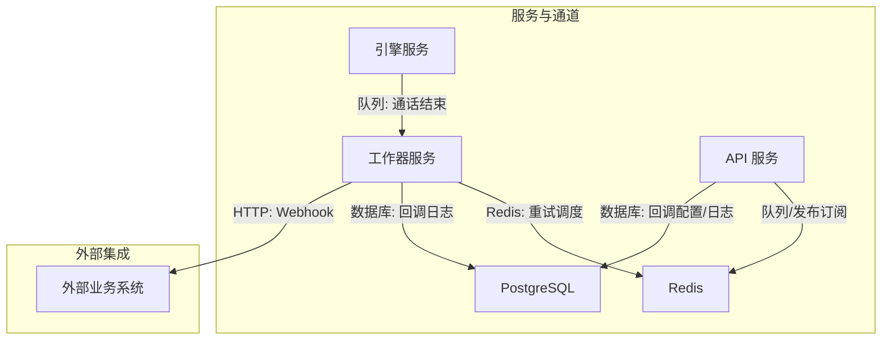
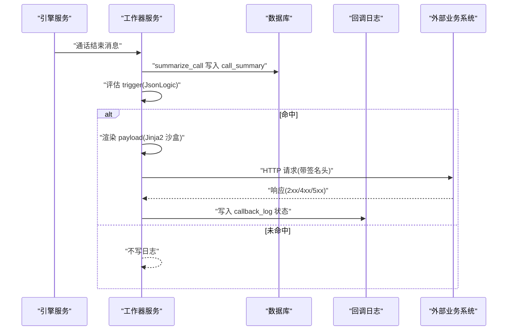
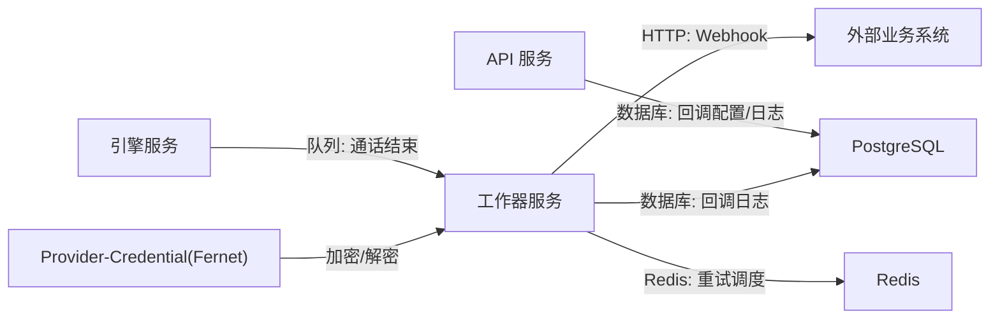

# Webhook 回调

<cite>
**本文引用的文件**
- [openspec/specs/webhook-callback/spec.md](file://openspec/specs/webhook-callback/spec.md)
- [openspec/changes/archive/2026-05-06-impl-worker/tasks.md](file://openspec/changes/archive/2026-05-06-impl-worker/tasks.md)
- [openspec/changes/archive/2026-05-06-impl-worker/proposal.md](file://openspec/changes/archive/2026-05-06-impl-worker/proposal.md)
- [openspec/specs/data-model/spec.md](file://openspec/specs/data-model/spec.md)
- [openspec/specs/service-communication/spec.md](file://openspec/specs/service-communication/spec.md)
- [openspec/changes/archive/2026-05-24-impl-provider-credential-db-ssot/specs/provider-credential/spec.md](file://openspec/changes/archive/2026-05-24-impl-provider-credential-db-ssot/specs/provider-credential/spec.md)
- [openspec/changes/archive/2026-05-08-impl-web-polish/specs/webhook-callback/spec.md](file://openspec/changes/archive/2026-05-08-impl-web-polish/specs/webhook-callback/spec.md)
</cite>

## 目录
1. [简介](#简介)
2. [项目结构](#项目结构)
3. [核心组件](#核心组件)
4. [架构总览](#架构总览)
5. [详细组件分析](#详细组件分析)
6. [依赖分析](#依赖分析)
7. [性能考虑](#性能考虑)
8. [故障排查指南](#故障排查指南)
9. [结论](#结论)
10. [附录](#附录)

## 简介
本文件为 iSales Webhook 回调系统的权威参考文档，覆盖触发条件与事件类型、HTTP 请求格式、请求体结构、签名验证机制、重试策略与超时、幂等性与错误处理最佳实践，并提供完整的回调示例与配置、验证与排障方法。系统在通话结束后异步触发回调，确保与业务主流程解耦，不改变潜在的线索状态。

## 项目结构
- 规范来源集中在 OpenSpec 的 webhook-callback 与 provider-credential、data-model、service-communication 等能力规范中。
- 实现细节在 worker 的任务说明与提案中给出，明确了触发、渲染、签名、重试与调度器的行为契约。

图表来源
- [openspec/specs/service-communication/spec.md: 7-24:7-24](file://openspec/specs/service-communication/spec.md#L7-L24)
- [openspec/specs/webhook-callback/spec.md: 5-17:5-17](file://openspec/specs/webhook-callback/spec.md#L5-L17)

章节来源
- [openspec/specs/service-communication/spec.md: 7-24:7-24](file://openspec/specs/service-communication/spec.md#L7-L24)
- [openspec/specs/webhook-callback/spec.md: 5-17:5-17](file://openspec/specs/webhook-callback/spec.md#L5-L17)

## 核心组件
- 触发与上下文构建：基于 JsonLogic 表达式评估，引用 call_summary、call_record、lead 等字段。
- 请求体渲染：使用 Jinja2 沙盒模板渲染，禁止危险能力。
- 签名与头部：HMAC-SHA256 签名，携带时间戳与 Content-Type。
- 重试与调度：指数退避重试策略，独立后台任务扫描 pending_retry。
- 数据模型：callback_config 与 callback_log 两张核心表承载配置与日志。

章节来源
- [openspec/specs/webhook-callback/spec.md: 19-41:19-41](file://openspec/specs/webhook-callback/spec.md#L19-L41)
- [openspec/specs/webhook-callback/spec.md: 47-67:47-67](file://openspec/specs/webhook-callback/spec.md#L47-L67)
- [openspec/specs/webhook-callback/spec.md: 68-89:68-89](file://openspec/specs/webhook-callback/spec.md#L68-L89)
- [openspec/specs/webhook-callback/spec.md: 100-133:100-133](file://openspec/specs/webhook-callback/spec.md#L100-L133)
- [openspec/specs/data-model/spec.md: 44-45:44-45](file://openspec/specs/data-model/spec.md#L44-L45)

## 架构总览
Webhook 回调在 worker 中完成“摘要生成 → 评估触发 → 渲染请求体 → 发送 HTTP → 记录日志”的完整链路。回调与主业务流程解耦，不干预线索状态。

图表来源
- [openspec/changes/archive/2026-05-06-impl-worker/proposal.md: 25-38:25-38](file://openspec/changes/archive/2026-05-06-impl-worker/proposal.md#L25-L38)
- [openspec/specs/webhook-callback/spec.md: 5-17:5-17](file://openspec/specs/webhook-callback/spec.md#L5-L17)

## 详细组件分析

### 触发条件与事件类型
- 触发时机：在 worker 完成通话摘要生成与二次校验后，才执行回调派发；严禁在通话期间实时触发。
- 触发表达式：采用 JsonLogic，可引用字段范围包括：
  - call_summary：goal_achieved、goal_type
  - call_summary.extracted_fields：extracted.*
  - lead：name、phone、source、status、custom_data.*
  - call_record：duration、started_at、transfer_status、hangup_cause
- 事件类型举例：
  - 通话结束：由引擎发送“通话结束”消息触发。
  - 状态变更：可通过 trigger 引用 lead.status、call.hangup_cause 等字段在不同状态下触发。
  - 异常情况：如勿打名单命中（lead.status="do_not_call"），可触发同步到 CRM 的回调。

章节来源
- [openspec/specs/webhook-callback/spec.md: 5-17:5-17](file://openspec/specs/webhook-callback/spec.md#L5-L17)
- [openspec/specs/webhook-callback/spec.md: 33-46:33-46](file://openspec/specs/webhook-callback/spec.md#L33-L46)
- [openspec/changes/archive/2026-05-06-impl-worker/proposal.md: 12-16:12-16](file://openspec/changes/archive/2026-05-06-impl-worker/proposal.md#L12-L16)

### HTTP 请求格式与头部
- 方法与 URL：由 callback_config.method 与 callback_config.url 决定，支持任意 HTTP 方法。
- 请求头：
  - X-Isales-Signature: sha256=<十六进制摘要>
  - X-Isales-Timestamp: <Unix 秒>
  - Content-Type: application/json
- 超时：优先使用 callback_config.timeout_seconds，否则使用部署配置的全局默认值。

章节来源
- [openspec/specs/webhook-callback/spec.md: 100-156:100-156](file://openspec/specs/webhook-callback/spec.md#L100-L156)
- [openspec/specs/webhook-callback/spec.md: 68-89:68-89](file://openspec/specs/webhook-callback/spec.md#L68-L89)

### 请求体数据格式
- 结构：由 Jinja2 沙盒模板渲染生成合法 JSON。
- 可用上下文：goal_achieved、goal_type、extracted.*、lead.*、call.*（含 hangup_cause）。
- 渲染安全：沙盒环境禁用文件 IO、import、eval 等危险能力；引用不存在字段将触发失败渲染。

章节来源
- [openspec/specs/webhook-callback/spec.md: 47-67:47-67](file://openspec/specs/webhook-callback/spec.md#L47-L67)
- [openspec/specs/webhook-callback/spec.md: 33-41:33-41](file://openspec/specs/webhook-callback/spec.md#L33-L41)
- [openspec/specs/webhook-callback/spec.md: 134-147:134-147](file://openspec/specs/webhook-callback/spec.md#L134-L147)

### 签名验证机制
- 密钥管理：callback_config.signing_secret 以 Fernet(urlsafe base64) 加密存储；仅在创建或 rotate-secret 时一次性返回明文。
- 签名内容：timestamp + "." + body 字节串，使用 HMAC-SHA256 与解密后的明文密钥计算。
- 接收方建议验证：
  - 检查 X-Isales-Timestamp 与当前时间差小于 5 分钟（防重放）
  - 重新计算 HMAC 并进行常量时间比较
- worker 端行为：从 callback_log.pending_retry 取出记录时解密密钥并重新签名。

章节来源
- [openspec/specs/webhook-callback/spec.md: 68-89:68-89](file://openspec/specs/webhook-callback/spec.md#L68-L89)
- [openspec/changes/archive/2026-05-24-impl-provider-credential-db-ssot/specs/provider-credential/spec.md: 137-165:137-165](file://openspec/changes/archive/2026-05-24-impl-provider-credential-db-ssot/specs/provider-credential/spec.md#L137-L165)

### 重试策略、超时与最大重试次数
- 策略：指数退避，配置为 JSONB {intervals_seconds: [...], max_attempts: N}。
- 触发重试：5xx、超时、连接失败；不重试：4xx、trigger/payload 渲染失败。
- 调度器：独立后台任务，周期性扫描 status='pending_retry' 且 next_retry_at ≤ now 的记录，按 next_retry_at 顺序批量重试。
- 复用策略：重试时直接复用上次已存 request_body，避免上下文漂移。
- 终态：达到 max_attempts 后置为 exhausted。

章节来源
- [openspec/specs/webhook-callback/spec.md: 100-133:100-133](file://openspec/specs/webhook-callback/spec.md#L100-L133)
- [openspec/changes/archive/2026-05-06-impl-worker/tasks.md: 42-49:42-49](file://openspec/changes/archive/2026-05-06-impl-worker/tasks.md#L42-L49)

### 回调处理最佳实践
- 幂等性：接收方应保证对相同请求体与时间戳的重复到达具备幂等性，建议以 call_record_id + request_body 的哈希作为去重键。
- 错误处理：
  - 4xx：直接失败，不再重试。
  - 5xx/超时/网络错误：按策略重试，直至 exhausted。
  - 渲染失败：不重试，记录错误信息。
- 与主流程解耦：回调结果不应影响线索状态或引擎行为。

章节来源
- [openspec/specs/webhook-callback/spec.md: 114-123:114-123](file://openspec/specs/webhook-callback/spec.md#L114-L123)
- [openspec/specs/webhook-callback/spec.md: 157-169:157-169](file://openspec/specs/webhook-callback/spec.md#L157-L169)

### 完整回调示例
- 示例场景一：目标达成（appointment）
  - 触发表达式：goal_achieved=true 且 goal_type="appointment"
  - 请求体：包含 lead_id、appointment_time、summary_text 等字段
  - 响应：200 成功、4xx 失败不再重试、5xx 进入重试队列
- 示例场景二：勿打名单
  - 触发表达式：lead.status="do_not_call"
  - 请求体：包含 lead.* 与 call.* 关键字段
  - 响应：200 成功、4xx 失败不再重试、5xx 进入重试队列
- 示例场景三：渲染失败
  - 触发表达式：命中；payload_template 引用不存在字段
  - 结果：status=failed_render，不重试

章节来源
- [openspec/specs/webhook-callback/spec.md: 23-46:23-46](file://openspec/specs/webhook-callback/spec.md#L23-L46)
- [openspec/specs/webhook-callback/spec.md: 134-147:134-147](file://openspec/specs/webhook-callback/spec.md#L134-L147)

### 回调地址配置、验证与排障
- 配置入口：
  - 创建/更新：callback_config.url、method、headers、payload_template、trigger、retry_policy、timeout_seconds、enabled
  - 密钥轮换：POST /callback-configs/{id}/rotate-secret，一次性返回新明文
- 验证流程：
  - POST /callback-configs/validate：dry-run 校验 trigger 语法与 payload 渲染，不写数据库
- 排障要点：
  - 查看 callback_log：status、response_code、error_message、retry_count、next_retry_at
  - 确认签名头与时间戳：X-Isales-Signature、X-Isales-Timestamp、Content-Type
  - 检查重试调度器：pending_retry 记录是否被扫描与重发
  - 核对密钥：确保使用最新 signing_secret，旧密钥已失效

章节来源
- [openspec/changes/archive/2026-05-08-impl-web-polish/specs/webhook-callback/spec.md: 3-41:3-41](file://openspec/changes/archive/2026-05-08-impl-web-polish/specs/webhook-callback/spec.md#L3-L41)
- [openspec/specs/webhook-callback/spec.md: 100-133:100-133](file://openspec/specs/webhook-callback/spec.md#L100-L133)
- [openspec/specs/data-model/spec.md: 44-45:44-45](file://openspec/specs/data-model/spec.md#L44-L45)

## 依赖分析
- 服务间通信：worker 通过 HTTP 调用外部系统；引擎与 worker 通过 Redis 队列传递“通话结束”消息。
- 数据依赖：callback_config 与 callback_log 由 isales-common 统一管理，其他服务通过依赖访问。
- 凭据依赖：signing_secret 通过 provider-credential 能力的 Fernet Fabric 加密存储。

图表来源
- [openspec/specs/service-communication/spec.md: 13-24:13-24](file://openspec/specs/service-communication/spec.md#L13-L24)
- [openspec/specs/data-model/spec.md: 44-50:44-50](file://openspec/specs/data-model/spec.md#L44-L50)
- [openspec/changes/archive/2026-05-24-impl-provider-credential-db-ssot/specs/provider-credential/spec.md: 137-165:137-165](file://openspec/changes/archive/2026-05-24-impl-provider-credential-db-ssot/specs/provider-credential/spec.md#L137-L165)

章节来源
- [openspec/specs/service-communication/spec.md: 13-24:13-24](file://openspec/specs/service-communication/spec.md#L13-L24)
- [openspec/specs/data-model/spec.md: 44-50:44-50](file://openspec/specs/data-model/spec.md#L44-L50)
- [openspec/changes/archive/2026-05-24-impl-provider-credential-db-ssot/specs/provider-credential/spec.md: 137-165:137-165](file://openspec/changes/archive/2026-05-24-impl-provider-credential-db-ssot/specs/provider-credential/spec.md#L137-L165)

## 性能考虑
- 并发派发：worker 对同一通话的多个回调配置使用并发派发，缩短整体耗时。
- 重试退避：指数退避降低对外部系统的冲击，避免雪崩效应。
- 超时控制：单配置超时可覆盖全局默认，平衡可靠性与吞吐。
- 日志与可观测：callback_log 记录状态、响应码、重试次数与下次重试时间，便于监控与告警。

章节来源
- [openspec/changes/archive/2026-05-06-impl-worker/tasks.md: 37-38:37-38](file://openspec/changes/archive/2026-05-06-impl-worker/tasks.md#L37-L38)
- [openspec/specs/webhook-callback/spec.md: 100-156:100-156](file://openspec/specs/webhook-callback/spec.md#L100-L156)

## 故障排查指南
- 无法触发：
  - 检查触发表达式语法与字段引用是否正确
  - 确认 call_summary 是否已生成，且字段值符合预期
- 渲染失败：
  - 检查 payload_template 是否引用不存在字段或包含危险语法
  - 使用 /callback-configs/validate 进行 dry-run 校验
- 签名验证失败：
  - 确认 X-Isales-Timestamp 与服务器时间差在允许范围内
  - 重新计算 HMAC 并进行常量时间比较
  - 如密钥轮换，请使用最新 signing_secret
- 重试未生效：
  - 检查 callback_log 中 status 是否为 pending_retry
  - 确认重试调度器正常运行并扫描到记录
  - 核对 retry_policy.intervals_seconds 与 max_attempts
- 4xx 错误：
  - 检查外部系统返回码与业务逻辑，此类错误不再重试

章节来源
- [openspec/changes/archive/2026-05-08-impl-web-polish/specs/webhook-callback/spec.md: 12-41:12-41](file://openspec/changes/archive/2026-05-08-impl-web-polish/specs/webhook-callback/spec.md#L12-L41)
- [openspec/specs/webhook-callback/spec.md: 114-133:114-133](file://openspec/specs/webhook-callback/spec.md#L114-L133)

## 结论
iSales Webhook 回调系统以严格的触发条件、安全的签名与渲染机制、稳健的重试策略与可观测日志为核心，确保在通话结束后可靠地向外部系统推送业务事件。通过与主业务流程解耦的设计，系统既保证了外部集成的灵活性，也维持了内部状态的一致性与可预测性。

## 附录

### 数据模型概览（回调相关）
- callback_config：存储触发表达式、URL、方法、头部、模板、重试策略、签名密钥、超时与启用状态。
- callback_log：记录每次回调的请求体、响应码、响应体、重试次数、尝试时间、下次重试时间与错误信息。

章节来源
- [openspec/specs/data-model/spec.md: 44-45:44-45](file://openspec/specs/data-model/spec.md#L44-L45)