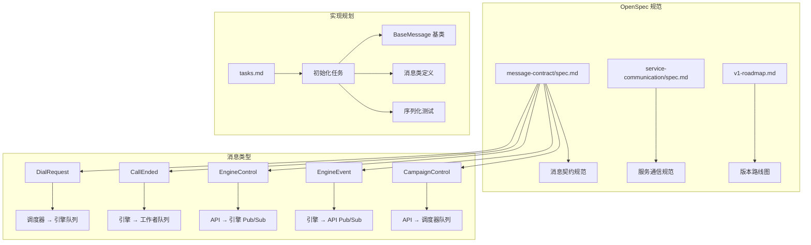
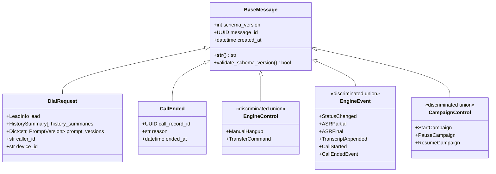
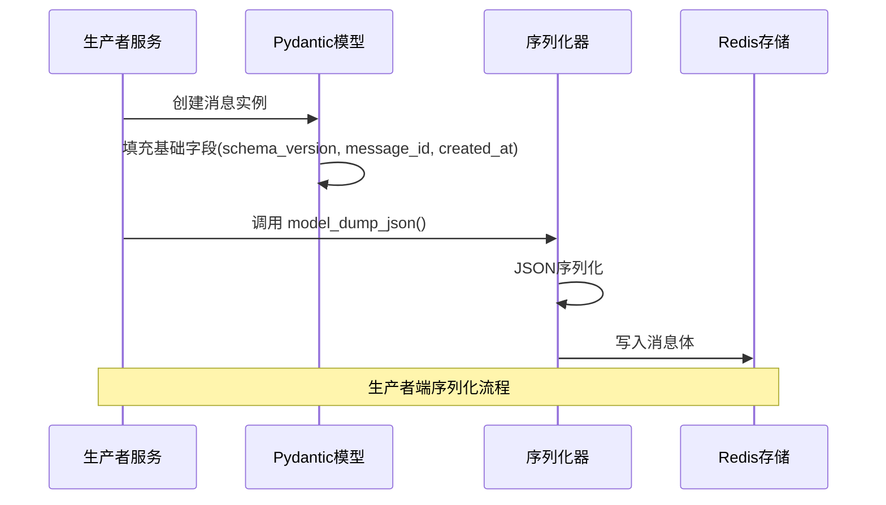
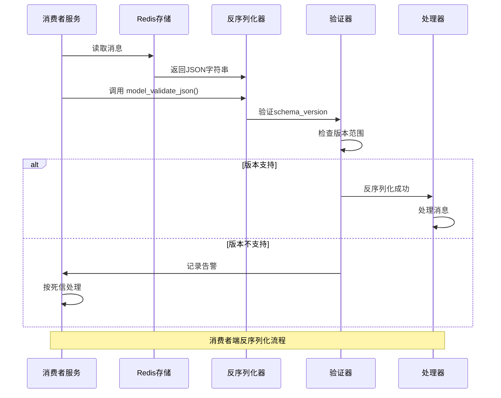
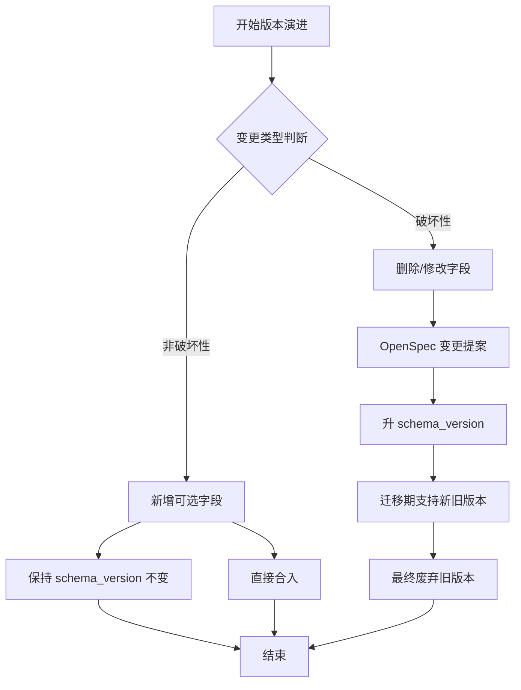
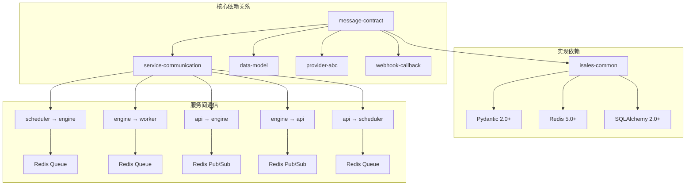
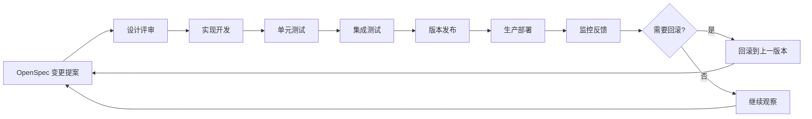

# 消息契约规范

<cite>
**本文档引用的文件**
- [message-contract/spec.md](file://openspec/specs/message-contract/spec.md)
- [service-communication/spec.md](file://openspec/specs/service-communication/spec.md)
- [v1-roadmap.md](file://openspec/v1-roadmap.md)
- [tasks.md](file://openspec/changes/archive/2026-05-01-init-isales-common/tasks.md)
</cite>

## 目录
1. [简介](#简介)
2. [项目结构](#项目结构)
3. [核心组件](#核心组件)
4. [架构概览](#架构概览)
5. [详细组件分析](#详细组件分析)
6. [依赖关系分析](#依赖关系分析)
7. [性能考虑](#性能考虑)
8. [故障排除指南](#故障排除指南)
9. [结论](#结论)
10. [附录](#附录)

## 简介

iSales 消息契约规范定义了跨服务消息体的集中化管理和标准化流程。该规范确保所有服务间通信的消息体具有一致的数据结构、版本控制机制和序列化标准，从而保证系统的可靠性和可维护性。

消息契约规范的核心目标是：
- 统一跨服务消息体的定义和实现
- 建立标准化的序列化和反序列化流程
- 提供清晰的版本演进规则
- 确保消息的可观测性和可追踪性

## 项目结构

基于 openspec 规范文档，消息契约相关的项目结构如下：



**图表来源**
- [message-contract/spec.md:1-85](file://openspec/specs/message-contract/spec.md#L1-L85)
- [service-communication/spec.md:11-24](file://openspec/specs/service-communication/spec.md#L11-L24)

**章节来源**
- [message-contract/spec.md:1-85](file://openspec/specs/message-contract/spec.md#L1-L85)
- [service-communication/spec.md:1-150](file://openspec/specs/service-communication/spec.md#L1-L150)

## 核心组件

### BaseMessage 基类

BaseMessage 是所有消息类的统一基类，提供标准化的基础字段和行为：



**图表来源**
- [message-contract/spec.md:25-51](file://openspec/specs/message-contract/spec.md#L25-L51)
- [tasks.md:68-77](file://openspec/changes/archive/2026-05-01-init-isales-common/tasks.md#L68-L77)

### 消息字段规范

| 字段名称 | 类型 | 必填 | 默认值 | 作用 |
|---------|------|------|--------|------|
| schema_version | int | 是 | 1 | 消息版本号，破坏性升级时递增 |
| message_id | UUID | 是 | 自动生成 | 消息唯一标识，用于追踪和去重 |
| created_at | datetime | 是 | 自动生成 | 消息创建时间戳 |

**章节来源**
- [message-contract/spec.md:25-37](file://openspec/specs/message-contract/spec.md#L25-L37)

## 架构概览

消息契约规范采用集中化管理模式，所有跨服务消息体在 isales-common 模块中统一定义和管理：

```mermaid
graph TB
subgraph "消息契约架构"
A[isales_common/schemas/messages/] --> B[BaseMessage 基类]
A --> C[DialRequest]
A --> D[CallEnded]
A --> E[EngineControl]
A --> F[EngineEvent]
A --> G[CampaignControl]
H[服务实现] --> I[Producer 服务]
H --> J[Consumer 服务]
I --> K[序列化: model_dump_json()]
J --> L[反序列化: model_validate_json()]
K --> M[Redis 队列/Pub/Sub]
L --> M
M --> N[消息传输]
N --> O[消息消费]
end
subgraph "版本管理"
P[schema_version] --> Q[非破坏性变更]
P --> R[破坏性变更]
Q --> S[保持不变]
R --> T[递增 + OpenSpec 变更]
end
A -.-> P
```

**图表来源**
- [message-contract/spec.md:6-23](file://openspec/specs/message-contract/spec.md#L6-L23)
- [message-contract/spec.md:53-66](file://openspec/specs/message-contract/spec.md#L53-L66)

## 详细组件分析

### 消息序列化流程

消息序列化采用 Pydantic 的标准序列化方法，确保数据的一致性和完整性：



**图表来源**
- [message-contract/spec.md:10-13](file://openspec/specs/message-contract/spec.md#L10-L13)

### 消息反序列化流程

消费者端采用严格的反序列化验证机制，确保消息的完整性和安全性：



**图表来源**
- [message-contract/spec.md:15-18](file://openspec/specs/message-contract/spec.md#L15-L18)
- [message-contract/spec.md:34-37](file://openspec/specs/message-contract/spec.md#L34-L37)

### 版本演进规则

消息契约规范建立了清晰的版本演进规则，区分非破坏性和破坏性变更：



**图表来源**
- [message-contract/spec.md:53-66](file://openspec/specs/message-contract/spec.md#L53-L66)

**章节来源**
- [message-contract/spec.md:53-66](file://openspec/specs/message-contract/spec.md#L53-L66)

### 消息类设计规范

#### 命名规范
- 使用名词短语命名，如 `DialRequest`、`CallEnded`
- discriminated union 使用 `类名 + Control/Event` 后缀
- 消息类名应准确反映其用途和数据内容

#### 字段定义规范
- 基础字段必须包含：`schema_version`、`message_id`、`created_at`
- 业务字段应使用明确的类型注解
- 可选字段应提供合理的默认值

#### 验证规则
- 所有消息类必须继承 `BaseMessage` 基类
- 基类字段应自动填充，不得手动设置
- 消息类不应包含业务逻辑或外部依赖

**章节来源**
- [message-contract/spec.md:67-75](file://openspec/specs/message-contract/spec.md#L67-L75)

## 依赖关系分析

消息契约规范与其他 OpenSpec 规范存在紧密的依赖关系：



**图表来源**
- [service-communication/spec.md:11-24](file://openspec/specs/service-communication/spec.md#L11-L24)
- [message-contract/spec.md:39-41](file://openspec/specs/message-contract/spec.md#L39-L41)

**章节来源**
- [service-communication/spec.md:1-150](file://openspec/specs/service-communication/spec.md#L1-L150)

## 性能考虑

消息契约规范在设计时充分考虑了性能因素：

### 序列化性能
- 使用 Pydantic 的高效 JSON 序列化
- 避免不必要的数据转换和拷贝
- 批量处理时注意内存使用

### 版本管理性能
- 非破坏性变更无需版本升级
- 破坏性变更采用渐进式迁移策略
- 版本检查应在反序列化早期进行

### 可观测性性能
- `__str__` 方法应避免昂贵的操作
- 日志输出应控制在合理范围内
- message_id 的使用应简洁明了

## 故障排除指南

### 常见问题及解决方案

#### 版本不兼容问题
**症状**: 消费者端出现版本错误告警
**解决方案**: 
- 检查 `schema_version` 字段值
- 确认消费者支持的版本范围
- 按迁移计划逐步升级

#### 序列化错误
**症状**: 生产者端序列化失败或消费者端反序列化异常
**解决方案**:
- 验证消息类的字段定义
- 检查 Pydantic 模型的配置
- 确认 JSON 序列化格式

#### 消息丢失问题
**症状**: 消费者端无法接收到预期消息
**解决方案**:
- 检查 Redis 队列/频道配置
- 验证消息路由规则
- 确认服务间的通信协议

**章节来源**
- [message-contract/spec.md:76-84](file://openspec/specs/message-contract/spec.md#L76-L84)

## 结论

iSales 消息契约规范通过标准化的消息定义、严格的版本管理和完善的序列化流程，为跨服务通信提供了可靠的基础设施。该规范不仅确保了系统的稳定性，还为未来的功能扩展和演进奠定了坚实的基础。

关键优势包括：
- 集中化的消息定义管理
- 标准化的序列化和反序列化流程  
- 清晰的版本演进规则
- 强大的可观测性和可追踪性
- 严格的错误处理和故障排除机制

## 附录

### 消息契约演进流程



### 最佳实践清单

#### 生产者端最佳实践
- 使用统一的 BaseMessage 基类
- 确保消息字段的完整性和准确性
- 正确设置 message_id 和 created_at
- 实现适当的错误处理和重试机制

#### 消费者端最佳实践
- 实现严格的版本检查
- 使用 model_validate_json() 进行反序列化
- 实现死信队列处理机制
- 建立完善的日志记录系统

#### 版本管理最佳实践
- 非破坏性变更可直接合入
- 破坏性变更必须经过 OpenSpec 审批
- 迁移期内同时支持新旧版本
- 建立版本兼容性测试

**章节来源**
- [message-contract/spec.md:1-85](file://openspec/specs/message-contract/spec.md#L1-L85)
- [v1-roadmap.md:207-282](file://openspec/v1-roadmap.md#L207-L282)