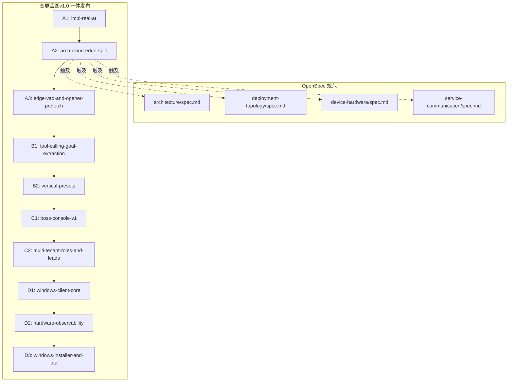
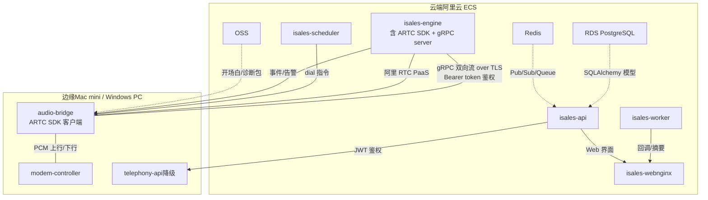
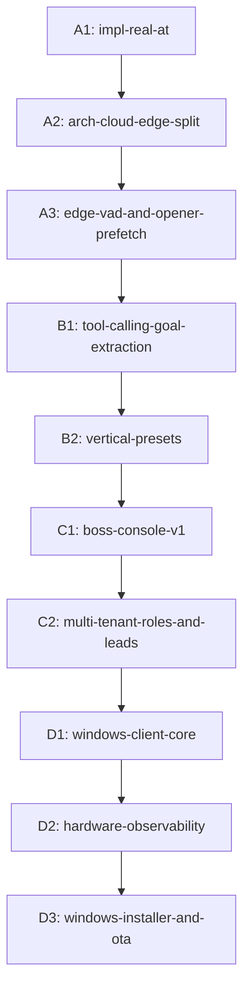
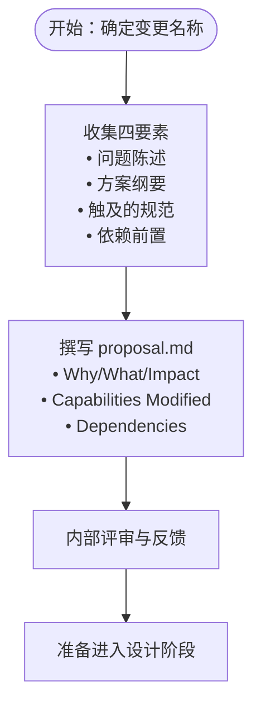
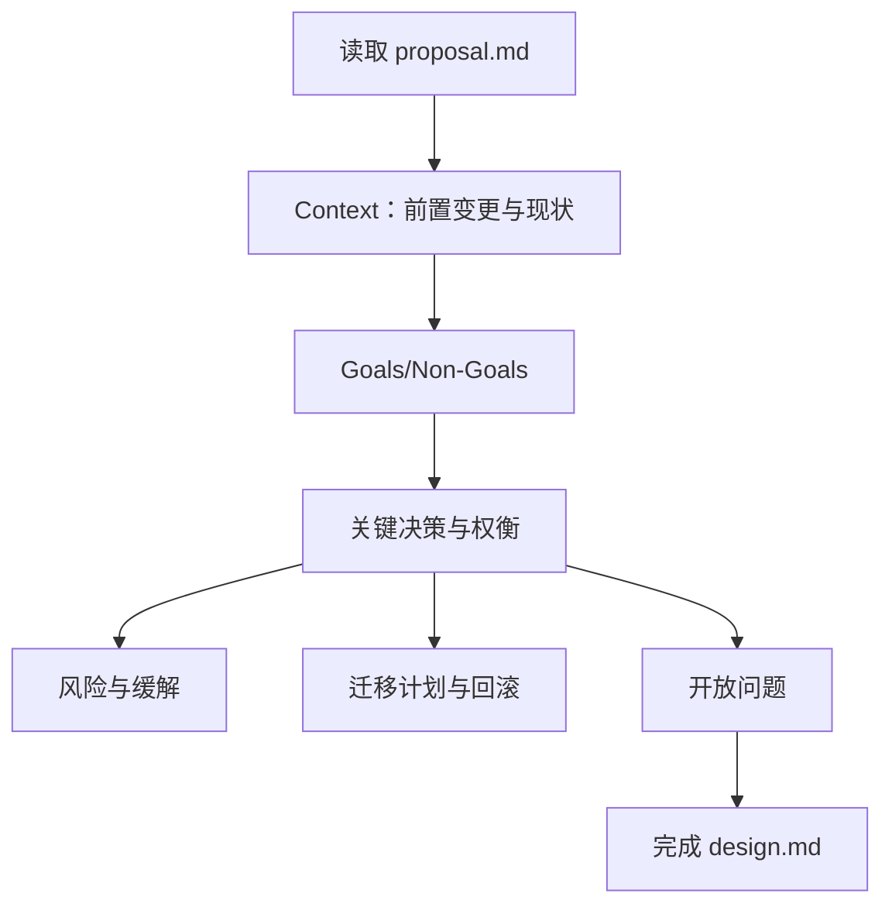
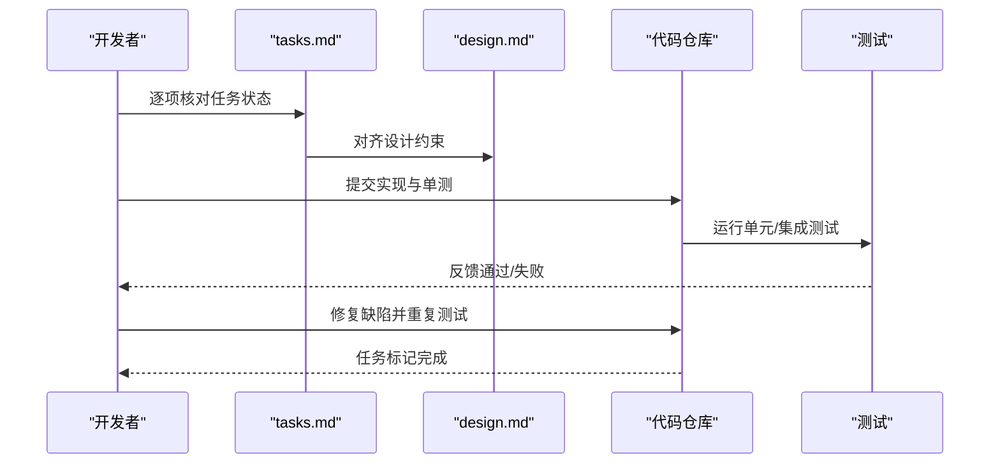
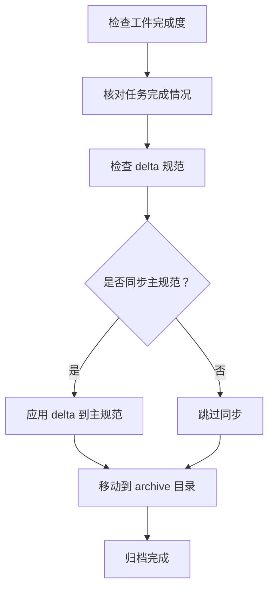
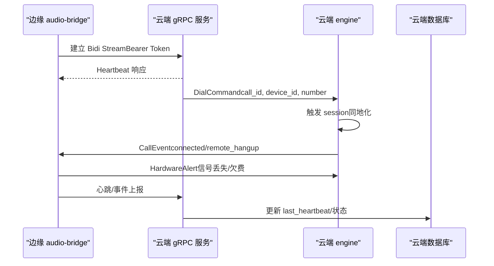
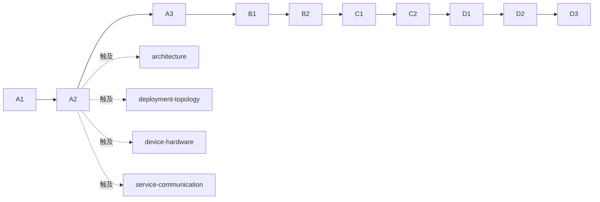

# OpenSpec 工作流程

<cite>
**本文档引用的文件**
- [openspec/v1-roadmap.md](file://openspec/v1-roadmap.md)
- [openspec/v1-roadmap-a3-context.md](file://openspec/v1-roadmap-a3-context.md)
- [openspec/changes/arch-cloud-edge-split/.openspec.yaml](file://openspec/changes/arch-cloud-edge-split/.openspec.yaml)
- [openspec/changes/arch-cloud-edge-split/proposal.md](file://openspec/changes/arch-cloud-edge-split/proposal.md)
- [openspec/changes/arch-cloud-edge-split/design.md](file://openspec/changes/arch-cloud-edge-split/design.md)
- [openspec/changes/arch-cloud-edge-split/tasks.md](file://openspec/changes/arch-cloud-edge-split/tasks.md)
- [openspec/specs/architecture/spec.md](file://openspec/specs/architecture/spec.md)
- [openspec/specs/deployment-topology/spec.md](file://openspec/specs/deployment-topology/spec.md)
- [openspec/specs/device-hardware/spec.md](file://openspec/specs/device-hardware/spec.md)
- [openspec/specs/service-communication/spec.md](file://openspec/specs/service-communication/spec.md)
- [.claude/commands/opsx/archive.md](file://.claude/commands/opsx/archive.md)
- [.claude/skills/openspec-propose/SKILL.md](file://.claude/skills/openspec-propose/SKILL.md)
- [.claude/skills/openspec-archive-change/SKILL.md](file://.claude/skills/openspec-archive-change/SKILL.md)
</cite>

## 目录
1. [简介](#简介)
2. [项目结构](#项目结构)
3. [核心组件](#核心组件)
4. [架构概览](#架构概览)
5. [详细组件分析](#详细组件分析)
6. [依赖分析](#依赖分析)
7. [性能考虑](#性能考虑)
8. [故障排查指南](#故障排查指南)
9. [结论](#结论)
10. [附录](#附录)

## 简介
本文件系统化阐述 OpenSpec 在 isales 项目中的工作流程，围绕 v1.0 一体发布单元的 10 个变更蓝图（change blueprint）展开，重点解释从变更提案（propose）到设计（design）、实现（implement）再到归档（archive）的完整生命周期。文档特别聚焦云-边拆分（A2）这一关键里程碑，说明其对架构、部署拓扑、服务通信、设备硬件与媒体面的深远影响，并给出规范管理命令 `/opsx:` 的使用方法与最佳实践。

## 项目结构
OpenSpec 采用以“变更”为中心的组织方式：每个变更在 `openspec/changes/<变更名>/` 下形成完整的生命周期工件，包含提案、设计、任务清单与相关规范修订；同时，核心规范位于 `openspec/specs/<能力>/spec.md`，指导各变更的落地。

**图表来源**
- [openspec/v1-roadmap.md:207-453](file://openspec/v1-roadmap.md#L207-L453)

**章节来源**
- [openspec/v1-roadmap.md:207-453](file://openspec/v1-roadmap.md#L207-L453)

## 核心组件
- 变更蓝图（Change Blueprint）：v1.0 一体发布单元的 10 个变更，线性依赖链为 A1 → A2 → A3 → B1 → B2 → C1 → C2 → D1 → D2 → D3，部分可并行。
- 规范（Specs）：architecture、deployment-topology、device-hardware、service-communication 等核心规范，指导变更落地。
- 工作流命令：`/opsx: propose`、`/opsx: archive` 等，规范变更的生命周期管理。

**章节来源**
- [openspec/v1-roadmap.md:207-453](file://openspec/v1-roadmap.md#L207-L453)

## 架构概览
OpenSpec v1.0 的云-边拆分以 A2 为关键节点，将 7 服务中的 api/engine/scheduler/worker/web 迁至云端，仅保留 modem-controller 与新增 audio-bridge 组件于边缘，二者通过阿里 RTC PaaS 互为参会者，云端 engine 负责多角色 PK 管线与流式 ASR/LLM/TTS，边缘负责 VAD 与音频桥接。

**图表来源**
- [openspec/changes/arch-cloud-edge-split/design.md:133-178](file://openspec/changes/arch-cloud-edge-split/design.md#L133-L178)
- [openspec/changes/arch-cloud-edge-split/proposal.md:11-19](file://openspec/changes/arch-cloud-edge-split/proposal.md#L11-L19)
- [openspec/specs/deployment-topology/spec.md:317-394](file://openspec/specs/deployment-topology/spec.md#L317-L394)

**章节来源**
- [openspec/changes/arch-cloud-edge-split/design.md:133-178](file://openspec/changes/arch-cloud-edge-split/design.md#L133-L178)
- [openspec/changes/arch-cloud-edge-split/proposal.md:11-19](file://openspec/changes/arch-cloud-edge-split/proposal.md#L11-L19)
- [openspec/specs/deployment-topology/spec.md:317-394](file://openspec/specs/deployment-topology/spec.md#L317-L394)

## 详细组件分析

### 变更蓝图（10 个一体发布单元）
v1.0 的 10 个变更构成一个“一体发布单元”，彼此存在严格的依赖关系，必须按顺序推进，且每个变更都必须完整归档后方可开启下一个。

- A1：实现真实 AT 通道，为云-边拆分提供硬件基础。
- A2：云-边拆分，引入 gRPC 控制面、阿里 RTC 媒体面、engine session 同地化。
- A3：边缘 VAD 与开场白预缓存，迁移 barge-in 决策点至边缘。
- B1：工具调用与目标抽取，完善多角色 PK 管线。
- B2：垂直领域预设库，加速老板上手。
- C1：老板控制台，整合既有机制并提供可视化。
- C2：多租户与权限，支撑多客户并发。
- D1：Windows 客户端核心，将边缘形态商用化。
- D2：硬件可观测性，提供告警与诊断能力。
- D3：Windows 安装包与 OTA，完善交付与升级。

**章节来源**
- [openspec/v1-roadmap.md:207-453](file://openspec/v1-roadmap.md#L207-L453)

### OpenSpec 工作流生命周期详解

#### 1) 提案阶段（Propose）
- 目标：明确“问题陈述 + 方案纲要 + 触及的能力 + 依赖前置”。
- 输入：变更蓝图中的“问题”“方案”“specs(deltas)”“依赖”四要素。
- 输出：`proposal.md`，描述背景、动机、变更范围与影响面。

**图表来源**
- [openspec/v1-roadmap.md:243-282](file://openspec/v1-roadmap.md#L243-L282)

**章节来源**
- [openspec/v1-roadmap.md:243-282](file://openspec/v1-roadmap.md#L243-L282)

#### 2) 设计阶段（Design）
- 目标：给出“设计决策 + 风险与权衡 + 迁移计划 + 回滚策略 + 开放问题”。
- 输入：提案阶段的四要素与评审反馈。
- 输出：`design.md`，包含协议骨架、拓扑图、端到端预算、实施顺序与验收点。

**图表来源**
- [openspec/changes/arch-cloud-edge-split/design.md:1-42](file://openspec/changes/arch-cloud-edge-split/design.md#L1-L42)

**章节来源**
- [openspec/changes/arch-cloud-edge-split/design.md:1-42](file://openspec/changes/arch-cloud-edge-split/design.md#L1-L42)

#### 3) 实现阶段（Implement）
- 目标：按任务清单逐步落地，确保每个任务都有明确的交付物与验收标准。
- 输入：`tasks.md` 与 `design.md`。
- 输出：代码、测试、部署脚本、RUNBOOK 与监控配置。

**图表来源**
- [openspec/changes/arch-cloud-edge-split/tasks.md:1-135](file://openspec/changes/arch-cloud-edge-split/tasks.md#L1-L135)

**章节来源**
- [openspec/changes/arch-cloud-edge-split/tasks.md:1-135](file://openspec/changes/arch-cloud-edge-split/tasks.md#L1-L135)

#### 4) 归档阶段（Archive）
- 目标：将已完成的变更固化为历史档案，同步规范修订，确保知识沉淀与可追溯性。
- 输入：完成的 artifacts、任务清单、delta 规范。
- 输出：`openspec/changes/archive/<YYYY-MM-DD-变更名>/`，并可选择同步主规范。

**图表来源**
- [.claude/commands/opsx/archive.md:12-80](file://.claude/commands/opsx/archive.md#L12-L80)

**章节来源**
- [.claude/commands/opsx/archive.md:12-80](file://.claude/commands/opsx/archive.md#L12-L80)

### 规范管理命令 `/opsx:` 使用指南

#### 1) `/opsx: propose`（创建变更提案）
- 作用：一次性生成变更所需的提案、设计与任务清单，便于快速启动。
- 使用场景：当需要快速描述要实现的功能并获得完整的提案工件时。
- 注意事项：变更名称建议采用 kebab-case，便于归档与追踪。

**章节来源**
- [.claude/skills/openspec-propose/SKILL.md:12-23](file://.claude/skills/openspec-propose/SKILL.md#L12-L23)

#### 2) `/opsx: archive`（归档已完成变更）
- 作用：将已完成的变更移动到归档目录，可选择同步主规范。
- 使用流程：
  1) 若未指定变更名，系统会列出可选的活动变更供选择。
  2) 检查工件与任务完成状态，必要时提示确认继续。
  3) 如存在 delta 规范，可选择同步到主规范或跳过。
  4) 执行归档并生成总结报告。

**章节来源**
- [.claude/commands/opsx/archive.md:12-80](file://.claude/commands/opsx/archive.md#L12-L80)

### A2 云-边拆分：关键设计与实施要点

#### 1) 控制面：gRPC 双向流 over TLS
- 协议骨架：单条长连接承载心跳、拨号/取消/配置更新、通话事件/硬件告警、RTC 凭证下发。
- 鉴权：Bearer token，边缘设备启动时通过激活码换取长期令牌。
- 断线重连：边缘客户端指数退避重连，本地 SQLite 缓冲离线事件，重连后顺序补发。

**图表来源**
- [openspec/changes/arch-cloud-edge-split/design.md:133-178](file://openspec/changes/arch-cloud-edge-split/design.md#L133-L178)

**章节来源**
- [openspec/changes/arch-cloud-edge-split/design.md:133-178](file://openspec/changes/arch-cloud-edge-split/design.md#L133-L178)

#### 2) 媒体面：阿里 RTC PaaS
- 双方作为参会者加入同一房间，按 uid 过滤订阅，避免混音。
- 云端 engine 与边缘 audio-bridge 分别负责入站/出站 PCM 的采集与播放。
- 不引入 IMS 智能体 SaaS，多角色 PK 管线在云端 engine 内完成。

**章节来源**
- [openspec/changes/arch-cloud-edge-split/design.md:63-106](file://openspec/changes/arch-cloud-edge-split/design.md#L63-L106)

#### 3) 端到端延迟预算与降级策略
- 预算：modem 麦 → audio-bridge → RTC → engine → ASR/LLM/TTS → RTC → audio-bridge → modem 喇叭 ≤ 800 ms。
- 降级：若多角色 PK 段 P95 突破预算，运行时默认收敛为单角色 + 单裁判 + 单润色。

**章节来源**
- [openspec/changes/arch-cloud-edge-split/design.md:115-132](file://openspec/changes/arch-cloud-edge-split/design.md#L115-L132)

#### 4) dial 路径重构与 engine session 同地化
- dial 路径：scheduler 通过 engine 内部接口触发，云端 gRPC 下发 dial 指令至边缘 modem-controller。
- 取消路径：取消不走 Redis Pub/Sub，直接在云端实例内进程间分发，保证低延迟。

**章节来源**
- [openspec/changes/arch-cloud-edge-split/proposal.md:16-18](file://openspec/changes/arch-cloud-edge-split/proposal.md#L16-L18)
- [openspec/changes/arch-cloud-edge-split/design.md:176-178](file://openspec/changes/arch-cloud-edge-split/design.md#L176-L178)

#### 5) telephony-api 角色降级
- A2 后 telephony-api 仅服务于边缘本地设备查询，不再作为云-边链路入口。

**章节来源**
- [openspec/changes/arch-cloud-edge-split/design.md:196](file://openspec/changes/arch-cloud-edge-split/design.md#L196)

#### 6) 任务清单与实施顺序
- 以 A2 为例，实施顺序强调“先公共层（isales-common）→ 云端 engine → 边缘 audio-bridge → 部署与 RUNBOOK → 验收”。

**章节来源**
- [openspec/changes/arch-cloud-edge-split/tasks.md:215-248](file://openspec/changes/arch-cloud-edge-split/tasks.md#L215-L248)

### A3 边缘 VAD 与开场白预缓存：从 A2 到 A3 的衔接

#### 1) 取消通道（cancel channel）已由 A2 建立
- 边缘 VAD 检测到用户开口 → 向云端发送 `CallEvent.user_speaking_started`。
- 云端分发器将事件交给对应 engine session，session 在本地取消 LLM/TTS，不经过 Redis Pub/Sub。

**章节来源**
- [openspec/v1-roadmap-a3-context.md:10-36](file://openspec/v1-roadmap-a3-context.md#L10-L36)

#### 2) 开场白预缓存：A2 未决问题，A3 需要填补
- OSS 已在 A2 准备，边缘 SQLite 与状态目录已存在。
- A3 需要确定：缓存键格式、同步触发策略、编解码选择、TTS 提供商锁定策略。

**章节来源**
- [openspec/v1-roadmap-a3-context.md:37-62](file://openspec/v1-roadmap-a3-context.md#L37-L62)

## 依赖分析
- 线性依赖链：A1 → A2 → A3 → B1 → B2 → C1 → C2 → D1 → D2 → D3。
- 并行关系：D1 与 A2 共享 device-hardware 与 deployment-topology 的 delta，归档时需手工合并。
- 规范耦合：A2 同时触达 architecture、deployment-topology、device-hardware、service-communication 四份主规范。

**图表来源**
- [openspec/v1-roadmap.md:207-453](file://openspec/v1-roadmap.md#L207-L453)

**章节来源**
- [openspec/v1-roadmap.md:207-453](file://openspec/v1-roadmap.md#L207-L453)

## 性能考虑
- 端到端延迟预算：≤ 800 ms，其中跨厂商网络成本预算 70-100 ms，RTC 往返预算约 100 ms。
- 多角色 PK 管线：若 P95 突破预算，采用运行时降级（默认 N=1）。
- 云端实例：单实例（4-8 核/16-32G RAM）满足 100-1000 seats 规模，不做高可用。
- 媒体面：阿里 RTC PaaS 内置 NAT 穿透，避免自建 coturn 的运维负担。

**章节来源**
- [openspec/changes/arch-cloud-edge-split/design.md:115-132](file://openspec/changes/arch-cloud-edge-split/design.md#L115-L132)
- [openspec/changes/arch-cloud-edge-split/design.md:456-491](file://openspec/changes/arch-cloud-edge-split/design.md#L456-L491)

## 故障排查指南
- gRPC 断线与重连：检查边缘客户端指数退避重连、本地 SQLite 缓冲补发与弱确认删除。
- 心跳与离线判定：云端 watchdog 以 120 s 阈值判定设备离线，边缘心跳频率为 30 s。
- RTC 推送反压：关注 `OnPushAudioFrameBufferFull` 回调，必要时采用“攒满 N 个 chunk 再 push”的策略。
- 端到端延迟测量：使用 A2 任务清单中的验收点（P50/P95 对照设计预算）与故障注入（断网/重启/RTC 断连）验证降级行为。

**章节来源**
- [openspec/changes/arch-cloud-edge-split/design.md:168-175](file://openspec/changes/arch-cloud-edge-split/design.md#L168-L175)
- [openspec/changes/arch-cloud-edge-split/tasks.md:120-127](file://openspec/changes/arch-cloud-edge-split/tasks.md#L120-L127)

## 结论
OpenSpec 工作流以“变更蓝图”为纲，通过“提案-设计-实现-归档”的闭环管理，确保 v1.0 一体发布单元的有序推进。A2 的云-边拆分是关键转折点，它不仅重构了部署拓扑与服务通信，还为后续 A3 的边缘 VAD 与预缓存、B1 的工具调用、C1 的老板控制台、D1 的 Windows 客户端奠定了坚实基础。遵循 `/opsx:` 命令与规范，开发者可以高效参与 OpenSpec 规范制定与实现。

## 附录

### OpenSpec 命令速查
- `/opsx: propose`：创建变更提案，生成 proposal.md、design.md、tasks.md。
- `/opsx: archive`：归档已完成变更，可选择同步主规范。

**章节来源**
- [.claude/skills/openspec-propose/SKILL.md:12-23](file://.claude/skills/openspec-propose/SKILL.md#L12-L23)
- [.claude/commands/opsx/archive.md:12-80](file://.claude/commands/opsx/archive.md#L12-L80)

### A2 变更工件清单
- `.openspec.yaml`：声明工作流 schema 与创建日期。
- `proposal.md`：变更动机、范围与影响。
- `design.md`：协议骨架、拓扑、预算与实施顺序。
- `tasks.md`：Sprint 0 准备、公共层、云端/边缘实现、部署与验收。

**章节来源**
- [openspec/changes/arch-cloud-edge-split/.openspec.yaml:1-3](file://openspec/changes/arch-cloud-edge-split/.openspec.yaml#L1-L3)
- [openspec/changes/arch-cloud-edge-split/proposal.md:1-77](file://openspec/changes/arch-cloud-edge-split/proposal.md#L1-L77)
- [openspec/changes/arch-cloud-edge-split/design.md:1-248](file://openspec/changes/arch-cloud-edge-split/design.md#L1-L248)
- [openspec/changes/arch-cloud-edge-split/tasks.md:1-135](file://openspec/changes/arch-cloud-edge-split/tasks.md#L1-L135)