# OpenSpec 规范系统

<cite>
**本文档引用的文件**
- [README.md](file://README.md)
- [v1-roadmap.md](file://openspec/v1-roadmap.md)
- [v1-roadmap-a3-context.md](file://openspec/v1-roadmap-a3-context.md)
- [v1-roadmap-aliyun-rtc-poc.md](file://openspec/v1-roadmap-aliyun-rtc-poc.md)
- [v1-roadmap-aliyun-rtc-poc-result.md](file://openspec/v1-roadmap-aliyun-rtc-poc-result.md)
- [arch-cloud-edge-split/.openspec.yaml](file://openspec/changes/arch-cloud-edge-split/.openspec.yaml)
- [arch-cloud-edge-split/proposal.md](file://openspec/changes/arch-cloud-edge-split/proposal.md)
- [arch-cloud-edge-split/design.md](file://openspec/changes/arch-cloud-edge-split/design.md)
- [arch-cloud-edge-split/tasks.md](file://openspec/changes/arch-cloud-edge-split/tasks.md)
- [architecture/spec.md](file://openspec/specs/architecture/spec.md)
- [deployment-topology/spec.md](file://openspec/specs/deployment-topology/spec.md)
- [service-communication/spec.md](file://openspec/specs/service-communication/spec.md)
- [device-hardware/spec.md](file://openspec/specs/device-hardware/spec.md)
- [campaign-fixed-greeting/.openspec.yaml](file://openspec/changes/campaign-fixed-greeting/.openspec.yaml)
- [campaign-fixed-greeting/proposal.md](file://openspec/changes/campaign-fixed-greeting/proposal.md)
</cite>

## 目录
1. [简介](#简介)
2. [项目结构](#项目结构)
3. [核心组件](#核心组件)
4. [架构概览](#架构概览)
5. [详细组件分析](#详细组件分析)
6. [依赖分析](#依赖分析)
7. [性能考虑](#性能考虑)
8. [故障排查指南](#故障排查指南)
9. [结论](#结论)
10. [附录](#附录)

## 简介

OpenSpec 是 iSales 项目的规范管理系统，负责定义和管理整个系统的架构规范、能力规范和变更流程。该系统通过标准化的变更提案流程、版本控制机制和路线图制定，确保项目的可维护性和演进能力。

iSales 是一个基于云-边分离架构的智能外呼系统，包含 7 个独立的服务仓库，通过统一的规范体系实现松耦合的微服务架构。系统支持 Linux 和 macOS 平台的单主机部署，以及云-边分离的生产部署模式。

## 项目结构

OpenSpec 规范系统采用层次化的文件组织结构：

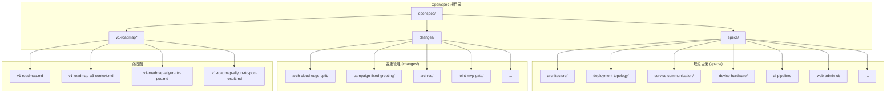

**图表来源**
- [README.md:75-86](file://README.md#L75-L86)
- [v1-roadmap.md:1-576](file://openspec/v1-roadmap.md#L1-L50)

**章节来源**
- [README.md:1-86](file://README.md#L1-L86)

## 核心组件

### 规范能力索引

OpenSpec 定义了 12 个核心能力规范，涵盖系统架构的各个方面：

| 能力名称 | 描述 | 关键特性 |
|---------|------|----------|
| **架构 (Architecture)** | 定义 7 仓库微服务架构和部署模型 | 仓库划分、职责边界、JWT 鉴权 |
| **部署拓扑 (Deployment-Topology)** | 规定单主机和云-边部署模型 | 环境变量契约、服务启停顺序、备份基线 |
| **服务通信 (Service-Communication)** | 定义 7 个服务间的通信通道 | Redis 队列/Pub/Sub、HTTP 调用规范 |
| **设备硬件 (Device-Hardware)** | 管理 USB GSM Modem 控制层 | udev 监听、AT 命令通道、PCM 音频管道 |
| **AI 管线 (AI-Pipeline)** | 实时通话引擎的三层 AI 管线 | 多角色 PK、流式 ASR/LLM/TTS |
| **Web 管理界面 (Web-Admin-UI)** | 老板控制台的前端界面 | Campaign 编辑、报表展示、实时监控 |
| **数据模型 (Data-Model)** | 统一的数据模型和约束 | 表结构、字段类型、业务规则 |
| **通话状态机 (Call-State-Machine)** | 通话生命周期的状态管理 | 状态转换、事件驱动、错误处理 |
| **重试跟进 (Retry-Followup)** | 失败后的重试和跟进机制 | 重试策略、时间窗口、跟进规则 |
| **沉默激活 (Silence-Activation)** | VAD 检测和打断机制 | 边缘 VAD、barge-in 决策、取消令牌 |
| **垫词 (Filler)** | 开场白和垫词管理 | 预缓存策略、TTS 生成、播放控制 |
| **消息契约 (Message-Contract)** | WebSocket 事件的消息格式 | EngineEvent 架构、类型安全 |

### 变更提案流程

OpenSpec 的变更管理采用严格的提案-设计-实施-归档流程：

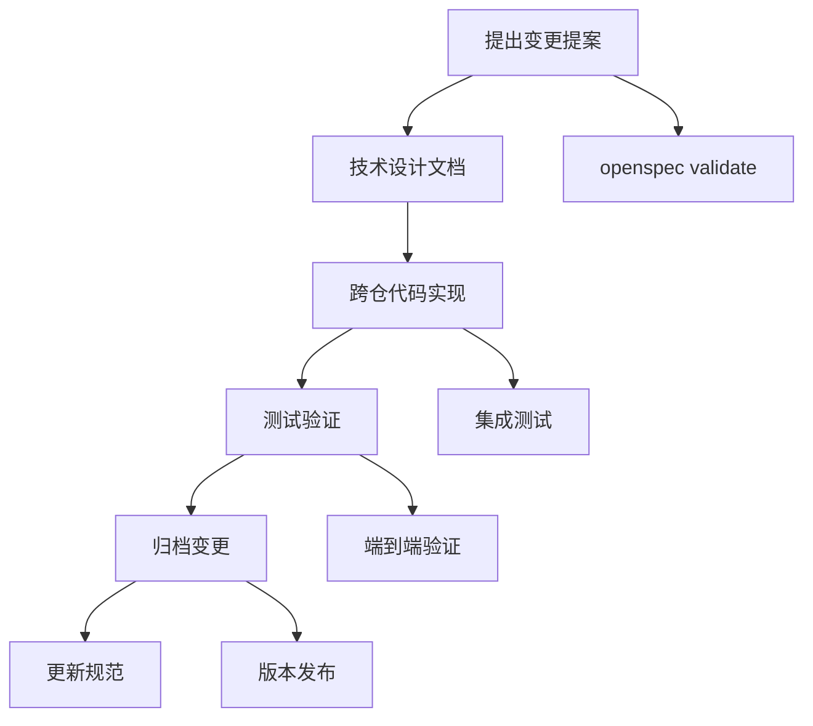

**图表来源**
- [arch-cloud-edge-split/proposal.md:1-77](file://openspec/changes/arch-cloud-edge-split/proposal.md#L1-L77)
- [arch-cloud-edge-split/design.md:18-41](file://openspec/changes/arch-cloud-edge-split/design.md#L18-L41)

**章节来源**
- [arch-cloud-edge-split/proposal.md:1-77](file://openspec/changes/arch-cloud-edge-split/proposal.md#L1-L77)
- [arch-cloud-edge-split/design.md:18-41](file://openspec/changes/arch-cloud-edge-split/design.md#L18-L41)

## 架构概览

### 云-边分离架构

iSales 采用创新的云-边分离架构，将硬件耦合的调制解调器控制与云端 AI 推理完全分离：

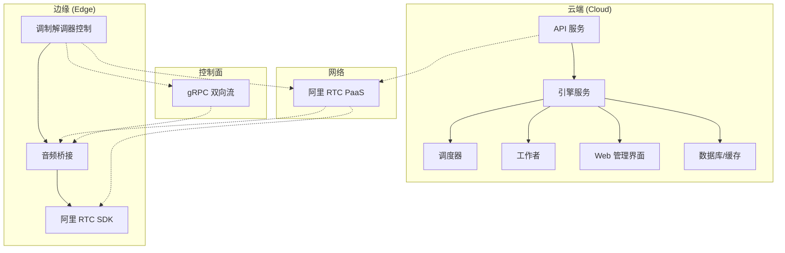

**图表来源**
- [v1-roadmap.md:243-282](file://openspec/v1-roadmap.md#L243-L282)
- [arch-cloud-edge-split/design.md:63-106](file://openspec/changes/arch-cloud-edge-split/design.md#L63-L106)

### 端到端时延预算

系统制定了严格的端到端时延预算，确保用户体验：

| 时延段 | 预算 (ms) | 说明 |
|--------|-----------|------|
| 调制解调器采音 | 20-40 | 8kHz/20ms 帧；GSM AMR 解码 |
| 音频桥接 | 20-40 | Opus 编码 + DTLS-SRTP |
| 云端处理 | 40-80 | 跨地域 RTT；阿里内网经 RTC PaaS |
| ASR 流式 | 100-200 | 豆包流式 ASR，首 partial 一般 ≤ 200ms |
| 多角色 PK | 200-400 | N 个角色 LLM 流式 + N×M 裁判 + 润色合并 |
| TTS 出站 | 20-40 | 类同入站对称段 |
| 总计 P95 | 470-955 | 多角色 PK 中位数 ~600-700ms 可达 |

**章节来源**
- [v1-roadmap.md:115-131](file://openspec/v1-roadmap.md#L115-L131)

## 详细组件分析

### 云-边控制面设计

云-边控制面是系统的核心通信机制，采用 gRPC 双向流实现：

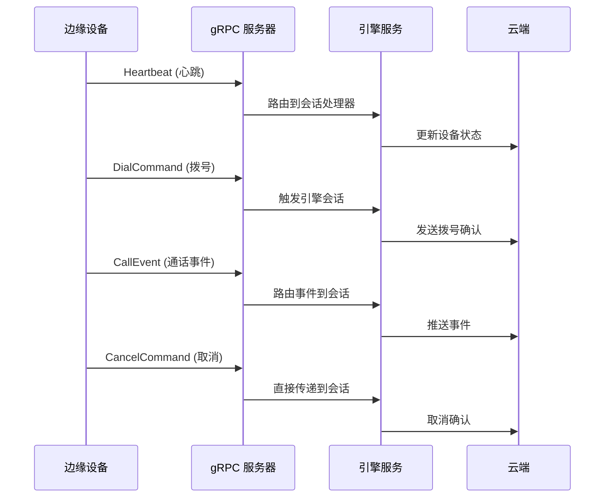

**图表来源**
- [arch-cloud-edge-split/design.md:133-176](file://openspec/changes/arch-cloud-edge-split/design.md#L133-L176)

#### 控制面协议设计

控制面协议采用 protobuf oneof 消息统一序列化：

| 消息类型 | 用途 | 关键字段 |
|----------|------|----------|
| Heartbeat | 心跳检测 | 心跳间隔、设备状态 |
| DialCommand | 拨号指令 | call_id、device_id、号码 |
| CancelCommand | 取消通话 | call_id、原因 |
| CallEvent | 通话事件 | 状态、原因、时间戳 |
| HardwareAlert | 硬件告警 | 类型、严重程度、详情 |
| ConfigUpdate | 配置更新 | 配置键值对 |
| RtcCredentials | RTC 凭证 | AppId、Token、UID |

**章节来源**
- [arch-cloud-edge-split/design.md:137-162](file://openspec/changes/arch-cloud-edge-split/design.md#L137-L162)

### 边缘音频桥接系统

边缘音频桥接系统实现了调制解调器音频与云端 RTC 的无缝连接：

```mermaid
flowchart LR
subgraph "边缘侧"
A[调制解调器控制器] --> B[音频桥接]
B --> C[阿里 RTC 客户端]
end
subgraph "云端"
D[阿里 RTC 服务端] --> E[引擎音频管道]
end
subgraph "网络"
F[阿里 RTC PaaS]
end
A < --> |PCM 音频| B
B < --> |Opus 编码| F
F < --> |PCM 音频| D
D < --> |PCM 音频| E
E < --> |PCM 音频| B
```

**图表来源**
- [arch-cloud-edge-split/design.md:63-106](file://openspec/changes/arch-cloud-edge-split/design.md#L63-L106)

#### 音频重采样策略

系统采用智能重采样策略处理不同采样率的音频：

- **上行音频**：调制解调器 8kHz → 音频桥接 16kHz
- **下行音频**：引擎 16kHz → 调制解调器 8kHz  
- **重采样算法**：使用 scipy.signal.resample_poly 实现高质量重采样
- **延迟控制**：重采样延迟 ≤ 5ms，确保实时性

**章节来源**
- [arch-cloud-edge-split/design.md:100-105](file://openspec/changes/arch-cloud-edge-split/design.md#L100-L105)

### AI 管线架构

多角色 PK 管线是系统的核心 AI 能力：

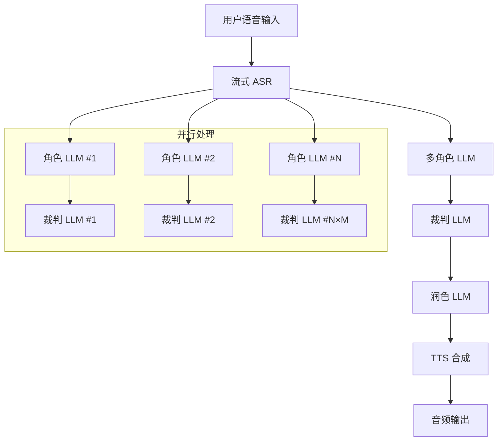

**图表来源**
- [v1-roadmap.md:541-558](file://openspec/v1-roadmap.md#L541-L558)

#### 流式处理机制

系统采用流式处理确保低延迟：

- **ASR 流式**：200-500ms 产生 partial 结果
- **LLM 流式**：token 一来就转 TTS
- **TTS 流式**：首 byte ~150ms
- **端到端预算**：P95 ≤ 800ms，P99 ≤ 1200ms

**章节来源**
- [v1-roadmap.md:47-57](file://openspec/v1-roadmap.md#L47-L57)

### 边缘 VAD 和打断机制

边缘 VAD 机制实现了真正的用户打断：

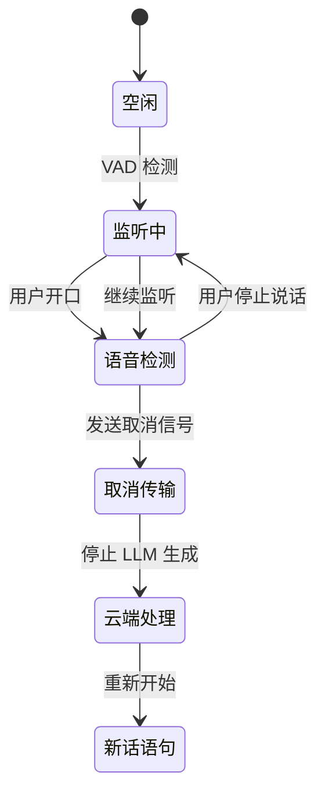

**图表来源**
- [v1-roadmap-a3-context.md:10-35](file://openspec/v1-roadmap-a3-context.md#L10-L35)

#### VAD 决策点迁移

A3 变更将 VAD 决策点从云端迁移到边缘：

- **原有位置**：云端 ASR partial 检测
- **新位置**：边缘本地 VAD 检测
- **优势**：消除 WAN RTT，提高响应速度
- **实现**：边缘 VAD 检测到用户开口后立即停止播放

**章节来源**
- [v1-roadmap-a3-context.md:29-35](file://openspec/v1-roadmap-a3-context.md#L29-L35)

## 依赖分析

### 服务间通信矩阵

OpenSpec 定义了严格的服务间通信规范：

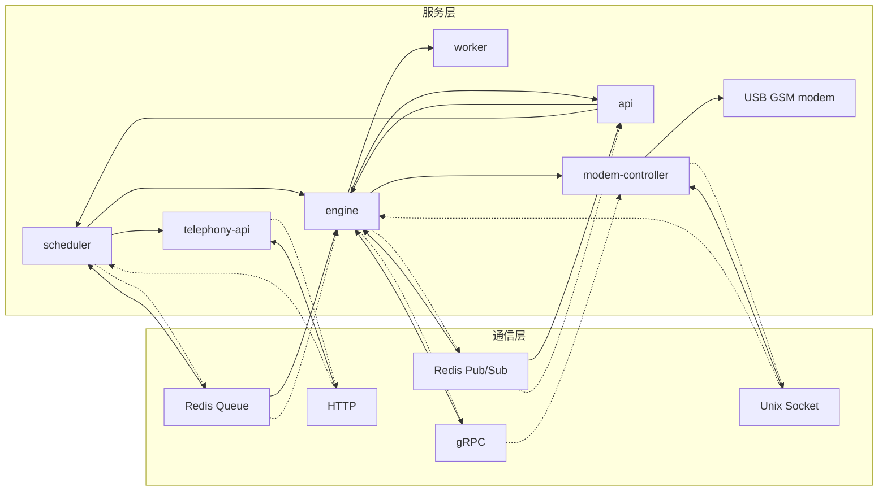

**图表来源**
- [service-communication/spec.md:11-24](file://openspec/specs/service-communication/spec.md#L11-L24)

### 数据库设计

系统采用统一的数据库设计模式：

| 表名 | 主要字段 | 用途 |
|------|----------|------|
| device | id, name, status, last_seen_at | 设备状态管理 |
| sim_card | iccid, phone_number, status | SIM 卡信息 |
| campaign | id, name, greeting, goal_type | Campaign 配置 |
| call_record | id, campaign_id, device_id, transcript | 通话记录 |
| call_summary | id, campaign_id, goal_type, goal_payload | 通话摘要 |

**章节来源**
- [device-hardware/spec.md:517-525](file://openspec/specs/device-hardware/spec.md#L517-L525)

## 性能考虑

### 并发控制策略

系统采用多层并发控制确保稳定性：

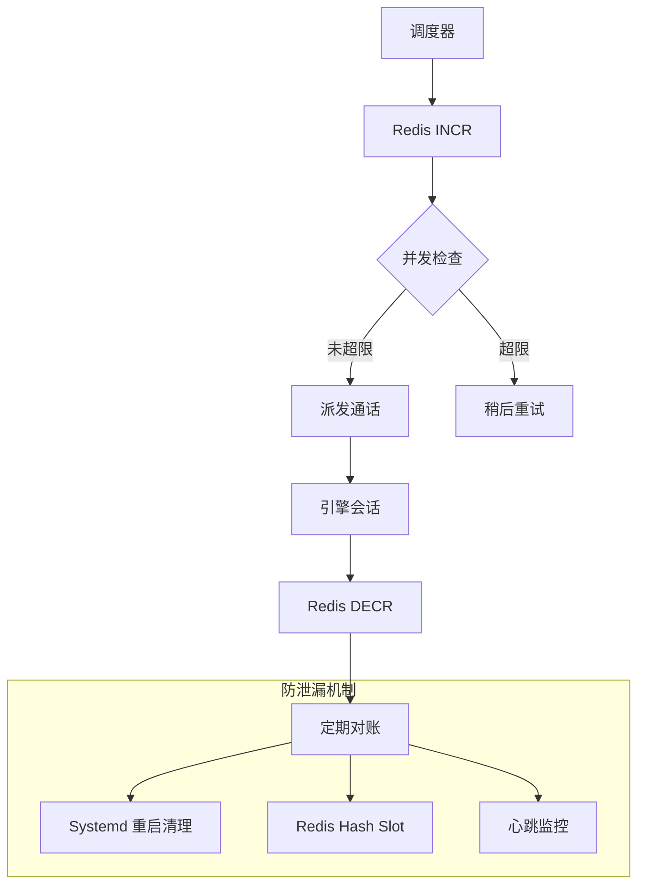

**图表来源**
- [service-communication/spec.md:45-63](file://openspec/specs/service-communication/spec.md#L45-L63)

### 监控和告警

系统提供全面的监控和告警机制：

- **Prometheus 指标**：引擎拨号队列深度、设备状态比例、回调失败率
- **Grafana 仪表板**：通话数量、队列趋势、错误日志统计
- **告警规则**：队列深度超阈值、设备异常比例、数据库连接数

**章节来源**
- [deployment-topology/spec.md:95-113](file://openspec/specs/deployment-topology/spec.md#L95-L113)

## 故障排查指南

### 常见问题诊断

#### 云-边连接问题

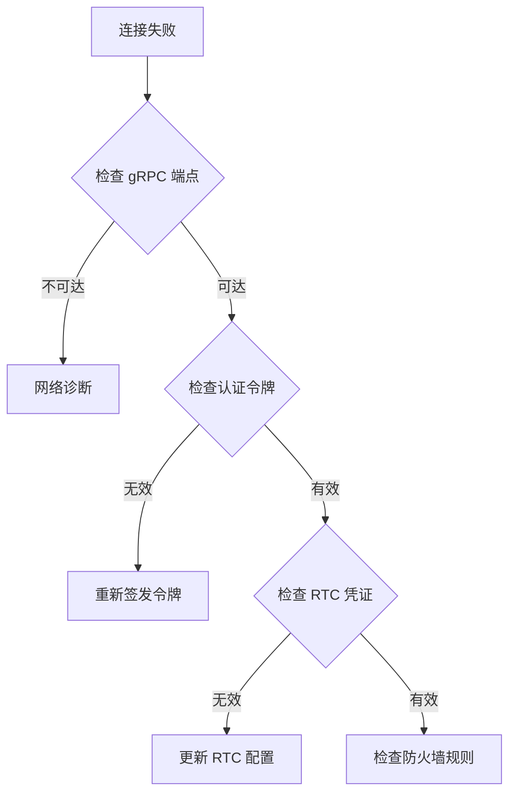

#### 音频质量问题

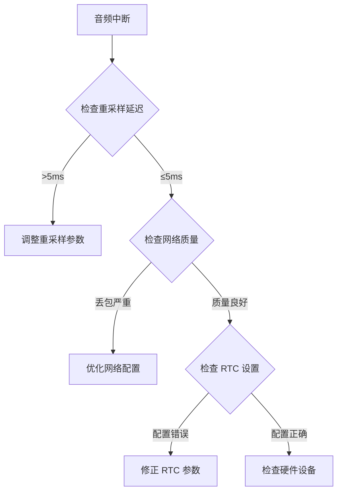

### 调试工具

系统提供丰富的调试工具：

- **openspec validate**：验证所有规范和变更的结构完整性
- **gRPC 工具**：grpcurl 用于测试 gRPC 服务
- **日志分析**：统一的日志格式和分析工具
- **性能监控**：实时性能指标和历史趋势分析

**章节来源**
- [README.md:66-74](file://README.md#L66-L74)

## 结论

OpenSpec 规范系统为 iSales 项目提供了完整的架构治理和变更管理框架。通过标准化的规范定义、严格的变更流程和完善的监控机制，系统确保了代码质量和演进的可控性。

系统的核心优势包括：

1. **架构清晰**：云-边分离架构确保了可扩展性和可维护性
2. **流程规范**：从提案到归档的完整变更管理流程
3. **质量保障**：严格的验证机制和测试策略
4. **运维友好**：完善的监控、告警和故障排查工具

随着项目的不断发展，OpenSpec 系统将继续演进，为 iSales 的长期发展提供坚实的技术基础。

## 附录

### 开发者参与指南

#### 参与规范制定

1. **学习规范**：熟悉现有的规范文档和变更流程
2. **提出提案**：通过 `/opsx:propose <name>` 命令创建新变更
3. **设计文档**：编写详细的技术设计方案
4. **代码实现**：按照设计方案实现功能
5. **测试验证**：进行全面的测试和验证
6. **归档变更**：完成变更的归档和发布

#### 规范编写最佳实践

- **简洁明了**：使用清晰的语言描述需求
- **可验证性**：确保规范具有可验证的测试方法
- **向前兼容**：尽量保持向后兼容性
- **文档完整**：提供完整的使用示例和配置说明

#### 变更管理流程

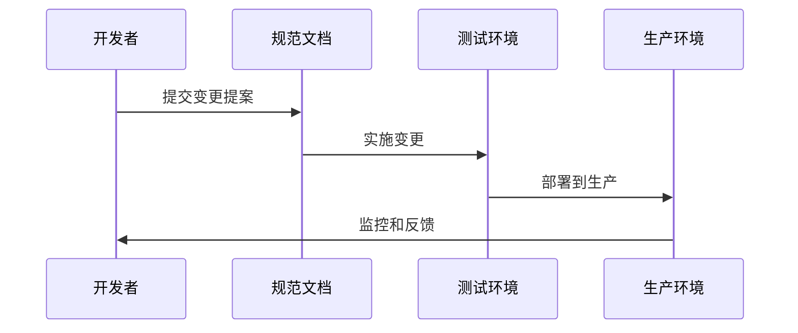