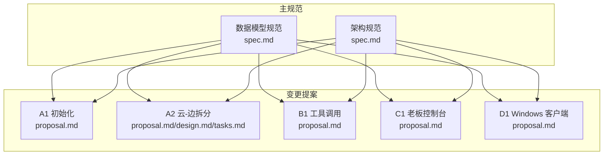
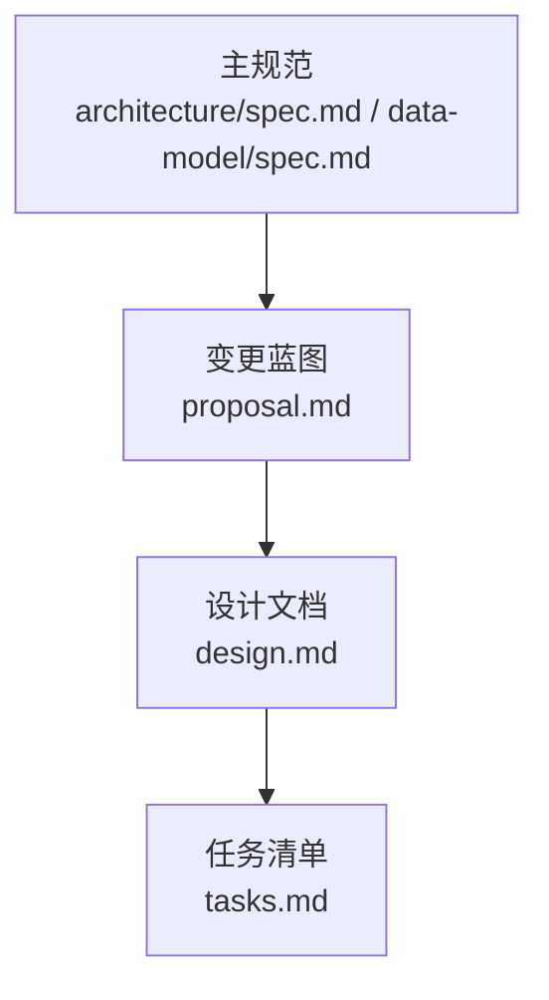
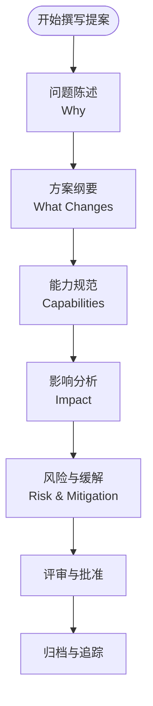
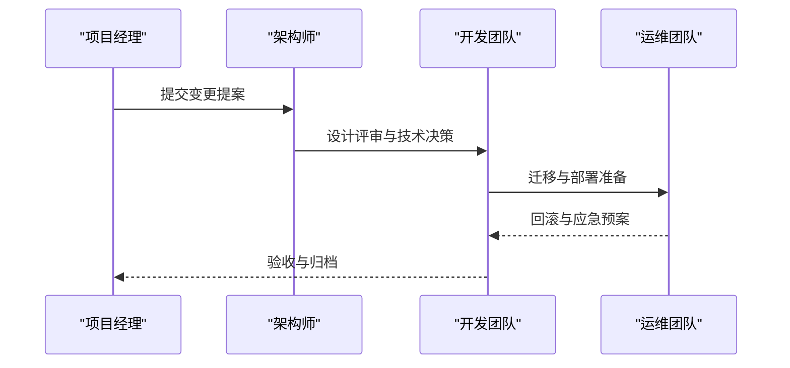
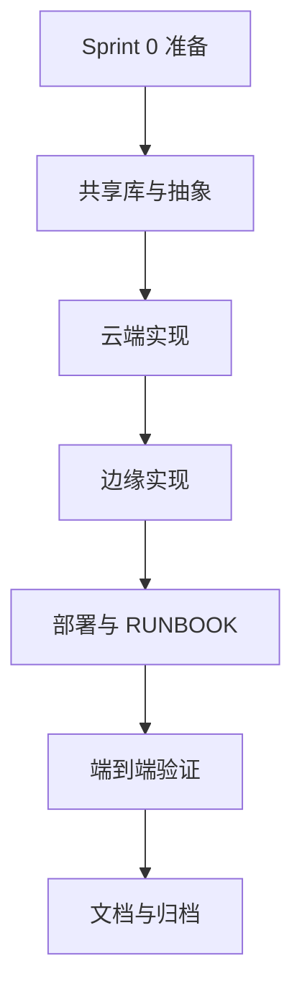

# 变更提案管理

<cite>
**本文档引用的文件**
- [v1-roadmap.md](file://openspec/v1-roadmap.md)
- [proposal.md](file://openspec/changes/arch-cloud-edge-split/proposal.md)
- [design.md](file://openspec/changes/arch-cloud-edge-split/design.md)
- [tasks.md](file://openspec/changes/arch-cloud-edge-split/tasks.md)
- [.openspec.yaml](file://openspec/changes/arch-cloud-edge-split/.openspec.yaml)
- [proposal.md](file://openspec/changes/archive/2026-05-01-init-isales-common/proposal.md)
- [proposal.md](file://openspec/changes/archive/2026-05-06-impl-api/proposal.md)
- [proposal.md](file://openspec/changes/archive/2026-05-06-impl-scheduler/proposal.md)
- [proposal.md](file://openspec/changes/archive/2026-05-06-impl-telephony/proposal.md)
- [spec.md](file://openspec/specs/data-model/spec.md)
- [spec.md](file://openspec/specs/architecture/spec.md)
</cite>

## 目录
1. [简介](#简介)
2. [项目结构](#项目结构)
3. [核心组件](#核心组件)
4. [架构概览](#架构概览)
5. [详细组件分析](#详细组件分析)
6. [依赖分析](#依赖分析)
7. [性能考虑](#性能考虑)
8. [故障排查指南](#故障排查指南)
9. [结论](#结论)
10. [附录](#附录)

## 简介
本文件系统性阐述 iSales 项目中的变更提案管理体系，基于仓库内现有的 OpenSpec 变更提案实践，总结变更提案的结构、撰写规范、评审流程、批准标准与版本控制机制。文档重点参考了云-边拆分（A2）变更提案及其配套设计文档、任务清单与 v1 路线图，同时结合早期初始化（A1）与阶段 2 实施（B1、C1、D1）的提案范式，形成可复用的变更提案模板与最佳实践。

## 项目结构
iSales 采用 OpenSpec 变更提案驱动的规范与实现分离模式：
- openspec/specs：主规范（Main Specs），定义能力域与约束
- openspec/changes：变更提案（Changes），每个变更提案包含 proposal.md、design.md、tasks.md 与 .openspec.yaml
- openspec/changes/archive：归档的变更提案，便于追溯与审计

**图表来源**
- [v1-roadmap.md:207-214](file://openspec/v1-roadmap.md#L207-L214)
- [proposal.md:1-77](file://openspec/changes/arch-cloud-edge-split/proposal.md#L1-L77)
- [proposal.md:1-33](file://openspec/changes/archive/2026-05-01-init-isales-common/proposal.md#L1-L33)

**章节来源**
- [v1-roadmap.md:207-214](file://openspec/v1-roadmap.md#L207-L214)
- [proposal.md:1-77](file://openspec/changes/arch-cloud-edge-split/proposal.md#L1-L77)
- [proposal.md:1-33](file://openspec/changes/archive/2026-05-01-init-isales-common/proposal.md#L1-L33)

## 核心组件
变更提案的标准化结构由四部分组成：
- 变更蓝图（Proposal）：问题陈述、方案纲要、触及的能力规范与依赖关系
- 设计文档（Design）：背景、目标与非目标、关键决策、风险与权衡、迁移计划与开放问题
- 任务清单（Tasks）：Sprint 0 至上线的可执行任务分解与验收点
- 元数据（.openspec.yaml）：变更提案的模式与创建时间

此外，主规范（如数据模型、架构）为变更提案提供约束与边界，确保变更在既定框架内演进。

**章节来源**
- [proposal.md:1-77](file://openspec/changes/arch-cloud-edge-split/proposal.md#L1-L77)
- [design.md:1-248](file://openspec/changes/arch-cloud-edge-split/design.md#L1-L248)
- [tasks.md:1-135](file://openspec/changes/arch-cloud-edge-split/tasks.md#L1-L135)
- [.openspec.yaml:1-3](file://openspec/changes/arch-cloud-edge-split/.openspec.yaml#L1-L3)

## 架构概览
变更提案与主规范的关系体现为“约束与演进”：主规范定义能力域与边界，变更提案在规范约束内提出增量或调整。以云-边拆分为例，变更提案在架构、部署拓扑、服务通信等既有规范基础上进行 spec delta。

**图表来源**
- [spec.md:1-168](file://openspec/specs/architecture/spec.md#L1-L168)
- [spec.md:1-83](file://openspec/specs/data-model/spec.md#L1-L83)
- [proposal.md:28-40](file://openspec/changes/arch-cloud-edge-split/proposal.md#L28-L40)
- [design.md:1-248](file://openspec/changes/arch-cloud-edge-split/design.md#L1-L248)

**章节来源**
- [spec.md:1-168](file://openspec/specs/architecture/spec.md#L1-L168)
- [spec.md:1-83](file://openspec/specs/data-model/spec.md#L1-L83)
- [proposal.md:28-40](file://openspec/changes/arch-cloud-edge-split/proposal.md#L28-L40)
- [design.md:1-248](file://openspec/changes/arch-cloud-edge-split/design.md#L1-L248)

## 详细组件分析

### 变更蓝图（Proposal）结构与要素
- 问题陈述（Why）：明确现状痛点与演进动机，如云-边拆分以支撑 SaaS 多租户与集中 AI 推理
- 方案纲要（What Changes）：列出具体改动、新增能力、影响的服务与外部依赖
- 能力规范（Capabilities）：区分新增与修改的能力域，映射到主规范的 spec deltas
- 影响分析（Impact）：涉及的仓库与代码影响、依赖与外部资源、变更链接与风险缓解
- 风险与缓解（Risk & 缓解）：量化风险与应对策略

**图表来源**
- [proposal.md:1-77](file://openspec/changes/arch-cloud-edge-split/proposal.md#L1-L77)

**章节来源**
- [proposal.md:1-77](file://openspec/changes/arch-cloud-edge-split/proposal.md#L1-L77)

### 设计文档（Design）结构与要素
- 背景（Context）：现状与前置条件，如 A1 已完成与阿里 RTC PoC 结果
- 目标与非目标（Goals/Non-Goals）：明确要达成的目标与不在范围内的事项
- 关键决策（Decisions）：技术选型、架构约束与设计权衡
- 风险与权衡（Risks/Trade-offs）：量化风险与降级策略
- 迁移计划（Migration Plan）：Sprint 顺序、部署与回滚策略
- 开放问题（Open Questions）：待后续澄清的议题

**图表来源**
- [design.md:1-248](file://openspec/changes/arch-cloud-edge-split/design.md#L1-L248)

**章节来源**
- [design.md:1-248](file://openspec/changes/arch-cloud-edge-split/design.md#L1-L248)

### 任务清单（Tasks）结构与要素
- Sprint 0 准备：环境开通、SDK 获取、PoC 实测
- 共享库与抽象：proto 定义、传输抽象、音频后端抽象
- 云端实现：ARTC SDK 接入、gRPC server、engine session co-location
- 边缘实现：audio-bridge、gRPC client、SQLite 离线缓冲
- 部署与 RUNBOOK：云端与边缘部署脚本、监控告警
- 端到端验证：音频通路、AI 开场白、延迟测量、故障注入
- 文档与归档：v1 路线图更新、上下文整理、归档准备

**图表来源**
- [tasks.md:23-135](file://openspec/changes/arch-cloud-edge-split/tasks.md#L23-L135)

**章节来源**
- [tasks.md:1-135](file://openspec/changes/arch-cloud-edge-split/tasks.md#L1-L135)

### 元数据（.openspec.yaml）
- schema：spec-driven（规范驱动）
- created：变更提案创建日期

**章节来源**
- [.openspec.yaml:1-3](file://openspec/changes/arch-cloud-edge-split/.openspec.yaml#L1-L3)

### 变更提案模板与示例

#### 云-边拆分（A2）提案模板
- 问题陈述：单主机形态阻碍 SaaS 多租户与集中 AI 推理
- 方案纲要：5 服务上云 + 2 组件留边 + 云-边控制面与媒体面
- 能力规范：架构、部署拓扑、服务通信、设备硬件的 spec deltas
- 影响分析：isales-engine、isales-telephony、isales-api、isales-scheduler、isales-worker、isales-web、isales-common 的改动清单
- 风险与缓解：ARTC SDK 延迟、buffer-full 触发、多角色 PK 流水、断网处理、远程运维成本

**章节来源**
- [proposal.md:1-77](file://openspec/changes/arch-cloud-edge-split/proposal.md#L1-L77)
- [design.md:42-214](file://openspec/changes/arch-cloud-edge-split/design.md#L42-L214)

#### 初始化（A1）提案模板
- 问题陈述：缺少共享库导致下游服务无法启动
- 方案纲要：新建 isales-common，落地数据模型、Provider 接口、消息契约
- 能力规范：provider-abc、message-contract 的首次实施
- 影响分析：阻塞其他 6 个服务的实施

**章节来源**
- [proposal.md:1-33](file://openspec/changes/archive/2026-05-01-init-isales-common/proposal.md#L1-L33)

#### 阶段 2 实施（B1、C1、D1）提案模板
- 问题陈述：管理后台 CRUD、调度与前端 WebSocket、边缘 Windows 客户端
- 方案纲要：API 服务、调度器、Telephony 服务、前端控制台、Windows 客户端
- 能力规范：service-communication、data-model、architecture 的实施
- 影响分析：各服务的依赖链与并行实施

**章节来源**
- [proposal.md:1-67](file://openspec/changes/archive/2026-05-06-impl-api/proposal.md#L1-L67)
- [proposal.md:1-68](file://openspec/changes/archive/2026-05-06-impl-scheduler/proposal.md#L1-L68)
- [proposal.md:1-61](file://openspec/changes/archive/2026-05-06-impl-telephony/proposal.md#L1-L61)

## 依赖分析
变更提案之间存在严格的依赖链，v1 路线图定义了 A1 → A2 → A3 → B1 → B2 → C1 → C2 → D1 → D2 → D3 的线性依赖，部分可并行。依赖关系直接影响变更的提出时机与归档顺序。

**图表来源**
- [v1-roadmap.md:222-453](file://openspec/v1-roadmap.md#L222-L453)

**章节来源**
- [v1-roadmap.md:222-453](file://openspec/v1-roadmap.md#L222-L453)

## 性能考虑
- 端到端延迟预算：云-边音频单程 ≤ 800 ms，包含硬件采样、编码/解码、网络传输、云端处理与回放
- 多角色 PK 流水：在 800 ms 预算内端到端达标，若不达标采取运行时降级（默认 N=1）
- ARTC SDK 延迟与反压：服务端 PCM 回调延迟与 buffer-full 触发频率需通过 Day 2 实测补齐
- 单实例承载力：v1.0 单云实例承载 100-1000 seats，阿里 RTC SDK 并发上限需在 Sprint 0 实测

**章节来源**
- [design.md:115-131](file://openspec/changes/arch-cloud-edge-split/design.md#L115-L131)
- [design.md:204-213](file://openspec/changes/arch-cloud-edge-split/design.md#L204-L213)
- [tasks.md:23-29](file://openspec/changes/arch-cloud-edge-split/tasks.md#L23-L29)

## 故障排查指南
- gRPC 控制面断连：边缘自动重连、本地 SQLite 缓冲离线事件顺序补发、RTC 媒体会与控制面独立断连/重连
- 边缘断网期间进行中通话：modem 自然挂断，本地 SQLite 补发 remote_hangup，调度器重试机制兜底
- ARTC SDK 问题：通过 Day 2 实测脚本补齐延迟数据，必要时调整音频抖动策略或 SDK 内部 buffer
- 回滚策略：A2 无“回退到单主机”的语义，若发现致命问题则阻塞下游变更推进、修复 A2 再发

**章节来源**
- [design.md:168-176](file://openspec/changes/arch-cloud-edge-split/design.md#L168-L176)
- [tasks.md:120-127](file://openspec/changes/arch-cloud-edge-split/tasks.md#L120-L127)

## 结论
iSales 的变更提案管理体系以 OpenSpec 为核心，通过标准化的 Proposal、Design、Tasks 与 .openspec.yaml 元数据，确保变更在主规范约束内有序演进。v1 路线图明确了变更间的依赖关系与并行策略，A2 云-边拆分为后续变更奠定基础。实践中应严格遵循“先提案、后设计、再实施、最后归档”的流程，确保变更的可追溯性与可审计性。

## 附录

### 变更提案撰写最佳实践
- 明确问题陈述与业务价值，避免技术导向的“为改而改”
- 限定方案范围，聚焦“物理位置迁移”而非“功能增强”
- 严格映射到主规范的 spec deltas，避免凭空新增机制
- 量化风险与缓解措施，必要时提供降级策略
- 与下游变更保持依赖一致性，避免 spec delta 冲突

**章节来源**
- [proposal.md:28-40](file://openspec/changes/arch-cloud-edge-split/proposal.md#L28-L40)
- [design.md:42-41](file://openspec/changes/arch-cloud-edge-split/design.md#L42-L41)

### 变更提案评审流程与批准标准
- 评审参与者：产品、架构师、开发与运维代表
- 批准标准：技术可行性、与主规范一致性、风险可控、依赖清晰
- 版本控制：变更提案归档至 openspec/changes/archive，v1 路线图同步更新

**章节来源**
- [v1-roadmap.md:560-570](file://openspec/v1-roadmap.md#L560-L570)