# 规范编写指南

<cite>
**本文档引用的文件**
- [架构规范](file://openspec/specs/architecture/spec.md)
- [数据模型规范](file://openspec/specs/data-model/spec.md)
- [服务通信规范](file://openspec/specs/service-communication/spec.md)
- [部署拓扑规范](file://openspec/specs/deployment-topology/spec.md)
- [设备硬件规范](file://openspec/specs/device-hardware/spec.md)
- [消息契约规范](file://openspec/specs/message-contract/spec.md)
- [Webhook 回调规范](file://openspec/specs/webhook-callback/spec.md)
- [提供商凭据规范](file://openspec/specs/provider-credential/spec.md)
- [AI 管线规范](file://openspec/specs/ai-pipeline/spec.md)
- [通话状态机规范](file://openspec/specs/call-state-machine/spec.md)
- [重试跟进规范](file://openspec/specs/retry-followup/spec.md)
- [时间窗口规范](file://openspec/specs/time-window/spec.md)
- [垫词规范](file://openspec/specs/filler/spec.md)
- [转人工规范](file://openspec/specs/human-handoff/spec.md)
- [打断检测规范](file://openspec/specs/interruption-detection/spec.md)
- [沉默激活规范](file://openspec/specs/silence-activation/spec.md)
- [目标达成规范](file://openspec/specs/goal-achievement/spec.md)
- [变更管理配置](file://openspec/changes/arch-cloud-edge-split/.openspec.yaml)
</cite>

## 目录
1. [简介](#简介)
2. [项目结构](#项目结构)
3. [核心组件](#核心组件)
4. [架构总览](#架构总览)
5. [详细组件分析](#详细组件分析)
6. [依赖关系分析](#依赖关系分析)
7. [性能考虑](#性能考虑)
8. [故障排除指南](#故障排除指南)
9. [结论](#结论)
10. [附录](#附录)

## 简介
本指南面向 OpenSpec 规范编写团队，系统阐述如何基于仓库现有的规范文件，制定统一、严谨、可维护的规范编写方法论。内容涵盖架构规范、数据模型规范、通信协议规范等各类规范的结构化编写流程，明确规范的组织原则（摘要、背景、设计决策、接口定义、约束条件等），并提供版本管理、变更追踪与文档维护的最佳实践。同时，结合仓库内真实规范示例，给出可直接参考的模板与范式，帮助团队快速产出高质量、可落地的规范文档。

## 项目结构
OpenSpec 仓库采用“规范驱动”的组织方式，核心目录结构如下：
- openspec/specs：存放各领域规范文件（architecture、data-model、service-communication、deployment-topology、device-hardware、message-contract、webhook-callback、provider-credential、ai-pipeline、call-state-machine、retry-followup、time-window、filler、human-handoff、interruption-detection、silence-activation、goal-achievement 等）
- openspec/changes：存放变更提案与归档，每个变更包含 proposal、design、tasks、specs 子目录及 .openspec.yaml 元数据
- deploy：部署与运维相关文档（README、RUNBOOK、监控配置等）

```mermaid
graph TB
A["openspec/"] --> B["specs/"]
A --> C["changes/"]
A --> D["v1-* 相关文档"]
B --> B1["architecture/spec.md"]
B --> B2["data-model/spec.md"]
B --> B3["service-communication/spec.md"]
B --> B4["deployment-topology/spec.md"]
B --> B5["device-hardware/spec.md"]
B --> B6["message-contract/spec.md"]
B --> B7["webhook-callback/spec.md"]
B --> B8["provider-credential/spec.md"]
B --> B9["ai-pipeline/spec.md"]
B --> B10["call-state-machine/spec.md"]
B --> B11["retry-followup/spec.md"]
B --> B12["time-window/spec.md"]
B --> B13["filler/spec.md"]
B --> B14["human-handoff/spec.md"]
B --> B15["interruption-detection/spec.md"]
B --> B16["silence-activation/spec.md"]
B --> B17["goal-achievement/spec.md"]
C --> C1["arch-cloud-edge-split/"]
C1 --> C1a[".openspec.yaml"]
C1 --> C1b["proposal.md"]
C1 --> C1c["design.md"]
C1 --> C1d["tasks.md"]
C1 --> C1e["specs/..."]
```

图表来源
- [架构规范](file://openspec/specs/architecture/spec.md)
- [部署拓扑规范](file://openspec/specs/deployment-topology/spec.md)
- [设备硬件规范](file://openspec/specs/device-hardware/spec.md)
- [消息契约规范](file://openspec/specs/message-contract/spec.md)
- [Webhook 回调规范](file://openspec/specs/webhook-callback/spec.md)
- [提供商凭据规范](file://openspec/specs/provider-credential/spec.md)
- [AI 管线规范](file://openspec/specs/ai-pipeline/spec.md)
- [通话状态机规范](file://openspec/specs/call-state-machine/spec.md)
- [重试跟进规范](file://openspec/specs/retry-followup/spec.md)
- [时间窗口规范](file://openspec/specs/time-window/spec.md)
- [垫词规范](file://openspec/specs/filler/spec.md)
- [转人工规范](file://openspec/specs/human-handoff/spec.md)
- [打断检测规范](file://openspec/specs/interruption-detection/spec.md)
- [沉默激活规范](file://openspec/specs/silence-activation/spec.md)
- [目标达成规范](file://openspec/specs/goal-achievement/spec.md)
- [变更管理配置](file://openspec/changes/arch-cloud-edge-split/.openspec.yaml)

章节来源
- [架构规范](file://openspec/specs/architecture/spec.md)
- [部署拓扑规范](file://openspec/specs/deployment-topology/spec.md)
- [设备硬件规范](file://openspec/specs/device-hardware/spec.md)
- [消息契约规范](file://openspec/specs/message-contract/spec.md)
- [Webhook 回调规范](file://openspec/specs/webhook-callback/spec.md)
- [提供商凭据规范](file://openspec/specs/provider-credential/spec.md)
- [AI 管线规范](file://openspec/specs/ai-pipeline/spec.md)
- [通话状态机规范](file://openspec/specs/call-state-machine/spec.md)
- [重试跟进规范](file://openspec/specs/retry-followup/spec.md)
- [时间窗口规范](file://openspec/specs/time-window/spec.md)
- [垫词规范](file://openspec/specs/filler/spec.md)
- [转人工规范](file://openspec/specs/human-handoff/spec.md)
- [打断检测规范](file://openspec/specs/interruption-detection/spec.md)
- [沉默激活规范](file://openspec/specs/silence-activation/spec.md)
- [目标达成规范](file://openspec/specs/goal-achievement/spec.md)
- [变更管理配置](file://openspec/changes/arch-cloud-edge-split/.openspec.yaml)

## 核心组件
OpenSpec 规范体系围绕以下核心组件展开：
- 架构规范：定义系统总体架构、仓库划分、职责边界、共享库依赖与部署模型
- 数据模型规范：定义统一的数据表清单、归属服务、跨服务一致性与 JSONB 约束
- 服务通信规范：定义服务间通信通道矩阵、队列与 Pub/Sub 边界、全局并发控制与容错策略
- 部署拓扑规范：定义 v1 单主机部署模型、环境变量契约、服务启停顺序、备份与监控
- 设备硬件规范：定义 modem-controller 进程职责、device 状态机、SIM 管理、IPC 协议与 hangup_cause 映射
- 消息契约规范：定义跨服务消息体集中定义、版本字段、通道矩阵覆盖与序列化可观测性
- Webhook 回调规范：定义触发时机、JsonLogic 表达式、Jinja2 沙盒渲染、HMAC-SHA256 签名与指数退避重试
- 提供商凭据规范：定义凭据 DB 单一事实来源、Fernet 对称加密、Admin CRUD 端点与迁移工具
- AI 管线规范：定义三层并行管线编排、JSON 输出契约、失败兜底与降级路径
- 通话状态机规范：定义状态集合、转换规则、特殊状态（WRAPPING_UP、TRANSFERRING、ACTIVATING）与 hangup_cause 单一来源
- 重试跟进规范：定义重试与跟进两个独立机制、间隔策略、上限处理与勿打识别
- 时间窗口规范：定义可通话时间窗口配置、时区策略、节假日处理与跨边界保护
- 垫词规范：定义触发场景、启动时机、选择策略、音频来源与失败兜底
- 转人工规范：定义 v1 衰减为标记 + 通知的实现与坐席工作流
- 打断检测规范：定义 SPEAKING 状态下打断判定逻辑、连续打断保护与 ASR Provider 抽象
- 沉默激活规范：定义沉默检测、激活上限、话术选择与与角色 LLM 上下文隔离
- 目标达成规范：定义实时目标达成判定、收尾行为与回调匹配

章节来源
- [架构规范](file://openspec/specs/architecture/spec.md)
- [数据模型规范](file://openspec/specs/data-model/spec.md)
- [服务通信规范](file://openspec/specs/service-communication/spec.md)
- [部署拓扑规范](file://openspec/specs/deployment-topology/spec.md)
- [设备硬件规范](file://openspec/specs/device-hardware/spec.md)
- [消息契约规范](file://openspec/specs/message-contract/spec.md)
- [Webhook 回调规范](file://openspec/specs/webhook-callback/spec.md)
- [提供商凭据规范](file://openspec/specs/provider-credential/spec.md)
- [AI 管线规范](file://openspec/specs/ai-pipeline/spec.md)
- [通话状态机规范](file://openspec/specs/call-state-machine/spec.md)
- [重试跟进规范](file://openspec/specs/retry-followup/spec.md)
- [时间窗口规范](file://openspec/specs/time-window/spec.md)
- [垫词规范](file://openspec/specs/filler/spec.md)
- [转人工规范](file://openspec/specs/human-handoff/spec.md)
- [打断检测规范](file://openspec/specs/interruption-detection/spec.md)
- [沉默激活规范](file://openspec/specs/silence-activation/spec.md)
- [目标达成规范](file://openspec/specs/goal-achievement/spec.md)

## 架构总览
OpenSpec 规范体系通过“规范驱动”实现跨领域的统一约束与协作。下图展示了规范之间的依赖与交互关系：

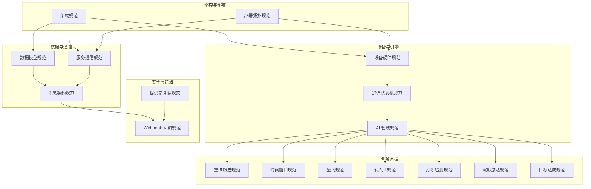
```mermaid
graph TB
subgraph "架构与部署"
A1["架构规范"]
A2["部署拓扑规范"]
end
subgraph "数据与通信"
B1["数据模型规范"]
B2["服务通信规范"]
B3["消息契约规范"]
end
subgraph "设备与引擎"
C1["设备硬件规范"]
C2["通话状态机规范"]
C3["AI 管线规范"]
end
subgraph "业务流程"
D1["重试跟进规范"]
D2["时间窗口规范"]
D3["垫词规范"]
D4["转人工规范"]
D5["打断检测规范"]
D6["沉默激活规范"]
D7["目标达成规范"]
end
subgraph "安全与运维"
E1["提供商凭据规范"]
E2["Webhook 回调规范"]
end
A1 --> B1
A1 --> B2
A1 --> C1
A2 --> B2
A2 --> C1
B1 --> B3
B2 --> B3
C1 --> C2
C2 --> C3
C3 --> D1
C3 --> D2
C3 --> D3
C3 --> D4
C3 --> D5
C3 --> D6
C3 --> D7
B3 --> E2
E1 --> E2
```

图表来源
- [架构规范](file://openspec/specs/architecture/spec.md)
- [部署拓扑规范](file://openspec/specs/deployment-topology/spec.md)
- [数据模型规范](file://openspec/specs/data-model/spec.md)
- [服务通信规范](file://openspec/specs/service-communication/spec.md)
- [消息契约规范](file://openspec/specs/message-contract/spec.md)
- [设备硬件规范](file://openspec/specs/device-hardware/spec.md)
- [通话状态机规范](file://openspec/specs/call-state-machine/spec.md)
- [AI 管线规范](file://openspec/specs/ai-pipeline/spec.md)
- [重试跟进规范](file://openspec/specs/retry-followup/spec.md)
- [时间窗口规范](file://openspec/specs/time-window/spec.md)
- [垫词规范](file://openspec/specs/filler/spec.md)
- [转人工规范](file://openspec/specs/human-handoff/spec.md)
- [打断检测规范](file://openspec/specs/interruption-detection/spec.md)
- [沉默激活规范](file://openspec/specs/silence-activation/spec.md)
- [目标达成规范](file://openspec/specs/goal-achievement/spec.md)
- [提供商凭据规范](file://openspec/specs/provider-credential/spec.md)
- [Webhook 回调规范](file://openspec/specs/webhook-callback/spec.md)

## 详细组件分析

### 架构规范分析
架构规范定义了 iSales 系统的总体架构：7 仓库划分、单主机部署模型、各服务职责边界、共享库依赖关系。其关键要点包括：
- 7 仓库微服务架构与 isales-common 共享库职责
- v1 单主机部署与进程隔离
- 数据存储统一（PostgreSQL + Redis）
- 内部 HTTP 服务统一 JWT 鉴权
- 架构选型的决策记录与变更流程

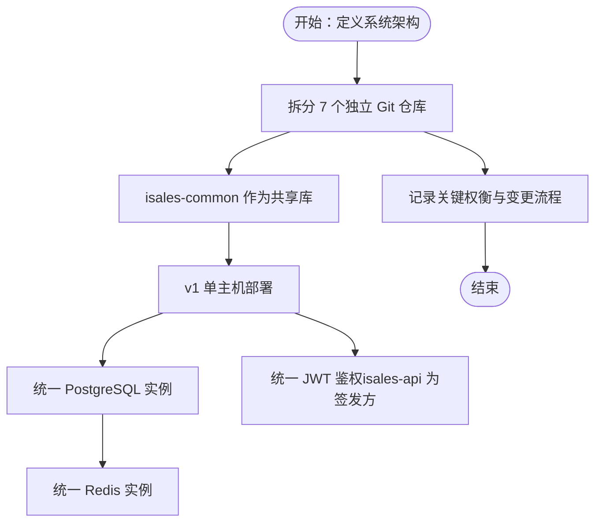
```mermaid
flowchart TD
Start(["开始：定义系统架构"]) --> RepoSplit["拆分 7 个独立 Git 仓库"]
RepoSplit --> CommonLib["isales-common 作为共享库"]
CommonLib --> SingleHost["v1 单主机部署"]
SingleHost --> UnifiedDB["统一 PostgreSQL 实例"]
UnifiedDB --> UnifiedRedis["统一 Redis 实例"]
SingleHost --> JWT["统一 JWT 鉴权isales-api 为签发方"]
RepoSplit --> DecisionLog["记录关键权衡与变更流程"]
DecisionLog --> End(["结束"])
```

图表来源
- [架构规范](file://openspec/specs/architecture/spec.md)

章节来源
- [架构规范](file://openspec/specs/architecture/spec.md)

### 数据模型规范分析
数据模型规范负责统一数据表与字段，明确每张表的归属服务，强调“目录视图 + 跨服务一致性”。关键要点包括：
- isales-common 统一管理 SQLAlchemy 模型与 Alembic 迁移
- 表归属与全表清单，明确归属决定 schema 演进与 PR 主导权
- JSONB 字段约束与 schema 文档要求
- 跨服务读 vs 写的约束与一致性

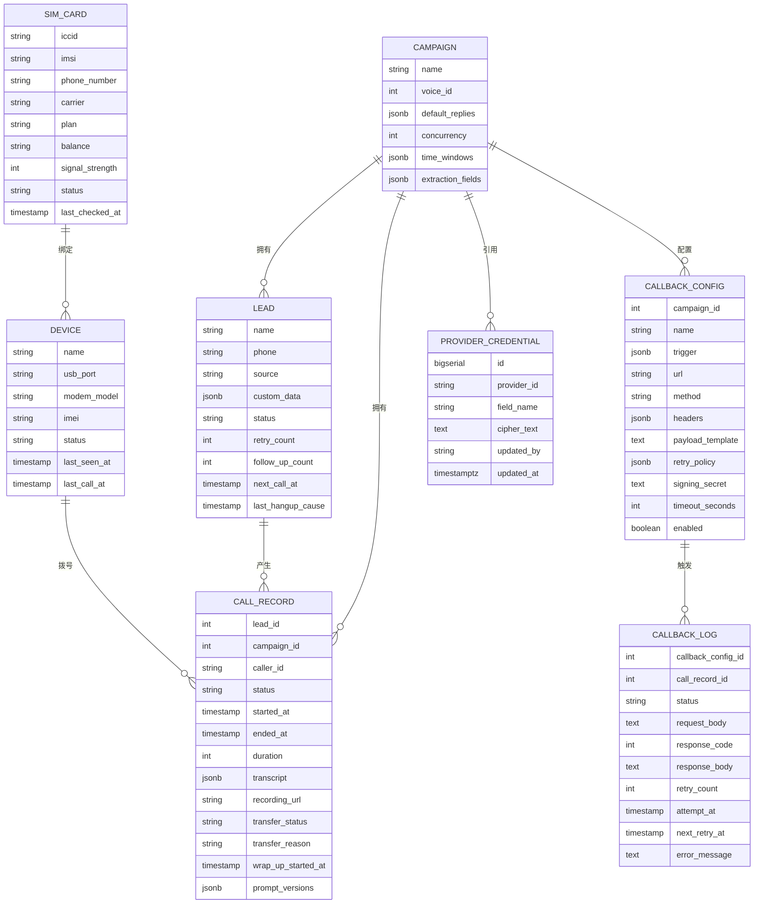
```mermaid
erDiagram
CAMPAIGN {
string name
int voice_id
jsonb default_replies
int concurrency
jsonb time_windows
jsonb extraction_fields
}
LEAD {
string name
string phone
string source
jsonb custom_data
string status
int retry_count
int follow_up_count
timestamp next_call_at
timestamp last_hangup_cause
}
CALL_RECORD {
int lead_id
int campaign_id
string caller_id
string status
timestamp started_at
timestamp ended_at
int duration
jsonb transcript
string recording_url
string transfer_status
string transfer_reason
timestamp wrap_up_started_at
jsonb prompt_versions
}
DEVICE {
string name
string usb_port
string modem_model
string imei
string status
timestamp last_seen_at
timestamp last_call_at
}
SIM_CARD {
string iccid
string imsi
string phone_number
string carrier
string plan
string balance
int signal_strength
string status
timestamp last_checked_at
}
CALLBACK_CONFIG {
int campaign_id
string name
jsonb trigger
string url
string method
jsonb headers
text payload_template
jsonb retry_policy
text signing_secret
int timeout_seconds
boolean enabled
}
CALLBACK_LOG {
int callback_config_id
int call_record_id
string status
text request_body
int response_code
text response_body
int retry_count
timestamp attempt_at
timestamp next_retry_at
text error_message
}
PROVIDER_CREDENTIAL {
bigserial id
string provider_id
string field_name
text cipher_text
string updated_by
timestamptz updated_at
}
CAMPAIGN ||--o{ LEAD : "拥有"
CAMPAIGN ||--o{ CALL_RECORD : "拥有"
LEAD ||--o{ CALL_RECORD : "产生"
DEVICE ||--o{ CALL_RECORD : "拨号"
SIM_CARD ||--o{ DEVICE : "绑定"
CAMPAIGN ||--o{ CALLBACK_CONFIG : "配置"
CALLBACK_CONFIG ||--o{ CALLBACK_LOG : "触发"
CAMPAIGN ||--o{ PROVIDER_CREDENTIAL : "引用"
```

图表来源
- [数据模型规范](file://openspec/specs/data-model/spec.md)

章节来源
- [数据模型规范](file://openspec/specs/data-model/spec.md)

### 服务通信规范分析
服务通信规范定义了 7 个服务之间的通信通道与用途，强调“调用关系矩阵 + 全局一致性”。关键要点包括：
- 通信通道矩阵（Redis Queue、Pub/Sub、HTTP、数据库直连）
- 队列与 Pub/Sub 的边界（必须送达 vs 实时可丢失）
- 全局并发控制（Redis 原子计数器）
- HTTP 调用限制与数据库直连约束
- 通信故障的容错策略
- API ↔ 前端 WebSocket 代理

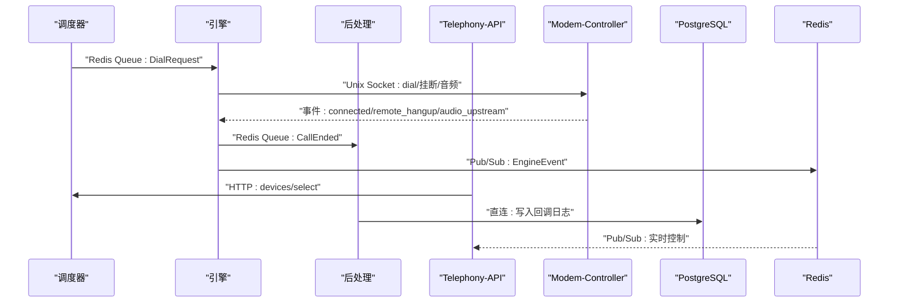
```mermaid
sequenceDiagram
participant Scheduler as "调度器"
participant Engine as "引擎"
participant Worker as "后处理"
participant Telephony as "Telephony-API"
participant Modem as "Modem-Controller"
participant DB as "PostgreSQL"
participant Redis as "Redis"
Scheduler->>Engine : "Redis Queue : DialRequest"
Engine->>Modem : "Unix Socket : dial/挂断/音频"
Modem-->>Engine : "事件 : connected/remote_hangup/audio_upstream"
Engine->>Worker : "Redis Queue : CallEnded"
Engine->>Redis : "Pub/Sub : EngineEvent"
Telephony->>Scheduler : "HTTP : devices/select"
Worker->>DB : "直连 : 写入回调日志"
Redis-->>Telephony : "Pub/Sub : 实时控制"
```

图表来源
- [服务通信规范](file://openspec/specs/service-communication/spec.md)
- [设备硬件规范](file://openspec/specs/device-hardware/spec.md)

章节来源
- [服务通信规范](file://openspec/specs/service-communication/spec.md)
- [设备硬件规范](file://openspec/specs/device-hardware/spec.md)

### 部署拓扑规范分析
部署拓扑规范定义了 v1 单主机部署模型与运维契约，关键要点包括：
- 7 个服务进程通过 systemd 管理，PostgreSQL 与 Redis 同主机
- 集中化环境变量契约与跨服务一致性约束
- 服务启停顺序与零停机注意事项
- 数据持久化与备份基线（PG 与 Redis）
- 监控暴露契约与最小告警集
- 部署脚本幂等与可回滚
- Windows 与 macOS 边缘形态部署要求

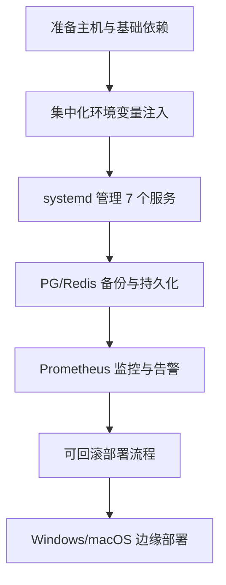
```mermaid
flowchart TD
Provision["准备主机与基础依赖"] --> Env["集中化环境变量注入"]
Env --> Services["systemd 管理 7 个服务"]
Services --> Backup["PG/Redis 备份与持久化"]
Backup --> Monitor["Prometheus 监控与告警"]
Monitor --> Rollback["可回滚部署流程"]
Rollback --> Edge["Windows/macOS 边缘部署"]
```

图表来源
- [部署拓扑规范](file://openspec/specs/deployment-topology/spec.md)

章节来源
- [部署拓扑规范](file://openspec/specs/deployment-topology/spec.md)

### 设备硬件规范分析
设备硬件规范定义了 USB GSM Modem 直连主机的自研控制方案，关键要点包括：
- 自研控制层与单主机部署，不引入开源 PBX
- modem-controller 三大职责：udev 监听器、AT 命令通道、PCM 音频管道
- device 状态机与 SIM 卡资料化管理
- engine ↔ modem-controller IPC 协议（Unix socket + JSON）
- 选 device API 与 GSM hangup_cause 映射
- 心跳与失联探测机制

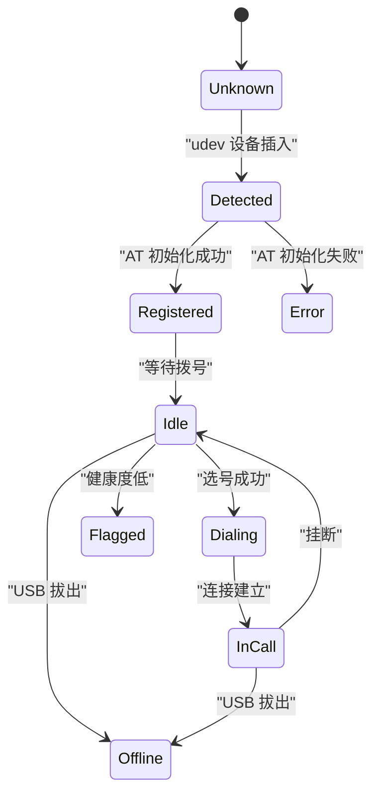
```mermaid
stateDiagram-v2
[*] --> Unknown
Unknown --> Detected : "udev 设备插入"
Detected --> Registered : "AT 初始化成功"
Registered --> Idle : "等待拨号"
Idle --> Dialing : "选号成功"
Dialing --> InCall : "连接建立"
InCall --> Idle : "挂断"
Idle --> Offline : "USB 拔出"
InCall --> Offline : "USB 拔出"
Idle --> Flagged : "健康度低"
Detected --> Error : "AT 初始化失败"
```

图表来源
- [设备硬件规范](file://openspec/specs/device-hardware/spec.md)

章节来源
- [设备硬件规范](file://openspec/specs/device-hardware/spec.md)

### 消息契约规范分析
消息契约规范定义了跨服务消息体的集中化管理与版本控制，关键要点包括：
- 所有跨服务消息体集中定义在 isales-common
- 消息基类与版本字段（schema_version、message_id、created_at）
- 通道矩阵覆盖完整，遗漏视为 spec drift
- 消息演进规则（非破坏性与破坏性变更）
- 序列化与可观测性（Pydantic JSON 序列化与日志追踪）

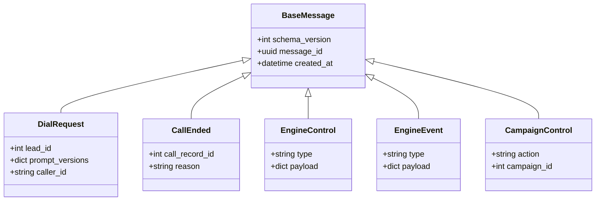
```mermaid
classDiagram
class BaseMessage {
+int schema_version
+uuid message_id
+datetime created_at
}
class DialRequest {
+int lead_id
+dict prompt_versions
+string caller_id
}
class CallEnded {
+int call_record_id
+string reason
}
class EngineControl {
+string type
+dict payload
}
class EngineEvent {
+string type
+dict payload
}
class CampaignControl {
+string action
+int campaign_id
}
BaseMessage <|-- DialRequest
BaseMessage <|-- CallEnded
BaseMessage <|-- EngineControl
BaseMessage <|-- EngineEvent
BaseMessage <|-- CampaignControl
```

图表来源
- [消息契约规范](file://openspec/specs/message-contract/spec.md)

章节来源
- [消息契约规范](file://openspec/specs/message-contract/spec.md)

### Webhook 回调规范分析
Webhook 回调规范定义了通话结束后异步触发外部 webhook 的机制，关键要点包括：
- 触发时机在 summarize_call 之后
- trigger 使用 JsonLogic 表达式，payload 使用 Jinja2 沙盒渲染
- HMAC-SHA256 签名与指数退避重试
- 失败渲染处理与 HTTP 超时配置
- 与其他模块的隔离（不改变 lead 状态或 engine 行为）

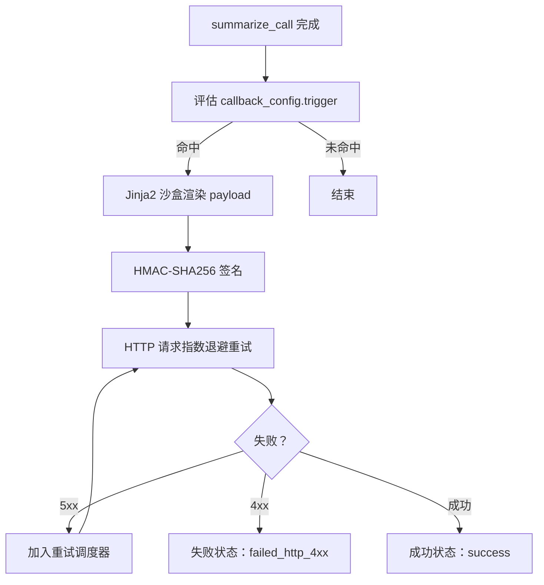
```mermaid
flowchart TD
Summarize["summarize_call 完成"] --> Evaluate["评估 callback_config.trigger"]
Evaluate --> |命中| Render["Jinja2 沙盒渲染 payload"]
Evaluate --> |未命中| End["结束"]
Render --> Sign["HMAC-SHA256 签名"]
Sign --> Send["HTTP 请求指数退避重试"]
Send --> Retry{"失败？"}
Retry --> |5xx| Schedule["加入重试调度器"]
Retry --> |4xx| Fail["失败状态：failed_http_4xx"]
Retry --> |成功| Success["成功状态：success"]
Schedule --> Send
```

图表来源
- [Webhook 回调规范](file://openspec/specs/webhook-callback/spec.md)

章节来源
- [Webhook 回调规范](file://openspec/specs/webhook-callback/spec.md)

### 提供商凭据规范分析
提供商凭据规范定义了凭据 DB 是单一事实来源与 Fernet 对称加密 fabric，关键要点包括：
- provider_credential 表结构与唯一性约束
- Fernet 加密与 CredentialStore 统一封装
- Admin CRUD HTTP 端点与审计日志
- webhook callback signing_secret 共用 fabric
- 一次性迁移工具 isales-cred-migrate

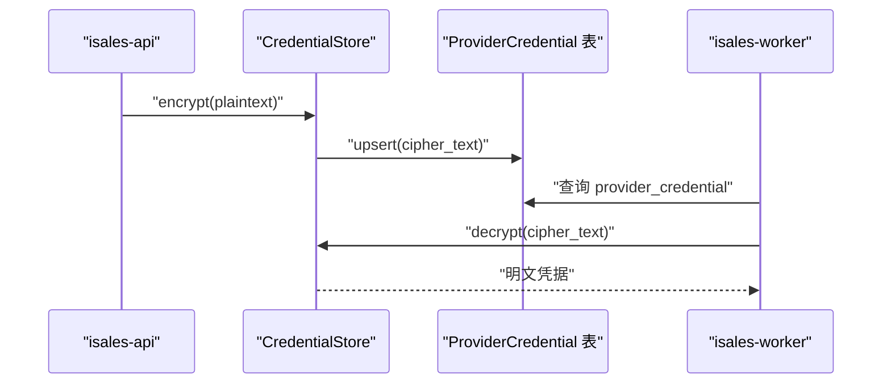
```mermaid
sequenceDiagram
participant API as "isales-api"
participant Store as "CredentialStore"
participant DB as "ProviderCredential 表"
participant Worker as "isales-worker"
API->>Store : "encrypt(plaintext)"
Store->>DB : "upsert(cipher_text)"
Worker->>DB : "查询 provider_credential"
Worker->>Store : "decrypt(cipher_text)"
Store-->>Worker : "明文凭据"
```

图表来源
- [提供商凭据规范](file://openspec/specs/provider-credential/spec.md)

章节来源
- [提供商凭据规范](file://openspec/specs/provider-credential/spec.md)

### AI 管线规范分析
AI 管线规范定义了三层并行管线：N 个角色 LLM 并行 PK → N×M 个裁判 LLM 并行审查 → 1 个润色 LLM 选优拟人化，关键要点包括：
- 三层并行管线编排与连续打断保护
- 每轮 PROCESSING 写一条 pipeline_trace 记录
- 全部裁判否决的兜底与润色失败的降级
- 开场白不走管线与简化管线（WRAPPING_UP）

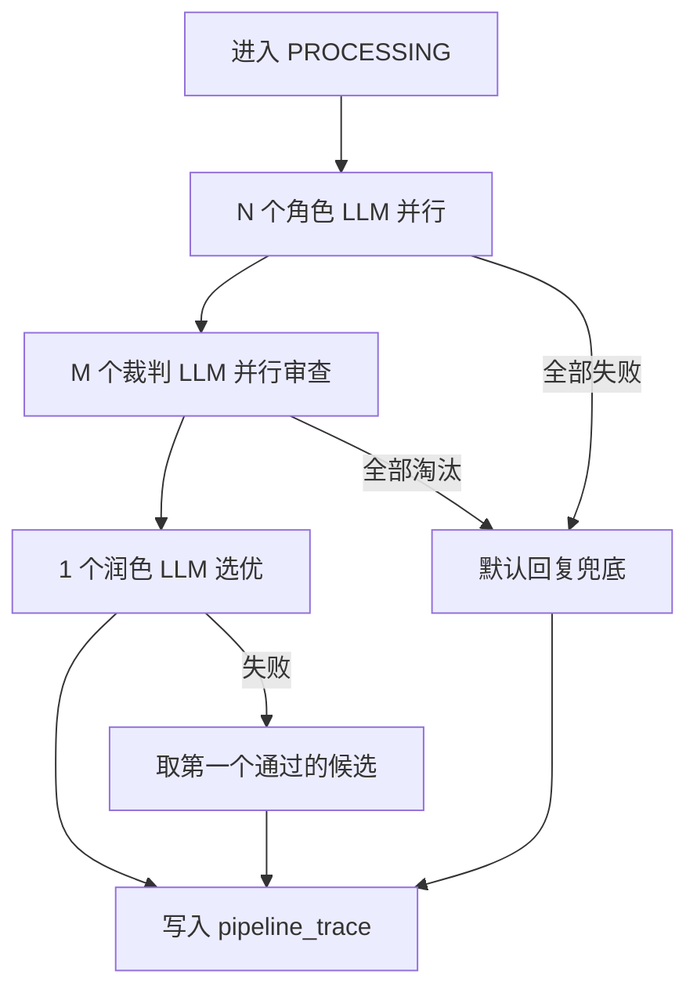
```mermaid
flowchart TD
Enter["进入 PROCESSING"] --> Roles["N 个角色 LLM 并行"]
Roles --> Judges["M 个裁判 LLM 并行审查"]
Judges --> Polish["1 个润色 LLM 选优"]
Polish --> Trace["写入 pipeline_trace"]
Roles --> |全部失败| DefaultReply["默认回复兜底"]
Judges --> |全部淘汰| DefaultReply
Polish --> |失败| FirstPassed["取第一个通过的候选"]
DefaultReply --> Trace
FirstPassed --> Trace
```

图表来源
- [AI 管线规范](file://openspec/specs/ai-pipeline/spec.md)

章节来源
- [AI 管线规范](file://openspec/specs/ai-pipeline/spec.md)

### 通话状态机规范分析
通话状态机规范定义了引擎核心状态机：状态集合、转换规则与特殊状态（WRAPPING_UP、TRANSFERRING、ACTIVATING）的进入与退出条件，关键要点包括：
- 合法转移集合与非法转移兜底
- 关键状态转换（拨号成功、开场白完成、打断处理、沉默激活、转人工）
- 连续打断保护与 FILLER 状态并行性
- hangup_cause 单一来源枚举

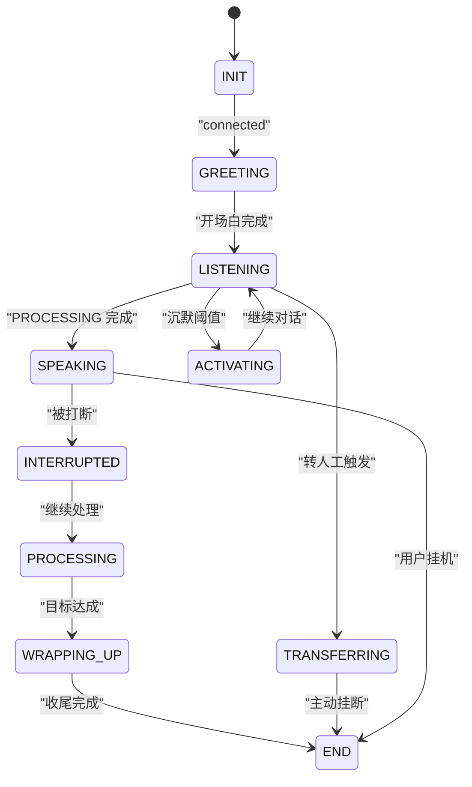
```mermaid
stateDiagram-v2
[*] --> INIT
INIT --> GREETING : "connected"
GREETING --> LISTENING : "开场白完成"
LISTENING --> SPEAKING : "PROCESSING 完成"
SPEAKING --> INTERRUPTED : "被打断"
INTERRUPTED --> PROCESSING : "继续处理"
LISTENING --> ACTIVATING : "沉默阈值"
LISTENING --> TRANSFERRING : "转人工触发"
PROCESSING --> WRAPPING_UP : "目标达成"
WRAPPING_UP --> END : "收尾完成"
ACTIVATING --> LISTENING : "继续对话"
TRANSFERRING --> END : "主动挂断"
SPEAKING --> END : "用户挂机"
```

图表来源
- [通话状态机规范](file://openspec/specs/call-state-machine/spec.md)

章节来源
- [通话状态机规范](file://openspec/specs/call-state-machine/spec.md)

### 重试跟进规范分析
重试跟进规范定义了重试与跟进两个独立机制，关键要点包括：
- 重试与跟进的概念区分（独立计数、独立间隔策略、独立上限）
- 重试间隔与上限（指数退避数组 + 最大次数）
- 跟进间隔与上限（固定间隔 + 最大次数）
- 跟进时角色 LLM 上下文增强
- "勿打"识别（双重 OR 关系）
- lead 状态机与调度数据流

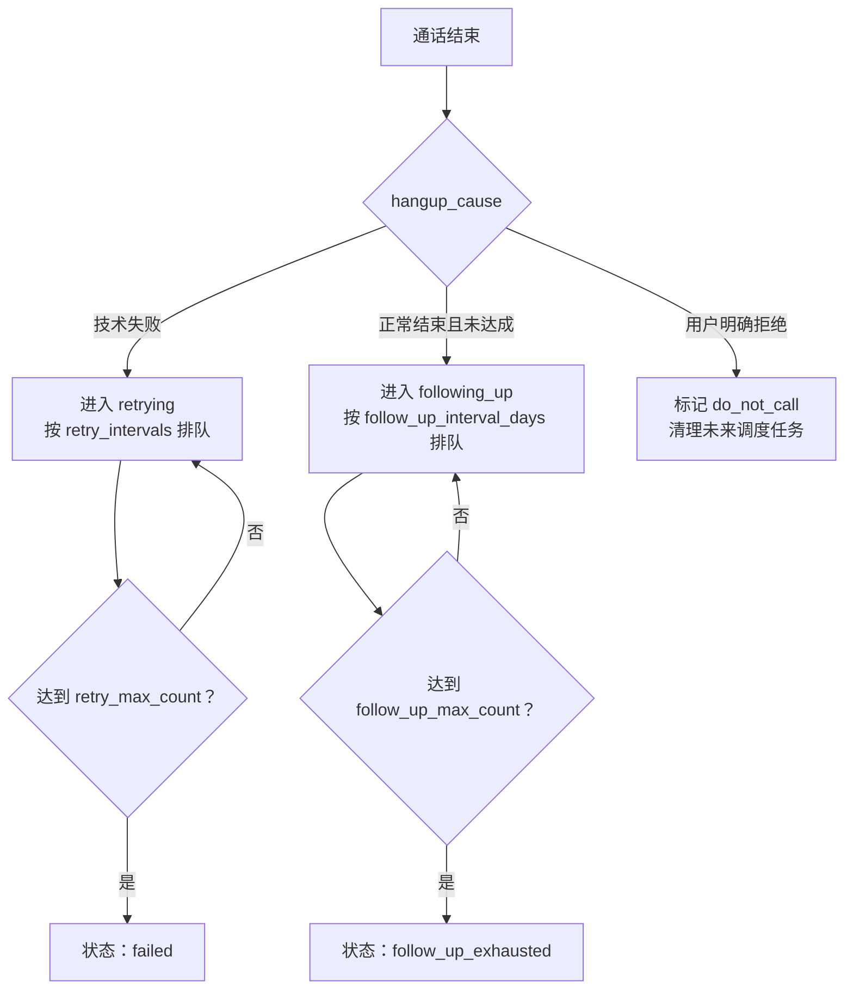
```mermaid
flowchart TD
CallEnd["通话结束"] --> Cause{"hangup_cause"}
Cause --> |技术失败| Retry["进入 retrying<br/>按 retry_intervals 排队"]
Cause --> |正常结束且未达成| FollowUp["进入 following_up<br/>按 follow_up_interval_days 排队"]
Cause --> |用户明确拒绝| NoCall["标记 do_not_call<br/>清理未来调度任务"]
Retry --> MaxRetry{"达到 retry_max_count？"}
MaxRetry --> |是| Failed["状态：failed"]
MaxRetry --> |否| Retry
FollowUp --> MaxFollowUp{"达到 follow_up_max_count？"}
MaxFollowUp --> |是| Exhausted["状态：follow_up_exhausted"]
MaxFollowUp --> |否| FollowUp
```

图表来源
- [重试跟进规范](file://openspec/specs/retry-followup/spec.md)

章节来源
- [重试跟进规范](file://openspec/specs/retry-followup/spec.md)

### 时间窗口规范分析
时间窗口规范定义了可通话时间窗口的配置模型、时区策略、节假日处理与窗外 lead 的调度规则，关键要点包括：
- Campaign 级多窗口配置（星期几 + 起止时间）
- 统一服务器时区（部署侧设定）
- 全局节假日表与 Campaign 选择
- 窗外 lead 推迟到下个窗口开始时刻
- 跨窗口边界保护（通话进行中跨过窗口结束时刻不强制中断）

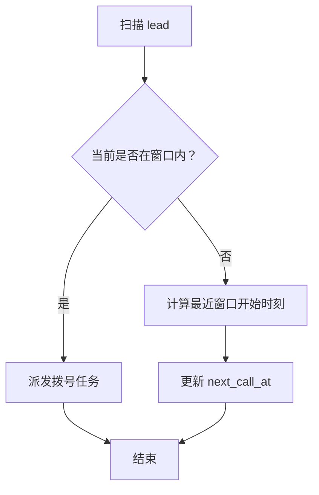
```mermaid
flowchart TD
Scan["扫描 lead"] --> Window{"当前是否在窗口内？"}
Window --> |是| Dispatch["派发拨号任务"]
Window --> |否| NextWindow["计算最近窗口开始时刻"]
NextWindow --> Update["更新 next_call_at"]
Dispatch --> End["结束"]
Update --> End
```

图表来源
- [时间窗口规范](file://openspec/specs/time-window/spec.md)

章节来源
- [时间窗口规范](file://openspec/specs/time-window/spec.md)

### 垫词规范分析
垫词规范定义了垫词在 AI 管线处理期间播放，用于覆盖 LLM/TTS 延迟，关键要点包括：
- 触发场景白名单（仅在常规对话 PROCESSING 状态下播放）
- 启动时机与衔接（与 AI 管线同时启动，TTS 准备好后等垫词播完再接 reply）
- 多 filler_set 轮询与集合内随机不重复
- 预生成 + 动态补充音频与失败兜底允许无声延迟

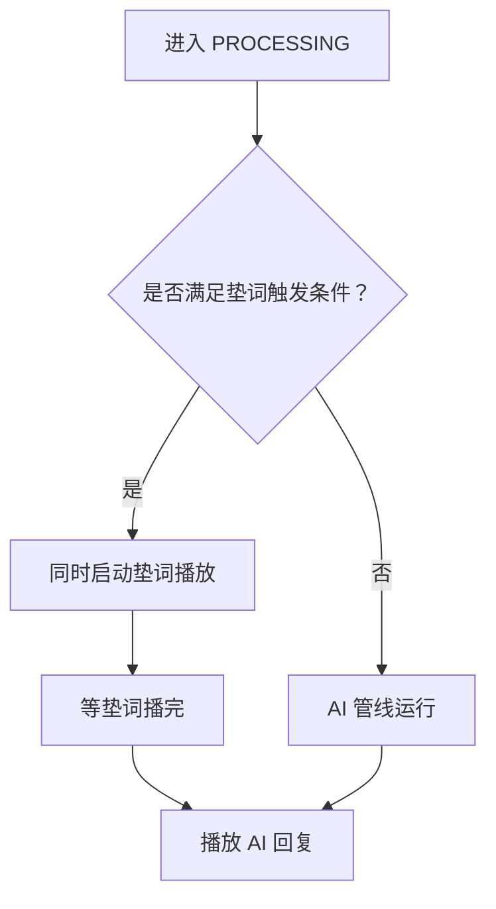
```mermaid
flowchart TD
Enter["进入 PROCESSING"] --> Check{"是否满足垫词触发条件？"}
Check --> |否| AI["AI 管线运行"]
Check --> |是| Fill["同时启动垫词播放"]
Fill --> Wait["等垫词播完"]
Wait --> Reply["播放 AI 回复"]
AI --> Reply
```

图表来源
- [垫词规范](file://openspec/specs/filler/spec.md)

章节来源
- [垫词规范](file://openspec/specs/filler/spec.md)

### 转人工规范分析
转人工规范定义了 v1 衰减为标记 + 通知的实现，关键要点包括：
- v1 不做实时话路桥接，衰减为标记 + 通知
- 4 种独立触发机制（关键词 / 意图分类 / 轮次阈值 / 独立 LLM 判定）
- TRANSFERRING 流程（播衔接话术 → 主动挂断 → 派发 handoff_task）
- 坐席工作流（任务列表、详情、状态流转）

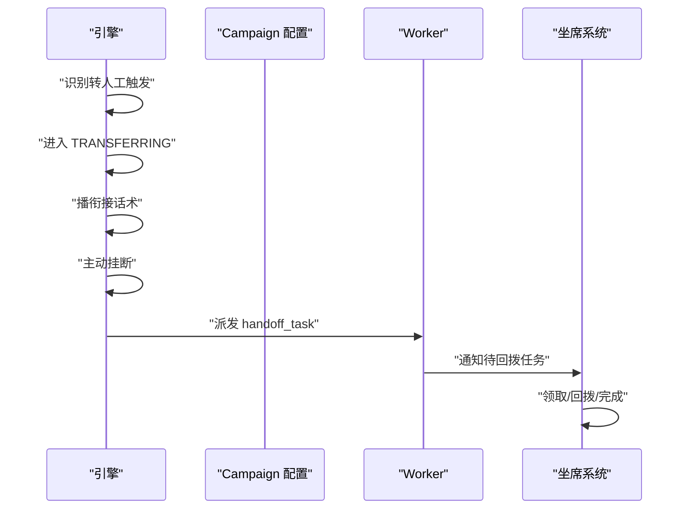
```mermaid
sequenceDiagram
participant Engine as "引擎"
participant Campaign as "Campaign 配置"
participant Worker as "Worker"
participant Agent as "坐席系统"
Engine->>Engine : "识别转人工触发"
Engine->>Engine : "进入 TRANSFERRING"
Engine->>Engine : "播衔接话术"
Engine->>Engine : "主动挂断"
Engine->>Worker : "派发 handoff_task"
Worker->>Agent : "通知待回拨任务"
Agent->>Agent : "领取/回拨/完成"
```

图表来源
- [转人工规范](file://openspec/specs/human-handoff/spec.md)

章节来源
- [转人工规范](file://openspec/specs/human-handoff/spec.md)

### 打断检测规范分析
打断检测规范定义了 SPEAKING 状态下用户说话是否构成“打断”的判定逻辑，关键要点包括：
- 双条件打断判定（白名单短语命中 OR 时长 < 阈值）
- 打断判定不可撤销（一旦判定为打断，立即停止 TTS 并切换状态）
- 连续打断保护（short_reply / listen_only 策略）
- ASR Provider 抽象与 VAD 来源

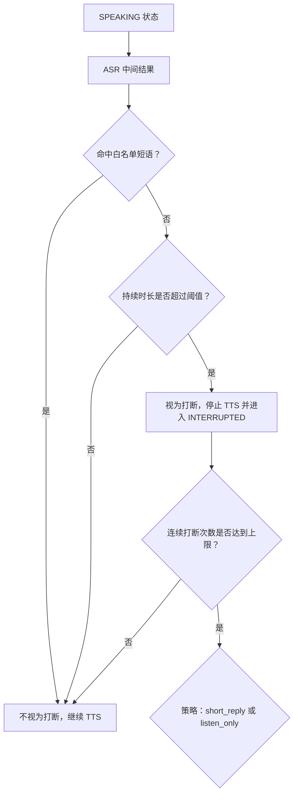
```mermaid
flowchart TD
Speak["SPEAKING 状态"] --> ASR["ASR 中间结果"]
ASR --> Whitelist{"命中白名单短语？"}
Whitelist --> |是| Continue["不视为打断，继续 TTS"]
Whitelist --> |否| Duration{"持续时长是否超过阈值？"}
Duration --> |否| Continue
Duration --> |是| Interrupt["视为打断，停止 TTS 并进入 INTERRUPTED"]
Interrupt --> Protect{"连续打断次数是否达到上限？"}
Protect --> |是| Strategy{"策略：short_reply 或 listen_only"}
Protect --> |否| Continue
```

图表来源
- [打断检测规范](file://openspec/specs/interruption-detection/spec.md)

章节来源
- [打断检测规范](file://openspec/specs/interruption-detection/spec.md)

### 沉默激活规范分析
沉默激活规范定义了用户长时间不说话时 AI 主动激活，关键要点包括：
- 沉默检测与激活触发（超过阈值且未达激活上限）
- 激活后重新计时（以 TTS 播完时刻为新的计时起点）
- 话术顺序使用与超限复用
- 与角色 LLM 上下文隔离（激活话术写入 transcript，但不进入 dialog_history）

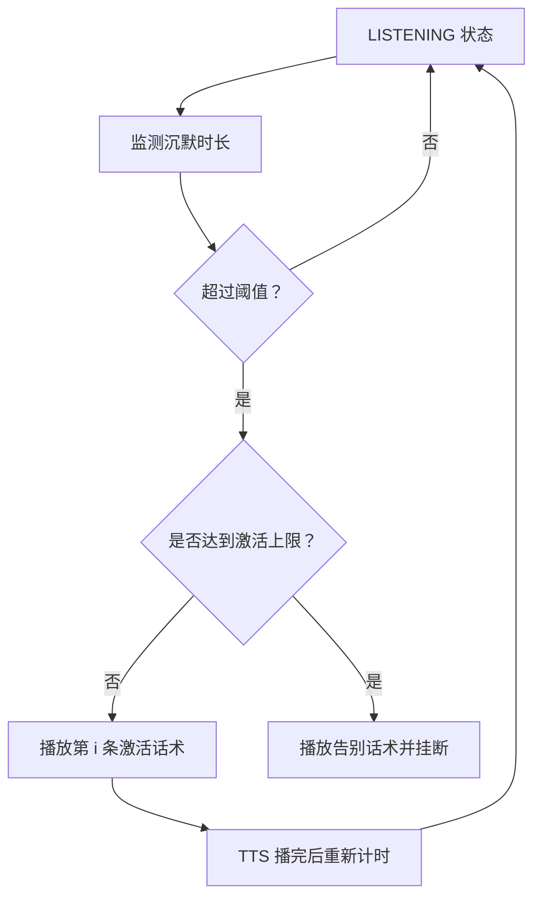
```mermaid
flowchart TD
Listen["LISTENING 状态"] --> Silence["监测沉默时长"]
Silence --> Threshold{"超过阈值？"}
Threshold --> |否| Listen
Threshold --> |是| Active{"是否达到激活上限？"}
Active --> |否| Play["播放第 i 条激活话术"]
Active --> |是| Hangup["播放告别话术并挂断"]
Play --> Reset["TTS 播完后重新计时"]
Reset --> Listen
```

图表来源
- [沉默激活规范](file://openspec/specs/silence-activation/spec.md)

章节来源
- [沉默激活规范](file://openspec/specs/silence-activation/spec.md)

### 目标达成规范分析
目标达成规范定义了通话目标达成的判定时机、判定信号与达成后的收尾行为，关键要点包括：
- 实时目标达成判定（由角色 LLM 在 JSON 输出中自带结构化标记驱动）
- 目标定义在 prompt 中（不固化目标 schema）
- 三层管线对结构化标记的处理（裁判审查 reply，润色拟人化但不合并标记）
- 进入 WRAPPING_UP 状态与简化管线
- 收尾双计数器与主动挂断

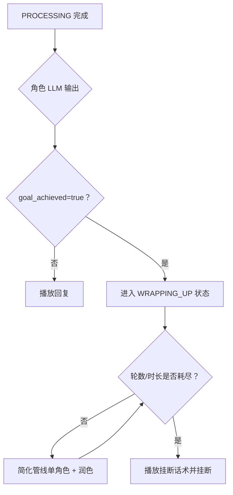
```mermaid
flowchart TD
Process["PROCESSING 完成"] --> Judge{"角色 LLM 输出"}
Judge --> Goal{"goal_achieved=true？"}
Goal --> |否| Reply["播放回复"]
Goal --> |是| Wrap["进入 WRAPPING_UP 状态"]
Wrap --> Rounds{"轮数/时长是否耗尽？"}
Rounds --> |否| Simplified["简化管线单角色 + 润色"]
Rounds --> |是| Close["播放挂断话术并挂断"]
Simplified --> Rounds
```

图表来源
- [目标达成规范](file://openspec/specs/goal-achievement/spec.md)

章节来源
- [目标达成规范](file://openspec/specs/goal-achievement/spec.md)

## 依赖关系分析
OpenSpec 规范体系通过“规范驱动”的方式实现跨领域的统一约束与协作。下图展示了规范之间的依赖关系与耦合度：

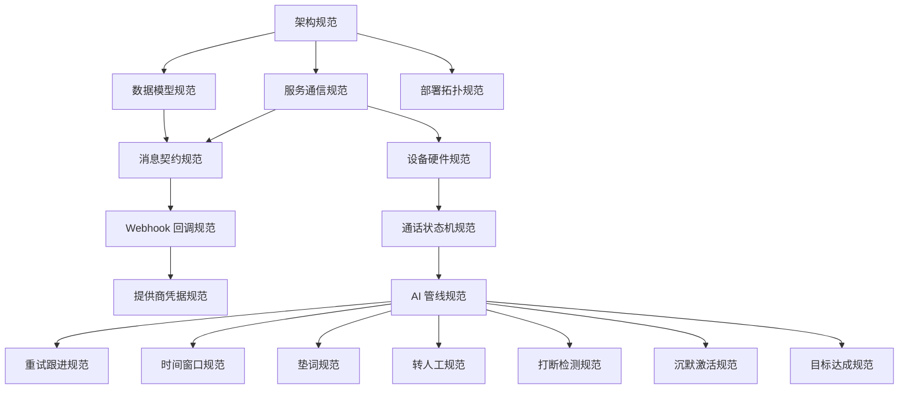
```mermaid
graph TB
Arch["架构规范"] --> DM["数据模型规范"]
Arch --> Comm["服务通信规范"]
Arch --> Deploy["部署拓扑规范"]
DM --> Msg["消息契约规范"]
Comm --> Msg
Comm --> Dev["设备硬件规范"]
Dev --> State["通话状态机规范"]
State --> AIP["AI 管线规范"]
AIP --> Retry["重试跟进规范"]
AIP --> TimeWin["时间窗口规范"]
AIP --> Filler["垫词规范"]
AIP --> Handoff["转人工规范"]
AIP --> Interruption["打断检测规范"]
AIP --> Silence["沉默激活规范"]
AIP --> Goal["目标达成规范"]
Msg --> Webhook["Webhook 回调规范"]
Webhook --> Prov["提供商凭据规范"]
```

图表来源
- [架构规范](file://openspec/specs/architecture/spec.md)
- [数据模型规范](file://openspec/specs/data-model/spec.md)
- [服务通信规范](file://openspec/specs/service-communication/spec.md)
- [部署拓扑规范](file://openspec/specs/deployment-topology/spec.md)
- [设备硬件规范](file://openspec/specs/device-hardware/spec.md)
- [通话状态机规范](file://openspec/specs/call-state-machine/spec.md)
- [AI 管线规范](file://openspec/specs/ai-pipeline/spec.md)
- [重试跟进规范](file://openspec/specs/retry-followup/spec.md)
- [时间窗口规范](file://openspec/specs/time-window/spec.md)
- [垫词规范](file://openspec/specs/filler/spec.md)
- [转人工规范](file://openspec/specs/human-handoff/spec.md)
- [打断检测规范](file://openspec/specs/interruption-detection/spec.md)
- [沉默激活规范](file://openspec/specs/silence-activation/spec.md)
- [目标达成规范](file://openspec/specs/goal-achievement/spec.md)
- [消息契约规范](file://openspec/specs/message-contract/spec.md)
- [Webhook 回调规范](file://openspec/specs/webhook-callback/spec.md)
- [提供商凭据规范](file://openspec/specs/provider-credential/spec.md)

章节来源
- [架构规范](file://openspec/specs/architecture/spec.md)
- [数据模型规范](file://openspec/specs/data-model/spec.md)
- [服务通信规范](file://openspec/specs/service-communication/spec.md)
- [部署拓扑规范](file://openspec/specs/deployment-topology/spec.md)
- [设备硬件规范](file://openspec/specs/device-hardware/spec.md)
- [通话状态机规范](file://openspec/specs/call-state-machine/spec.md)
- [AI 管线规范](file://openspec/specs/ai-pipeline/spec.md)
- [重试跟进规范](file://openspec/specs/retry-followup/spec.md)
- [时间窗口规范](file://openspec/specs/time-window/spec.md)
- [垫词规范](file://openspec/specs/filler/spec.md)
- [转人工规范](file://openspec/specs/human-handoff/spec.md)
- [打断检测规范](file://openspec/specs/interruption-detection/spec.md)
- [沉默激活规范](file://openspec/specs/silence-activation/spec.md)
- [目标达成规范](file://openspec/specs/goal-achievement/spec.md)
- [消息契约规范](file://openspec/specs/message-contract/spec.md)
- [Webhook 回调规范](file://openspec/specs/webhook-callback/spec.md)
- [提供商凭据规范](file://openspec/specs/provider-credential/spec.md)

## 性能考虑
- 通信通道选择：Redis Queue 用于“必须送达，可异步处理”的工作派发；Redis Pub/Sub 用于“实时、可丢失”的事件广播，避免阻塞主流程
- 全局并发控制：跨 engine 实例的全局并发使用 Redis 原子计数器（INCR/DECR），防止计数器泄漏
- 序列化与可观测性：消息序列化使用 Pydantic 的 JSON 序列化，便于日志追踪与跨服务排查
- 队列深度与重试：重试策略采用指数退避，避免雪崩效应
- 端到端延迟：垫词在 AI 管线处理期间播放，覆盖 LLM/TTS 延迟，保证对话节拍稳定

## 故障排除指南
- Redis 短暂不可用：各服务重连重试（带退避）；engine 中断重连期间不接受新拨号但可完成当前通话
- PostgreSQL 短暂不可用：各服务重连重试；正在通话中的 engine 将通话状态缓存至 Redis（v2 优化），v1 则在 DB 不可用时按异常通话处理
- modem-controller 不可用：受影响的 call_session 优雅清理（写 transcript hangup 事件）；scheduler 暂停派发直到 modem-controller 恢复
- 服务间通信故障：检查 Redis/DB/IP 通断；确认消息序列化与版本兼容；核对 WebSocket 鉴权与 fan-out 策略
- 凭据问题：确认 Fernet 主密钥正确；检查 provider_credential 表结构与加密字段一致性；使用 isales-cred-migrate 工具进行迁移与回滚

章节来源
- [服务通信规范](file://openspec/specs/service-communication/spec.md)
- [提供商凭据规范](file://openspec/specs/provider-credential/spec.md)

## 结论
OpenSpec 规范体系通过“规范驱动”的方式实现了跨领域的统一约束与协作，确保系统在架构、数据、通信、部署、设备、消息契约、业务流程、安全与运维等方面的一致性与可维护性。团队在编写新规范时，应遵循本文档总结的结构化编写方法与最佳实践，确保规范具备清晰性、一致性与可维护性，并通过 OpenSpec 变更流程进行版本管理与变更追踪。

## 附录

### 规范编写最佳实践
- 结构化组织：摘要、背景、设计决策、接口定义、约束条件、数据模型、流程图、序列图、状态图、依赖关系图
- 清晰性：使用简洁语言描述需求与约束，避免歧义；提供具体示例与场景
- 一致性：统一术语与命名约定；跨规范引用时保持一致
- 可维护性：将演进规则与版本控制纳入规范；提供变更追踪与回滚路径
- 可观测性：在规范中明确日志、指标与告警要求；提供调试与排障指南

### 版本管理与变更追踪
- 使用 OpenSpec 变更提案（proposal）与设计（design）流程
- 通过 .openspec.yaml 元数据标识规范类型与创建时间
- 在 changes 目录下归档变更，包含 proposal、design、tasks、specs 子目录
- 通过 OpenSpec change 流程进行重大调整与决策记录

章节来源
- [变更管理配置](file://openspec/changes/arch-cloud-edge-split/.openspec.yaml)