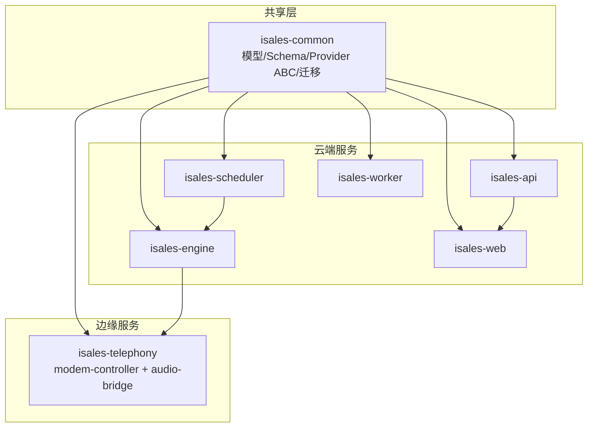
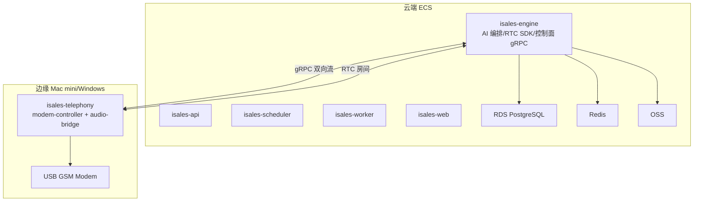
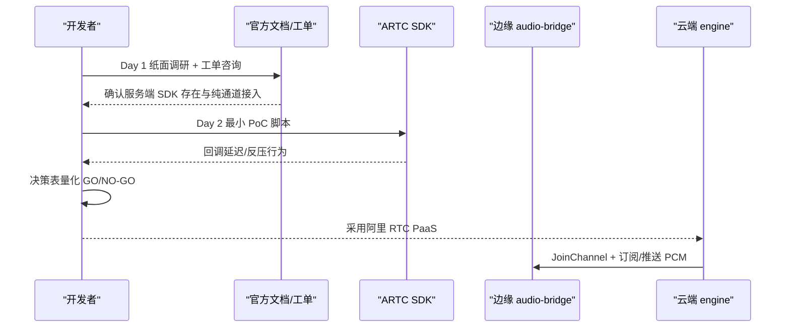
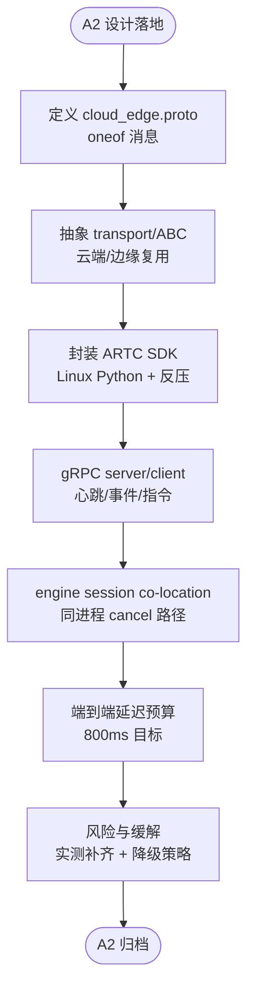
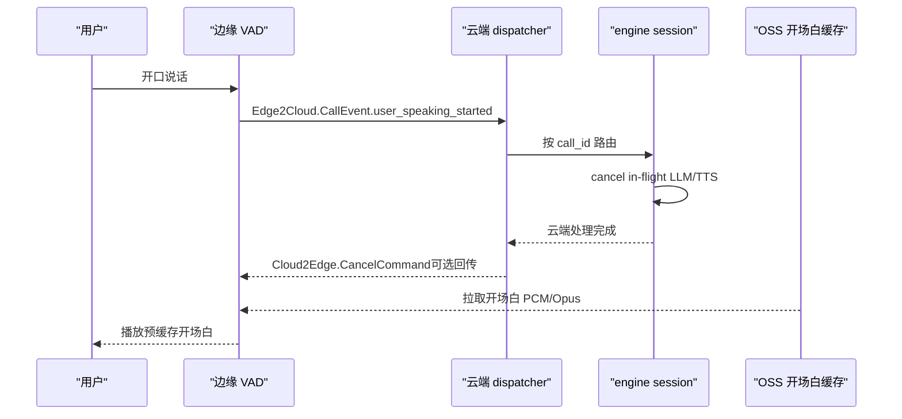
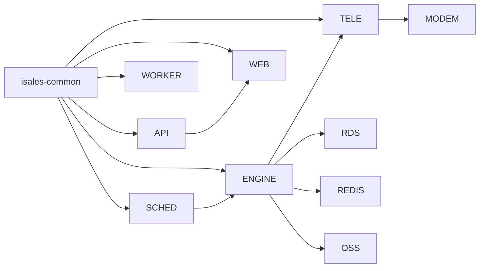

# 路线图与 POC 实施

<cite>
**本文引用的文件**
- [v1路线图.md](file://openspec/v1-roadmap.md)
- [阿里云RTC POC.md](file://openspec/v1-roadmap-aliyun-rtc-poc.md)
- [阿里云RTC POC结果.md](file://openspec/v1-roadmap-aliyun-rtc-poc-result.md)
- [A3上下文.md](file://openspec/v1-roadmap-a3-context.md)
- [架构设计.md](file://DESIGN.md)
- [实施计划.md](file://IMPLEMENTATION_PLAN.md)
- [A2设计.md](file://openspec/changes/arch-cloud-edge-split/design.md)
- [A2提案.md](file://openspec/changes/arch-cloud-edge-split/proposal.md)
- [A2任务.md](file://openspec/changes/arch-cloud-edge-split/tasks.md)
- [架构规范.md](file://openspec/changes/arch-cloud-edge-split/specs/architecture/spec.md)
- [部署拓扑规范.md](file://openspec/changes/arch-cloud-edge-split/specs/deployment-topology/spec.md)
- [README.md](file://README.md)
- [运行手册.md](file://deploy/RUNBOOK.md)
</cite>

## 目录
1. [简介](#简介)
2. [项目结构](#项目结构)
3. [核心组件](#核心组件)
4. [架构总览](#架构总览)
5. [详细组件分析](#详细组件分析)
6. [依赖关系分析](#依赖关系分析)
7. [性能考量](#性能考量)
8. [故障排查指南](#故障排查指南)
9. [结论](#结论)
10. [附录](#附录)

## 简介
本文件围绕 iSales 项目的路线图制定与 POC 实施，系统阐述从需求分析、技术选型、里程碑设定到资源规划的全过程，并结合阿里云 RTC POC 的具体案例，说明如何从实验结果中提炼经验教训并指导正式开发。同时，提供平衡技术创新与产品稳定性、在快速迭代中保持质量标准的方法论与实践建议。

## 项目结构
iSales 采用多仓协作的 OpenSpec 规范化工程方法，将系统拆分为 7 个子仓库，分别承担不同职责：
- isales-common：共享模型、Schema、Provider ABC、迁移脚本
- isales-api：管理后台 CRUD（Campaign/Lead/Role/Voice/Analytics/Callback）
- isales-telephony：设备与拨号控制（modem-controller + telephony-api）
- isales-scheduler：线索分发与调度
- isales-worker：通话结束后的摘要/回调/聚合
- isales-engine：实时通话引擎（状态机 + 三层 AI 管线 + 云-边控制面）
- isales-web：Vue3 管理前端

项目通过 OpenSpec change 流程进行规范演进，实施计划采用“自下而上”的顺序推进，确保共享库先行、周边服务配套、引擎最后贯通。

图表来源
- [架构设计.md](file://DESIGN.md)
- [实施计划.md](file://IMPLEMENTATION_PLAN.md)

章节来源
- [README.md:1-14](file://README.md#L1-L14)
- [架构设计.md:1-75](file://DESIGN.md#L1-L75)
- [实施计划.md:9-39](file://IMPLEMENTATION_PLAN.md#L9-L39)

## 核心组件
- 需求与目标：将 7 服务从单主机部署迁移到“云端 5 服务 + 边缘 2 组件”，实现 SaaS 化与集中化 AI 推理。
- 技术选型：阿里 RTC PaaS 作为媒体面，gRPC 双向流作为控制面，云-边音频通过 RTC 房间双向传输。
- 里程碑：A1（真实 AT 通道）→ A2（云-边拆分与控制面/媒体面落地）→ A3（边缘 VAD 与开场白预缓存）→ B1/B2（工具调用与垂直模板）→ C1（老板控制台）→ C2（多租户）→ D1（Windows 客户端）→ D2（硬件可观测）→ D3（安装包与 OTA）。
- 资源规划：阿里云 ECS/RDS/Redis/OSS/RTC 应用，边缘 Mac mini（A2 时点）+ Windows 客户端（D1）。

章节来源
- [v1路线图.md:1-576](file://openspec/v1-roadmap.md#L1-L576)
- [A2设计.md:1-248](file://openspec/changes/arch-cloud-edge-split/design.md#L1-L248)
- [A2提案.md:1-77](file://openspec/changes/arch-cloud-edge-split/proposal.md#L1-L77)

## 架构总览
云-边分离后，云端负责 AI 编排与控制面，边缘负责硬件与媒体桥接。控制面采用 gRPC 双向流承载心跳、拨号/取消指令、通话事件与硬件告警；媒体面采用阿里 RTC PaaS，双方作为参会者加入同一房间，PCM 通过 SDK 回调/推送完成双向传输。

图表来源
- [A2设计.md:63-97](file://openspec/changes/arch-cloud-edge-split/design.md#L63-L97)
- [部署拓扑规范.md:152-166](file://openspec/changes/arch-cloud-edge-split/specs/deployment-topology/spec.md#L152-L166)

章节来源
- [A2设计.md:42-179](file://openspec/changes/arch-cloud-edge-split/design.md#L42-L179)
- [架构规范.md:104-143](file://openspec/changes/arch-cloud-edge-split/specs/architecture/spec.md#L104-L143)

## 详细组件分析

### 阿里云 RTC POC 实施
- 目标：验证阿里 RTC 服务端 SDK 是否满足“服务端入会 + 拉取原始 PCM + 推送自定义 PCM + 纯通道接入 + 成本可接受”五项关键需求。
- 方法：Day 1 纸面调研 + 工单咨询；Day 2 最小 PoC 脚本验证；决策表量化 GO/NO-GO。
- 结果：4.5/5 GO，采用阿里 RTC PaaS + IMS 纯通道接入方案，无需 fallback；成本约为 RTC 通信 ¥1.6k/月（100 seats），可接受。
- 经验教训：服务端 SDK 的延迟与反压机制需通过 Day 2 实测补齐；若延迟过高，需在云端引入抖动缓冲或降低并发上限。

图表来源
- [阿里云RTC POC.md:116-133](file://openspec/v1-roadmap-aliyun-rtc-poc.md#L116-L133)
- [阿里云RTC POC结果.md:19-29](file://openspec/v1-roadmap-aliyun-rtc-poc-result.md#L19-L29)

章节来源
- [阿里云RTC POC.md:21-162](file://openspec/v1-roadmap-aliyun-rtc-poc.md#L21-L162)
- [阿里云RTC POC结果.md:9-296](file://openspec/v1-roadmap-aliyun-rtc-poc-result.md#L9-L296)

### A2 云-边拆分设计与实施
- 控制面：gRPC 双向流承载心跳、拨号/取消、通话事件与硬件告警；鉴权使用独立 bearer token；断线重连与本地 SQLite 缓冲补发。
- 媒体面：阿里 RTC PaaS，双方作为参会者加入同一房间，PCM 通过回调/推送完成传输；AI 编排全部在云端 engine 进程内。
- 服务拆分：云端 5 服务 + 边缘 2 组件；单实例部署，允许部署/重启期间 30-60s 中断。
- 风险与缓解：ARTC SDK PCM 回调延迟、PushExternalAudioFrameRawData 反压频率、多角色 PK 三层流水在 800ms 预算内的达标情况等，均在设计中给出降级策略与实测要求。

图表来源
- [A2设计.md:133-179](file://openspec/changes/arch-cloud-edge-split/design.md#L133-L179)
- [A2任务.md:23-135](file://openspec/changes/arch-cloud-edge-split/tasks.md#L23-L135)

章节来源
- [A2设计.md:18-41](file://openspec/changes/arch-cloud-edge-split/design.md#L18-L41)
- [A2任务.md:39-135](file://openspec/changes/arch-cloud-edge-split/tasks.md#L39-L135)

### A3 边缘 VAD 与开场白预缓存
- 目标：将打断决策点从前端（云端）迁移至边缘 VAD，缩短 WAN RTT；同时引入开场白预渲染与缓存，降低首句冷启动延迟。
- 依赖：A2 已实现的 cancel 通道（Edge2Cloud.CallEvent.user_speaking_started → Cloud2Edge.CancelCommand）与云端 dispatcher；A2 未决定的预缓存目录与同步策略在 A3 设计中补齐。
- 设计要点：边缘本地停止播放与队列清空；云端收到 cancel 后中止 in-flight LLM/TTS；开场白 PCM/Opus 预渲染并缓存至 OSS，边缘启动时拉取。

图表来源
- [A3上下文.md:10-36](file://openspec/v1-roadmap-a3-context.md#L10-L36)
- [v1路线图.md:284-301](file://openspec/v1-roadmap.md#L284-L301)

章节来源
- [A3上下文.md:37-102](file://openspec/v1-roadmap-a3-context.md#L37-L102)
- [v1路线图.md:45-105](file://openspec/v1-roadmap.md#L45-L105)

### 从 POC 到正式开发的经验提炼
- 明确“可接受”的量化指标：延迟、成本、并发上限等，避免模糊判断。
- 用最小 PoC 验证关键路径：服务端 SDK 可用性、原始 PCM 获取、自定义 PCM 推送、纯通道接入可行性、成本对比。
- 决策表驱动：5 项需求 5 个 GO/NO-GO，形成“全 GO/部分 GO/回退”的明确路径。
- 实测补齐：Day 2 实测脚本用于填补文档未披露的延迟与反压细节。
- 降级策略：若实测不达标，设计中预留运行时降级（如并发 N 降至 1）与架构层面的 fallback（coturn + aiortc）。

章节来源
- [阿里云RTC POC结果.md:19-296](file://openspec/v1-roadmap-aliyun-rtc-poc-result.md#L19-L296)
- [阿里云RTC POC.md:116-184](file://openspec/v1-roadmap-aliyun-rtc-poc.md#L116-L184)

## 依赖关系分析
- 仓库耦合：isales-common 为共享库，被其余 6 个服务依赖；A2 之后，telephony-api 的设备选择 HTTP 入口在云-边形态下降级为边缘本地查询。
- 云-边通信：gRPC 双向流承载控制面；阿里 RTC PaaS 承载媒体面；边缘 audio-bridge 与 modem-controller 同进程，通过环形缓冲桥接。
- 数据流：边缘通过云-边 gRPC 控制面读写云端 PG/Redis；边缘本地 SQLite 仅用于离线事件缓冲，不作为权威数据源。
- 外部依赖：阿里云 ECS/RDS/Redis/OSS/RTC 应用；ARTC SDK for Linux Python（云端）与 macOS（边缘 mock，商用真音频在 D1 Windows）。

图表来源
- [架构规范.md:27-49](file://openspec/changes/arch-cloud-edge-split/specs/architecture/spec.md#L27-L49)
- [部署拓扑规范.md:152-166](file://openspec/changes/arch-cloud-edge-split/specs/deployment-topology/spec.md#L152-L166)

章节来源
- [架构规范.md:51-103](file://openspec/changes/arch-cloud-edge-split/specs/architecture/spec.md#L51-L103)
- [部署拓扑规范.md:173-213](file://openspec/changes/arch-cloud-edge-split/specs/deployment-topology/spec.md#L173-L213)

## 性能考量
- 端到端延迟预算：modem 采音 → audio-bridge → 阿里 RTC → 云 engine → 豆包流式 ASR partial → 多角色 PK 首角色 LLM 首 token → 润色 → 豆包流式 TTS 首 chunk → RTC 下行 → 边缘 audio-bridge → modem 喇叭；P95 ≤ 800ms。
- 多角色 PK 三层流水：N 个角色并发 LLM + N×M 裁判 + 1 润色，首 TTS byte 的最大预算为 200-400ms；若 P95 突破 800ms，运行时将默认 N=1 以保证达标。
- ARTC SDK 反压：PushExternalAudioFrameRawData 的 buffer-full 回调用于背压，避免云端 TTS 推送过快导致边缘丢帧。
- 并发上限：单实例 100-1000 seats 规模，阿里 SDK 文档未明确单进程上限；Sprint 0 实测后如有限制（如 50 路），设计影响为“1000 seats”实际指峰值并发 50-100。

章节来源
- [A2设计.md:115-132](file://openspec/changes/arch-cloud-edge-split/design.md#L115-L132)
- [A2设计.md:204-214](file://openspec/changes/arch-cloud-edge-split/design.md#L204-L214)
- [A2任务.md:120-127](file://openspec/changes/arch-cloud-edge-split/tasks.md#L120-L127)

## 故障排查指南
- 首次部署与上线前硬门：完成备份恢复演练、至少一次完整 install → deploy → rollback → deploy 循环、监控联系建立、烟雾测试通过、在场值班安排。
- 常见症状与步骤：PostgreSQL/Redis 连接失败、modem-controller 设备断连、engine 队列积压、worker celery 停滞、nginx 502、JWT 密钥不一致、备份 cron 未运行等。
- macOS 特定：brew 服务状态、launchd plist 环境变量、USB modem 识别、Core Audio 设备可用性、nginx 端口绑定等。
- 一键命令：服务状态概览、最近 5 分钟错误日志、活跃通话数、队列深度等。

章节来源
- [运行手册.md:16-394](file://deploy/RUNBOOK.md#L16-L394)

## 结论
- 路线图制定强调“以结果为导向”的里程碑推进：A1 实现真实 AT 通道，A2 完成云-边拆分与控制面/媒体面落地，A3 进一步优化边缘交互与预缓存，后续 B/C/D 系列逐步完善 AI 能力、管理后台与边缘客户端。
- POC 实施通过“明确目标、最小验证、量化决策、实测补齐、降级策略”五步法，确保技术选型稳健可控。
- 在快速迭代中保持质量：通过 OpenSpec change 流程、共享库先行、严格的监控告警与回滚机制，平衡创新与稳定性。

## 附录

### 路线图制定方法论
- 需求分析：识别业务痛点（SaaS 化、集中 AI 推理、运维可及性）与技术约束（单主机形态限制）。
- 技术选型：以 PoC 为基础，明确“可接受”的量化指标（延迟、成本、并发），形成 GO/NO-GO 决策。
- 里程碑设定：将大目标拆解为 10 个一体发布阶段，每个阶段有明确的交付物与验收点。
- 资源规划：明确阿里云基础设施清单、部署脚本幂等性与可回滚性、监控与告警模板。

章节来源
- [v1路线图.md:1-576](file://openspec/v1-roadmap.md#L1-L576)
- [实施计划.md:9-39](file://IMPLEMENTATION_PLAN.md#L9-L39)

### POC 实施流程模板
- 目标设定：列出 5 个关键问题（SDK 存在、原始 PCM、自定义 PCM、纯通道接入、成本可接受）。
- 技术方案：Day 1 纸面调研 + 工单咨询；Day 2 最小 PoC 验证；Day 2 实测补齐延迟与反压细节。
- 实验设计：最小脚本、对照组（fallback 方案）、关键指标测量（延迟、吞吐、稳定性）。
- 结果评估：决策表量化 GO/NO-GO；若部分 NO-GO，提出缓解措施或回退路径。
- 决策制定：根据量化结果与风险评估，确定主路径与备选方案。

章节来源
- [阿里云RTC POC.md:21-184](file://openspec/v1-roadmap-aliyun-rtc-poc.md#L21-L184)
- [阿里云RTC POC结果.md:19-296](file://openspec/v1-roadmap-aliyun-rtc-poc-result.md#L19-L296)

### 从 POC 到正式开发的迁移清单
- 文档同步：将 Day 2 实测数据补充到 PoC 结果文档；更新 v1-roadmap 与 A2 设计中的风险与假设。
- 代码落地：按 A2 任务清单推进 proto/transport/RTC SDK/控制面/会话 co-location 等实现。
- 验收与归档：完成端到端验证（Mac mini + ECS）、压测与故障注入、文档与归档准备。

章节来源
- [A2任务.md:128-135](file://openspec/changes/arch-cloud-edge-split/tasks.md#L128-L135)
- [v1路线图.md:130-135](file://openspec/v1-roadmap.md#L130-L135)