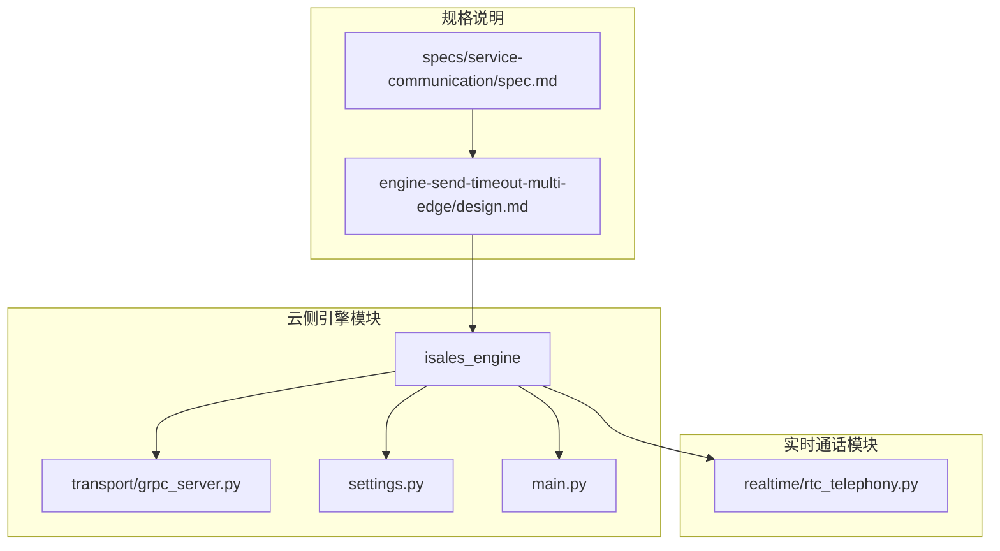
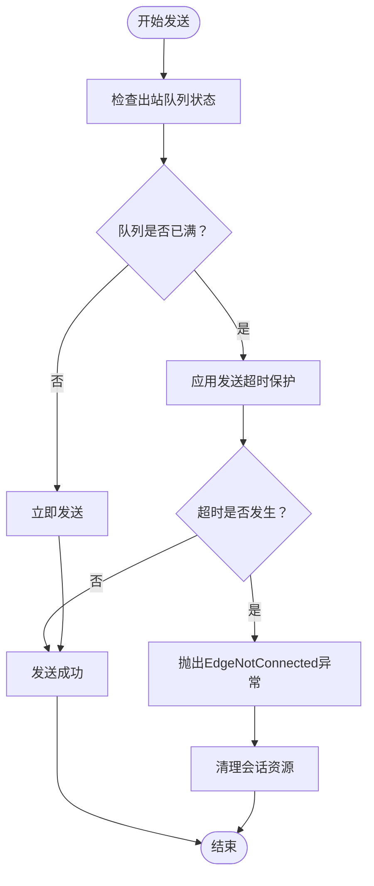
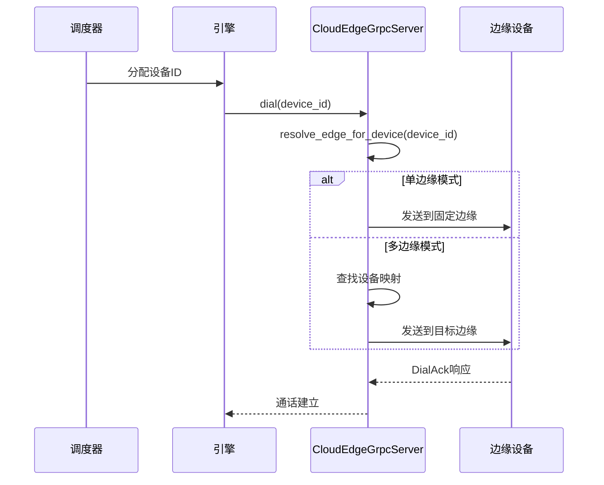
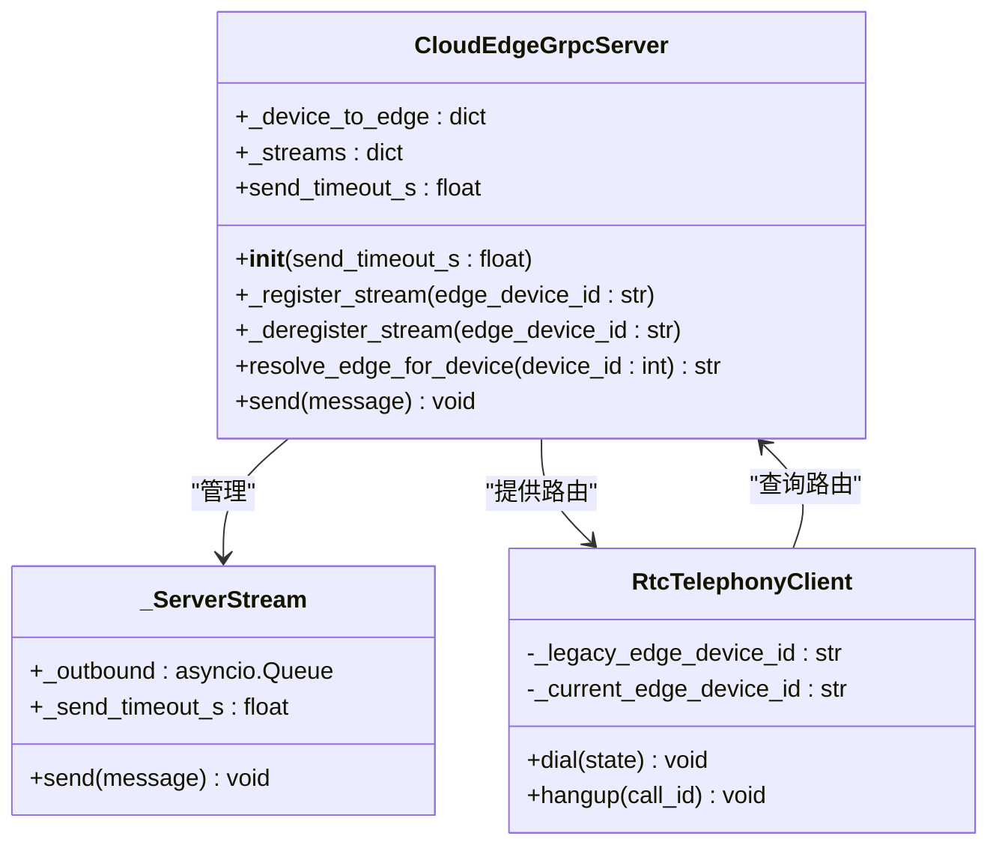
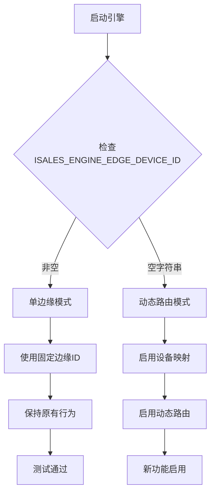
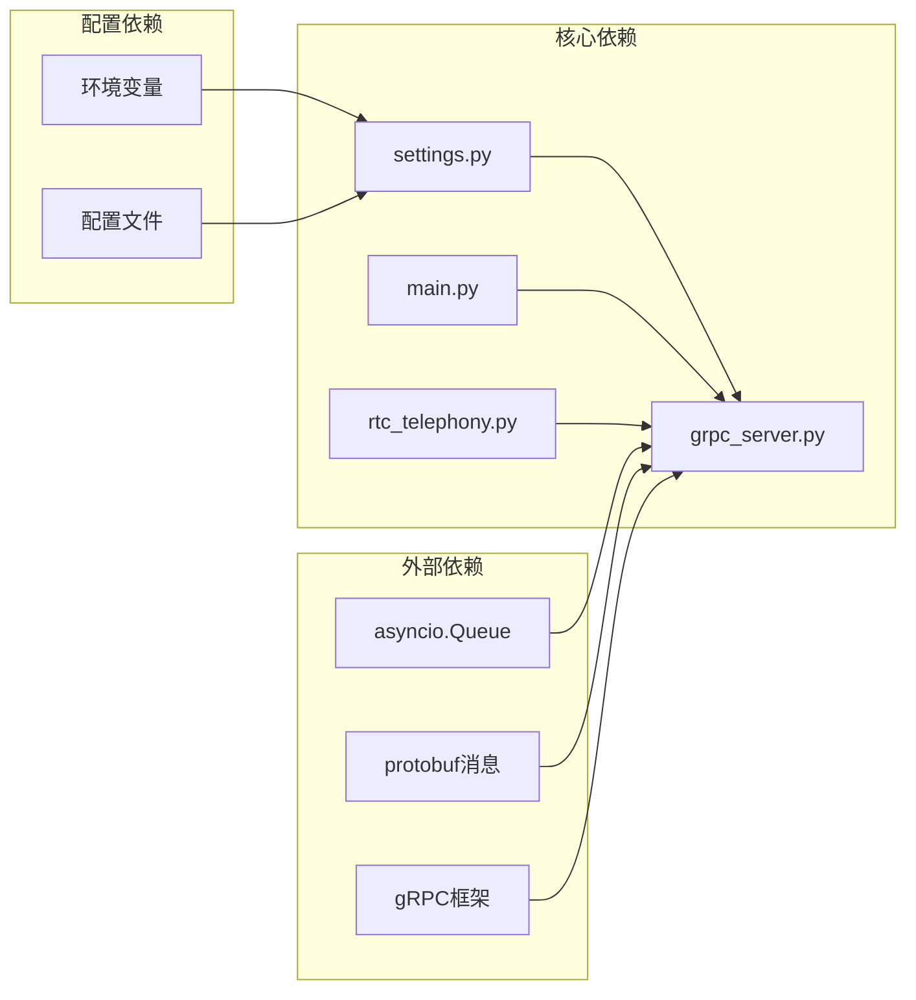
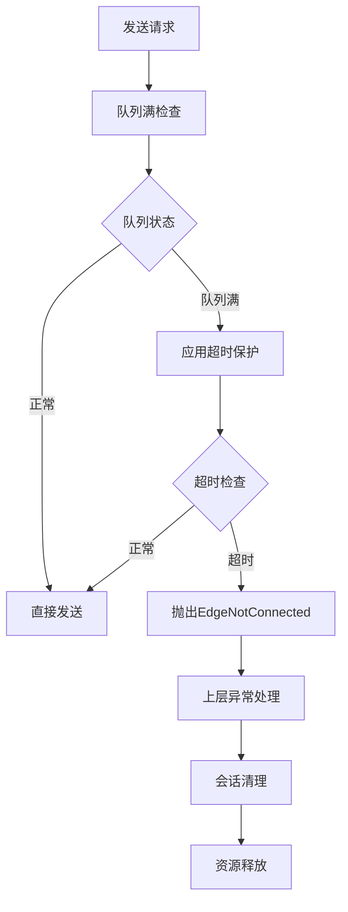

# 引擎发送超时多边缘设计

<cite>
**本文档引用的文件**
- [design.md](file://openspec/changes/engine-send-timeout-multi-edge/design.md)
- [spec.md](file://openspec/changes/engine-send-timeout-multi-edge/specs/service-communication/spec.md)
- [design.md](file://openspec/changes/arch-cloud-edge-split/design.md)
- [spec.md](file://openspec/changes/arch-cloud-edge-split/specs/service-communication/spec.md)
- [spec.md](file://openspec/changes/arch-cloud-edge-split/specs/device-hardware/spec.md)
- [gRPC服务接口.md](file://.qoder.local-backup-20260601/repowiki/zh/content/API接口文档/gRPC服务接口.md)
</cite>

## 目录
1. [简介](#简介)
2. [项目结构](#项目结构)
3. [核心组件](#核心组件)
4. [架构概览](#架构概览)
5. [详细组件分析](#详细组件分析)
6. [依赖关系分析](#依赖关系分析)
7. [性能考虑](#性能考虑)
8. [故障排除指南](#故障排除指南)
9. [结论](#结论)

## 简介

本文档详细分析了iSales v1.0云-边架构中的"引擎发送超时多边缘设计"变更。该设计解决了两个关键问题：

1. **发送超时保护**：防止因边缘设备半连接导致的会话僵死问题
2. **多边缘动态路由**：支持多个边缘设备并行处理通话请求

该设计在保持向后兼容性的同时，实现了云-边控制面的稳定性和可扩展性。

## 项目结构

基于openspec变更记录，该设计涉及以下关键文件和模块：



**图表来源**
- [design.md:1-70](file://openspec/changes/engine-send-timeout-multi-edge/design.md#L1-L70)
- [spec.md:1-69](file://openspec/changes/engine-send-timeout-multi-edge/specs/service-communication/spec.md#L1-L69)

**章节来源**
- [design.md:1-70](file://openspec/changes/engine-send-timeout-multi-edge/design.md#L1-L70)
- [spec.md:1-69](file://openspec/changes/engine-send-timeout-multi-edge/specs/service-communication/spec.md#L1-L69)

## 核心组件

### 1. gRPC出站队列超时保护机制

该机制通过在`_ServerStream.send()`方法中添加显式超时来防止会话僵死：



**图表来源**
- [design.md:26-36](file://openspec/changes/engine-send-timeout-multi-edge/design.md#L26-L36)

### 2. 多边缘动态路由系统

该系统实现了基于设备ID的智能路由机制：



**图表来源**
- [design.md:42-58](file://openspec/changes/engine-send-timeout-multi-edge/design.md#L42-L58)

**章节来源**
- [design.md:24-70](file://openspec/changes/engine-send-timeout-multi-edge/design.md#L24-L70)

## 架构概览

### 云-边控制面架构

```mermaid
graph TB
subgraph "云端"
CloudEngine[CloudEdgeGrpcServer]
TelephonyClient[RtcTelephonyClient]
DeviceManager[设备管理器]
end
subgraph "网络层"
GRPC[gRPC双向流]
end
subgraph "边缘侧"
EdgeClient[CloudEdgeGrpcClient]
EdgeDaemon[边缘守护进程]
Device[物理设备]
end
CloudEngine < --> GRPC
GRPC --> EdgeClient
TelephonyClient --> CloudEngine
DeviceManager --> CloudEngine
EdgeClient --> EdgeDaemon
EdgeDaemon --> Device
CloudEngine -.->|"Heartbeat<br/>设备映射"| DeviceManager
TelephonyClient -.->|"DialCommand<br/>CancelCommand"| GRPC
```

**图表来源**
- [spec.md:101-160](file://openspec/changes/arch-cloud-edge-split/specs/service-communication/spec.md#L101-L160)

### 发送超时保护流程

```mermaid
flowchart TD
A[调用_send()] --> B[创建asyncio.wait_for]
B --> C[尝试队列put操作]
C --> D{超时是否发生？}
D --> |否| E[发送成功]
D --> |是| F[抛出EdgeNotConnected异常]
F --> G[上层处理断连清理]
E --> H[会话正常继续]
G --> I[资源清理和状态重置]
```

**图表来源**
- [spec.md:3-22](file://openspec/changes/engine-send-timeout-multi-edge/specs/service-communication/spec.md#L3-L22)

**章节来源**
- [spec.md:101-160](file://openspec/changes/arch-cloud-edge-split/specs/service-communication/spec.md#L101-L160)

## 详细组件分析

### CloudEdgeGrpcServer组件

该组件是整个云-边架构的核心，负责管理gRPC双向流和设备映射：



**图表来源**
- [design.md:42-58](file://openspec/changes/engine-send-timeout-multi-edge/design.md#L42-L58)

### 发送超时配置系统

系统提供了灵活的超时配置机制：

| 配置项 | 默认值 | 作用域 | 描述 |
|--------|--------|--------|------|
| ISALES_ENGINE_GRPC_SEND_TIMEOUT_S | 5.0秒 | 全局 | 出站消息发送超时时间 |
| ISALES_ENGINE_EDGE_DEVICE_ID | 空字符串 | 环境变量 | 边缘设备标识符 |

**章节来源**
- [design.md:37-41](file://openspec/changes/engine-send-timeout-multi-edge/design.md#L37-L41)

### 向后兼容性保证

系统通过环境变量实现无缝的向后兼容：



**图表来源**
- [design.md:61-66](file://openspec/changes/engine-send-timeout-multi-edge/design.md#L61-L66)

**章节来源**
- [design.md:61-70](file://openspec/changes/engine-send-timeout-multi-edge/design.md#L61-L70)

## 依赖关系分析

### 组件耦合度分析



**图表来源**
- [design.md:37-59](file://openspec/changes/engine-send-timeout-multi-edge/design.md#L37-L59)

### 错误处理机制

系统实现了多层次的错误处理：



**图表来源**
- [spec.md:23-31](file://openspec/changes/engine-send-timeout-multi-edge/specs/service-communication/spec.md#L23-L31)

**章节来源**
- [spec.md:1-69](file://openspec/changes/engine-send-timeout-multi-edge/specs/service-communication/spec.md#L1-L69)

## 性能考虑

### 超时参数调优

| 参数 | 默认值 | 调优建议 | 影响范围 |
|------|--------|----------|----------|
| send_timeout_s | 5.0秒 | 1-30秒范围内调整 | 发送超时保护 |
| queue_maxsize | 64 | 根据负载调整 | 内存使用和延迟 |
| connect_timeout_s | 30秒 | 保持默认 | 连接稳定性 |

### 内存和CPU优化

- **队列缓冲**：合理的队列大小平衡内存使用和吞吐量
- **异步I/O**：利用asyncio实现高并发处理
- **连接池**：复用gRPC连接减少建立成本

## 故障排除指南

### 常见问题诊断

1. **EdgeNotConnected异常**
   - 检查边缘设备心跳状态
   - 验证设备映射是否正确
   - 确认网络连接稳定性

2. **会话僵死问题**
   - 监控发送超时频率
   - 检查边缘设备处理能力
   - 验证队列积压情况

3. **路由错误**
   - 确认设备ID映射完整性
   - 检查边缘设备注册状态
   - 验证环境变量配置

### 监控指标

- 发送超时次数统计
- 队列满频率监控
- 设备映射准确性检查
- 边缘设备在线率

**章节来源**
- [design.md:67-70](file://openspec/changes/engine-send-timeout-multi-edge/design.md#L67-L70)

## 结论

"引擎发送超时多边缘设计"成功解决了云-边架构中的两个关键挑战：

1. **稳定性提升**：通过发送超时保护机制，有效防止了会话僵死问题
2. **可扩展性增强**：多边缘动态路由支持了并行处理能力
3. **向后兼容**：无缝支持现有单边缘部署

该设计在保证系统稳定性的同时，为未来的业务增长奠定了坚实基础。通过合理的配置管理和监控机制，可以确保系统在各种网络环境下都能保持高性能运行。