# 流式管道与旁路决策架构

<cite>
**本文档引用的文件**
- [DESIGN.md](file://DESIGN.md)
- [README.md](file://README.md)
- [ai-pipeline/spec.md](file://openspec/specs/ai-pipeline/spec.md)
- [call-state-machine/spec.md](file://openspec/specs/call-state-machine/spec.md)
- [architecture/spec.md](file://openspec/specs/architecture/spec.md)
- [service-communication/spec.md](file://openspec/specs/service-communication/spec.md)
- [transcript/spec.md](file://openspec/specs/transcript/spec.md)
- [data-model/spec.md](file://openspec/specs/data-model/spec.md)
- [message-contract/spec.md](file://openspec/specs/message-contract/spec.md)
- [pipeline-stream-and-referee/design.md](file://openspec/changes/pipeline-stream-and-referee/design.md)
- [pipeline-stream-and-referee/proposal.md](file://openspec/changes/pipeline-stream-and-referee/proposal.md)
- [pipeline-stream-and-referee/specs/data-model/spec.md](file://openspec/changes/pipeline-stream-and-referee/specs/data-model/spec.md)
- [pipeline-stream-and-referee/specs/ai-pipeline/spec.md](file://openspec/changes/pipeline-stream-and-referee/specs/ai-pipeline/spec.md)
- [pipeline-stream-and-referee/specs/goal-achievement/spec.md](file://openspec/changes/pipeline-stream-and-referee/specs/goal-achievement/spec.md)
- [pipeline-stream-and-referee/specs/provider-abc/spec.md](file://openspec/changes/pipeline-stream-and-referee/specs/provider-abc/spec.md)
- [pipeline-stream-and-referee/specs/role-prompt/spec.md](file://openspec/changes/pipeline-stream-and-referee/specs/role-prompt/spec.md)
- [engine/queue_consumer.py](file://engine/queue_consumer.py)
- [engine/state_machine.py](file://engine/state_machine.py)
- [engine/pipeline/orchestrator.py](file://engine/pipeline/orchestrator.py)
- [engine/realtime/interruption_detector.py](file://engine/realtime/interruption_detector.py)
- [engine/realtime/silence_detector.py](file://engine/realtime/silence_detector.py)
- [engine/transfer/manager.py](file://engine/transfer/manager.py)
- [engine/wrapup/manager.py](file://engine/wrapup/manager.py)
- [engine/transcript_recorder.py](file://engine/transcript_recorder.py)
- [engine/telephony_client.py](file://engine/telephony_client.py)
- [isales-common/enums.py](file://isales-common/isales_common/enums.py)
</cite>

## 更新摘要
**所做更改**
- 新增sentence splitter模块，实现流式token到句子的智能切分
- 完善referee旁路决策系统，支持实时结构化决策和fail-open机制
- 增强LLM provider流式支持，新增chat_stream接口和JSON模式约束
- 实现post-call extractor异步处理架构，通过Redis队列解耦处理
- 从三层judge+polish架构完全重构为双LLM架构，显著降低首音频延迟
- 更新RoleKind枚举，从{role,judge,polish}改为{main,referee,extractor}

## 目录
1. [简介](#简介)
2. [项目结构](#项目结构)
3. [核心组件](#核心组件)
4. [架构概览](#架构概览)
5. [详细组件分析](#详细组件分析)
6. [依赖关系分析](#依赖关系分析)
7. [性能考虑](#性能考虑)
8. [故障排除指南](#故障排除指南)
9. [结论](#结论)

## 简介

iSales 是一个基于 OpenSpec 规范的 AI 外呼销售系统，采用"流式管道与旁路决策架构"设计。该架构通过双LLM架构实现高效的实时通话处理，其中主LLM负责流式对话生成，旁路referee LLM负责结构化决策，post-call extractor负责客户信息抽取。系统采用7仓库微服务架构，包括 isales-common、isales-api、isales-engine、isales-scheduler、isales-worker、isales-telephony 和 isales-web，通过 Redis 队列和 Pub/Sub 实现服务间通信。

**更新** 从三层judge+polish架构完全重构为双LLM架构，新增sentence splitter模块、referee旁路决策系统、LLM provider流式支持增强、post-call extractor异步处理等新功能，显著降低首音频延迟并提升整体性能。

## 项目结构

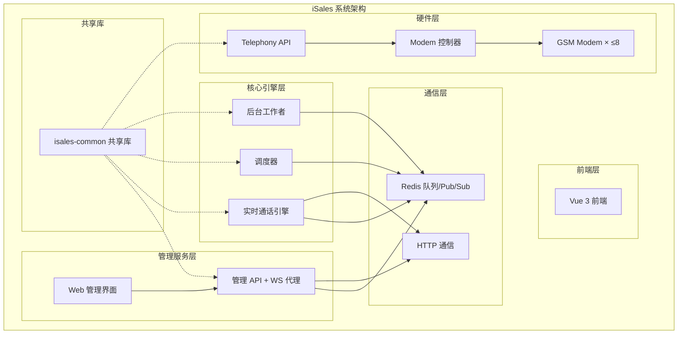

**图表来源**
- [architecture/spec.md:130-168](file://openspec/specs/architecture/spec.md#L130-L168)
- [service-communication/spec.md:11-24](file://openspec/specs/service-communication/spec.md#L11-L24)

**章节来源**
- [README.md:1-86](file://README.md#L1-L86)
- [architecture/spec.md:1-168](file://openspec/specs/architecture/spec.md#L1-L168)

## 核心组件

### 状态机核心组件

系统的核心是统一的状态机，负责管理通话生命周期的所有状态转换：

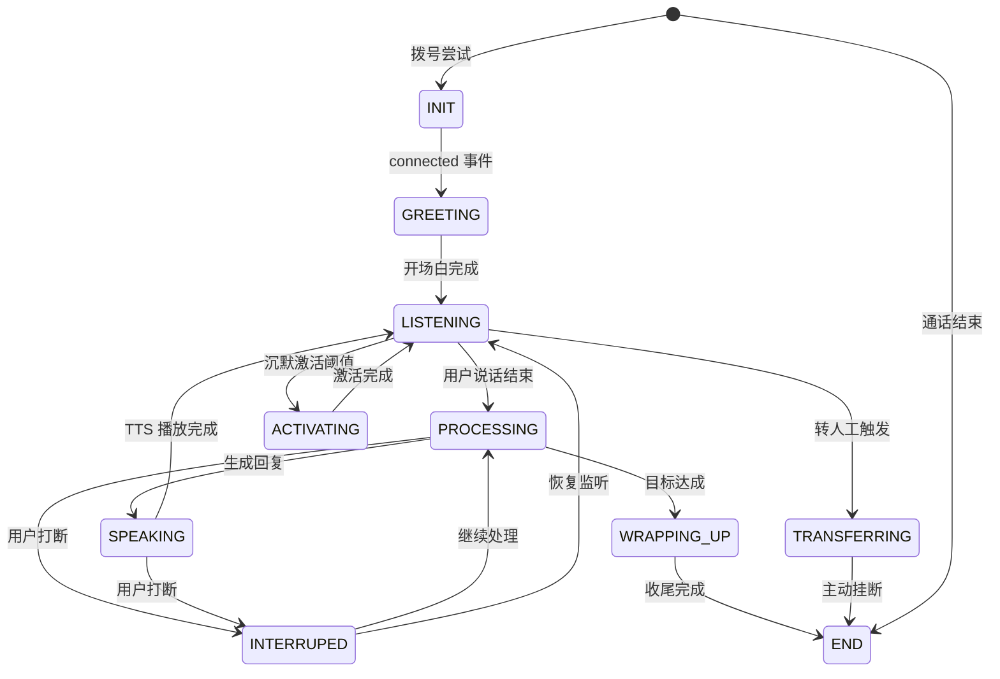

**图表来源**
- [call-state-machine/spec.md:7-21](file://openspec/specs/call-state-machine/spec.md#L7-L21)
- [call-state-machine/spec.md:46-149](file://openspec/specs/call-state-machine/spec.md#L46-L149)

### 双LLM管道组件

AI 管道采用双LLM并行处理架构，主LLM负责流式对话，referee负责结构化决策：

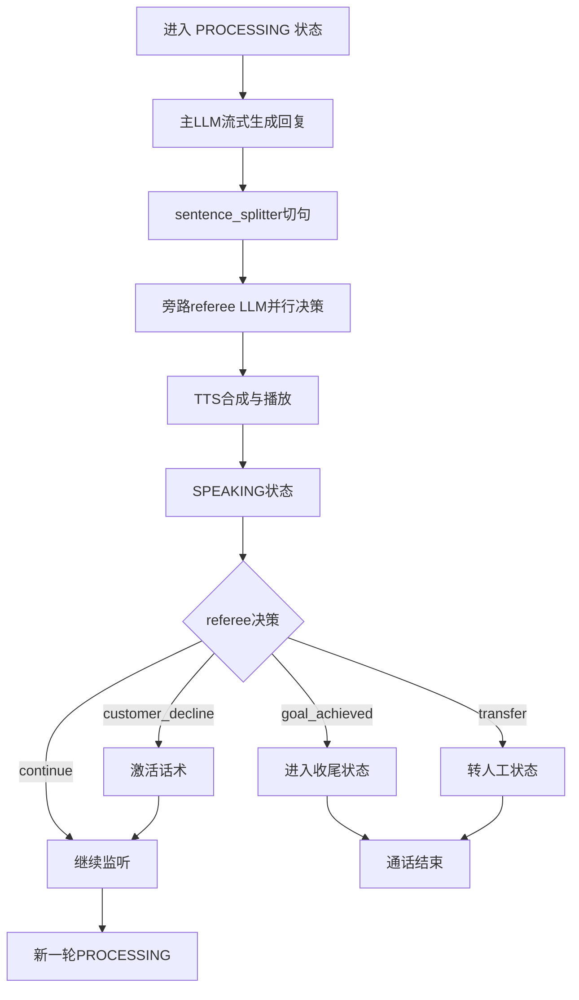

**图表来源**
- [pipeline-stream-and-referee/design.md:75-98](file://openspec/changes/pipeline-stream-and-referee/design.md#L75-L98)

**更新** 新增sentence splitter模块，实现流式token到句子的智能切分；从三层judge+polish架构重构为双LLM架构，主LLM输出纯文本流式回复，referee并行执行结构化决策。

**章节来源**
- [pipeline-stream-and-referee/design.md:1-278](file://openspec/changes/pipeline-stream-and-referee/design.md#L1-L278)
- [pipeline-stream-and-referee/specs/ai-pipeline/spec.md:73-94](file://openspec/changes/pipeline-stream-and-referee/specs/ai-pipeline/spec.md#L73-L94)

## 架构概览

### 服务间通信架构

系统采用统一的消息契约和通信协议：

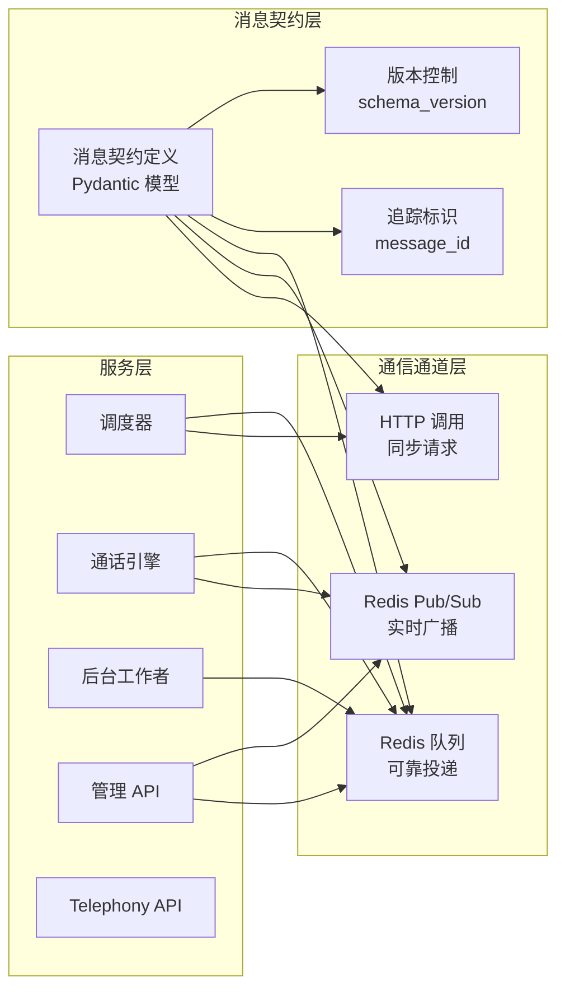

**图表来源**
- [message-contract/spec.md:6-85](file://openspec/specs/message-contract/spec.md#L6-L85)
- [service-communication/spec.md:7-34](file://openspec/specs/service-communication/spec.md#L7-L34)

### 数据存储架构

采用统一的数据模型和存储策略，包含新的双LLM架构数据结构：

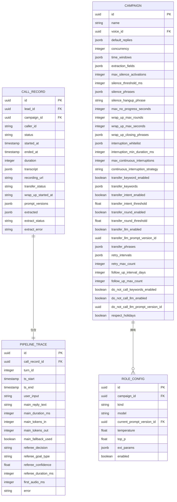

**图表来源**
- [pipeline-stream-and-referee/specs/data-model/spec.md:38-57](file://openspec/changes/pipeline-stream-and-referee/specs/data-model/spec.md#L38-L57)

**更新** 新增extract_status、extract_error等字段，删除judge_results、polish_*相关字段。

**章节来源**
- [service-communication/spec.md:78-150](file://openspec/specs/service-communication/spec.md#L78-L150)
- [pipeline-stream-and-referee/specs/data-model/spec.md:1-83](file://openspec/changes/pipeline-stream-and-referee/specs/data-model/spec.md#L1-L83)

## 详细组件分析

### 状态机组件分析

状态机作为系统的核心协调器，实现了统一的状态转换管理和事件驱动机制：

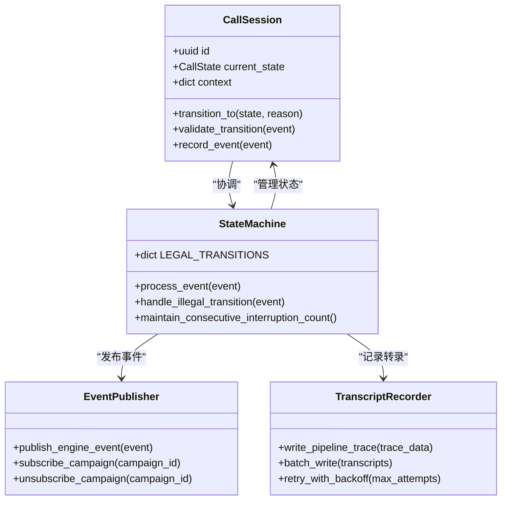

**图表来源**
- [engine/state_machine.py](file://engine/state_machine.py)
- [engine/call_session.py](file://engine/call_session.py)
- [engine/transcript_recorder.py](file://engine/transcript_recorder.py)
- [engine/event_publisher.py](file://engine/event_publisher.py)

### 双LLM管道组件分析

AI 管道实现了复杂的并行处理和旁路决策机制：

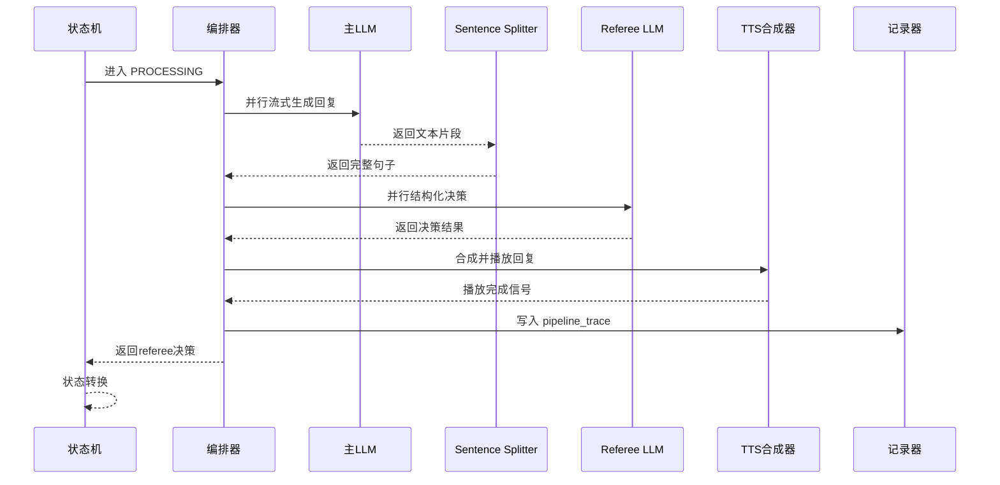

**图表来源**
- [engine/pipeline/orchestrator.py](file://engine/pipeline/orchestrator.py)
- [pipeline-stream-and-referee/design.md:75-98](file://openspec/changes/pipeline-stream-and-referee/design.md#L75-L98)

**更新** 新增sentence splitter模块，实现流式token到句子的智能切分；从三层judge+polish架构重构为双LLM架构，主LLM输出纯文本流式回复，referee并行执行结构化决策。

### 实时检测组件分析

系统实现了多种实时检测机制来处理通话过程中的各种情况：

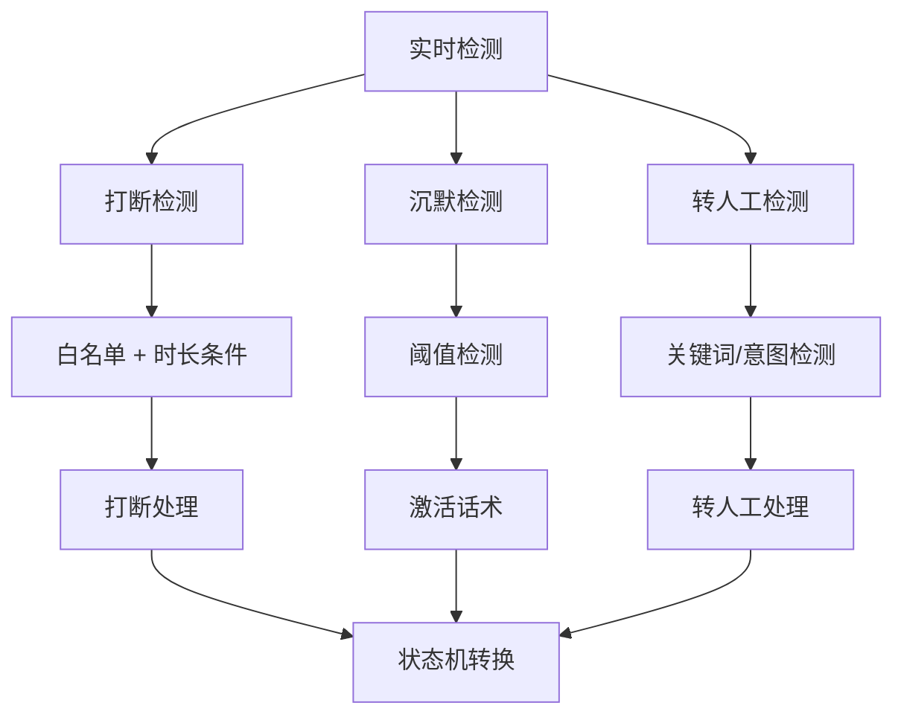

**图表来源**
- [engine/realtime/interruption_detector.py](file://engine/realtime/interruption_detector.py)
- [engine/realtime/silence_detector.py](file://engine/realtime/silence_detector.py)
- [engine/transfer/manager.py](file://engine/transfer/manager.py)

### Post-call Extractor组件分析

post-call extractor实现了异步客户信息抽取架构：

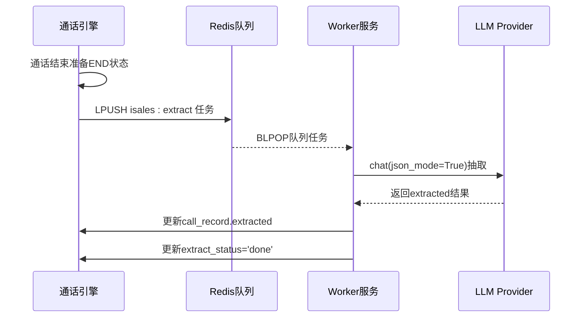

**图表来源**
- [pipeline-stream-and-referee/specs/ai-pipeline/spec.md:130-152](file://openspec/changes/pipeline-stream-and-referee/specs/ai-pipeline/spec.md#L130-L152)
- [pipeline-stream-and-referee/specs/service-communication/spec.md:28-48](file://openspec/changes/pipeline-stream-and-referee/specs/service-communication/spec.md#L28-L48)

**更新** 新增post-call extractor异步处理架构，通过Redis队列实现engine与extractor的完全解耦。

### Sentence Splitter组件分析

sentence splitter模块实现了智能的流式token切句：

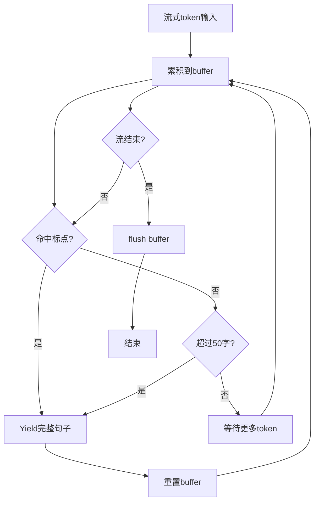

**图表来源**
- [pipeline-stream-and-referee/tasks.md:44-49](file://openspec/changes/pipeline-stream-and-referee/tasks.md#L44-L49)

**更新** 新增sentence splitter模块，实现流式token到句子的智能切分，支持中文标点、换行符和长度限制。

### LLM Provider流式支持分析

LLM Provider增强了流式支持和JSON模式约束：

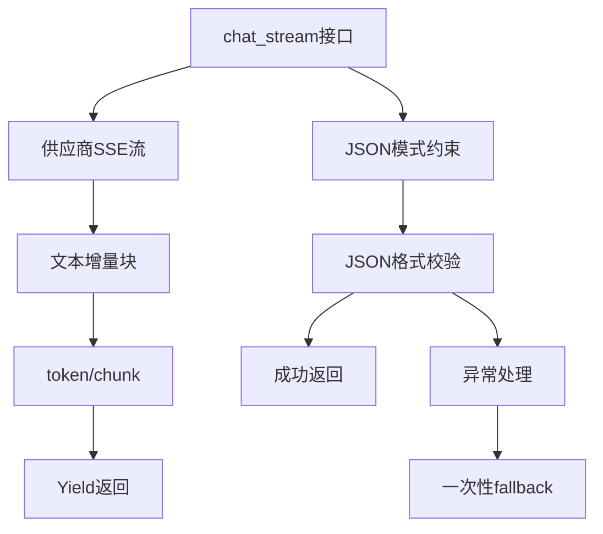

**图表来源**
- [pipeline-stream-and-referee/specs/provider-abc/spec.md:24-52](file://openspec/changes/pipeline-stream-and-referee/specs/provider-abc/spec.md#L24-L52)

**更新** 新增chat_stream接口，支持供应商SSE流协议；增强JSON模式约束，确保输出格式一致性。

## 依赖关系分析

### 组件耦合度分析

系统采用了松耦合的设计原则，通过统一的接口和消息契约实现组件间的解耦：

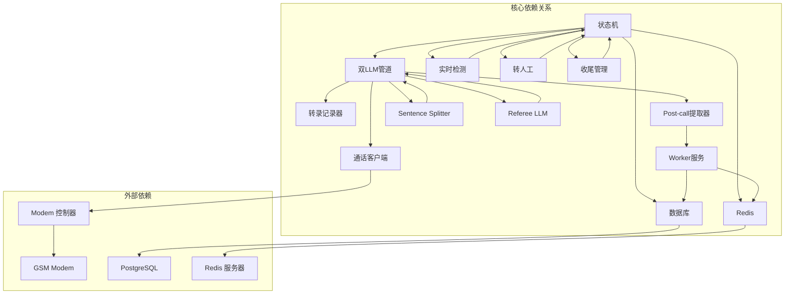

**图表来源**
- [engine/state_machine.py](file://engine/state_machine.py)
- [engine/pipeline/orchestrator.py](file://engine/pipeline/orchestrator.py)
- [engine/transcript_recorder.py](file://engine/transcript_recorder.py)
- [engine/telephony_client.py](file://engine/telephony_client.py)

### 错误处理和降级策略

系统实现了多层次的错误处理和降级机制：

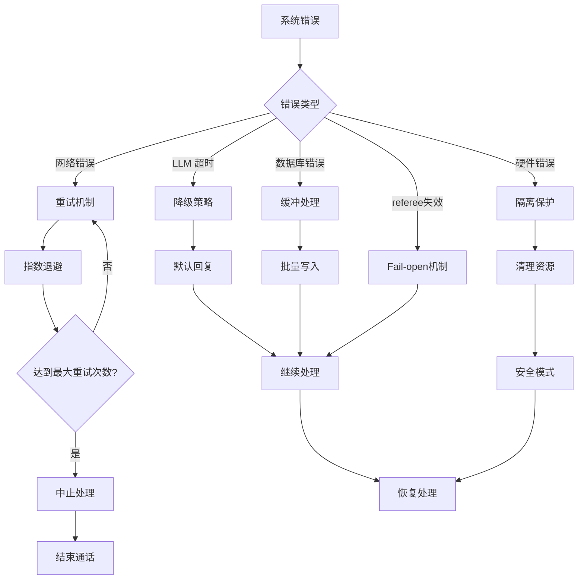

**更新** 新增referee决策失败的fail-open机制，以及post-call extractor的异步处理策略；增强LLM provider的异常映射和重连机制。

**图表来源**
- [pipeline-stream-and-referee/design.md:201-206](file://openspec/changes/pipeline-stream-and-referee/design.md#L201-L206)
- [service-communication/spec.md:87-105](file://openspec/specs/service-communication/spec.md#L87-L105)

**章节来源**
- [pipeline-stream-and-referee/design.md:201-278](file://openspec/changes/pipeline-stream-and-referee/design.md#L201-L278)
- [service-communication/spec.md:87-150](file://openspec/specs/service-communication/spec.md#L87-L150)

## 性能考虑

### 并行处理优化

系统通过双层并行处理实现性能优化：

1. **双LLM并行化**：主LLM流式生成与referee结构化决策同时运行
2. **垫词与处理并行**：FILLER 状态与 PROCESSING 并行启动
3. **状态转换最小化**：通过统一的 transition_to 接口减少状态变更开销
4. **首音频延迟优化**：从6.5-9.5秒降至500-1500毫秒
5. **sentence splitter优化**：智能切句减少TTS合成等待时间

### 资源管理策略

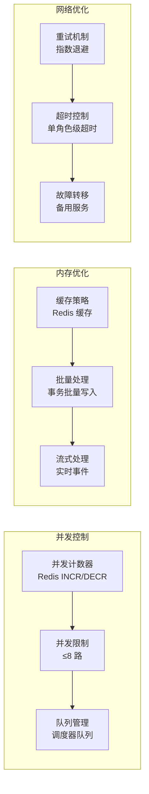

**更新** 新增referee LLM的小模型使用策略，显著降低决策成本和延迟；优化sentence splitter的内存使用和处理效率。

**图表来源**
- [service-communication/spec.md:45-77](file://openspec/specs/service-communication/spec.md#L45-L77)
- [pipeline-stream-and-referee/design.md:9-14](file://openspec/changes/pipeline-stream-and-referee/design.md#L9-L14)

## 故障排除指南

### 常见问题诊断

1. **状态机异常**：
   - 检查 LEGAL_TRANSITIONS 配置
   - 验证事件驱动接口调用
   - 查看 state_error 事件记录

2. **双LLM管道故障**：
   - 监控 pipeline_trace 表的新字段
   - 检查 LLM Provider 状态
   - 验证主LLM流式输出和referee决策
   - 检查sentence splitter的切句效果

3. **通信问题**：
   - 检查 Redis 连接状态
   - 验证消息契约版本
   - 监控队列积压情况
   - 检查post-call extractor队列状态

4. **post-call extractor异常**：
   - 检查 worker 服务状态
   - 验证 Redis 队列订阅
   - 监控提取状态字段
   - 检查extract_status状态变化

5. **referee决策异常**：
   - 检查referee LLM配置
   - 验证JSON模式输出格式
   - 监控confidence阈值
   - 检查fail-open机制

### 调试工具和方法

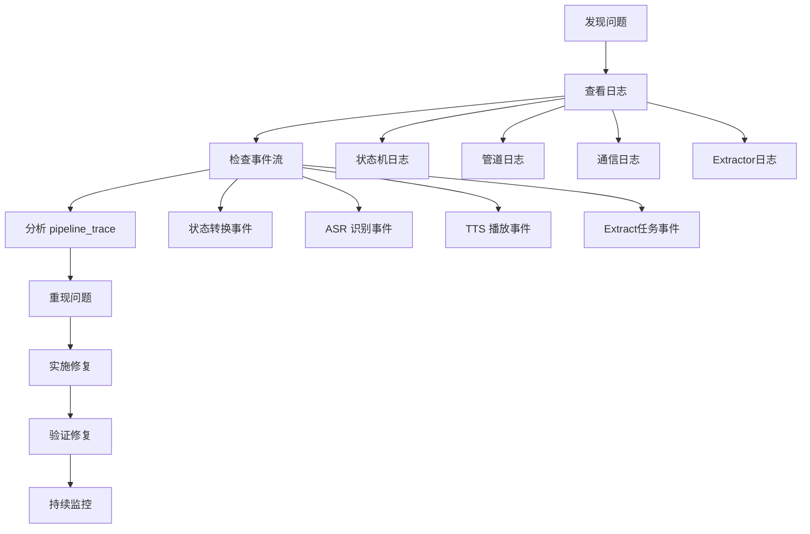

**更新** 新增post-call extractor的调试流程和pipeline_trace字段分析方法；新增sentence splitter和referee决策的专门调试指南。

**章节来源**
- [transcript/spec.md:77-127](file://openspec/specs/transcript/spec.md#L77-L127)
- [DESIGN.md:9-75](file://DESIGN.md#L9-L75)

## 结论

iSales 的"流式管道与旁路决策架构"通过以下关键设计实现了高效的实时通话处理：

1. **双LLM并行架构**：主LLM负责流式对话生成，referee负责结构化决策，显著降低首音频延迟（从6.5-9.5秒降至500-1500毫秒）

2. **旁路决策机制**：referee LLM与主LLM并行运行，在SPEAKING状态结束前提供实时决策，支持目标达成、转人工、客户拒绝等场景，具备fail-open降级保护

3. **post-call异步提取**：将客户信息抽取从实时通话流程中剥离，通过worker服务异步处理，提升实时性能，支持失败重试和状态跟踪

4. **智能切句处理**：sentence splitter模块实现流式token到句子的智能切分，优化TTS合成效率和用户体验

5. **增强的流式支持**：LLM provider新增chat_stream接口，支持供应商SSE流协议和JSON模式约束，确保输出格式一致性

6. **RoleKind枚举重构**：从{role,judge,polish}改为{main,referee,extractor}，更符合双LLM架构的设计理念

7. **松耦合的服务架构**：通过 Redis 队列和 Pub/Sub 实现服务间的解耦，支持水平扩展

8. **完善的错误处理**：多层次的降级策略和重试机制确保系统的稳定性，包括referee的fail-open机制、post-call extractor的异步处理和LLM provider的异常映射

这一架构设计为 AI 外呼销售系统提供了可靠的基础设施，支持高并发、低延迟的实时通话处理需求，同时保持了销售场景特有的目标达成和客户信息抽取能力。新增的功能模块进一步提升了系统的智能化水平和用户体验。