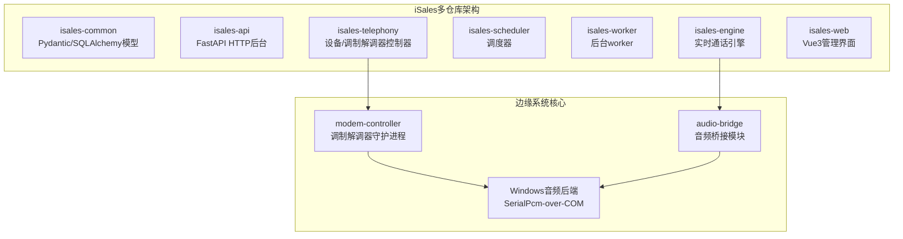
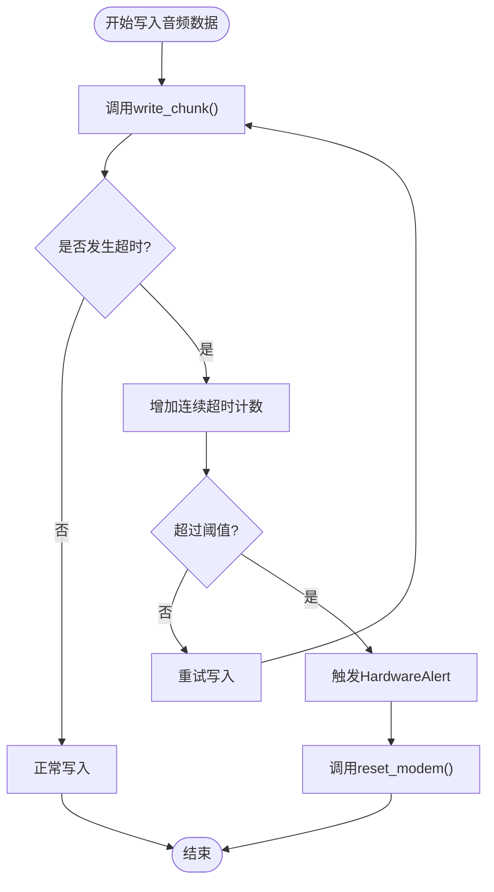
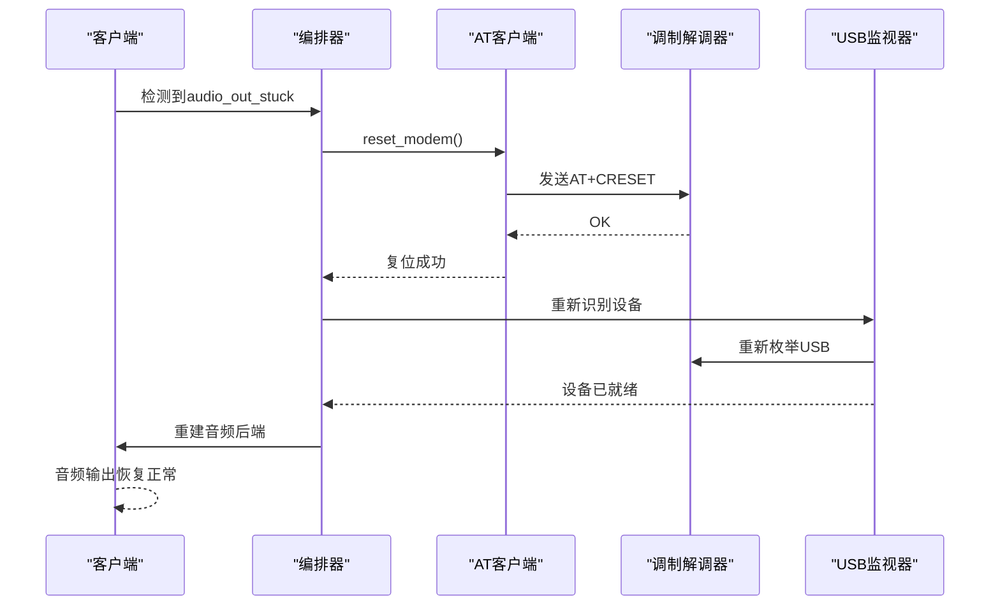
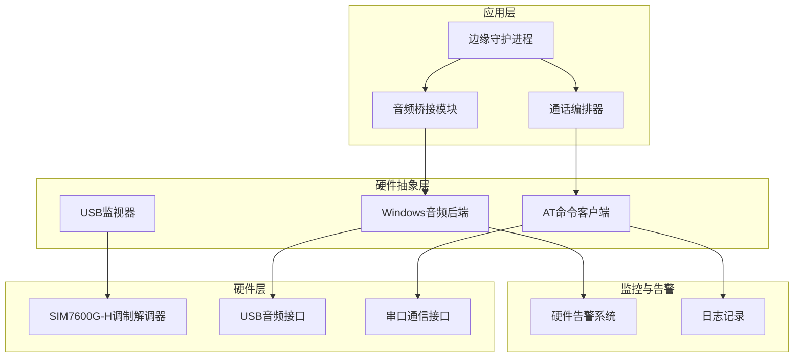
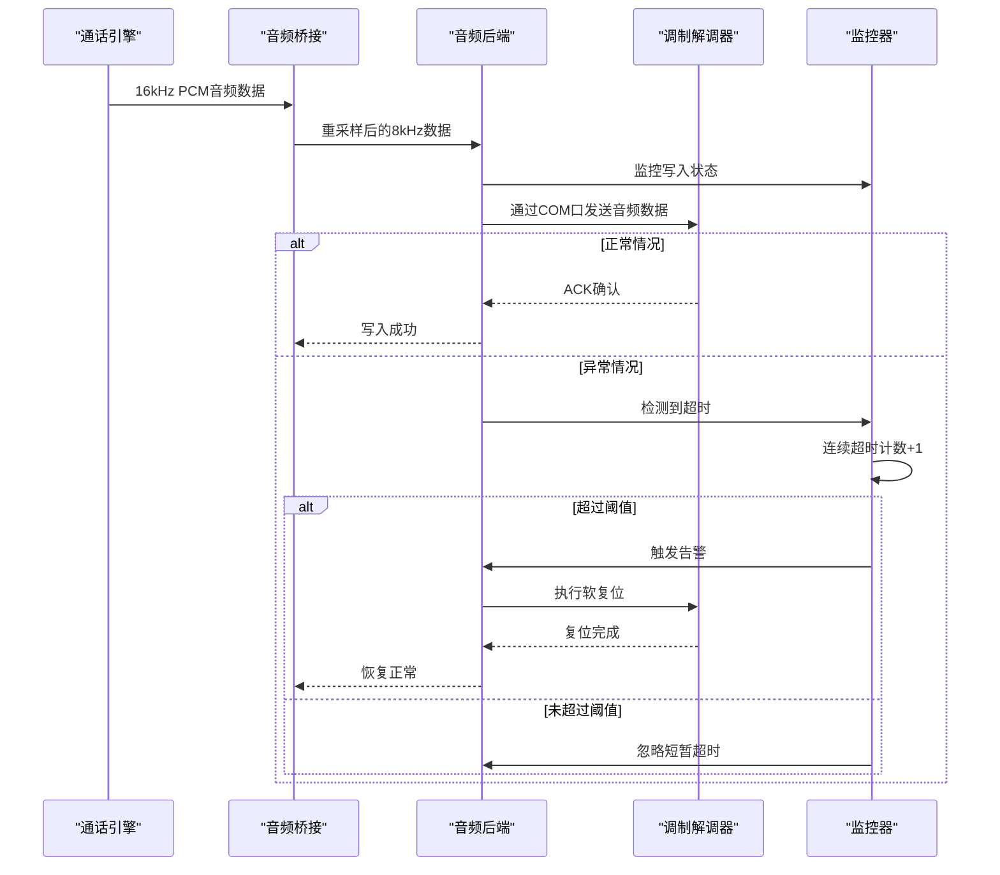
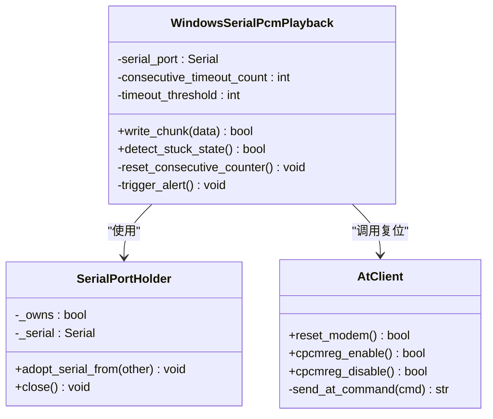
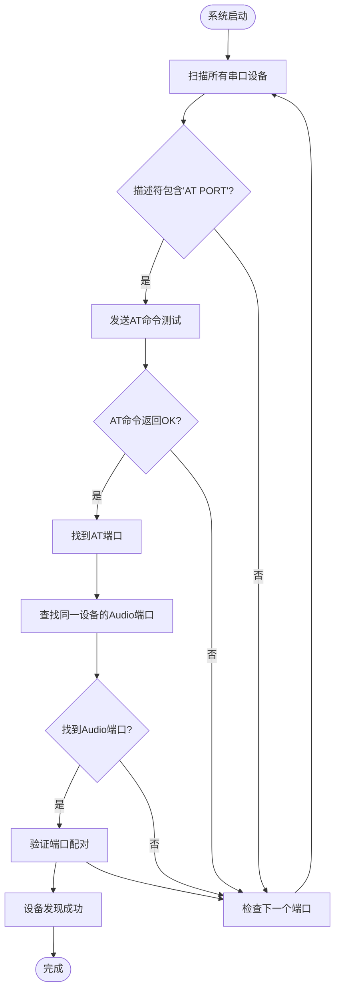
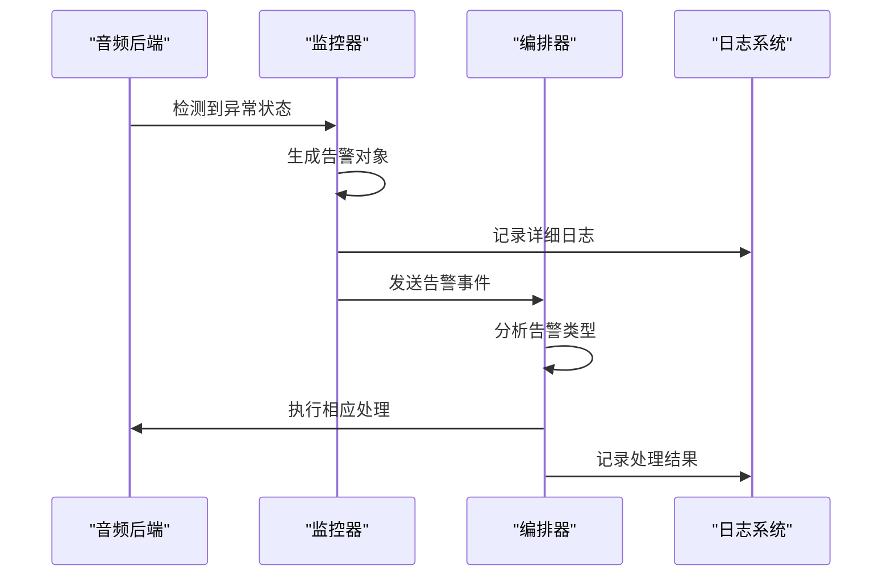
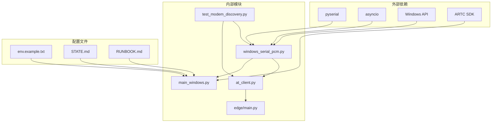
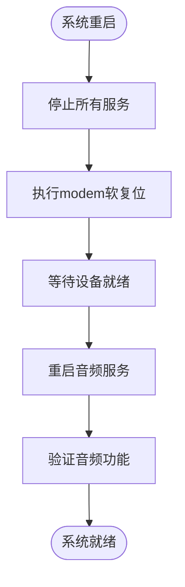

# 边缘调制解调器音频输出恢复系统

<cite>
**本文档引用的文件**
- [README.md](file://README.md)
- [DESIGN.md](file://DESIGN.md)
- [proposal.md](file://openspec/changes/edge-modem-audio-out-recovery/proposal.md)
- [design.md](file://openspec/changes/edge-modem-audio-out-recovery/design.md)
- [spec.md](file://openspec/changes/edge-modem-audio-out-recovery/specs/device-hardware/spec.md)
- [tasks.md](file://openspec/changes/edge-modem-audio-out-recovery/tasks.md)
- [STATE.md](file://deploy/edge/STATE.md)
- [RUNBOOK.md](file://deploy/RUNBOOK.md)
- [main_windows.py](file://edge/main.py)
- [windows_serial_pcm.py](file://isales_telephony/modem_controller/audio/windows_serial_pcm.py)
- [at_client.py](file://isales_telephony/modem_controller/at_client.py)
- [test_modem_discovery.py](file://tests/windows/test_modem_discovery.py)
</cite>

## 目录
1. [简介](#简介)
2. [项目结构](#项目结构)
3. [核心组件](#核心组件)
4. [架构概览](#架构概览)
5. [详细组件分析](#详细组件分析)
6. [依赖关系分析](#依赖关系分析)
7. [性能考虑](#性能考虑)
8. [故障排除指南](#故障排除指南)
9. [结论](#结论)

## 简介

边缘调制解调器音频输出恢复系统是一个针对SIM7600G-H GSM调制解调器在Windows平台音频输出卡死问题的解决方案。该系统通过检测音频输出写超时异常，自动触发modem软复位来恢复音频传输功能。

### 系统背景

在2026年5月31日的真实拨测中发现，SIM7600G-H的USB音频上行链路在Windows环境下可用，但音频输出端点会出现"卡死态"——持续的SerialTimeoutException或阻塞写入导致音频传输永久中断。当前实现静默吞掉这些异常，导致对端完全听不到声音，只能通过物理重插USB来恢复。

### 核心目标

- 将"音频OUT卡死"从静默失败转变为可观测且可自愈的状态
- 建立modem软复位链路，验证其能否替代物理重插
- 确保会话初始化时的干净状态，降低卡死概率
- 记录已验证的事实和禁忌操作，防止回归

## 项目结构

该项目采用多仓库架构，主要涉及以下核心模块：

**图表来源**
- [README.md:3-14](file://README.md#L3-L14)

**章节来源**
- [README.md:1-86](file://README.md#L1-L86)
- [DESIGN.md:36-44](file://DESIGN.md#L36-L44)

## 核心组件

### 音频输出卡死检测器

音频输出卡死检测器是系统的核心组件，负责监控音频输出的写入状态并及时发现异常。

#### 关键特性
- **连续超时检测**：检测短时间窗口内的连续写超时
- **阈值控制**：默认连续25-50帧（0.5-1秒）全超时才触发告警
- **智能降噪**：容忍偶发的短时背压，避免误触发

#### 实现原理

**图表来源**
- [design.md:25-27](file://openspec/changes/edge-modem-audio-out-recovery/design.md#L25-L27)

### modem软复位链路

软复位链路提供了从硬件层面恢复音频输出功能的能力。

#### 复位策略
1. **优先级1**：`AT+CRESET` - 默认软复位命令
2. **优先级2**：`AT+CFUN=1,1` - 功能复位
3. **优先级3**：物理重插 - 最终手段

#### 复位验证流程

**图表来源**
- [design.md:29-31](file://openspec/changes/edge-modem-audio-out-recovery/design.md#L29-L31)

**章节来源**
- [proposal.md:7-10](file://openspec/changes/edge-modem-audio-out-recovery/proposal.md#L7-L10)
- [design.md:9-21](file://openspec/changes/edge-modem-audio-out-recovery/design.md#L9-L21)

## 架构概览

系统采用分层架构设计，确保音频输出恢复功能的可靠性和可维护性。

**图表来源**
- [design.md:1-8](file://openspec/changes/edge-modem-audio-out-recovery/design.md#L1-L8)

### 数据流分析

音频数据在系统中的流转过程如下：

**图表来源**
- [spec.md:9-11](file://openspec/changes/edge-modem-audio-out-recovery/specs/device-hardware/spec.md#L9-L11)

**章节来源**
- [spec.md:1-57](file://openspec/changes/edge-modem-audio-out-recovery/specs/device-hardware/spec.md#L1-L57)

## 详细组件分析

### Windows音频后端实现

Windows音频后端是系统的关键组件，负责直接与SIM7600G-H调制解调器的音频接口通信。

#### 核心功能

1. **串口句柄管理**：实现共享句柄机制，避免同一COM口的重复打开
2. **音频格式控制**：严格控制8kHz/16bit/mono的音频格式
3. **超时处理机制**：智能区分偶发超时和持续卡死

#### 代码结构

**图表来源**
- [windows_serial_pcm.py](file://isales_telephony/modem_controller/audio/windows_serial_pcm.py)
- [at_client.py](file://isales_telephony/modem_controller/at_client.py)

#### 关键实现细节

**连续超时检测算法**：
- 维护固定时间窗口（~0.5-1秒）内的超时计数
- 默认阈值：连续25-50帧全超时
- 超时类型区分：偶发背压 vs 持续卡死

**句柄共享机制**：
- `adopt_serial_from()`方法实现句柄借用
- 借用方不负责关闭句柄，避免双重关闭
- 支持并发读写操作

**章节来源**
- [tasks.md:14-18](file://openspec/changes/edge-modem-audio-out-recovery/tasks.md#L14-L18)
- [tasks.md:37-44](file://openspec/changes/edge-modem-audio-out-recovery/tasks.md#L37-L44)

### USB设备自动发现系统

系统实现了基于USB描述符的自动设备发现机制，避免依赖固定的COM端口号。

#### 发现流程

**图表来源**
- [tasks.md:45-51](file://openspec/changes/edge-modem-audio-out-recovery/tasks.md#L45-L51)

#### 设备验证机制

- **VID/PID匹配**：确保AT端口和Audio端口属于同一设备
- **序列号验证**：通过设备序列号确认唯一性
- **AT命令探针**：发送简单AT命令验证端口有效性

**章节来源**
- [tasks.md:45-51](file://openspec/changes/edge-modem-audio-out-recovery/tasks.md#L45-L51)

### 硬件告警系统

硬件告警系统负责监控各种硬件异常状态，并提供相应的处理建议。

#### 告警类型

| 告警类型 | 触发条件 | 处理建议 |
|---------|---------|---------|
| `audio_out_stuck` | 连续超时达到阈值 | 触发modem软复位 |
| `audio_buffer_stalled` | 音频缓冲区长时间阻塞 | 暂停上游数据流 |
| `pcm_enable_failed` | PCM通道启用失败 | 触发通话挂断 |

#### 告警传播流程

**图表来源**
- [design.md:39-44](file://openspec/changes/edge-modem-audio-out-recovery/design.md#L39-L44)

**章节来源**
- [design.md:37-44](file://openspec/changes/edge-modem-audio-out-recovery/design.md#L37-L44)

## 依赖关系分析

系统各组件之间的依赖关系体现了清晰的分层架构。

**图表来源**
- [tasks.md:22-24](file://openspec/changes/edge-modem-audio-out-recovery/tasks.md#L22-L24)

### 关键依赖关系

1. **pyserial依赖**：用于串口通信和超时处理
2. **Windows API依赖**：访问底层硬件接口
3. **AT命令协议**：与调制解调器的标准通信协议
4. **异步I/O模型**：支持非阻塞的音频数据处理

**章节来源**
- [tasks.md:22-24](file://openspec/changes/edge-modem-audio-out-recovery/tasks.md#L22-L24)

## 性能考虑

### 延迟优化

系统在设计时充分考虑了音频传输的实时性要求：

- **端到端延迟**：P95 ≤ 50ms
- **缓冲区管理**：避免音频数据丢失
- **重采样效率**：使用高效的重采样算法

### 资源管理

- **内存使用**：最小化音频缓冲区占用
- **CPU占用**：非阻塞I/O模型减少CPU负担
- **电源管理**：合理的休眠和唤醒机制

## 故障排除指南

### 常见问题诊断

#### 音频输出完全无声

**可能原因**：
1. 调制解调器处于卡死状态
2. COM端口配置错误
3. 音频格式不匹配

**解决步骤**：
1. 检查硬件告警日志
2. 验证USB设备发现是否成功
3. 确认音频格式设置正确

#### 偶发音频中断

**可能原因**：
1. 短暂的网络拥塞
2. 系统资源临时不足
3. 音频缓冲区暂时阻塞

**解决步骤**：
1. 查看连续超时计数
2. 检查系统负载情况
3. 调整缓冲区大小

### 维护操作

#### 系统重启流程

**图表来源**
- [tasks.md:22-24](file://openspec/changes/edge-modem-audio-out-recovery/tasks.md#L22-L24)

#### 预防性维护

- **定期检查**：监控连续超时统计
- **环境监测**：温度、湿度、电压稳定性
- **固件更新**：及时应用调制解调器固件更新

**章节来源**
- [RUNBOOK.md](file://deploy/RUNBOOK.md)
- [STATE.md](file://deploy/edge/STATE.md)

## 结论

边缘调制解调器音频输出恢复系统通过以下创新解决了长期存在的技术难题：

### 主要成就

1. **智能化异常检测**：从静默失败转变为可观测状态
2. **自动化恢复机制**：无需人工干预即可恢复音频功能
3. **可靠的设备发现**：避免了固定配置带来的维护问题
4. **完善的监控体系**：提供全面的故障诊断能力

### 技术创新

- **连续超时检测算法**：精确区分正常背压和异常卡死
- **多级软复位策略**：提供渐进式的故障恢复方案
- **共享句柄机制**：优化资源使用和性能表现
- **基于描述符的设备发现**：提高系统的可靠性

### 未来展望

该系统为iSales整体架构奠定了坚实基础，为后续的功能扩展和性能优化提供了良好的技术支撑。通过持续的监控和改进，系统将能够更好地服务于商业应用场景。