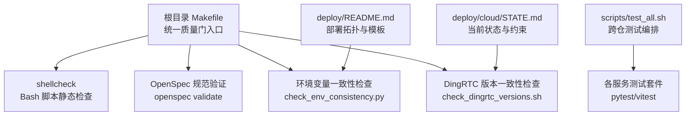
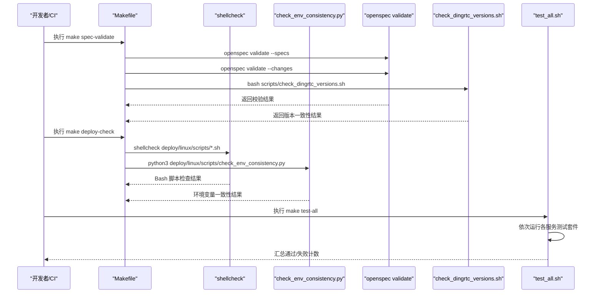
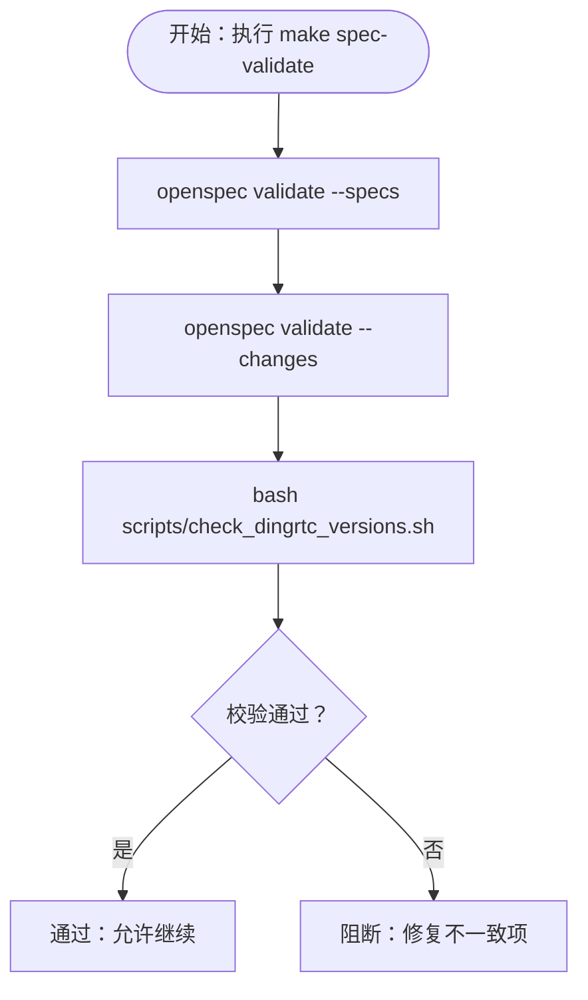
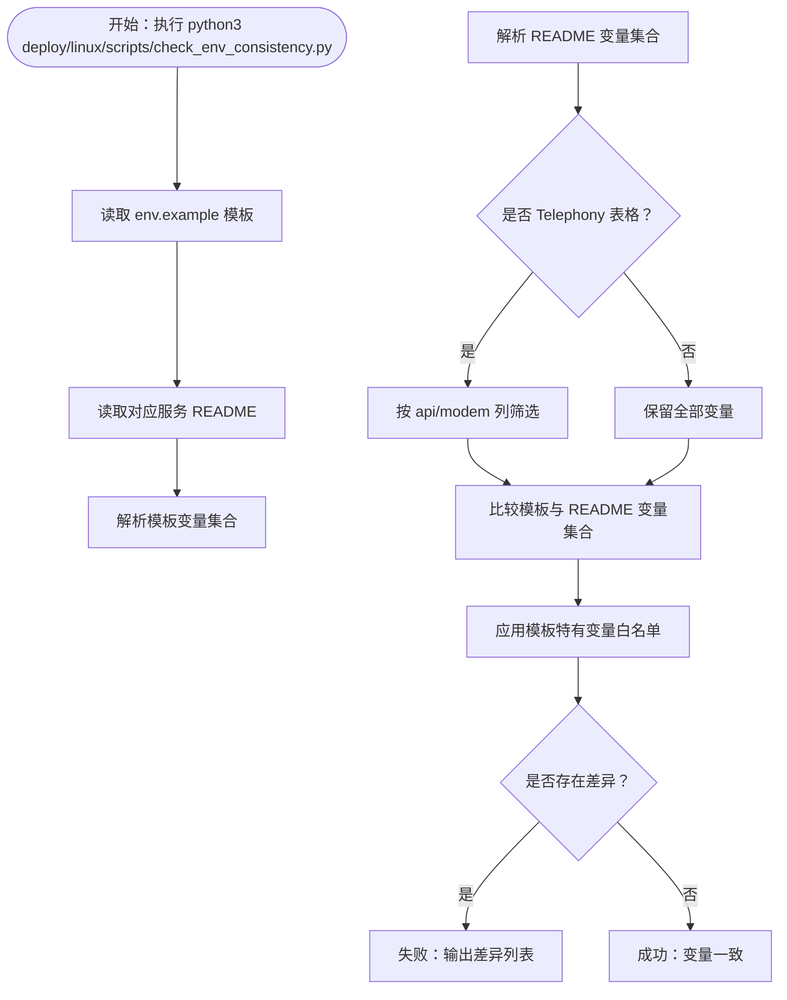
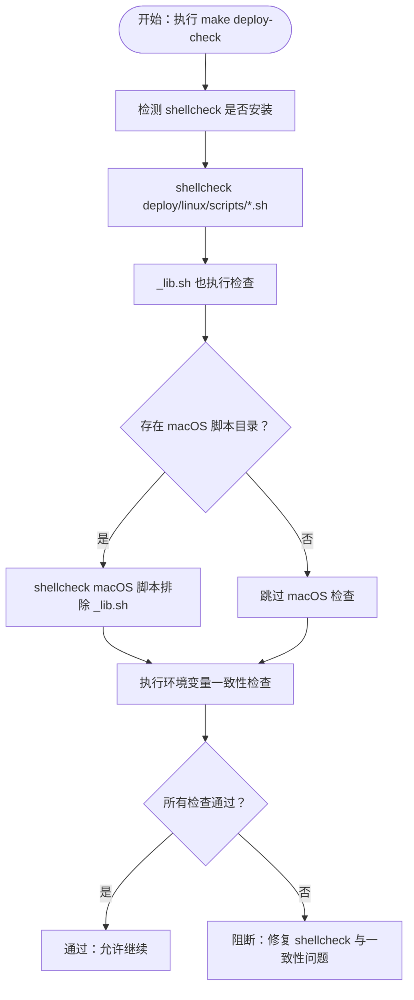
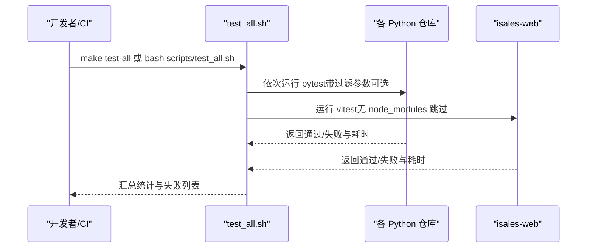
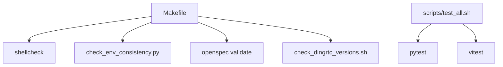

# 代码质量工具

<cite>
**本文引用的文件**
- [README.md](file://README.md)
- [Makefile](file://Makefile)
- [scripts/test_all.sh](file://scripts/test_all.sh)
- [scripts/check_dingrtc_versions.sh](file://scripts/check_dingrtc_versions.sh)
- [deploy/linux/scripts/check_env_consistency.py](file://deploy/linux/scripts/check_env_consistency.py)
- [deploy/README.md](file://deploy/README.md)
- [deploy/cloud/STATE.md](file://deploy/cloud/STATE.md)
- [openspec/changes/engine-rtc-dingrtc-migration/.openspec.yaml](file://openspec/changes/engine-rtc-dingrtc-migration/.openspec.yaml)
- [openspec/changes/arch-cloud-edge-split/.openspec.yaml](file://openspec/changes/arch-cloud-edge-split/.openspec.yaml)
</cite>

## 目录
1. [简介](#简介)
2. [项目结构](#项目结构)
3. [核心组件](#核心组件)
4. [架构总览](#架构总览)
5. [详细组件分析](#详细组件分析)
6. [依赖关系分析](#依赖关系分析)
7. [性能考虑](#性能考虑)
8. [故障排查指南](#故障排查指南)
9. [结论](#结论)
10. [附录](#附录)

## 简介
本指南面向 iSales 项目团队，系统介绍仓库内的代码质量工具与流程，覆盖以下主题：
- 静态检查工具：shellcheck 对 Bash 脚本的语法与安全检查
- 环境变量一致性检查：Python 脚本校验 deploy/env 模板与各服务 README 的“环境变量”列表
- OpenSpec 规范验证：通过 openspec CLI 校验 specs 与 active changes，并结合 DingRTC 版本一致性脚本形成“硬性质量门”
- 代码格式化、linting 与静态分析：基于现有 Makefile 的统一入口与脚本组织方式
- CI/CD 质量门禁与自动化检查：在流水线中串联上述工具，确保变更可被自动拦截
- 代码审查清单与质量标准：以工具结果为依据，形成可执行的评审要点

本指南既适合初学者快速上手，也为资深工程师提供深入的技术细节与最佳实践。

## 项目结构
iSales 采用跨仓（monorepo-like）组织，主仓库包含 OpenSpec 规划、实施计划与跨仓工具脚本；各业务服务分布在独立仓库中。与代码质量相关的关键位置如下：
- 质量门入口与统一命令：根目录 Makefile
- 跨仓测试编排：scripts/test_all.sh
- OpenSpec 规范验证：openspec 目录下的变更与规范
- 环境变量一致性检查：deploy/linux/scripts/check_env_consistency.py
- DingRTC 版本一致性检查：scripts/check_dingrtc_versions.sh
- Bash 脚本静态检查：Makefile 中 shellcheck 调用
- 部署与环境模板：deploy/README.md 与 deploy/cloud/STATE.md

**图示来源**
- [Makefile:1-30](file://Makefile#L1-L30)
- [scripts/test_all.sh:1-145](file://scripts/test_all.sh#L1-L145)
- [deploy/README.md:1-112](file://deploy/README.md#L1-L112)
- [deploy/cloud/STATE.md:1-817](file://deploy/cloud/STATE.md#L1-L817)

**章节来源**
- [README.md:1-86](file://README.md#L1-L86)
- [Makefile:1-30](file://Makefile#L1-L30)
- [deploy/README.md:1-112](file://deploy/README.md#L1-L112)

## 核心组件
本节聚焦三大质量工具链及其职责边界与协作方式。

- Makefile 统一入口
  - 提供 test-all、spec-validate、deploy-check 三大目标，串联各类静态检查与验证流程
  - spec-validate 会调用 openspec validate 并附加 DingRTC 版本一致性检查
  - deploy-check 会校验 shellcheck 是否可用并逐个执行 Bash 脚本检查，随后运行 Python 环境变量一致性检查

- OpenSpec 规范验证
  - 使用 openspec validate 校验 specs 与 active changes 的结构与一致性
  - 与 DingRTC 版本一致性脚本组合，形成“硬性质量门”，任何版本不一致即阻断 CI

- 环境变量一致性检查
  - Python 脚本对比 deploy/env/<service>.env.example 与各服务 README 的“Environment”/“env”段落
  - 支持 Telephony README 的四列表格过滤，允许少量模板特有变量白名单

- DingRTC 版本一致性检查
  - 在多处文档与脚本中提取并比对 DingRTC 三个平台的版本与 sha256，确保三端一致
  - 作为 spec-validate 的一部分，阻止跨端版本漂移进入主干

**章节来源**
- [Makefile:1-30](file://Makefile#L1-L30)
- [scripts/check_dingrtc_versions.sh:1-189](file://scripts/check_dingrtc_versions.sh#L1-L189)
- [deploy/linux/scripts/check_env_consistency.py:1-161](file://deploy/linux/scripts/check_env_consistency.py#L1-L161)

## 架构总览
下图展示质量门在本地与 CI 中的执行路径，以及与各工具的交互关系。

**图示来源**
- [Makefile:1-30](file://Makefile#L1-L30)
- [scripts/check_dingrtc_versions.sh:1-189](file://scripts/check_dingrtc_versions.sh#L1-L189)
- [scripts/test_all.sh:1-145](file://scripts/test_all.sh#L1-L145)

## 详细组件分析

### 组件 A：OpenSpec 规范验证与质量门
- 目标与入口
  - 通过 openspec validate 校验所有 specs 与 active changes，确保结构正确、字段齐全、引用一致
  - 与 DingRTC 版本一致性检查组合，形成“硬性质量门”，任何不一致即阻断 CI
- 关键行为
  - spec-validate 目标：执行 openspec validate --specs 与 --changes，并调用 check_dingrtc_versions.sh
  - DingRTC 检查覆盖：云侧 STATE.md、安装脚本、运行手册、引擎绑定脚本、Telephony 的 pyproject.toml、Windows 与 macOS 边缘的 STATE/RUNBOOK
- 适用场景
  - 代码提交前自检
  - CI/CD 质量门：任何失败即阻断合并
- 最佳实践
  - 在 PR 描述中附上 openspec list/status 输出，便于审阅者快速定位问题
  - 修改 OpenSpec 后优先运行 make spec-validate，避免后续回归

**图示来源**
- [Makefile:8-17](file://Makefile#L8-L17)
- [scripts/check_dingrtc_versions.sh:1-189](file://scripts/check_dingrtc_versions.sh#L1-L189)

**章节来源**
- [Makefile:8-17](file://Makefile#L8-L17)
- [openspec/changes/engine-rtc-dingrtc-migration/.openspec.yaml:1-3](file://openspec/changes/engine-rtc-dingrtc-migration/.openspec.yaml#L1-L3)
- [openspec/changes/arch-cloud-edge-split/.openspec.yaml:1-3](file://openspec/changes/arch-cloud-edge-split/.openspec.yaml#L1-L3)

### 组件 B：环境变量一致性检查
- 目标与入口
  - 对比 deploy/env/<service>.env.example 与各服务 README 的“Environment”/“env”段落，确保变量声明与实际支持一致
  - 支持 Telephony README 的四列表格过滤（api/modem 列）
- 关键行为
  - 读取模板与 README 文本，解析变量名
  - 允许少量模板特有变量白名单（如 TZ、部分调试开关等）
  - 严格匹配：若任一侧缺失必需变量则失败
- 适用场景
  - 新增/修改环境变量模板后自检
  - CI/CD 质量门：阻断模板与文档脱节的变更
- 最佳实践
  - README 的“Environment”段落应与 env.example 保持同步
  - Telephony README 的表格列过滤逻辑仅影响变量集合，不影响跨服务共享变量

**图示来源**
- [deploy/linux/scripts/check_env_consistency.py:59-115](file://deploy/linux/scripts/check_env_consistency.py#L59-L115)
- [deploy/linux/scripts/check_env_consistency.py:118-156](file://deploy/linux/scripts/check_env_consistency.py#L118-L156)

**章节来源**
- [deploy/linux/scripts/check_env_consistency.py:1-161](file://deploy/linux/scripts/check_env_consistency.py#L1-L161)
- [deploy/README.md:87-88](file://deploy/README.md#L87-L88)

### 组件 C：Bash 脚本静态检查（shellcheck）
- 目标与入口
  - 对 deploy/common/_lib.sh 与 deploy/linux/scripts 下的多个脚本进行 shellcheck 检查
  - 条件检查 macOS 脚本目录并对其余脚本执行检查
- 关键行为
  - 通过 Makefile 的 deploy-check 目标统一触发
  - shellcheck -x 以启用扩展模式，提升检查覆盖面
- 适用场景
  - 任何 Bash 脚本变更后的语法与潜在问题检查
  - CI/CD 质量门：阻断 shellcheck 报错
- 最佳实践
  - 在本地执行 make deploy-check，或在 CI 中添加该步骤
  - 避免使用未声明变量、未转义特殊字符、未处理退出码等常见问题

**图示来源**
- [Makefile:19-29](file://Makefile#L19-L29)

**章节来源**
- [Makefile:19-29](file://Makefile#L19-L29)

### 组件 D：跨仓测试与汇总
- 目标与入口
  - 通过 scripts/test_all.sh 顺序运行各服务测试套件（Python 使用 pytest，JS 使用 vitest）
  - 支持传递过滤参数（如 -k modem），便于局部测试
- 关键行为
  - 自动发现兄弟仓库（isales-common、isales-api、isales-telephony、isales-scheduler、isales-worker、isales-engine、isales-web）
  - 对于不存在或缺少依赖的仓库，记录跳过原因
  - 最终输出“通过/失败/跳过”统计与失败仓库列表
- 适用场景
  - 本地全量回归
  - CI/CD 中作为“功能质量门”的补充（与静态检查门并行）

**图示来源**
- [scripts/test_all.sh:18-126](file://scripts/test_all.sh#L18-L126)

**章节来源**
- [scripts/test_all.sh:1-145](file://scripts/test_all.sh#L1-L145)

## 依赖关系分析
- 组件耦合
  - Makefile 是质量门的统一入口，耦合 shellcheck、OpenSpec、环境变量一致性检查与跨仓测试
  - DingRTC 版本一致性脚本与 OpenSpec 验证共同构成“硬性质量门”
  - 环境变量一致性检查依赖 deploy/env 模板与各服务 README 的约定
- 外部依赖
  - shellcheck：用于 Bash 脚本静态检查
  - openspec CLI：用于 OpenSpec 规范校验
  - Python 3：用于环境变量一致性检查脚本
  - Bash：用于 DingRTC 版本一致性脚本与跨仓测试脚本

**图示来源**
- [Makefile:1-30](file://Makefile#L1-L30)
- [scripts/test_all.sh:18-126](file://scripts/test_all.sh#L18-L126)

**章节来源**
- [Makefile:1-30](file://Makefile#L1-L30)
- [scripts/test_all.sh:1-145](file://scripts/test_all.sh#L1-L145)

## 性能考虑
- shellcheck 执行开销
  - Bash 脚本数量有限，shellcheck 通常在秒级完成，对 CI 时间影响较小
- OpenSpec 验证
  - openspec validate 会遍历所有 specs 与 changes，建议在变更较少时运行，或在 CI 中按需触发
- 环境变量一致性检查
  - 读取与解析少量 README 与 env 文件，执行时间短
- 跨仓测试
  - 各服务测试套件可能较长，建议在本地先行过滤参数（如 -k）缩小范围

[本节为通用指导，不直接分析具体文件]

## 故障排查指南
- shellcheck 未安装
  - 现象：deploy-check 目标提示未安装 shellcheck
  - 处理：根据提示安装 shellcheck（例如 brew install shellcheck 或 apt install shellcheck），然后重试
  - 参考：Makefile 中对 shellcheck 的存在性检查与报错信息

- DingRTC 版本不一致
  - 现象：check_dingrtc_versions.sh 报告某源不匹配
  - 处理：以 deploy/cloud/STATE.md 为权威来源，修正其他文档/脚本中的版本与 sha256，或更新脚本顶部的期望值
  - 参考：脚本中的 EXPECTED_VERSION 与 EXPECTED_SHA256_* 常量

- README 与 env.example 变量不一致
  - 现象：环境变量一致性检查输出“仅存在于模板/仅存在于 README”的差异列表
  - 处理：在 README 的“Environment”段落补充缺失变量，或在 env.example 注释掉多余变量并加入白名单
  - 参考：check_env_consistency.py 的解析与比较逻辑

- 跨仓测试失败
  - 现象：test_all.sh 输出失败仓库列表
  - 处理：逐一进入失败仓库，按其要求安装依赖（pip install -e ".[dev]" 或 npm install），修复测试用例后重试

**章节来源**
- [Makefile:23-28](file://Makefile#L23-L28)
- [scripts/check_dingrtc_versions.sh:46-51](file://scripts/check_dingrtc_versions.sh#L46-L51)
- [scripts/check_dingrtc_versions.sh:179-188](file://scripts/check_dingrtc_versions.sh#L179-L188)
- [deploy/linux/scripts/check_env_consistency.py:136-148](file://deploy/linux/scripts/check_env_consistency.py#L136-L148)
- [scripts/test_all.sh:43-56](file://scripts/test_all.sh#L43-L56)
- [scripts/test_all.sh:84-93](file://scripts/test_all.sh#L84-L93)

## 结论
iSales 项目的代码质量体系以 Makefile 为统一入口，结合 shellcheck、OpenSpec 规范验证、环境变量一致性检查与跨仓测试，形成了覆盖静态检查、规范约束与功能回归的多层质量门。配合 DingRTC 版本一致性检查，进一步强化了跨端一致性与可追溯性。建议在本地与 CI 中均启用这些工具，并将失败项纳入代码审查清单，持续提升交付质量与可维护性。

[本节为总结性内容，不直接分析具体文件]

## 附录

### A. 本地使用指南
- 运行 OpenSpec 规范验证与 DingRTC 版本一致性
  - 在根目录执行：make spec-validate
- 运行 Bash 脚本静态检查与环境变量一致性检查
  - 在根目录执行：make deploy-check
- 运行跨仓测试
  - 在根目录执行：make test-all
  - 或：bash scripts/test_all.sh -k <filter>（按需传入过滤参数）

**章节来源**
- [README.md:66-70](file://README.md#L66-L70)
- [Makefile:5-6](file://Makefile#L5-L6)
- [Makefile:14-17](file://Makefile#L14-L17)
- [Makefile:22-29](file://Makefile#L22-L29)

### B. CI/CD 质量门建议
- 推荐流水线步骤
  - 安装依赖：确保安装 shellcheck、openspec CLI、Python 3、Node.js（如需）
  - 执行：make spec-validate
  - 执行：make deploy-check
  - 执行：make test-all
- 失败处理
  - 任一步骤失败即阻断合并，要求修复后再提交
  - 在 PR 描述中附上失败详情与修复方案

**章节来源**
- [Makefile:1-30](file://Makefile#L1-L30)
- [README.md:46-56](file://README.md#L46-L56)

### C. 代码审查清单（基于工具结果）
- OpenSpec
  - 所有 specs 与 changes 通过 openspec validate
  - DingRTC 版本与 sha256 在所有相关文档/脚本中一致
- 环境变量
  - env.example 与各服务 README 的“Environment”段落变量一致
  - Telephony README 表格列过滤逻辑正确
- Bash 脚本
  - shellcheck 无报错
  - 无未声明变量、未转义特殊字符、未处理退出码等问题
- 跨仓测试
  - 通过所有服务测试套件（或明确标注跳过的仓库）
  - 失败仓库已在本次 PR 中修复

**章节来源**
- [Makefile:8-17](file://Makefile#L8-L17)
- [scripts/check_dingrtc_versions.sh:173-188](file://scripts/check_dingrtc_versions.sh#L173-L188)
- [deploy/linux/scripts/check_env_consistency.py:136-156](file://deploy/linux/scripts/check_env_consistency.py#L136-L156)
- [scripts/test_all.sh:134-144](file://scripts/test_all.sh#L134-L144)