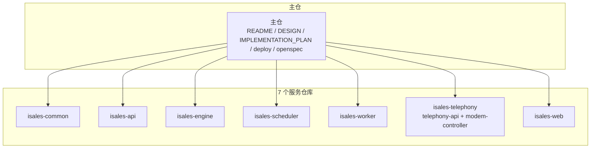
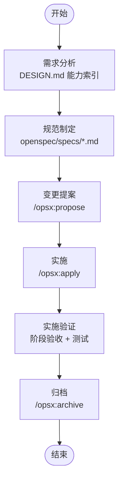

# 开发工作流程

<cite>
**本文档引用的文件**
- [README.md](file://README.md)
- [DESIGN.md](file://DESIGN.md)
- [IMPLEMENTATION_PLAN.md](file://IMPLEMENTATION_PLAN.md)
- [deploy/README.md](file://deploy/README.md)
- [openspec/specs/architecture/spec.md](file://openspec/specs/architecture/spec.md)
- [openspec/specs/deployment-topology/spec.md](file://openspec/specs/deployment-topology/spec.md)
- [openspec/v1-roadmap.md](file://openspec/v1-roadmap.md)
</cite>

## 目录
1. [简介](#简介)
2. [项目结构](#项目结构)
3. [核心组件](#核心组件)
4. [架构总览](#架构总览)
5. [详细组件分析](#详细组件分析)
6. [依赖分析](#依赖分析)
7. [性能考虑](#性能考虑)
8. [故障排查指南](#故障排查指南)
9. [结论](#结论)
10. [附录](#附录)

## 简介
本指南面向 iSales 项目的开发团队，系统化阐述“OpenSpec 规范驱动”的开发工作流程，覆盖需求分析、规范制定、变更提案、实施与验证的完整闭环；同时给出版本控制策略、分支管理模型、跨仓库协作与代码同步机制，以及功能开发、评审与发布的标准流程，并结合敏捷实践与迭代计划方法，帮助团队高效协同。

## 项目结构
iSales 采用“主仓 + 多子仓”的组织方式：主仓集中 OpenSpec 规范、变更提案与跨仓工具脚本，核心代码分布在 7 个独立仓库中，通过 isales-common 共享库形成稳定的依赖边界。主仓还提供生产部署与运维手册，支撑 Linux 与 macOS 两种单主机部署模型。



图表来源
- [openspec/specs/architecture/spec.md:1-168](file://openspec/specs/architecture/spec.md#L1-L168)
- [README.md:1-86](file://README.md#L1-L86)

章节来源
- [README.md:1-86](file://README.md#L1-L86)
- [openspec/specs/architecture/spec.md:1-168](file://openspec/specs/architecture/spec.md#L1-L168)

## 核心组件
- OpenSpec 规范与变更提案：以能力域（capability）为单位的多文件规范结构，变更通过 proposal → apply → archive 的生命周期管理，确保可追溯与审计。
- 实施计划：自下而上的分阶段交付策略，先共享库 → 再周边服务 → 最后实时引擎，每个仓库独立 git 历史。
- 部署与运维：Linux systemd 与 macOS launchd 的单主机部署模型，配套 provision/install/migrate/deploy/rollback/backup 脚本与 RUNBOOK。
- 跨仓库协作：isales-common 作为共享库被其他 6 个服务依赖；服务间通信通过 Redis 队列/Pub/Sub 与 HTTP/WebSocket；JWT 鉴权由 isales-api 统一签发。

章节来源
- [DESIGN.md:1-75](file://DESIGN.md#L1-L75)
- [IMPLEMENTATION_PLAN.md:1-389](file://IMPLEMENTATION_PLAN.md#L1-L389)
- [deploy/README.md:1-112](file://deploy/README.md#L1-L112)

## 架构总览
下图展示了 v1 单主机部署的总体架构：7 个服务进程通过 systemd 管理，PostgreSQL 与 Redis 作为系统服务，nginx 反向代理 isales-web 静态资源与 API/WebSocket。isales-common 作为共享库被 6 个服务依赖。

```mermaid
graph TB
subgraph "单主机"
NGINX["nginx<br/>SPA + 反代"]
PG["PostgreSQL 15"]
REDIS["Redis 7"]
JOURNALD["journald 日志"]
end
subgraph "服务进程"
API["isales-api<br/>FastAPI + WebSocket"]
ENGINE["isales-engine<br/>实时通话引擎"]
SCHED["isales-scheduler<br/>线索调度"]
WORKER["isales-worker<br/>异步后处理"]
TEL_API["isales-telephony-api<br/>HTTP"]
MODEM["isales-modem-controller<br/>守护进程"]
end
WEB["isales-web<br/>Vue 3 SPA"]
WEB --> NGINX
NGINX --> API
API --> SCHED
SCHED --> ENGINE
ENGINE --> WORKER
ENGINE < --> MODEM
API -.-> PG
SCHED -.-> PG
WORKER -.-> PG
ENGINE -.-> REDIS
SCHED -.-> REDIS
API -.-> REDIS
MODEM -.-> PG
MODEM -.-> REDIS
WEB -.-> JOURNALD
```

图表来源
- [openspec/specs/architecture/spec.md:130-168](file://openspec/specs/architecture/spec.md#L130-L168)
- [openspec/specs/deployment-topology/spec.md:1-414](file://openspec/specs/deployment-topology/spec.md#L1-L414)
- [deploy/README.md:1-112](file://deploy/README.md#L1-L112)

## 详细组件分析

### OpenSpec 规范驱动的开发流程
- 需求分析：从 DESIGN.md 的能力索引出发，识别业务行为、输入输出、调度与生命周期、基础设施等领域的规范入口，明确需求边界与依赖关系。
- 规范制定：在 openspec/specs 下为每个 capability 维护独立 spec.md，确保设计可验证、可测试、可追溯。
- 变更提案：通过 /opsx:propose 创建变更提案，明确问题陈述、方案纲要、触及的能力域与前置依赖；变更通过 /opsx:apply 实施，最后 /opsx:archive 归档并触发规范同步。
- 实施验证：结合 IMPLEMENTATION_PLAN.md 的阶段顺序与验收清单，逐阶段交付并在每个仓库内进行单元/集成测试与端到端联调。



图表来源
- [DESIGN.md:49-55](file://DESIGN.md#L49-L55)
- [README.md:75-86](file://README.md#L75-L86)

章节来源
- [DESIGN.md:1-75](file://DESIGN.md#L1-L75)
- [README.md:75-86](file://README.md#L75-L86)

### 版本控制策略与分支管理模型
- 仓库策略：7 个服务仓库独立维护，isales-common 作为共享库通过内部分发（pip/git）被其他仓库依赖，避免 monorepo 带来的边界模糊与迭代效率问题。
- 分支模型：主分支为 main，发布通过标签（release tag）标识；每个仓库独立演进，跨仓库变更通过 OpenSpec change proposal 协调，避免主分支并行变更导致的规范冲突。
- 同步机制：通过 OpenSpec change 的 apply/archive 生命周期，确保各仓库的规范与实现同步；部署脚本与环境变量模板在主仓统一校验（make deploy-check）。

章节来源
- [openspec/specs/architecture/spec.md:1-168](file://openspec/specs/architecture/spec.md#L1-L168)
- [README.md:66-86](file://README.md#L66-L86)

### 跨仓库协作与代码同步
- 依赖边界：isales-common 仅承载跨服务共享的稳定接口与模型，避免过早抽取导致的跨仓库紧耦合。
- 服务间通信：通过 Redis 队列/Pub/Sub 与 HTTP/WebSocket 实现，内部 HTTP 服务统一 JWT 鉴权由 isales-api 签发，telephony-api 仅验证。
- 同步保障：OpenSpec change 的 apply/archive 保证规范与实现同步；部署脚本幂等与可回滚，确保跨仓库变更的原子发布与回溯。

章节来源
- [openspec/specs/architecture/spec.md:96-129](file://openspec/specs/architecture/spec.md#L96-L129)
- [openspec/specs/deployment-topology/spec.md:114-132](file://openspec/specs/deployment-topology/spec.md#L114-L132)

### 功能开发标准流程
- 需求 → 规范 → 提案 → 实施 → 验收 → 归档，贯穿每个仓库的 PR 开发节奏；每个仓库内的 PR 拆分尽量小，便于快速反馈与评审。
- 代码质量：统一使用 make spec-validate 与 make deploy-check 校验 OpenSpec 制品与部署一致性；测试覆盖包括单元测试、mypy/ruff 校验与端到端脚本。
- 配置与环境：集中化环境变量契约，各服务通过 systemd EnvironmentFile 注入，避免敏感信息进入代码库。

章节来源
- [README.md:66-86](file://README.md#L66-L86)
- [openspec/specs/deployment-topology/spec.md:40-61](file://openspec/specs/deployment-topology/spec.md#L40-L61)

### 代码评审流程
- OpenSpec 变更：变更提案需明确影响范围与前置依赖，评审通过后方可 /opsx:apply；归档前进行规范同步与一致性校验。
- 代码变更：每个仓库内的 PR 应包含单元测试、mypy/ruff 校验与简要变更说明；跨仓库变更需在变更提案中明确协调路径。

章节来源
- [DESIGN.md:49-55](file://DESIGN.md#L49-L55)
- [README.md:66-86](file://README.md#L66-L86)

### 发布流程
- Linux 主线：provision → edit env → install → migrate → deploy；支持 rollback.sh 切回历史版本，DB 回滚需手工执行 RUNBOOK 中的 schema 回滚步骤。
- macOS 备选：提供平行的 provision/install/migrate/deploy/rollback/backup 脚本与 launchd 配置。
- 可观测性：Prometheus/Grafana 配置模板与最小告警集，结合 RUNBOOK 的故障排查与上线前 hard-gate。

章节来源
- [deploy/README.md:61-112](file://deploy/README.md#L61-L112)

### 敏捷实践、迭代计划与里程碑管理
- 分阶段交付：自下而上策略，先共享库（isales-common）→ 再周边服务（telephony/api）→ 调度与后处理（scheduler/worker）→ 引擎骨架与真实 Provider → 真实硬件与端到端联调 → 管理后台 → 灰度与优化。
- 阶段验收：每个阶段提供明确的产出清单与验收标准，结合 IMPLEMENTATION_PLAN.md 的 PR 拆分建议，确保每个 PR 小而可交付。
- 里程碑：v1 完成标准包括并发稳定性、端到端对话质量、管理后台可用性与数据完整性等关键指标。

章节来源
- [IMPLEMENTATION_PLAN.md:1-389](file://IMPLEMENTATION_PLAN.md#L1-L389)

### 开发团队协作工具与沟通机制
- OpenSpec 工具链：/opsx:propose / /opsx:apply / /opsx:archive 作为变更生命周期的统一入口。
- 文档与手册：DESIGN.md 作为设计索引，IMPLEMENTATION_PLAN.md 作为实施蓝图，README.md 提供快速入门与常用命令，deploy/RUNBOOK.md 提供运维操作手册。
- 质量门禁：make spec-validate 与 make deploy-check 作为开发与部署前的质量门禁，确保规范与部署一致性。

章节来源
- [DESIGN.md:49-55](file://DESIGN.md#L49-L55)
- [README.md:66-86](file://README.md#L66-L86)

## 依赖分析
- 7 仓库职责边界清晰，isales-common 作为共享库被 6 个服务依赖，避免重复与紧耦合。
- 服务间通信通过 Redis 与 HTTP/WebSocket，内部鉴权统一由 isales-api 管理。
- 部署脚本与环境变量模板在主仓统一校验，确保跨仓库一致性。

```mermaid
graph LR
COMMON["isales-common"] --> API
COMMON --> ENGINE
COMMON --> SCHED
COMMON --> WORKER
COMMON --> TELE
COMMON --> WEB
API --> SCHED
SCHED --> ENGINE
ENGINE --> WORKER
ENGINE < --> TELE
```

图表来源
- [openspec/specs/architecture/spec.md:26-47](file://openspec/specs/architecture/spec.md#L26-L47)

章节来源
- [openspec/specs/architecture/spec.md:1-168](file://openspec/specs/architecture/spec.md#L1-L168)

## 性能考虑
- 延迟预算：v1 保留本地音频回环延迟（p95 ≤ 200 ms）；云-边拆分后新增“云-边音频单程”“用户说完到 AI 首音节出声”“端到端 barge-in 切断响应”三条指标，指导流式 ASR/LLM/TTS 的工程实现。
- 并发与资源：Redis 全局并发计数器与队列深度监控，Prometheus 告警覆盖队列堆积、设备异常与回调失败等关键指标。
- 硬件与音频：modem-controller 与 audio_pipe 的平台抽象（macOS/Core Audio、Windows/WASAPI、阿里 RTC）确保在不同平台上获得一致的性能基线。

章节来源
- [openspec/v1-roadmap.md:26-44](file://openspec/v1-roadmap.md#L26-L44)
- [openspec/specs/deployment-topology/spec.md:95-113](file://openspec/specs/deployment-topology/spec.md#L95-L113)

## 故障排查指南
- 首次上线：参考 deploy/RUNBOOK.md 的“首次部署”章节，按 provision → edit env → install → migrate → deploy 步骤执行。
- 日常发版：遵循“install → migrate → deploy”的原子发布流程，出现问题使用 rollback.sh 回滚至上一版本。
- 备份恢复：每日备份策略与恢复演练步骤在 RUNBOOK 中明确，确保 alembic 版本与数据一致性。
- 故障排查：利用 RUNBOOK 的“故障速查”与监控告警（Prometheus/Grafana），定位服务状态、队列深度与设备健康等关键指标。

章节来源
- [deploy/README.md:61-112](file://deploy/README.md#L61-L112)

## 结论
iSales 采用 OpenSpec 规范驱动的开发模式，将需求、设计、变更与实施统一到规范生命周期中，配合严格的版本控制与跨仓库协作机制，确保多仓库并行开发的一致性与可追溯性。结合分阶段交付与敏捷实践，团队可以在可控节奏下持续交付高质量功能，并通过完善的运维手册与监控体系保障生产稳定。

## 附录
- 常用命令与入口
  - OpenSpec：/opsx:propose / /opsx:apply / /opsx:archive
  - 质量门禁：make spec-validate / make deploy-check
  - 跨仓测试：make test-all
  - 部署：provision → edit env → install → migrate → deploy；回滚：rollback.sh

章节来源
- [README.md:66-86](file://README.md#L66-L86)