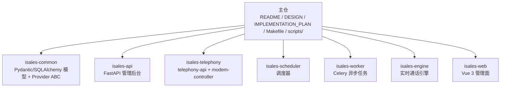
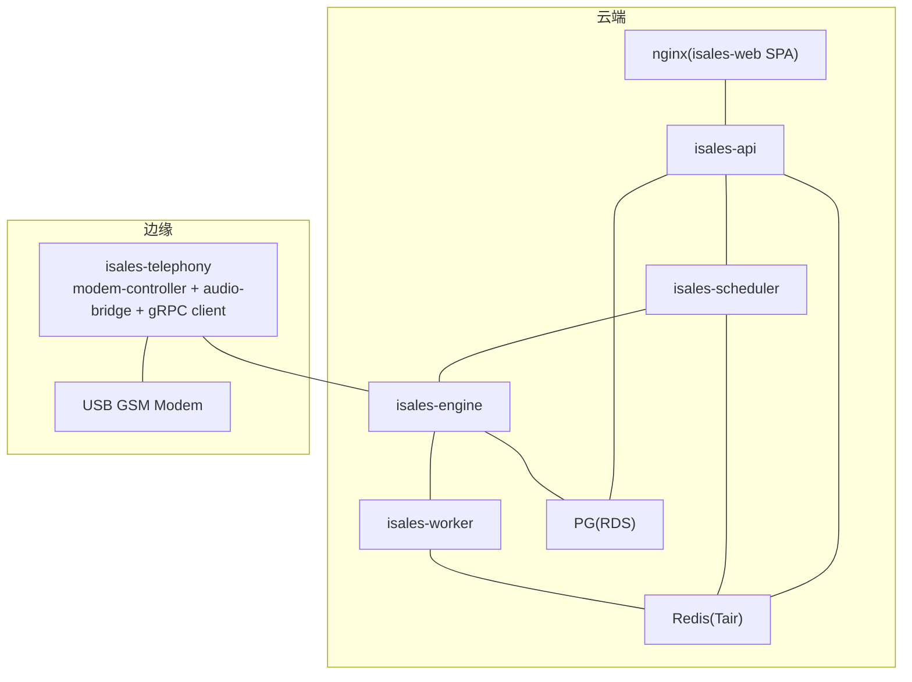
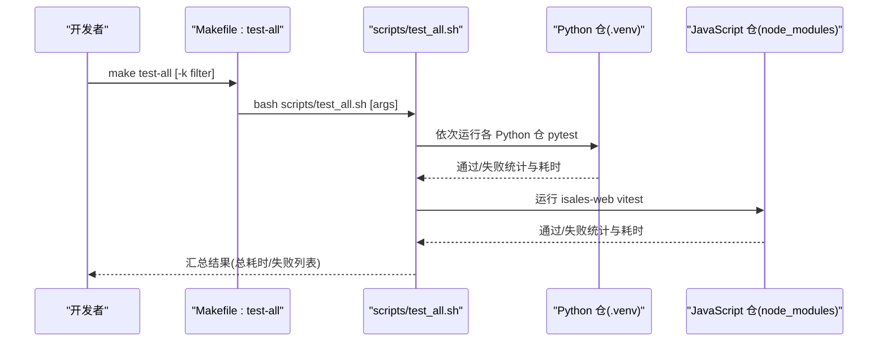
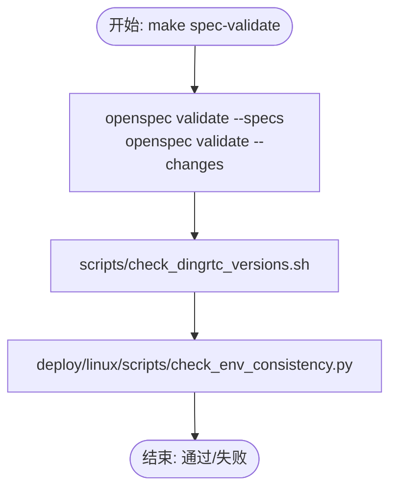
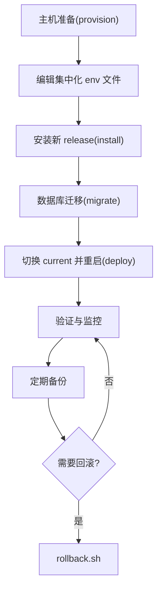
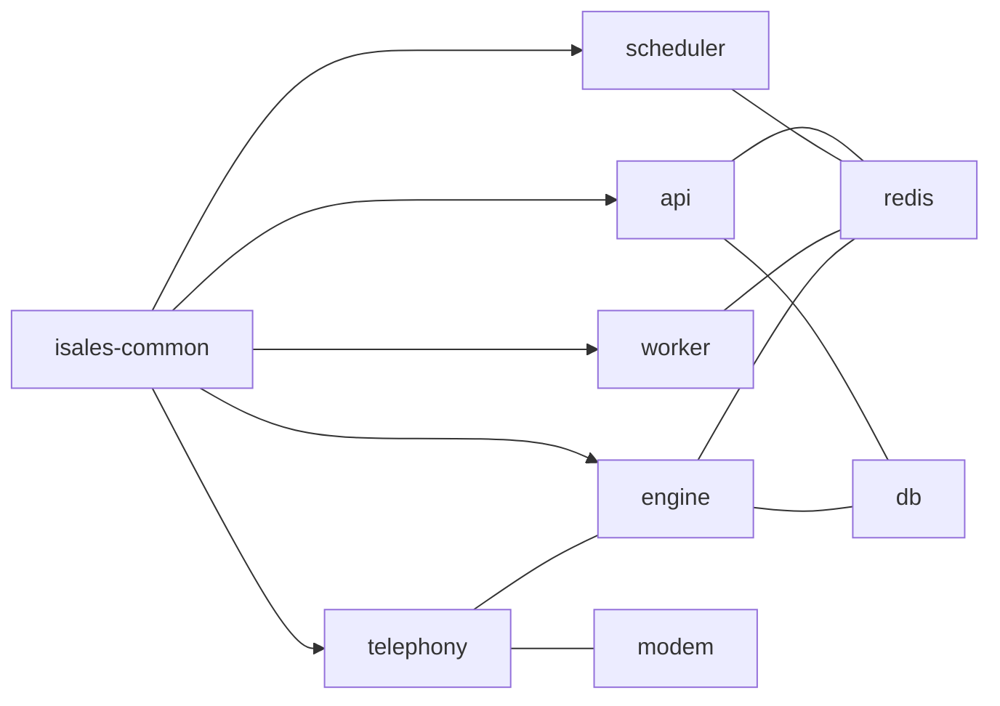

# 开发指南

<cite>
**本文引用的文件**
- [README.md](file://README.md)
- [DESIGN.md](file://DESIGN.md)
- [IMPLEMENTATION_PLAN.md](file://IMPLEMENTATION_PLAN.md)
- [Makefile](file://Makefile)
- [scripts/test_all.sh](file://scripts/test_all.sh)
- [scripts/check_dingrtc_versions.sh](file://scripts/check_dingrtc_versions.sh)
- [deploy/README.md](file://deploy/README.md)
- [deploy/RUNBOOK.md](file://deploy/RUNBOOK.md)
- [deploy/linux/scripts/check_env_consistency.py](file://deploy/linux/scripts/check_env_consistency.py)
- [openspec/specs/architecture/spec.md](file://openspec/specs/architecture/spec.md)
- [openspec/specs/deployment-topology/spec.md](file://openspec/specs/deployment-topology/spec.md)
- [openspec/changes/arch-cloud-edge-split/specs/architecture/spec.md](file://openspec/changes/arch-cloud-edge-split/specs/architecture/spec.md)
- [deploy/cloud/STATE.md](file://deploy/cloud/STATE.md)
- [deploy/.gitignore](file://deploy/.gitignore)
- [CLAUDE.md](file://CLAUDE.md)
</cite>

## 目录
1. [简介](#简介)
2. [项目结构](#项目结构)
3. [核心组件](#核心组件)
4. [架构总览](#架构总览)
5. [详细组件分析](#详细组件分析)
6. [依赖分析](#依赖分析)
7. [性能考虑](#性能考虑)
8. [故障排查指南](#故障排查指南)
9. [结论](#结论)
10. [附录](#附录)

## 简介
本指南面向 iSales 项目的开发者，提供从环境搭建、代码规范、测试策略到调试技巧的全流程说明。重点涵盖：
- 跨仓测试一键执行与结果分析
- OpenSpec 规范与变更流程
- 部署与运维（Linux systemd 与 macOS launchd）
- 版本控制、分支管理与发布流程
- 性能调试、内存分析与日志分析方法
- 新开发者快速上手与最佳实践

## 项目结构
iSales 采用“主仓 + 多子仓”的组织方式：主仓包含 OpenSpec 规范、实施计划与跨仓工具脚本，核心代码分布在 7 个兄弟仓中，彼此通过 isales-common 共享库耦合。

图表来源
- [README.md:3-14](file://README.md#L3-L14)
- [openspec/specs/architecture/spec.md:9-19](file://openspec/specs/architecture/spec.md#L9-L19)

章节来源
- [README.md:3-14](file://README.md#L3-L14)
- [DESIGN.md:9-47](file://DESIGN.md#L9-L47)

## 核心组件
- 测试与质量保障
  - 跨仓测试一键执行：通过 Makefile 的 test-all 目标与脚本 scripts/test_all.sh 顺序运行各仓测试，并汇总结果。
  - OpenSpec 规范校验：通过 Makefile 的 spec-validate 目标，结合 scripts/check_dingrtc_versions.sh 校验跨端 SDK 版本一致性。
  - 部署脚本与环境变量一致性校验：通过 Makefile 的 deploy-check 目标，使用 shellcheck 与 Python 脚本校验环境模板与各服务 README 的变量声明一致性。
- 部署与运维
  - Linux systemd 与 macOS launchd 两种单主机部署模型，统一目录骨架与环境变量契约。
  - 运维手册（RUNBOOK）覆盖首次部署、日常发版、回滚、备份恢复、故障排查与上线前硬性门禁。
- 规范与变更
  - OpenSpec 工作流：所有行为规范变更必须通过 change proposal 流程，禁止直接编辑规范文件。
  - 架构与部署拓扑：v1 限定单主机部署，7 个服务进程通过 systemd/launchd 管理，PG/Redis 作为系统服务，nginx 反代前端。

章节来源
- [README.md:46-86](file://README.md#L46-L86)
- [Makefile:1-30](file://Makefile#L1-L30)
- [scripts/test_all.sh:1-145](file://scripts/test_all.sh#L1-L145)
- [scripts/check_dingrtc_versions.sh:1-189](file://scripts/check_dingrtc_versions.sh#L1-L189)
- [deploy/README.md:1-112](file://deploy/README.md#L1-L112)
- [deploy/RUNBOOK.md:1-394](file://deploy/RUNBOOK.md#L1-L394)
- [deploy/linux/scripts/check_env_consistency.py:1-161](file://deploy/linux/scripts/check_env_consistency.py#L1-L161)
- [openspec/specs/architecture/spec.md:1-168](file://openspec/specs/architecture/spec.md#L1-L168)
- [openspec/specs/deployment-topology/spec.md:1-414](file://openspec/specs/deployment-topology/spec.md#L1-L414)

## 架构总览
iSales v1 采用“云-边分离”部署架构：云端运行 API、引擎、调度、工作器与前端反代；边缘侧运行 isales-telephony（modem-controller + audio-bridge + cloud-edge gRPC client），通过 gRPC 控制面与云端交互。数据库与缓存采用托管服务，统一通过 isales-common 的 ORM/Schema 访问。

图表来源
- [openspec/changes/arch-cloud-edge-split/specs/architecture/spec.md:1-143](file://openspec/changes/arch-cloud-edge-split/specs/architecture/spec.md#L1-L143)
- [openspec/specs/deployment-topology/spec.md:1-414](file://openspec/specs/deployment-topology/spec.md#L1-L414)

章节来源
- [openspec/changes/arch-cloud-edge-split/specs/architecture/spec.md:1-143](file://openspec/changes/arch-cloud-edge-split/specs/architecture/spec.md#L1-L143)
- [openspec/specs/deployment-topology/spec.md:1-414](file://openspec/specs/deployment-topology/spec.md#L1-L414)

## 详细组件分析

### 跨仓测试一键执行流程
- 触发方式
  - 通过 Makefile 的 test-all 目标，或直接执行 scripts/test_all.sh。
  - 可传递 pytest 过滤参数（如 -k modem）到各仓测试。
- 执行逻辑
  - Python 仓：按顺序遍历 isales-common、isales-api、isales-telephony、isales-scheduler、isales-worker、isales-engine；若 .venv 缺失则跳过；成功输出末行统计与耗时，失败输出完整日志并计入失败列表。
  - JavaScript 仓：遍历 isales-web；若 node_modules 缺失则跳过；使用 npx vitest run 执行测试。
- 结果汇总
  - 输出每仓通过/失败/跳过统计与总耗时；任一失败即整体非零退出。
- 使用建议
  - 在各子仓先执行开发模式安装（pip install -e ".[dev]"）与 npm install，确保测试可运行。
  - 使用 PYTEST_ARGS 传递过滤参数，快速聚焦问题。

图表来源
- [Makefile:5-6](file://Makefile#L5-L6)
- [scripts/test_all.sh:18-29](file://scripts/test_all.sh#L18-L29)
- [scripts/test_all.sh:39-79](file://scripts/test_all.sh#L39-L79)
- [scripts/test_all.sh:81-118](file://scripts/test_all.sh#L81-L118)

章节来源
- [README.md:46-56](file://README.md#L46-L56)
- [Makefile:5-6](file://Makefile#L5-L6)
- [scripts/test_all.sh:1-145](file://scripts/test_all.sh#L1-L145)
- [CLAUDE.md:32-41](file://CLAUDE.md#L32-L41)

### OpenSpec 规范校验与 DingRTC 版本一致性
- 规范校验
  - Makefile 的 spec-validate 目标：运行 openspec validate 校验规范与变更；随后执行 scripts/check_dingrtc_versions.sh 校验跨端 SDK 版本一致性。
- DingRTC 版本一致性检查
  - 校验来源包括：deploy/cloud/STATE.md、install-dingrtc-sdk.sh、RUNBOOK-cloud.md、isales-engine 的构建脚本、isales-telephony 的 pyproject.toml、Windows 与 macOS 的 STATE/RUNBOOK。
  - 若任一来源不一致，脚本输出 FAIL 并提示修正；一致则 PASS。
- 环境变量一致性校验
  - deploy-check 目标：shellcheck 校验 deploy 脚本；check_env_consistency.py 校验 deploy/env/*.env.example 与各服务 README 的环境变量声明是否一致。

图表来源
- [Makefile:14-17](file://Makefile#L14-L17)
- [scripts/check_dingrtc_versions.sh:1-189](file://scripts/check_dingrtc_versions.sh#L1-L189)
- [deploy/linux/scripts/check_env_consistency.py:1-161](file://deploy/linux/scripts/check_env_consistency.py#L1-L161)

章节来源
- [README.md:66-74](file://README.md#L66-L74)
- [Makefile:14-29](file://Makefile#L14-L29)
- [scripts/check_dingrtc_versions.sh:1-189](file://scripts/check_dingrtc_versions.sh#L1-L189)
- [deploy/linux/scripts/check_env_consistency.py:1-161](file://deploy/linux/scripts/check_env_consistency.py#L1-L161)

### 部署与运维（Linux systemd 与 macOS launchd）
- 部署模型
  - Linux：systemd 管理 6 个服务进程 + nginx；统一目录骨架 /opt/isales 与集中化环境文件 /etc/isales/env。
  - macOS：launchd 管理 6 个服务进程 + nginx；目录骨架与环境文件一致，差异在于包管理器与硬件后端。
- 主机依赖与快速开始
  - Linux：Ubuntu 22.04 LTS、Python 3.12、Node.js >= 20、系统包 libudev-dev、libasound2-dev 等；提供 provision/install/migrate/deploy/rollback/backup 等脚本。
  - macOS：Homebrew、_isales 用户、目录与 Redis AOF；提供等效脚本与 plist 模板。
- 运维手册（RUNBOOK）
  - 首次部署、日常发版、回滚、备份恢复、故障排查、上线前硬性门禁。
  - 提供常见症状的快速定位与修复步骤，以及实用的一行命令。

图表来源
- [deploy/README.md:63-81](file://deploy/README.md#L63-L81)
- [deploy/RUNBOOK.md:17-81](file://deploy/RUNBOOK.md#L17-L81)

章节来源
- [deploy/README.md:1-112](file://deploy/README.md#L1-L112)
- [deploy/RUNBOOK.md:1-394](file://deploy/RUNBOOK.md#L1-L394)

### 版本控制、分支管理与发布流程
- OpenSpec 变更流程
  - 所有行为规范变更必须通过 change proposal 流程：/opsx:propose → /opsx:apply → /opsx:archive。
  - 直接编辑 openspec/specs/*.md 已不推荐；变更的最终依据为归档的 change。
- 发布与回滚
  - 发布：install → migrate → deploy；deploy 顺序受依赖约束，engine 重启需在低峰期。
  - 回滚：rollback.sh 切换软链并重启服务；数据库 schema 回滚需手工执行 RUNBOOK 中的步骤。
- 环境变量与密钥
  - 真实密钥仅允许存在于目标主机的 /etc/isales/env/，仓库中仅保留 .env.example；.gitignore 已限制 env/*.env 提交。

章节来源
- [CLAUDE.md:42-54](file://CLAUDE.md#L42-L54)
- [deploy/RUNBOOK.md:84-115](file://deploy/RUNBOOK.md#L84-L115)
- [deploy/.gitignore:1-4](file://deploy/.gitignore#L1-L4)

## 依赖分析
- 仓库依赖
  - isales-common 为共享库，被其余 6 个服务依赖；所有数据访问通过 isales-common 的 SQLAlchemy 模型与 Alembic 迁移。
- 服务间通信
  - Redis：队列（scheduler→engine、engine→worker、api→scheduler）、Pub/Sub（api↔engine 实时事件）、全局并发计数器。
  - HTTP：isales-api 与边缘 telephony-api 共享 JWT 鉴权；nginx 反代前端 SPA 与 /api、/ws。
- 云-边通信
  - gRPC 控制面：边缘通过 cloud-edge gRPC 与云端交互；边缘不直接访问云端数据库/缓存。

图表来源
- [openspec/specs/architecture/spec.md:30-43](file://openspec/specs/architecture/spec.md#L30-L43)
- [openspec/specs/deployment-topology/spec.md:40-61](file://openspec/specs/deployment-topology/spec.md#L40-L61)

章节来源
- [openspec/specs/architecture/spec.md:1-168](file://openspec/specs/architecture/spec.md#L1-L168)
- [openspec/specs/deployment-topology/spec.md:1-414](file://openspec/specs/deployment-topology/spec.md#L1-L414)

## 性能考虑
- 延迟与吞吐
  - 单引擎实例支持 50 路并发 8 小时不崩溃；端到端从导入线索到完成至少 80% 的通话达到 3 轮以上对话。
- 音频与硬件
  - ALSA 缓冲与重采样调优；macOS 端到端 P95 延迟 ≤ 200 ms。
- 资源与容量
  - Redis 全局并发计数器与 TTL；engine 启动时清理孤儿计数；队列深度阈值告警。
- 监控与告警
  - Prometheus 指标暴露契约；Grafana 仪表盘；最小告警集覆盖队列深度、设备异常比例、回调失败率、PG 连接数。

章节来源
- [IMPLEMENTATION_PLAN.md:284-294](file://IMPLEMENTATION_PLAN.md#L284-L294)
- [deploy/RUNBOOK.md:163-196](file://deploy/RUNBOOK.md#L163-L196)
- [openspec/specs/deployment-topology/spec.md:95-113](file://openspec/specs/deployment-topology/spec.md#L95-L113)

## 故障排查指南
- 常见症状与步骤
  - 数据库连接失败：检查 postgresql 服务状态与磁盘空间。
  - Redis OOM：检查内存使用与 maxmemory 策略。
  - modem-controller 设备断开：检查 udev 事件与串口占用。
  - engine:dial 队列堆积：检查 engine 服务状态与 active calls。
  - nginx 502：直连 /api/healthz 排查 api 服务。
  - JWT/密钥不一致：核对 /etc/isales/env/* 中的共享密钥。
- 实用命令
  - 一键查看服务状态与错误日志。
  - 查看活跃通话数与队列深度。
  - 备份与恢复演练步骤与验证标准。

章节来源
- [deploy/RUNBOOK.md:163-196](file://deploy/RUNBOOK.md#L163-L196)
- [deploy/RUNBOOK.md:180-196](file://deploy/RUNBOOK.md#L180-L196)

## 结论
本指南提供了 iSales 从开发到运维的完整方法论：以 OpenSpec 为纲，以跨仓测试与规范校验为序，以 Linux/macOS 双模型部署为基，辅以完善的监控与故障排查流程。建议新开发者先完成环境准备与跨仓测试，再深入理解架构与规范，最后结合 RUNBOOK 进行发布与运维实践。

## 附录

### 快速上手清单
- 环境准备
  - 安装 Python 3.12、Node.js >= 20、系统包 libudev-dev、libasound2-dev。
  - Linux：sudo bash deploy/linux/scripts/provision.sh；macOS：sudo bash deploy/macos/scripts/provision.sh。
- 首次部署
  - 编辑 /etc/isales/env/*.env；install → migrate → deploy；验证 healthz 与 SPA。
- 跨仓测试
  - make test-all 或 bash scripts/test_all.sh；使用 -k 过滤快速定位问题。
- OpenSpec 变更
  - /opsx:propose → /opsx:apply → /opsx:archive；禁止直接编辑规范文件。

章节来源
- [deploy/README.md:51-81](file://deploy/README.md#L51-L81)
- [README.md:46-56](file://README.md#L46-L56)
- [CLAUDE.md:42-54](file://CLAUDE.md#L42-L54)