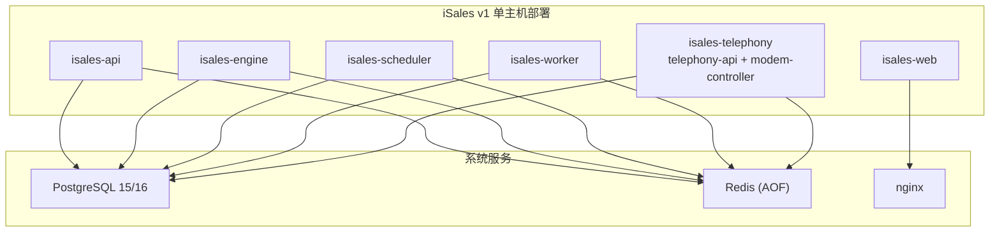
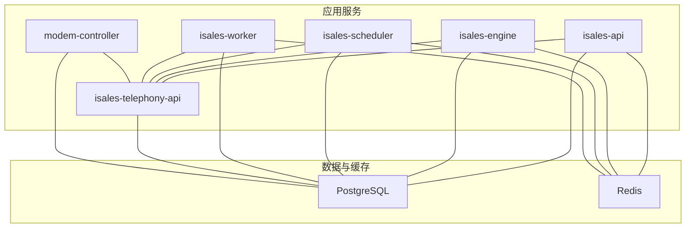
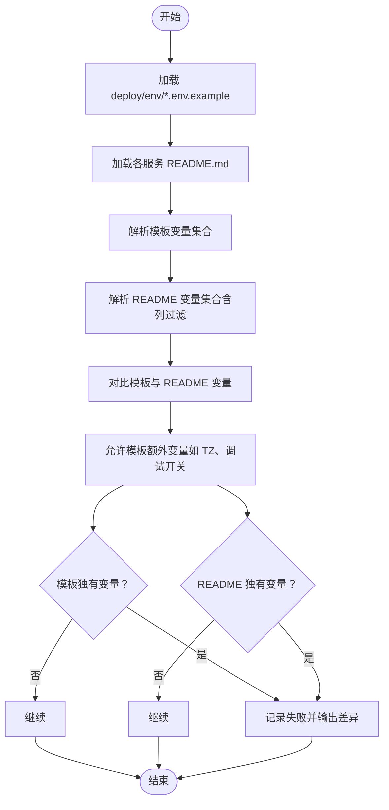
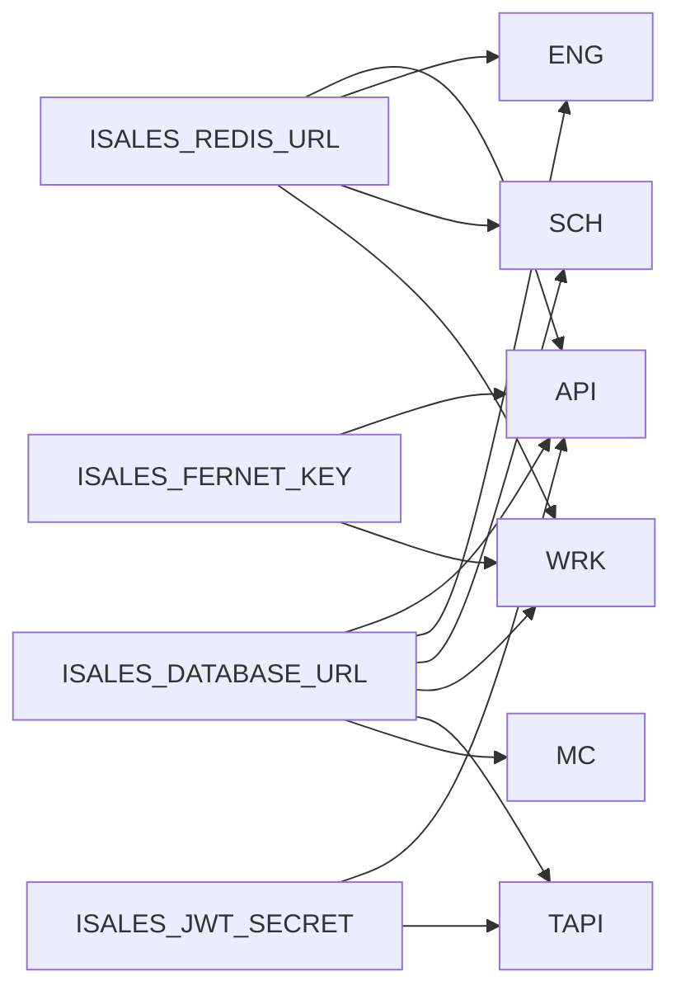

# 开发环境搭建

<cite>
**本文引用的文件**
- [README.md](file://README.md)
- [deploy/README.md](file://deploy/README.md)
- [deploy/macos/README.md](file://deploy/macos/README.md)
- [Makefile](file://Makefile)
- [scripts/test_all.sh](file://scripts/test_all.sh)
- [deploy/linux/scripts/check_env_consistency.py](file://deploy/linux/scripts/check_env_consistency.py)
- [deploy/linux/scripts/provision.sh](file://deploy/linux/scripts/provision.sh)
- [deploy/env/api.env.example](file://deploy/env/api.env.example)
- [deploy/env/engine.env.example](file://deploy/env/engine.env.example)
- [deploy/env/scheduler.env.example](file://deploy/env/scheduler.env.example)
- [deploy/env/worker.env.example](file://deploy/env/worker.env.example)
- [deploy/env/modem-controller.env.example](file://deploy/env/modem-controller.env.example)
- [deploy/env/telephony-api.env.example](file://deploy/env/telephony-api.env.example)
</cite>

## 目录
1. [简介](#简介)
2. [项目结构](#项目结构)
3. [核心组件](#核心组件)
4. [架构总览](#架构总览)
5. [详细组件分析](#详细组件分析)
6. [依赖分析](#依赖分析)
7. [性能考虑](#性能考虑)
8. [故障排除指南](#故障排除指南)
9. [结论](#结论)
10. [附录](#附录)

## 简介
本指南面向 iSales v1 单主机部署模型，提供开发环境搭建的完整步骤，涵盖：
- Python 3.11 环境配置与虚拟环境创建
- 依赖安装与开发工具链
- 各服务环境变量配置（API、Engine、Scheduler、Worker、Modem Controller、Telephony API）
- 数据库（PostgreSQL）与缓存（Redis）本地部署与配置
- IDE 配置建议、代码格式化工具设置
- 环境一致性检查脚本的使用方法与常见问题解决

注意：官方部署文档要求 Python 3.12，开发阶段可按需使用 Python 3.11 进行验证，但生产与集成测试仍建议使用 Python 3.12。

## 项目结构
iSales 采用多仓协作与统一部署脚本的组织方式。核心仓库与职责如下：
- isales-common：Pydantic/SQLAlchemy 模型与跨仓共享 schema
- isales-api：FastAPI HTTP 后台（campaigns/leads/calls 等）
- isales-telephony：设备与 SIM 管理、modem-controller 守护进程
- isales-scheduler：调度器（campaign 启停/拨号队列）
- isales-worker：后台 worker（callback/recording upload/watchdog）
- isales-engine：实时通话引擎（状态机 + 三层 AI 管线）
- isales-web：Vue 3 管理面

图表来源
- [deploy/README.md:14-49](file://deploy/README.md#L14-L49)

章节来源
- [README.md:6-14](file://README.md#L6-L14)
- [deploy/README.md:3-8](file://deploy/README.md#L3-L8)

## 核心组件
- 集中式环境变量模板：位于 deploy/env/*.env.example，定义各服务所需变量及跨服务一致性约束
- 一次性主机初始化：deploy/linux/scripts/provision.sh 或 deploy/macos/scripts/provision.sh
- 环境一致性检查：deploy/linux/scripts/check_env_consistency.py
- 跨仓测试一键脚本：scripts/test_all.sh
- Makefile 中的静态检查与校验目标：deploy-check、spec-validate、test-all

章节来源
- [deploy/README.md:83-102](file://deploy/README.md#L83-L102)
- [Makefile:1-30](file://Makefile#L1-L30)
- [scripts/test_all.sh:1-145](file://scripts/test_all.sh#L1-L145)

## 架构总览
下图展示开发环境中的服务与系统依赖关系，以及环境变量共享规则（数据库/Redis/JWT/Fernet）：

图表来源
- [deploy/env/api.env.example:4-7](file://deploy/env/api.env.example#L4-L7)
- [deploy/env/engine.env.example:4-6](file://deploy/env/engine.env.example#L4-L6)
- [deploy/env/scheduler.env.example:4-10](file://deploy/env/scheduler.env.example#L4-L10)
- [deploy/env/worker.env.example:4-7](file://deploy/env/worker.env.example#L4-L7)
- [deploy/env/telephony-api.env.example:4-7](file://deploy/env/telephony-api.env.example#L4-L7)

## 详细组件分析

### Python 3.11 环境配置与虚拟环境
- 环境要求
  - Python 3.12 为官方推荐版本；若使用 Python 3.11，请在本地进行功能验证，并在 CI/集成测试中使用 Python 3.12
  - Node.js >= 20（构建 isales-web）
- 虚拟环境
  - 使用 venv 或 conda 创建隔离环境
  - 在各服务仓库根目录执行开发模式安装（pip install -e ".[dev]"），web 仓需 npm install
- 跨仓测试
  - 通过 make test-all 或 bash scripts/test_all.sh -k <filter> 运行所有仓库测试

章节来源
- [deploy/README.md:56](file://deploy/README.md#L56)
- [deploy/macos/README.md:41](file://deploy/macos/README.md#L41)
- [README.md:53-56](file://README.md#L53-L56)
- [scripts/test_all.sh:18-29](file://scripts/test_all.sh#L18-L29)

### 数据库（PostgreSQL）本地部署与配置
- Linux（Ubuntu 22.04+）
  - 通过 provision.sh 安装 postgresql-15 并初始化数据库与角色
  - 自动创建/填充 /etc/isales/env/*.env 示例文件，包含随机生成的数据库密码、JWT 密钥、Fernet 密钥
- macOS（Apple Silicon, macOS 14+）
  - 通过 provision.sh 安装 postgresql@16 并初始化
  - 同样生成初始密钥与 env 文件
- 手动初始化（如需）
  - 创建数据库与用户：CREATE DATABASE isales OWNER isales
  - 初始化 JWT 与 Fernet 密钥（可参考 provision.sh 中的密钥生成逻辑）

章节来源
- [deploy/linux/scripts/provision.sh:143-186](file://deploy/linux/scripts/provision.sh#L143-L186)
- [deploy/README.md:56](file://deploy/README.md#L56)
- [deploy/macos/README.md:42](file://deploy/macos/README.md#L42)

### 缓存（Redis）本地部署与配置
- Linux
  - 通过 provision.sh 安装 redis-server 并启用 AOF（appendonly yes / appendfsync everysec）
  - 将 iSales 专用配置写入 /etc/redis/redis.conf.d/isales.conf
- macOS
  - 通过 provision.sh 安装 redis 并启用 AOF
- 环境变量
  - 所有服务使用相同的 ISALES_REDIS_URL（默认 redis://localhost:6379/0）

章节来源
- [deploy/linux/scripts/provision.sh:97-127](file://deploy/linux/scripts/provision.sh#L97-L127)
- [deploy/README.md:26](file://deploy/README.md#L26)
- [deploy/macos/README.md:23](file://deploy/macos/README.md#L23)

### 各服务环境变量配置
- 通用约束
  - ISALES_DATABASE_URL：所有服务必须一致
  - ISALES_REDIS_URL：API/Engine/Scheduler/Worker 共享
  - ISALES_JWT_SECRET：API 与 Telephony API 必须一致（HS256 签发/验证配对）
  - ISALES_FERNET_KEY：API 与 Worker 必须一致
- API 服务
  - 必需变量：数据库 URL、Redis URL、JWT 密钥、管理员账号与密码哈希
  - TZ：时区（Asia/Shanghai）
- Engine 服务
  - LLM/ASR/TTS/Telephony Provider：默认 mock
  - 超时与优雅关闭参数
  - TZ：时区
- Scheduler 服务
  - 调度 tick 间隔、批大小、历史窗口、并发上限
  - TZ：时区
- Worker 服务
  - LLM Provider：默认 mock
  - Webhook/重试/指标采集周期
  - Fernet 密钥
  - TZ：时区
- Modem Controller 服务
  - 数据库 URL
  - IPC Socket 路径（默认 /var/run/isales/modem.sock）
  - 可选调试开关（跳过 udev、模拟拨号/通话时延）
- Telephony API 服务
  - 数据库 URL、Redis URL、JWT 密钥
  - 与 API 服务的 JWT 密钥保持一致

章节来源
- [deploy/env/api.env.example:4-14](file://deploy/env/api.env.example#L4-L14)
- [deploy/env/engine.env.example:4-21](file://deploy/env/engine.env.example#L4-L21)
- [deploy/env/scheduler.env.example:4-21](file://deploy/env/scheduler.env.example#L4-L21)
- [deploy/env/worker.env.example:4-20](file://deploy/env/worker.env.example#L4-L20)
- [deploy/env/modem-controller.env.example:4-15](file://deploy/env/modem-controller.env.example#L4-L15)
- [deploy/env/telephony-api.env.example:4-12](file://deploy/env/telephony-api.env.example#L4-L12)

### IDE 配置建议与代码格式化工具
- Python
  - 使用虚拟环境中的 Python 解释器
  - 推荐启用 Pylance/Pyright 与自动格式化（black/ ruff）
  - 在项目根目录运行静态检查：make deploy-check
- JavaScript/Vue
  - 在 isales-web 仓库执行 npm install，使用 Vite 生态工具链
- Shell 脚本
  - 使用 shellcheck 校验 deploy/*.sh 脚本
- OpenSpec 规范
  - 使用 openspec validate 校验规范与变更

章节来源
- [Makefile:19-30](file://Makefile#L19-L30)
- [README.md:66-74](file://README.md#L66-L74)

### 环境一致性检查脚本
- 功能
  - 对比 deploy/env/*.env.example 与各服务 README.md 中列出的环境变量，确保模板与文档一致
  - 支持 telephony README 的列过滤（api / modem）
  - 允许模板中存在 README 未列出的额外变量（如 TZ、调试开关）
- 使用
  - make deploy-check
  - 或直接运行 python3 deploy/linux/scripts/check_env_consistency.py

图表来源
- [deploy/linux/scripts/check_env_consistency.py:118-157](file://deploy/linux/scripts/check_env_consistency.py#L118-L157)

章节来源
- [deploy/linux/scripts/check_env_consistency.py:1-161](file://deploy/linux/scripts/check_env_consistency.py#L1-L161)
- [Makefile:22-29](file://Makefile#L22-L29)

## 依赖分析
- 服务间耦合
  - 数据库与 Redis URL 必须在所有服务中保持一致
  - API 与 Telephony API 的 JWT_SECRET 必须一致
  - Worker 的 Fernet 密钥需与 API 一致
- 系统依赖
  - Linux：postgresql-15、redis-server、nginx、git、pkg-config、libudev-dev、libasound2-dev
  - macOS：postgresql@16、redis、nginx、git、pkg-config
- 时区与时钟
  - 多数服务声明 TZ=Asia/Shanghai；建议统一设置

图表来源
- [deploy/env/api.env.example:4-14](file://deploy/env/api.env.example#L4-L14)
- [deploy/env/engine.env.example:4-21](file://deploy/env/engine.env.example#L4-L21)
- [deploy/env/scheduler.env.example:4-21](file://deploy/env/scheduler.env.example#L4-L21)
- [deploy/env/worker.env.example:4-20](file://deploy/env/worker.env.example#L4-L20)
- [deploy/env/telephony-api.env.example:4-12](file://deploy/env/telephony-api.env.example#L4-L12)
- [deploy/env/modem-controller.env.example:4-15](file://deploy/env/modem-controller.env.example#L4-L15)

章节来源
- [deploy/README.md:56](file://deploy/README.md#L56)
- [deploy/macos/README.md:43](file://deploy/macos/README.md#L43)

## 性能考虑
- Redis AOF 持久化已在 provision.sh 中启用，兼顾可靠性与性能
- PostgreSQL 默认初始化已创建数据库与用户，建议后续根据负载调整连接池与统计信息收集
- 各服务的超时与批处理参数（Engine/Scheduler/Worker）可根据实际硬件与业务负载调优

## 故障排除指南
- 环境变量不一致
  - 使用 make deploy-check 校验模板与 README 是否匹配
  - 若提示 README 独有变量缺失，需在对应服务 README 中补充或在模板中移除
- 密钥/URL 不一致
  - 确保所有服务的 ISALES_DATABASE_URL、ISALES_REDIS_URL、ISALES_JWT_SECRET、ISALES_FERNET_KEY 一致
  - provision.sh 会自动生成初始密钥，编辑 /etc/isales/env/*.env 后重新部署
- macOS launchd 环境注入
  - launchd 不支持 EnvironmentFile=，需通过 install.sh 将 /etc/isales/env/*.env 内联写入 plist 的 EnvironmentVariables 字典
  - 修改 env 后必须重新运行 install.sh 或手动重启对应 plist
- 跨仓测试失败
  - 使用 make test-all 或 bash scripts/test_all.sh -k <filter> 查看失败仓库列表
  - 确认各仓库已执行开发模式安装（pip install -e ".[dev]"）与前端依赖（npm install）

章节来源
- [Makefile:22-29](file://Makefile#L22-L29)
- [deploy/linux/scripts/check_env_consistency.py:136-149](file://deploy/linux/scripts/check_env_consistency.py#L136-L149)
- [deploy/linux/scripts/provision.sh:179-186](file://deploy/linux/scripts/provision.sh#L179-L186)
- [deploy/macos/README.md:85-91](file://deploy/macos/README.md#L85-L91)
- [scripts/test_all.sh:39-79](file://scripts/test_all.sh#L39-L79)

## 结论
通过以上步骤，可在本地完成 iSales v1 的开发环境搭建与验证。建议：
- 使用 Python 3.12 进行集成测试与 CI
- 严格遵循环境变量一致性约束
- 利用 provision.sh 与 check_env_consistency.py 降低配置偏差
- 在 macOS 上注意 launchd 的环境注入机制差异

## 附录
- 快速开始（Linux）
  - sudo bash deploy/linux/scripts/provision.sh
  - 编辑 /etc/isales/env/*.env，填入真实密钥
  - sudo -u isales bash deploy/linux/scripts/install.sh <version>
  - sudo -u isales bash deploy/linux/scripts/migrate.sh
  - sudo bash deploy/linux/scripts/deploy.sh <release-ts>
- 快速开始（macOS）
  - sudo bash deploy/macos/scripts/provision.sh
  - 编辑 /etc/isales/env/*.env
  - sudo bash deploy/macos/scripts/install.sh <version>
  - sudo bash deploy/macos/scripts/migrate.sh
  - sudo bash deploy/macos/scripts/deploy.sh <release-ts>

章节来源
- [deploy/README.md:63-81](file://deploy/README.md#L63-L81)
- [deploy/macos/README.md:48-69](file://deploy/macos/README.md#L48-L69)