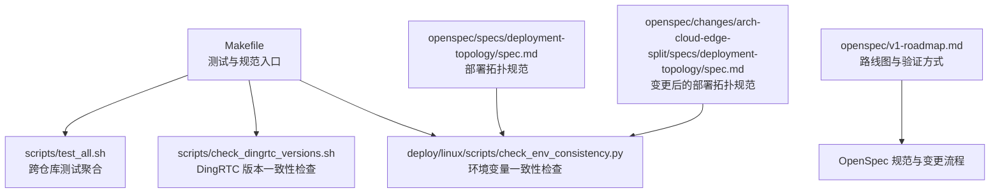
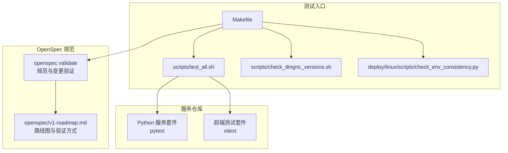
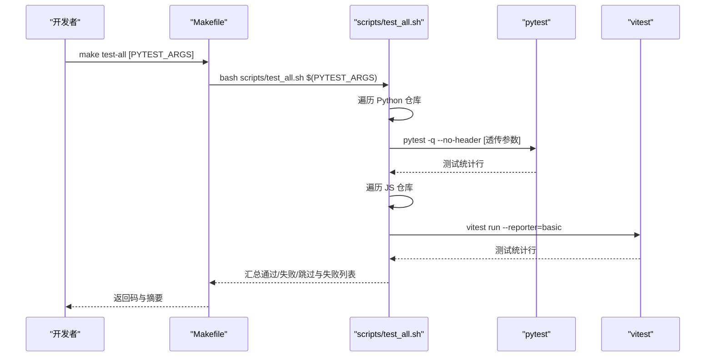
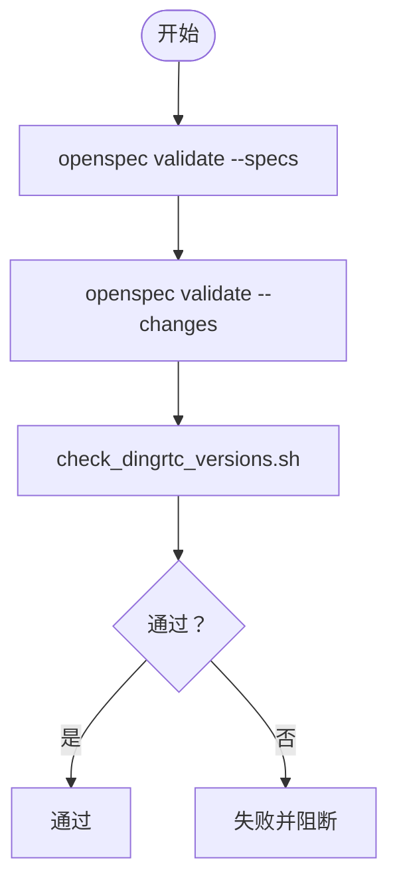
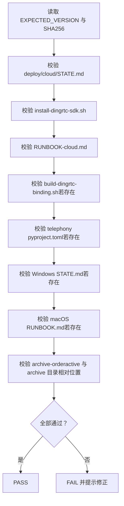
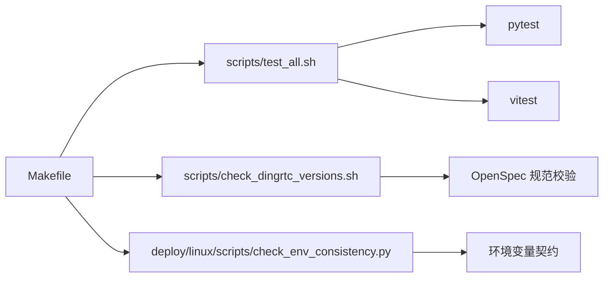

# 测试策略与执行

<cite>
**本文引用的文件**
- [Makefile](file://Makefile)
- [scripts/test_all.sh](file://scripts/test_all.sh)
- [scripts/check_dingrtc_versions.sh](file://scripts/check_dingrtc_versions.sh)
- [deploy/linux/scripts/check_env_consistency.py](file://deploy/linux/scripts/check_env_consistency.py)
- [openspec/v1-roadmap.md](file://openspec/v1-roadmap.md)
- [openspec/v1-roadmap-a3-context.md](file://openspec/v1-roadmap-a3-context.md)
- [openspec/specs/deployment-topology/spec.md](file://openspec/specs/deployment-topology/spec.md)
- [openspec/changes/arch-cloud-edge-split/specs/deployment-topology/spec.md](file://openspec/changes/arch-cloud-edge-split/specs/deployment-topology/spec.md)
- [openspec/changes/archive/2026-05-09-impl-deploy/tasks.md](file://openspec/changes/archive/2026-05-09-impl-deploy/tasks.md)
- [openspec/changes/archive/2026-05-08-impl-web-polish/tasks.md](file://openspec/changes/archive/2026-05-08-impl-web-polish/tasks.md)
- [CLAUDE.md](file://CLAUDE.md)
</cite>

## 目录
1. [简介](#简介)
2. [项目结构](#项目结构)
3. [核心组件](#核心组件)
4. [架构总览](#架构总览)
5. [详细组件分析](#详细组件分析)
6. [依赖关系分析](#依赖关系分析)
7. [性能考虑](#性能考虑)
8. [故障排查指南](#故障排查指南)
9. [结论](#结论)
10. [附录](#附录)

## 简介
本文件面向 iSales 项目的测试策略与执行，覆盖跨仓库测试的统一执行流程、测试套件组织与分类、OpenSpec 规范验证测试的执行过程、DingRTC SDK 版本一致性检查的自动化流程，以及测试环境配置、测试数据准备与测试结果分析方法。文档同时给出单元测试、集成测试与端到端测试的最佳实践建议，并通过可视化图表帮助读者理解测试体系与关键流程。

## 项目结构
iSales 采用多仓库（monorepo）结构，核心测试相关目录与文件如下：
- 顶层构建与测试入口：Makefile、scripts/test_all.sh
- OpenSpec 规范校验：Makefile 中的 spec-validate 目标，配合 scripts/check_dingrtc_versions.sh
- 部署与环境一致性检查：deploy/linux/scripts/check_env_consistency.py
- OpenSpec 规划与变更：openspec/v1-roadmap.md、openspec/v1-roadmap-a3-context.md
- 规范与契约：openspec/specs/deployment-topology/spec.md、openspec/changes/arch-cloud-edge-split/specs/deployment-topology/spec.md
- 测试实践与工具：CLAUDE.md

**图表来源**
- [Makefile:1-30](file://Makefile#L1-L30)
- [scripts/test_all.sh:1-145](file://scripts/test_all.sh#L1-L145)
- [scripts/check_dingrtc_versions.sh:1-189](file://scripts/check_dingrtc_versions.sh#L1-L189)
- [deploy/linux/scripts/check_env_consistency.py:1-161](file://deploy/linux/scripts/check_env_consistency.py#L1-L161)
- [openspec/v1-roadmap.md:1-576](file://openspec/v1-roadmap.md#L1-L576)
- [openspec/specs/deployment-topology/spec.md:40-64](file://openspec/specs/deployment-topology/spec.md#L40-L64)
- [openspec/changes/arch-cloud-edge-split/specs/deployment-topology/spec.md:65-86](file://openspec/changes/arch-cloud-edge-split/specs/deployment-topology/spec.md#L65-L86)

**章节来源**
- [Makefile:1-30](file://Makefile#L1-L30)
- [scripts/test_all.sh:1-145](file://scripts/test_all.sh#L1-L145)
- [scripts/check_dingrtc_versions.sh:1-189](file://scripts/check_dingrtc_versions.sh#L1-L189)
- [deploy/linux/scripts/check_env_consistency.py:1-161](file://deploy/linux/scripts/check_env_consistency.py#L1-L161)
- [openspec/v1-roadmap.md:1-576](file://openspec/v1-roadmap.md#L1-L576)
- [openspec/specs/deployment-topology/spec.md:40-64](file://openspec/specs/deployment-topology/spec.md#L40-L64)
- [openspec/changes/arch-cloud-edge-split/specs/deployment-topology/spec.md:65-86](file://openspec/changes/arch-cloud-edge-split/specs/deployment-topology/spec.md#L65-L86)

## 核心组件
- 跨仓库测试聚合器：scripts/test_all.sh
  - 作用：按顺序运行多个服务仓库的测试套件，汇总通过/失败/跳过情况，失败时返回非零退出码。
  - 支持的仓库：Python 服务（isales-common、isales-api、isales-telephony、isales-scheduler、isales-worker、isales-engine），前端（isales-web）。
  - 参数传递：通过 make test-all 时传入 PYTEST_ARGS，将参数透传给 pytest。
- OpenSpec 规范验证：Makefile 中的 spec-validate 目标
  - 作用：运行 openspec validate 验证规范与变更，随后执行 DingRTC 版本一致性检查。
- DingRTC SDK 版本一致性检查：scripts/check_dingrtc_versions.sh
  - 作用：校验云/边缘三端的 DingRTC 版本与哈希一致性，确保跨平台部署的一致性。
- 环境变量一致性检查：deploy/linux/scripts/check_env_consistency.py
  - 作用：校验 deploy/env/<service>.env.example 与各服务 README 的环境变量声明是否一致，防止部署与测试环境不一致导致的问题。

**章节来源**
- [scripts/test_all.sh:18-29](file://scripts/test_all.sh#L18-L29)
- [scripts/test_all.sh:120-126](file://scripts/test_all.sh#L120-L126)
- [Makefile:5-17](file://Makefile#L5-L17)
- [scripts/check_dingrtc_versions.sh:15-33](file://scripts/check_dingrtc_versions.sh#L15-L33)
- [deploy/linux/scripts/check_env_consistency.py:1-24](file://deploy/linux/scripts/check_env_consistency.py#L1-L24)

## 架构总览
下图展示了 iSales 测试体系的关键交互：Makefile 作为统一入口，协调跨仓库测试、OpenSpec 规范验证与环境一致性检查。

**图表来源**
- [Makefile:1-30](file://Makefile#L1-L30)
- [scripts/test_all.sh:1-145](file://scripts/test_all.sh#L1-L145)
- [scripts/check_dingrtc_versions.sh:1-189](file://scripts/check_dingrtc_versions.sh#L1-L189)
- [deploy/linux/scripts/check_env_consistency.py:1-161](file://deploy/linux/scripts/check_env_consistency.py#L1-L161)
- [openspec/v1-roadmap.md:96-104](file://openspec/v1-roadmap.md#L96-L104)

## 详细组件分析

### 跨仓库测试执行流程（test-all）
- 执行方式
  - 通过 make test-all 触发 scripts/test_all.sh。
  - 该脚本遍历预定义的 Python 与 JavaScript 仓库，分别调用 pytest 与 vitest 运行测试。
- 参数传递
  - 通过 PYTEST_ARGS 将额外参数透传给 pytest，例如过滤器 -k。
- 结果汇总
  - 每个仓库输出最后一条测试统计行，最终汇总“通过/失败/跳过”数量与总耗时。
  - 若存在失败仓库，脚本返回非零退出码，便于 CI 中断。
- 跳过条件
  - 若缺少虚拟环境或 node_modules，则该仓库被跳过并在摘要中标记为“?”。

**图表来源**
- [Makefile:5-6](file://Makefile#L5-L6)
- [scripts/test_all.sh:120-126](file://scripts/test_all.sh#L120-L126)
- [scripts/test_all.sh:64](file://scripts/test_all.sh#L64)
- [scripts/test_all.sh:100](file://scripts/test_all.sh#L100)

**章节来源**
- [Makefile:5-6](file://Makefile#L5-L6)
- [scripts/test_all.sh:120-126](file://scripts/test_all.sh#L120-L126)
- [scripts/test_all.sh:39-79](file://scripts/test_all.sh#L39-L79)
- [scripts/test_all.sh:81-118](file://scripts/test_all.sh#L81-L118)
- [CLAUDE.md:32-40](file://CLAUDE.md#L32-L40)

### OpenSpec 规范验证测试（spec-validate）
- 执行流程
  - Makefile 的 spec-validate 目标依次执行：
    1) openspec validate --specs 验证规范
    2) openspec validate --changes 验证变更
    3) scripts/check_dingrtc_versions.sh 校验 DingRTC 版本一致性
- 验证规则
  - 规范层面：遵循 OpenSpec 工作流，变更必须通过 proposal/design/tasks/specs 的闭环。
  - DingRTC 版本一致性：校验云/边缘三端的版本字符串与哈希，确保跨平台部署一致。
- 与路线图的关联
  - openspec/v1-roadmap.md 提供了验证方式（本地双进程 PoC、跨机 PoC、真硬件 + 真 LLM），可用于端到端测试设计。

**图表来源**
- [Makefile:14-17](file://Makefile#L14-L17)
- [scripts/check_dingrtc_versions.sh:15-33](file://scripts/check_dingrtc_versions.sh#L15-L33)

**章节来源**
- [Makefile:14-17](file://Makefile#L14-L17)
- [scripts/check_dingrtc_versions.sh:15-33](file://scripts/check_dingrtc_versions.sh#L15-L33)
- [openspec/v1-roadmap.md:96-104](file://openspec/v1-roadmap.md#L96-L104)

### DingRTC SDK 版本一致性检查自动化流程
- 检查范围
  - 云侧 STATE.md、安装脚本、运行手册
  - isales-engine 构建绑定脚本
  - isales-telephony 的 pyproject.toml 与边缘平台的 STATE.md、RUNBOOK.md
- 校验逻辑
  - 读取 canonical 版本与 SHA256，逐项匹配各源文件中的版本与哈希。
  - 若某源缺失或不匹配，记录 FAIL 并在最后统一输出。
- 归档顺序约束
  - 校验 active 与 archive 目录的相对位置，确保迁移顺序正确。

**图表来源**
- [scripts/check_dingrtc_versions.sh:46-51](file://scripts/check_dingrtc_versions.sh#L46-L51)
- [scripts/check_dingrtc_versions.sh:80-154](file://scripts/check_dingrtc_versions.sh#L80-L154)
- [scripts/check_dingrtc_versions.sh:163-169](file://scripts/check_dingrtc_versions.sh#L163-L169)

**章节来源**
- [scripts/check_dingrtc_versions.sh:46-51](file://scripts/check_dingrtc_versions.sh#L46-L51)
- [scripts/check_dingrtc_versions.sh:80-154](file://scripts/check_dingrtc_versions.sh#L80-L154)
- [scripts/check_dingrtc_versions.sh:163-169](file://scripts/check_dingrtc_versions.sh#L163-L169)

### 测试环境配置与测试数据准备
- 环境变量一致性
  - 使用 deploy/linux/scripts/check_env_consistency.py 校验 deploy/env/<service>.env.example 与各服务 README 的环境变量声明是否一致。
  - 该脚本在 make deploy-check 中被调用，确保部署与测试环境变量契约一致。
- 部署拓扑与跨服务一致性
  - openspec/specs/deployment-topology/spec.md 与 openspec/changes/arch-cloud-edge-split/specs/deployment-topology/spec.md 定义了跨服务与云-边一致性约束，确保测试环境变量在多服务间保持一致。
- 测试数据准备
  - 建议在测试环境中准备最小化数据集，覆盖关键路径（如拨号、通话、取消、重试等），并结合 OpenSpec 路线图中的验证方式设计端到端脚本。

**章节来源**
- [deploy/linux/scripts/check_env_consistency.py:118-156](file://deploy/linux/scripts/check_env_consistency.py#L118-L156)
- [openspec/specs/deployment-topology/spec.md:40-64](file://openspec/specs/deployment-topology/spec.md#L40-L64)
- [openspec/changes/arch-cloud-edge-split/specs/deployment-topology/spec.md:65-86](file://openspec/changes/arch-cloud-edge-split/specs/deployment-topology/spec.md#L65-L86)
- [openspec/v1-roadmap.md:96-104](file://openspec/v1-roadmap.md#L96-L104)

### 测试结果分析与报告
- 跨仓库测试结果
  - scripts/test_all.sh 输出每个仓库的最后一条测试统计行与总耗时，失败仓库会被收集并在末尾列出。
- OpenSpec 规范验证结果
  - spec-validate 通过后，DingRTC 版本一致性检查失败会明确指出不一致的文件与期望值，便于快速修复。
- 端到端验证
  - 可参考 openspec/v1-roadmap.md 中的本地双进程 PoC、跨机 PoC、真硬件 + 真 LLM 的验证方式，设计端到端脚本并记录关键指标（如首音节延迟、端到端 barge-in 响应等）。

**章节来源**
- [scripts/test_all.sh:130-144](file://scripts/test_all.sh#L130-L144)
- [scripts/check_dingrtc_versions.sh:173-188](file://scripts/check_dingrtc_versions.sh#L173-L188)
- [openspec/v1-roadmap.md:96-104](file://openspec/v1-roadmap.md#L96-L104)

## 依赖关系分析
- 组件耦合
  - Makefile 作为统一入口，耦合 test_all.sh、check_dingrtc_versions.sh 与 check_env_consistency.py。
  - OpenSpec 规范验证依赖 openspec CLI 与脚本校验工具。
- 外部依赖
  - openspec、shellcheck、python3 等工具需在 PATH 中可用。
- 测试套件组织
  - Python 服务使用 pytest，前端使用 vitest，test_all.sh 通过不同执行器适配两类测试框架。

**图表来源**
- [Makefile:1-30](file://Makefile#L1-L30)
- [scripts/test_all.sh:1-145](file://scripts/test_all.sh#L1-L145)
- [scripts/check_dingrtc_versions.sh:1-189](file://scripts/check_dingrtc_versions.sh#L1-189)
- [deploy/linux/scripts/check_env_consistency.py:1-161](file://deploy/linux/scripts/check_env_consistency.py#L1-L161)

**章节来源**
- [Makefile:1-30](file://Makefile#L1-L30)
- [scripts/test_all.sh:1-145](file://scripts/test_all.sh#L1-L145)
- [scripts/check_dingrtc_versions.sh:1-189](file://scripts/check_dingrtc_versions.sh#L1-L189)
- [deploy/linux/scripts/check_env_consistency.py:1-161](file://deploy/linux/scripts/check_env_consistency.py#L1-L161)

## 性能考虑
- 测试执行效率
  - 使用 make test-all 并行运行多个仓库测试，缩短整体测试时间。
  - 通过 PYTEST_ARGS 过滤测试用例，减少不必要的执行。
- 端到端测试指标
  - 参考 openspec/v1-roadmap.md 中的三条对话级指标（云-边音频单程、用户说完到 AI 首音节出声、端到端 barge-in 切断响应），在端到端脚本中采集并记录 P50/P95/P99，形成回归基线。

**章节来源**
- [Makefile:5-6](file://Makefile#L5-L6)
- [openspec/v1-roadmap.md:26-43](file://openspec/v1-roadmap.md#L26-L43)

## 故障排查指南
- 跨仓库测试失败
  - 检查每个失败仓库的最后一条测试统计行，定位失败原因。
  - 确认各仓库已正确安装虚拟环境与依赖（Python 仓库的 .venv 与 JS 仓库的 node_modules）。
- OpenSpec 规范验证失败
  - 根据 scripts/check_dingrtc_versions.sh 的输出，逐一修正不一致的版本与哈希。
  - 确保 active 与 archive 目录的相对位置符合迁移顺序要求。
- 环境变量不一致
  - 使用 deploy/linux/scripts/check_env_consistency.py 检查 deploy/env/<service>.env.example 与各服务 README 的环境变量声明是否一致。
  - 按照 openspec/specs/deployment-topology/spec.md 的要求，确保跨服务变量一致。

**章节来源**
- [scripts/test_all.sh:130-144](file://scripts/test_all.sh#L130-L144)
- [scripts/check_dingrtc_versions.sh:173-188](file://scripts/check_dingrtc_versions.sh#L173-L188)
- [deploy/linux/scripts/check_env_consistency.py:118-156](file://deploy/linux/scripts/check_env_consistency.py#L118-L156)
- [openspec/specs/deployment-topology/spec.md:40-64](file://openspec/specs/deployment-topology/spec.md#L40-L64)

## 结论
iSales 的测试策略围绕“统一入口 + 跨仓库聚合 + 规范与一致性校验”的三位一体设计。通过 Makefile 统一触发 test-all、spec-validate 与 deploy-check，结合 OpenSpec 规范与 DingRTC 版本一致性检查，能够有效保障多仓库协同开发的质量与稳定性。建议在持续集成中启用上述检查，并结合端到端验证方式与性能指标，形成完善的回归与质量保障体系。

## 附录
- 测试套件组织与优先级
  - 单元测试：优先保证核心模块（如音频桥接、状态机、工具函数）的单元测试覆盖率。
  - 集成测试：覆盖服务间通信、gRPC/HTTP 接口、数据库与缓存交互。
  - 端到端测试：基于 openspec/v1-roadmap.md 的验证方式，设计本地双进程 PoC、跨机 PoC 与真硬件验证脚本。
- OpenSpec 变更与测试
  - 变更必须通过 proposal/design/tasks/specs 的闭环，测试用例随变更同步更新。
  - 参考 openspec/changes/archive/2026-05-08-impl-web-polish/tasks.md 中的测试覆盖增强实践，确保前端与 store/utils 的测试优先。

**章节来源**
- [openspec/v1-roadmap.md:96-104](file://openspec/v1-roadmap.md#L96-L104)
- [openspec/changes/archive/2026-05-08-impl-web-polish/tasks.md:88-94](file://openspec/changes/archive/2026-05-08-impl-web-polish/tasks.md#L88-L94)