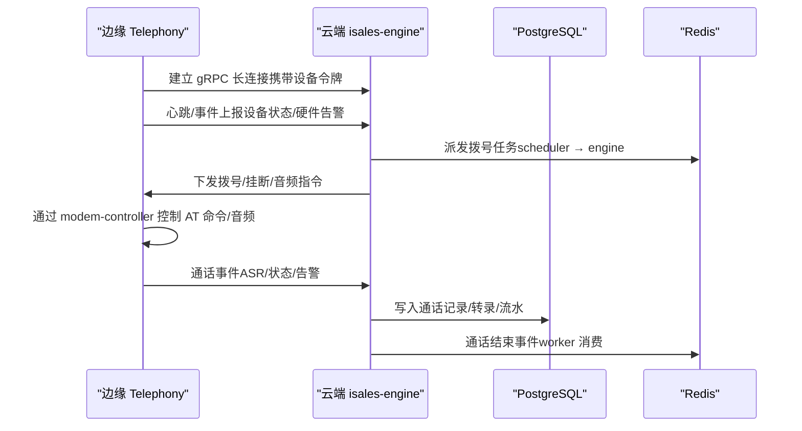
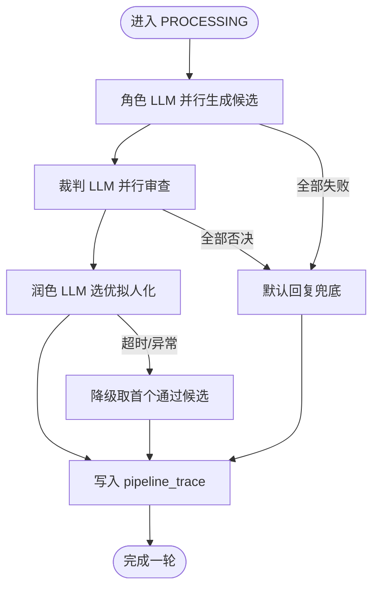
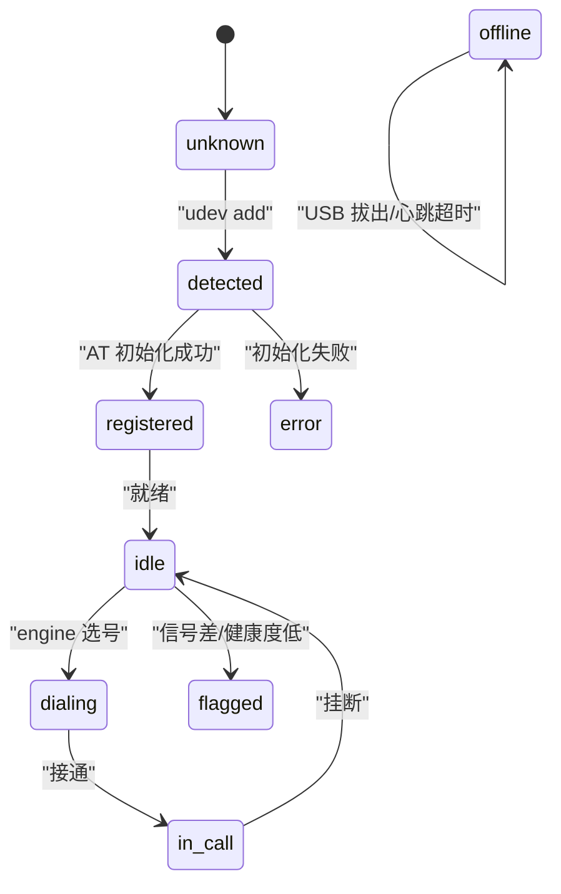
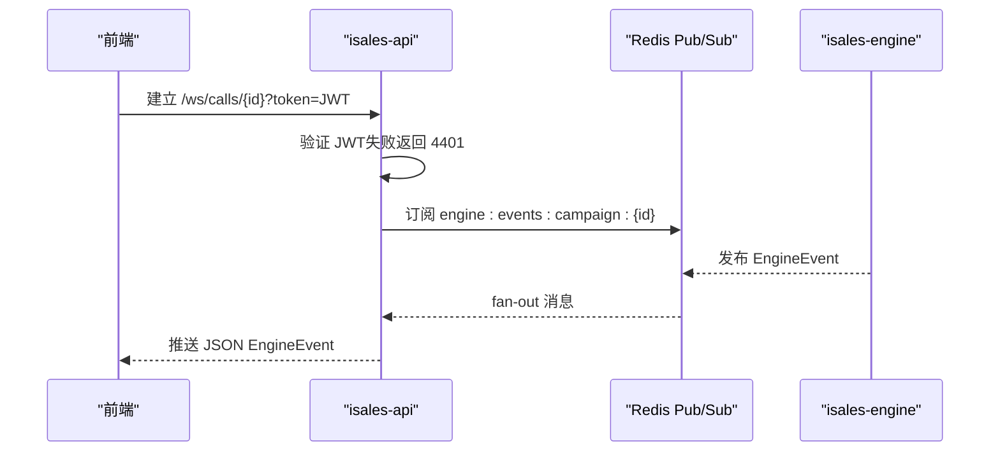

# 调试与故障排查

<cite>
**本文档引用的文件**
- [README.md](file://README.md)
- [DESIGN.md](file://DESIGN.md)
- [RUNBOOK.md](file://deploy/RUNBOOK.md)
- [RUNBOOK-cloud.md](file://deploy/RUNBOOK-cloud.md)
- [RUNBOOK-edge.md](file://deploy/RUNBOOK-edge.md)
- [engine.env.example](file://deploy/env/engine.env.example)
- [modem-controller.env.example](file://deploy/env/modem-controller.env.example)
- [spec.md](file://openspec/specs/call-state-machine/spec.md)
- [spec.md](file://openspec/specs/ai-pipeline/spec.md)
- [spec.md](file://openspec/specs/device-hardware/spec.md)
- [spec.md](file://openspec/specs/service-communication/spec.md)
- [prometheus.yml.example](file://deploy/cloud/monitoring/prometheus.yml.example)
- [alert_rules.yml.example](file://deploy/cloud/monitoring/alert_rules.yml.example)
</cite>

## 目录
1. [简介](#简介)
2. [项目结构](#项目结构)
3. [核心组件](#核心组件)
4. [架构总览](#架构总览)
5. [详细组件分析](#详细组件分析)
6. [依赖分析](#依赖分析)
7. [性能考虑](#性能考虑)
8. [故障排查指南](#故障排查指南)
9. [结论](#结论)
10. [附录](#附录)

## 简介
本指南面向 iSales 项目的运维与工程团队，提供系统化的调试与故障排查方法。内容覆盖：
- 各服务日志分析与关键信息解读
- 实时通话引擎的调试技巧、状态机跟踪与 AI 管线定位
- 硬件控制模块（modem-controller）的调试流程与 USB Modem 诊断
- 网络通信与 WebSocket 连接问题排查
- 性能分析、内存泄漏检测与并发问题调试
- 常见错误的诊断流程与解决方案

## 项目结构
iSales 采用“多仓协同 + 单主机部署”的架构，核心服务包括：
- isales-api：FastAPI HTTP 后台
- isales-engine：实时通话引擎（状态机 + 三层 AI 管线）
- isales-telephony：设备与 SIM 管理、modem-controller 守护进程
- isales-scheduler：拨号调度与 Campaign 生命周期管理
- isales-worker：回调、录音上传、看门狗
- isales-web：Vue 3 管理界面

```mermaid
graph TB
subgraph "云端ECS"
API["isales-api<br/>HTTP 8000"]
ENGINE["isales-engine<br/>gRPC 50051"]
SCHED["isales-scheduler<br/>拨号调度"]
WORKER["isales-worker<br/>回调/看门狗"]
WEB["isales-web SPA<br/>Nginx 80/443"]
end
subgraph "边缘Mac mini"
EDGE["边缘 Telephony 进程<br/>gRPC cloud-edge"]
MODEM["USB GSM Modem<br/>AT 命令/音频"]
end
API --> SCHED
SCHED --> ENGINE
ENGINE --> WORKER
API <- --> WEB
ENGINE <- --> EDGE
EDGE --> MODEM
```

图表来源
- [README.md:1-14](file://README.md#L1-L14)
- [RUNBOOK-cloud.md:10-172](file://deploy/RUNBOOK-cloud.md#L10-L172)

章节来源
- [README.md:1-86](file://README.md#L1-L86)
- [DESIGN.md:1-75](file://DESIGN.md#L1-L75)

## 核心组件
- 通话状态机：定义状态集合、转换规则与错误处理契约，是引擎内部与运维调试的“真相来源”
- AI 三层管线：角色 LLM 并行 PK → 裁判 LLM 并行审查 → 润色 LLM 选优拟人化
- 硬件层：modem-controller 通过 udev/AT 命令/PCM 音频与引擎交互
- 服务通信：Redis 队列/发布订阅、HTTP、Unix Socket、WebSocket

章节来源
- [spec.md:1-190](file://openspec/specs/call-state-machine/spec.md#L1-L190)
- [spec.md:1-166](file://openspec/specs/ai-pipeline/spec.md#L1-L166)
- [spec.md:1-525](file://openspec/specs/device-hardware/spec.md#L1-L525)
- [spec.md:1-150](file://openspec/specs/service-communication/spec.md#L1-L150)

## 架构总览
iSales v1 采用“云-边”拓扑：云端 ECS 承载 API、引擎、调度与工作器；边缘 Mac mini 通过 gRPC 与云端保持长连接，本地运行 telephony 进程与 USB GSM Modem 交互。



图表来源
- [RUNBOOK-cloud.md:325-443](file://deploy/RUNBOOK-cloud.md#L325-L443)
- [spec.md:10-25](file://openspec/specs/service-communication/spec.md#L10-L25)

## 详细组件分析

### 实时通话引擎（isales-engine）调试
- 状态机跟踪
  - 通过 transcript 事件流定位非法状态转移与异常路径
  - 关注 state_error 事件与 hangup_cause 字段，结合 call-state-machine 规范核对
- AI 管线定位
  - 每轮 PROCESSING 必须落库 pipeline_trace，异常路径也要写入，便于回溯
  - 重点关注角色 LLM/裁判 LLM/润色 LLM 的输出与错误字段
- 关键日志与命令
  - 云端健康检查：查看 gRPC 监听与流连通性
  - 降低并发压力：将 N=1 以缓解端到端首 TTS 延迟



图表来源
- [spec.md:40-68](file://openspec/specs/ai-pipeline/spec.md#L40-L68)

章节来源
- [spec.md:33-44](file://openspec/specs/call-state-machine/spec.md#L33-L44)
- [spec.md:1-166](file://openspec/specs/ai-pipeline/spec.md#L1-L166)
- [RUNBOOK-cloud.md:380-393](file://deploy/RUNBOOK-cloud.md#L380-L393)

### 硬件控制模块（modem-controller）调试
- 设备状态机与事件
  - 设备插入/注册/空闲/拨号/通话/离线等状态转换
  - 通过 IPC 上报 connected/remote_hangup/audio_upstream 等事件
- USB Modem 诊断
  - Linux/macOS 串口路径识别与 AT 命令验证
  - 心跳与看门狗兜底：120s 未心跳置 offline
- 环境配置
  - ISALES_MODEM_SERIAL_PATH 必填；生产环境不允许 mock 模式



图表来源
- [spec.md:45-67](file://openspec/specs/device-hardware/spec.md#L45-L67)

章节来源
- [spec.md:106-146](file://openspec/specs/device-hardware/spec.md#L106-L146)
- [modem-controller.env.example:1-15](file://deploy/env/modem-controller.env.example#L1-L15)
- [RUNBOOK.md:169-171](file://deploy/RUNBOOK.md#L169-L171)

### 服务通信与 WebSocket
- 通信通道矩阵
  - Redis Queue：必须送达的任务派发（拨号、通话结束）
  - Redis Pub/Sub：实时事件广播（通话状态、ASR 文本）
  - HTTP：scheduler → telephony-api 设备选择
  - WebSocket：/ws/calls/{campaign_id} 实时推送
- WebSocket 连接问题排查
  - 鉴权失败（4401）：检查 JWT 有效性
  - 服务单实例限制：确保前端只订阅一个实例



图表来源
- [spec.md:106-135](file://openspec/specs/service-communication/spec.md#L106-L135)

章节来源
- [spec.md:1-150](file://openspec/specs/service-communication/spec.md#L1-L150)
- [RUNBOOK.md:174-175](file://deploy/RUNBOOK.md#L174-L175)

### 性能分析与并发控制
- 全局并发控制：Redis 原子计数器（INCR/DECR），避免泄漏
- 端到端延迟预算：首 TTS P95 > 800ms 触发降级（N=1）
- ARTC 推流反压：push_audio buffer-full 频繁告警

章节来源
- [spec.md:45-62](file://openspec/specs/service-communication/spec.md#L45-L62)
- [alert_rules.yml.example:71-86](file://deploy/cloud/monitoring/alert_rules.yml.example#L71-L86)
- [RUNBOOK-cloud.md:590-591](file://deploy/RUNBOOK-cloud.md#L590-L591)

## 依赖分析
- 服务耦合
  - scheduler → engine：拨号队列
  - engine → worker：通话结束事件
  - api ↔ engine：Pub/Sub 事件推送
  - engine ↔ modem-controller：Unix Socket（音频/控制）
- 外部依赖
  - Redis：队列/缓存/计数器
  - PostgreSQL：数据持久化
  - Aliyun DingRTC SDK（云端 ECS）

```mermaid
graph LR
SCHED["scheduler"] --> |Redis Queue| ENGINE["engine"]
ENGINE --> |Redis Pub/Sub| API["api"]
ENGINE --> |Redis Queue| WORKER["worker"]
API --> |HTTP| SCHED
ENGINE < --> MODEM["modem-controller"]
ENGINE --> REDIS["Redis"]
API --> REDIS
WORKER --> REDIS
ENGINE --> DB["PostgreSQL"]
API --> DB
```

图表来源
- [spec.md:11-24](file://openspec/specs/service-communication/spec.md#L11-L24)

章节来源
- [spec.md:1-150](file://openspec/specs/service-communication/spec.md#L1-L150)

## 性能考虑
- 端到端延迟预算与降级策略
  - 当首 TTS P95 超过 800ms，将多角色 PK 降级为 N=1，优先保障通话体验
- ARTC 推流反压
  - push_audio buffer-full 告警指示上游 TTS 速率过快或网络拥塞，需优化提供方或网络路径
- 并发与资源
  - 使用 Redis 原子计数器控制全局并发，避免计数器泄漏
  - 短暂不可用时重连与优雅清理受影响的 call_session

章节来源
- [alert_rules.yml.example:69-86](file://deploy/cloud/monitoring/alert_rules.yml.example#L69-L86)
- [spec.md:45-62](file://openspec/specs/service-communication/spec.md#L45-L62)

## 故障排查指南

### 一、日志分析与关键信息解读
- 通用命令
  - Linux：查看最近 5 分钟错误日志、服务状态、队列深度
  - macOS：查看 unified 日志、brew 服务状态、Active Call Count
- 关键日志定位
  - engine：gRPC 监听、流连通性、AI 管线 trace
  - modem-controller：设备状态、AT 事件、硬件告警
  - api：WebSocket 鉴权、健康检查
  - worker：回调失败率、看门狗离线设备

章节来源
- [RUNBOOK.md:180-196](file://deploy/RUNBOOK.md#L180-L196)
- [RUNBOOK.md:359-379](file://deploy/RUNBOOK.md#L359-L379)
- [RUNBOOK-cloud.md:325-393](file://deploy/RUNBOOK-cloud.md#L325-L393)

### 二、实时通话引擎调试技巧
- 状态机跟踪
  - 通过 transcript 事件流定位非法转移与异常路径
  - 核对 hangup_cause 与 call-state-machine 规范
- AI 管线定位
  - 检查 pipeline_trace 是否写入，异常路径是否标注 error 字段
  - 降低并发压力：将 N=1 以缓解端到端首 TTS 延迟
- 常见症状
  - latency 超 800 ms 持续告警 → 降级策略
  - 通话拨通后无 AI 声 → 检查 DingRTC join 失败、LD_LIBRARY_PATH、dingrtc_pywrap 导入异常

章节来源
- [spec.md:33-44](file://openspec/specs/call-state-machine/spec.md#L33-L44)
- [spec.md:40-68](file://openspec/specs/ai-pipeline/spec.md#L40-L68)
- [RUNBOOK-cloud.md:590-591](file://deploy/RUNBOOK-cloud.md#L590-L591)

### 三、硬件控制模块调试流程
- 设备状态机
  - 识别设备插入/注册/空闲/拨号/通话/离线状态
  - 通过 IPC 上报 connected/remote_hangup/audio_upstream
- USB Modem 诊断
  - Linux/macOS 串口路径识别与 AT 命令验证
  - 心跳与看门狗兜底：120s 未心跳置 offline
- 环境配置
  - ISALES_MODEM_SERIAL_PATH 必填；生产环境不允许 mock 模式

章节来源
- [spec.md:106-146](file://openspec/specs/device-hardware/spec.md#L106-L146)
- [modem-controller.env.example:1-15](file://deploy/env/modem-controller.env.example#L1-L15)
- [RUNBOOK.md:169-171](file://deploy/RUNBOOK.md#L169-L171)

### 四、网络通信与 WebSocket 连接问题
- gRPC 流连通性
  - 检查 engine 是否有活跃流、nginx 50051 接收流量
  - 使用 grpcurl 测试与 TLS 握手验证
- WebSocket
  - 鉴权失败（4401）：检查 JWT 有效性
  - 服务单实例限制：确保前端只订阅一个实例

章节来源
- [RUNBOOK-cloud.md:337-393](file://deploy/RUNBOOK-cloud.md#L337-L393)
- [spec.md:106-135](file://openspec/specs/service-communication/spec.md#L106-L135)
- [RUNBOOK.md:174-175](file://deploy/RUNBOOK.md#L174-L175)

### 五、性能分析、内存泄漏检测与并发问题
- 端到端延迟预算与降级策略
  - 首 TTS P95 > 800ms → 将多角色 PK 降级为 N=1
- ARTC 推流反压
  - push_audio buffer-full 告警 → 优化提供方或网络路径
- 并发与资源
  - Redis 原子计数器（INCR/DECR）控制全局并发
  - 短暂不可用时重连与优雅清理受影响的 call_session

章节来源
- [alert_rules.yml.example:69-86](file://deploy/cloud/monitoring/alert_rules.yml.example#L69-L86)
- [spec.md:45-62](file://openspec/specs/service-communication/spec.md#L45-L62)

### 六、常见错误诊断流程与解决方案
- Redis OOM：检查内存使用，调整 maxmemory 或策略
- modem-controller “设备断开”：检查 udev 事件、重插 USB、查看服务日志
- modem-controller 立即退出：检查 ISALES_MODEM_SERIAL_PATH，确保非生产环境不使用 mock
- engine:dial 队列积压：检查队列长度，必要时重启 engine
- worker celery 卡住：检查 active inspect、engine:worker:call-ended 队列
- nginx 502 from /api/：检查 api 服务健康、systemctl 状态
- nginx 502 from /ws/：检查 WebSocket worker 数量与日志
- API 登录失败：检查 ISALES_ADMIN_PASSWORD_HASH 的 bcrypt 哈希
- JWT 认证失败：确保 ISALES_JWT_SECRET 在 api 与 telephony-api 一致
- 备份 cron 未运行：检查 cron 状态与日志标签

章节来源
- [RUNBOOK.md:165-179](file://deploy/RUNBOOK.md#L165-L179)
- [RUNBOOK.md:180-196](file://deploy/RUNBOOK.md#L180-L196)

## 结论
本指南提供了 iSales 项目的系统化调试与故障排查方法，涵盖引擎状态机、AI 管线、硬件控制、网络通信与性能监控。建议在日常运维中：
- 建立基于 RUNBOOK 的标准化排查流程
- 利用 OpenSpec 规范作为“真相来源”核对异常路径
- 结合 Prometheus/Grafana 告警进行预防性运维
- 在发版前后进行 smoke test 与回滚演练

## 附录
- 环境变量参考
  - engine.env：数据库/Redis 连接、LLM/ASR/TTS 提供商、超时与优雅停机参数
  - modem-controller.env：数据库连接、IPC socket、udev/模拟参数
- 监控与告警
  - Prometheus 抓取配置与告警规则示例

章节来源
- [engine.env.example:1-21](file://deploy/env/engine.env.example#L1-L21)
- [modem-controller.env.example:1-15](file://deploy/env/modem-controller.env.example#L1-L15)
- [prometheus.yml.example:19-77](file://deploy/cloud/monitoring/prometheus.yml.example#L19-L77)
- [alert_rules.yml.example:8-116](file://deploy/cloud/monitoring/alert_rules.yml.example#L8-L116)