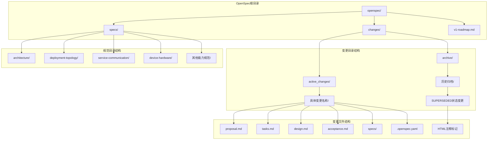
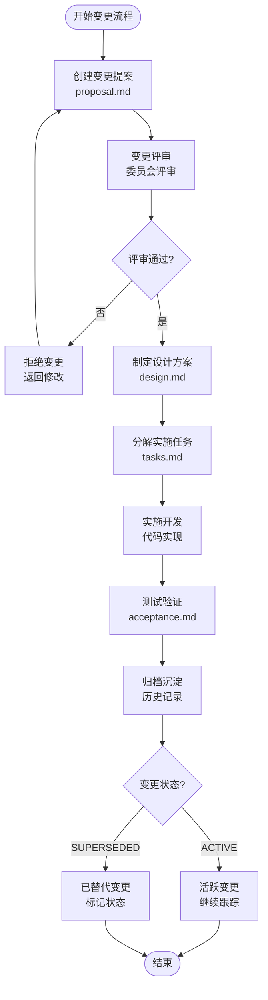
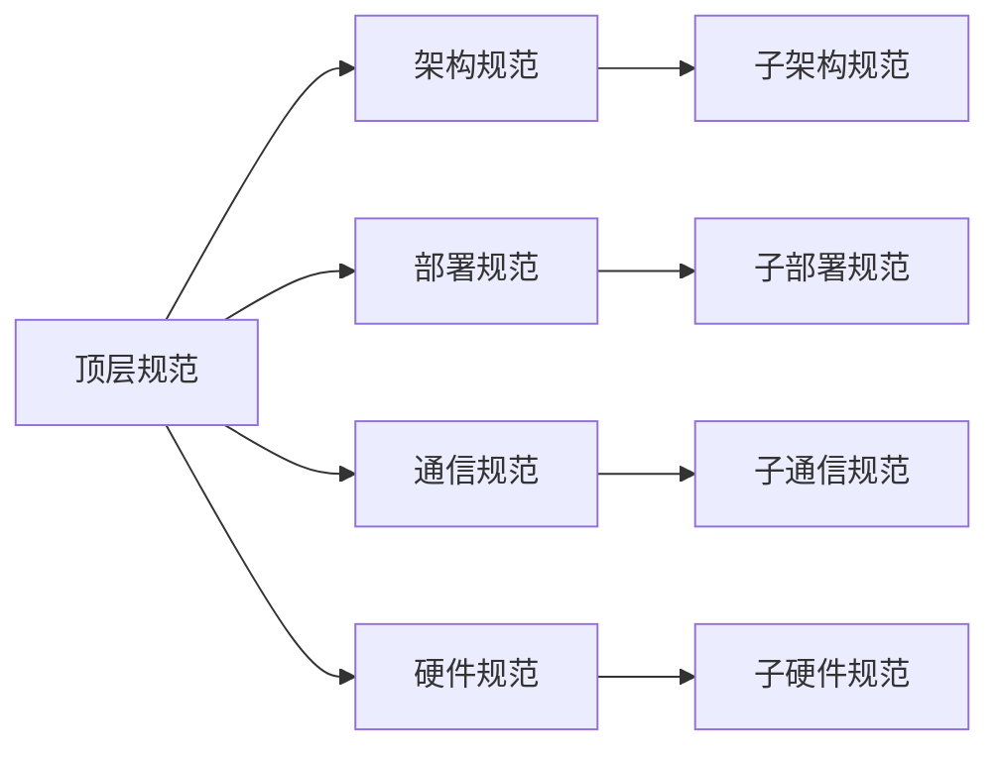
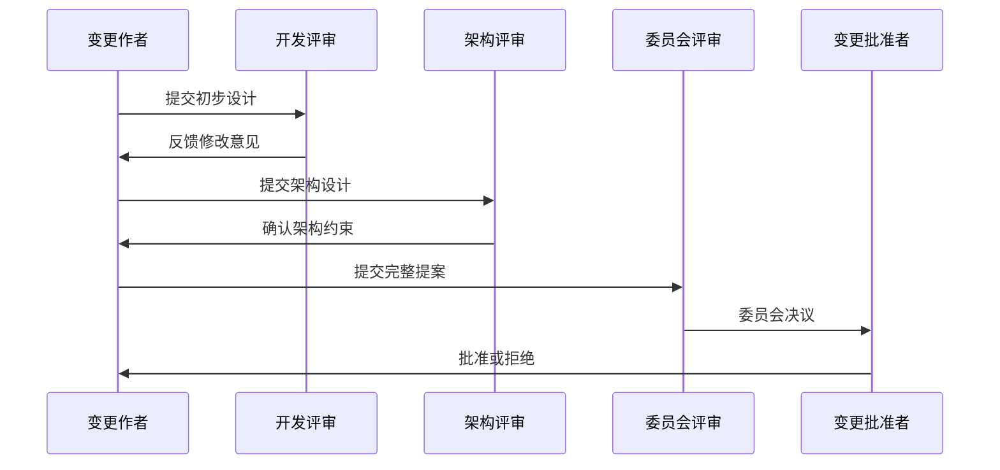
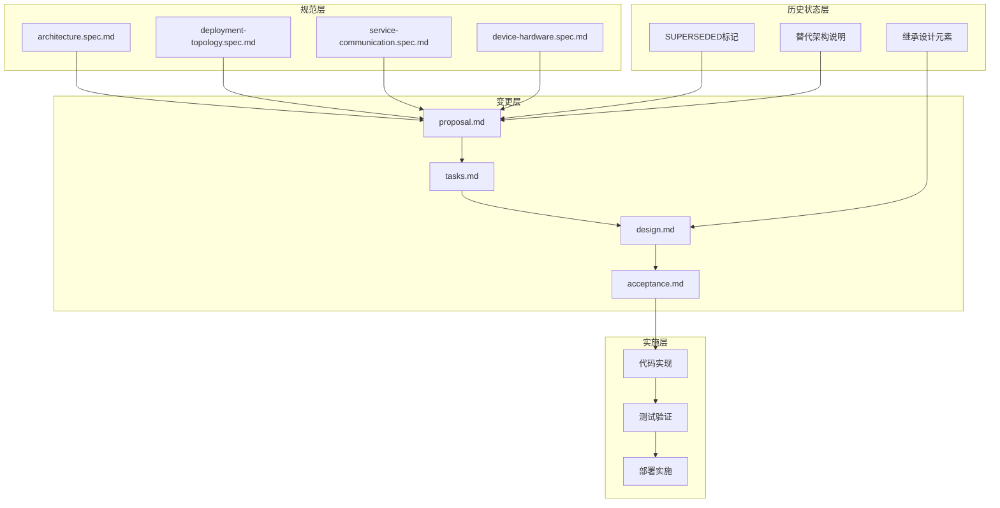
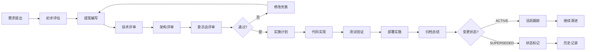

# OpenSpec变更管理

<cite>
**本文档引用的文件**
- [proposal.md](file://openspec/changes/arch-cloud-edge-split/proposal.md)
- [tasks.md](file://openspec/changes/arch-cloud-edge-split/tasks.md)
- [spec.md](file://openspec/changes/arch-cloud-edge-split/specs/architecture/spec.md)
- [.openspec.yaml](file://openspec/changes/arch-cloud-edge-split/.openspec.yaml)
- [proposal.md](file://openspec/changes/archive/2026-05-01-init-isales-common/proposal.md)
- [design.md](file://openspec/changes/archive/2026-05-01-init-isales-common/design.md)
- [design.md](file://openspec/changes/archive/2026-05-06-impl-api/design.md)
- [tasks.md](file://openspec/changes/archive/2026-05-06-impl-api/tasks.md)
- [spec.md](file://openspec/specs/deployment-topology/spec.md)
- [proposal.md](file://openspec/changes/archive/2026-05-17-impl-real-at/proposal.md)
- [v1-roadmap.md](file://openspec/v1-roadmap.md)
- [proposal.md](file://openspec/changes/pipeline-stream-and-referee/proposal.md)
- [tasks.md](file://openspec/changes/pipeline-stream-and-referee/tasks.md)
- [proposal.md](file://openspec/changes/archive/2026-05-29-prompt-template-vars-SUPERSEDED/proposal.md)
- [proposal.md](file://openspec/changes/archive/2026-05-29-engine-judge-dialog-context/proposal.md)
- [design.md](file://openspec/changes/archive/2026-05-29-engine-judge-dialog-context/design.md)
- [proposal.md](file://openspec/changes/archive/2026-05-08-impl-web-polish/proposal.md)
- [tasks.md](file://openspec/changes/archive/2026-05-08-impl-web-polish/tasks.md)
- [design.md](file://openspec/changes/archive/2026-05-08-impl-web-polish/design.md)
- [proposal.md](file://openspec/changes/archive/2026-05-29-prompt-template-vars-SUPERSEDED/proposal.md)
- [tasks.md](file://openspec/changes/archive/2026-05-29-prompt-template-vars-SUPERSEDED/tasks.md)
- [design.md](file://openspec/changes/archive/2026-05-29-prompt-template-vars-SUPERSEDED/design.md)
</cite>

## 更新摘要
**所做更改**
- 新增了历史变更标记为SUPERSEDED的状态说明和管理机制
- 更新了变更跟踪机制章节，增加了对已废弃提案的完整管理策略
- 完善了变更评审流程，明确了历史提案的处理方式和替代架构的识别机制
- 增强了归档策略，确保废弃提案的完整记录、追溯和状态标识
- 新增了架构演进案例研究，展示了从三层AI管线到双LLM架构的技术决策过程

## 目录
1. [简介](#简介)
2. [项目结构](#项目结构)
3. [核心组件](#核心组件)
4. [架构概览](#架构概览)
5. [详细组件分析](#详细组件分析)
6. [依赖分析](#依赖分析)
7. [性能考虑](#性能考虑)
8. [故障排查指南](#故障排查指南)
9. [结论](#结论)
10. [附录](#附录)

## 简介

iSales项目的OpenSpec变更管理体系是一个完整的软件工程方法论，旨在通过规范驱动的方式管理复杂的分布式系统变更。该项目采用"规范先行、设计指导、实施跟踪、归档沉淀"的完整生命周期管理模式。

OpenSpec方法论的核心理念是"先规范后实现"，通过标准化的文档模板和严格的评审流程，确保每个变更都经过充分的设计论证和风险评估。该体系特别适用于需要跨多个仓库协作的微服务架构项目。

**更新** 本体系现已包含历史变更状态管理机制，能够有效标识和追踪已被新架构替代的旧提案。通过SUPERSEDED状态标记，项目实现了对技术演进过程的完整记录和追溯，确保架构决策的透明性和可审计性。

## 项目结构

iSales项目的OpenSpec变更管理采用层次化的文件组织结构：



**图表来源**
- [proposal.md:1-77](file://openspec/changes/arch-cloud-edge-split/proposal.md#L1-L77)
- [tasks.md:1-135](file://openspec/changes/arch-cloud-edge-split/tasks.md#L1-L135)

**章节来源**
- [proposal.md:1-77](file://openspec/changes/arch-cloud-edge-split/proposal.md#L1-L77)
- [tasks.md:1-135](file://openspec/changes/arch-cloud-edge-split/tasks.md#L1-L135)

## 核心组件

### 变更提案组件

每个OpenSpec变更都包含四个核心文档组件：

1. **proposal.md** - 变更提案文档，阐述变更的动机、范围和预期影响
2. **tasks.md** - 实施任务分解，详细列出具体的开发任务和里程碑
3. **design.md** - 设计说明文档，提供技术设计方案和架构决策
4. **acceptance.md** - 验收标准文档，定义变更的验收条件和测试标准

### 规范组件

OpenSpec体系包含多个核心规范文档：

- **architecture.spec.md** - 系统架构规范，定义整体架构原则和约束
- **deployment-topology.spec.md** - 部署拓扑规范，描述系统部署要求
- **service-communication.spec.md** - 服务通信规范，定义服务间通信协议
- **device-hardware.spec.md** - 设备硬件规范，约束硬件接口和行为

### 历史变更状态管理

**新增** 为了有效管理已被新架构替代的历史提案，OpenSpec引入了SUPERSEDED状态标记机制：

- **SUPERSEDED标记** - 通过HTML注释在提案顶部添加标记，格式为`<!-- SUPERSEDED-by: <替代架构> (替代原因说明) -->`
- **替代架构说明** - 详细说明被哪个新架构替代及其原因，如"pipeline-stream-and-referee (judge layer removed, chat-history-into-judge thinking inherited to referee)"
- **继承设计保留** - 标注哪些原有设计被新架构继承，如对话历史拼装思路被referee继承
- **完整历史记录** - 保持历史变更的完整可追溯性，包括代码实现、测试用例和文档

**章节来源**
- [proposal.md:1-125](file://openspec/changes/archive/2026-05-29-prompt-template-vars-SUPERSEDED/proposal.md#L1-L125)
- [proposal.md:168-169](file://openspec/changes/pipeline-stream-and-referee/tasks.md#L168-L169)

## 架构概览

OpenSpec变更管理采用"规范驱动"的架构模式，通过标准化的文档模板和严格的流程控制，确保变更的一致性和可追溯性。



**图表来源**
- [proposal.md:1-77](file://openspec/changes/arch-cloud-edge-split/proposal.md#L1-L77)
- [tasks.md:1-135](file://openspec/changes/arch-cloud-edge-split/tasks.md#L1-L135)

## 详细组件分析

### 变更提案编写规范

#### proposal.md模板结构

变更提案文档采用标准化的结构，确保评审委员会能够全面了解变更的影响：

**Why部分** - 阐述变更的必要性和背景
- 当前问题分析
- 业务影响评估
- 技术债务说明

**What Changes部分** - 详细描述变更内容
- 功能变更范围
- 架构调整方案
- 依赖关系变化

**Capabilities部分** - 影响的能力范围
- 新增能力说明
- 修改能力清单
- 移除能力列表

**Impact部分** - 变更影响分析
- 代码仓库影响
- 依赖关系影响
- 外部资源影响

**更新** 对于可能被替代的变更，应在What Changes部分明确标注替代架构和继承关系。

**章节来源**
- [proposal.md:1-77](file://openspec/changes/arch-cloud-edge-split/proposal.md#L1-L77)

#### tasks.md任务分解规范

任务分解文档采用清单式结构，确保实施过程的可控性：

**Sprint阶段划分** - 按开发阶段组织任务
- Sprint 0 - 准备阶段
- Sprint 1 - 基础设施
- Sprint 2 - 核心功能
- Sprint 3 - 集成测试
- Sprint 4 - 验收测试

**任务粒度控制** - 任务大小适中，便于跟踪
- 单个任务不超过2人天
- 任务间依赖关系明确
- 里程碑节点清晰

**质量保证** - 每个任务都有质量标准
- 单元测试覆盖率要求
- 代码审查标准
- 集成测试要求

**更新** 在任务分解中应包含历史变更状态检查，确保不会重复实现已被替代的功能。

**章节来源**
- [tasks.md:1-135](file://openspec/changes/arch-cloud-edge-split/tasks.md#L1-L135)

### 设计文档组织结构

#### 规范文档层次

OpenSpec规范文档采用分层组织结构：



**图表来源**
- [spec.md:1-143](file://openspec/changes/arch-cloud-edge-split/specs/architecture/spec.md#L1-L143)

#### 规范文档结构

每个规范文档包含标准的结构元素：

**Purpose部分** - 规范目的和范围
**Requirements部分** - 具体要求和约束
**Scenarios部分** - 典型场景描述
**Diagrams部分** - 架构图和流程图
**Appendices部分** - 附加信息和参考资料

**更新** 规范文档应包含历史变更状态说明，特别是当规范被新架构替代时。

**章节来源**
- [spec.md:1-143](file://openspec/changes/arch-cloud-edge-split/specs/architecture/spec.md#L1-L143)

### 变更跟踪机制

#### changes目录版本管理

OpenSpec采用基于时间戳的目录命名规范：

```
changes/
├── 2026-05-01-init-isales-common/
├── 2026-05-06-impl-api/
├── 2026-05-06-impl-scheduler/
├── arch-cloud-edge-split/
└── pipeline-stream-and-referee/
```

每个变更目录包含完整的变更生命周期文档。

#### archive归档策略

归档采用两级结构：

**active_changes目录** - 当前活跃变更
**archive目录** - 已完成归档变更

归档标准：
- 变更完全实现并通过验收
- 相关文档完整归档
- 代码合并到主分支

**更新** 新增SUPERSEDED状态管理：

**SUPERSEDED状态标记**：
- 在提案顶部添加HTML注释标记：`<!-- SUPERSEDED-by: <替代架构> (替代原因说明) -->`
- 说明被哪个新架构替代及其原因
- 标注继承的设计元素
- 保持完整的历史记录

**历史变更处理**：
- 2026-05-29-prompt-template-vars-SUPERSEDED - 被pipeline-stream-and-referee架构替代
- 2026-05-29-engine-judge-dialog-context - 被pipeline-stream-and-referee架构替代  
- 2026-05-08-impl-web-polish - 被pipeline-stream-and-referee架构替代

**章节来源**
- [proposal.md:1-33](file://openspec/changes/archive/2026-05-01-init-isales-common/proposal.md#L1-L33)
- [proposal.md:168-169](file://openspec/changes/pipeline-stream-and-referee/tasks.md#L168-L169)

### 实施跟踪流程

#### 评审流程

OpenSpec变更采用多层次评审机制：



**图表来源**
- [proposal.md:1-77](file://openspec/changes/arch-cloud-edge-split/proposal.md#L1-L77)

#### 决策机制

变更决策采用"多数通过"原则：

- 技术可行性必须获得通过
- 业务影响评估需要同意
- 风险控制措施必须完善
- 影响范围需要确认

**更新** 新增历史变更状态检查机制：

**历史变更审查**：
- 检查是否存在替代架构
- 评估变更的必要性
- 确认是否需要继承设计元素
- 避免重复开发已被替代的功能

### OpenSpec工具链使用方法

#### 命令行工具

OpenSpec提供专门的命令行工具支持：

**/opsx:propose** - 创建新的变更提案
**/opsx:review** - 启动变更评审流程  
**/opsx:archive** - 归档已完成变更

#### 最佳实践

1. **模板复用** - 使用标准模板确保文档一致性
2. **渐进式实施** - 将大变更分解为多个小变更
3. **持续验证** - 在实施过程中持续进行验证
4. **知识沉淀** - 及时更新相关文档和最佳实践
5. **历史追踪** - 有效管理历史变更状态

**更新** 新增历史变更管理最佳实践：

**历史变更管理**：
- 定期审查历史变更状态
- 及时标记被替代的提案
- 保持历史记录的完整性
- 提供清晰的替代架构说明

**章节来源**
- [v1-roadmap.md:207-576](file://openspec/v1-roadmap.md#L207-L576)

## 依赖分析

OpenSpec变更管理体现了良好的依赖关系设计：



**图表来源**
- [spec.md:1-143](file://openspec/changes/arch-cloud-edge-split/specs/architecture/spec.md#L1-L143)
- [proposal.md:1-77](file://openspec/changes/arch-cloud-edge-split/proposal.md#L1-L77)

**章节来源**
- [spec.md:1-414](file://openspec/specs/deployment-topology/spec.md#L1-L414)

## 性能考虑

OpenSpec变更管理在性能方面的特点：

1. **文档检索效率** - 采用标准化结构，便于快速定位信息
2. **变更影响评估** - 通过规范约束减少不必要的变更
3. **实施效率提升** - 标准化流程减少沟通成本
4. **知识传承效果** - 完整的归档机制确保经验积累
5. **历史变更追踪** - 有效避免重复开发已被替代的功能

**更新** 新增历史变更管理性能优势：

**历史变更管理效率**：
- 减少重复开发工作量
- 避免技术债务累积
- 提高团队协作效率
- 保持架构演进的连续性

## 故障排查指南

### 常见问题及解决方案

**变更评审被拒**
- 重新审视变更的必要性和影响
- 完善风险评估和缓解措施
- 与相关利益方充分沟通

**实施进度滞后**
- 检查任务分解是否合理
- 评估资源分配是否充足
- 调整实施计划和优先级

**文档不完整**
- 按照标准模板补充缺失内容
- 确保文档间的引用关系正确
- 进行交叉验证确保一致性

**历史变更冲突**
- 检查是否存在替代架构
- 确认变更的必要性
- 避免重复实现已被替代的功能
- 及时更新历史变更状态标记

**更新** 新增历史变更冲突处理：

**历史变更冲突解决**：
- 识别SUPERSEDED标记的变更提案
- 评估替代架构的完整性和稳定性
- 确认继承的设计元素和接口兼容性
- 避免重复实现已被替代的功能模块

**章节来源**
- [design.md:106-117](file://openspec/changes/archive/2026-05-01-init-isales-common/design.md#L106-L117)

## 结论

iSales项目的OpenSpec变更管理体系展现了现代软件工程的最佳实践。通过规范驱动的方法论、标准化的文档模板、严格的评审流程和完善的归档机制，该体系有效地管理了复杂的分布式系统变更。

**更新** 该体系现已具备完善的历史变更状态管理能力，能够有效标识和追踪已被新架构替代的旧提案，确保技术演进的连续性和完整性。

该体系的核心优势在于：

1. **可追溯性** - 完整的变更历史记录，包括SUPERSEDED状态标记
2. **可重复性** - 标准化的实施流程
3. **可扩展性** - 支持大规模团队协作
4. **可持续性** - 持续的知识积累和传承
5. **历史完整性** - 有效管理技术演进过程中的变更状态

对于其他采用微服务架构的项目，iSales的OpenSpec实践提供了宝贵的参考和借鉴价值，特别是其创新的历史变更状态管理机制。

**更新** 基于对架构演进案例的研究，OpenSpec体系展示了如何通过规范驱动的方法管理重大架构变更：

**架构演进案例**：
- 从三层AI管线（role/judge/polish）到双LLM架构（main/referee）
- 通过SUPERSEDED状态标记确保技术决策的透明性
- 通过继承机制保留有价值的设计元素
- 通过完整归档确保历史经验的传承

## 附录

### 变更管理流程图



### 关键术语表

- **OpenSpec** - 开放规范方法论
- **变更提案** - 描述变更需求和方案的文档
- **实施任务** - 具体的开发和测试任务
- **归档** - 变更完成后的历史记录保存
- **评审** - 变更的评估和批准过程
- **SUPERSEDED** - 已被替代的变更状态标记
- **替代架构** - 取代旧架构的新架构方案
- **继承设计** - 从旧架构继承的设计元素

### 历史变更状态管理示例

**被替代的变更示例**：
- `2026-05-29-prompt-template-vars-SUPERSEDED` - 被pipeline-stream-and-referee架构替代
- `2026-05-29-engine-judge-dialog-context` - 被pipeline-stream-and-referee架构替代
- `2026-05-08-impl-web-polish` - 被pipeline-stream-and-referee架构替代

**SUPERSEDED标记格式**：
```html
<!-- SUPERSEDED-by: pipeline-stream-and-referee (judge layer removed, chat-history-into-judge thinking inherited to referee) -->
```

**更新** 历史变更管理的架构演进案例：

**架构演进决策过程**：
1. **问题识别** - 三层AI管线导致6.5-9.5秒端到端延迟
2. **替代方案** - 双LLM架构（main LLM + referee LLM）
3. **设计验证** - 通过实证测试验证新架构的有效性
4. **状态标记** - 对被替代的变更进行SUPERSEDED标记
5. **继承保留** - 保留对话历史拼装的设计思路到新架构

**历史变更管理流程**：
1. 识别需要替代的旧架构提案
2. 评估新架构的完整性和稳定性
3. 在提案顶部添加SUPERSEDED标记
4. 说明替代原因和继承的设计元素
5. 保持完整的历史记录和代码实现
6. 通过归档机制沉淀技术决策经验